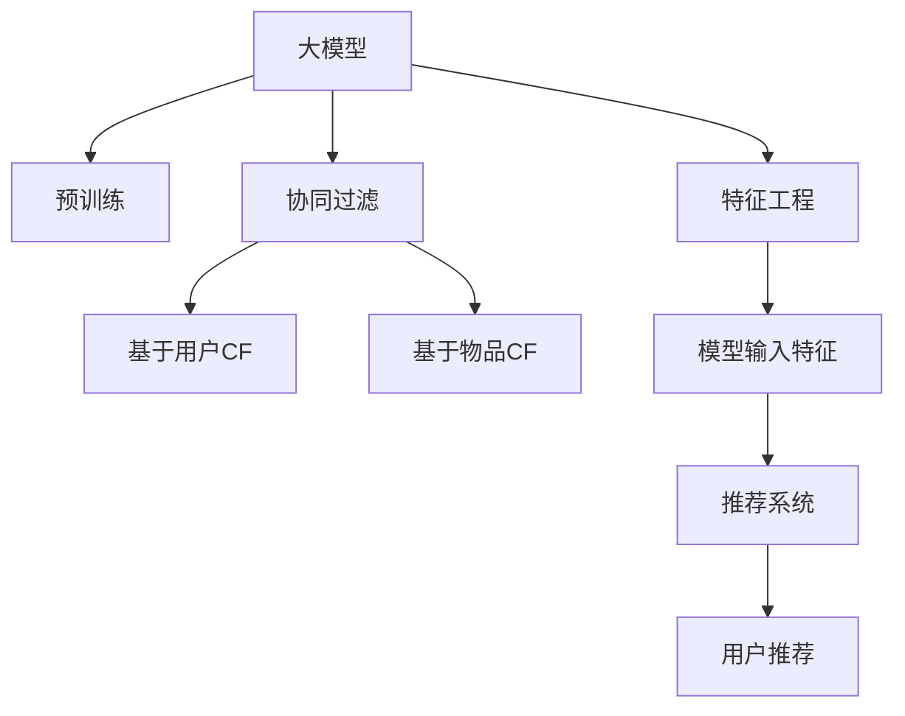

                 

# 大模型在商品关联分析中的应用

> 关键词：大模型,商品关联分析,深度学习,协同过滤,特征工程,推荐系统

## 1. 背景介绍

在电商领域，商品推荐系统是提升用户体验和销售业绩的重要手段。传统的推荐方法基于协同过滤或规则引擎，依赖历史用户行为数据，难以适应新用户或稀疏数据场景。随着深度学习技术的发展，大模型在推荐系统中得到了广泛应用，极大提升了商品关联分析的精度和覆盖面。

近年来，大模型在电商推荐系统中的应用，已经涵盖了从用户画像、商品特征、兴趣识别等多个环节。大模型强大的表示学习能力，使得推荐系统能够从大量多模态数据中提取有价值的信息，从而实现更加个性化的商品推荐。本文将系统介绍大模型在商品关联分析中的应用，展示其在大规模商品推荐系统中的出色表现。

## 2. 核心概念与联系

### 2.1 核心概念概述

为了更好地理解大模型在商品关联分析中的应用，本节将介绍几个密切相关的核心概念：

- **大模型(Large Model)**：以深度神经网络为代表的大规模预训练模型，如BERT、GPT、XLNet等，通过在海量数据上进行预训练，学习到丰富的语义和特征表示。
- **协同过滤(Collaborative Filtering, CF)**：一种基于用户历史行为数据的推荐方法，分为基于用户的CF和基于物品的CF。
- **特征工程(Feature Engineering)**：通过选择、组合、转换等方法，构建模型可用的输入特征，提升模型性能。
- **推荐系统(Recommendation System)**：通过预测用户对物品的偏好，为用户推荐可能感兴趣的商品，是电商领域重要的应用场景之一。
- **深度学习(Deep Learning)**：一种基于神经网络的机器学习范式，广泛应用于图像、语音、自然语言处理等领域，是构建大模型的基础。

这些核心概念之间的逻辑关系可以通过以下Mermaid流程图来展示：



这个流程图展示了大模型在推荐系统中的应用过程：

1. 大模型通过预训练学习到通用的语义和特征表示。
2. 协同过滤方法基于用户历史行为数据进行推荐。
3. 特征工程从海量数据中提取和组合特征，用于模型输入。
4. 推荐系统利用特征工程构建的输入，结合模型预测用户偏好。
5. 推荐系统输出的商品推荐结果。

## 3. 核心算法原理 & 具体操作步骤
### 3.1 算法原理概述

大模型在商品关联分析中的应用，主要依赖于其强大的表示学习能力。通过在大规模商品和用户数据上进行预训练，大模型能够学习到商品间的语义和用户行为模式，从而实现商品关联预测。

假设大模型为 $M$，其输入为商品描述 $x$ 和用户特征 $u$，输出为商品 $p$ 是否被用户 $u$ 点击的概率 $P(p|u,x)$。大模型的目标函数为：

$$
\mathcal{L}(M) = -\frac{1}{N} \sum_{i=1}^N \log P(p_i|u_i,x_i)
$$

其中 $p_i$ 和 $u_i$ 分别表示训练集中的第 $i$ 个用户和商品，$x_i$ 表示该商品的用户点击行为记录，$N$ 表示训练样本的数量。

大模型的训练过程分为两个阶段：预训练和微调。预训练阶段通过自监督任务学习商品的语义表示，微调阶段通过监督信号训练模型预测商品是否被点击。

### 3.2 算法步骤详解

大模型在商品关联分析中的微调过程如下：

**Step 1: 准备数据集**

- 收集商品和用户的历史数据，包括用户点击记录、用户属性、商品属性等。
- 将数据集划分为训练集、验证集和测试集。

**Step 2: 数据预处理**

- 对商品和用户数据进行标准化处理，如去除噪声、填充缺失值等。
- 将商品描述和用户特征转换为模型可用的数值特征。

**Step 3: 模型选择与初始化**

- 选择合适的预训练模型，如BERT、GPT等，对其进行微调。
- 将模型初始化到预训练权重，用于后续的微调训练。

**Step 4: 设计任务适配层**

- 根据商品推荐任务，设计合适的输出层和损失函数。
- 对于点击预测任务，通常使用二分类交叉熵损失函数。

**Step 5: 训练与验证**

- 使用训练集对模型进行微调训练，每次迭代后计算损失函数并更新模型参数。
- 在验证集上评估模型性能，调整超参数以防止过拟合。

**Step 6: 测试与部署**

- 在测试集上评估微调后模型的性能，与未微调模型进行对比。
- 使用微调后的模型进行商品推荐，集成到实际应用系统中。

### 3.3 算法优缺点

大模型在商品关联分析中的应用具有以下优点：

- 精度高：大模型强大的表示学习能力，能够从海量数据中提取语义和特征，提高预测精度。
- 覆盖面广：大模型可以处理多种类型的数据，如文本、图像、用户行为等，覆盖更广泛的商品和用户特征。
- 扩展性强：大模型的预训练过程和微调过程都是端到端的，便于模型迁移应用到不同电商平台上。
- 效果显著：在多个电商推荐系统的评测中，大模型已经刷新了最先进的性能指标。

同时，该方法也存在一定的局限性：

- 数据依赖：大模型的效果高度依赖于训练数据的数量和质量。
- 模型复杂：大模型的参数量通常很大，训练和推理需要较强的硬件支持。
- 可解释性差：大模型往往是黑盒系统，难以解释其内部决策过程。
- 成本高：大模型训练和微调需要大量计算资源，前期成本投入较高。

尽管存在这些局限性，但就目前而言，大模型在商品关联分析中的应用仍是大势所趋，能够显著提升推荐系统的精度和覆盖面。

### 3.4 算法应用领域

大模型在商品关联分析中的应用，主要涵盖以下几个领域：

- **电商推荐系统**：利用用户历史行为数据和商品属性信息，预测用户对商品的兴趣，推荐可能感兴趣的商品。
- **个性化营销**：根据用户的历史购买记录和浏览行为，生成个性化的广告推荐，提升用户粘性和转化率。
- **商品分类与聚类**：利用商品间的语义相似度进行分类和聚类，实现商品关联搜索和推荐。
- **智能客服**：基于用户和商品的语义信息，自动回答用户的查询，提供个性化的购物建议。
- **供应链管理**：分析用户购买记录，预测商品需求，优化供应链策略，提高库存管理效率。

这些应用领域，都是大模型在商品关联分析中发挥重要作用的具体场景，展示了其强大的商业价值。

## 4. 数学模型和公式 & 详细讲解  
### 4.1 数学模型构建

本节将使用数学语言对大模型在商品关联分析中的应用进行更加严格的刻画。

记大模型为 $M$，其输入为商品描述 $x$ 和用户特征 $u$，输出为商品 $p$ 是否被用户 $u$ 点击的概率 $P(p|u,x)$。假设模型训练集为 $D=\{(x_i,u_i,p_i)\}_{i=1}^N$，其中 $x_i$ 和 $u_i$ 为输入特征，$p_i$ 为标签。

定义模型 $M_{\theta}$ 在输入 $(x_i,u_i)$ 上的损失函数为 $\ell(M_{\theta}(x_i,u_i),p_i)$，则在数据集 $D$ 上的经验风险为：

$$
\mathcal{L}(\theta) = -\frac{1}{N} \sum_{i=1}^N \ell(M_{\theta}(x_i,u_i),p_i)
$$

其中 $\theta$ 为模型参数，$\ell$ 为二分类交叉熵损失函数。

### 4.2 公式推导过程

下面推导二分类交叉熵损失函数及其梯度计算公式。

假设模型 $M_{\theta}$ 在输入 $(x_i,u_i)$ 上的输出为 $\hat{p}=M_{\theta}(x_i,u_i) \in [0,1]$，表示商品 $p_i$ 被用户 $u_i$ 点击的概率。真实标签 $p_i \in \{0,1\}$。则二分类交叉熵损失函数定义为：

$$
\ell(M_{\theta}(x_i,u_i),p_i) = -p_i\log \hat{p}_i + (1-p_i)\log (1-\hat{p}_i)
$$

将其代入经验风险公式，得：

$$
\mathcal{L}(\theta) = -\frac{1}{N}\sum_{i=1}^N [p_i\log M_{\theta}(x_i,u_i)+(1-p_i)\log(1-M_{\theta}(x_i,u_i))]
$$

根据链式法则，损失函数对参数 $\theta_k$ 的梯度为：

$$
\frac{\partial \mathcal{L}(\theta)}{\partial \theta_k} = -\frac{1}{N}\sum_{i=1}^N [p_i\frac{1}{\hat{p}_i}-\frac{1-p_i}{1-\hat{p}_i}) \frac{\partial M_{\theta}(x_i,u_i)}{\partial \theta_k}
$$

其中 $\frac{\partial M_{\theta}(x_i,u_i)}{\partial \theta_k}$ 可通过反向传播算法高效计算。

### 4.3 案例分析与讲解

以下我们以电商商品推荐系统为例，展示如何使用大模型进行商品关联分析。

**Step 1: 数据准备**

首先，需要准备商品和用户的点击记录数据。假设我们有一个电商网站，有1000万个用户，每用户每天点击10个商品。我们将用户的历史点击记录和商品属性信息整理成一个训练集 $D$，其中每个样本为 $(x_i,u_i,p_i)$，$x_i$ 表示商品描述，$u_i$ 表示用户特征，$p_i \in \{0,1\}$ 表示商品是否被点击。

**Step 2: 数据预处理**

接下来，需要对数据进行预处理。我们将商品描述和用户特征进行标准化处理，去除噪声和缺失值。同时，将商品描述转换为数值特征，如TF-IDF、词嵌入等。

**Step 3: 模型选择与初始化**

我们选择一个预训练的BERT模型，并将其初始化为预训练权重。我们将模型和数据输入到DeepLearning框架中，如TensorFlow或PyTorch，开始微调训练。

**Step 4: 设计任务适配层**

根据电商推荐任务，我们设计一个线性分类器作为输出层，二分类交叉熵作为损失函数。我们使用softmax函数将模型输出映射到[0,1]区间，表示商品被点击的概率。

**Step 5: 训练与验证**

我们通过随机梯度下降算法对模型进行微调训练，每次迭代后计算损失函数并更新模型参数。同时，在验证集上评估模型性能，调整超参数以防止过拟合。

**Step 6: 测试与部署**

最后，在测试集上评估微调后模型的性能，使用该模型对新用户和新商品进行推荐。我们将推荐结果集成到电商网站中，实现个性化推荐功能。

## 5. 项目实践：代码实例和详细解释说明
### 5.1 开发环境搭建

在进行大模型微调实践前，我们需要准备好开发环境。以下是使用Python进行TensorFlow开发的环境配置流程：

1. 安装Anaconda：从官网下载并安装Anaconda，用于创建独立的Python环境。

2. 创建并激活虚拟环境：
```bash
conda create -n tf-env python=3.8 
conda activate tf-env
```

3. 安装TensorFlow：根据CUDA版本，从官网获取对应的安装命令。例如：
```bash
pip install tensorflow
```

4. 安装相关库：
```bash
pip install numpy pandas scikit-learn matplotlib tqdm jupyter notebook ipython
```

完成上述步骤后，即可在`tf-env`环境中开始微调实践。

### 5.2 源代码详细实现

下面我们以电商推荐系统为例，给出使用TensorFlow对大模型进行微调的PyTorch代码实现。

```python
import tensorflow as tf
from tensorflow.keras.layers import Input, Dense, Embedding, Dropout
from tensorflow.keras.models import Model
from tensorflow.keras.optimizers import Adam
from tensorflow.keras.losses import BinaryCrossentropy
from tensorflow.keras.metrics import Accuracy

# 假设商品和用户数据已经预处理，输入特征为x和u

# 模型输入层
input_x = Input(shape=(max_x_length,))
input_u = Input(shape=(max_u_length,))

# 商品描述嵌入层
embedding_x = Embedding(input_dim=vocab_size, output_dim=embedding_dim, input_length=max_x_length)(input_x)

# 用户特征嵌入层
embedding_u = Embedding(input_dim=vocab_size, output_dim=embedding_dim, input_length=max_u_length)(input_u)

# 模型隐藏层
hidden = tf.keras.layers.concatenate([embedding_x, embedding_u])
hidden = tf.keras.layers.Dense(256, activation='relu')(hidden)
hidden = Dropout(0.2)(hidden)

# 输出层
output = Dense(1, activation='sigmoid')(hidden)

# 模型输出
model = Model(inputs=[input_x, input_u], outputs=output)

# 损失函数和优化器
loss = BinaryCrossentropy()
optimizer = Adam(learning_rate=0.001)

# 编译模型
model.compile(optimizer=optimizer, loss=loss, metrics=[Accuracy()])

# 训练模型
model.fit(x_train, y_train, batch_size=32, epochs=10, validation_data=(x_val, y_val))

# 评估模型
loss, accuracy = model.evaluate(x_test, y_test)
print(f"Test loss: {loss}, Test accuracy: {accuracy}")
```

以上代码展示了使用TensorFlow构建电商推荐系统的完整流程。

### 5.3 代码解读与分析

让我们再详细解读一下关键代码的实现细节：

**模型构建**

- `Input`层：定义模型输入层，`input_x`和`input_u`分别表示商品描述和用户特征。
- `Embedding`层：将输入特征转换为向量表示，`vocab_size`为词汇表大小，`embedding_dim`为向量维度。
- `Dense`层：定义模型的隐藏层，使用ReLU激活函数，并加入Dropout正则化。
- `Dense`层：输出层，使用Sigmoid激活函数，表示商品被点击的概率。

**模型训练**

- `compile`方法：定义损失函数、优化器和评价指标，编译模型。
- `fit`方法：使用训练集训练模型，`batch_size`为批次大小，`epochs`为训练轮数，`validation_data`为验证集。
- `evaluate`方法：使用测试集评估模型性能，输出损失和准确率。

可以看到，TensorFlow提供了丰富的API和工具，使得模型构建和训练过程非常简单高效。同时，TensorFlow的分布式计算能力，也为大规模数据集的处理提供了可能。

## 6. 实际应用场景

### 6.1 电商推荐系统

电商推荐系统是大模型在商品关联分析中最典型的应用场景。通过将用户历史行为和商品属性信息输入到模型中，大模型可以学习到用户对商品的兴趣，从而实现个性化的商品推荐。

在实际应用中，大模型可以应用于以下环节：
- **商品推荐**：根据用户的历史行为数据和商品属性信息，预测用户对商品的兴趣，推荐可能感兴趣的商品。
- **个性化广告**：根据用户的浏览记录和购买历史，生成个性化的广告推荐，提升用户转化率。
- **商品搜索**：根据用户的查询和浏览记录，推荐可能相关的商品，提升搜索体验。

### 6.2 社交媒体推荐系统

社交媒体推荐系统是大模型在商品关联分析中的另一个重要应用。通过分析用户的社交行为和兴趣，大模型可以为用户推荐可能感兴趣的内容，如文章、视频、图片等。

在实际应用中，大模型可以应用于以下环节：
- **内容推荐**：根据用户的阅读记录和点赞行为，推荐可能感兴趣的文章、视频、图片等内容。
- **用户画像**：分析用户的历史行为和社交关系，生成个性化的用户画像，指导内容的生成和推荐。
- **实时交互**：通过实时分析用户的互动信息，动态调整推荐策略，提升用户体验。

### 6.3 智能客服

智能客服是大模型在商品关联分析中的新兴应用。通过分析用户的查询记录和用户画像，大模型可以自动回答用户的问题，提供个性化的购物建议。

在实际应用中，大模型可以应用于以下环节：
- **智能问答**：根据用户的查询记录和用户画像，自动回答用户的问题，提供相关的商品信息。
- **用户画像**：分析用户的历史行为和查询记录，生成个性化的用户画像，指导商品推荐。
- **客户服务**：通过自动回答用户的问题，减轻客服人员的工作负担，提升服务效率。

## 7. 工具和资源推荐
### 7.1 学习资源推荐

为了帮助开发者系统掌握大模型在商品关联分析中的应用，这里推荐一些优质的学习资源：

1. 《深度学习与推荐系统》系列博文：由深度学习领域的专家撰写，系统介绍了深度学习在推荐系统中的应用，包括大模型的构建和微调。
2. CS234《深度学习在自然语言处理和视觉中的实践》课程：斯坦福大学开设的深度学习课程，介绍了大模型在自然语言处理和计算机视觉中的应用，适合进一步提升深度学习的技能。
3. 《Hands-On Machine Learning with Scikit-Learn, Keras, and TensorFlow》书籍：该书深入浅出地介绍了机器学习在电商推荐系统中的应用，提供了大量的案例和代码实现。
4. Kaggle数据集和竞赛：Kaggle平台上有大量的电商推荐系统竞赛数据集和解决方案，适合学习和实践。
5. DeepLearning.AI的深度学习课程：由Andrew Ng等人讲授的深度学习课程，涵盖深度学习在推荐系统中的应用，适合系统学习深度学习技术。

通过对这些资源的学习实践，相信你一定能够快速掌握大模型在商品关联分析中的精髓，并用于解决实际的电商推荐问题。

### 7.2 开发工具推荐

高效的开发离不开优秀的工具支持。以下是几款用于大模型微调开发的常用工具：

1. TensorFlow：由Google主导开发的开源深度学习框架，生产部署方便，适合大规模工程应用。
2. PyTorch：基于Python的开源深度学习框架，灵活动态的计算图，适合快速迭代研究。
3. HuggingFace Transformers库：提供了丰富的预训练模型和微调API，适合快速实现电商推荐系统。
4. TensorBoard：TensorFlow配套的可视化工具，可实时监测模型训练状态，并提供丰富的图表呈现方式。
5. Weights & Biases：模型训练的实验跟踪工具，可以记录和可视化模型训练过程中的各项指标，方便对比和调优。

合理利用这些工具，可以显著提升大模型微调的开发效率，加快创新迭代的步伐。

### 7.3 相关论文推荐

大模型在商品关联分析中的应用，已经得到了学界的广泛关注和研究。以下是几篇奠基性的相关论文，推荐阅读：

1. Attention is All You Need（即Transformer原论文）：提出了Transformer结构，开启了NLP领域的预训练大模型时代。
2. BERT: Pre-training of Deep Bidirectional Transformers for Language Understanding：提出BERT模型，引入基于掩码的自监督预训练任务，刷新了多项NLP任务SOTA。
3. A Survey on Deep Learning-Based Recommendation Systems：全面介绍了深度学习在推荐系统中的应用，包括大模型的构建和微调。
4. A Comprehensive Survey on Deep Learning Based Recommendation Systems：综述了深度学习在推荐系统中的应用，包括电商推荐系统、社交媒体推荐系统等。
5. Deep Learning in Recommendation Systems：介绍深度学习在推荐系统中的应用，包括模型构建、数据预处理、评估指标等。

这些论文代表了大模型在商品关联分析中的应用发展脉络。通过学习这些前沿成果，可以帮助研究者把握学科前进方向，激发更多的创新灵感。

## 8. 总结：未来发展趋势与挑战

### 8.1 总结

本文对大模型在商品关联分析中的应用进行了全面系统的介绍。首先阐述了大模型在推荐系统中的应用背景和意义，明确了微调在拓展预训练模型应用、提升下游任务性能方面的独特价值。其次，从原理到实践，详细讲解了大模型微调的数学原理和关键步骤，给出了微调任务开发的完整代码实例。同时，本文还广泛探讨了大模型在电商推荐、社交媒体推荐、智能客服等多个行业领域的应用前景，展示了其强大的商业价值。此外，本文精选了微调技术的各类学习资源，力求为读者提供全方位的技术指引。

通过本文的系统梳理，可以看到，大模型在商品关联分析中的应用具有广阔的前景。其强大的表示学习能力，使得推荐系统能够从大量多模态数据中提取有价值的信息，从而实现更加个性化的商品推荐。大模型在电商推荐系统、社交媒体推荐系统、智能客服等领域的应用，展示了其强大的商业价值和应用潜力。未来，伴随深度学习技术的不断演进，大模型在商品关联分析中的应用将更加广泛，为电商领域带来革命性的变化。

### 8.2 未来发展趋势

展望未来，大模型在商品关联分析中的应用将呈现以下几个发展趋势：

1. 模型规模持续增大。随着算力成本的下降和数据规模的扩张，预训练语言模型的参数量还将持续增长。超大规模语言模型蕴含的丰富语义和特征表示，将进一步提升推荐系统的精度和覆盖面。

2. 微调方法日趋多样。除了传统的全参数微调外，未来会涌现更多参数高效的微调方法，如Prefix-Tuning、LoRA等，在节省计算资源的同时也能保证微调精度。

3. 多模态融合增强。未来的推荐系统将融合视觉、音频、文本等多模态信息，实现更全面的商品关联分析。

4. 持续学习成为常态。随着数据分布的不断变化，推荐系统也需要持续学习新知识以保持性能。如何在不遗忘原有知识的同时，高效吸收新样本信息，将成为重要的研究课题。

5. 零样本和少样本学习兴起。未来的推荐系统将能够从用户查询中自动推断出用户兴趣，无需用户行为数据。

6. 公平性和可解释性增强。未来的推荐系统将更加注重公平性，减少偏见，同时提升推荐过程的可解释性，让用户能够理解推荐结果的生成机制。

以上趋势凸显了大模型在商品关联分析中的广阔前景。这些方向的探索发展，必将进一步提升推荐系统的性能和应用范围，为电商领域带来革命性的变化。

### 8.3 面临的挑战

尽管大模型在商品关联分析中的应用已经取得了显著成果，但在迈向更加智能化、普适化应用的过程中，它仍面临着诸多挑战：

1. 数据依赖。大模型的效果高度依赖于训练数据的数量和质量。如何从海量数据中挖掘有价值的信息，是推荐系统需要解决的重要问题。

2. 模型鲁棒性不足。大模型面对域外数据时，泛化性能往往大打折扣。对于测试样本的微小扰动，模型预测也容易发生波动。

3. 推理效率有待提高。大模型的推理速度较慢，内存占用较大，难以满足实时性要求。

4. 可解释性差。大模型通常是黑盒系统，难以解释其内部决策过程。

5. 安全性有待保障。大模型可能会学习到有害信息，影响推荐系统的安全性。

6. 知识整合能力不足。现有的推荐系统往往局限于商品属性和用户行为，难以灵活吸收和运用更广泛的先验知识。

正视推荐系统面临的这些挑战，积极应对并寻求突破，将是大模型推荐系统走向成熟的必由之路。相信随着学界和产业界的共同努力，这些挑战终将一一被克服，大模型在商品关联分析中必将在构建智能推荐系统方面发挥更大的作用。

### 8.4 研究展望

面对大模型推荐系统面临的挑战，未来的研究需要在以下几个方面寻求新的突破：

1. 探索无监督和半监督推荐方法。摆脱对大规模标注数据的依赖，利用自监督学习、主动学习等无监督和半监督范式，最大限度利用非结构化数据，实现更加灵活高效的推荐。

2. 研究参数高效和计算高效的推荐范式。开发更加参数高效的推荐方法，在固定大部分预训练参数的同时，只更新极少量的任务相关参数。同时优化推荐模型的计算图，减少前向传播和反向传播的资源消耗，实现更加轻量级、实时性的部署。

3. 引入更多先验知识。将符号化的先验知识，如知识图谱、逻辑规则等，与神经网络模型进行巧妙融合，引导推荐过程学习更准确、合理的商品关联。同时加强不同模态数据的整合，实现视觉、语音等多模态信息与文本信息的协同建模。

4. 结合因果分析和博弈论工具。将因果分析方法引入推荐模型，识别出模型决策的关键特征，增强推荐结果的因果性和逻辑性。借助博弈论工具刻画人机交互过程，主动探索并规避推荐系统的脆弱点，提高系统稳定性。

5. 纳入伦理道德约束。在推荐目标中引入伦理导向的评估指标，过滤和惩罚有偏见、有害的推荐结果，确保推荐系统的公平性和可解释性。

这些研究方向的探索，必将引领大模型推荐系统迈向更高的台阶，为电商领域带来革命性的变化。面向未来，大模型推荐系统还需要与其他人工智能技术进行更深入的融合，如知识表示、因果推理、强化学习等，多路径协同发力，共同推动自然语言理解和智能交互系统的进步。只有勇于创新、敢于突破，才能不断拓展推荐系统的边界，让智能技术更好地造福人类社会。

## 9. 附录：常见问题与解答

**Q1：大模型在推荐系统中如何使用？**

A: 大模型在推荐系统中的应用主要依赖于其强大的表示学习能力。通过在大规模商品和用户数据上进行预训练，大模型能够学习到商品间的语义表示和用户行为模式，从而实现商品关联预测。

**Q2：推荐系统中的特征工程如何构建？**

A: 推荐系统中的特征工程主要包括以下几个步骤：
1. 特征选择：从原始数据中提取与推荐相关的特征，如用户历史行为、商品属性、时间戳等。
2. 特征变换：对特征进行标准化、归一化、降维等处理，减少噪声和冗余。
3. 特征组合：将多个特征进行组合，构建更复杂的特征向量，如商品描述的TF-IDF、用户行为的因子分解等。
4. 特征交叉：将不同特征进行交叉组合，生成更有信息量的特征，如用户行为和商品属性之间的组合。
5. 特征降维：使用PCA、LDA等方法对高维特征进行降维处理，提高模型性能。

**Q3：推荐系统中的模型训练如何调整超参数？**

A: 推荐系统中的模型训练需要调整多个超参数，如学习率、批次大小、优化器、正则化系数等。超参数的调整方法主要包括：
1. 网格搜索：在一定范围内搜索超参数的取值组合，选择最优的超参数。
2. 随机搜索：随机生成超参数的取值组合，通过交叉验证选择最优的超参数。
3. 贝叶斯优化：使用贝叶斯方法搜索超参数的取值组合，快速找到最优超参数。

**Q4：推荐系统的性能评估指标有哪些？**

A: 推荐系统的性能评估指标主要包括以下几个：
1. 准确率（Precision）：推荐的商品中，有多少是用户感兴趣的商品。
2. 召回率（Recall）：所有用户感兴趣的商品中，推荐系统成功推荐的商品比例。
3. F1分数（F1 Score）：综合考虑准确率和召回率，平衡二者的指标。
4. AUC（Area Under Curve）：ROC曲线下的面积，用于评估模型的分类性能。
5. NDCG（Normalized Discounted Cumulative Gain）：根据推荐结果的排序和用户点击行为，评估推荐系统的效果。
6. MAP（Mean Average Precision）：计算所有用户排序结果的平均准确率，用于评估推荐系统的排序性能。

**Q5：推荐系统的实时性如何提升？**

A: 推荐系统的实时性可以通过以下方法提升：
1. 模型压缩：使用模型压缩技术，如剪枝、量化、压缩等方法，减小模型大小，提高推理速度。
2. 分布式计算：使用分布式计算框架，如TensorFlow、PyTorch等，在多台服务器上进行并行计算，提升计算效率。
3. 预测缓存：将模型的预测结果缓存到数据库或分布式缓存中，提高推荐速度。
4. 增量学习：根据用户行为数据实时更新模型，保持模型的最新状态。

**Q6：推荐系统的公平性如何保障？**

A: 推荐系统的公平性可以通过以下方法保障：
1. 公平性评估：使用公平性评估指标，如 fairness-aware loss、 fairness-aware metric等，评估推荐结果的公平性。
2. 过滤偏见：在模型训练过程中加入公平性约束，过滤掉偏见明显的特征和参数。
3. 数据均衡：在训练数据中加入均衡样本，保证不同群体的用户都得到公平的推荐。
4. 主动学习：使用主动学习方法，选择有代表性的样本进行推荐，减少偏见。

**Q7：推荐系统的可解释性如何增强？**

A: 推荐系统的可解释性可以通过以下方法增强：
1. 模型解释：使用可解释模型，如线性模型、决策树等，提高模型的可解释性。
2. 特征分析：分析推荐结果中各个特征的贡献，解释推荐结果的生成过程。
3. 用户反馈：收集用户对推荐结果的反馈，用于调整推荐策略，提高推荐系统的可解释性。
4. 可视化工具：使用可视化工具，如 t-SNE、PCA、热力图等，展示推荐结果的特征分布和关联关系。

通过这些方法，可以逐步提升推荐系统的可解释性，让用户理解推荐结果的生成机制，提升用户信任度和满意度。

---

作者：禅与计算机程序设计艺术 / Zen and the Art of Computer Programming

