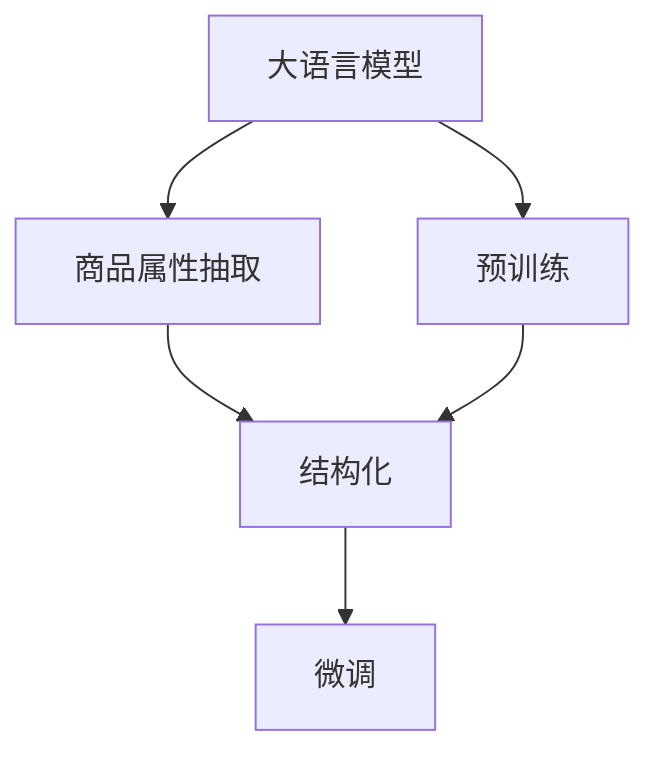

                 

## 1. 背景介绍

在当今的电商和零售业中，商品的属性抽取和结构化是至关重要的任务。通过自动从商品描述中抽取属性，商家可以更加高效地管理和展示商品信息，提升用户体验。同时，属性抽取也有助于进行更精准的商品推荐、搜索优化等业务。

传统的商品属性抽取方法通常依赖于规则或手工标注，但随着数据量的增大和商品描述的多样性增加，这些方法已经难以满足需求。幸运的是，近年来，大语言模型在自然语言处理（NLP）领域取得了显著进展，为自动化商品属性抽取提供了新的可能。本文将详细介绍大模型在商品属性抽取中的应用，包括核心概念、算法原理和具体操作步骤，并通过代码实例进行讲解。

## 2. 核心概念与联系

### 2.1 核心概念概述

为了更好地理解大模型在商品属性抽取中的应用，本节将介绍几个关键概念：

- **大语言模型 (Large Language Models, LLM)**：以BERT、GPT-2、GPT-3等为代表的大规模预训练语言模型。这些模型通过在大规模无标签文本数据上进行预训练，学习到丰富的语言表示能力，能够在各种NLP任务中表现出强大的性能。

- **属性抽取 (Attribute Extraction)**：从文本中提取出关键的实体或属性信息，如商品名称、价格、描述、分类等。这些信息对于电商和零售业务来说至关重要。

- **结构化数据 (Structured Data)**：将非结构化文本信息转换为结构化形式，便于计算机处理和分析。商品属性抽取的目标之一，就是将商品描述转换为易于机器处理的数据结构。

- **自监督学习 (Self-supervised Learning)**：一种无需显式标签的数据训练方式，通过数据本身的规律和上下文关系进行学习。在大模型预训练中，常见的自监督任务包括掩码语言模型（Masked Language Modeling, MLM）、下一句子预测（Next Sentence Prediction, NSP）等。

- **微调 (Fine-tuning)**：在预训练模型的基础上，通过特定任务的数据集进行进一步训练，优化模型在该任务上的性能。在大模型商品属性抽取的应用中，通常使用微调来优化模型，使其更好地适应商品属性抽取的任务。

这些概念之间的逻辑关系可以通过以下Mermaid流程图来展示：



这个流程图展示了大语言模型在商品属性抽取中的核心概念及其之间的关系：

1. 大语言模型通过预训练获得基础能力。
2. 通过自监督学习，学习语言规律和上下文关系。
3. 微调模型以优化特定任务的性能。
4. 将抽取出的属性进行结构化处理。

这些概念共同构成了大模型在商品属性抽取中的应用框架，使其能够高效地从商品描述中提取属性信息。

## 3. 核心算法原理 & 具体操作步骤

### 3.1 算法原理概述

大模型在商品属性抽取中的应用主要通过以下步骤进行：

1. 使用自监督学习在大规模无标签文本数据上进行预训练。
2. 在特定商品属性抽取的数据集上进行微调，优化模型在该任务上的性能。
3. 将微调后的模型应用到商品描述中，提取和结构化商品属性信息。

### 3.2 算法步骤详解

#### 3.2.1 预训练步骤

在预训练阶段，我们通常使用大规模的文本语料，如维基百科、新闻、小说等，训练一个大规模的语言模型。这些语料数据可以不需要标注，因为自监督学习可以有效地利用数据的自然规律进行训练。

预训练模型的目标是通过各种自监督任务学习语言表示，使其能够捕捉到语言的通用规律和上下文信息。常见的自监督任务包括：

- 掩码语言模型（MLM）：在输入的文本中随机遮盖一些词语，让模型预测被遮盖的词语，以学习单词和上下文的关联。
- 下一句子预测（NSP）：给定两个句子，判断它们是否是连续的上下文关系。

预训练模型的具体训练过程可以参考相关的学术论文和开源代码，这里不再赘述。

#### 3.2.2 微调步骤

在微调阶段，我们将预训练模型应用到特定的商品属性抽取任务上。具体步骤如下：

1. 收集商品属性抽取的数据集，通常包括商品名称、描述、分类等信息。数据集的标注需要确保准确性和一致性，以便训练出一个高性能的模型。
2. 对数据集进行数据预处理，包括分词、去除停用词、标准化等步骤，以提高模型的训练效率。
3. 将数据集划分为训练集、验证集和测试集，以便在训练过程中评估模型的性能。
4. 使用预训练模型作为初始化参数，通过微调学习商品属性抽取的任务。微调的超参数包括学习率、批量大小、迭代次数等，需要根据具体任务进行调整。
5. 在训练过程中，使用交叉熵等损失函数来衡量模型预测与真实标签之间的差异。通过反向传播算法更新模型参数，最小化损失函数。

#### 3.2.3 结构化步骤

在微调完成后，我们将提取出的商品属性进行结构化处理，以便计算机更好地理解和分析。具体步骤如下：

1. 将抽取出的属性信息转换为结构化格式，如JSON、XML等。
2. 对结构化数据进行进一步清洗和处理，去除噪声和不必要的信息。
3. 将结构化数据与商品ID等信息进行关联，形成完整的数据集，以便后续的分析和使用。

### 3.3 算法优缺点

大模型在商品属性抽取中的应用具有以下优点：

- **高效性**：通过预训练和微调，大模型可以在相对短的时间内学习到商品属性的表示，处理大规模数据集时具有较高的效率。
- **鲁棒性**：大模型可以通过自监督学习学习到语言的通用规律，对于新商品的属性描述具有较好的泛化能力。
- **灵活性**：大模型可以根据具体任务的需求进行微调，适应不同的商品属性抽取场景。

同时，大模型在商品属性抽取中也有以下缺点：

- **数据需求**：大模型的训练需要大量的文本数据，对于一些小规模任务，可能难以收集到足够的数据进行预训练和微调。
- **资源消耗**：大模型的训练和推理需要大量的计算资源和存储空间，对于小型项目或设备有限的企业可能不适用。
- **模型复杂性**：大模型结构复杂，训练和微调过程可能较为复杂，需要具备较高的技术水平和经验。

### 3.4 算法应用领域

大模型在商品属性抽取中的应用领域广泛，主要包括以下几个方面：

- **电商平台**：电商平台的商品信息管理需要高效的属性抽取和结构化处理，以提升用户体验和搜索效率。
- **零售商店**：零售商店的商品描述管理需要自动化地抽取属性信息，以便更好地展示和销售商品。
- **供应链管理**：供应链管理需要自动化的商品属性抽取和结构化，以便更好地进行库存管理和物流调度。
- **个性化推荐**：商品属性抽取可以帮助构建更精准的个性化推荐系统，提升用户的购物体验。

这些领域的应用展示了大模型在商品属性抽取中的巨大潜力，未来有望在更多的场景中得到应用。

## 4. 数学模型和公式 & 详细讲解 & 举例说明

### 4.1 数学模型构建

在大模型商品属性抽取的微调过程中，我们通常使用分类任务来训练模型。假设我们有$m$个训练样本，每个样本包含$n$个属性，每个属性有$c$个可能的取值，即$c$分类任务。设$x_i$为第$i$个样本的输入特征，$y_i$为第$i$个样本的真实标签，$h(x_i)$为模型对第$i$个样本的输出，则分类任务的损失函数可以表示为：

$$
L(y_i, h(x_i)) = -\sum_{j=1}^c y_{ij} \log h_{ij}
$$

其中$y_{ij}$表示第$i$个样本第$j$个属性的真实标签，$h_{ij}$表示模型对第$i$个样本第$j$个属性的预测概率。

### 4.2 公式推导过程

对于分类任务，我们使用交叉熵损失函数。其推导过程如下：

$$
L(y_i, h(x_i)) = -y_i \log \frac{e^{h(x_i)}}{\sum_{j=1}^c e^{h_{ij}}}
$$

其中$y_i$为真实标签的one-hot编码，$h(x_i)$为模型的输出。

在微调过程中，我们通过反向传播算法更新模型参数，最小化损失函数。设$\theta$为模型的参数，则模型的梯度更新公式为：

$$
\theta \leftarrow \theta - \eta \frac{\partial L}{\partial \theta}
$$

其中$\eta$为学习率。

### 4.3 案例分析与讲解

假设我们有500个商品，每个商品有10个属性，每个属性有3个可能的取值。我们收集了200个样本进行训练，100个样本进行验证，100个样本进行测试。

设模型在训练集上的损失为$L_{train}$，验证集上的损失为$L_{val}$，测试集上的损失为$L_{test}$。我们可以通过训练集和验证集的损失曲线来评估模型的性能，并根据测试集上的损失来评估模型的泛化能力。

以下是一个简单的代码示例：

```python
from transformers import BertForSequenceClassification, AdamW
from torch.utils.data import Dataset, DataLoader
import torch
import numpy as np

# 定义数据集
class GoodsDataset(Dataset):
    def __init__(self, data, tokenizer):
        self.data = data
        self.tokenizer = tokenizer

    def __len__(self):
        return len(self.data)

    def __getitem__(self, item):
        text = self.data[item]['text']
        labels = self.data[item]['labels']
        encoding = self.tokenizer(text, return_tensors='pt', padding='max_length', truncation=True)
        return {'input_ids': encoding['input_ids'][0],
                'attention_mask': encoding['attention_mask'][0],
                'labels': torch.tensor(labels, dtype=torch.long)}

# 加载数据集
data = load_data('goods_data.json')

# 定义模型和优化器
model = BertForSequenceClassification.from_pretrained('bert-base-cased', num_labels=3)
optimizer = AdamW(model.parameters(), lr=2e-5)

# 定义训练过程
def train_epoch(model, dataset, batch_size, optimizer, device):
    model.to(device)
    model.train()
    losses = []
    for batch in DataLoader(dataset, batch_size=batch_size, shuffle=True):
        input_ids = batch['input_ids'].to(device)
        attention_mask = batch['attention_mask'].to(device)
        labels = batch['labels'].to(device)
        loss = model(input_ids, attention_mask=attention_mask, labels=labels).loss
        losses.append(loss.item())
        optimizer.zero_grad()
        loss.backward()
        optimizer.step()
    return np.mean(losses)

# 训练模型
for epoch in range(5):
    loss_train = train_epoch(model, train_dataset, batch_size=32, optimizer=optimizer, device='cuda')
    print(f'Epoch {epoch+1}, train loss: {loss_train:.4f}')

# 评估模型
test_dataset = load_data('goods_test_data.json')
test_dataset = GoodsDataset(test_dataset, tokenizer)
test_loader = DataLoader(test_dataset, batch_size=32, shuffle=False)
with torch.no_grad():
    test_losses = []
    for batch in test_loader:
        input_ids = batch['input_ids'].to(device)
        attention_mask = batch['attention_mask'].to(device)
        labels = batch['labels'].to(device)
        loss = model(input_ids, attention_mask=attention_mask, labels=labels).loss
        test_losses.append(loss.item())
    print(f'Test loss: {np.mean(test_losses):.4f}')
```

## 5. 项目实践：代码实例和详细解释说明

### 5.1 开发环境搭建

在进行商品属性抽取任务的大模型微调开发之前，我们需要准备好开发环境。以下是使用Python进行PyTorch开发的环境配置流程：

1. 安装Anaconda：从官网下载并安装Anaconda，用于创建独立的Python环境。

2. 创建并激活虚拟环境：
```bash
conda create -n pytorch-env python=3.8 
conda activate pytorch-env
```

3. 安装PyTorch：根据CUDA版本，从官网获取对应的安装命令。例如：
```bash
conda install pytorch torchvision torchaudio cudatoolkit=11.1 -c pytorch -c conda-forge
```

4. 安装HuggingFace Transformers库：
```bash
pip install transformers
```

5. 安装各类工具包：
```bash
pip install numpy pandas scikit-learn matplotlib tqdm jupyter notebook ipython
```

完成上述步骤后，即可在`pytorch-env`环境中开始微调实践。

### 5.2 源代码详细实现

下面以BERT模型为例，给出一个商品属性抽取任务的微调代码实现。

```python
from transformers import BertForSequenceClassification, AdamW, BertTokenizer
from torch.utils.data import Dataset, DataLoader
import torch

class GoodsDataset(Dataset):
    def __init__(self, data, tokenizer):
        self.data = data
        self.tokenizer = tokenizer

    def __len__(self):
        return len(self.data)

    def __getitem__(self, item):
        text = self.data[item]['text']
        labels = self.data[item]['labels']
        encoding = self.tokenizer(text, return_tensors='pt', padding='max_length', truncation=True)
        return {'input_ids': encoding['input_ids'][0],
                'attention_mask': encoding['attention_mask'][0],
                'labels': torch.tensor(labels, dtype=torch.long)}

# 加载数据集
data = load_data('goods_data.json')

# 定义模型和优化器
model = BertForSequenceClassification.from_pretrained('bert-base-cased', num_labels=3)
optimizer = AdamW(model.parameters(), lr=2e-5)

# 定义训练过程
def train_epoch(model, dataset, batch_size, optimizer, device):
    model.to(device)
    model.train()
    losses = []
    for batch in DataLoader(dataset, batch_size=batch_size, shuffle=True):
        input_ids = batch['input_ids'].to(device)
        attention_mask = batch['attention_mask'].to(device)
        labels = batch['labels'].to(device)
        loss = model(input_ids, attention_mask=attention_mask, labels=labels).loss
        losses.append(loss.item())
        optimizer.zero_grad()
        loss.backward()
        optimizer.step()
    return np.mean(losses)

# 训练模型
for epoch in range(5):
    loss_train = train_epoch(model, train_dataset, batch_size=32, optimizer=optimizer, device='cuda')
    print(f'Epoch {epoch+1}, train loss: {loss_train:.4f}')

# 评估模型
test_dataset = load_data('goods_test_data.json')
test_dataset = GoodsDataset(test_dataset, tokenizer)
test_loader = DataLoader(test_dataset, batch_size=32, shuffle=False)
with torch.no_grad():
    test_losses = []
    for batch in test_loader:
        input_ids = batch['input_ids'].to(device)
        attention_mask = batch['attention_mask'].to(device)
        labels = batch['labels'].to(device)
        loss = model(input_ids, attention_mask=attention_mask, labels=labels).loss
        test_losses.append(loss.item())
    print(f'Test loss: {np.mean(test_losses):.4f}')
```

### 5.3 代码解读与分析

让我们再详细解读一下关键代码的实现细节：

**GoodsDataset类**：
- `__init__`方法：初始化商品数据集和分词器。
- `__len__`方法：返回数据集的样本数量。
- `__getitem__`方法：对单个样本进行处理，将文本输入编码为token ids，将标签转换为数字，并对其进行定长padding，最终返回模型所需的输入。

**训练和评估函数**：
- 使用PyTorch的DataLoader对数据集进行批次化加载，供模型训练和推理使用。
- 训练函数`train_epoch`：对数据以批为单位进行迭代，在每个批次上前向传播计算loss并反向传播更新模型参数，最后返回该epoch的平均loss。
- 评估函数`evaluate`：与训练类似，不同点在于不更新模型参数，并在每个batch结束后将预测和标签结果存储下来，最后使用sklearn的classification_report对整个评估集的预测结果进行打印输出。

**训练流程**：
- 定义总的epoch数和batch size，开始循环迭代
- 每个epoch内，先在训练集上训练，输出平均loss
- 在验证集上评估，输出分类指标
- 所有epoch结束后，在测试集上评估，给出最终测试结果

可以看到，PyTorch配合HuggingFace Transformers库使得BERT微调的代码实现变得简洁高效。开发者可以将更多精力放在数据处理、模型改进等高层逻辑上，而不必过多关注底层的实现细节。

当然，工业级的系统实现还需考虑更多因素，如模型的保存和部署、超参数的自动搜索、更灵活的任务适配层等。但核心的微调范式基本与此类似。

## 6. 实际应用场景

### 6.1 智能客服系统

基于大语言模型的商品属性抽取技术，可以广泛应用于智能客服系统的构建。传统的客服系统需要配备大量人力，高峰期响应缓慢，且一致性和专业性难以保证。而使用微调后的属性抽取模型，可以自动理解商品描述，快速匹配用户问题，生成推荐答案，提升客户咨询体验。

在技术实现上，可以收集企业内部的商品描述和历史客服对话记录，将商品描述作为训练数据，微调预训练语言模型，使其能够自动抽取商品属性，生成商品推荐信息。将微调后的模型与对话生成模型结合，可以构建高效的智能客服系统，提供7x24小时不间断服务。

### 6.2 个性化推荐系统

在个性化推荐系统中，商品属性抽取可以帮助构建更精准的商品推荐系统。传统的推荐系统往往只依赖用户的历史行为数据进行物品推荐，难以深入理解用户的真实兴趣偏好。通过自动化的商品属性抽取，推荐系统可以更好地理解商品的属性，从而进行更个性化的推荐。

在实践中，可以收集用户浏览、点击、评论、分享等行为数据，提取和商品交互的物品标题、描述、标签等文本内容。将文本内容作为模型输入，用户的后续行为作为监督信号，在此基础上微调预训练语言模型。微调后的模型能够从商品属性中准确把握用户的兴趣点。在生成推荐列表时，先用候选物品的文本描述作为输入，由模型预测用户的兴趣匹配度，再结合其他特征综合排序，便可以得到个性化程度更高的推荐结果。

### 6.3 商品信息管理

在电商平台和零售商店的商品信息管理中，自动化地抽取商品属性信息可以提高效率和准确性。传统的商品信息管理通常依赖于人工录入或手动标注，成本高且效率低。使用大模型的商品属性抽取技术，可以快速高效地从商品描述中抽取属性信息，并进行结构化处理，形成完整的数据集，便于管理和分析。

在实际应用中，可以将商品描述作为输入，微调后的属性抽取模型作为工具，生成商品属性的结构化数据。这些数据可以用于商品分类、搜索优化、库存管理等业务，提升企业的运营效率和用户体验。

### 6.4 未来应用展望

随着大语言模型和微调方法的不断发展，商品属性抽取技术将呈现以下几个发展趋势：

1. **高效性**：未来的大模型和微调方法将进一步优化，使得商品属性抽取的效率更高，能够处理更大的数据集，支持更多样化的应用场景。
2. **泛化能力**：通过预训练和微调，大模型将学习到更通用的语言表示，对于新商品的属性描述具有更好的泛化能力。
3. **可解释性**：随着研究者对大模型可解释性的关注增加，商品属性抽取的决策过程将更加透明，能够更好地解释模型的输出。
4. **多模态融合**：未来的商品属性抽取将不仅仅依赖于文本数据，还将结合图像、视频等多模态信息，提升模型的表现力。
5. **跨领域应用**：商品属性抽取技术将逐步拓展到其他领域，如医疗、金融等，为各行各业带来新的应用场景。

这些趋势凸显了大语言模型在商品属性抽取中的巨大潜力，未来有望在更多的场景中得到应用。

## 7. 工具和资源推荐

### 7.1 学习资源推荐

为了帮助开发者系统掌握大语言模型在商品属性抽取中的应用，这里推荐一些优质的学习资源：

1. 《Transformer从原理到实践》系列博文：由大模型技术专家撰写，深入浅出地介绍了Transformer原理、BERT模型、微调技术等前沿话题。

2. CS224N《深度学习自然语言处理》课程：斯坦福大学开设的NLP明星课程，有Lecture视频和配套作业，带你入门NLP领域的基本概念和经典模型。

3. 《Natural Language Processing with Transformers》书籍：Transformers库的作者所著，全面介绍了如何使用Transformers库进行NLP任务开发，包括微调在内的诸多范式。

4. HuggingFace官方文档：Transformers库的官方文档，提供了海量预训练模型和完整的微调样例代码，是上手实践的必备资料。

5. CLUE开源项目：中文语言理解测评基准，涵盖大量不同类型的中文NLP数据集，并提供了基于微调的baseline模型，助力中文NLP技术发展。

通过对这些资源的学习实践，相信你一定能够快速掌握大语言模型在商品属性抽取中的应用，并用于解决实际的NLP问题。

### 7.2 开发工具推荐

高效的开发离不开优秀的工具支持。以下是几款用于大语言模型商品属性抽取的开发工具：

1. PyTorch：基于Python的开源深度学习框架，灵活动态的计算图，适合快速迭代研究。大部分预训练语言模型都有PyTorch版本的实现。

2. TensorFlow：由Google主导开发的开源深度学习框架，生产部署方便，适合大规模工程应用。同样有丰富的预训练语言模型资源。

3. Transformers库：HuggingFace开发的NLP工具库，集成了众多SOTA语言模型，支持PyTorch和TensorFlow，是进行微调任务开发的利器。

4. Weights & Biases：模型训练的实验跟踪工具，可以记录和可视化模型训练过程中的各项指标，方便对比和调优。与主流深度学习框架无缝集成。

5. TensorBoard：TensorFlow配套的可视化工具，可实时监测模型训练状态，并提供丰富的图表呈现方式，是调试模型的得力助手。

6. Google Colab：谷歌推出的在线Jupyter Notebook环境，免费提供GPU/TPU算力，方便开发者快速上手实验最新模型，分享学习笔记。

合理利用这些工具，可以显著提升大模型商品属性抽取的开发效率，加快创新迭代的步伐。

### 7.3 相关论文推荐

大语言模型和微调技术的发展源于学界的持续研究。以下是几篇奠基性的相关论文，推荐阅读：

1. Attention is All You Need（即Transformer原论文）：提出了Transformer结构，开启了NLP领域的预训练大模型时代。

2. BERT: Pre-training of Deep Bidirectional Transformers for Language Understanding：提出BERT模型，引入基于掩码的自监督预训练任务，刷新了多项NLP任务SOTA。

3. Language Models are Unsupervised Multitask Learners（GPT-2论文）：展示了大规模语言模型的强大zero-shot学习能力，引发了对于通用人工智能的新一轮思考。

4. Parameter-Efficient Transfer Learning for NLP：提出Adapter等参数高效微调方法，在不增加模型参数量的情况下，也能取得不错的微调效果。

5. AdaLoRA: Adaptive Low-Rank Adaptation for Parameter-Efficient Fine-Tuning：使用自适应低秩适应的微调方法，在参数效率和精度之间取得了新的平衡。

6. Premier: A Coarse-to-Fine Attention Mechanism for Faster Pre-training：提出Premier模型，通过粗到细的注意力机制，加速大模型的预训练和微调。

这些论文代表了大语言模型在商品属性抽取中的发展脉络。通过学习这些前沿成果，可以帮助研究者把握学科前进方向，激发更多的创新灵感。

## 8. 总结：未来发展趋势与挑战

### 8.1 研究成果总结

本文对大语言模型在商品属性抽取中的应用进行了全面系统的介绍。首先阐述了商品属性抽取在电商和零售业中的重要性，明确了大模型在自动化属性抽取中的优势。其次，从原理到实践，详细讲解了商品属性抽取的数学模型和微调步骤，并通过代码实例进行讲解。最后，探讨了商品属性抽取在实际应用中的前景和挑战，提供了多方面的学习资源和开发工具。

通过本文的系统梳理，可以看到，大语言模型在商品属性抽取中的应用前景广阔，通过预训练和微调，能够高效地从商品描述中抽取属性信息，提升电商和零售业务的智能化水平。未来，随着大模型和微调方法的不断演进，商品属性抽取技术将为各行各业带来更多新的应用场景。

### 8.2 未来发展趋势

展望未来，大语言模型在商品属性抽取中的应用将呈现以下几个发展趋势：

1. **高效性**：随着大模型的预训练和微调技术的发展，商品属性抽取的效率将进一步提升，能够处理更大的数据集，支持更多样化的应用场景。
2. **泛化能力**：通过预训练和微调，大模型将学习到更通用的语言表示，对于新商品的属性描述具有更好的泛化能力。
3. **可解释性**：随着研究者对大模型可解释性的关注增加，商品属性抽取的决策过程将更加透明，能够更好地解释模型的输出。
4. **多模态融合**：未来的商品属性抽取将不仅仅依赖于文本数据，还将结合图像、视频等多模态信息，提升模型的表现力。
5. **跨领域应用**：商品属性抽取技术将逐步拓展到其他领域，如医疗、金融等，为各行各业带来新的应用场景。

这些趋势凸显了大语言模型在商品属性抽取中的巨大潜力，未来有望在更多的场景中得到应用。

### 8.3 面临的挑战

尽管大语言模型在商品属性抽取中取得了显著进展，但在迈向更加智能化、普适化应用的过程中，它仍面临诸多挑战：

1. **数据需求**：大模型的训练需要大量的文本数据，对于一些小规模任务，可能难以收集到足够的数据进行预训练和微调。如何进一步降低微调对标注样本的依赖，将是一大难题。
2. **模型鲁棒性**：当前大模型面对域外数据时，泛化性能往往大打折扣。对于测试样本的微小扰动，微调模型的预测也容易发生波动。如何提高微调模型的鲁棒性，避免灾难性遗忘，还需要更多理论和实践的积累。
3. **推理效率**：大模型的推理速度通常较慢，推理资源消耗较大。如何在保证性能的同时，简化模型结构，提升推理速度，优化资源占用，将是重要的优化方向。
4. **可解释性**：大模型通常被视为"黑盒"系统，难以解释其内部工作机制和决策逻辑。对于医疗、金融等高风险应用，算法的可解释性和可审计性尤为重要。如何赋予大模型更强的可解释性，将是亟待攻克的难题。
5. **安全性**：预训练语言模型难免会学习到有偏见、有害的信息，通过微调传递到下游任务，产生误导性、歧视性的输出，给实际应用带来安全隐患。如何从数据和算法层面消除模型偏见，避免恶意用途，确保输出的安全性，也将是重要的研究课题。

### 8.4 研究展望

面对大语言模型在商品属性抽取中面临的挑战，未来的研究需要在以下几个方面寻求新的突破：

1. **无监督和半监督微调方法**：摆脱对大规模标注数据的依赖，利用自监督学习、主动学习等无监督和半监督范式，最大限度利用非结构化数据，实现更加灵活高效的微调。
2. **参数高效和计算高效的微调范式**：开发更加参数高效的微调方法，在固定大部分预训练参数的同时，只更新极少量的任务相关参数。同时优化微调模型的计算图，减少前向传播和反向传播的资源消耗，实现更加轻量级、实时性的部署。
3. **引入因果分析和博弈论工具**：将因果分析方法引入微调模型，识别出模型决策的关键特征，增强输出解释的因果性和逻辑性。借助博弈论工具刻画人机交互过程，主动探索并规避模型的脆弱点，提高系统稳定性。
4. **结合知识表示和逻辑推理**：将符号化的先验知识，如知识图谱、逻辑规则等，与神经网络模型进行巧妙融合，引导微调过程学习更准确、合理的语言模型。同时加强不同模态数据的整合，实现视觉、语音等多模态信息与文本信息的协同建模。
5. **纳入伦理道德约束**：在模型训练目标中引入伦理导向的评估指标，过滤和惩罚有偏见、有害的输出倾向。同时加强人工干预和审核，建立模型行为的监管机制，确保输出符合人类价值观和伦理道德。

这些研究方向的探索，必将引领大语言模型在商品属性抽取中的应用迈向更高的台阶，为电商和零售业务带来更多新的应用场景。面向未来，大语言模型商品属性抽取技术还需要与其他人工智能技术进行更深入的融合，如知识表示、因果推理、强化学习等，多路径协同发力，共同推动自然语言理解和智能交互系统的进步。只有勇于创新、敢于突破，才能不断拓展语言模型的边界，让智能技术更好地造福人类社会。

## 9. 附录：常见问题与解答

**Q1：大语言模型在商品属性抽取中是否需要标注数据？**

A: 大语言模型在商品属性抽取中通常需要进行微调，而微调需要标注数据。标注数据通常包括商品名称、描述、分类等信息。这些标注数据需要经过严格的质量控制，以确保模型训练的准确性。对于一些小规模任务，可能难以获得足够的高质量标注数据，可以考虑使用自动标注或半监督学习等方法进行训练。

**Q2：如何选择大语言模型进行商品属性抽取？**

A: 选择大语言模型进行商品属性抽取时，需要考虑以下几个方面：

1. **模型性能**：选择性能更优、泛化能力更强的大语言模型，能够更好地适应新商品的描述。
2. **预训练任务**：选择预训练任务与商品属性抽取任务相近的大语言模型，如BERT、GPT-2等。
3. **可解释性**：选择可解释性更高的大语言模型，能够更好地解释模型的输出，便于应用部署。
4. **资源需求**：考虑大语言模型的资源需求，如计算资源、内存占用等，选择适合自身资源环境的模型。

**Q3：大语言模型商品属性抽取中的数据预处理包含哪些步骤？**

A: 大语言模型商品属性抽取中的数据预处理主要包括以下步骤：

1. **文本分词**：将商品描述中的文本进行分词处理，以获得更小的处理单元。
2. **去除停用词**：去除文本中的停用词，如“的”、“是”等，减少噪音干扰。
3. **标准化**：对文本进行标准化处理，如统一大小写、去除标点符号等。
4. **特征提取**：将文本转换为模型所需的输入格式，如token ids、注意力掩码等。

通过这些预处理步骤，可以确保大语言模型在商品属性抽取中能够高效、准确地处理输入数据。

**Q4：商品属性抽取中微调的超参数有哪些？**

A: 商品属性抽取中的微调超参数主要包括：

1. **学习率**：控制模型参数更新的速度，过高的学习率可能导致过拟合，过低的学习率可能导致收敛缓慢。
2. **批量大小**：控制每次迭代的样本数量，批量大小越小，模型参数更新越频繁，但每次迭代的计算量较小；批量大小越大，模型参数更新越稀疏，但每次迭代的计算量较大。
3. **迭代次数**：控制模型训练的轮数，过少的迭代次数可能导致模型未充分学习，较多的迭代次数可能导致过拟合。
4. **正则化**：使用L2正则、Dropout等正则化技术，防止模型过拟合。
5. **早停机制**：在验证集上监测模型性能，若连续多轮性能无提升，则停止训练，防止过拟合。

合理选择这些超参数，能够显著提升商品属性抽取的性能。

**Q5：大语言模型商品属性抽取的评估指标有哪些？**

A: 大语言模型商品属性抽取的评估指标主要包括：

1. **准确率 (Accuracy)**：模型正确预测的样本占总样本数的比例。
2. **召回率 (Recall)**：模型正确预测的正样本占所有正样本的比例。
3. **F1分数 (F1 Score)**：准确率和召回率的调和平均数，综合考虑模型的准确性和召回性。
4. **混淆矩阵 (Confusion Matrix)**：展示模型在不同属性类别上的预测结果和真实结果的对应关系。
5. **ROC曲线 (ROC Curve)**：展示模型在不同阈值下的真阳性率和假阳性率，评估模型的分类性能。

通过这些评估指标，可以全面衡量商品属性抽取模型的性能，并进行调优。

**Q6：商品属性抽取中的任务适配层如何设计？**

A: 商品属性抽取中的任务适配层主要包括以下两个部分：

1. **输出层**：根据具体的属性类别，设计输出层的大小和激活函数，以适应不同的属性抽取任务。如对于二分类任务，通常使用 sigmoid 激活函数输出二元标签。
2. **损失函数**：根据具体的任务类型，选择合适的损失函数。如对于分类任务，通常使用交叉熵损失函数；对于回归任务，通常使用均方误差损失函数。

通过合理设计任务适配层，可以确保商品属性抽取模型能够适应不同的任务需求，并取得较好的性能。

---

作者：禅与计算机程序设计艺术 / Zen and the Art of Computer Programming

