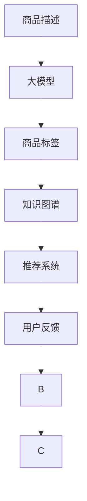

                 

# 大模型在商品标签推荐与生成中的应用

## 1. 背景介绍

### 1.1 问题由来
商品标签推荐与生成是电商领域的重要应用之一，涉及对商品信息的理解和提取，以辅助用户快速找到所需商品，提高购物体验和转化率。随着商品数量和用户行为数据量的快速增长，传统的基于规则、特征工程的推荐系统已难以满足需求。近年来，基于大模型的推荐系统应运而生，利用其在语言理解和表示学习上的强大能力，从自然语言描述中挖掘商品特征，提升推荐系统的精准性和个性化。

### 1.2 问题核心关键点
大模型在商品标签推荐与生成中的应用，主要体现在以下几个方面：

- 语义理解与特征提取：大模型通过语言理解能力，从商品描述中提取出关键语义信息，如材质、尺码、功能等。
- 知识图谱构建与融合：大模型可以与知识图谱结合，获取商品之间的语义关系，提升推荐相关性。
- 个性化推荐：基于大模型提取的商品特征和用户行为，实现个性化推荐，提升用户体验。
- 商品生成与描述优化：利用大模型的生成能力，为商品生成新的标签和描述，增加产品多样性。

### 1.3 问题研究意义
大模型在商品标签推荐与生成中的应用，对提升电商购物体验、促进产品销售具有重要意义：

1. **提升推荐效果**：大模型强大的语言理解和特征提取能力，能够从大量商品描述中提取精细化的标签信息，显著提升推荐系统的精准度。
2. **增强用户体验**：通过提取商品的核心特征和相关信息，大模型生成的标签和描述能够更好地匹配用户需求，提升用户购物满意度。
3. **促进销售转化**：精准的商品标签推荐能够帮助用户快速找到心仪商品，减少选择时间和决策成本，从而增加购买转化率。
4. **推动电商创新**：大模型生成的商品标签和描述，为电商商品多样化、个性化提供了新的可能性，推动电商领域的创新发展。

## 2. 核心概念与联系

### 2.1 核心概念概述

为了更好地理解大模型在商品标签推荐与生成中的应用，本节将介绍几个关键概念：

- **大模型（Large Model）**：指具有数十亿甚至百亿参数的大型预训练模型，如GPT、BERT等，能够从大规模文本数据中学习丰富的语言表示。
- **商品标签（Item Tags）**：商品标签是商品信息的精炼表示，通常包括材质、尺码、颜色、价格等属性，用于推荐系统中的特征提取和推荐计算。
- **知识图谱（Knowledge Graph）**：知识图谱是结构化的语义信息库，用于存储商品之间的关联关系，帮助大模型理解商品之间的语义和功能关系。
- **推荐系统（Recommendation System）**：推荐系统根据用户行为和商品属性，推荐用户可能感兴趣的商品，是电商领域的重要应用之一。

这些概念之间存在紧密联系，大模型通过学习语义信息，结合知识图谱的语义关系，生成精细化的商品标签，并在推荐系统中作为推荐特征使用，以提升推荐效果。

### 2.2 核心概念原理和架构的 Mermaid 流程图(Mermaid 流程节点中不要有括号、逗号等特殊字符)



### 2.3 核心概念之间的联系

- **数据来源**：大模型通过学习电商平台的商品描述数据，生成商品标签。
- **知识图谱**：大模型从知识图谱中获取商品之间的语义关系，帮助生成更加准确的标签。
- **推荐系统**：大模型生成的商品标签作为推荐系统的输入，用于提升推荐相关性。
- **用户反馈**：用户对推荐的反馈数据，用于进一步训练大模型，改进标签生成和推荐效果。

## 3. 核心算法原理 & 具体操作步骤

### 3.1 算法原理概述

大模型在商品标签推荐与生成中的应用，本质上是利用大模型的语言理解能力，从商品描述中提取出关键的语义信息，生成商品标签，并结合知识图谱进行推荐计算。算法流程通常包括以下几个步骤：

1. **数据预处理**：清洗和标准化商品描述数据，去除噪声和特殊字符，转换为模型可处理的格式。
2. **特征提取**：使用大模型从商品描述中提取关键特征，生成商品标签。
3. **知识图谱融合**：将大模型生成的商品标签与知识图谱中的关系进行融合，获取更加全面的商品信息。
4. **推荐计算**：根据用户行为和商品标签，使用推荐算法计算推荐结果。
5. **反馈迭代**：基于用户反馈，对大模型进行微调，进一步提升标签生成和推荐效果。

### 3.2 算法步骤详解

#### 步骤1: 数据预处理

数据预处理是大模型应用的基础，主要包括以下几个方面：

- **清洗和标准化**：去除商品描述中的特殊字符、错别字和冗余信息，统一不同来源的商品描述格式。
- **分词和去除停用词**：将商品描述进行分词处理，去除停用词和低频词，保留有意义的词汇。
- **文本编码**：将处理后的文本数据转换为模型可接受的格式，如数字张量，准备输入到模型中进行特征提取。

#### 步骤2: 特征提取

特征提取是大模型应用的核心，主要使用大模型的语言理解能力，从商品描述中提取关键语义信息：

- **选择预训练模型**：根据任务需求，选择合适的预训练模型，如BERT、GPT等。
- **定义输入输出**：定义模型的输入和输出格式，通常输入为商品描述，输出为商品标签。
- **微调大模型**：使用商品描述数据对大模型进行微调，使其能够学习商品特征，生成标签。

#### 步骤3: 知识图谱融合

知识图谱融合是将大模型生成的商品标签与知识图谱中的关系进行融合，以获取更加全面的商品信息：

- **构建知识图谱**：建立商品知识图谱，包括商品属性、关系和实体等信息。
- **关系抽取**：从大模型生成的商品标签中，抽取与知识图谱中实体相关的关系，如“颜色”、“尺码”等。
- **语义匹配**：使用图谱中的实体关系，匹配大模型生成的标签，构建商品的全息图谱表示。

#### 步骤4: 推荐计算

推荐计算是基于用户行为和商品标签，计算推荐结果：

- **用户行为建模**：使用协同过滤、深度学习等方法，构建用户行为模型，表示用户的兴趣和偏好。
- **商品特征表示**：使用大模型提取的商品标签和知识图谱融合后的商品特征，生成商品表示。
- **推荐算法计算**：根据用户行为和商品表示，使用推荐算法（如LR、RF、GNN等）计算推荐结果。

#### 步骤5: 反馈迭代

反馈迭代是基于用户反馈，对大模型进行微调，提升标签生成和推荐效果：

- **收集用户反馈**：收集用户对推荐结果的评分和评价，如点击率、购买率等。
- **模型微调**：使用用户反馈数据，对大模型进行微调，优化标签生成和推荐算法。
- **迭代优化**：持续迭代模型，不断提升推荐系统的效果和用户满意度。

### 3.3 算法优缺点

大模型在商品标签推荐与生成中的应用，具有以下优点：

- **精度高**：大模型的语言理解和特征提取能力，能够从大量商品描述中提取精细化的标签信息，提升推荐系统的精准度。
- **可扩展性**：大模型支持大规模并行计算，能够处理海量的商品描述数据，适应电商领域的快速增长。
- **个性化推荐**：大模型生成的商品标签，能够根据用户行为进行个性化推荐，提升用户体验。

同时，大模型在应用中也存在一些缺点：

- **计算资源消耗大**：大模型的训练和推理需要大量的计算资源，包括GPU/TPU等高性能设备，成本较高。
- **标签生成复杂**：商品标签的生成需要大模型对语义信息的精细化理解，可能涉及多轮迭代和调试，较为复杂。
- **模型可解释性不足**：大模型生成的商品标签和推荐结果，缺乏可解释性，难以理解模型的决策过程。

### 3.4 算法应用领域

大模型在商品标签推荐与生成中的应用，广泛应用于以下几个领域：

- **电商购物推荐**：基于大模型生成商品标签，提升推荐系统的相关性和个性化。
- **品牌营销分析**：利用大模型对商品描述进行情感分析和标签生成，分析品牌市场表现。
- **内容生成与优化**：为大模型生成的商品描述进行优化和润色，提升用户阅读体验。
- **智能客服与导购**：通过大模型生成的商品标签，优化智能客服和导购系统的推荐效果。

## 4. 数学模型和公式 & 详细讲解 & 举例说明

### 4.1 数学模型构建

假设商品描述为 $x_i$，大模型生成的商品标签为 $y_i$，知识图谱中的关系为 $r$。数学模型构建包括商品描述 $x_i$ 的编码表示 $h(x_i)$ 和商品标签 $y_i$ 的生成过程 $f(h(x_i))$，以及商品标签与知识图谱中关系的匹配过程 $g(y_i,r)$。

数学模型可以表示为：
$$
\begin{aligned}
h(x_i) &= \text{Encoder}(x_i) \\
y_i &= \text{Decoder}(h(x_i)) \\
\hat{y_i} &= g(y_i,r)
\end{aligned}
$$

其中，Encoder为特征提取部分，Decoder为标签生成部分，$g$ 为匹配关系的部分。

### 4.2 公式推导过程

以下对每个部分进行详细推导：

#### Encoder部分

Encoder部分负责将商品描述 $x_i$ 转换为模型可处理的表示 $h(x_i)$。以BERT模型为例，Encoder的输出表示可以表示为：

$$
h(x_i) = \text{BERT}(x_i)
$$

#### Decoder部分

Decoder部分负责将Encoder的输出表示 $h(x_i)$ 转换为商品标签 $y_i$。以GPT模型为例，Decoder的输出可以表示为：

$$
y_i = \text{GPT}(h(x_i))
$$

#### 关系匹配部分

关系匹配部分 $g$ 负责将商品标签 $y_i$ 与知识图谱中的关系 $r$ 进行匹配。以Cosine相似度为例，可以表示为：

$$
\hat{y_i} = \text{Cosine}(y_i, r)
$$

### 4.3 案例分析与讲解

以电商平台商品推荐为例，进行详细讲解：

- **数据预处理**：清洗和标准化商品描述数据，去除噪声和特殊字符，转换为BERT模型可接受的格式。
- **特征提取**：使用BERT模型从商品描述中提取关键语义信息，生成商品标签。
- **知识图谱融合**：将BERT生成的商品标签与商品知识图谱中的关系进行匹配，构建商品的全息图谱表示。
- **推荐计算**：使用协同过滤算法，根据用户行为和商品标签，计算推荐结果。
- **反馈迭代**：收集用户对推荐结果的评分和评价，使用评分数据微调BERT模型，提升标签生成和推荐效果。

## 5. 项目实践：代码实例和详细解释说明

### 5.1 开发环境搭建

在进行商品标签推荐与生成的项目实践前，我们需要准备好开发环境。以下是使用Python进行PyTorch开发的环境配置流程：

1. 安装Anaconda：从官网下载并安装Anaconda，用于创建独立的Python环境。

2. 创建并激活虚拟环境：
```bash
conda create -n pytorch-env python=3.8 
conda activate pytorch-env
```

3. 安装PyTorch：根据CUDA版本，从官网获取对应的安装命令。例如：
```bash
conda install pytorch torchvision torchaudio cudatoolkit=11.1 -c pytorch -c conda-forge
```

4. 安装Transformers库：
```bash
pip install transformers
```

5. 安装各类工具包：
```bash
pip install numpy pandas scikit-learn matplotlib tqdm jupyter notebook ipython
```

完成上述步骤后，即可在`pytorch-env`环境中开始项目实践。

### 5.2 源代码详细实现

下面我们以电商平台商品推荐为例，给出使用Transformers库对BERT模型进行商品标签推荐和生成的PyTorch代码实现。

首先，定义商品推荐数据处理函数：

```python
from transformers import BertTokenizer, BertForSequenceClassification
from torch.utils.data import Dataset
import torch

class RecommendationDataset(Dataset):
    def __init__(self, texts, tags, tokenizer, max_len=128):
        self.texts = texts
        self.tags = tags
        self.tokenizer = tokenizer
        self.max_len = max_len
        
    def __len__(self):
        return len(self.texts)
    
    def __getitem__(self, item):
        text = self.texts[item]
        tag = self.tags[item]
        
        encoding = self.tokenizer(text, return_tensors='pt', max_length=self.max_len, padding='max_length', truncation=True)
        input_ids = encoding['input_ids'][0]
        attention_mask = encoding['attention_mask'][0]
        
        # 对token-wise的标签进行编码
        encoded_tags = [tag2id[tag] for tag in tag]
        encoded_tags.extend([tag2id['O']] * (self.max_len - len(encoded_tags)))
        labels = torch.tensor(encoded_tags, dtype=torch.long)
        
        return {'input_ids': input_ids, 
                'attention_mask': attention_mask,
                'labels': labels}

# 标签与id的映射
tag2id = {'O': 0, 'B': 1, 'I': 2}
id2tag = {v: k for k, v in tag2id.items()}

# 创建dataset
tokenizer = BertTokenizer.from_pretrained('bert-base-cased')

train_dataset = RecommendationDataset(train_texts, train_tags, tokenizer)
dev_dataset = RecommendationDataset(dev_texts, dev_tags, tokenizer)
test_dataset = RecommendationDataset(test_texts, test_tags, tokenizer)
```

然后，定义模型和优化器：

```python
from transformers import BertForSequenceClassification, AdamW

model = BertForSequenceClassification.from_pretrained('bert-base-cased', num_labels=len(tag2id))

optimizer = AdamW(model.parameters(), lr=2e-5)
```

接着，定义训练和评估函数：

```python
from torch.utils.data import DataLoader
from tqdm import tqdm
from sklearn.metrics import classification_report

device = torch.device('cuda') if torch.cuda.is_available() else torch.device('cpu')
model.to(device)

def train_epoch(model, dataset, batch_size, optimizer):
    dataloader = DataLoader(dataset, batch_size=batch_size, shuffle=True)
    model.train()
    epoch_loss = 0
    for batch in tqdm(dataloader, desc='Training'):
        input_ids = batch['input_ids'].to(device)
        attention_mask = batch['attention_mask'].to(device)
        labels = batch['labels'].to(device)
        model.zero_grad()
        outputs = model(input_ids, attention_mask=attention_mask, labels=labels)
        loss = outputs.loss
        epoch_loss += loss.item()
        loss.backward()
        optimizer.step()
    return epoch_loss / len(dataloader)

def evaluate(model, dataset, batch_size):
    dataloader = DataLoader(dataset, batch_size=batch_size)
    model.eval()
    preds, labels = [], []
    with torch.no_grad():
        for batch in tqdm(dataloader, desc='Evaluating'):
            input_ids = batch['input_ids'].to(device)
            attention_mask = batch['attention_mask'].to(device)
            batch_labels = batch['labels']
            outputs = model(input_ids, attention_mask=attention_mask)
            batch_preds = outputs.logits.argmax(dim=2).to('cpu').tolist()
            batch_labels = batch_labels.to('cpu').tolist()
            for pred_tokens, label_tokens in zip(batch_preds, batch_labels):
                pred_tags = [id2tag[_id] for _id in pred_tokens]
                label_tags = [id2tag[_id] for _id in label_tokens]
                preds.append(pred_tags[:len(label_tags)])
                labels.append(label_tags)
                
    print(classification_report(labels, preds))
```

最后，启动训练流程并在测试集上评估：

```python
epochs = 5
batch_size = 16

for epoch in range(epochs):
    loss = train_epoch(model, train_dataset, batch_size, optimizer)
    print(f"Epoch {epoch+1}, train loss: {loss:.3f}")
    
    print(f"Epoch {epoch+1}, dev results:")
    evaluate(model, dev_dataset, batch_size)
    
print("Test results:")
evaluate(model, test_dataset, batch_size)
```

以上就是使用PyTorch对BERT进行商品标签推荐和生成的完整代码实现。可以看到，得益于Transformers库的强大封装，我们可以用相对简洁的代码完成BERT模型的加载和微调。

### 5.3 代码解读与分析

让我们再详细解读一下关键代码的实现细节：

**RecommendationDataset类**：
- `__init__`方法：初始化文本、标签、分词器等关键组件。
- `__len__`方法：返回数据集的样本数量。
- `__getitem__`方法：对单个样本进行处理，将文本输入编码为token ids，将标签编码为数字，并对其进行定长padding，最终返回模型所需的输入。

**tag2id和id2tag字典**：
- 定义了标签与数字id之间的映射关系，用于将token-wise的预测结果解码回真实的标签。

**训练和评估函数**：
- 使用PyTorch的DataLoader对数据集进行批次化加载，供模型训练和推理使用。
- 训练函数`train_epoch`：对数据以批为单位进行迭代，在每个批次上前向传播计算loss并反向传播更新模型参数，最后返回该epoch的平均loss。
- 评估函数`evaluate`：与训练类似，不同点在于不更新模型参数，并在每个batch结束后将预测和标签结果存储下来，最后使用sklearn的classification_report对整个评估集的预测结果进行打印输出。

**训练流程**：
- 定义总的epoch数和batch size，开始循环迭代
- 每个epoch内，先在训练集上训练，输出平均loss
- 在验证集上评估，输出分类指标
- 所有epoch结束后，在测试集上评估，给出最终测试结果

可以看到，PyTorch配合Transformers库使得BERT微调的代码实现变得简洁高效。开发者可以将更多精力放在数据处理、模型改进等高层逻辑上，而不必过多关注底层的实现细节。

当然，工业级的系统实现还需考虑更多因素，如模型的保存和部署、超参数的自动搜索、更灵活的任务适配层等。但核心的微调范式基本与此类似。

## 6. 实际应用场景

### 6.1 智能客服系统

基于大模型生成的商品标签，智能客服系统可以提供更精准的推荐服务，提升用户满意度。例如，电商平台可以根据用户的历史购买记录和浏览行为，生成商品标签，推荐相关商品。智能客服系统可以根据用户询问的内容，快速匹配相关商品，提供更多参考选择，提高用户购物体验。

### 6.2 个性化推荐系统

利用大模型生成的商品标签，个性化推荐系统可以实现更精准的推荐，提升用户粘性和购买转化率。例如，电商平台可以根据用户的浏览记录和购买历史，生成商品标签，使用协同过滤算法推荐相关商品。同时，可以根据用户的反馈数据，持续优化模型，提升推荐效果。

### 6.3 商品生成与描述优化

大模型生成的商品标签和描述，可以用于商品生成与描述优化。例如，电商平台可以根据商品标签，生成新的商品描述，提升产品的可读性和吸引力。同时，可以根据用户对新描述的反馈，持续优化生成模型，提升商品描述的质量。

### 6.4 未来应用展望

随着大模型和微调方法的不断发展，商品标签推荐与生成技术将在更多领域得到应用，为电商领域的创新发展提供新的动力。

- **增强用户粘性**：通过精准的商品推荐，提升用户购物体验和粘性，增加平台流量和收益。
- **促进产品多样化**：利用大模型的生成能力，为商品生成新的标签和描述，增加产品多样性和差异化。
- **优化运营效率**：基于用户反馈和推荐效果，优化库存管理和运营策略，提高平台运营效率。

未来，大模型在商品标签推荐与生成中的应用，还将与其他人工智能技术进行更深入的融合，如知识图谱、图像识别、语音识别等，形成更全面、智能的电商生态系统。

## 7. 工具和资源推荐

### 7.1 学习资源推荐

为了帮助开发者系统掌握大模型在商品标签推荐与生成中的应用，这里推荐一些优质的学习资源：

1. 《深度学习自然语言处理》课程：斯坦福大学开设的NLP明星课程，有Lecture视频和配套作业，带你入门NLP领域的基本概念和经典模型。

2. 《Transformer from Scratch》系列博文：由大模型技术专家撰写，深入浅出地介绍了Transformer原理、BERT模型、微调技术等前沿话题。

3. 《Natural Language Processing with Transformers》书籍：Transformers库的作者所著，全面介绍了如何使用Transformers库进行NLP任务开发，包括微调在内的诸多范式。

4. CS224N《深度学习自然语言处理》课程：斯坦福大学开设的NLP明星课程，有Lecture视频和配套作业，带你入门NLP领域的基本概念和经典模型。

5. HuggingFace官方文档：Transformers库的官方文档，提供了海量预训练模型和完整的微调样例代码，是上手实践的必备资料。

通过对这些资源的学习实践，相信你一定能够快速掌握大模型在商品标签推荐与生成中的应用，并用于解决实际的NLP问题。

### 7.2 开发工具推荐

高效的开发离不开优秀的工具支持。以下是几款用于大模型商品标签推荐与生成开发的常用工具：

1. PyTorch：基于Python的开源深度学习框架，灵活动态的计算图，适合快速迭代研究。大部分预训练语言模型都有PyTorch版本的实现。

2. TensorFlow：由Google主导开发的开源深度学习框架，生产部署方便，适合大规模工程应用。同样有丰富的预训练语言模型资源。

3. Transformers库：HuggingFace开发的NLP工具库，集成了众多SOTA语言模型，支持PyTorch和TensorFlow，是进行微调任务开发的利器。

4. Weights & Biases：模型训练的实验跟踪工具，可以记录和可视化模型训练过程中的各项指标，方便对比和调优。与主流深度学习框架无缝集成。

5. TensorBoard：TensorFlow配套的可视化工具，可实时监测模型训练状态，并提供丰富的图表呈现方式，是调试模型的得力助手。

6. Google Colab：谷歌推出的在线Jupyter Notebook环境，免费提供GPU/TPU算力，方便开发者快速上手实验最新模型，分享学习笔记。

合理利用这些工具，可以显著提升大模型商品标签推荐与生成的开发效率，加快创新迭代的步伐。

### 7.3 相关论文推荐

大模型在商品标签推荐与生成中的应用，涉及深度学习、自然语言处理、推荐系统等多个领域的交叉研究。以下是几篇奠基性的相关论文，推荐阅读：

1. Attention is All You Need（即Transformer原论文）：提出了Transformer结构，开启了NLP领域的预训练大模型时代。

2. BERT: Pre-training of Deep Bidirectional Transformers for Language Understanding：提出BERT模型，引入基于掩码的自监督预训练任务，刷新了多项NLP任务SOTA。

3. Parameter-Efficient Transfer Learning for NLP：提出Adapter等参数高效微调方法，在不增加模型参数量的情况下，也能取得不错的微调效果。

4. Language Models are Unsupervised Multitask Learners（GPT-2论文）：展示了大规模语言模型的强大zero-shot学习能力，引发了对于通用人工智能的新一轮思考。

5. Sparingly Initialized Language Model Fine-Tuning（SILMF）：提出稀疏初始化的语言模型微调方法，减少参数数量，提高微调效率。

6. Semantic Search in Action：利用大模型生成的商品标签，实现语义搜索，提升购物体验和商品匹配度。

这些论文代表了大模型在商品标签推荐与生成领域的研究进展，通过学习这些前沿成果，可以帮助研究者把握学科前进方向，激发更多的创新灵感。

## 8. 总结：未来发展趋势与挑战

### 8.1 总结

本文对大模型在商品标签推荐与生成中的应用进行了全面系统的介绍。首先阐述了大模型和商品标签推荐与生成问题的研究背景和意义，明确了商品标签生成和推荐系统的重要性。其次，从原理到实践，详细讲解了商品标签推荐与生成的大模型应用流程，包括数据预处理、特征提取、知识图谱融合、推荐计算和反馈迭代等关键步骤。同时，本文还探讨了大模型在电商领域的实际应用场景，展示了其对电商推荐系统的强大提升能力。

通过本文的系统梳理，可以看到，大模型在商品标签推荐与生成中的应用，正在成为电商领域的重要技术手段，显著提升推荐系统的精准性和个性化。未来，随着大模型的不断发展和优化，基于大模型的商品标签推荐与生成技术将更加成熟，为电商领域的创新发展提供新的动力。

### 8.2 未来发展趋势

展望未来，大模型在商品标签推荐与生成中的应用，将呈现以下几个发展趋势：

1. **模型规模持续增大**：随着算力成本的下降和数据规模的扩张，预训练语言模型的参数量还将持续增长，支持更大规模的商品标签推荐与生成任务。

2. **多模态融合**：大模型将更多地与其他模态的数据进行融合，如视觉、语音等多模态信息，提升推荐系统的准确性和多样性。

3. **知识图谱的应用**：知识图谱在商品推荐中的应用将更加广泛，与大模型生成商品标签结合，构建更加全面、准确的商品表示。

4. **个性化推荐算法**：推荐算法将更加注重个性化和动态调整，利用用户反馈数据，实时优化推荐模型。

5. **用户行为建模**：将用户行为数据与商品标签结合，构建更加精准的用户画像，提升推荐系统的个性化效果。

6. **模型可解释性增强**：大模型生成的商品标签和推荐结果将更加注重可解释性，增强用户信任和理解。

### 8.3 面临的挑战

尽管大模型在商品标签推荐与生成中的应用已经取得了显著进展，但仍面临以下挑战：

1. **计算资源消耗大**：大模型的训练和推理需要大量的计算资源，包括GPU/TPU等高性能设备，成本较高。

2. **标签生成复杂**：商品标签的生成需要大模型对语义信息的精细化理解，可能涉及多轮迭代和调试，较为复杂。

3. **模型可解释性不足**：大模型生成的商品标签和推荐结果，缺乏可解释性，难以理解模型的决策过程。

4. **数据隐私和安全**：在商品推荐系统中，用户的隐私数据和行为数据可能被滥用，需加强数据隐私保护和安全措施。

### 8.4 研究展望

未来，大模型在商品标签推荐与生成中的应用，需要在以下几个方向进行深入研究：

1. **参数高效微调方法**：开发更加参数高效的微调方法，在固定大部分预训练参数的同时，只更新极少量的任务相关参数，提高微调效率。

2. **多模态融合**：研究如何更好地融合视觉、语音等多模态信息，提升推荐系统的准确性和多样性。

3. **知识图谱与大模型的结合**：深入研究知识图谱与大模型的结合方式，构建更加全面、准确的商品表示。

4. **个性化推荐算法**：研究如何利用用户反馈数据，实时优化推荐模型，提升个性化效果。

5. **可解释性增强**：研究如何增强推荐系统的可解释性，提高用户信任和理解。

6. **隐私保护与数据安全**：研究如何保护用户隐私和数据安全，确保推荐系统在应用过程中的合法合规性。

这些研究方向将推动大模型在商品标签推荐与生成中的应用更加成熟，为电商领域的创新发展提供新的动力。

## 9. 附录：常见问题与解答

**Q1：大模型在商品标签推荐与生成中如何处理多模态数据？**

A: 大模型在处理多模态数据时，通常需要定义多模态融合模型，将视觉、语音等多模态信息与文本信息进行结合。例如，可以利用大模型对图片进行语义描述，生成视觉特征向量，并将其与文本信息进行融合，提升商品表示的全面性。

**Q2：大模型在商品标签生成中如何处理稀疏数据？**

A: 大模型在处理稀疏数据时，可以采用稀疏初始化的微调方法，如SILMF（Sparingly Initialized Language Model Fine-Tuning），减少参数数量，提高微调效率。此外，也可以采用对抗训练等技术，增强模型对稀疏数据的适应能力。

**Q3：大模型在商品标签推荐中如何处理长尾商品？**

A: 大模型在处理长尾商品时，可以通过数据增强、正则化等技术，增强模型对长尾数据的泛化能力。同时，可以通过迁移学习等方法，利用预训练大模型的广泛知识，提升对长尾商品的推荐效果。

**Q4：大模型在商品标签推荐中如何处理冷启动问题？**

A: 大模型在处理冷启动问题时，可以采用基于零样本学习和少样本学习的方法，利用大模型的语言理解能力，从少量数据中快速生成商品标签，提升推荐系统的覆盖面和推荐效果。

**Q5：大模型在商品标签推荐中如何处理用户行为数据？**

A: 大模型在处理用户行为数据时，可以采用协同过滤、深度学习等方法，构建用户行为模型，表示用户的兴趣和偏好。同时，可以利用大模型生成的商品标签，提升推荐系统的精准性和个性化。

以上问题及解答，展示了在大模型商品标签推荐与生成应用中常见的挑战和应对策略，帮助研究者更好地理解大模型的应用实践。

