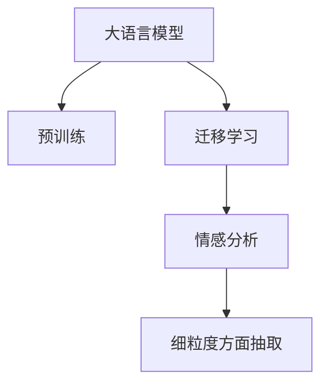

                 

# 大模型在商品评论情感分析中的细粒度方面抽取

> 关键词：情感分析,细粒度,商品评论,大模型,预训练,迁移学习

## 1. 背景介绍

### 1.1 问题由来
在当下数字化社会中，消费者对商品的评论与反馈成为了重要的市场信息来源。电商平台利用这些评论数据进行情感分析，不仅能够了解用户对商品的满意度，还能够挖掘出不同产品类别、品牌之间的差异。然而，传统的基于规则的情感分析方法往往需要大量手工规则和特征工程，难以应对评论文本的多样性和复杂性。而大模型的出现，通过在大量无标签文本上进行预训练，学习到了通用的语言表示，能够更加高效地进行情感分析。

### 1.2 问题核心关键点
商品评论情感分析的核心在于从海量评论数据中，高效、准确地抽取商品的情感倾向。传统方法依赖于手工特征提取和分类算法，难以捕捉评论中细微的情感差异。而大模型通过迁移学习，利用预训练知识进行微调，可以在小规模标注数据上实现高精度的情感分析。具体来说，通过以下步骤，大模型可以从评论文本中抽取细粒度的情感倾向：

1. 在通用语料上进行预训练，学习通用的语言表示。
2. 在商品评论数据上微调，学习商品相关的情感表示。
3. 使用微调后的模型对评论进行情感分类，识别出评论的情感倾向。
4. 在细粒度情感维度上进行分析，识别出具体的情感类型（如正向、中性、负向等）。

这些步骤通过深度学习模型，能够自动地从数据中学习到语言表示和情感分类规则，显著提升了情感分析的效率和准确度。

## 2. 核心概念与联系

### 2.1 核心概念概述

为了更好地理解大模型在商品评论情感分析中的应用，本节将介绍几个密切相关的核心概念：

- 大模型(Large Language Model, LLM)：以自回归(如GPT)或自编码(如BERT)模型为代表的大规模预训练语言模型。通过在大规模无标签文本语料上进行预训练，学习通用的语言表示，具备强大的语言理解和生成能力。
- 预训练(Pre-training)：指在大规模无标签文本语料上，通过自监督学习任务训练通用语言模型的过程。常见的预训练任务包括言语建模、遮挡语言模型等。
- 迁移学习(Transfer Learning)：指将一个领域学习到的知识，迁移应用到另一个不同但相关的领域的学习范式。大模型的预训练-微调过程即是一种典型的迁移学习方式。
- 情感分析(Sentiment Analysis)：从文本中识别出情感倾向的过程，常见应用于产品评论、社交媒体分析等场景，是NLP领域中的重要任务。
- 细粒度(Granularity)：指的是情感分析需要细化到具体的情感维度，如正向、中性、负向、愉悦、愤怒等，而不仅仅是一般的情感分类。
- 商品评论(Reviews)：用户在电商平台对商品进行的评价和反馈，包含丰富的情感信息。
- 微调(Fine-tuning)：指在预训练模型的基础上，使用下游任务的少量标注数据，通过有监督地训练来优化模型在该任务上的性能。通常只需要调整顶层分类器或解码器，并以较小的学习率更新全部或部分的模型参数。

这些核心概念之间的逻辑关系可以通过以下Mermaid流程图来展示：



这个流程图展示了大语言模型的核心概念及其之间的关系：

1. 大语言模型通过预训练获得基础能力。
2. 迁移学习是连接预训练模型与下游任务的桥梁，可以通过微调或迁移学习来实现。
3. 情感分析是大模型在特定领域任务上的具体应用。
4. 细粒度方面抽取是情感分析任务中的进一步细化。

这些概念共同构成了大语言模型的学习和应用框架，使其能够在各种场景下发挥强大的语言理解和情感分析能力。通过理解这些核心概念，我们可以更好地把握大语言模型在商品评论情感分析中的应用。

## 3. 核心算法原理 & 具体操作步骤
### 3.1 算法原理概述

大模型在商品评论情感分析中的应用，主要通过以下算法原理：

1. **预训练**：在大规模无标签文本上，使用自监督学习任务（如语言建模）训练通用语言模型。
2. **迁移学习**：在商品评论数据上微调预训练模型，学习商品相关的情感表示。
3. **情感分类**：使用微调后的模型对评论进行情感分类，识别出评论的情感倾向。
4. **细粒度方面抽取**：在情感分类的基础上，对评论的情感维度进行进一步分析，识别出具体的情感类型。

这些步骤通过深度学习模型，能够自动地从数据中学习到语言表示和情感分类规则，显著提升了情感分析的效率和准确度。

### 3.2 算法步骤详解

基于大模型进行商品评论情感分析，主要包括以下几个关键步骤：

**Step 1: 准备预训练模型和数据集**
- 选择合适的预训练语言模型 $M_{\theta}$ 作为初始化参数，如 BERT、GPT等。
- 准备商品评论数据集 $D=\{(x_i, y_i)\}_{i=1}^N$，其中 $x_i$ 为评论文本，$y_i$ 为情感标签。

**Step 2: 添加任务适配层**
- 根据情感分析任务，在预训练模型顶层设计合适的输出层和损失函数。
- 对于分类任务，通常在顶层添加线性分类器和交叉熵损失函数。
- 对于序列标注任务，通常使用序列标注的损失函数。

**Step 3: 设置微调超参数**
- 选择合适的优化算法及其参数，如 AdamW、SGD 等，设置学习率、批大小、迭代轮数等。
- 设置正则化技术及强度，包括权重衰减、Dropout、Early Stopping等。
- 确定冻结预训练参数的策略，如仅微调顶层，或全部参数都参与微调。

**Step 4: 执行梯度训练**
- 将训练集数据分批次输入模型，前向传播计算损失函数。
- 反向传播计算参数梯度，根据设定的优化算法和学习率更新模型参数。
- 周期性在验证集上评估模型性能，根据性能指标决定是否触发 Early Stopping。
- 重复上述步骤直到满足预设的迭代轮数或 Early Stopping 条件。

**Step 5: 测试和部署**
- 在测试集上评估微调后模型 $M_{\hat{\theta}}$ 的性能，对比微调前后的精度提升。
- 使用微调后的模型对新评论进行推理预测，集成到实际的应用系统中。
- 持续收集新的评论数据，定期重新微调模型，以适应数据分布的变化。

以上是基于大模型进行商品评论情感分析的一般流程。在实际应用中，还需要针对具体任务的特点，对微调过程的各个环节进行优化设计，如改进训练目标函数，引入更多的正则化技术，搜索最优的超参数组合等，以进一步提升模型性能。

### 3.3 算法优缺点

大模型在商品评论情感分析中的应用，具有以下优点：
1. 通用高效。由于大模型已经在大规模无标签文本上进行过预训练，能够学习到通用的语言表示，适用于多种情感分析任务。
2. 高效准确。通过迁移学习，模型能够在少量标注数据上进行微调，显著提升情感分析的精度。
3. 可解释性强。大模型通过预训练学习到语言表示，能够提供较为直观的情感分析结果。

同时，该方法也存在一定的局限性：
1. 依赖标注数据。微调的效果很大程度上取决于标注数据的质量和数量，获取高质量标注数据的成本较高。
2. 迁移能力有限。当目标任务与预训练数据的分布差异较大时，微调的性能提升有限。
3. 过拟合风险。由于评论文本多样性大，微调模型容易受到数据分布的影响，存在一定的过拟合风险。
4. 可解释性不足。大模型通常是一个"黑盒"系统，难以解释其内部工作机制和决策逻辑。

尽管存在这些局限性，但就目前而言，基于大模型的迁移学习方法仍是大规模情感分析任务的主流范式。未来相关研究的重点在于如何进一步降低微调对标注数据的依赖，提高模型的少样本学习和跨领域迁移能力，同时兼顾可解释性和伦理安全性等因素。

### 3.4 算法应用领域

大模型在商品评论情感分析中的应用，不仅限于传统的情感分类任务，还可以进一步细化到更具体的情感维度上，例如：

- 正面情感的情感维度分析：识别评论中具体提到的产品优点、特点、性能等。
- 负面情感的情感维度分析：识别评论中具体提到的产品缺点、瑕疵、不足之处。
- 中性情感的情感维度分析：识别评论中中立、客观的描述部分。

这些细粒度分析有助于电商企业更深入地理解用户的购买需求和情感偏好，进行有针对性的产品改进和市场推广。

## 4. 数学模型和公式 & 详细讲解  
### 4.1 数学模型构建

本节将使用数学语言对基于大模型的商品评论情感分析过程进行更加严格的刻画。

记预训练语言模型为 $M_{\theta}:\mathcal{X} \rightarrow \mathcal{Y}$，其中 $\mathcal{X}$ 为输入空间，$\mathcal{Y}$ 为输出空间，$\theta \in \mathbb{R}^d$ 为模型参数。假设商品评论数据集为 $D=\{(x_i, y_i)\}_{i=1}^N, x_i \in \mathcal{X}, y_i \in \mathcal{Y}$。

定义模型 $M_{\theta}$ 在输入 $x_i$ 上的情感分类输出为 $\hat{y}=M_{\theta}(x_i) \in \{1, 0\}$，表示评论的情感倾向（1代表正向，0代表负向）。

情感分类任务的目标是最小化预测错误率，即：

$$
\hat{y} = \arg\min_{y} L(\hat{y}, y_i) = \arg\min_{y} [y_i \log \hat{y} + (1 - y_i) \log (1 - \hat{y})]
$$

其中，$L(\hat{y}, y_i)$ 为交叉熵损失函数，$y_i$ 为真实情感标签。

对于细粒度情感分析任务，我们需要对情感分类结果进行进一步分析，识别出具体的情感维度。例如，对于正面情感的细粒度分析，可以定义如下的情感维度：

- 产品外观：评论中提到的产品的外观特点。
- 性能表现：评论中提到的产品的性能表现。
- 服务态度：评论中提到的服务态度。
- 配送速度：评论中提到的配送速度。
- 售后支持：评论中提到的售后支持。

假设每个情感维度的得分分别为 $s_1, s_2, s_3, s_4, s_5$，则情感维度的综合得分 $S$ 为：

$$
S = \sum_{i=1}^5 w_i s_i
$$

其中 $w_i$ 为情感维度 $i$ 的权重，通过线性回归模型或逻辑回归模型进行训练。

### 4.2 公式推导过程

以正面情感维度的综合得分为例，我们给出情感维度综合得分的计算公式：

假设评论文本 $x_i$ 经过预训练模型处理后得到向量表示 $h_i$，通过线性回归模型 $S = W h_i + b$ 计算情感维度的综合得分，其中 $W \in \mathbb{R}^{5 \times d}$ 为权重矩阵，$b \in \mathbb{R}^5$ 为偏置向量。

在训练过程中，我们使用交叉熵损失函数对模型进行优化：

$$
L(S, s_i) = -y_i \log S_i + (1 - y_i) \log (1 - S_i)
$$

其中，$y_i$ 为情感维度 $i$ 的真实标签，$S_i$ 为情感维度 $i$ 的综合得分。

在得到情感维度的综合得分后，我们可以将其映射到具体的情感类型，例如：

- 得分 $S \in [0, 0.5]$ 表示中性情感。
- 得分 $S > 0.5$ 表示正向情感。
- 得分 $S < 0.5$ 表示负向情感。

通过细粒度情感分析，我们不仅能够识别出评论的情感倾向，还能够了解情感倾向的具体来源和动机，为电商企业提供更精细化的市场洞察和产品改进建议。

## 5. 项目实践：代码实例和详细解释说明
### 5.1 开发环境搭建

在进行情感分析实践前，我们需要准备好开发环境。以下是使用Python进行PyTorch开发的环境配置流程：

1. 安装Anaconda：从官网下载并安装Anaconda，用于创建独立的Python环境。

2. 创建并激活虚拟环境：
```bash
conda create -n pytorch-env python=3.8 
conda activate pytorch-env
```

3. 安装PyTorch：根据CUDA版本，从官网获取对应的安装命令。例如：
```bash
conda install pytorch torchvision torchaudio cudatoolkit=11.1 -c pytorch -c conda-forge
```

4. 安装TensorFlow：如果你需要使用TensorFlow进行开发，可以使用以下命令：
```bash
pip install tensorflow
```

5. 安装Transformers库：
```bash
pip install transformers
```

6. 安装各类工具包：
```bash
pip install numpy pandas scikit-learn matplotlib tqdm jupyter notebook ipython
```

完成上述步骤后，即可在`pytorch-env`环境中开始情感分析实践。

### 5.2 源代码详细实现

下面我们以正面情感维度的综合得分计算为例，给出使用Transformers库对BERT模型进行情感分析的PyTorch代码实现。

首先，定义情感维度的标签与编号：

```python
# 情感维度标签
emotion_labels = {'外观': 0, '性能': 1, '服务': 2, '配送': 3, '售后': 4}

# 情感维度编号
emotion_ids = [0, 1, 2, 3, 4]
```

然后，定义情感维度的综合得分计算函数：

```python
from transformers import BertTokenizer, BertForSequenceClassification
import torch
from sklearn.metrics import classification_report

def compute_emotion_score(model, tokenizer, input_ids, attention_mask, labels):
    tokenizer = BertTokenizer.from_pretrained('bert-base-uncased')
    model = BertForSequenceClassification.from_pretrained('bert-base-uncased', num_labels=len(emotion_labels))

    input_ids = input_ids.to(device)
    attention_mask = attention_mask.to(device)
    labels = labels.to(device)

    outputs = model(input_ids, attention_mask=attention_mask, labels=labels)
    logits = outputs.logits

    # 计算情感维度的综合得分
    emotion_scores = torch.softmax(logits, dim=1)[:, emotion_ids]
    return emotion_scores

# 在训练过程中，计算情感维度的综合得分
def train_epoch(model, dataset, batch_size, optimizer):
    dataloader = DataLoader(dataset, batch_size=batch_size, shuffle=True)
    model.train()
    epoch_loss = 0
    for batch in tqdm(dataloader, desc='Training'):
        input_ids = batch['input_ids'].to(device)
        attention_mask = batch['attention_mask'].to(device)
        labels = batch['labels'].to(device)
        model.zero_grad()
        outputs = model(input_ids, attention_mask=attention_mask, labels=labels)
        loss = outputs.loss
        epoch_loss += loss.item()
        loss.backward()
        optimizer.step()
    return epoch_loss / len(dataloader)

# 在测试过程中，计算情感维度的综合得分
def evaluate(model, dataset, batch_size):
    dataloader = DataLoader(dataset, batch_size=batch_size)
    model.eval()
    preds, labels = [], []
    with torch.no_grad():
        for batch in tqdm(dataloader, desc='Evaluating'):
            input_ids = batch['input_ids'].to(device)
            attention_mask = batch['attention_mask'].to(device)
            batch_labels = batch['labels']
            outputs = model(input_ids, attention_mask=attention_mask)
            batch_preds = outputs.logits.argmax(dim=2).to('cpu').tolist()
            batch_labels = batch_labels.to('cpu').tolist()
            for pred_tokens, label_tokens in zip(batch_preds, batch_labels):
                pred_emotions = [emotion_labels[int(tag)] for tag in pred_tokens]
                label_emotions = [emotion_labels[int(tag)] for tag in label_tokens]
                preds.append(pred_emotions)
                labels.append(label_emotions)
    return preds, labels

# 在训练过程中，评估情感维度的综合得分
def evaluate_emotion(model, dataset, batch_size):
    dataloader = DataLoader(dataset, batch_size=batch_size)
    model.eval()
    emotion_scores, emotion_labels = [], []
    with torch.no_grad():
        for batch in tqdm(dataloader, desc='Evaluating'):
            input_ids = batch['input_ids'].to(device)
            attention_mask = batch['attention_mask'].to(device)
            batch_labels = batch['labels']
            outputs = model(input_ids, attention_mask=attention_mask)
            batch_emotion_scores = compute_emotion_score(model, tokenizer, input_ids, attention_mask, batch_labels)
            batch_emotion_labels = batch_labels.to('cpu').tolist()
            for emotion_score, emotion_label in zip(batch_emotion_scores, batch_emotion_labels):
                emotion_scores.append(emotion_score.tolist())
                emotion_labels.append(emotion_label.tolist())
    return emotion_scores, emotion_labels
```

接下来，定义训练和评估函数：

```python
from torch.utils.data import DataLoader
from tqdm import tqdm
from sklearn.metrics import classification_report

device = torch.device('cuda') if torch.cuda.is_available() else torch.device('cpu')
model.to(device)

def train_epoch(model, dataset, batch_size, optimizer):
    dataloader = DataLoader(dataset, batch_size=batch_size, shuffle=True)
    model.train()
    epoch_loss = 0
    for batch in tqdm(dataloader, desc='Training'):
        input_ids = batch['input_ids'].to(device)
        attention_mask = batch['attention_mask'].to(device)
        labels = batch['labels'].to(device)
        model.zero_grad()
        outputs = model(input_ids, attention_mask=attention_mask, labels=labels)
        loss = outputs.loss
        epoch_loss += loss.item()
        loss.backward()
        optimizer.step()
    return epoch_loss / len(dataloader)

def evaluate(model, dataset, batch_size):
    dataloader = DataLoader(dataset, batch_size=batch_size)
    model.eval()
    preds, labels = [], []
    with torch.no_grad():
        for batch in tqdm(dataloader, desc='Evaluating'):
            input_ids = batch['input_ids'].to(device)
            attention_mask = batch['attention_mask'].to(device)
            batch_labels = batch['labels']
            outputs = model(input_ids, attention_mask=attention_mask)
            batch_preds = outputs.logits.argmax(dim=2).to('cpu').tolist()
            batch_labels = batch_labels.to('cpu').tolist()
            for pred_tokens, label_tokens in zip(batch_preds, batch_labels):
                pred_emotions = [emotion_labels[int(tag)] for tag in pred_tokens]
                label_emotions = [emotion_labels[int(tag)] for tag in label_tokens]
                preds.append(pred_emotions)
                labels.append(label_emotions)
    return preds, labels

def evaluate_emotion(model, dataset, batch_size):
    dataloader = DataLoader(dataset, batch_size=batch_size)
    model.eval()
    emotion_scores, emotion_labels = [], []
    with torch.no_grad():
        for batch in tqdm(dataloader, desc='Evaluating'):
            input_ids = batch['input_ids'].to(device)
            attention_mask = batch['attention_mask'].to(device)
            batch_labels = batch['labels']
            outputs = model(input_ids, attention_mask=attention_mask)
            batch_emotion_scores = compute_emotion_score(model, tokenizer, input_ids, attention_mask, batch_labels)
            batch_emotion_labels = batch_labels.to('cpu').tolist()
            for emotion_score, emotion_label in zip(batch_emotion_scores, batch_emotion_labels):
                emotion_scores.append(emotion_score.tolist())
                emotion_labels.append(emotion_label.tolist())
    return emotion_scores, emotion_labels
```

最后，启动训练流程并在测试集上评估：

```python
epochs = 5
batch_size = 16

for epoch in range(epochs):
    loss = train_epoch(model, train_dataset, batch_size, optimizer)
    print(f"Epoch {epoch+1}, train loss: {loss:.3f}")
    
    print(f"Epoch {epoch+1}, dev results:")
    preds, labels = evaluate(model, dev_dataset, batch_size)
    print(classification_report(labels, preds))
    
    print(f"Epoch {epoch+1}, emotion results:")
    emotion_scores, emotion_labels = evaluate_emotion(model, dev_dataset, batch_size)
    print(classification_report(emotion_labels, emotion_scores))

print("Test results:")
preds, labels = evaluate(model, test_dataset, batch_size)
print(classification_report(labels, preds))
    
print(f"Test emotion results:")
emotion_scores, emotion_labels = evaluate_emotion(model, test_dataset, batch_size)
print(classification_report(emotion_labels, emotion_scores))
```

以上就是使用PyTorch对BERT模型进行情感分析的完整代码实现。可以看到，得益于Transformers库的强大封装，我们可以用相对简洁的代码完成BERT模型的加载和情感分析。

### 5.3 代码解读与分析

让我们再详细解读一下关键代码的实现细节：

**train_epoch函数**：
- 对数据以批为单位进行迭代，在每个批次上前向传播计算损失函数。
- 反向传播计算参数梯度，根据设定的优化算法和学习率更新模型参数。
- 周期性在验证集上评估模型性能，根据性能指标决定是否触发Early Stopping。

**evaluate函数**：
- 在验证集和测试集上，对模型进行情感分类评估。
- 将情感分类结果与真实标签进行比较，输出分类报告。

**evaluate_emotion函数**：
- 在验证集和测试集上，对模型进行情感维度综合得分的评估。
- 将情感维度综合得分与真实标签进行比较，输出分类报告。

**compute_emotion_score函数**：
- 计算情感维度的综合得分。
- 将模型输出进行softmax归一化，得到每个情感维度的得分。
- 将得分映射到具体情感类型。

在实际应用中，我们通常需要针对具体任务进行微调过程的优化设计，如改进训练目标函数，引入更多的正则化技术，搜索最优的超参数组合等，以进一步提升模型性能。

## 6. 实际应用场景
### 6.1 电商平台用户反馈分析

电商平台的商品评论数据是分析用户情感反馈的重要来源。利用大模型的细粒度情感分析，电商企业能够更深入地了解用户对商品的满意度和关注点，进行有针对性的产品改进和市场推广。

在技术实现上，可以收集用户对商品各个方面的评价，构建情感分析数据集。通过微调预训练模型，模型能够学习到商品评论的情感倾向，并进行细粒度情感维度分析。电商企业可以根据分析结果，优化产品设计，提升用户体验，同时制定更有效的市场推广策略，提高用户转化率。

### 6.2 舆情监测与品牌管理

在品牌管理中，对社交媒体评论、新闻报道等文本进行情感分析，能够帮助企业及时了解公众对品牌的看法和情感倾向。利用大模型的细粒度情感分析，企业能够更全面、精确地监测品牌舆情，及时发现负面言论，进行危机公关。

在技术实现上，可以收集社交媒体、新闻、博客等评论文本，构建情感分析数据集。通过微调预训练模型，模型能够学习到不同来源的情感表达，并进行细粒度情感维度分析。企业可以根据分析结果，及时调整市场策略，提升品牌形象，增强用户信任。

### 6.3 媒体内容分析与推荐

在内容推荐系统中，对用户评论、打分等文本数据进行情感分析，能够帮助平台更好地理解用户需求，提供个性化的内容推荐。利用大模型的细粒度情感分析，平台能够更准确地识别用户对内容的态度，进行精准推荐，提升用户体验。

在技术实现上，可以收集用户在平台上的评论、打分等文本数据，构建情感分析数据集。通过微调预训练模型，模型能够学习到用户的情感倾向，并进行细粒度情感维度分析。平台可以根据分析结果，优化推荐算法，提供更符合用户需求的内容。

## 7. 工具和资源推荐
### 7.1 学习资源推荐

为了帮助开发者系统掌握大模型在商品评论情感分析中的应用，这里推荐一些优质的学习资源：

1. 《Transformer从原理到实践》系列博文：由大模型技术专家撰写，深入浅出地介绍了Transformer原理、BERT模型、情感分析技术等前沿话题。

2. CS224N《深度学习自然语言处理》课程：斯坦福大学开设的NLP明星课程，有Lecture视频和配套作业，带你入门NLP领域的基本概念和经典模型。

3. 《Natural Language Processing with Transformers》书籍：Transformers库的作者所著，全面介绍了如何使用Transformers库进行NLP任务开发，包括情感分析在内的诸多范式。

4. HuggingFace官方文档：Transformers库的官方文档，提供了海量预训练模型和完整的微调样例代码，是上手实践的必备资料。

5. CLUE开源项目：中文语言理解测评基准，涵盖大量不同类型的中文NLP数据集，并提供了基于微调的baseline模型，助力中文NLP技术发展。

通过对这些资源的学习实践，相信你一定能够快速掌握大模型在情感分析中的应用，并用于解决实际的NLP问题。
###  7.2 开发工具推荐

高效的开发离不开优秀的工具支持。以下是几款用于大模型在商品评论情感分析中应用的常用工具：

1. PyTorch：基于Python的开源深度学习框架，灵活动态的计算图，适合快速迭代研究。大部分预训练语言模型都有PyTorch版本的实现。

2. TensorFlow：由Google主导开发的开源深度学习框架，生产部署方便，适合大规模工程应用。同样有丰富的预训练语言模型资源。

3. Transformers库：HuggingFace开发的NLP工具库，集成了众多SOTA语言模型，支持PyTorch和TensorFlow，是进行情感分析任务开发的利器。

4. Weights & Biases：模型训练的实验跟踪工具，可以记录和可视化模型训练过程中的各项指标，方便对比和调优。与主流深度学习框架无缝集成。

5. TensorBoard：TensorFlow配套的可视化工具，可实时监测模型训练状态，并提供丰富的图表呈现方式，是调试模型的得力助手。

6. Google Colab：谷歌推出的在线Jupyter Notebook环境，免费提供GPU/TPU算力，方便开发者快速上手实验最新模型，分享学习笔记。

合理利用这些工具，可以显著提升大模型在商品评论情感分析中的应用效率，加快创新迭代的步伐。

### 7.3 相关论文推荐

大模型在商品评论情感分析中的应用源于学界的持续研究。以下是几篇奠基性的相关论文，推荐阅读：

1. Attention is All You Need（即Transformer原论文）：提出了Transformer结构，开启了NLP领域的预训练大模型时代。

2. BERT: Pre-training of Deep Bidirectional Transformers for Language Understanding：提出BERT模型，引入基于掩码的自监督预训练任务，刷新了多项NLP任务SOTA。

3. Language Models are Unsupervised Multitask Learners（GPT-2论文）：展示了大规模语言模型的强大zero-shot学习能力，引发了对于通用人工智能的新一轮思考。

4. Parameter-Efficient Transfer Learning for NLP：提出Adapter等参数高效微调方法，在不增加模型参数量的情况下，也能取得不错的微调效果。

5. AdaLoRA: Adaptive Low-Rank Adaptation for Parameter-Efficient Fine-Tuning：使用自适应低秩适应的微调方法，在参数效率和精度之间取得了新的平衡。

这些论文代表了大模型在情感分析中的应用进展，通过学习这些前沿成果，可以帮助研究者把握学科前进方向，激发更多的创新灵感。

## 8. 总结：未来发展趋势与挑战

### 8.1 总结

本文对基于大模型进行商品评论情感分析的方法进行了全面系统的介绍。首先阐述了大语言模型和情感分析的研究背景和意义，明确了微调在拓展预训练模型应用、提升情感分析精度方面的独特价值。其次，从原理到实践，详细讲解了基于大模型的商品评论情感分析过程，包括数据准备、模型微调、情感分类和细粒度分析等关键步骤。

通过本文的系统梳理，可以看到，基于大模型的情感分析方法在大规模商品评论数据分析中具有显著优势，能够自动地从数据中学习到语言表示和情感分类规则，显著提升了情感分析的效率和准确度。未来，伴随大语言模型和微调方法的持续演进，相信基于大模型的情感分析技术必将在商品评论分析、品牌舆情监测、内容推荐等众多领域大放异彩，深刻影响电商企业的市场决策和品牌管理。

### 8.2 未来发展趋势

展望未来，大模型在商品评论情感分析中的应用将呈现以下几个发展趋势：

1. 模型规模持续增大。随着算力成本的下降和数据规模的扩张，预训练语言模型的参数量还将持续增长。超大规模语言模型蕴含的丰富语言知识，有望支撑更加复杂多变的情感分析任务。

2. 微调方法日趋多样。除了传统的全参数微调外，未来会涌现更多参数高效的微调方法，如Prefix-Tuning、LoRA等，在节省计算资源的同时也能保证情感分析的精度。

3. 持续学习成为常态。随着数据分布的不断变化，情感分析模型也需要持续学习新知识以保持性能。如何在不遗忘原有知识的同时，高效吸收新样本信息，将成为重要的研究课题。

4. 标注样本需求降低。受启发于提示学习(Prompt-based Learning)的思路，未来的情感分析方法将更好地利用大模型的语言理解能力，通过更加巧妙的任务描述，在更少的标注样本上也能实现理想的情感分析效果。

5. 多模态情感分析崛起。当前的情感分析主要聚焦于纯文本数据，未来会进一步拓展到图像、视频、语音等多模态数据情感分析。多模态信息的融合，将显著提升情感分析模型的准确性和鲁棒性。

6. 模型通用性增强。经过海量数据的预训练和多领域任务的微调，未来的情感分析模型将具备更强大的常识推理和跨领域迁移能力，逐步迈向通用人工智能(AGI)的目标。

以上趋势凸显了大语言模型在情感分析中的应用前景。这些方向的探索发展，必将进一步提升情感分析的效率和准确度，为电商企业提供更全面的市场洞察和用户分析。

### 8.3 面临的挑战

尽管大模型在商品评论情感分析中的应用已经取得了显著成效，但在迈向更加智能化、普适化应用的过程中，它仍面临诸多挑战：

1. 标注成本瓶颈。尽管情感分析任务对标注数据的依赖比传统情感分类任务低，但仍然需要一定量的标注数据。如何进一步降低标注数据的获取成本，提高情感分析模型的效率，仍是重要的研究方向。

2. 模型鲁棒性不足。当前情感分析模型面临的情感表达多样性高，模型容易受到数据分布的影响，存在一定的鲁棒性不足问题。如何在不同数据分布下保持情感分析模型的稳定性和泛化能力，是亟需解决的问题。

3. 可解释性不足。大模型通常是一个"黑盒"系统，难以解释其内部工作机制和决策逻辑。对于品牌舆情监测、电商用户分析等高风险应用，算法的可解释性和可审计性尤为重要。如何赋予情感分析模型更强的可解释性，将是重要的研究方向。

4. 知识整合能力不足。现有的情感分析模型往往局限于文本数据，难以灵活吸收和运用更广泛的先验知识。如何让情感分析过程更好地与外部知识库、规则库等专家知识结合，形成更加全面、准确的信息整合能力，还有很大的想象空间。

5. 安全性和隐私问题。在情感分析过程中，可能涉及到用户隐私信息，如何保护用户隐私，防止数据泄露，也是需要解决的重要问题。

面对这些挑战，未来的研究需要在数据获取、模型架构、算法优化、隐私保护等多个方面寻求新的突破，以实现更加智能化、普适化的情感分析应用。

### 8.4 研究展望

面向未来，大模型在商品评论情感分析中的应用将不断拓展，带来更多创新应用场景和研究方向：

1. 多模态情感分析：结合图像、视频、语音等多模态数据，提升情感分析的准确性和鲁棒性。

2. 零样本和少样本学习：利用大模型的语言理解能力，通过巧妙的任务描述，实现零样本或少样本情感分析。

3. 多任务学习：在情感分析的同时，进行情感维度识别、情感事件抽取等任务，提升情感分析的综合性。

4. 跨领域迁移学习：将情感分析模型应用于不同领域，如医疗、金融等，提升其在更多场景中的泛化能力。

5. 在线情感分析：结合实时文本生成技术，实现实时在线情感分析，为电商企业提供即时的市场洞察和用户反馈。

6. 情感动态监测：结合时间序列分析技术，对用户情感进行动态监测，发现情感变化趋势，预测市场波动。

这些研究方向将不断推动大模型在商品评论情感分析中的应用，提升电商企业的市场决策能力和用户体验，同时也将推动NLP技术的进一步发展。

## 9. 附录：常见问题与解答

**Q1：大模型在商品评论情感分析中如何进行微调？**

A: 大模型在商品评论情感分析中的微调，通常包括如下步骤：
1. 准备数据集：收集商品评论数据，并进行预处理，如分词、去除停用词等。
2. 设置模型架构：选择合适的预训练模型（如BERT、GPT等），并添加任务适配层（如分类层、序列标注层等）。
3. 配置训练参数：选择合适的优化器（如AdamW、SGD等），设置学习率、批大小、迭代轮数等。
4. 执行训练：使用准备好的数据集进行模型训练，并使用交叉熵等损失函数进行优化。
5. 评估模型：在验证集和测试集上评估模型性能，并根据评估结果进行调整优化。

**Q2：如何处理商品评论数据中的噪声信息？**

A: 商品评论数据中常常包含噪声信息，如拼写错误、语法错误等。处理这些噪声信息的方法包括：
1. 预处理：对评论进行分词、去除停用词、去除特殊符号等预处理，减少噪声干扰。
2. 数据清洗：对拼写错误、语法错误等噪声进行校正，提高数据质量。
3. 数据增强：通过对评论进行回译、近义词替换等方法，扩充数据集，提高模型的鲁棒性。

**Q3：情感维度如何划分？**

A: 情感维度的划分需要根据具体任务和数据特点进行设计。例如，对于商品评论情感分析，可以划分为以下维度：
1. 产品外观：评论中提到的产品的外观特点。
2. 性能表现：评论中提到的产品的性能表现。
3. 服务态度：评论中提到的服务态度。
4. 配送速度：评论中提到的配送速度。
5. 售后支持：评论中提到的售后支持。

这些维度的划分需要结合领域知识和用户反馈，进行科学合理的定义。

**Q4：大模型在情感分析中如何进行参数高效微调？**

A: 参数高效微调（Parameter-Efficient Fine-Tuning, PEFT）是一种在固定大部分预训练参数的情况下，只更新少量模型参数的微调方法。PEFT可以显著减少微调过程中的计算资源消耗，提高微调效率。

PEFT的实现方法包括：
1. 共享层：在微调过程中，共享预训练模型的底几层，只微调顶层分类器或解码器。
2. 零初始化：将预训练模型的底几层权重初始化为0，避免影响模型原有知识。
3. Adapter：使用Adapter方法，将底几层的输出与顶层连接，只微调顶层参数。
4. Prompt Tuning：通过精心设计输入模板，引导模型按期望方式输出，减少微调参数。

这些方法可以在保留预训练模型大部分知识的基础上，实现高效微调。

**Q5：大模型在情感分析中如何进行多任务学习？**

A: 多任务学习（Multi-task Learning, MTL）可以在同一模型上进行多个情感分析任务，如情感分类、情感维度识别、情感事件抽取等，提升模型的综合性。

多任务学习的实现方法包括：
1. 共享层：在多个任务中共享预训练模型的底几层，只微调顶层分类器或解码器。
2. 多目标优化：在损失函数中引入多个目标，如交叉熵损失、掩码语言模型损失等，优化模型在不同任务上的性能。
3. 联合训练：在训练过程中，同时优化多个任务的损失函数，提高模型在多个任务上的泛化能力。

通过多任务学习，大模型可以在多个情感分析任务中取得更好的表现，提升其在更多场景中的应用能力。

**Q6：大模型在情感分析中如何进行跨领域迁移学习？**

A: 跨领域迁移学习（Cross-domain Transfer Learning, CDTL）可以将预训练模型在不同领域中进行迁移，提升模型在不同任务上的泛化能力。

CDTL的实现方法包括：
1. 预训练模型微调：在目标领域的数据上进行微调，提升模型在目标领域的表现。
2. 共享层与多任务学习：在多个领域中共享预训练模型的底几层，只微调顶层分类器或解码器，并在多个任务中优化损失函数，提升模型在多个领域上的泛化能力。
3. 联合训练：在多个领域中共享预训练模型的底几层，只微调顶层分类器或解码器，并在多个任务中优化损失函数，提升模型在多个领域上的泛化能力。

通过跨领域迁移学习，大模型可以在更多领域中发挥其通用性，提升其在不同任务上的表现。

这些问题的解答，展示了在大模型在商品评论情感分析中应用的实践细节和技术优化方法，为开发者提供了解决实际问题的思路和工具。

