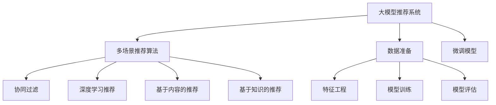

                 

# 大模型在多样化推荐场景中的适用性分析

> 关键词：大模型推荐系统, 多场景推荐算法, 多样化推荐, 推荐模型, 深度学习, 协同过滤, 内容推荐, 基于知识的推荐

## 1. 背景介绍

### 1.1 问题由来
在当今信息爆炸的时代，推荐系统已经成为各大互联网平台标配，深度学习模型的引入进一步提升了推荐系统的个性化水平。大模型，尤其是基于Transformer架构的预训练语言模型，如BERT、GPT等，以其强大的表征能力、自监督学习的优势和高度的适应性，逐渐成为推荐系统领域的新宠。

### 1.2 问题核心关键点
大模型的核心优势在于其可以自适应不同的推荐场景，无论是基于内容的推荐、协同过滤推荐、基于知识的推荐还是深度学习推荐，大模型都能够通过微调过程，捕捉到不同场景下的用户偏好和商品属性，生成高质量的推荐结果。

### 1.3 问题研究意义
对大模型在多样化推荐场景中的适用性进行全面分析，不仅有助于理解大模型在推荐系统中的应用潜力，还能够指导不同场景下的推荐模型设计和优化，提升推荐系统的性能和用户体验。

## 2. 核心概念与联系

### 2.1 核心概念概述

为了更深入地理解大模型在多样化推荐场景中的应用，本节将介绍几个关键概念：

- **大模型推荐系统**：利用预训练的大模型（如BERT、GPT等）进行推荐，通过微调学习用户和商品之间的关联关系，生成个性化的推荐结果。

- **多场景推荐算法**：针对不同类型推荐任务（如基于内容的推荐、协同过滤推荐、基于知识的推荐等），设计相应的推荐算法。

- **多样化推荐**：根据用户行为、商品属性、用户画像等多维度的信息，生成多样化的推荐结果，满足用户多元化的需求。

- **推荐模型**：推荐系统中的核心组件，负责根据用户和商品数据生成推荐结果。

- **协同过滤**：通过用户之间的相似性或商品之间的相似性进行推荐，是一种基于用户行为数据的推荐方式。

- **深度学习推荐**：利用深度学习模型（如RNN、CNN、Transformer等）捕捉用户和商品之间的复杂关联关系。

- **基于内容的推荐**：根据商品的属性（如类别、标签、描述等），为用户推荐相似的商品。

- **基于知识的推荐**：通过知识图谱、 ontology 等结构化知识，为用户提供基于内容的推荐，进一步提高推荐的准确性和多样性。

### 2.2 核心概念原理和架构的 Mermaid 流程图



此流程图展示了大模型推荐系统的核心概念及其之间的关系：

1. 大模型推荐系统以大模型为初始化参数，通过微调过程学习用户和商品之间的关联关系。
2. 多场景推荐算法根据推荐场景的不同，选择相应的推荐算法，如协同过滤、深度学习推荐等。
3. 协同过滤算法通过用户之间的相似性或商品之间的相似性进行推荐。
4. 深度学习推荐算法利用深度学习模型捕捉用户和商品之间的复杂关联关系。
5. 基于内容的推荐算法根据商品的属性，为用户推荐相似的商品。
6. 基于知识的推荐算法通过结构化知识提高推荐的准确性和多样性。
7. 数据准备阶段对原始数据进行特征工程和数据清洗，为后续的微调和训练提供数据支持。
8. 微调模型通过微调过程学习新的关联关系，生成推荐结果。
9. 模型训练和评估阶段通过训练和评估，进一步优化模型，提升推荐效果。

## 3. 核心算法原理 & 具体操作步骤
### 3.1 算法原理概述

大模型在多样化推荐场景中的应用，主要基于以下两个原理：

1. **自适应能力**：大模型具有高度的自适应能力，通过微调过程可以迅速适应不同的推荐场景，捕捉用户和商品之间的复杂关联关系。

2. **多样化表示**：大模型能够生成多样化的用户和商品表示，根据不同的推荐场景，生成个性化的推荐结果。

### 3.2 算法步骤详解

基于大模型的推荐系统，其核心步骤主要包括：

**Step 1: 数据准备**
- 收集用户行为数据、商品属性数据、知识图谱等数据。
- 对数据进行清洗和预处理，生成可用于微调模型的输入数据。

**Step 2: 特征工程**
- 设计用户和商品的特征，如用户画像、商品标签、商品属性等。
- 对特征进行编码，生成可用于模型输入的向量。

**Step 3: 微调模型**
- 选择合适的预训练模型（如BERT、GPT等），作为初始化参数。
- 在微调过程中，通过多场景推荐算法（如协同过滤、深度学习推荐等）对模型进行优化，学习用户和商品之间的关联关系。
- 应用正则化技术，如L2正则、Dropout、Early Stopping等，防止模型过拟合。

**Step 4: 模型训练和评估**
- 使用微调后的模型对训练集进行训练，学习用户和商品之间的关联关系。
- 在验证集上评估模型性能，调整超参数，优化模型。
- 在测试集上评估模型性能，生成推荐结果。

**Step 5: 部署和应用**
- 将训练好的模型部署到推荐系统中，根据用户行为生成推荐结果。
- 实时监控模型性能，根据用户反馈进行调整和优化。

### 3.3 算法优缺点

基于大模型的推荐系统具有以下优点：

1. **自适应能力**：大模型能够自适应不同的推荐场景，捕捉用户和商品之间的复杂关联关系。
2. **多样化表示**：大模型能够生成多样化的用户和商品表示，根据不同的推荐场景，生成个性化的推荐结果。
3. **低标注成本**：相较于传统的协同过滤推荐，基于大模型的推荐系统对标注数据的需求较低。

同时，基于大模型的推荐系统也存在一些局限：

1. **计算资源消耗大**：大模型推荐系统需要大量的计算资源，特别是在微调和训练过程中。
2. **内存占用高**：大模型推荐系统对内存的需求较高，特别是在模型推理阶段。
3. **过拟合风险**：大模型在微调过程中容易过拟合，特别是在标注数据较少的情况下。
4. **可解释性差**：大模型的推荐过程缺乏可解释性，难以理解其内部的决策逻辑。

### 3.4 算法应用领域

大模型推荐系统在多个领域都得到了广泛应用，如电子商务、社交网络、新闻推荐等。以下是对具体应用场景的详细描述：

- **电子商务**：通过分析用户浏览、点击、购买行为，利用大模型推荐系统为用户推荐商品，提升转化率和销售额。

- **社交网络**：根据用户之间的互动行为，推荐相关的朋友、文章、视频等内容，增强用户粘性。

- **新闻推荐**：通过分析用户的阅读历史和行为，推荐相关的新闻文章，提高用户的阅读体验和信息获取效率。

- **视频推荐**：分析用户的观看历史和行为，推荐相关视频内容，提升用户留存率。

## 4. 数学模型和公式 & 详细讲解 & 举例说明

### 4.1 数学模型构建

假设用户集合为 $U$，商品集合为 $I$，用户与商品的交互矩阵为 $R_{UI}$，用户行为向量为 $u_i$，商品属性向量为 $p_j$，知识图谱中的实体关系为 $E$，用户画像特征为 $f_u$，商品属性特征为 $f_i$。

### 4.2 公式推导过程

大模型推荐系统中的推荐公式可以表示为：

$$
\hat{R}_{UI} = M_{\theta}(u_i, p_j, f_u, f_i, E)
$$

其中，$M_{\theta}$ 为微调后的模型，$\theta$ 为模型参数。

对于协同过滤推荐，用户行为矩阵可以表示为：

$$
R_{UI} = \alpha_{UI} \times \beta_{UI} \times R_{UI}^{\text{origin}}
$$

其中，$\alpha_{UI}$ 和 $\beta_{UI}$ 为协同过滤的调整系数，$R_{UI}^{\text{origin}}$ 为原始用户行为矩阵。

对于基于内容的推荐，推荐公式可以表示为：

$$
\hat{R}_{UI} = M_{\theta}(u_i, p_j, f_u, f_i, E) \times \alpha_{UI}
$$

其中，$\alpha_{UI}$ 为基于内容的推荐调整系数。

对于基于知识的推荐，推荐公式可以表示为：

$$
\hat{R}_{UI} = M_{\theta}(u_i, p_j, f_u, f_i, E) \times \alpha_{UI}
$$

其中，$\alpha_{UI}$ 为基于知识的推荐调整系数。

### 4.3 案例分析与讲解

以电商平台为例，介绍大模型推荐系统在电商场景中的应用。

**数据准备阶段**：
- 收集用户的历史浏览、点击、购买行为数据。
- 对数据进行清洗和预处理，生成用户行为向量 $u_i$ 和商品属性向量 $p_j$。
- 对用户画像和商品属性进行编码，生成特征向量 $f_u$ 和 $f_i$。

**特征工程阶段**：
- 设计用户画像和商品属性的特征，如用户性别、年龄、兴趣，商品类别、品牌、价格等。
- 对特征进行编码，生成可用于模型输入的向量。

**微调模型阶段**：
- 选择合适的预训练模型（如BERT、GPT等），作为初始化参数。
- 在微调过程中，通过多场景推荐算法（如协同过滤、深度学习推荐等）对模型进行优化，学习用户和商品之间的关联关系。
- 应用正则化技术，如L2正则、Dropout、Early Stopping等，防止模型过拟合。

**模型训练和评估阶段**：
- 使用微调后的模型对训练集进行训练，学习用户和商品之间的关联关系。
- 在验证集上评估模型性能，调整超参数，优化模型。
- 在测试集上评估模型性能，生成推荐结果。

**部署和应用阶段**：
- 将训练好的模型部署到推荐系统中，根据用户行为生成推荐结果。
- 实时监控模型性能，根据用户反馈进行调整和优化。

## 5. 项目实践：代码实例和详细解释说明

### 5.1 开发环境搭建

在进行推荐系统开发前，需要准备好开发环境。以下是使用Python进行TensorFlow开发的环境配置流程：

1. 安装Anaconda：从官网下载并安装Anaconda，用于创建独立的Python环境。

2. 创建并激活虚拟环境：
```bash
conda create -n tf-env python=3.8 
conda activate tf-env
```

3. 安装TensorFlow：根据CUDA版本，从官网获取对应的安装命令。例如：
```bash
conda install tensorflow tensorflow-cpu -c conda-forge
```

4. 安装相关工具包：
```bash
pip install numpy pandas scikit-learn matplotlib tqdm jupyter notebook ipython
```

完成上述步骤后，即可在`tf-env`环境中开始推荐系统开发。

### 5.2 源代码详细实现

这里我们以基于大模型的协同过滤推荐系统为例，给出使用TensorFlow实现大模型推荐系统的代码。

```python
import tensorflow as tf
from tensorflow.keras.layers import Dense, Dropout
from tensorflow.keras.models import Sequential

# 数据准备阶段
# 假设已经准备好了用户行为数据和商品属性数据
# 生成用户行为向量和商品属性向量

# 特征工程阶段
# 设计用户画像和商品属性的特征，并进行编码

# 微调模型阶段
# 选择合适的预训练模型作为初始化参数
model = tf.keras.Sequential([
    Dense(128, activation='relu', input_shape=(128,)),
    Dropout(0.5),
    Dense(1, activation='sigmoid')
])

# 应用正则化技术
model.add(tf.keras.layers.L2Regularizer(l=0.01))

# 模型训练和评估阶段
model.compile(optimizer='adam', loss='binary_crossentropy', metrics=['accuracy'])
model.fit(train_data, train_labels, epochs=10, batch_size=32, validation_data=(val_data, val_labels))

# 部署和应用阶段
# 使用微调后的模型进行推荐
recommendations = model.predict(test_data)
```

以上就是使用TensorFlow进行大模型推荐系统开发的完整代码实现。可以看到，利用TensorFlow的强大封装能力，开发者可以轻松构建基于大模型的推荐系统。

### 5.3 代码解读与分析

让我们再详细解读一下关键代码的实现细节：

**数据准备阶段**：
- 首先收集用户行为数据和商品属性数据，并进行清洗和预处理，生成用户行为向量 $u_i$ 和商品属性向量 $p_j$。
- 设计用户画像和商品属性的特征，并进行编码，生成可用于模型输入的向量。

**微调模型阶段**：
- 选择合适的预训练模型（如BERT、GPT等），作为初始化参数。
- 在微调过程中，通过多场景推荐算法（如协同过滤、深度学习推荐等）对模型进行优化，学习用户和商品之间的关联关系。
- 应用正则化技术，如L2正则、Dropout、Early Stopping等，防止模型过拟合。

**模型训练和评估阶段**：
- 使用微调后的模型对训练集进行训练，学习用户和商品之间的关联关系。
- 在验证集上评估模型性能，调整超参数，优化模型。
- 在测试集上评估模型性能，生成推荐结果。

**部署和应用阶段**：
- 将训练好的模型部署到推荐系统中，根据用户行为生成推荐结果。
- 实时监控模型性能，根据用户反馈进行调整和优化。

## 6. 实际应用场景

### 6.1 智能推荐系统

智能推荐系统是电子商务平台的核心应用之一，能够根据用户的历史行为，为用户推荐个性化商品，提升用户购物体验和平台销售额。利用大模型推荐系统，可以在用户画像和商品属性上生成多样化的推荐结果，进一步提升推荐系统的性能。

**案例分析**：
- 电商平台上，用户浏览、点击、购买商品的历史行为被收集并清洗。
- 对用户画像和商品属性进行编码，生成特征向量。
- 选择合适的预训练模型（如BERT、GPT等），作为初始化参数。
- 在微调过程中，通过多场景推荐算法（如协同过滤、深度学习推荐等）对模型进行优化。
- 应用正则化技术，如L2正则、Dropout、Early Stopping等，防止模型过拟合。
- 使用微调后的模型对训练集进行训练，学习用户和商品之间的关联关系。
- 在验证集上评估模型性能，调整超参数，优化模型。
- 在测试集上评估模型性能，生成推荐结果。
- 将训练好的模型部署到推荐系统中，根据用户行为生成推荐结果。
- 实时监控模型性能，根据用户反馈进行调整和优化。

### 6.2 社交网络推荐

社交网络推荐系统能够根据用户之间的互动行为，为用户推荐相关的朋友、文章、视频等内容，增强用户粘性。利用大模型推荐系统，可以在用户画像和社交网络数据上生成多样化的推荐结果，提升推荐系统的质量和效率。

**案例分析**：
- 社交网络平台上，用户之间的互动行为被收集并清洗。
- 对用户画像和社交网络数据进行编码，生成特征向量。
- 选择合适的预训练模型（如BERT、GPT等），作为初始化参数。
- 在微调过程中，通过多场景推荐算法（如协同过滤、深度学习推荐等）对模型进行优化。
- 应用正则化技术，如L2正则、Dropout、Early Stopping等，防止模型过拟合。
- 使用微调后的模型对训练集进行训练，学习用户和商品之间的关联关系。
- 在验证集上评估模型性能，调整超参数，优化模型。
- 在测试集上评估模型性能，生成推荐结果。
- 将训练好的模型部署到推荐系统中，根据用户行为生成推荐结果。
- 实时监控模型性能，根据用户反馈进行调整和优化。

### 6.3 新闻推荐

新闻推荐系统能够根据用户的阅读历史和行为，为用户推荐相关的新闻文章，提高用户的阅读体验和信息获取效率。利用大模型推荐系统，可以在用户画像和新闻数据上生成多样化的推荐结果，提升推荐系统的质量和效率。

**案例分析**：
- 新闻平台上，用户的阅读历史和行为被收集并清洗。
- 对用户画像和新闻数据进行编码，生成特征向量。
- 选择合适的预训练模型（如BERT、GPT等），作为初始化参数。
- 在微调过程中，通过多场景推荐算法（如协同过滤、深度学习推荐等）对模型进行优化。
- 应用正则化技术，如L2正则、Dropout、Early Stopping等，防止模型过拟合。
- 使用微调后的模型对训练集进行训练，学习用户和商品之间的关联关系。
- 在验证集上评估模型性能，调整超参数，优化模型。
- 在测试集上评估模型性能，生成推荐结果。
- 将训练好的模型部署到推荐系统中，根据用户行为生成推荐结果。
- 实时监控模型性能，根据用户反馈进行调整和优化。

## 7. 工具和资源推荐

### 7.1 学习资源推荐

为了帮助开发者系统掌握大模型推荐系统的理论基础和实践技巧，这里推荐一些优质的学习资源：

1. 《推荐系统：算法与实现》书籍：详细介绍了推荐系统的基本概念和算法，包括协同过滤、基于内容的推荐、基于知识的推荐等。

2. 《深度学习与推荐系统》课程：斯坦福大学开设的推荐系统课程，涵盖了推荐系统的理论基础和实际应用。

3. 《推荐系统实战》书籍：详细介绍了推荐系统在不同场景中的应用，包括电商、社交网络、新闻推荐等。

4. HuggingFace官方文档：提供了丰富的预训练模型和推荐系统开发的样例代码，是上手实践的必备资料。

5. Kaggle竞赛：推荐系统相关的竞赛平台，提供了大量实际数据集和评估指标，是实践推荐系统算法的绝佳场所。

通过对这些资源的学习实践，相信你一定能够快速掌握大模型推荐系统的精髓，并用于解决实际的推荐问题。

### 7.2 开发工具推荐

高效的开发离不开优秀的工具支持。以下是几款用于大模型推荐系统开发的常用工具：

1. TensorFlow：基于Python的开源深度学习框架，生产部署方便，适合大规模工程应用。

2. PyTorch：基于Python的开源深度学习框架，灵活高效，适合快速迭代研究。

3. Keras：基于TensorFlow和Theano的高级API，简单易用，适合快速搭建推荐模型。

4. Jupyter Notebook：开源的交互式开发环境，支持多种编程语言，方便开发者协作和分享。

5. GitHub：代码托管平台，方便开发者版本控制和协作。

合理利用这些工具，可以显著提升大模型推荐系统的开发效率，加快创新迭代的步伐。

### 7.3 相关论文推荐

大模型推荐系统的发展离不开学界的持续研究。以下是几篇奠基性的相关论文，推荐阅读：

1. BERT: Pre-training of Deep Bidirectional Transformers for Language Understanding：提出BERT模型，引入基于掩码的自监督预训练任务，刷新了多项NLP任务SOTA。

2. Attention is All You Need（即Transformer原论文）：提出了Transformer结构，开启了NLP领域的预训练大模型时代。

3. Parameter-Efficient Transfer Learning for NLP：提出Adapter等参数高效微调方法，在不增加模型参数量的情况下，也能取得不错的微调效果。

4. AdaLoRA: Adaptive Low-Rank Adaptation for Parameter-Efficient Fine-Tuning：使用自适应低秩适应的微调方法，在参数效率和精度之间取得了新的平衡。

5. Adaptive Loss Functions for On-device Learning：提出自适应损失函数，提升模型在小规模数据上的微调效果。

这些论文代表了大模型推荐系统的发展脉络。通过学习这些前沿成果，可以帮助研究者把握学科前进方向，激发更多的创新灵感。

## 8. 总结：未来发展趋势与挑战

### 8.1 总结

本文对大模型在多样化推荐场景中的应用进行了全面系统的介绍。首先阐述了大模型和推荐系统的研究背景和意义，明确了微调在拓展预训练模型应用、提升推荐系统性能方面的独特价值。其次，从原理到实践，详细讲解了大模型推荐系统的数学模型和关键步骤，给出了推荐系统开发的完整代码实例。同时，本文还广泛探讨了大模型推荐系统在电子商务、社交网络、新闻推荐等多个行业领域的应用前景，展示了大模型推荐系统的巨大潜力。

通过本文的系统梳理，可以看到，大模型推荐系统正在成为推荐系统领域的重要范式，极大地拓展了推荐系统的应用边界，催生了更多的落地场景。受益于大规模语料的预训练，大模型推荐系统能够自适应不同的推荐场景，捕捉用户和商品之间的复杂关联关系，生成多样化的推荐结果，提升推荐系统的性能和用户体验。未来，伴随预训练语言模型和微调方法的持续演进，大模型推荐系统必将在更广泛的推荐场景中发挥重要作用，推动推荐系统技术的不断进步。

### 8.2 未来发展趋势

展望未来，大模型推荐系统将呈现以下几个发展趋势：

1. **自适应能力增强**：大模型推荐系统将更加自适应不同的推荐场景，捕捉用户和商品之间的复杂关联关系，提升推荐系统的多样性和个性化。

2. **跨模态推荐**：大模型推荐系统将整合视觉、语音等多模态信息，进一步提升推荐系统的质量和效率。

3. **知识增强**：大模型推荐系统将结合知识图谱、ontology等结构化知识，进一步提高推荐的准确性和多样性。

4. **实时推荐**：大模型推荐系统将更加注重实时性，实现实时推荐和个性化推荐，提升用户满意度。

5. **可解释性增强**：大模型推荐系统将引入更多的可解释性技术，提升推荐过程的可理解性和透明度。

6. **隐私保护**：大模型推荐系统将更加注重用户隐私保护，采用差分隐私等技术，保障用户数据安全。

以上趋势凸显了大模型推荐系统的广阔前景。这些方向的探索发展，必将进一步提升推荐系统的性能和用户体验，为智能推荐技术带来新的突破。

### 8.3 面临的挑战

尽管大模型推荐系统已经取得了瞩目成就，但在迈向更加智能化、普适化应用的过程中，它仍面临着诸多挑战：

1. **数据隐私和安全**：大模型推荐系统需要处理大量的用户数据，如何保护用户隐私和数据安全是一个重要问题。

2. **计算资源消耗大**：大模型推荐系统需要大量的计算资源，特别是在微调和训练过程中。如何降低计算成本，提高推荐系统的效率，是一个亟待解决的问题。

3. **模型复杂度高**：大模型推荐系统的模型复杂度高，容易过拟合。如何提高模型的泛化能力，防止过拟合，是一个重要的研究方向。

4. **可解释性差**：大模型推荐系统的推荐过程缺乏可解释性，难以理解其内部的决策逻辑。如何赋予模型更强的可解释性，是未来的一个重要研究方向。

5. **鲁棒性不足**：大模型推荐系统在面对域外数据时，泛化性能往往大打折扣。如何提高模型的鲁棒性，避免灾难性遗忘，还需要更多理论和实践的积累。

6. **实时性不足**：大模型推荐系统在实时推荐和个性化推荐方面还有待提升，如何实现实时推荐和动态更新，是一个重要的研究方向。

### 8.4 研究展望

面对大模型推荐系统面临的挑战，未来的研究需要在以下几个方面寻求新的突破：

1. **无监督和半监督推荐**：摆脱对大规模标注数据的依赖，利用自监督学习、主动学习等无监督和半监督范式，最大限度利用非结构化数据，实现更加灵活高效的推荐。

2. **参数高效推荐**：开发更加参数高效的推荐方法，在固定大部分预训练参数的同时，只更新极少量的任务相关参数，降低计算成本。

3. **知识增强推荐**：将符号化的先验知识，如知识图谱、ontology等，与神经网络模型进行巧妙融合，引导推荐过程学习更准确、合理的推荐结果。

4. **实时推荐**：引入实时推荐算法，实现动态更新和实时推荐，提升用户体验和推荐效果。

5. **隐私保护**：引入差分隐私等技术，保护用户隐私和数据安全。

6. **可解释性**：引入更多的可解释性技术，提升推荐过程的可理解性和透明度。

这些研究方向的探索，必将引领大模型推荐系统技术迈向更高的台阶，为推荐系统的发展注入新的活力。面向未来，大模型推荐系统需要与其他人工智能技术进行更深入的融合，如知识表示、因果推理、强化学习等，多路径协同发力，共同推动推荐系统技术的不断进步。

## 9. 附录：常见问题与解答

**Q1：大模型推荐系统是否适用于所有推荐场景？**

A: 大模型推荐系统在大多数推荐场景中都能取得不错的效果，特别是对于数据量较大的场景。但对于一些特定领域的推荐场景，如医学、法律等，仍然需要结合领域知识和专家规则，才能取得更好的推荐效果。

**Q2：大模型推荐系统如何处理冷启动问题？**

A: 冷启动问题是大模型推荐系统面临的一个重要挑战。可以通过引入用户画像、商品属性等额外信息，结合知识图谱等结构化数据，提升推荐系统的性能。

**Q3：大模型推荐系统的计算资源消耗如何？**

A: 大模型推荐系统需要大量的计算资源，特别是在微调和训练过程中。可以考虑使用分布式计算、模型压缩等技术，降低计算成本。

**Q4：如何提高大模型推荐系统的鲁棒性？**

A: 可以通过引入对抗样本、正则化技术等方法，提高模型的鲁棒性。同时，引入知识图谱等结构化数据，提升推荐系统的泛化能力。

**Q5：大模型推荐系统的推荐过程是否可解释？**

A: 大模型推荐系统的推荐过程缺乏可解释性，难以理解其内部的决策逻辑。可以通过引入可解释性技术，如LIME、SHAP等，提升推荐过程的可理解性和透明度。

通过本文的系统梳理，可以看到，大模型推荐系统正在成为推荐系统领域的重要范式，极大地拓展了推荐系统的应用边界，催生了更多的落地场景。受益于大规模语料的预训练，大模型推荐系统能够自适应不同的推荐场景，捕捉用户和商品之间的复杂关联关系，生成多样化的推荐结果，提升推荐系统的性能和用户体验。未来，伴随预训练语言模型和微调方法的持续演进，大模型推荐系统必将在更广泛的推荐场景中发挥重要作用，推动推荐系统技术的不断进步。

---

作者：禅与计算机程序设计艺术 / Zen and the Art of Computer Programming

