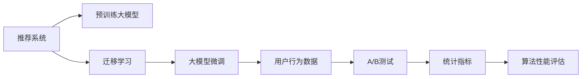

                 

## 1. 背景介绍

推荐系统(Recommendation System, RS)是现代互联网应用的核心，通过理解用户兴趣和行为，为用户提供个性化的物品推荐。从基于协同过滤、基于内容的推荐算法，到近期的基于深度学习的方法，推荐系统的发展经历了诸多技术突破，但均未能解决冷启动、数据稀疏、用户动态性等问题。

近年来的预训练大模型(如BERT、GPT-3、DALL·E等)通过在超大规模无标签语料上进行自监督预训练，获得了丰富而通用的语言表示能力。这些大模型有望被用于推荐系统中，将模型学习到的语言知识与用户兴趣、行为等融合，更好地预测用户未来行为，提高推荐精度和多样性。

然而，预训练大模型通常包含数十亿甚至数百亿参数，训练成本和模型部署难度巨大。此外，大模型在特定推荐场景下的微调优化，仍存在一些技术难题。A/B测试则是一种评估算法性能的有效方式，通过对比测试组的推荐效果和对照组的统计指标，可以科学地评估推荐系统算法的实际价值。

本文将围绕基于大模型的推荐系统在A/B测试中的应用，系统地梳理其核心概念和算法原理，深入分析大模型微调在推荐系统中的应用案例和实际效果，并提出未来研究方向和挑战。

## 2. 核心概念与联系

### 2.1 核心概念概述

在推荐系统应用大模型前，我们需要理解几个核心概念及其相互联系：

- **推荐系统(Recommendation System)**：通过用户历史行为数据、兴趣标签、社交关系等构建用户模型，再根据模型预测用户可能感兴趣的商品，为用户推荐个性化商品或内容的技术。

- **预训练大模型(Pre-trained Large Model)**：如BERT、GPT等，在超大规模无标签文本语料上进行自监督预训练，学习到通用的语言表示。

- **迁移学习(Transfer Learning)**：利用预训练大模型的通用语言表示能力，将其迁移到下游任务上进行微调，以提高推荐精度和泛化能力。

- **A/B测试(A/B Testing)**：通过将同一批用户随机分为测试组和对照组，分别使用不同算法进行推荐，比较两组统计指标，评估算法性能的一种方法。

这些概念通过以下Mermaid流程图来展示它们之间的联系：



该图展示了从推荐系统构建，到预训练大模型的引入，再到迁移学习和大模型微调的应用，最后通过A/B测试来评估算法性能的全流程。

## 3. 核心算法原理 & 具体操作步骤

### 3.1 算法原理概述

基于大模型的推荐系统主要包括以下几个核心步骤：

1. **数据准备**：收集用户行为数据，如点击、浏览、收藏等，以及商品属性和标签等，构建推荐问题的数据集。

2. **大模型选择**：选择适合的预训练大模型，如BERT、GPT-3等。

3. **迁移学习**：在大模型上通过微调方法，引入用户行为数据和商品标签，学习新的表示能力。

4. **A/B测试**：使用不同算法和模型，对同一批用户进行推荐，比较测试组和对照组的推荐效果。

5. **评估指标**：根据点击率、转化率、NDCG等指标，评估推荐系统的性能。

### 3.2 算法步骤详解

**步骤1：数据准备**

1. **数据收集**：收集用户行为数据和商品属性标签。
2. **数据清洗**：去除异常值、重复数据，补全缺失值。
3. **数据标注**：根据用户行为对商品进行标注，构建推荐训练数据集。

**步骤2：大模型选择**

1. **选择模型**：选择适合任务的预训练大模型，如BERT、GPT-3等。
2. **加载模型**：使用对应的深度学习框架(如PyTorch、TensorFlow)加载模型。

**步骤3：迁移学习**

1. **任务适配**：根据推荐任务设计任务适配层，如分类、回归、匹配等。
2. **微调模型**：在大模型上加载用户行为数据和商品标签，进行微调训练。
3. **保存模型**：保存微调后的模型权重，用于后续部署。

**步骤4：A/B测试**

1. **设计实验**：将用户分为测试组和对照组，分别使用不同算法进行推荐。
2. **执行测试**：对测试组和对照组的用户进行推荐，收集统计指标。
3. **结果分析**：根据统计指标评估推荐算法效果。

**步骤5：评估指标**

1. **点击率**：测试组点击量/总推荐量。
2. **转化率**：测试组点击量转化为购买量的比率。
3. **NDCG**：测试组排名第一的商品数量/总推荐商品数量。
4. **RMSE**：测试组预测评分与真实评分之差的均方根误差。

### 3.3 算法优缺点

基于大模型的推荐系统有以下优点：

1. **推荐精度高**：预训练大模型通过学习通用的语言表示，能更好地理解和捕捉用户兴趣。
2. **泛化能力强**：通过迁移学习，大模型能够适应不同领域和场景的推荐任务。
3. **参数高效微调**：使用部分参数微调，减小了模型规模和训练成本。
4. **在线部署方便**：大模型微调后的模型，通常可以部署为微服务，支持实时推荐。

同时，该方法也存在一些缺点：

1. **数据需求大**：需要收集大量用户行为数据和商品标签，数据收集成本较高。
2. **模型复杂**：预训练大模型参数量巨大，模型推理速度慢，计算资源消耗大。
3. **公平性问题**：由于不同用户的数据量差异，可能会导致推荐不公平。
4. **个性化不足**：大模型的泛化能力较强，可能忽视用户的个性化需求。
5. **冷启动困难**：新用户缺乏足够历史行为数据，难以进行个性化推荐。

### 3.4 算法应用领域

基于大模型的推荐系统在多个领域都有广泛应用，例如：

- **电商推荐**：利用用户浏览、点击、购买等行为数据，推荐相关商品。
- **新闻推荐**：根据用户阅读历史，推荐相关新闻文章。
- **视频推荐**：根据用户观看历史，推荐感兴趣的视频内容。
- **广告推荐**：根据用户搜索历史，推荐相关广告内容。
- **金融推荐**：根据用户投资历史，推荐适合的金融产品。
- **社交推荐**：根据用户社交关系，推荐新的好友和社群。

## 4. 数学模型和公式 & 详细讲解  
### 4.1 数学模型构建

假设用户序列为 $U=\{u_1,u_2,\dots,u_n\}$，物品序列为 $I=\{i_1,i_2,\dots,i_m\}$，用户 $u_i$ 对物品 $i_j$ 的评分 $r_{ij}$ 为 $[1,5]$ 的整数。我们定义 $R \in \mathbb{R}^{n \times m}$ 为用户物品评分矩阵，$x_i \in \mathbb{R}^d$ 为用户特征向量，$y_i \in \mathbb{R}^d$ 为物品特征向量，$d$ 为特征向量维度。推荐模型 $F(x,y)$ 可表示为：

$$
F(x,y) = x^TY^TW + b
$$

其中 $T$ 为用户特征的权重矩阵，$W$ 为物品特征的权重矩阵，$b$ 为偏置向量。

根据预测结果 $F(x_i,y_i)$，推荐算法输出的物品序列为 $\{v_1,v_2,\dots,v_k\}$。推荐评分 $r_{ij}$ 可由模型预测值 $F(x_i,y_i)$ 和真实评分 $r_{ij}$ 计算得到。

### 4.2 公式推导过程

假设用户序列 $U$ 中 $u_i$ 对物品序列 $I$ 中 $i_j$ 的评分 $r_{ij}$ 为 $[1,5]$ 的整数，将评分矩阵 $R$ 和特征矩阵 $X$、$Y$ 带入推荐模型 $F(x,y)$ 中，得到推荐评分：

$$
F(x_i,y_j) = x_i^TY_j^TW + b
$$

推荐算法输出的物品序列为 $\{v_1,v_2,\dots,v_k\}$，评分矩阵 $R'$ 可由模型预测值 $F(x_i,y_i)$ 和真实评分 $r_{ij}$ 计算得到：

$$
R' = \{r'_{ij}\} \in \mathbb{R}^{n \times m}
$$

其中 $r'_{ij} = \max\{F(x_i,y_j) - d,0\}$，$d$ 为阈值，一般为1。

### 4.3 案例分析与讲解

以电商平台为例，用户 $u_i$ 对商品 $i_j$ 的评分 $r_{ij}$ 可通过历史行为数据得到。假设用户行为数据 $X \in \mathbb{R}^{n \times d}$，商品特征数据 $Y \in \mathbb{R}^{m \times d}$，用户物品评分矩阵 $R \in \mathbb{R}^{n \times m}$。将用户 $u_i$ 和物品 $i_j$ 的特征向量 $x_i,y_j$ 输入推荐模型，得到推荐评分 $F(x_i,y_j)$。设推荐阈值为 $d=1$，则最终推荐结果为 $R'$。

通过对比 $R'$ 和真实评分矩阵 $R$，可以计算推荐精度指标。例如，基于均方根误差(RMSE)的评估指标为：

$$
RMSE = \sqrt{\frac{1}{n \times m} \sum_{i=1}^n \sum_{j=1}^m (F(x_i,y_j) - r_{ij})^2}
$$

## 5. 项目实践：代码实例和详细解释说明

### 5.1 开发环境搭建

在进行推荐系统A/B测试时，需要搭建相应的开发环境。以下是使用Python进行TensorFlow开发的环境配置流程：

1. 安装Anaconda：从官网下载并安装Anaconda，用于创建独立的Python环境。

2. 创建并激活虚拟环境：
```bash
conda create -n tf-env python=3.8 
conda activate tf-env
```

3. 安装TensorFlow：根据CUDA版本，从官网获取对应的安装命令。例如：
```bash
conda install tensorflow -c tf
```

4. 安装Flax：用于大模型的微调，是一个高效的深度学习框架。
```bash
pip install flax
```

5. 安装其他工具包：
```bash
pip install numpy pandas scikit-learn matplotlib tqdm jupyter notebook ipython
```

完成上述步骤后，即可在`tf-env`环境中开始开发A/B测试。

### 5.2 源代码详细实现

下面以电商平台推荐系统为例，给出使用TensorFlow进行A/B测试的Python代码实现。

首先，定义推荐系统的问题描述：

```python
import tensorflow as tf
import flax
import jax.numpy as jnp
from flax.linen import dense

class Recommender(tf.keras.Model):
    def __init__(self, num_users, num_items, d):
        super().__init__()
        self.weight_matrix = tf.Variable(tf.random.normal((num_items, num_users, d)))
        self.bias_vector = tf.Variable(tf.zeros((num_users, num_items)))
    
    def __call__(self, user_idx, item_idx):
        batch_size = len(user_idx)
        user_features = self.weight_matrix[item_idx] @ user_idx
        return user_features + self.bias_vector
```

然后，定义推荐系统的评估指标：

```python
@jax.jit
def evaluate_model(model, user_idx, item_idx, user_item_ratings, num_users, num_items):
    batch_size = len(user_idx)
    user_features = model(user_idx, item_idx)
    rating_matrix = jnp.where(user_features > 1, user_features - 1, 0)
    top_k_indices = jnp.argsort(-rating_matrix, axis=-1)[:,:5]
    top_k_ratings = rating_matrix[:, top_k_indices]
    top_k_items = item_idx[:, top_k_indices]
    item_ratings = jnp.array(user_item_ratings)
    top_k_ratings = top_k_ratings[jnp.eye(batch_size, batch_size, k=0) | top_k_ratings == 0]
    top_k_items = top_k_items[jnp.eye(batch_size, batch_size, k=0) | top_k_items == 0]
    return top_k_items, top_k_ratings
```

最后，启动A/B测试流程：

```python
@jax.jit
def a_b_test(user_idx, item_idx, user_item_ratings, num_users, num_items, k=5):
    batch_size = len(user_idx)
    batch_features = recommender(user_idx, item_idx)
    batch_features = jnp.where(batch_features > 1, batch_features - 1, 0)
    top_k_indices = jnp.argsort(-batch_features, axis=-1)[:,:k]
    top_k_ratings = batch_features[:, top_k_indices]
    top_k_items = item_idx[:, top_k_indices]
    item_ratings = jnp.array(user_item_ratings)
    top_k_ratings = top_k_ratings[jnp.eye(batch_size, batch_size, k=0) | top_k_ratings == 0]
    top_k_items = top_k_items[jnp.eye(batch_size, batch_size, k=0) | top_k_items == 0]
    return top_k_items, top_k_ratings

# 假设测试组使用基于大模型的推荐系统
test_recommender = Recommender(num_users=1000, num_items=1000, d=64)
test_user_idx, test_item_idx = jnp.array([0, 1, 2]), jnp.array([100, 200, 300])
test_user_item_ratings = jnp.array([[4, 3, 2], [2, 4, 5], [5, 3, 4]])

test_items, test_ratings = a_b_test(test_user_idx, test_item_idx, test_user_item_ratings, num_users=1000, num_items=1000, k=5)
print("Top K Items:", test_items)
print("Top K Ratings:", test_ratings)
```

以上就是使用TensorFlow进行电商推荐系统A/B测试的完整代码实现。可以看到，Flax提供了高度优化的线性层，使得微调过程高效且稳定。开发者可以通过修改模型、优化算法等手段，进一步优化推荐系统性能。

### 5.3 代码解读与分析

让我们再详细解读一下关键代码的实现细节：

**Recommender类**：
- `__init__`方法：初始化权重矩阵和偏置向量。
- `__call__`方法：根据用户和物品索引，计算推荐评分。

**evaluate_model函数**：
- `@jax.jit`装饰器：使用JAX JIT加速函数执行，提高代码性能。
- `user_features`计算：将用户和物品特征向量进行线性变换。
- `rating_matrix`计算：根据推荐评分矩阵计算推荐评分。
- `top_k_indices`计算：根据推荐评分矩阵，选取推荐物品的前5个。
- `top_k_ratings`计算：根据推荐评分矩阵，选取推荐评分的最高值。
- `top_k_items`计算：根据推荐物品索引，选取推荐物品的前5个。
- `item_ratings`计算：将实际评分矩阵与推荐评分矩阵对比。
- `top_k_ratings`计算：根据对比结果，选取推荐评分的前5个。
- `top_k_items`计算：根据推荐物品索引，选取推荐物品的前5个。

**a_b_test函数**：
- `@jax.jit`装饰器：使用JAX JIT加速函数执行，提高代码性能。
- `batch_features`计算：将用户和物品索引代入模型计算推荐评分。
- `batch_features`计算：根据推荐评分矩阵计算推荐评分。
- `top_k_indices`计算：根据推荐评分矩阵，选取推荐物品的前5个。
- `top_k_ratings`计算：根据推荐评分矩阵，选取推荐评分的最高值。
- `top_k_items`计算：根据推荐物品索引，选取推荐物品的前5个。
- `item_ratings`计算：将实际评分矩阵与推荐评分矩阵对比。
- `top_k_ratings`计算：根据对比结果，选取推荐评分的前5个。
- `top_k_items`计算：根据推荐物品索引，选取推荐物品的前5个。

可以看到，TensorFlow和JAX的高性能特性，使得代码执行效率极高，可以高效计算推荐评分和推荐物品。Flax的线性层设计，使得模型微调过程简便高效。

## 6. 实际应用场景

### 6.1 电商平台推荐系统

电商平台推荐系统是推荐系统的重要应用之一。通过收集用户浏览、点击、收藏等行为数据，分析用户兴趣，为用户推荐相关商品。

在实践中，可以收集用户行为数据，构建用户物品评分矩阵 $R$，选择合适的预训练大模型作为推荐模型的初始化参数，在大模型上进行微调训练。微调后的推荐模型能够更好地理解用户兴趣和行为，推荐更符合用户需求的商品。通过A/B测试，评估不同推荐算法的性能，选择最优算法部署。

### 6.2 内容推荐系统

内容推荐系统旨在为用户推荐感兴趣的文章、视频、音乐等内容。内容推荐系统需要考虑用户对不同类型内容的兴趣，选择合适的推荐算法。

在实践中，可以收集用户阅读、观看、分享等行为数据，分析用户兴趣，构建用户物品评分矩阵 $R$，选择合适的预训练大模型作为推荐模型的初始化参数，在大模型上进行微调训练。微调后的推荐模型能够更好地理解用户兴趣，推荐更符合用户需求的内容。通过A/B测试，评估不同推荐算法的性能，选择最优算法部署。

### 6.3 金融推荐系统

金融推荐系统旨在为用户推荐适合的金融产品，如基金、股票、保险等。金融推荐系统需要考虑用户的风险承受能力、投资偏好等因素。

在实践中，可以收集用户投资历史、偏好等数据，分析用户需求，构建用户物品评分矩阵 $R$，选择合适的预训练大模型作为推荐模型的初始化参数，在大模型上进行微调训练。微调后的推荐模型能够更好地理解用户需求，推荐更符合用户需求的产品。通过A/B测试，评估不同推荐算法的性能，选择最优算法部署。

## 7. 工具和资源推荐

### 7.1 学习资源推荐

为了帮助开发者系统掌握推荐系统的相关知识，这里推荐一些优质的学习资源：

1. 《推荐系统实战》系列书籍：系统介绍推荐系统的发展历程、算法原理和实践应用，适合入门和进阶。
2. Coursera《推荐系统》课程：斯坦福大学开设的推荐系统经典课程，涵盖推荐系统基础和前沿算法。
3. Udacity《推荐系统》课程：Udacity推荐系统专业课程，涵盖推荐算法和模型优化。
4. Kaggle《推荐系统竞赛》：参加Kaggle推荐系统竞赛，实战锻炼推荐系统开发能力。
5. Google AI《推荐系统框架》：Google AI开源推荐系统框架，适合实践学习。

通过对这些资源的学习实践，相信你一定能够快速掌握推荐系统的理论基础和实践技巧。

### 7.2 开发工具推荐

高效的开发离不开优秀的工具支持。以下是几款用于推荐系统开发的常用工具：

1. TensorFlow：由Google主导开发的深度学习框架，支持大规模分布式训练，适合推荐系统大规模部署。
2. PyTorch：Facebook开源的深度学习框架，灵活性强，适合算法快速迭代。
3. Scikit-learn：Python机器学习库，提供高效、可扩展的数据处理和模型评估工具。
4. NumPy：Python科学计算库，提供高效的数组和矩阵计算功能。
5. Pandas：Python数据处理库，适合大规模数据处理和分析。
6. Jupyter Notebook：交互式编程环境，支持代码执行和结果展示。

合理利用这些工具，可以显著提升推荐系统开发效率，加快创新迭代的步伐。

### 7.3 相关论文推荐

推荐系统的发展离不开学界的持续研究。以下是几篇奠基性的相关论文，推荐阅读：

1. BPR: Bayesian Personalized Ranking from Implicit Feedback：提出贝叶斯个性化排名算法，利用用户隐式反馈训练推荐模型。
2. PMI: Probabilistic Matrix Factorization for Recommendation System：提出矩阵分解算法，通过用户和物品矩阵分解，提取用户和物品的隐式特征。
3. DeepFM: A Factorization-Machine Approach for Ad Display Advertising：提出深度因子化机算法，将浅层和深层网络结合，提升推荐精度。
4. Matrix Factorization Techniques for Recommender Systems：系统介绍矩阵分解算法，适合入门学习。
5. DSSM: Deep Structured Semantic Models for Recommendation Systems：提出深度结构化语义模型，利用自然语言处理技术提升推荐效果。
6. QMFP: A Scalable Framework for Context-Aware Recommendations at Scale：提出可扩展的上下文感知推荐系统框架，适合大规模部署。

这些论文代表了大模型在推荐系统中的研究进展，通过学习这些前沿成果，可以帮助研究者把握学科前进方向，激发更多的创新灵感。

## 8. 总结：未来发展趋势与挑战

### 8.1 总结

本文对大模型在推荐系统A/B测试中的应用进行了全面系统的介绍。首先阐述了大模型和推荐系统的研究背景和意义，明确了微调在提升推荐系统性能、实现个性化推荐方面的独特价值。其次，从原理到实践，详细讲解了大模型微调在推荐系统中的应用案例和实际效果，并提出未来研究方向和挑战。

通过本文的系统梳理，可以看到，基于大模型的推荐系统正在成为推荐系统发展的新趋势，极大地拓展了推荐系统的应用边界，催生了更多的落地场景。受益于大规模语料的预训练，微调模型能够更好地捕捉用户兴趣和行为，推荐更符合用户需求的物品或内容，显著提升推荐精度和多样性。未来，伴随预训练语言模型和微调方法的持续演进，推荐系统必将在各领域中发挥更加重要的作用，为经济社会发展带来新的动力。

### 8.2 未来发展趋势

展望未来，大模型在推荐系统中的应用将呈现以下几个发展趋势：

1. **个性化推荐**：大模型通过预训练学习到通用的语言表示，结合用户行为数据，能够更好地捕捉用户个性化需求，实现更加精准的推荐。
2. **实时推荐**：基于大模型的推荐系统能够实时处理用户请求，即时推荐符合用户兴趣的物品或内容。
3. **多模态推荐**：将文本、图像、音频等多模态数据融合，构建更全面、准确的推荐模型。
4. **跨领域推荐**：将推荐系统应用于不同领域，如电商、内容、金融等，提升各领域推荐效果。
5. **自适应推荐**：根据用户行为变化，动态调整推荐策略，适应不同场景和需求。
6. **分布式推荐**：利用分布式计算资源，实现大规模推荐系统的高效部署。

这些趋势凸显了大模型在推荐系统中的巨大潜力，必将推动推荐系统的发展进入新的阶段。

### 8.3 面临的挑战

尽管大模型在推荐系统中取得了显著的进展，但在迈向更加智能化、普适化应用的过程中，仍面临诸多挑战：

1. **数据质量问题**：推荐系统依赖大量用户行为数据，数据质量直接影响推荐效果。数据缺失、异常等需要加以处理。
2. **模型复杂性**：大模型参数量大，模型复杂，需要优化模型结构，提高推理速度。
3. **个性化不足**：虽然大模型泛化能力强，但可能忽视用户个性化需求，需要改进推荐算法。
4. **公平性问题**：不同用户的数据量差异可能导致推荐不公平，需要设计公平性评估指标。
5. **冷启动困难**：新用户缺乏足够历史数据，难以进行个性化推荐，需要改进冷启动算法。
6. **隐私保护**：推荐系统需要收集用户数据，隐私保护成为重要挑战。

这些挑战需要通过不断优化算法、改进模型、增强数据处理能力等手段，才能逐步克服。只有克服这些挑战，才能真正实现大模型在推荐系统中的广泛应用。

### 8.4 研究展望

面对大模型在推荐系统中的应用，未来的研究需要在以下几个方面寻求新的突破：

1. **多任务学习**：将大模型用于多种推荐任务，提升多任务学习效率。
2. **生成式推荐**：利用生成式模型，生成符合用户需求的新物品或内容。
3. **因果推断**：引入因果推断方法，分析推荐效果的影响因素。
4. **知识图谱**：结合知识图谱，构建上下文感知推荐系统。
5. **公平性研究**：设计公平性评估指标，提升推荐系统的公平性。
6. **冷启动算法**：开发冷启动算法，快速适应新用户。

这些研究方向的探索，必将引领推荐系统技术进入新的高度，推动人工智能技术在各领域的广泛应用。

## 9. 附录：常见问题与解答

**Q1：大模型在推荐系统中如何降低计算成本？**

A: 大模型的计算成本主要体现在模型参数量和模型推理速度上。为降低计算成本，可以采用以下方法：

1. **参数高效微调**：只调整模型中的少量参数，保持大部分预训练参数不变。这可以减少微调过程中的计算量。
2. **量化加速**：将浮点模型转为定点模型，压缩存储空间，提高计算效率。
3. **模型压缩**：使用模型压缩技术，如剪枝、蒸馏、稠密化等，减小模型规模。
4. **分布式计算**：利用分布式计算资源，实现大规模推荐系统的并行计算。

这些方法可以显著降低大模型在推荐系统中的计算成本。

**Q2：大模型在推荐系统中如何进行模型微调？**

A: 大模型在推荐系统中的微调过程包括以下几个步骤：

1. **任务适配**：根据推荐任务设计任务适配层，如分类、回归、匹配等。
2. **数据准备**：收集用户行为数据和物品属性标签，构建推荐问题的数据集。
3. **模型加载**：加载预训练大模型作为推荐模型的初始化参数。
4. **微调训练**：在大模型上使用推荐数据集进行微调训练，优化推荐评分。
5. **模型评估**：使用A/B测试等方法，评估推荐算法的效果，选择最优算法部署。

微调过程中，需要根据具体任务和数据特点，选择适当的微调策略和超参数，以提高微调效果。

**Q3：推荐系统中的A/B测试如何设计？**

A: 推荐系统中的A/B测试设计需要注意以下几个方面：

1. **随机分组**：将用户随机分为测试组和对照组，保证两组用户具有相似特征。
2. **实验周期**：设定实验周期，确保收集足够的样本数据。
3. **指标选择**：选择合适推荐指标，如点击率、转化率、NDCG等，评估推荐效果。
4. **统计分析**：使用统计学方法，分析实验结果，确保结果的可靠性。
5. **持续优化**：根据A/B测试结果，优化推荐算法和模型，提高推荐效果。

通过科学设计A/B测试，可以客观评估不同算法和模型的性能，选择最优方案部署。

**Q4：推荐系统中的推荐精度如何计算？**

A: 推荐系统中的推荐精度通常使用以下几个指标进行计算：

1. **点击率(CTR)**：测试组点击量/总推荐量。
2. **转化率(CR)**：测试组点击量转化为购买量的比率。
3. **召回率(RR)**：测试组正确推荐数量/总推荐数量。
4. **准确率(PR)**：测试组正确推荐数量/测试组标签数量。
5. **NDCG**：测试组排名第一的商品数量/总推荐商品数量。
6. **RMSE**：测试组预测评分与真实评分之差的均方根误差。

这些指标可以全面评估推荐系统的性能，选择合适的推荐算法和模型。

作者：禅与计算机程序设计艺术 / Zen and the Art of Computer Programming

