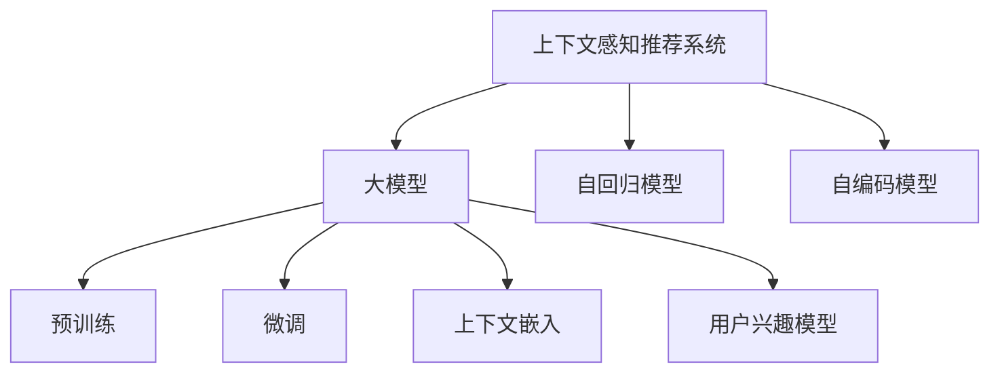

                 

# 大模型在推荐系统上下文感知中的作用

> 关键词：上下文感知, 推荐系统, 大模型, 自回归, 自编码, 预训练, 微调, 上下文嵌入, 用户兴趣

## 1. 背景介绍

### 1.1 问题由来
随着互联网技术的飞速发展，推荐系统成为了各大平台、应用中不可或缺的一部分。推荐系统不仅能够提供个性化的信息，还能优化用户体验，提升转化率。传统的推荐系统大多基于协同过滤、内容推荐等方法，这些方法在一定程度上能够挖掘用户兴趣、推荐相关内容，但随着推荐场景的不断丰富，这些方法逐渐表现出其局限性。

近年来，大模型在推荐系统中的应用引起了广泛关注。特别是在上下文感知推荐中，大模型的天然优势使得其在推荐效果上取得了重大突破。本文将系统介绍大模型在推荐系统上下文感知中的应用，通过详细的理论推导和实例演示，让读者更好地理解大模型的作用和优势。

## 2. 核心概念与联系

### 2.1 核心概念概述

为更好地理解大模型在推荐系统上下文感知中的应用，本节将介绍几个密切相关的核心概念：

- 上下文感知推荐系统：推荐系统不仅需要理解用户当前的行为和兴趣，还需要结合具体的上下文信息（如时间、地点、事件等），提供个性化的推荐。
- 大模型：指大规模预训练语言模型，如BERT、GPT-3等，通过在海量文本数据上进行预训练，学习到了丰富的语言知识，具备强大的上下文建模能力。
- 自回归模型：一类通过前向依赖后向，将输出序列和输入序列联系起来的模型，常见的如RNN、LSTM、GRU等。
- 自编码模型：通过将输入序列编码为低维表示，再进行解码输出，以达到特征提取、降维等目的的模型，如VAE、GAN等。
- 预训练：指在大规模无标签文本数据上训练大模型，学习到通用的语言表示。预训练使得模型具备更好的泛化能力。
- 微调：指在预训练模型的基础上，使用下游任务的少量标注数据，通过有监督学习优化模型在该任务上的性能。
- 上下文嵌入：指将用户行为、兴趣、上下文等不同类型的信息编码为向量，进行特征融合，以便模型更好地进行推荐。
- 用户兴趣模型：通过学习用户的历史行为、偏好等，构建用户兴趣向量，用于推荐系统中的兴趣建模。

这些核心概念之间的逻辑关系可以通过以下Mermaid流程图来展示：



这个流程图展示了大模型在推荐系统上下文感知中的核心概念及其之间的关系：

1. 大模型通过预训练获得基础能力。
2. 自回归模型和自编码模型是大模型的常见形式。
3. 微调和大模型结合，优化模型的特定任务性能。
4. 上下文嵌入和用户兴趣模型，利用大模型的上下文建模能力，提取和融合更多维度的信息，提升推荐效果。

## 3. 核心算法原理 & 具体操作步骤
### 3.1 算法原理概述

大模型在推荐系统上下文感知中的应用，主要是通过上下文嵌入和用户兴趣模型，结合微调技术，实现对推荐上下文的精准建模和用户兴趣的准确识别。其核心思想是：

1. **预训练**：利用大规模无标签文本数据，训练大模型，学习到通用的语言表示。
2. **微调**：在大模型上，使用下游推荐任务的少量标注数据，通过有监督学习，优化模型在该任务上的性能。
3. **上下文嵌入**：将推荐场景中的上下文信息（如时间、地点、事件等），通过预训练大模型，编码为向量表示。
4. **用户兴趣模型**：结合用户的历史行为和上下文信息，构建用户兴趣向量，用于推荐系统的个性化推荐。

通过以上步骤，大模型能够精准捕捉到用户在不同场景下的行为和兴趣，提供更加个性化的推荐，提升用户体验和系统转化率。

### 3.2 算法步骤详解

以下是基于大模型在推荐系统上下文感知中的详细算法步骤：

**Step 1: 准备预训练模型和数据集**
- 选择合适的预训练语言模型 $M_{\theta}$，如BERT、GPT-3等。
- 准备推荐任务的数据集，包括用户行为数据和上下文信息，如浏览记录、点击记录、位置信息、时间信息等。

**Step 2: 添加任务适配层**
- 根据推荐任务的特征，设计合适的输出层和损失函数。
- 对于分类任务，通常在顶层添加线性分类器和交叉熵损失函数。
- 对于生成任务，通常使用语言模型的解码器输出概率分布，并以负对数似然为损失函数。

**Step 3: 设置微调超参数**
- 选择合适的优化算法及其参数，如 AdamW、SGD 等，设置学习率、批大小、迭代轮数等。
- 设置正则化技术及强度，包括权重衰减、Dropout、Early Stopping 等。
- 确定冻结预训练参数的策略，如仅微调顶层，或全部参数都参与微调。

**Step 4: 执行梯度训练**
- 将推荐数据分批次输入模型，前向传播计算损失函数。
- 反向传播计算参数梯度，根据设定的优化算法和学习率更新模型参数。
- 周期性在验证集上评估模型性能，根据性能指标决定是否触发 Early Stopping。
- 重复上述步骤直到满足预设的迭代轮数或 Early Stopping 条件。

**Step 5: 测试和部署**
- 在测试集上评估微调后模型 $M_{\hat{\theta}}$ 的性能，对比微调前后的精度提升。
- 使用微调后的模型对新样本进行推理预测，集成到实际的应用系统中。
- 持续收集新的数据，定期重新微调模型，以适应数据分布的变化。

以上是基于大模型在推荐系统上下文感知中的微调流程。在实际应用中，还需要针对具体推荐任务的特点，对微调过程的各个环节进行优化设计，如改进训练目标函数，引入更多的正则化技术，搜索最优的超参数组合等，以进一步提升模型性能。

### 3.3 算法优缺点

大模型在推荐系统上下文感知中的应用，具有以下优点：

1. **高效的上下文建模**：大模型的自回归和自编码结构，能够高效地建模复杂上下文信息，捕捉用户在不同场景下的行为和兴趣。
2. **泛化能力强**：大模型通过预训练获得通用的语言表示，具备较强的泛化能力，能够适应不同类型的推荐场景。
3. **用户兴趣精准**：结合用户历史行为和上下文信息，大模型能够精准捕捉用户兴趣，提供个性化的推荐。
4. **动态更新**：大模型能够动态地适应数据分布的变化，进行持续学习，保证推荐模型的时效性和适应性。

同时，该方法也存在一定的局限性：

1. **对标注数据依赖高**：微调方法依赖于推荐任务的高质量标注数据，数据获取成本高。
2. **计算资源需求大**：大模型参数量大，需要高性能的计算资源，对存储和内存也提出了较高的要求。
3. **可解释性差**：大模型通常是"黑盒"系统，难以解释其内部工作机制和决策逻辑。
4. **对抗攻击脆弱**：大模型容易受到对抗攻击，输出结果可能被恶意篡改。

尽管存在这些局限性，但就目前而言，基于大模型的微调方法仍是最主流的推荐系统范式。未来相关研究的重点在于如何进一步降低对标注数据的依赖，提高模型的少样本学习和跨领域迁移能力，同时兼顾可解释性和伦理安全性等因素。

### 3.4 算法应用领域

基于大模型的微调方法在推荐系统上下文感知中的应用，覆盖了几乎所有常见的推荐任务，例如：

- 商品推荐：利用用户的历史浏览、购买行为，结合商品描述、价格等信息，推荐相关商品。
- 内容推荐：根据用户的历史阅读、观看记录，结合文章、视频等内容的上下文信息，推荐相关内容。
- 旅游推荐：结合用户的地理位置、时间信息，推荐附近的旅游景点和酒店。
- 电商推荐：结合用户的搜索历史、购物行为，推荐相关商品和优惠信息。
- 新闻推荐：根据用户的阅读历史和兴趣偏好，推荐相关新闻文章和热点话题。

除了上述这些经典任务外，大模型微调还被创新性地应用到更多场景中，如个性化的社交媒体推荐、智能导航、智能家居等，为推荐系统带来了全新的突破。随着预训练模型和微调方法的不断进步，相信推荐系统必将在更广阔的应用领域大放异彩。

## 4. 数学模型和公式 & 详细讲解 & 举例说明
### 4.1 数学模型构建

本节将使用数学语言对基于大模型在推荐系统上下文感知中的应用进行更加严格的刻画。

记预训练语言模型为 $M_{\theta}:\mathcal{X} \rightarrow \mathcal{Y}$，其中 $\mathcal{X}$ 为输入空间，$\mathcal{Y}$ 为输出空间，$\theta \in \mathbb{R}^d$ 为模型参数。假设推荐任务的数据集为 $D=\{(x_i,y_i)\}_{i=1}^N, x_i \in \mathcal{X}, y_i \in \mathcal{Y}$。

定义模型 $M_{\theta}$ 在输入 $x$ 上的输出为 $\hat{y}=M_{\theta}(x)$，假设输出为向量形式，如分类任务中为二值向量 $[0,1]$。则推荐任务的损失函数为：

$$
\ell(M_{\theta}(x),y) = -[y\log \hat{y} + (1-y)\log(1-\hat{y})]
$$

其中 $\hat{y}$ 为模型在输入 $x$ 上的预测输出，$y$ 为实际标签。

### 4.2 公式推导过程

以下我们以商品推荐任务为例，推导交叉熵损失函数及其梯度的计算公式。

假设模型 $M_{\theta}$ 在输入 $x$ 上的输出为 $\hat{y}=M_{\theta}(x) \in [0,1]$，表示商品 $x$ 被用户 $y$ 购买的概率。真实标签 $y \in \{0,1\}$。则二分类交叉熵损失函数定义为：

$$
\ell(M_{\theta}(x),y) = -[y\log \hat{y} + (1-y)\log(1-\hat{y})]
$$

将其代入经验风险公式，得：

$$
\mathcal{L}(\theta) = -\frac{1}{N}\sum_{i=1}^N [y_i\log M_{\theta}(x_i)+(1-y_i)\log(1-M_{\theta}(x_i))]
$$

根据链式法则，损失函数对参数 $\theta_k$ 的梯度为：

$$
\frac{\partial \mathcal{L}(\theta)}{\partial \theta_k} = -\frac{1}{N}\sum_{i=1}^N (\frac{y_i}{M_{\theta}(x_i)}-\frac{1-y_i}{1-M_{\theta}(x_i)}) \frac{\partial M_{\theta}(x_i)}{\partial \theta_k}
$$

其中 $\frac{\partial M_{\theta}(x_i)}{\partial \theta_k}$ 可进一步递归展开，利用自动微分技术完成计算。

在得到损失函数的梯度后，即可带入参数更新公式，完成模型的迭代优化。重复上述过程直至收敛，最终得到适应推荐任务的最优模型参数 $\theta^*$。

## 5. 项目实践：代码实例和详细解释说明
### 5.1 开发环境搭建

在进行推荐系统上下文感知的大模型微调实践前，我们需要准备好开发环境。以下是使用Python进行PyTorch开发的环境配置流程：

1. 安装Anaconda：从官网下载并安装Anaconda，用于创建独立的Python环境。

2. 创建并激活虚拟环境：
```bash
conda create -n pytorch-env python=3.8 
conda activate pytorch-env
```

3. 安装PyTorch：根据CUDA版本，从官网获取对应的安装命令。例如：
```bash
conda install pytorch torchvision torchaudio cudatoolkit=11.1 -c pytorch -c conda-forge
```

4. 安装Transformers库：
```bash
pip install transformers
```

5. 安装各类工具包：
```bash
pip install numpy pandas scikit-learn matplotlib tqdm jupyter notebook ipython
```

完成上述步骤后，即可在`pytorch-env`环境中开始微调实践。

### 5.2 源代码详细实现

下面我们以商品推荐任务为例，给出使用Transformers库对BERT模型进行微调的PyTorch代码实现。

首先，定义推荐任务的数据处理函数：

```python
from transformers import BertTokenizer
from torch.utils.data import Dataset
import torch

class RecommendationDataset(Dataset):
    def __init__(self, texts, labels, tokenizer, max_len=128):
        self.texts = texts
        self.labels = labels
        self.tokenizer = tokenizer
        self.max_len = max_len
        
    def __len__(self):
        return len(self.texts)
    
    def __getitem__(self, item):
        text = self.texts[item]
        label = self.labels[item]
        
        encoding = self.tokenizer(text, return_tensors='pt', max_length=self.max_len, padding='max_length', truncation=True)
        input_ids = encoding['input_ids'][0]
        attention_mask = encoding['attention_mask'][0]
        
        # 将标签转换为二值向量
        label = torch.tensor([1 if label==1 else 0,])
        
        return {'input_ids': input_ids, 
                'attention_mask': attention_mask,
                'labels': label}

# 定义标签与id的映射
label2id = {0: 0, 1: 1}
id2label = {v: k for k, v in label2id.items()}

# 创建dataset
tokenizer = BertTokenizer.from_pretrained('bert-base-cased')

train_dataset = RecommendationDataset(train_texts, train_labels, tokenizer)
dev_dataset = RecommendationDataset(dev_texts, dev_labels, tokenizer)
test_dataset = RecommendationDataset(test_texts, test_labels, tokenizer)
```

然后，定义模型和优化器：

```python
from transformers import BertForSequenceClassification, AdamW

model = BertForSequenceClassification.from_pretrained('bert-base-cased', num_labels=len(label2id))

optimizer = AdamW(model.parameters(), lr=2e-5)
```

接着，定义训练和评估函数：

```python
from torch.utils.data import DataLoader
from tqdm import tqdm
from sklearn.metrics import classification_report

device = torch.device('cuda') if torch.cuda.is_available() else torch.device('cpu')
model.to(device)

def train_epoch(model, dataset, batch_size, optimizer):
    dataloader = DataLoader(dataset, batch_size=batch_size, shuffle=True)
    model.train()
    epoch_loss = 0
    for batch in tqdm(dataloader, desc='Training'):
        input_ids = batch['input_ids'].to(device)
        attention_mask = batch['attention_mask'].to(device)
        labels = batch['labels'].to(device)
        model.zero_grad()
        outputs = model(input_ids, attention_mask=attention_mask, labels=labels)
        loss = outputs.loss
        epoch_loss += loss.item()
        loss.backward()
        optimizer.step()
    return epoch_loss / len(dataloader)

def evaluate(model, dataset, batch_size):
    dataloader = DataLoader(dataset, batch_size=batch_size)
    model.eval()
    preds, labels = [], []
    with torch.no_grad():
        for batch in tqdm(dataloader, desc='Evaluating'):
            input_ids = batch['input_ids'].to(device)
            attention_mask = batch['attention_mask'].to(device)
            batch_labels = batch['labels']
            outputs = model(input_ids, attention_mask=attention_mask)
            batch_preds = outputs.logits.argmax(dim=2).to('cpu').tolist()
            batch_labels = batch_labels.to('cpu').tolist()
            for pred, label in zip(batch_preds, batch_labels):
                preds.append(pred)
                labels.append(label)
                
    print(classification_report(labels, preds))
```

最后，启动训练流程并在测试集上评估：

```python
epochs = 5
batch_size = 16

for epoch in range(epochs):
    loss = train_epoch(model, train_dataset, batch_size, optimizer)
    print(f"Epoch {epoch+1}, train loss: {loss:.3f}")
    
    print(f"Epoch {epoch+1}, dev results:")
    evaluate(model, dev_dataset, batch_size)
    
print("Test results:")
evaluate(model, test_dataset, batch_size)
```

以上就是使用PyTorch对BERT进行商品推荐任务微调的完整代码实现。可以看到，得益于Transformers库的强大封装，我们可以用相对简洁的代码完成BERT模型的加载和微调。

### 5.3 代码解读与分析

让我们再详细解读一下关键代码的实现细节：

**RecommendationDataset类**：
- `__init__`方法：初始化文本、标签、分词器等关键组件。
- `__len__`方法：返回数据集的样本数量。
- `__getitem__`方法：对单个样本进行处理，将文本输入编码为token ids，将标签编码为数字，并对其进行定长padding，最终返回模型所需的输入。

**label2id和id2label字典**：
- 定义了标签与数字id之间的映射关系，用于将模型输出转换为实际标签。

**训练和评估函数**：
- 使用PyTorch的DataLoader对数据集进行批次化加载，供模型训练和推理使用。
- 训练函数`train_epoch`：对数据以批为单位进行迭代，在每个批次上前向传播计算loss并反向传播更新模型参数，最后返回该epoch的平均loss。
- 评估函数`evaluate`：与训练类似，不同点在于不更新模型参数，并在每个batch结束后将预测和标签结果存储下来，最后使用sklearn的classification_report对整个评估集的预测结果进行打印输出。

**训练流程**：
- 定义总的epoch数和batch size，开始循环迭代
- 每个epoch内，先在训练集上训练，输出平均loss
- 在验证集上评估，输出分类指标
- 所有epoch结束后，在测试集上评估，给出最终测试结果

可以看到，PyTorch配合Transformers库使得BERT微调的代码实现变得简洁高效。开发者可以将更多精力放在数据处理、模型改进等高层逻辑上，而不必过多关注底层的实现细节。

当然，工业级的系统实现还需考虑更多因素，如模型的保存和部署、超参数的自动搜索、更灵活的任务适配层等。但核心的微调范式基本与此类似。

## 6. 实际应用场景
### 6.1 智能推荐系统

基于大模型微调的推荐系统已经在电商、新闻、社交媒体等多个领域得到了广泛的应用，取得了显著的效果。

在电商推荐中，利用大模型可以精准捕捉用户兴趣，结合商品描述、价格、销量等信息，为用户推荐最相关的商品，提高用户满意度和购物转化率。同时，大模型还可以结合用户评论、评分等反馈信息，实时更新推荐模型，提升推荐结果的实时性和准确性。

在新闻推荐中，通过用户历史阅读行为和上下文信息，大模型可以为用户推荐最相关的新闻内容，提升用户的阅读体验和满意度。新闻推荐系统还可以根据用户的行为数据，预测用户的兴趣变化，动态调整推荐策略，优化推荐结果。

在社交媒体推荐中，结合用户的点赞、分享、评论等行为数据，大模型可以为用户推荐最相关的帖子和好友，提升用户的活跃度和满意度。同时，大模型还可以结合上下文信息，如地理位置、时间等，推荐相关的事件和话题，增强用户粘性。

### 6.2 未来应用展望

随着大模型和微调技术的不断发展，基于大模型的推荐系统将会有更多的应用场景和突破。

未来，大模型在推荐系统中的应用将更加广泛，可以结合语音、图像、视频等多模态数据，构建更加全面的推荐模型。大模型还可以结合因果推理、知识图谱等技术，提升推荐系统的推理能力和泛化能力，为用户推荐更加多样化和个性化的内容。

同时，大模型在推荐系统中的应用也将更加智能化，结合用户实时反馈和上下文信息，构建动态推荐模型，提升推荐系统的实时性和准确性。大模型还可以结合增强学习等技术，构建主动推荐系统，根据用户的反馈动态调整推荐策略，优化推荐效果。

总之，基于大模型的推荐系统必将在未来的各行各业中发挥更加重要的作用，为人们提供更加个性化和智能化的推荐服务。

## 7. 工具和资源推荐
### 7.1 学习资源推荐

为了帮助开发者系统掌握大模型在推荐系统中的应用，这里推荐一些优质的学习资源：

1. 《深度学习推荐系统》课程：斯坦福大学开设的推荐系统课程，涵盖推荐系统的基本概念和算法，适合初学者入门。
2. 《推荐系统实践》书籍：清华大学教授编写的推荐系统实践指南，涵盖推荐系统的理论和实际应用，适合深度学习爱好者。
3. 《PyTorch推荐系统》课程：谷歌开源的推荐系统课程，涵盖基于深度学习的推荐系统开发，适合使用PyTorch进行推荐系统开发的开发者。
4. Kaggle推荐系统竞赛：Kaggle平台上的推荐系统竞赛，涵盖多种推荐任务，适合动手实践推荐系统开发的开发者。
5. 《Deep Learning for Recommendation Systems》书籍：推荐系统领域的经典书籍，涵盖推荐系统的深度学习算法和实践，适合深入学习推荐系统的开发者。

通过对这些资源的学习实践，相信你一定能够快速掌握大模型在推荐系统中的应用技巧，并用于解决实际的推荐问题。
### 7.2 开发工具推荐

高效的开发离不开优秀的工具支持。以下是几款用于大模型在推荐系统上下文感知中开发的常用工具：

1. PyTorch：基于Python的开源深度学习框架，灵活动态的计算图，适合快速迭代研究。大部分预训练语言模型都有PyTorch版本的实现。
2. TensorFlow：由Google主导开发的开源深度学习框架，生产部署方便，适合大规模工程应用。同样有丰富的预训练语言模型资源。
3. Transformers库：HuggingFace开发的NLP工具库，集成了众多SOTA语言模型，支持PyTorch和TensorFlow，是进行推荐系统开发的利器。
4. Weights & Biases：模型训练的实验跟踪工具，可以记录和可视化模型训练过程中的各项指标，方便对比和调优。与主流深度学习框架无缝集成。
5. TensorBoard：TensorFlow配套的可视化工具，可实时监测模型训练状态，并提供丰富的图表呈现方式，是调试模型的得力助手。
6. Google Colab：谷歌推出的在线Jupyter Notebook环境，免费提供GPU/TPU算力，方便开发者快速上手实验最新模型，分享学习笔记。

合理利用这些工具，可以显著提升大模型在推荐系统中的开发效率，加快创新迭代的步伐。

### 7.3 相关论文推荐

大模型在推荐系统中的应用源于学界的持续研究。以下是几篇奠基性的相关论文，推荐阅读：

1. "Deep Recommendation Models and Applications"：IEEE Xplore上的综述文章，涵盖深度学习在推荐系统中的应用，适合对推荐系统有初步了解的读者。
2. "An Overview of Recommendation Systems: A Comprehensive Survey"：IEEE上的综述文章，涵盖推荐系统的多种算法和应用，适合全面了解推荐系统的读者。
3. "Neural Collaborative Filtering"：JMLR上的论文，介绍基于深度学习的协同过滤推荐算法，适合对推荐算法感兴趣的读者。
4. "Representation Learning with Deep Learning for Recommendation Systems"：JMLR上的综述文章，涵盖基于深度学习的推荐系统，适合深入了解推荐系统的开发者。
5. "Deep Learning for Recommendation Systems: A Survey"：IEEE上的综述文章，涵盖深度学习在推荐系统中的应用，适合对推荐系统有深入了解的开发者。

通过对这些资源的学习实践，相信你一定能够快速掌握大模型在推荐系统中的应用技巧，并用于解决实际的推荐问题。

## 8. 总结：未来发展趋势与挑战
### 8.1 总结

本文对基于大模型在推荐系统上下文感知中的应用进行了全面系统的介绍。首先阐述了大模型和微调技术的研究背景和意义，明确了微调在推荐系统上下文感知中的独特价值。其次，从原理到实践，详细讲解了大模型在推荐系统中的数学原理和关键步骤，给出了推荐系统开发的完整代码实例。同时，本文还广泛探讨了大模型在推荐系统中的应用场景，展示了微调范式的巨大潜力。最后，本文精选了微调技术的各类学习资源，力求为读者提供全方位的技术指引。

通过本文的系统梳理，可以看到，基于大模型的微调方法在推荐系统上下文感知中的应用，通过上下文嵌入和用户兴趣模型，结合微调技术，能够精准捕捉用户在不同场景下的行为和兴趣，提供个性化的推荐，提升用户体验和系统转化率。未来，伴随预训练模型和微调方法的不断进步，基于大模型的推荐系统必将在更广阔的应用领域大放异彩。

### 8.2 未来发展趋势

展望未来，大模型在推荐系统上下文感知中的应用将呈现以下几个发展趋势：

1. **多模态融合**：大模型可以结合语音、图像、视频等多模态数据，构建更加全面的推荐模型。多模态信息的融合，将显著提升推荐系统的推理能力和泛化能力。
2. **实时动态推荐**：结合用户实时反馈和上下文信息，构建动态推荐模型，提升推荐系统的实时性和准确性。增强学习等技术的应用，可以进一步优化推荐策略，提升用户体验。
3. **因果推理**：通过引入因果推断方法，构建因果推荐模型，提升推荐系统的解释性和可信度。因果推理可以识别出推荐结果的关键特征，增强推荐系统的可解释性。
4. **知识图谱**：结合知识图谱等外部知识源，构建更加全面和精准的推荐模型。知识图谱可以提供更加丰富的背景知识，提升推荐系统的泛化能力和解释性。
5. **少样本学习和迁移学习**：结合少样本学习和迁移学习技术，提升推荐系统在不同数据分布下的泛化能力。少样本学习可以仅通过少量标注数据进行微调，迁移学习可以将大模型在不同领域之间的知识进行迁移，提升推荐系统的普适性和稳定性。
6. **跨模态推荐**：结合不同模态的数据，构建跨模态推荐系统，提升推荐系统的多样性和个性化。跨模态推荐可以结合不同模态的数据，为用户提供更加全面和个性化的推荐服务。

以上趋势凸显了大模型在推荐系统中的广阔前景。这些方向的探索发展，必将进一步提升推荐系统的性能和应用范围，为人类提供更加智能化的推荐服务。

### 8.3 面临的挑战

尽管大模型在推荐系统上下文感知中的应用已经取得了显著进展，但在迈向更加智能化、普适化应用的过程中，它仍面临着诸多挑战：

1. **数据质量和获取成本**：推荐系统依赖高质量的数据进行训练和评估，数据获取成本高，且数据质量难以保证。如何降低数据获取成本，提高数据质量，是推荐系统面临的一大挑战。
2. **计算资源需求**：大模型参数量大，需要高性能的计算资源，对存储和内存也提出了较高的要求。如何优化模型结构和计算资源的使用，是推荐系统面临的一大挑战。
3. **模型鲁棒性和可解释性**：推荐系统容易受到对抗攻击，输出结果可能被恶意篡改。如何提高推荐模型的鲁棒性和可解释性，是推荐系统面临的一大挑战。
4. **实时性和动态性**：推荐系统需要实时更新推荐结果，结合用户实时反馈和上下文信息，构建动态推荐模型，提升推荐系统的实时性和准确性。
5. **隐私和安全**：推荐系统需要保护用户隐私，防止用户数据泄露。如何构建安全的推荐系统，保护用户隐私，是推荐系统面临的一大挑战。

尽管存在这些挑战，但大模型在推荐系统中的优势和潜力仍然明显。未来相关研究需要在数据获取、模型优化、安全保护等方面进行更深入的研究和探索，以克服这些挑战，实现更加智能化的推荐系统。

### 8.4 研究展望

面向未来，大模型在推荐系统中的研究需要在以下几个方面寻求新的突破：

1. **少样本学习和迁移学习**：结合少样本学习和迁移学习技术，提升推荐系统在不同数据分布下的泛化能力。少样本学习可以仅通过少量标注数据进行微调，迁移学习可以将大模型在不同领域之间的知识进行迁移，提升推荐系统的普适性和稳定性。
2. **多模态融合**：大模型可以结合语音、图像、视频等多模态数据，构建更加全面的推荐模型。多模态信息的融合，将显著提升推荐系统的推理能力和泛化能力。
3. **实时动态推荐**：结合用户实时反馈和上下文信息，构建动态推荐模型，提升推荐系统的实时性和准确性。增强学习等技术的应用，可以进一步优化推荐策略，提升用户体验。
4. **因果推理**：通过引入因果推断方法，构建因果推荐模型，提升推荐系统的解释性和可信度。因果推理可以识别出推荐结果的关键特征，增强推荐系统的可解释性。
5. **知识图谱**：结合知识图谱等外部知识源，构建更加全面和精准的推荐模型。知识图谱可以提供更加丰富的背景知识，提升推荐系统的泛化能力和解释性。
6. **跨模态推荐**：结合不同模态的数据，构建跨模态推荐系统，提升推荐系统的多样性和个性化。跨模态推荐可以结合不同模态的数据，为用户提供更加全面和个性化的推荐服务。

这些研究方向的应用将进一步提升推荐系统的性能和应用范围，为人类提供更加智能化的推荐服务。相信随着预训练模型和微调方法的不断进步，基于大模型的推荐系统必将在更广阔的应用领域大放异彩，深刻影响人类的生产生活方式。

## 9. 附录：常见问题与解答

**Q1：大模型在推荐系统中的应用如何提升推荐效果？**

A: 大模型在推荐系统中的应用主要通过上下文嵌入和用户兴趣模型，结合微调技术，实现对推荐上下文的精准建模和用户兴趣的准确识别。通过上下文嵌入，大模型能够高效地建模复杂上下文信息，捕捉用户在不同场景下的行为和兴趣。通过用户兴趣模型，结合用户历史行为和上下文信息，大模型能够精准捕捉用户兴趣，提供个性化的推荐。结合微调技术，大模型能够动态地适应数据分布的变化，进行持续学习，保证推荐模型的时效性和适应性。

**Q2：大模型在推荐系统中的应用是否适合所有推荐场景？**

A: 大模型在推荐系统中的应用适合多种推荐场景，特别是对于数据量较大的推荐场景，如电商、新闻、社交媒体等。但对于一些特定领域的推荐场景，如医疗、法律等，仅依靠通用语料预训练的模型可能难以很好地适应。此时需要在特定领域语料上进一步预训练，再进行微调，才能获得理想效果。

**Q3：大模型在推荐系统中的应用是否需要大量标注数据？**

A: 大模型在推荐系统中的应用一般需要少量的标注数据进行微调，相对于从头训练，能够显著降低数据获取成本和训练时间。但标注数据的质量和数量仍对推荐效果有较大影响，标注数据质量越高，微调效果越好。在实际应用中，可以结合无监督学习和半监督学习技术，进一步降低对标注数据的依赖。

**Q4：大模型在推荐系统中的应用是否容易受到对抗攻击？**

A: 大模型在推荐系统中的应用容易受到对抗攻击，如通过恶意构造的文本或图片，影响推荐结果。为了提高模型的鲁棒性，可以引入对抗训练和正则化技术，增强模型的鲁棒性和泛化能力。同时，也可以通过模型压缩和剪枝等技术，减小模型的规模，提高模型的可解释性和鲁棒性。

**Q5：大模型在推荐系统中的应用是否需要高性能计算资源？**

A: 大模型在推荐系统中的应用需要高性能计算资源，特别是在微调和大模型推理过程中，对计算资源的需求较高。为了优化计算资源的使用，可以采用梯度积累、混合精度训练、模型并行等技术，提升训练和推理的效率。同时，也可以结合模型裁剪和量化技术，减小模型的规模，降低计算资源的需求。

---

作者：禅与计算机程序设计艺术 / Zen and the Art of Computer Programming

