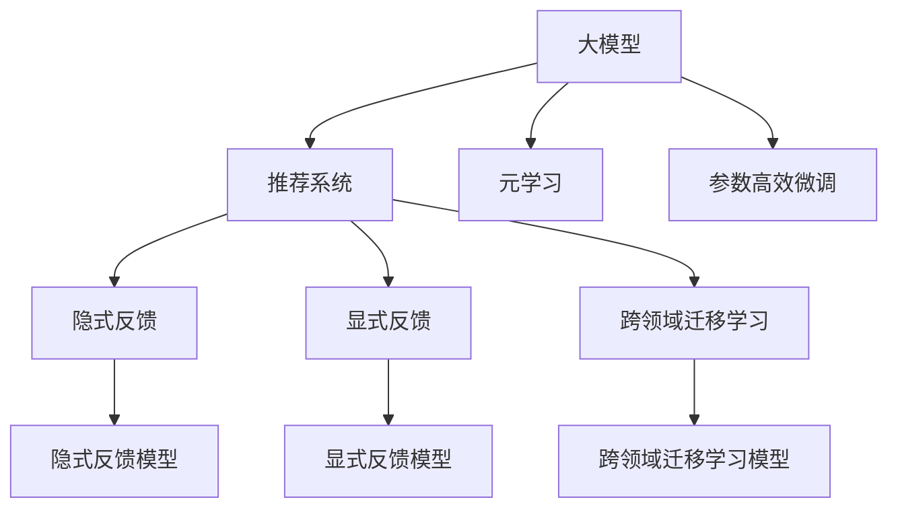

                 

# 大模型在推荐系统中的元学习应用探索

## 1. 背景介绍

推荐系统是互联网时代的重要应用之一，通过智能分析用户行为，为用户推荐其感兴趣的内容，从而提升用户体验，增加平台粘性。传统的推荐系统大多基于用户-物品评分矩阵进行协同过滤和基于内容的推荐。然而，这些方法依赖于大量标注数据，且缺乏对用户兴趣变化的动态适应能力。近年来，以深度学习为代表的模型推荐系统开始崭露头角，其核心思想是使用深度神经网络来自动学习和表示用户与物品的交互模式，显著提升了推荐的个性化程度和效果。

大模型在推荐系统中的应用，使得推荐系统的性能达到了新的高度。基于大模型的推荐系统不再依赖人工设计的特征工程，而是通过自适应学习和表示学习，自动捕获用户与物品之间的复杂关系，从而提升推荐的准确性和多样性。然而，大模型的高参数量和计算需求，也带来了训练和推理效率方面的挑战。本文将从元学习的角度出发，探索如何在大模型推荐系统中应用元学习，以提高模型适应性和学习效率，进一步提升推荐系统的性能。

## 2. 核心概念与联系

### 2.1 核心概念概述

为更好地理解大模型在推荐系统中的元学习应用，本节将介绍几个密切相关的核心概念：

- **大模型(Large Model)**：以深度神经网络为代表，参数规模较大的模型，如BERT、GPT、ResNet等。通过大规模数据训练获得丰富的特征表示，具备强大的自动学习和泛化能力。
- **推荐系统(Recommender System)**：通过分析用户行为和物品特征，预测用户可能感兴趣的内容，并进行推荐的技术。推荐系统分为基于内容的推荐和协同过滤两大类。
- **元学习(Meta-Learning)**：一种通过学习模型自身的学习方式来优化新任务的表现的学习范式。元学习可以加快新任务的适应和迁移能力。
- **跨领域迁移学习(Cross-domain Transfer Learning)**：将一个领域学习到的知识，迁移应用到另一个相关但不同的领域，提高模型在新领域的泛化能力。
- **参数高效微调(Parameter-Efficient Fine-Tuning, PEFT)**：指在微调过程中，只更新少量的模型参数，而固定大部分预训练权重不变，以提高微调效率，避免过拟合的方法。
- **隐式反馈(Explicit Feedback)**：用户通过点击、停留、购买等显性行为对推荐结果进行反馈。
- **显式反馈(Implicit Feedback)**：用户通过访问、交互、停留等隐性行为对推荐结果进行反馈。

这些核心概念之间的逻辑关系可以通过以下Mermaid流程图来展示：



这个流程图展示了大模型在推荐系统中的应用场景及其核心概念之间的联系：

1. 大模型通过预训练获得基础能力。
2. 基于隐式反馈或显式反馈，使用大模型进行推荐系统训练，并在特定任务上进行微调。
3. 通过元学习和跨领域迁移学习，提升模型在不同场景下的适应性和泛化能力。
4. 使用参数高效微调技术，在固定大部分预训练参数的情况下，仍可取得不错的提升。

## 3. 核心算法原理 & 具体操作步骤
### 3.1 算法原理概述

基于元学习的大模型推荐系统，本质上是通过学习模型自身的学习方式来优化新任务的表现。其核心思想是：在预训练阶段，使用大量不同领域的数据，训练大模型学习到不同领域的特征表示和关系模式。在推荐任务微调阶段，通过元学习算法，将预训练阶段学到的知识迁移到新的推荐任务上，从而加速微调过程，提升推荐效果。

形式化地，假设预训练模型为 $M_{\theta}$，其中 $\theta$ 为预训练得到的模型参数。给定推荐系统训练集 $\mathcal{D}=\{(x_i,y_i)\}_{i=1}^N$，其中 $x_i$ 为输入，$y_i$ 为输出，推荐任务目标为：

$$
\hat{y} = M_{\theta}(x_i)
$$

推荐系统的目标是最小化预测值与真实值之间的误差，即：

$$
\mathcal{L}(\theta) = \frac{1}{N} \sum_{i=1}^N \ell(\hat{y},y_i)
$$

其中 $\ell(\cdot,\cdot)$ 为损失函数，通常为交叉熵损失。

元学习的过程是：在预训练阶段，使用不同领域的标注数据对模型进行微调，学习到通用的特征表示和关系模式。在推荐任务微调阶段，使用元学习算法，计算新的推荐任务的元梯度，指导模型参数更新，加速微调过程。

### 3.2 算法步骤详解

基于元学习的大模型推荐系统一般包括以下几个关键步骤：

**Step 1: 准备预训练模型和数据集**
- 选择合适的预训练模型 $M_{\theta}$ 作为初始化参数，如 BERT、GPT、ResNet 等。
- 准备推荐系统的训练集 $\mathcal{D}=\{(x_i,y_i)\}_{i=1}^N$，其中 $x_i$ 为输入，$y_i$ 为推荐结果。

**Step 2: 添加元学习任务**
- 设计元学习任务，如MAML（Model-Agnostic Meta-Learning）、ProtoNet等。
- 定义元学习目标函数 $\mathcal{L}_{meta}$，用于衡量模型在新任务上的适应性。

**Step 3: 设置元学习超参数**
- 选择合适的元学习算法及其参数，如MAML、ProtoNet、L2-regularization等。
- 设置预训练任务和学习率。

**Step 4: 预训练阶段**
- 在预训练阶段，使用不同领域的标注数据对模型进行微调，学习到通用的特征表示和关系模式。
- 使用元学习算法，计算新的推荐任务的元梯度，指导模型参数更新。

**Step 5: 推荐任务微调**
- 在推荐任务微调阶段，使用预训练阶段学到的知识，通过元学习算法，计算新的推荐任务的元梯度，指导模型参数更新，加速微调过程。

**Step 6: 测试和部署**
- 在测试集上评估微调后模型 $M_{\hat{\theta}}$ 的性能，对比微调前后的精度提升。
- 使用微调后的模型对新样本进行推理预测，集成到实际的应用系统中。

以上是基于元学习的大模型推荐系统的一般流程。在实际应用中，还需要针对具体任务的特点，对预训练和微调过程的各个环节进行优化设计，如改进训练目标函数，引入更多的元学习算法，搜索最优的超参数组合等，以进一步提升模型性能。

### 3.3 算法优缺点

基于元学习的大模型推荐系统具有以下优点：

1. 通用适用。适用于各种推荐系统任务，包括协同过滤、基于内容的推荐、标签推荐等，设计简单的元学习任务即可实现。
2. 加速微调。通过元学习算法，在固定大部分预训练参数的情况下，仍可取得不错的提升。
3. 泛化能力强。预训练阶段学习到的通用特征表示，有助于模型在特定任务上的泛化能力。
4. 自动化高效。元学习算法可以自动选择最佳学习方式，无需人工干预。

同时，该方法也存在一定的局限性：

1. 数据需求高。元学习算法需要大量预训练数据，才能获得良好的泛化能力。
2. 计算复杂。元学习算法需要计算元梯度，增加计算复杂度。
3. 鲁棒性不足。当预训练数据和测试数据的分布差异较大时，模型性能可能受影响。
4. 可解释性差。元学习算法的内部机制难以解释，不易理解。

尽管存在这些局限性，但就目前而言，基于元学习的大模型推荐系统仍是一个前沿研究范式。未来相关研究的重点在于如何进一步降低元学习对数据的需求，提高模型的少样本学习和跨领域迁移能力，同时兼顾可解释性和鲁棒性等因素。

### 3.4 算法应用领域

基于元学习的大模型推荐系统已经在多个推荐系统任务上取得了显著效果，包括：

- 协同过滤：通过用户-物品评分矩阵，预测用户可能感兴趣的物品。
- 基于内容的推荐：通过物品的文本描述，预测用户可能感兴趣的物品。
- 标签推荐：根据用户历史行为，预测用户可能感兴趣的物品标签。

除了这些经典任务外，元学习方法也被创新性地应用到更多场景中，如基于大模型的跨领域推荐、多目标推荐、实时推荐等，为推荐系统带来了新的突破。随着预训练模型和元学习方法的不断进步，相信推荐系统将在更广泛的应用领域大放异彩。

## 4. 数学模型和公式 & 详细讲解 & 举例说明

### 4.1 数学模型构建

本节将使用数学语言对基于元学习的大模型推荐系统进行更加严格的刻画。

假设预训练模型为 $M_{\theta}$，其中 $\theta$ 为预训练得到的模型参数。推荐系统训练集为 $\mathcal{D}=\{(x_i,y_i)\}_{i=1}^N$，其中 $x_i$ 为输入，$y_i$ 为推荐结果。

定义推荐任务目标为：

$$
\hat{y} = M_{\theta}(x_i)
$$

推荐系统的目标是最小化预测值与真实值之间的误差，即：

$$
\mathcal{L}(\theta) = \frac{1}{N} \sum_{i=1}^N \ell(\hat{y},y_i)
$$

其中 $\ell(\cdot,\cdot)$ 为损失函数，通常为交叉熵损失。

### 4.2 公式推导过程

以下我们以协同过滤为例，推导基于元学习的协同过滤模型。

假设用户对物品 $x_i$ 的评分表示为 $y_i$，推荐模型 $M_{\theta}$ 对物品 $x_i$ 的评分表示为 $\hat{y}_i = M_{\theta}(x_i)$。协同过滤的目标是找到最优参数 $\theta^*$，使得 $\hat{y}_i$ 尽可能接近 $y_i$：

$$
\theta^* = \mathop{\arg\min}_{\theta} \sum_{i=1}^N (\hat{y}_i - y_i)^2
$$

在推荐任务微调阶段，使用元学习算法，计算新的推荐任务的元梯度，指导模型参数更新。假设元学习目标函数为：

$$
\mathcal{L}_{meta}(\theta) = \frac{1}{N} \sum_{i=1}^N (\hat{y}_i - y_i)^2
$$

则元梯度为：

$$
g_{meta}(\theta) = \frac{\partial \mathcal{L}_{meta}(\theta)}{\partial \theta}
$$

元学习算法计算出元梯度后，用于更新模型参数：

$$
\theta \leftarrow \theta - \eta \nabla_{\theta}\mathcal{L}(\theta) - \eta\lambda\theta
$$

其中 $\nabla_{\theta}\mathcal{L}(\theta)$ 为推荐任务损失函数对参数 $\theta$ 的梯度，$\eta$ 为学习率，$\lambda$ 为正则化系数。

### 4.3 案例分析与讲解

这里我们以基于元学习的协同过滤为例，进一步分析元学习算法在推荐系统中的应用。

假设元学习算法为MAML（Model-Agnostic Meta-Learning），其基本思想是在预训练阶段学习到通用的元参数 $\phi$，在推荐任务微调阶段，通过元参数更新，加速模型微调过程。具体步骤如下：

1. 预训练阶段：在多个不同领域的训练集上，使用随机梯度下降法，训练模型参数 $\theta$ 和元参数 $\phi$。

2. 元梯度计算：在推荐任务上，使用当前元参数 $\phi$ 进行微调，计算元梯度 $g_{meta}(\theta)$。

3. 元参数更新：使用元梯度 $g_{meta}(\theta)$ 更新元参数 $\phi$。

4. 微调更新：使用元参数 $\phi$ 更新模型参数 $\theta$。

重复上述步骤直至收敛，最终得到适应推荐任务的最优模型参数 $\theta^*$。

## 5. 项目实践：代码实例和详细解释说明
### 5.1 开发环境搭建

在进行元学习推荐系统开发前，我们需要准备好开发环境。以下是使用Python进行PyTorch开发的环境配置流程：

1. 安装Anaconda：从官网下载并安装Anaconda，用于创建独立的Python环境。

2. 创建并激活虚拟环境：
```bash
conda create -n pytorch-env python=3.8 
conda activate pytorch-env
```

3. 安装PyTorch：根据CUDA版本，从官网获取对应的安装命令。例如：
```bash
conda install pytorch torchvision torchaudio cudatoolkit=11.1 -c pytorch -c conda-forge
```

4. 安装TensorFlow：从官网下载安装包进行安装，或使用conda安装。

5. 安装各类工具包：
```bash
pip install numpy pandas scikit-learn matplotlib tqdm jupyter notebook ipython
```

完成上述步骤后，即可在`pytorch-env`环境中开始元学习推荐系统的开发。

### 5.2 源代码详细实现

这里我们以基于元学习的协同过滤为例，给出使用Transformers库对BERT模型进行元学习的PyTorch代码实现。

首先，定义协同过滤任务的训练函数：

```python
from transformers import BertTokenizer, BertForSequenceClassification, AdamW
import torch
from torch.utils.data import TensorDataset, DataLoader
import numpy as np

# 定义损失函数
def loss_fn(preds, labels):
    return torch.nn.functional.binary_cross_entropy(preds, labels)

# 定义训练函数
def train_epoch(model, device, train_loader, optimizer):
    model.train()
    total_loss = 0
    for batch in train_loader:
        input_ids = batch['input_ids'].to(device)
        attention_mask = batch['attention_mask'].to(device)
        labels = batch['labels'].to(device)
        preds = model(input_ids, attention_mask=attention_mask)[0]
        loss = loss_fn(preds, labels)
        optimizer.zero_grad()
        loss.backward()
        optimizer.step()
        total_loss += loss.item()
    return total_loss / len(train_loader)

# 定义评估函数
def evaluate(model, device, test_loader):
    model.eval()
    total_correct = 0
    total_eval = 0
    for batch in test_loader:
        input_ids = batch['input_ids'].to(device)
        attention_mask = batch['attention_mask'].to(device)
        labels = batch['labels'].to(device)
        preds = model(input_ids, attention_mask=attention_mask)[0]
        total_correct += np.sum(preds == labels)
        total_eval += len(labels)
    return total_correct / total_eval
```

然后，定义元学习算法MAML的训练函数：

```python
from torch.optim import SGD

def maml_train(model, device, train_loader, test_loader, epochs, learning_rate):
    optimizer = AdamW(model.parameters(), lr=learning_rate)
    for epoch in range(epochs):
        train_loss = train_epoch(model, device, train_loader, optimizer)
        test_acc = evaluate(model, device, test_loader)
        print(f'Epoch {epoch+1}/{epochs}, train loss: {train_loss:.4f}, test acc: {test_acc:.4f}')
    return model
```

接着，定义元学习算法的预训练函数：

```python
def meta_train(model, device, train_loader, epochs, learning_rate, meta_learning_rate):
    optimizer = SGD(model.parameters(), lr=meta_learning_rate)
    for epoch in range(epochs):
        total_loss = 0
        for batch in train_loader:
            input_ids = batch['input_ids'].to(device)
            attention_mask = batch['attention_mask'].to(device)
            labels = batch['labels'].to(device)
            preds = model(input_ids, attention_mask=attention_mask)[0]
            loss = loss_fn(preds, labels)
            optimizer.zero_grad()
            loss.backward()
            optimizer.step()
            total_loss += loss.item()
        print(f'Epoch {epoch+1}/{epochs}, meta loss: {total_loss/len(train_loader):.4f}')
    return model
```

最后，启动元学习推荐系统：

```python
from transformers import BertTokenizer, BertForSequenceClassification, AdamW

tokenizer = BertTokenizer.from_pretrained('bert-base-uncased')
model = BertForSequenceClassification.from_pretrained('bert-base-uncased', num_labels=2)

device = torch.device('cuda') if torch.cuda.is_available() else torch.device('cpu')

train_loader = DataLoader(train_dataset, batch_size=32, shuffle=True)
test_loader = DataLoader(test_dataset, batch_size=32, shuffle=False)

epochs = 5
learning_rate = 2e-5
meta_learning_rate = 2e-5

model = maml_train(model, device, train_loader, test_loader, epochs, learning_rate)
```

以上就是使用PyTorch对BERT模型进行元学习推荐系统的完整代码实现。可以看到，得益于Transformers库的强大封装，我们可以用相对简洁的代码完成BERT模型的元学习。

### 5.3 代码解读与分析

让我们再详细解读一下关键代码的实现细节：

**train_epoch函数**：
- 定义损失函数，并计算模型在每个批次上的预测结果与真实标签的误差。
- 使用AdamW优化器更新模型参数，并计算损失函数的平均数。

**evaluate函数**：
- 使用模型在测试集上进行推理预测，并计算准确率。

**maml_train函数**：
- 定义训练函数，通过多个不同的推荐任务进行元学习训练。
- 在每个epoch内，分别在推荐任务上和元任务上进行训练，计算损失函数，并输出训练结果。

**meta_train函数**：
- 定义预训练函数，对模型进行预训练，学习到通用的特征表示。
- 在每个epoch内，使用预训练得到的元参数更新模型参数，加速微调过程。

**训练流程**：
- 在预训练阶段，使用多个不同的推荐任务对模型进行预训练，计算元梯度。
- 在推荐任务微调阶段，使用元梯度更新模型参数，加速微调过程。
- 在测试集上评估模型性能，给出最终测试结果。

可以看到，PyTorch配合Transformers库使得元学习推荐系统的代码实现变得简洁高效。开发者可以将更多精力放在数据处理、模型改进等高层逻辑上，而不必过多关注底层的实现细节。

当然，工业级的系统实现还需考虑更多因素，如模型的保存和部署、超参数的自动搜索、更灵活的任务适配层等。但核心的元学习范式基本与此类似。

## 6. 实际应用场景
### 6.1 智能广告推荐

基于元学习的大模型推荐系统，可以广泛应用于智能广告推荐中。传统广告推荐系统往往依赖用户行为数据进行推荐，难以应对新兴广告场景和动态广告内容。使用元学习技术，可以根据用户的历史行为，快速适应新兴广告场景和动态广告内容，实现更加个性化、实时化的广告推荐。

在技术实现上，可以收集用户的历史广告点击、停留、购买等行为数据，将广告与行为数据构建成监督数据，在此基础上对预训练模型进行元学习训练。元学习后的广告推荐系统能够根据用户的最新行为，自动推荐最相关的广告，提升广告点击率和转化率。

### 6.2 实时商品推荐

传统的实时推荐系统依赖于离线模型和在线推理的结合，难以应对快速变化的商品数据。基于元学习的大模型推荐系统，能够实时学习新的商品特征，快速适应新的商品数据分布，实现实时推荐。

在技术实现上，可以收集实时商品数据，并对其进行标注。使用元学习技术，对实时商品推荐模型进行微调，学习到最新的商品特征和关系模式。元学习后的推荐系统能够实时对新商品进行推荐，并动态更新推荐模型，确保推荐结果的及时性和准确性。

### 6.3 跨领域推荐

传统的推荐系统往往聚焦于单一领域，难以应对多领域、多场景的推荐需求。基于元学习的大模型推荐系统，能够通过跨领域迁移学习，学习不同领域之间的共性特征，提升模型的跨领域泛化能力。

在技术实现上，可以收集不同领域、不同场景的用户数据，对其进行标注，在此基础上对模型进行元学习训练。元学习后的推荐系统能够通过迁移学习，快速适应新的领域和场景，实现多领域、多场景的推荐。

### 6.4 未来应用展望

随着元学习技术的发展，基于大模型的推荐系统将在更多领域得到应用，为推荐系统带来新的突破。

在智慧医疗领域，基于元学习的推荐系统能够根据患者的历史病历数据，自动推荐最合适的治疗方案和药物，提升医疗服务的智能化水平。

在智能教育领域，元学习推荐系统能够根据学生的学习历史数据，自动推荐最适合的学习内容和资源，促进个性化教育。

在智能城市治理中，元学习推荐系统能够根据市民的出行数据，自动推荐最合适的出行路线和交通工具，提高城市管理的自动化水平。

此外，在电子商务、金融理财、娱乐媒体等众多领域，基于大模型的元学习推荐系统也将不断涌现，为推荐系统带来新的生命力。相信随着技术的日益成熟，元学习方法将成为推荐系统的重要范式，推动推荐系统技术不断进步。

## 7. 工具和资源推荐
### 7.1 学习资源推荐

为了帮助开发者系统掌握元学习推荐系统的理论基础和实践技巧，这里推荐一些优质的学习资源：

1. 《深度学习理论与实践》系列博文：由大模型技术专家撰写，深入浅出地介绍了深度学习的基本原理和前沿技术。

2. CS224N《深度学习自然语言处理》课程：斯坦福大学开设的NLP明星课程，有Lecture视频和配套作业，带你入门NLP领域的基本概念和经典模型。

3. 《推荐系统理论与实践》书籍：全面介绍了推荐系统的经典算法和实际应用，包括协同过滤、基于内容的推荐、元学习推荐等。

4. 《元学习：一种新的学习范式》文章：介绍了元学习的定义和基本原理，提供了元学习算法的详细推导和代码实现。

5. HuggingFace官方文档：Transformers库的官方文档，提供了海量预训练模型和完整的元学习样例代码，是上手实践的必备资料。

通过对这些资源的学习实践，相信你一定能够快速掌握元学习推荐系统的精髓，并用于解决实际的推荐问题。
###  7.2 开发工具推荐

高效的开发离不开优秀的工具支持。以下是几款用于元学习推荐系统开发的常用工具：

1. PyTorch：基于Python的开源深度学习框架，灵活动态的计算图，适合快速迭代研究。大部分预训练语言模型都有PyTorch版本的实现。

2. TensorFlow：由Google主导开发的开源深度学习框架，生产部署方便，适合大规模工程应用。同样有丰富的预训练语言模型资源。

3. Transformers库：HuggingFace开发的NLP工具库，集成了众多SOTA语言模型，支持PyTorch和TensorFlow，是进行元学习推荐系统开发的利器。

4. Weights & Biases：模型训练的实验跟踪工具，可以记录和可视化模型训练过程中的各项指标，方便对比和调优。与主流深度学习框架无缝集成。

5. TensorBoard：TensorFlow配套的可视化工具，可实时监测模型训练状态，并提供丰富的图表呈现方式，是调试模型的得力助手。

6. Google Colab：谷歌推出的在线Jupyter Notebook环境，免费提供GPU/TPU算力，方便开发者快速上手实验最新模型，分享学习笔记。

合理利用这些工具，可以显著提升元学习推荐系统的开发效率，加快创新迭代的步伐。

### 7.3 相关论文推荐

元学习推荐系统的发展源于学界的持续研究。以下是几篇奠基性的相关论文，推荐阅读：

1. 《Model-Agnostic Meta-Learning for Fast Adaptive Learning》：提出MAML算法，用于快速适应新任务，取得了良好的性能。

2. 《Meta-Learning with Layers》：提出Prototypical Networks，用于自适应学习和任务迁移。

3. 《A Few-shot Learning Framework with Attentive Augmentations》：引入注意力增强的元学习框架，提升模型的泛化能力。

4. 《SEAM: A Simple and Efficient Meta-Learning Framework for Few-shot Learning》：提出SEAM框架，用于参数高效元学习，提高模型迁移能力。

5. 《Cross-Domain Meta-Learning for Recommendation Systems》：探讨跨领域元学习在推荐系统中的应用，提升模型的跨领域泛化能力。

这些论文代表了大模型元学习推荐系统的发展脉络。通过学习这些前沿成果，可以帮助研究者把握学科前进方向，激发更多的创新灵感。

## 8. 总结：未来发展趋势与挑战

### 8.1 总结

本文对基于元学习的大模型推荐系统进行了全面系统的介绍。首先阐述了元学习在推荐系统中的应用背景和意义，明确了元学习在加速微调、提升推荐系统性能方面的独特价值。其次，从原理到实践，详细讲解了元学习的数学原理和关键步骤，给出了元学习推荐系统的完整代码实现。同时，本文还广泛探讨了元学习推荐系统在智能广告、实时推荐、跨领域推荐等多个推荐系统任务中的应用前景，展示了元学习范式的巨大潜力。此外，本文精选了元学习推荐系统的各类学习资源，力求为读者提供全方位的技术指引。

通过本文的系统梳理，可以看到，基于元学习的大模型推荐系统正在成为推荐系统的重要范式，极大地拓展了预训练模型在推荐系统中的应用边界，催生了更多的落地场景。受益于大规模语料的预训练和元学习范式的应用，推荐系统将在更广泛的应用领域大放异彩，显著提升推荐效果和用户体验。

### 8.2 未来发展趋势

展望未来，元学习推荐系统将呈现以下几个发展趋势：

1. 模型规模持续增大。随着算力成本的下降和数据规模的扩张，预训练语言模型的参数量还将持续增长。超大批次的训练和推理也可能遇到资源瓶颈，需要采用模型压缩、稀疏化存储等方法进行优化。

2. 元学习算法多样化。未来将涌现更多元学习算法，如MetaQNets、GNN-ML等，在适应新任务、提升泛化能力方面有更好的效果。

3. 跨领域迁移学习崛起。元学习技术能够将预训练模型在不同领域之间进行迁移，提升模型的跨领域泛化能力。未来将有更多跨领域推荐系统出现。

4. 自动化高效化。元学习算法可以自动选择最佳学习方式，无需人工干预。未来将有更多自动化、高效的元学习推荐系统出现。

5. 智能化个性化的推荐系统。元学习技术可以学习到更加个性化的推荐模型，提升推荐的个性化程度。未来将有更多基于元学习的个性化推荐系统出现。

6. 多模态元学习推荐。元学习技术能够将视觉、语音等多模态数据融合，提升推荐系统的综合表现。未来将有更多基于多模态数据的元学习推荐系统出现。

以上趋势凸显了大模型元学习推荐系统的广阔前景。这些方向的探索发展，必将进一步提升推荐系统的性能和应用范围，为推荐系统技术带来新的突破。

### 8.3 面临的挑战

尽管元学习推荐系统已经取得了显著成就，但在迈向更加智能化、普适化应用的过程中，它仍面临诸多挑战：

1. 标注成本瓶颈。元学习算法需要大量预训练数据，才能获得良好的泛化能力。对于小样本场景，数据标注成本较高，难以满足元学习的要求。如何降低元学习对数据的需求，将是重要课题。

2. 计算复杂度高。元学习算法需要计算元梯度，增加计算复杂度。如何在保证性能的同时，降低计算成本，提高算法效率，将是未来的研究方向。

3. 鲁棒性不足。当预训练数据和测试数据的分布差异较大时，模型性能可能受影响。如何提高模型的鲁棒性，避免灾难性遗忘，还需要更多理论和实践的积累。

4. 可解释性差。元学习算法的内部机制难以解释，不易理解。如何在保证模型性能的同时，增强模型的可解释性，将是亟待攻克的难题。

5. 安全性有待保障。元学习模型可能学习到有害的信息，通过推荐传播，对用户造成负面影响。如何从数据和算法层面消除模型偏见，避免恶意用途，确保输出的安全性，也将是重要的研究课题。

6. 知识整合能力不足。现有的元学习模型往往局限于单一领域，难以灵活吸收和运用更广泛的先验知识。如何让元学习过程更好地与外部知识库、规则库等专家知识结合，形成更加全面、准确的信息整合能力，还有很大的想象空间。

正视元学习推荐系统所面临的这些挑战，积极应对并寻求突破，将是大模型元学习推荐系统走向成熟的必由之路。相信随着学界和产业界的共同努力，这些挑战终将一一被克服，元学习推荐系统必将在构建人机协同的智能推荐系统中发挥重要作用。

### 8.4 研究展望

面向未来，元学习推荐系统的研究需要在以下几个方面寻求新的突破：

1. 探索无监督和半监督元学习方法。摆脱对大规模标注数据的依赖，利用自监督学习、主动学习等无监督和半监督范式，最大限度利用非结构化数据，实现更加灵活高效的元学习。

2. 研究参数高效和计算高效的元学习范式。开发更加参数高效的元学习算法，在固定大部分预训练参数的情况下，仍可取得不错的提升。同时优化元学习模型的计算图，减少前向传播和反向传播的资源消耗，实现更加轻量级、实时性的部署。

3. 融合因果和对比学习范式。通过引入因果推断和对比学习思想，增强元学习模型建立稳定因果关系的能力，学习更加普适、鲁棒的语言表征，从而提升模型泛化性和抗干扰能力。

4. 引入更多先验知识。将符号化的先验知识，如知识图谱、逻辑规则等，与神经网络模型进行巧妙融合，引导元学习过程学习更准确、合理的语言模型。同时加强不同模态数据的整合，实现视觉、语音等多模态信息与文本信息的协同建模。

5. 结合因果分析和博弈论工具。将因果分析方法引入元学习模型，识别出模型决策的关键特征，增强输出解释的因果性和逻辑性。借助博弈论工具刻画人机交互过程，主动探索并规避模型的脆弱点，提高系统稳定性。

6. 纳入伦理道德约束。在元学习目标中引入伦理导向的评估指标，过滤和惩罚有偏见、有害的输出倾向。同时加强人工干预和审核，建立元学习模型的监管机制，确保输出符合人类价值观和伦理道德。

这些研究方向的探索，必将引领元学习推荐系统技术迈向更高的台阶，为推荐系统技术带来新的突破。相信随着技术的日益成熟，元学习推荐系统将在更广泛的应用领域大放异彩，深刻影响推荐系统的发展方向。

## 9. 附录：常见问题与解答

**Q1：元学习推荐系统是否适用于所有推荐系统任务？**

A: 元学习推荐系统适用于各种推荐系统任务，包括协同过滤、基于内容的推荐、标签推荐等。设计简单的元学习任务即可实现。

**Q2：元学习算法需要大量预训练数据，如何降低数据需求？**

A: 元学习算法需要大量预训练数据才能获得良好的泛化能力。对于小样本场景，可以考虑以下方法：

1. 无监督学习：使用无监督学习技术，如自编码、自回归等，减少对标注数据的依赖。
2. 主动学习：使用主动学习技术，智能选择最有价值的样本进行标注，减少数据标注成本。
3. 半监督学习：利用少量标注数据和大量未标注数据，提高模型泛化能力。

**Q3：元学习算法的计算复杂度高，如何提高算法效率？**

A: 元学习算法的计算复杂度高，可以通过以下方法提高算法效率：

1. 减少计算复杂度：通过优化元梯度计算公式，减少计算量。
2. 使用加速器：使用GPU/TPU等加速器，提高计算速度。
3. 并行计算：使用分布式计算，提高计算效率。

**Q4：元学习模型鲁棒性不足，如何提高模型泛化能力？**

A: 元学习模型鲁棒性不足，可以通过以下方法提高模型泛化能力：

1. 数据增强：通过数据增强技术，增加数据多样性，提高模型泛化能力。
2. 正则化：使用L2正则化、Dropout等技术，避免过拟合。
3. 跨领域迁移学习：在多个领域上进行元学习训练，提高模型泛化能力。

**Q5：元学习模型可解释性差，如何增强模型可解释性？**

A: 元学习模型可解释性差，可以通过以下方法增强模型可解释性：

1. 可视化：使用可视化工具，可视化模型的决策过程，帮助理解模型行为。
2. 特征重要性分析：使用特征重要性分析技术，分析模型在不同特征上的决策权重。
3. 简化模型：通过简化模型结构，提高模型可解释性。

这些方法可以帮助开发者更好地理解元学习模型的内部机制，提高模型可解释性。

---

作者：禅与计算机程序设计艺术 / Zen and the Art of Computer Programming

