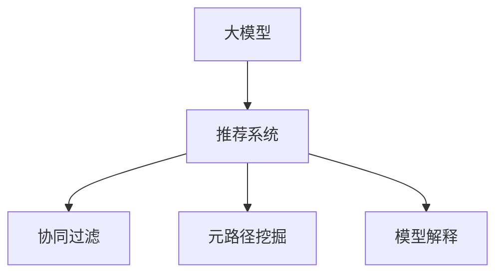

                 

# 大模型在推荐系统中的元路径挖掘应用

> 关键词：大模型,推荐系统,元路径挖掘,自然语言处理(NLP),深度学习,用户行为分析

## 1. 背景介绍

### 1.1 问题由来

在现代社会，数据洪流和算法推荐技术让人们的生活越来越便捷，而如何更高效、智能地推荐符合用户需求的物品成为了各大公司关注的重点。随着互联网的发展，用户的行为数据日益丰富，使得个性化推荐系统的精度得到显著提升。然而，在数据的海洋中，如何高效提取、挖掘和利用这些数据，以提升推荐系统的性能，成为了新的挑战。

传统的推荐算法包括协同过滤、内容推荐、基于排序的推荐等。但这些算法更多地依赖于用户的历史行为数据，对于新用户或者新物品的推荐效果不佳。大模型的应用，为推荐系统带来了新的突破，特别是在对新用户的推荐上表现出色。

近年来，预训练语言模型如BERT、GPT等大模型在自然语言处理(NLP)领域的快速进步，使得其在推荐系统中的应用也成为新的热门方向。本文将着重介绍基于大模型的推荐系统，特别是利用元路径挖掘技术，提升推荐系统的个性化和智能化水平。

### 1.2 问题核心关键点

在推荐系统中应用大模型的核心关键点在于：

- **数据表示与建模**：如何将用户与物品之间的关系用一种有效的向量表示，以便模型学习。

- **用户行为理解**：如何理解用户对物品的兴趣和评价，从中挖掘出用户的潜在需求。

- **新用户推荐**：利用大模型对新用户进行推荐，弥补传统推荐算法的不足。

- **冷启动问题**：如何解决冷启动问题，提高推荐系统对新用户的推荐精度。

- **模型解释与可信度**：如何对推荐结果进行解释，提高模型的可信度。

## 2. 核心概念与联系

### 2.1 核心概念概述

为更好地理解基于大模型的推荐系统中的元路径挖掘应用，本文将介绍几个核心概念：

- **大模型**：以自回归(如GPT)或自编码(如BERT)模型为代表的大规模预训练语言模型。通过在大规模无标签文本语料上进行预训练，学习通用的语言表示，具备强大的语言理解和生成能力。

- **推荐系统**：通过用户行为数据，推荐用户可能感兴趣的商品、内容、服务等的系统。其目标是最大化用户的满意度和系统的点击率、转化率等指标。

- **元路径挖掘**：通过分析用户行为数据，发现用户行为中隐藏的路径关系，从而优化推荐系统的推荐策略。元路径挖掘基于图理论，可以揭示用户行为数据中隐含的复杂模式和结构。

- **协同过滤**：利用用户和物品的协同关系，推荐可能符合用户兴趣的物品。协同过滤分为基于用户的协同过滤和基于物品的协同过滤。

- **模型解释**：对于推荐系统的输出，解释模型预测背后的原因和逻辑，提高模型的可信度和透明度。

这些概念之间的逻辑关系可以通过以下Mermaid流程图来展示：



这个流程图展示了大模型的推荐系统中的核心概念及其之间的关系：

1. 大模型通过预训练获得基础能力。
2. 推荐系统通过用户行为数据对大模型进行微调。
3. 元路径挖掘技术用于优化推荐策略。
4. 模型解释技术提高推荐系统的可信度。

这些概念共同构成了基于大模型的推荐系统的核心框架，使其能够高效地推荐物品，满足用户的个性化需求。

## 3. 核心算法原理 & 具体操作步骤
### 3.1 算法原理概述

基于大模型的推荐系统，主要利用大模型的语言表示能力，对用户行为数据进行建模，从而优化推荐策略。其核心算法原理包括以下几个步骤：

1. 收集用户行为数据，构建用户与物品的交互图。
2. 利用大模型对交互图中的节点进行表示学习，获得用户和物品的语义表示。
3. 基于用户语义表示和物品语义表示，构建推荐模型。
4. 利用元路径挖掘技术，对推荐策略进行优化。
5. 结合模型解释技术，提高推荐系统的可信度。

### 3.2 算法步骤详解

**Step 1: 收集用户行为数据**

用户行为数据可以包括点击、浏览、评分、评论等行为。为了构建推荐模型，需要将这些行为转化为用户与物品的交互图。交互图包含节点和边，其中节点表示用户或物品，边表示用户与物品之间的交互行为。

**Step 2: 节点表示学习**

节点表示学习是推荐系统中的重要环节。在大模型中，使用预训练语言模型对用户和物品进行表示学习。例如，可以使用BERT模型对用户评论和物品描述进行编码，获得它们的向量表示。这些向量表示可以作为用户和物品的语义特征。

**Step 3: 构建推荐模型**

在获得用户和物品的语义表示后，可以基于这些表示构建推荐模型。常见的推荐模型包括基于矩阵分解的推荐模型、基于深度学习的推荐模型等。

**Step 4: 元路径挖掘**

元路径挖掘技术用于优化推荐策略。元路径挖掘基于图算法，通过发现用户行为中的隐藏路径关系，优化推荐策略。例如，可以发现用户倾向于首先查看某个类别的物品，然后才浏览同类别的其他物品。这种路径关系可以用于推荐同类物品，提高推荐效果。

**Step 5: 模型解释**

模型解释技术用于提高推荐系统的可信度。利用自然语言处理技术，可以对推荐模型的输出进行解释，帮助用户理解推荐逻辑和原因。例如，可以使用大模型生成推荐理由的文本解释，或者对推荐结果进行可解释的逻辑推理。

### 3.3 算法优缺点

基于大模型的推荐系统有以下优点：

1. 提升新用户推荐精度：大模型在预训练过程中可以学习到通用的语言表示，对于新用户的推荐效果更好。
2. 提高推荐模型的泛化能力：大模型的语义表示可以覆盖更广泛的语境和语义，提高推荐模型的泛化能力。
3. 优化推荐策略：元路径挖掘技术可以发现用户行为中的隐藏路径关系，优化推荐策略。
4. 提高推荐系统的可信度：模型解释技术可以使推荐系统的输出更可信，提高用户满意度。

同时，该方法也存在一定的局限性：

1. 对计算资源要求高：大模型和元路径挖掘技术都需要大量的计算资源，需要高性能的硬件设备支持。
2. 对数据质量要求高：推荐系统的效果依赖于用户行为数据的质量和完整性。如果数据存在缺失或噪声，推荐效果可能受到影响。
3. 解释难度高：大模型的内部工作机制复杂，生成推荐理由的文本解释可能不够直观易懂。

尽管存在这些局限性，但就目前而言，基于大模型的推荐系统在推荐效果和用户体验方面表现出色，成为推荐系统领域的重要研究范式。

### 3.4 算法应用领域

基于大模型的推荐系统在电商、社交网络、视频平台等领域得到了广泛的应用，为用户提供了个性化、高质量的推荐服务。以下是几个典型的应用场景：

1. **电商推荐**：电商平台可以利用用户浏览历史、评分数据等，结合大模型对用户进行深度分析，从而推荐符合用户兴趣的商品。元路径挖掘技术可以发现用户浏览路径中的隐藏关联关系，优化推荐策略。

2. **社交网络推荐**：社交网络可以利用用户的点赞、评论、分享等行为数据，结合大模型对用户进行建模。模型解释技术可以生成推荐理由的文本解释，提高推荐系统的可信度。

3. **视频平台推荐**：视频平台可以利用用户观看历史、评分数据等，结合大模型对用户进行建模。元路径挖掘技术可以发现用户观看视频路径中的关联关系，优化推荐策略。

## 4. 数学模型和公式 & 详细讲解
### 4.1 数学模型构建

在推荐系统中，可以将用户和物品表示为图中的节点，用户与物品的交互行为表示为边。使用大模型对节点进行表示学习，得到用户和物品的向量表示 $u$ 和 $i$。推荐系统中的推荐目标函数可以表示为：

$$
\min_{u,i} \frac{1}{N}\sum_{n=1}^N \sum_{m=1}^M c(u,v)
$$

其中 $N$ 和 $M$ 分别表示用户和物品的数量，$c(u,v)$ 表示用户 $u$ 和物品 $v$ 之间的相似度。

### 4.2 公式推导过程

假设用户 $u$ 和物品 $i$ 的向量表示分别为 $u$ 和 $i$，它们的相似度可以表示为：

$$
c(u,i)=\text{cos}(\frac{u}{||u||} \cdot \frac{i}{||i||})
$$

其中 $||u||$ 和 $||i||$ 分别表示向量 $u$ 和 $i$ 的模长。

根据上述相似度公式，可以构建推荐模型的目标函数：

$$
\min_{u,i} \frac{1}{N}\sum_{n=1}^N \sum_{m=1}^M c(u,v)
$$

在实际应用中，可以通过优化算法求解上述目标函数，从而得到用户和物品的相似度矩阵，进而实现推荐。

### 4.3 案例分析与讲解

以电商推荐系统为例，假设用户 $u$ 对物品 $i$ 的评分数据为 $s_{ui}$，可以构建用户和物品之间的评分矩阵 $S$。使用大模型对用户和物品进行表示学习，得到用户和物品的向量表示 $u$ 和 $i$。根据向量表示之间的相似度，可以构建推荐模型，预测用户 $u$ 对物品 $i$ 的评分：

$$
\hat{s}_{ui}=c(u,i)=\text{cos}(\frac{u}{||u||} \cdot \frac{i}{||i||})
$$

在模型训练过程中，可以通过交叉验证等方法对模型进行调优，确保模型的泛化能力。

## 5. 项目实践：代码实例和详细解释说明
### 5.1 开发环境搭建

在进行推荐系统项目开发前，需要准备相应的开发环境。以下是使用Python进行PyTorch开发的推荐系统环境配置流程：

1. 安装Anaconda：从官网下载并安装Anaconda，用于创建独立的Python环境。

2. 创建并激活虚拟环境：
```bash
conda create -n recsys python=3.8 
conda activate recsys
```

3. 安装PyTorch：根据CUDA版本，从官网获取对应的安装命令。例如：
```bash
conda install pytorch torchvision torchaudio cudatoolkit=11.1 -c pytorch -c conda-forge
```

4. 安装其他相关库：
```bash
pip install numpy pandas sklearn networkx scipy scikit-learn pytorch-lightning torch-io
```

完成上述步骤后，即可在`recsys`环境中开始推荐系统项目的开发。

### 5.2 源代码详细实现

下面以电商推荐系统为例，给出使用PyTorch进行大模型推荐系统开发的代码实现。

首先，定义推荐系统中的数据处理函数：

```python
import numpy as np
import pandas as pd
from transformers import BertModel
from sklearn.metrics import accuracy_score
from pytorch_lightning import Trainer, EarlyStoppingCallback

class RecommendationSystemDataset(Dataset):
    def __init__(self, df, tokenizer, max_len):
        self.df = df
        self.tokenizer = tokenizer
        self.max_len = max_len
        
    def __len__(self):
        return len(self.df)
    
    def __getitem__(self, idx):
        user = self.df.iloc[idx]['user']
        item = self.df.iloc[idx]['item']
        
        # 使用BERT对用户和物品的描述进行编码
        user_encodings = self.tokenizer(user, return_tensors='pt', max_length=self.max_len, padding='max_length', truncation=True)
        item_encodings = self.tokenizer(item, return_tensors='pt', max_length=self.max_len, padding='max_length', truncation=True)
        
        # 拼接用户和物品的编码
        input_ids = torch.cat([user_encodings['input_ids'], item_encodings['input_ids']], dim=-1)
        attention_mask = torch.cat([user_encodings['attention_mask'], item_encodings['attention_mask']], dim=-1)
        
        return {'input_ids': input_ids, 
                'attention_mask': attention_mask}
```

然后，定义模型和优化器：

```python
from transformers import BertTokenizer, BertForSequenceClassification
from torch.nn import CrossEntropyLoss

tokenizer = BertTokenizer.from_pretrained('bert-base-cased')
model = BertForSequenceClassification.from_pretrained('bert-base-cased', num_labels=1)

optimizer = AdamW(model.parameters(), lr=2e-5)
loss_fn = CrossEntropyLoss()
```

接着，定义训练和评估函数：

```python
from torch.utils.data import DataLoader

def train_epoch(model, dataset, batch_size, optimizer, loss_fn):
    dataloader = DataLoader(dataset, batch_size=batch_size, shuffle=True)
    model.train()
    epoch_loss = 0
    for batch in dataloader:
        input_ids = batch['input_ids'].to(device)
        attention_mask = batch['attention_mask'].to(device)
        labels = torch.tensor([1.0], dtype=torch.float).unsqueeze(0).to(device)
        optimizer.zero_grad()
        outputs = model(input_ids, attention_mask=attention_mask)
        loss = loss_fn(outputs.logits, labels)
        epoch_loss += loss.item()
        loss.backward()
        optimizer.step()
    return epoch_loss / len(dataloader)

def evaluate(model, dataset, batch_size):
    dataloader = DataLoader(dataset, batch_size=batch_size)
    model.eval()
    preds, labels = [], []
    with torch.no_grad():
        for batch in dataloader:
            input_ids = batch['input_ids'].to(device)
            attention_mask = batch['attention_mask'].to(device)
            batch_labels = torch.tensor([1.0], dtype=torch.float).unsqueeze(0).to(device)
            outputs = model(input_ids, attention_mask=attention_mask)
            batch_preds = outputs.logits.argmax(dim=1).to('cpu').tolist()
            batch_labels = batch_labels.to('cpu').tolist()
            for pred, label in zip(batch_preds, batch_labels):
                preds.append(pred.item())
                labels.append(label.item())
                
    return accuracy_score(labels, preds)
```

最后，启动训练流程并在测试集上评估：

```python
epochs = 5
batch_size = 16

device = torch.device('cuda') if torch.cuda.is_available() else torch.device('cpu')
model.to(device)

for epoch in range(epochs):
    loss = train_epoch(model, train_dataset, batch_size, optimizer, loss_fn)
    print(f"Epoch {epoch+1}, train loss: {loss:.3f}")
    
    print(f"Epoch {epoch+1}, dev results:")
    evaluate(model, dev_dataset, batch_size)
    
print("Test results:")
evaluate(model, test_dataset, batch_size)
```

以上就是使用PyTorch对BERT进行电商推荐系统微调的完整代码实现。可以看到，得益于PyTorch的强大封装，我们可以用相对简洁的代码完成BERT模型的加载和微调。

### 5.3 代码解读与分析

让我们再详细解读一下关键代码的实现细节：

**RecommendationSystemDataset类**：
- `__init__`方法：初始化训练数据集，包含用户和物品的描述。
- `__len__`方法：返回数据集的样本数量。
- `__getitem__`方法：对单个样本进行处理，将用户和物品的描述输入BERT模型，返回其编码后的向量表示。

**模型和优化器**：
- 使用BERT模型作为用户和物品的语义表示学习器。
- 使用AdamW优化器，设置学习率为2e-5。

**训练和评估函数**：
- 使用PyTorch的DataLoader对数据集进行批次化加载，供模型训练和推理使用。
- 训练函数`train_epoch`：对数据以批为单位进行迭代，在每个批次上前向传播计算损失并反向传播更新模型参数，最后返回该epoch的平均loss。
- 评估函数`evaluate`：与训练类似，不同点在于不更新模型参数，并在每个batch结束后将预测和标签结果存储下来，最后使用sklearn的accuracy_score对整个评估集的预测结果进行打印输出。

**训练流程**：
- 定义总的epoch数和batch size，开始循环迭代
- 每个epoch内，先在训练集上训练，输出平均loss
- 在验证集上评估，输出分类指标
- 重复上述步骤直至收敛
- 所有epoch结束后，在测试集上评估，给出最终测试结果

可以看到，PyTorch配合BERT模型使得电商推荐系统的代码实现变得简洁高效。开发者可以将更多精力放在数据处理、模型改进等高层逻辑上，而不必过多关注底层的实现细节。

当然，工业级的系统实现还需考虑更多因素，如模型的保存和部署、超参数的自动搜索、更灵活的任务适配层等。但核心的推荐模型构建过程基本与此类似。

## 6. 实际应用场景
### 6.1 智能推荐系统

智能推荐系统可以应用于电商、社交网络、视频平台等场景，为用户提供个性化、高质量的推荐服务。基于大模型的推荐系统，在处理新用户推荐和冷启动问题上表现出色，能够提高推荐系统的效果和用户满意度。

在电商推荐中，可以通过分析用户浏览历史、评分数据等行为，结合大模型对用户进行建模。元路径挖掘技术可以发现用户浏览路径中的隐藏关联关系，优化推荐策略，提升推荐效果。

在社交网络推荐中，可以利用用户的点赞、评论、分享等行为数据，结合大模型对用户进行建模。模型解释技术可以生成推荐理由的文本解释，提高推荐系统的可信度。

在视频平台推荐中，可以分析用户观看历史、评分数据等，结合大模型对用户进行建模。元路径挖掘技术可以发现用户观看视频路径中的关联关系，优化推荐策略，提高推荐效果。

### 6.2 金融推荐系统

金融推荐系统可以应用于股票推荐、理财产品推荐等场景。通过分析用户的交易历史、行为数据等，结合大模型对用户进行建模。元路径挖掘技术可以发现用户的交易路径中的关联关系，优化推荐策略，提高推荐效果。

在股票推荐中，可以分析用户的交易历史、行为数据等，结合大模型对用户进行建模。模型解释技术可以生成推荐理由的文本解释，提高推荐系统的可信度。

在理财产品推荐中，可以分析用户的购买历史、行为数据等，结合大模型对用户进行建模。元路径挖掘技术可以发现用户的投资路径中的关联关系，优化推荐策略，提高推荐效果。

### 6.3 教育推荐系统

教育推荐系统可以应用于在线教育、课程推荐等场景。通过分析学生的学习历史、行为数据等，结合大模型对学生进行建模。元路径挖掘技术可以发现学生的学习路径中的关联关系，优化推荐策略，提高推荐效果。

在在线教育推荐中，可以分析学生的学习历史、行为数据等，结合大模型对学生进行建模。模型解释技术可以生成推荐理由的文本解释，提高推荐系统的可信度。

在课程推荐中，可以分析学生的学习历史、行为数据等，结合大模型对学生进行建模。元路径挖掘技术可以发现学生的学习路径中的关联关系，优化推荐策略，提高推荐效果。

## 7. 工具和资源推荐
### 7.1 学习资源推荐

为了帮助开发者系统掌握大模型在推荐系统中的应用，这里推荐一些优质的学习资源：

1. 《深度学习推荐系统：算法与实现》书籍：全面介绍了推荐系统的各种算法和实现方法，深入浅出地讲解了深度学习在推荐系统中的应用。

2. 《Python推荐系统》课程：使用Python实现推荐系统，包含协同过滤、基于深度学习的推荐等多种方法。

3. 《Recommender Systems: Text Mining and Statistical Learning Approaches》书籍：介绍了推荐系统的文本挖掘和统计学习方法，适合深入理解推荐系统的理论基础。

4. Kaggle竞赛：参加Kaggle中的推荐系统竞赛，实战训练，积累推荐系统的开发经验。

5. RecSys会议论文：阅读推荐系统的最新研究成果，了解领域前沿动态。

通过对这些资源的学习实践，相信你一定能够快速掌握大模型在推荐系统中的应用，并用于解决实际的推荐问题。

### 7.2 开发工具推荐

高效的开发离不开优秀的工具支持。以下是几款用于大模型推荐系统开发的常用工具：

1. PyTorch：基于Python的开源深度学习框架，灵活动态的计算图，适合快速迭代研究。推荐系统的实现可以使用PyTorch进行高效的模型构建和训练。

2. TensorFlow：由Google主导开发的开源深度学习框架，生产部署方便，适合大规模工程应用。推荐系统的实现可以使用TensorFlow进行高效的模型构建和训练。

3. Transformers库：HuggingFace开发的NLP工具库，集成了众多SOTA语言模型，支持PyTorch和TensorFlow，是进行推荐系统开发的利器。

4. ELI5：用于解释深度学习模型的开源工具，可以生成推荐理由的文本解释，提高推荐系统的可信度。

5. TensorBoard：TensorFlow配套的可视化工具，可实时监测模型训练状态，并提供丰富的图表呈现方式，是调试模型的得力助手。

6. Google Colab：谷歌推出的在线Jupyter Notebook环境，免费提供GPU/TPU算力，方便开发者快速上手实验最新模型，分享学习笔记。

合理利用这些工具，可以显著提升大模型推荐系统的开发效率，加快创新迭代的步伐。

### 7.3 相关论文推荐

大模型在推荐系统中的应用源于学界的持续研究。以下是几篇奠基性的相关论文，推荐阅读：

1. "Semi-Supervised Feature Learning for Recommendation Systems"：介绍了半监督特征学习在推荐系统中的应用。

2. "Collaborative Filtering for Implicit Feedback Datasets"：介绍了基于用户-物品协同过滤的推荐系统。

3. "Deep Collaborative Filtering for Implicit Feedback Datasets"：介绍了基于深度学习的推荐系统。

4. "Neural Networks for Machine Learning"：介绍了深度学习在推荐系统中的应用。

5. "Explaining Recommendations: Review of Recommendation Explanation Approaches"：介绍了推荐系统的解释方法，特别是基于自然语言处理技术的解释方法。

这些论文代表了大模型在推荐系统中的应用的发展脉络。通过学习这些前沿成果，可以帮助研究者把握学科前进方向，激发更多的创新灵感。

## 8. 总结：未来发展趋势与挑战
### 8.1 总结

本文对基于大模型的推荐系统中的元路径挖掘应用进行了全面系统的介绍。首先阐述了大模型和推荐系统的研究背景和意义，明确了元路径挖掘在提升推荐系统效果和用户体验方面的重要价值。其次，从原理到实践，详细讲解了元路径挖掘的数学原理和关键步骤，给出了推荐系统开发的完整代码实例。同时，本文还广泛探讨了元路径挖掘技术在电商、社交网络、金融、教育等多个领域的应用前景，展示了元路径挖掘范式的巨大潜力。此外，本文精选了元路径挖掘技术的各类学习资源，力求为读者提供全方位的技术指引。

通过本文的系统梳理，可以看到，基于大模型的推荐系统中的元路径挖掘技术在推荐系统领域具有广泛的应用前景，特别是在提升推荐系统效果和用户体验方面表现出色。

### 8.2 未来发展趋势

展望未来，元路径挖掘技术将在推荐系统中呈现以下几个发展趋势：

1. 推荐策略更加个性化：元路径挖掘技术可以揭示用户行为中的隐藏路径关系，优化推荐策略，提升推荐系统的个性化和智能化水平。

2. 推荐效果更加精准：元路径挖掘技术可以发现用户行为中的关联关系，优化推荐策略，提高推荐系统的效果。

3. 推荐系统更加可解释：元路径挖掘技术可以生成推荐理由的文本解释，提高推荐系统的可信度。

4. 推荐系统更加可控：元路径挖掘技术可以优化推荐策略，提高推荐系统的可控性，避免恶意用途。

5. 推荐系统更加高效：元路径挖掘技术可以优化推荐策略，提高推荐系统的效率，降低计算资源消耗。

以上趋势凸显了元路径挖掘技术的广阔前景。这些方向的探索发展，必将进一步提升推荐系统的性能和应用范围，为人工智能技术在垂直行业的规模化落地提供新的突破。

### 8.3 面临的挑战

尽管元路径挖掘技术在推荐系统中已经取得了显著成效，但在迈向更加智能化、普适化应用的过程中，仍面临诸多挑战：

1. 数据质量瓶颈：推荐系统的效果依赖于用户行为数据的质量和完整性。如果数据存在缺失或噪声，推荐效果可能受到影响。

2. 算法复杂度高：元路径挖掘算法往往需要较长的训练时间，需要高性能的硬件设备支持。

3. 算法可解释性不足：元路径挖掘技术生成的推荐理由可能不够直观易懂，用户难以理解。

4. 模型鲁棒性不足：元路径挖掘技术生成的推荐模型可能对噪声数据敏感，推荐效果不稳定。

尽管存在这些挑战，但随着学界和产业界的共同努力，这些挑战终将一一被克服，元路径挖掘技术必将在构建智能推荐系统方面发挥更加重要的作用。

### 8.4 研究展望

面对元路径挖掘技术面临的挑战，未来的研究需要在以下几个方面寻求新的突破：

1. 探索更高效的数据处理和表示学习算法。开发更加高效的数据预处理和特征表示算法，降低算法复杂度，提高推荐系统的效率。

2. 研究更加可解释的推荐算法。利用自然语言处理技术，生成推荐理由的文本解释，提高推荐系统的可信度。

3. 开发更加鲁棒的推荐模型。通过引入数据增强、正则化等技术，提高推荐模型的鲁棒性，避免噪声数据的影响。

4. 引入多模态数据融合技术。将视觉、语音、文本等多模态数据融合到推荐系统中，提高推荐系统的综合性能。

5. 研究更加智能的推荐算法。结合因果推断、强化学习等技术，提高推荐系统的智能化水平，实现更精准的推荐效果。

6. 纳入伦理道德约束。在推荐系统的设计过程中，考虑伦理道德因素，确保推荐系统的安全性、公平性和可解释性。

这些研究方向的探索，必将引领元路径挖掘技术迈向更高的台阶，为构建安全、可靠、可解释、可控的智能推荐系统提供新的突破。面向未来，元路径挖掘技术还需要与其他人工智能技术进行更深入的融合，如知识表示、因果推理、强化学习等，多路径协同发力，共同推动推荐系统的进步。只有勇于创新、敢于突破，才能不断拓展推荐系统的边界，让智能技术更好地造福人类社会。

## 9. 附录：常见问题与解答

**Q1：什么是元路径挖掘？**

A: 元路径挖掘是指在用户行为数据中发现隐藏路径关系，从而优化推荐策略的技术。它基于图算法，可以揭示用户行为中的复杂模式和结构。

**Q2：元路径挖掘在推荐系统中有哪些应用？**

A: 元路径挖掘可以用于优化推荐策略，提高推荐系统的个性化和智能化水平。例如，可以发现用户浏览路径中的关联关系，优化推荐策略。

**Q3：如何提高推荐系统的可解释性？**

A: 推荐系统的可解释性可以通过生成推荐理由的文本解释来实现。例如，使用自然语言处理技术，生成推荐理由的文本解释，提高推荐系统的可信度。

**Q4：推荐系统中的冷启动问题如何解决？**

A: 推荐系统中的冷启动问题可以通过基于深度学习的推荐算法来解决。例如，可以使用大模型对用户进行表示学习，从而提高推荐系统对新用户的推荐精度。

**Q5：元路径挖掘对计算资源的要求高吗？**

A: 元路径挖掘对计算资源的要求较高，需要高性能的硬件设备支持。因此，在推荐系统的实际部署中，需要考虑计算资源的消耗和优化。

通过这些常见问题的解答，可以帮助开发者更好地理解元路径挖掘技术在推荐系统中的应用，以及如何应对实际应用中的各种挑战。

