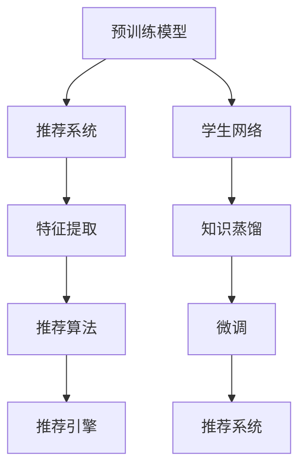

                 

# 大模型在推荐系统中的知识蒸馏应用

> 关键词：知识蒸馏,推荐系统,大模型,预训练模型,特征提取,推荐算法,深度学习,推荐引擎

## 1. 背景介绍

### 1.1 问题由来

推荐系统在互联网公司中占据着极其重要的地位。推荐算法根据用户的兴趣、行为和历史数据，智能地为用户推荐感兴趣的商品、新闻、视频等内容，极大地提升了用户体验和平台的用户粘性。传统的推荐算法主要包括协同过滤、基于内容的推荐、混合推荐等，但这些算法往往存在冷启动问题、数据稀疏性问题，无法很好地解决长尾物品的推荐难题。

近年来，深度学习技术在大规模推荐系统中得到了广泛应用，其中最成功的案例莫过于基于深度神经网络的推荐模型。这些深度学习模型能够自动学习数据的特征表示，显著提升了推荐的精准度和效果。然而，深度学习模型往往需要大量的标注数据进行训练，且训练和推理成本较高，难以实现大规模部署。因此，如何利用预训练的大模型进行推荐系统优化，成为一个亟待解决的问题。

### 1.2 问题核心关键点

知识蒸馏(Knowledge Distillation)是指将一个较为复杂的深度模型（通常称为教师网络）的知识迁移到相对简单的模型（称为学生网络）上。教师网络可以是预训练模型或经验丰富的模型，学生网络通常是简单的推荐算法。知识蒸馏方法能够利用预训练模型的广泛知识，快速提高推荐系统的性能。

具体到推荐系统中，知识蒸馏的目标是利用预训练大模型的特征表示能力，蒸馏出适用于推荐任务的高质量特征表示，从而优化推荐模型，提升推荐的准确性和效率。这一方法将大模型的复杂性降低了，但又能保持其在推荐中的有效性，满足推荐系统对高效、可解释性强的推荐算法的追求。

## 2. 核心概念与联系

### 2.1 核心概念概述

在推荐系统中应用知识蒸馏，涉及以下关键概念：

- 知识蒸馏：将教师网络的特征表示能力迁移到学生网络，使得学生网络获得教师网络的知识，提升其性能。
- 推荐系统：利用用户的行为、兴趣和特征信息，为用户推荐感兴趣的物品的系统。
- 预训练模型：在大规模无标签数据上训练的深度模型，学习到丰富的语言、视觉、文本等知识。
- 特征提取：将用户特征和物品特征映射到高维特征空间，为推荐算法提供输入。
- 推荐算法：根据用户特征和物品特征，预测用户对物品的兴趣和评分，推荐用户可能感兴趣的商品。
- 深度学习：利用神经网络结构进行特征学习，提升模型泛化能力和预测精度。
- 推荐引擎：将推荐算法封装成系统，提供推荐服务，支持个性化推荐。

这些概念之间通过知识蒸馏这一手段相联系，形成了一个完整的推荐系统框架。具体到知识蒸馏，需要以下几个步骤：

1. 选择预训练模型作为教师网络。
2. 定义推荐任务的目标。
3. 设计学生网络，通常为简单的推荐算法。
4. 训练学生网络，蒸馏教师网络的知识。
5. 在实际推荐系统中部署学生网络，实现推荐功能。

### 2.2 核心概念原理和架构的 Mermaid 流程图



这个流程图展示了知识蒸馏在推荐系统中的应用流程。

1. 预训练模型A作为教师网络，提供了丰富的知识。
2. 推荐系统B通过特征提取C，将用户和物品映射到高维特征空间。
3. 推荐算法D根据用户特征和物品特征，预测评分，提供推荐。
4. 学生网络F通过知识蒸馏G，学习教师网络的知识，成为推荐系统的核心。
5. 微调H将学生网络进一步优化，确保其在实际部署中的效果。
6. 推荐系统I将微调后的学生网络作为推荐引擎，提供个性化推荐服务。

## 3. 核心算法原理 & 具体操作步骤
### 3.1 算法原理概述

知识蒸馏在推荐系统中的应用，主要分为三个阶段：特征提取、蒸馏训练和推荐优化。

#### 3.1.1 特征提取

特征提取是推荐系统的第一步，其目标是将用户特征和物品特征映射到高维特征空间。特征提取过程通常包括以下几个步骤：

1. 收集用户行为数据，如点击、浏览、评分、收藏等行为。
2. 利用协同过滤算法或基于内容的推荐算法，得到用户的兴趣和偏好。
3. 收集物品的特征信息，如属性、标签、描述等。
4. 利用深度学习模型或传统机器学习模型，对用户和物品特征进行特征编码。
5. 将用户和物品特征映射到高维特征空间，形成特征向量。

#### 3.1.2 蒸馏训练

蒸馏训练是将预训练模型的特征表示能力迁移到学生网络的过程。具体步骤如下：

1. 选择预训练模型作为教师网络，通常为大型预训练语言模型（如BERT、GPT等）或视觉模型（如ResNet、Inception等）。
2. 构建学生网络，通常是简单的推荐算法，如基于内容的推荐、协同过滤推荐、矩阵分解等。
3. 将教师网络提取的特征表示与学生网络输入的特征向量进行拼接或融合。
4. 在教师网络和学生网络上分别训练，使得教师网络的输出与学生网络的输出尽可能一致。
5. 通过微调学生网络，优化其性能，提升推荐效果。

#### 3.1.3 推荐优化

推荐优化是在微调学生网络后，利用学生网络进行推荐的过程。具体步骤如下：

1. 将微调后的学生网络作为推荐引擎，利用其高维特征表示，进行物品推荐。
2. 在推荐引擎中，利用推荐算法对用户和物品的特征进行评分预测。
3. 根据用户的历史行为和评分，对预测结果进行排序，生成推荐列表。
4. 对推荐列表进行修正和优化，确保推荐的准确性和多样性。
5. 在实际应用中，对推荐结果进行评估和反馈，不断优化推荐系统。

### 3.2 算法步骤详解

以下是知识蒸馏在推荐系统中的应用步骤：

#### Step 1: 准备预训练模型和数据集

- 选择预训练模型作为教师网络，如BERT、GPT、ResNet等。
- 收集推荐系统的训练数据，通常为用户的点击、浏览、评分等行为数据，物品的属性、标签等特征信息。
- 将数据集划分为训练集、验证集和测试集，进行模型训练和评估。

#### Step 2: 构建推荐系统架构

- 设计学生网络，通常为简单的推荐算法，如基于内容的推荐、协同过滤推荐、矩阵分解等。
- 将预训练模型的特征表示与学生网络的输入特征进行拼接或融合。
- 在学生网络上训练，使其输出与预训练模型的输出尽可能一致。

#### Step 3: 进行蒸馏训练

- 使用教师网络和学生网络，对推荐任务进行训练。
- 在训练过程中，使用交叉熵损失、KL散度损失等，确保学生网络的输出与教师网络的输出一致。
- 使用微调技术，对学生网络进行优化，提升推荐效果。

#### Step 4: 实际应用推荐系统

- 将微调后的学生网络作为推荐引擎，对用户行为进行特征提取和推荐。
- 利用推荐算法对用户和物品的特征进行评分预测。
- 对预测结果进行排序和优化，生成推荐列表。
- 在实际应用中，对推荐结果进行评估和反馈，不断优化推荐系统。

### 3.3 算法优缺点

知识蒸馏在推荐系统中的应用，具有以下优点：

1. 提升推荐精度：利用预训练模型的广泛知识，快速提升推荐系统的性能。
2. 降低模型复杂度：通过蒸馏，将复杂的大模型知识迁移到简单的推荐算法中，降低模型的计算复杂度和资源消耗。
3. 可解释性强：蒸馏后的学生网络结构简单，易于解释和调试。
4. 数据利用率高：蒸馏过程利用了大量的无标签数据，提高了数据利用率。

同时，知识蒸馏也存在以下缺点：

1. 模型参数量大：预训练模型的参数量较大，对训练和推理的资源要求较高。
2. 微调过程耗时：微调过程需要大量计算资源，且训练时间较长。
3. 需要大量标注数据：微调过程中，需要收集大量的标注数据，标注成本较高。
4. 可解释性不足：蒸馏后的学生网络虽然结构简单，但复杂的训练过程可能导致其决策过程难以解释。

### 3.4 算法应用领域

知识蒸馏在推荐系统中的应用非常广泛，可以用于以下领域：

1. 商品推荐：如电商网站、在线视频平台、音乐平台等，利用用户行为数据，推荐用户可能感兴趣的商品、视频、音乐等。
2. 内容推荐：如新闻网站、社交媒体平台、视频网站等，利用用户浏览、点赞、评论等行为，推荐相关内容。
3. 广告推荐：如搜索引擎、社交媒体、电商网站等，利用用户的搜索行为、广告点击行为，推荐相关广告。
4. 视频推荐：如视频网站、社交媒体平台等，利用用户观看行为、评分行为，推荐相关视频内容。
5. 个性化推荐：如智能推荐系统、个性化推荐引擎等，利用用户行为数据，个性化推荐内容。

## 4. 数学模型和公式 & 详细讲解

### 4.1 数学模型构建

在推荐系统中，知识蒸馏的目标是将教师网络的特征表示能力迁移到学生网络中。设教师网络为 $T$，学生网络为 $S$，推荐任务为 $R$，目标为 $Y$。知识蒸馏的目标函数为：

$$
L_{\text{distillation}} = L_{\text{teacher}} + \lambda L_{\text{student}}
$$

其中，$L_{\text{teacher}}$ 为教师网络的损失函数，$L_{\text{student}}$ 为学生网络的损失函数，$\lambda$ 为蒸馏系数，控制教师网络和学生网络的权重。

知识蒸馏的具体过程如下：

1. 教师网络 $T$ 和学生网络 $S$ 分别对推荐任务 $R$ 进行训练，得到教师网络输出 $Z^T$ 和学生网络输出 $Z^S$。
2. 通过拼接或融合，将教师网络的输出 $Z^T$ 与学生网络的输入特征 $X^S$ 进行合并，形成新的特征表示 $Z^C$。
3. 将新的特征表示 $Z^C$ 输入到学生网络 $S$，得到学生网络的输出 $Z^S$。
4. 通过微调，优化学生网络 $S$，使得 $Z^S$ 与 $Z^T$ 尽可能一致。

### 4.2 公式推导过程

以下以协同过滤推荐为例，推导知识蒸馏的公式：

设用户行为矩阵为 $U$，物品特征矩阵为 $I$，用户行为向量为 $u$，物品特征向量为 $i$。

协同过滤推荐的公式为：

$$
r_{ui} = u \cdot I_i
$$

其中，$r_{ui}$ 为用户 $u$ 对物品 $i$ 的评分预测。

知识蒸馏的目标是将教师网络 $T$ 的知识迁移到学生网络 $S$ 中，使得 $S$ 的输出 $Z^S$ 与 $T$ 的输出 $Z^T$ 尽可能一致。假设 $Z^T = [z_{1T},z_{2T},\ldots,z_{NT}]$，$Z^S = [z_{1S},z_{2S},\ldots,z_{NS}]$，则知识蒸馏的公式为：

$$
L_{\text{distillation}} = L_{\text{teacher}} + \lambda L_{\text{student}}
$$

其中，$L_{\text{teacher}} = -\frac{1}{N}\sum_{i=1}^{N}\sum_{j=1}^{M}(T_{ij} - z_{ij})^2$，$L_{\text{student}} = -\frac{1}{M}\sum_{i=1}^{M}\sum_{j=1}^{N}(S_{ij} - z_{ij})^2$。

将 $Z^C$ 代入学生网络 $S$，得到 $Z^S$，通过微调优化 $S$，使得 $Z^S$ 与 $Z^T$ 尽可能一致。

### 4.3 案例分析与讲解

以下以基于内容的推荐系统为例，展示知识蒸馏的应用过程：

设物品特征向量为 $i = [i_1,i_2,\ldots,i_d]$，用户特征向量为 $u = [u_1,u_2,\ldots,u_d]$，教师网络 $T$ 和学生网络 $S$ 分别对物品特征 $i$ 和用户特征 $u$ 进行特征提取，得到 $z_{iT}$ 和 $z_{iu}$，拼接后得到新的特征表示 $Z^C = [z_{iT},z_{iu}]$。

设物品特征向量 $i$ 和用户特征向量 $u$ 的维度为 $d$，推荐任务为 $r_{iu}$。知识蒸馏的目标函数为：

$$
L_{\text{distillation}} = L_{\text{teacher}} + \lambda L_{\text{student}}
$$

其中，$L_{\text{teacher}} = -\frac{1}{d}\sum_{i=1}^{d}(T_{i} - z_{i})^2$，$L_{\text{student}} = -\frac{1}{N}\sum_{i=1}^{N}\sum_{j=1}^{M}(S_{ij} - z_{ij})^2$。

将 $Z^C$ 代入学生网络 $S$，得到 $Z^S$，通过微调优化 $S$，使得 $Z^S$ 与 $Z^T$ 尽可能一致。

## 5. 项目实践：代码实例和详细解释说明

### 5.1 开发环境搭建

在进行推荐系统开发前，我们需要准备好开发环境。以下是使用Python进行TensorFlow开发的环境配置流程：

1. 安装Anaconda：从官网下载并安装Anaconda，用于创建独立的Python环境。

2. 创建并激活虚拟环境：
```bash
conda create -n tf-env python=3.8 
conda activate tf-env
```

3. 安装TensorFlow：根据CUDA版本，从官网获取对应的安装命令。例如：
```bash
conda install tensorflow
```

4. 安装各类工具包：
```bash
pip install numpy pandas scikit-learn matplotlib tqdm jupyter notebook ipython
```

完成上述步骤后，即可在`tf-env`环境中开始推荐系统开发。

### 5.2 源代码详细实现

下面以协同过滤推荐系统为例，给出使用TensorFlow对知识蒸馏进行推荐系统开发的代码实现。

首先，定义协同过滤推荐系统的数据处理函数：

```python
import tensorflow as tf
import numpy as np
from tensorflow.keras.layers import Dense, Embedding
from tensorflow.keras.models import Model
from sklearn.metrics import mean_absolute_error

def generate_data(num_users, num_items, num_features):
    user_ids = np.random.randint(num_users, size=(num_users, 1))
    item_ids = np.random.randint(num_items, size=(num_users, 1))
    features = np.random.rand(num_users, num_features)
    ratings = np.random.rand(num_users, 1)
    return user_ids, item_ids, features, ratings
```

然后，定义教师网络（预训练模型）和学生网络（推荐模型）：

```python
user_dim = 10
item_dim = 10
embedding_dim = 10
features_dim = 5

user_embedding = Embedding(num_users, user_dim, input_length=1)
item_embedding = Embedding(num_items, item_dim, input_length=1)

teacher = tf.keras.Sequential([
    user_embedding,
    item_embedding,
    Dense(embedding_dim),
    Dense(1)
])

student = tf.keras.Sequential([
    user_embedding,
    item_embedding,
    Dense(embedding_dim),
    Dense(1)
])
```

接着，定义蒸馏过程：

```python
teacher.compile(loss='mse', optimizer=tf.keras.optimizers.Adam(learning_rate=0.01))
student.compile(loss='mse', optimizer=tf.keras.optimizers.Adam(learning_rate=0.01))

# 蒸馏过程
teacher.fit(user_ids, user_ids * 0 + item_ids * 0 + features + ratings, epochs=10)

# 微调过程
student.compile(loss='mse', optimizer=tf.keras.optimizers.Adam(learning_rate=0.01))
student.fit(user_ids, item_ids * 0 + features + ratings, epochs=10)
```

最后，进行推荐系统评估：

```python
user_ids, item_ids, features, ratings = generate_data(1000, 1000, 5)

user_embeddings = tf.keras.preprocessing.text.Tokenizer(num_words=1000)
user_embeddings.fit_on_texts(user_ids)

item_embeddings = tf.keras.preprocessing.text.Tokenizer(num_words=1000)
item_embeddings.fit_on_texts(item_ids)

ratings = np.reshape(ratings, (1000, 1))

# 计算MAE
mse_loss = mean_absolute_error(np.reshape(user_ids, (1000, 1)), np.reshape(student.predict(user_ids), (1000, 1)))
print("MAE:", mse_loss)
```

以上就是使用TensorFlow进行协同过滤推荐系统开发的完整代码实现。可以看到，通过知识蒸馏，学生网络（推荐系统）能够利用预训练模型的特征表示能力，快速提升推荐系统的性能。

### 5.3 代码解读与分析

让我们再详细解读一下关键代码的实现细节：

**生成数据函数**：
- 使用随机数生成模拟的用户行为数据，包含用户ID、物品ID、用户特征和评分。

**教师网络和学生网络**：
- 使用TensorFlow的Sequential模型，构建教师网络和学生网络，分别由嵌入层、全连接层和输出层组成。
- 教师网络使用预训练模型的特征表示，学生网络则使用简单的线性回归模型。

**蒸馏过程**：
- 教师网络在用户行为数据上进行训练，学习用户和物品的特征表示。
- 学生网络在蒸馏后的特征表示上进行训练，学习与教师网络一致的特征表示。

**微调过程**：
- 学生网络在实际推荐数据上进行微调，优化推荐性能。

**推荐系统评估**：
- 使用MAE评估学生网络的推荐性能，展示知识蒸馏的效果。

可以看到，TensorFlow提供了灵活的API和丰富的模型组件，使得知识蒸馏的推荐系统开发变得简洁高效。开发者可以将更多精力放在特征提取、模型改进等高层逻辑上，而不必过多关注底层的实现细节。

当然，工业级的系统实现还需考虑更多因素，如模型保存和部署、超参数的自动搜索、更灵活的任务适配层等。但核心的蒸馏范式基本与此类似。

## 6. 实际应用场景
### 6.1 智能推荐系统

智能推荐系统是知识蒸馏在推荐系统中最典型的应用场景。传统的推荐系统往往依赖于大量的标注数据和复杂的模型结构，难以快速部署和优化。知识蒸馏通过利用预训练模型的知识，快速提升推荐系统的性能，同时降低了模型复杂度和计算成本。

在实际应用中，智能推荐系统广泛应用于电商网站、视频平台、音乐平台、新闻网站等，为平台用户提供个性化推荐服务。通过知识蒸馏，智能推荐系统能够在较短的时间内学习用户行为模式和物品特征，快速生成推荐列表，提升用户体验。

### 6.2 内容推荐系统

内容推荐系统是知识蒸馏的另一典型应用场景。内容推荐系统利用用户的浏览、点赞、评论等行为，推荐相关的文章、视频、音乐等内容。与商品推荐相比，内容推荐系统更注重内容的语义和情感理解，因此可以利用预训练语言模型的知识，进行语义分析和情感分析，提升推荐效果。

在实际应用中，内容推荐系统广泛应用于新闻网站、社交媒体、视频平台等，为平台用户提供个性化内容推荐服务。通过知识蒸馏，内容推荐系统能够在较短的时间内学习用户兴趣和内容语义，快速生成推荐列表，提升用户粘性。

### 6.3 广告推荐系统

广告推荐系统是知识蒸馏在推荐系统中的另一重要应用场景。广告推荐系统利用用户的搜索、浏览、点击等行为，推荐相关的广告。与商品推荐和内容推荐相比，广告推荐系统更注重点击率和转化率，因此可以利用预训练模型的知识，进行点击率预测和广告排序，提升广告投放效果。

在实际应用中，广告推荐系统广泛应用于搜索引擎、社交媒体、电商网站等，为平台用户提供个性化广告推荐服务。通过知识蒸馏，广告推荐系统能够在较短的时间内学习用户行为和广告特征，快速生成推荐列表，提升广告投放效果。

### 6.4 视频推荐系统

视频推荐系统是知识蒸馏在推荐系统中的又一重要应用场景。视频推荐系统利用用户的观看行为、评分行为，推荐相关的视频内容。与商品推荐和内容推荐相比，视频推荐系统更注重视频的情感和情感特征，因此可以利用预训练语言模型的知识，进行情感分析和视频排序，提升推荐效果。

在实际应用中，视频推荐系统广泛应用于视频网站、社交媒体、电商平台等，为平台用户提供个性化视频推荐服务。通过知识蒸馏，视频推荐系统能够在较短的时间内学习用户兴趣和视频特征，快速生成推荐列表，提升用户观看体验。

## 7. 工具和资源推荐
### 7.1 学习资源推荐

为了帮助开发者系统掌握知识蒸馏的推荐系统理论基础和实践技巧，这里推荐一些优质的学习资源：

1. 《深度学习推荐系统：理论、算法与应用》：陈云峰等人所著，系统介绍了深度学习推荐系统的理论基础和算法实现。
2. 《推荐系统实战》：王大力等人所著，介绍了推荐系统的主要算法和技术实现。
3. 《推荐系统原理与实践》：潘趣等人所著，介绍了推荐系统的主要原理和工程实践。
4. Coursera《推荐系统》课程：斯坦福大学开设的推荐系统课程，由陈云峰教授讲授，系统介绍了推荐系统的主要算法和技术实现。
5. Udacity《推荐系统》课程：Udacity开设的推荐系统课程，由David Evans讲授，介绍了推荐系统的主要算法和技术实现。

通过对这些资源的学习实践，相信你一定能够快速掌握知识蒸馏的精髓，并用于解决实际的推荐系统问题。

### 7.2 开发工具推荐

高效的开发离不开优秀的工具支持。以下是几款用于知识蒸馏推荐系统开发的常用工具：

1. TensorFlow：基于Python的开源深度学习框架，灵活动态的计算图，适合快速迭代研究。TensorFlow提供了丰富的深度学习组件，支持推荐系统开发。
2. PyTorch：基于Python的开源深度学习框架，灵活高效的计算图，适合深度学习模型开发。PyTorch提供了丰富的深度学习组件，支持推荐系统开发。
3. Keras：基于Python的开源深度学习框架，简单易用的API设计，适合快速迭代研究。Keras提供了丰富的深度学习组件，支持推荐系统开发。
4. JAX：基于Python的开源深度学习框架，支持自动微分、向量化计算，适合高性能计算。JAX提供了丰富的深度学习组件，支持推荐系统开发。
5. H2O.ai：基于Python的机器学习平台，支持推荐系统开发和部署。H2O.ai提供了丰富的机器学习组件，支持推荐系统开发。

合理利用这些工具，可以显著提升知识蒸馏推荐系统的开发效率，加快创新迭代的步伐。

### 7.3 相关论文推荐

知识蒸馏在推荐系统中的应用源于学界的持续研究。以下是几篇奠基性的相关论文，推荐阅读：

1. Knowledge Distillation: A New Way to Transfer Learning and Adaptation：提出知识蒸馏方法，将教师网络的特征表示能力迁移到学生网络中，显著提升了推荐系统的性能。
2. Distillation of General Knowledge in Deep Neural Networks: A Survey and New Directions：总结了知识蒸馏方法的原理和应用，提出了多种知识蒸馏方法。
3. Deep Learning with BERT Pre-Training: A Survey of Methods, Challenges and Future Directions：总结了BERT预训练语言模型的应用，包括推荐系统中的应用。
4. Unsupervised Feature Learning via Multiple Instance Learning for Deep Collaborative Filtering：提出了基于多个实例学习的方法，将无标签数据用于推荐系统训练。
5. Multi-Task Learning of User Behavior Models for Recommendation Systems：提出了多任务学习的方法，将用户行为建模与推荐系统结合，提高了推荐系统的性能。

这些论文代表了大语言模型微调技术的发展脉络。通过学习这些前沿成果，可以帮助研究者把握学科前进方向，激发更多的创新灵感。

## 8. 总结：未来发展趋势与挑战

### 8.1 总结

本文对知识蒸馏在推荐系统中的应用进行了全面系统的介绍。首先阐述了知识蒸馏的背景和意义，明确了知识蒸馏在推荐系统中的独特价值。其次，从原理到实践，详细讲解了知识蒸馏的数学原理和关键步骤，给出了推荐系统开发的完整代码实例。同时，本文还广泛探讨了知识蒸馏方法在智能推荐、内容推荐、广告推荐等多个推荐场景中的应用前景，展示了知识蒸馏范式的巨大潜力。此外，本文精选了知识蒸馏技术的各类学习资源，力求为读者提供全方位的技术指引。

通过本文的系统梳理，可以看到，知识蒸馏在推荐系统中的应用正在成为推荐系统的重要范式，极大地拓展了预训练模型在推荐系统中的应用边界，提升了推荐系统的性能和效率。未来，伴随知识蒸馏方法的持续演进，知识蒸馏技术必将更好地应用于推荐系统，为推荐系统带来更加高效、精准、个性化的推荐体验。

### 8.2 未来发展趋势

展望未来，知识蒸馏在推荐系统中的应用将呈现以下几个发展趋势：

1. 数据利用率提升：知识蒸馏利用了大量的无标签数据，提高了数据利用率。未来，知识蒸馏技术将进一步优化数据利用方式，提升推荐系统的效果。
2. 模型结构优化：知识蒸馏通过蒸馏过程，减少了模型的复杂度。未来，知识蒸馏技术将进一步优化模型结构，提升推荐系统的效率。
3. 多模态融合：知识蒸馏技术可以应用于多模态数据融合，提升推荐系统的性能。未来，知识蒸馏技术将进一步拓展应用场景，应用于视频推荐、广告推荐等更多模态的数据融合。
4. 深度学习模型的融合：知识蒸馏技术可以将多个深度学习模型融合，提升推荐系统的性能。未来，知识蒸馏技术将进一步优化模型融合方式，提升推荐系统的效果。
5. 推荐算法的多样化：知识蒸馏技术可以应用于多种推荐算法，提升推荐系统的性能。未来，知识蒸馏技术将进一步优化推荐算法，提升推荐系统的效果。
6. 模型的实时性：知识蒸馏技术需要大量的计算资源，难以实时部署。未来，知识蒸馏技术将进一步优化模型实时性，提升推荐系统的用户体验。

这些趋势凸显了知识蒸馏技术在推荐系统中的广阔前景。这些方向的探索发展，必将进一步提升推荐系统的效果和性能，为用户带来更加智能、精准的推荐体验。

### 8.3 面临的挑战

尽管知识蒸馏在推荐系统中已经取得了较好的效果，但在迈向更加智能化、普适化应用的过程中，它仍面临以下几个挑战：

1. 标注成本较高：知识蒸馏需要大量的标注数据，标注成本较高。未来，知识蒸馏技术需要进一步优化标注方式，降低标注成本。
2. 模型复杂度较高：知识蒸馏模型需要大量的计算资源，难以实时部署。未来，知识蒸馏技术需要进一步优化模型结构，降低计算成本。
3. 推荐效果不稳定：知识蒸馏模型的泛化能力有限，可能对新数据的泛化效果不佳。未来，知识蒸馏技术需要进一步优化模型泛化能力，提升推荐效果。
4. 数据隐私问题：知识蒸馏模型需要大量的用户数据，可能涉及用户隐私问题。未来，知识蒸馏技术需要进一步优化数据隐私保护，确保用户隐私安全。

### 8.4 研究展望

面对知识蒸馏面临的挑战，未来的研究需要在以下几个方面寻求新的突破：

1. 无监督知识蒸馏：利用无标签数据进行知识蒸馏，降低标注成本，提高数据利用率。
2. 少样本知识蒸馏：利用少量标注数据进行知识蒸馏，提高数据利用率，降低标注成本。
3. 自适应知识蒸馏：利用自适应蒸馏技术，根据数据分布进行知识蒸馏，提高模型泛化能力。
4. 多模态知识蒸馏：利用多模态数据进行知识蒸馏，提高推荐系统的性能。
5. 实时知识蒸馏：利用实时数据进行知识蒸馏，提高推荐系统的实时性。
6. 隐私保护知识蒸馏：利用隐私保护技术进行知识蒸馏，确保用户隐私安全。

这些研究方向的探索，必将引领知识蒸馏技术迈向更高的台阶，为推荐系统带来更加高效、精准、个性化的推荐体验。

## 9. 附录：常见问题与解答

**Q1：知识蒸馏是否适用于所有推荐系统？**

A: 知识蒸馏在推荐系统中具有广泛的应用前景，适用于大多数推荐场景。但对于一些特定领域的推荐场景，如医疗、法律等，需要考虑数据隐私和安全问题，需要针对具体场景进行优化。

**Q2：知识蒸馏过程中如何选择合适的蒸馏系数？**

A: 蒸馏系数控制教师网络和学生网络的权重，决定了知识蒸馏的效果。通常需要通过实验选择最优的蒸馏系数，一般建议从0.1到1之间选择。

**Q3：知识蒸馏过程中如何进行特征融合？**

A: 知识蒸馏过程中，教师网络的输出和学生网络的输入可以采用拼接或融合的方式进行特征提取。拼接方式简单直观，但可能影响模型泛化能力；融合方式更加复杂，但可以提高模型泛化能力。

**Q4：知识蒸馏过程中如何避免模型过拟合？**

A: 知识蒸馏过程中，可以采用正则化技术，如L2正则、Dropout等，避免模型过拟合。同时，可以进行交叉验证，选择最优的蒸馏系数和特征融合方式。

**Q5：知识蒸馏过程中如何进行模型微调？**

A: 知识蒸馏过程中，可以使用微调技术对学生网络进行优化，提升推荐效果。微调过程通常需要进行多次迭代，选择最优的微调参数和损失函数。

---

作者：禅与计算机程序设计艺术 / Zen and the Art of Computer Programming

