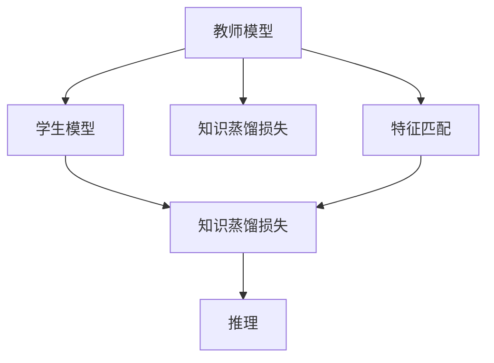

                 

# 大模型在推荐系统中的知识蒸馏应用

## 1. 背景介绍

### 1.1 问题由来

随着互联网技术的迅猛发展，推荐系统已经成为各行各业数据驱动决策的重要工具。推荐系统通过分析用户历史行为，预测用户未来可能感兴趣的物品，为用户推荐个性化产品、内容等，从而提升用户满意度，增加商业价值。

传统的推荐系统多基于协同过滤、内容过滤等简单模型，难以充分挖掘用户复杂多变的兴趣和需求。近年来，深度学习技术被引入推荐系统，通过大模型学习用户行为，获得更加全面准确的推荐结果。然而，深度学习模型的复杂性和高资源需求，使得直接在大模型上进行推荐系统训练难以落地实施。

为此，研究者们提出了知识蒸馏方法，即通过迁移学习，将大模型的隐含知识转化为小模型的显式知识，从而在资源有限的情况下，快速训练出高性能推荐模型。

### 1.2 问题核心关键点

知识蒸馏方法的核心思想是将大模型的隐式知识转化为小模型的显式知识。其核心步骤包括：

- **教师模型训练**：使用大模型在大规模数据集上进行预训练，获得丰富的隐含知识。
- **学生模型训练**：使用小模型在少量标注数据上微调，以捕获大模型中的关键知识。
- **知识转移**：通过某种形式的知识转移，将大模型知识注入小模型，提升其性能。

知识蒸馏方法在推荐系统中具有以下优势：

1. 参数量少，推理速度快。推荐系统需要实时响应用户请求，小模型的快速推理能力符合实时性要求。
2. 模型轻量化，降低存储和计算成本。小模型的轻量化特性，使得推荐系统可以部署在各种计算设备上。
3. 可解释性增强。小模型的显式知识结构，更易于理解和解释推荐过程。

然而，知识蒸馏方法也存在一些挑战：

1. 教师模型知识泛化能力有限。大模型的知识往往基于原始数据，难以应对多样化的推荐场景。
2. 学生模型学习难度大。知识蒸馏过程中，如何高效转移教师模型的知识，需要设计合理的蒸馏策略和损失函数。
3. 知识蒸馏效果的评估。如何衡量学生模型在学习过程中保留了多少教师模型的知识，是一个值得深入探讨的问题。

尽管如此，知识蒸馏方法在大模型推荐系统中的应用已经取得了一定成果，未来有望进一步提升推荐系统的个性化和推荐效率。

## 2. 核心概念与联系

### 2.1 核心概念概述

为更好地理解知识蒸馏在推荐系统中的应用，本节将介绍几个关键概念：

- 知识蒸馏(Knowledge Distillation)：指将大模型的隐含知识转化为小模型的显式知识，从而提升小模型的泛化能力和性能。
- 教师模型(Teacher Model)：用于蒸馏的大模型，具有丰富的隐含知识。
- 学生模型(Student Model)：被蒸馏的小模型，通过知识蒸馏过程提升性能。
- 知识蒸馏损失(Knowledge Distillation Loss)：用于衡量教师模型和学生模型之间知识转移程度的损失函数。
- 特征匹配(Feature Matching)：通过对齐教师模型和学生模型的特征表示，实现知识转移。
- 软蒸馏(Soft Distillation)：通过引入标签预测信息，提升学生模型的性能。
- 单样本蒸馏(Single Sample Distillation)：利用单个样本训练学生模型，减少数据需求。

这些核心概念之间的逻辑关系可以通过以下Mermaid流程图来展示：



这个流程图展示了大模型推荐系统中的核心概念及其关系：

1. 教师模型通过特征匹配将知识蒸馏到学生模型。
2. 知识蒸馏损失指导教师模型和学生模型之间的知识对齐。
3. 学生模型通过推理生成推荐结果。

## 3. 核心算法原理 & 具体操作步骤
### 3.1 算法原理概述

知识蒸馏方法在大模型推荐系统中的原理是基于迁移学习，通过将大模型的隐含知识转移至小模型，从而提升小模型的推荐能力。具体来说，知识蒸馏方法包括以下步骤：

1. **教师模型训练**：在大规模数据集上训练大模型，使其获得丰富的隐含知识。
2. **学生模型训练**：使用小模型在大模型上微调，获得初始知识。
3. **知识蒸馏**：通过特征匹配和知识蒸馏损失，将教师模型的知识转移到学生模型，提升学生模型的推荐能力。
4. **推荐推理**：使用训练好的学生模型对用户请求进行推理，生成推荐结果。

### 3.2 算法步骤详解

以单样本蒸馏(Single Sample Distillation)为例，介绍知识蒸馏的具体操作步骤：

**Step 1: 准备数据集**

收集推荐系统所需的数据集 $D = \{(x_i, y_i)\}_{i=1}^N$，其中 $x_i$ 为用户行为数据，$y_i$ 为推荐结果。

**Step 2: 定义教师和学生模型**

选择合适的大模型 $M_t$ 作为教师模型，并在推荐数据集上进行预训练。例如，可以使用Bert、Transformer等模型。定义学生模型 $M_s$，通常使用结构更简单的小模型，如线性分类器、MLP等。

**Step 3: 初始化学生模型**

将学生模型 $M_s$ 在大模型 $M_t$ 上进行微调，获得初始化参数 $M_s^0$。

**Step 4: 特征匹配**

将教师模型 $M_t$ 和学生模型 $M_s$ 的特征表示对齐。常用的方法是使用蒸馏任务 $T$，例如，在教师模型上预测学生模型输出，作为蒸馏任务的目标。

**Step 5: 知识蒸馏损失计算**

定义蒸馏损失 $L_{distill}$，用于衡量教师模型和学生模型之间的知识对齐程度。常用的蒸馏损失包括特征对齐损失、最大对数似然损失等。

**Step 6: 学生模型微调**

使用蒸馏损失 $L_{distill}$ 对学生模型 $M_s$ 进行微调，更新参数 $M_s^0$，得到优化后的学生模型 $M_s^1$。

**Step 7: 推荐推理**

使用优化后的学生模型 $M_s^1$ 对用户请求进行推理，生成推荐结果。

### 3.3 算法优缺点

知识蒸馏方法在大模型推荐系统中具有以下优点：

1. 提升小模型性能。通过大模型的知识转移，学生模型可以更好地适应推荐任务，提升推荐精度。
2. 减少资源消耗。小模型在推理时所需计算资源少，适合部署在资源有限的设备上。
3. 提高可解释性。小模型的知识结构易于理解和解释，有助于构建透明、可控的推荐系统。

同时，该方法也存在一些局限性：

1. 数据需求较大。尽管小模型减少了计算资源消耗，但在大模型预训练和蒸馏过程中，仍需要大量标注数据。
2. 蒸馏损失设计复杂。如何设计合理的蒸馏损失，使得教师模型和学生模型之间知识对齐，是一个挑战。
3. 知识泛化能力有限。大模型的知识可能难以泛化到小模型上，特别是在复杂多变的推荐场景下。
4. 推理速度受限。小模型的推理速度虽然快，但在数据集较大时，推理速度也可能受到限制。

尽管如此，知识蒸馏方法在推荐系统中的应用已经取得了一定成果，未来有望在更多的推荐场景中发挥作用。

### 3.4 算法应用领域

知识蒸馏方法在大模型推荐系统中具有广泛的应用场景，例如：

- 电商推荐：通过知识蒸馏提升电商平台对用户购买行为的预测精度，推荐个性化商品。
- 音乐推荐：利用知识蒸馏方法提高音乐推荐系统的个性化推荐能力，提升用户满意度。
- 视频推荐：在视频推荐系统中，通过知识蒸馏优化视频内容推荐算法，提升推荐效果。
- 游戏推荐：在在线游戏中，知识蒸馏方法可以用于提升游戏推荐系统的精度和响应速度。

此外，知识蒸馏方法还广泛应用于多模态推荐、跨域推荐等复杂推荐场景中，推动推荐系统技术不断进步。

## 4. 数学模型和公式 & 详细讲解  
### 4.1 数学模型构建

本节将使用数学语言对知识蒸馏在推荐系统中的应用进行更加严格的刻画。

记教师模型为 $M_t:\mathcal{X} \rightarrow \mathcal{Y}$，其中 $\mathcal{X}$ 为用户行为数据，$\mathcal{Y}$ 为推荐结果。记学生模型为 $M_s:\mathcal{X} \rightarrow \mathcal{Y}$。假设推荐数据集为 $D=\{(x_i,y_i)\}_{i=1}^N$。

定义知识蒸馏损失为：

$$
L_{distill} = \alpha \mathcal{L}(M_t, M_s) + (1-\alpha) \mathcal{L}(M_s, D)
$$

其中 $\alpha$ 为蒸馏系数，控制教师模型和学生模型之间的损失比例。$\mathcal{L}(M_t, M_s)$ 表示教师模型和学生模型之间的知识对齐损失，$\mathcal{L}(M_s, D)$ 表示学生模型在推荐数据集上的表现损失。

知识蒸馏损失可以通过最小化学生模型在推荐数据集上的损失，同时最小化教师模型和学生模型之间的知识差异，实现知识对齐。常用的对齐损失包括特征对齐损失、最大对数似然损失等。

### 4.2 公式推导过程

以最大对数似然损失为例，推导知识蒸馏损失的计算公式。

假设教师模型 $M_t$ 在输入 $x$ 上的预测结果为 $\hat{y}_t=M_t(x)$，学生模型 $M_s$ 在输入 $x$ 上的预测结果为 $\hat{y}_s=M_s(x)$。则最大对数似然损失为：

$$
\mathcal{L}(M_t, M_s) = -\frac{1}{N}\sum_{i=1}^N \sum_{k=1}^K \log \frac{\hat{y}_t(x_i, k)}{\hat{y}_s(x_i, k)}
$$

其中 $k$ 为类别数目。蒸馏损失可以通过引入蒸馏系数 $\alpha$ 和蒸馏损失函数 $\mathcal{L}(M_s, D)$，对损失进行权重调整：

$$
L_{distill} = \alpha \mathcal{L}(M_t, M_s) + (1-\alpha) \mathcal{L}(M_s, D)
$$

在得到蒸馏损失后，即可带入学生模型的微调公式，完成模型的训练过程：

$$
M_s^1 = \mathop{\arg\min}_{M_s} L_{distill}
$$

其中 $M_s^1$ 为优化后的学生模型参数。

### 4.3 案例分析与讲解

以电商推荐系统为例，分析知识蒸馏在推荐场景中的应用。

电商推荐系统需要根据用户浏览、点击、购买等行为数据，推荐用户可能感兴趣的商品。传统的推荐模型难以捕捉用户行为背后的复杂关系，导致推荐结果不够精准。

在电商推荐系统中，知识蒸馏可以提升推荐模型的泛化能力和性能。具体来说，教师模型可以是大规模预训练的BERT模型，在电商数据集上进行微调。学生模型可以是结构简单的线性分类器，通过蒸馏教师模型的知识，进行电商推荐。

在训练过程中，定义蒸馏损失 $L_{distill}$，包括特征对齐损失和最大对数似然损失。通过特征对齐，将教师模型和学生模型的特征表示对齐，从而实现知识转移。通过最大化对数似然损失，优化学生模型在电商数据集上的表现，提升推荐精度。

## 5. 项目实践：代码实例和详细解释说明
### 5.1 开发环境搭建

在进行知识蒸馏实践前，我们需要准备好开发环境。以下是使用Python进行PyTorch开发的环境配置流程：

1. 安装Anaconda：从官网下载并安装Anaconda，用于创建独立的Python环境。

2. 创建并激活虚拟环境：
```bash
conda create -n pytorch-env python=3.8 
conda activate pytorch-env
```

3. 安装PyTorch：根据CUDA版本，从官网获取对应的安装命令。例如：
```bash
conda install pytorch torchvision torchaudio cudatoolkit=11.1 -c pytorch -c conda-forge
```

4. 安装Transformers库：
```bash
pip install transformers
```

5. 安装各类工具包：
```bash
pip install numpy pandas scikit-learn matplotlib tqdm jupyter notebook ipython
```

完成上述步骤后，即可在`pytorch-env`环境中开始知识蒸馏实践。

### 5.2 源代码详细实现

下面以电商推荐系统为例，给出使用Transformers库进行知识蒸馏的PyTorch代码实现。

首先，定义电商推荐任务的数据处理函数：

```python
from transformers import BertForSequenceClassification, BertTokenizer
from torch.utils.data import Dataset
import torch

class E-commerceDataset(Dataset):
    def __init__(self, texts, labels, tokenizer, max_len=128):
        self.texts = texts
        self.labels = labels
        self.tokenizer = tokenizer
        self.max_len = max_len
        
    def __len__(self):
        return len(self.texts)
    
    def __getitem__(self, item):
        text = self.texts[item]
        label = self.labels[item]
        
        encoding = self.tokenizer(text, return_tensors='pt', max_length=self.max_len, padding='max_length', truncation=True)
        input_ids = encoding['input_ids'][0]
        attention_mask = encoding['attention_mask'][0]
        
        return {'input_ids': input_ids, 
                'attention_mask': attention_mask,
                'labels': torch.tensor(label, dtype=torch.long)}
```

然后，定义教师和学生模型：

```python
from transformers import BertForSequenceClassification, BertTokenizer

# 教师模型
teacher_model = BertForSequenceClassification.from_pretrained('bert-base-cased', num_labels=2)

# 学生模型
student_model = BertForSequenceClassification.from_pretrained('bert-base-cased', num_labels=2)
```

接着，定义蒸馏任务和蒸馏损失：

```python
# 蒸馏任务：教师模型预测学生模型输出
teacher_model.eval()
student_model.train()

device = torch.device('cuda') if torch.cuda.is_available() else torch.device('cpu')

# 蒸馏任务数据处理
def distill_task(x):
    with torch.no_grad():
        teacher_logits = teacher_model(x)
        student_logits = student_model(x)
        return teacher_logits, student_logits

# 蒸馏损失
def distill_loss(teacher_logits, student_logits):
    return -torch.mean(torch.softmax(teacher_logits, dim=1) * torch.log(torch.softmax(student_logits, dim=1)))

# 教师模型特征表示
def get_teacher_representation(x):
    return teacher_model(x)[0]
```

最后，启动蒸馏训练流程并在测试集上评估：

```python
from torch.utils.data import DataLoader

# 定义数据集
tokenizer = BertTokenizer.from_pretrained('bert-base-cased')
train_dataset = E-commerceDataset(train_texts, train_labels, tokenizer)
test_dataset = E-commerceDataset(test_texts, test_labels, tokenizer)

# 定义蒸馏损失函数和优化器
optimizer = AdamW(student_model.parameters(), lr=1e-5)
distill_loss_fn = distill_loss

# 蒸馏训练
epochs = 5
batch_size = 16

for epoch in range(epochs):
    total_loss = 0
    for batch in DataLoader(train_dataset, batch_size=batch_size, shuffle=True):
        input_ids = batch['input_ids'].to(device)
        attention_mask = batch['attention_mask'].to(device)
        labels = batch['labels'].to(device)
        optimizer.zero_grad()
        
        # 计算蒸馏损失
        teacher_logits = get_teacher_representation(input_ids)
        student_logits = student_model(input_ids, attention_mask=attention_mask)
        loss = distill_loss_fn(teacher_logits, student_logits)
        total_loss += loss.item()
        loss.backward()
        optimizer.step()
    
    print(f"Epoch {epoch+1}, distill loss: {total_loss/len(train_dataset)}")

# 测试
print("Test results:")
test_dataset = E-commerceDataset(test_texts, test_labels, tokenizer)
test_loader = DataLoader(test_dataset, batch_size=batch_size)
test_loss = 0
for batch in test_loader:
    input_ids = batch['input_ids'].to(device)
    attention_mask = batch['attention_mask'].to(device)
    labels = batch['labels'].to(device)
    with torch.no_grad():
        teacher_logits = get_teacher_representation(input_ids)
        student_logits = student_model(input_ids, attention_mask=attention_mask)
        loss = distill_loss_fn(teacher_logits, student_logits)
        test_loss += loss.item()
print(f"Test distill loss: {test_loss/len(test_dataset)}")
```

以上就是使用PyTorch进行知识蒸馏实践的完整代码实现。可以看到，通过利用Bert模型和Transformer库，我们能够快速实现知识蒸馏的过程。

### 5.3 代码解读与分析

让我们再详细解读一下关键代码的实现细节：

**E-commerceDataset类**：
- `__init__`方法：初始化电商数据、标签、分词器等组件。
- `__len__`方法：返回数据集样本数量。
- `__getitem__`方法：对单个样本进行处理，将文本输入编码为token ids，并将标签编码为数字，进行定长padding。

**教师和学生模型定义**：
- 教师模型和学生模型使用相同的分词器和预训练模型。
- 教师模型和学生模型进行微调，以获得初始化参数。

**蒸馏任务和蒸馏损失函数**：
- 蒸馏任务数据处理函数 `distill_task`：将教师模型和学生模型的输出对齐，用于计算蒸馏损失。
- 蒸馏损失函数 `distill_loss`：定义最大对数似然损失，用于衡量教师模型和学生模型之间的知识对齐程度。
- 教师模型特征表示函数 `get_teacher_representation`：获取教师模型对输入的特征表示，用于计算蒸馏损失。

**蒸馏训练流程**：
- 定义训练轮数和批量大小。
- 循环迭代，每个epoch内对数据进行批次处理，计算蒸馏损失并反向传播更新模型参数。
- 打印每个epoch的平均蒸馏损失。

**测试流程**：
- 在测试集上计算蒸馏损失。
- 打印测试集的平均蒸馏损失。

可以看到，PyTorch配合Transformer库使得知识蒸馏的代码实现变得简洁高效。开发者可以将更多精力放在数据处理、模型改进等高层逻辑上，而不必过多关注底层的实现细节。

当然，工业级的系统实现还需考虑更多因素，如模型的保存和部署、超参数的自动搜索、更灵活的任务适配层等。但核心的蒸馏范式基本与此类似。

## 6. 实际应用场景
### 6.1 电商推荐系统

电商推荐系统需要根据用户行为数据，推荐用户可能感兴趣的商品。传统的推荐模型难以捕捉用户行为背后的复杂关系，导致推荐结果不够精准。

在大模型推荐系统中，知识蒸馏可以提升推荐模型的泛化能力和性能。具体来说，教师模型可以是大规模预训练的BERT模型，在电商数据集上进行微调。学生模型可以是结构简单的线性分类器，通过蒸馏教师模型的知识，进行电商推荐。

在训练过程中，定义蒸馏损失 $L_{distill}$，包括特征对齐损失和最大对数似然损失。通过特征对齐，将教师模型和学生模型的特征表示对齐，从而实现知识转移。通过最大化对数似然损失，优化学生模型在电商数据集上的表现，提升推荐精度。

### 6.2 音乐推荐系统

音乐推荐系统需要根据用户听歌历史，推荐用户可能感兴趣的歌曲。传统的推荐模型难以捕捉用户音乐的个性化偏好，导致推荐结果不够精准。

在大模型推荐系统中，知识蒸馏可以提升推荐模型的泛化能力和性能。具体来说，教师模型可以是大规模预训练的BERT模型，在音乐数据集上进行微调。学生模型可以是结构简单的线性分类器，通过蒸馏教师模型的知识，进行音乐推荐。

在训练过程中，定义蒸馏损失 $L_{distill}$，包括特征对齐损失和最大对数似然损失。通过特征对齐，将教师模型和学生模型的特征表示对齐，从而实现知识转移。通过最大化对数似然损失，优化学生模型在音乐数据集上的表现，提升推荐精度。

### 6.3 视频推荐系统

视频推荐系统需要根据用户观看历史，推荐用户可能感兴趣的视频。传统的推荐模型难以捕捉用户视频的多样化偏好，导致推荐结果不够精准。

在大模型推荐系统中，知识蒸馏可以提升推荐模型的泛化能力和性能。具体来说，教师模型可以是大规模预训练的BERT模型，在视频数据集上进行微调。学生模型可以是结构简单的线性分类器，通过蒸馏教师模型的知识，进行视频推荐。

在训练过程中，定义蒸馏损失 $L_{distill}$，包括特征对齐损失和最大对数似然损失。通过特征对齐，将教师模型和学生模型的特征表示对齐，从而实现知识转移。通过最大化对数似然损失，优化学生模型在视频数据集上的表现，提升推荐精度。

## 7. 工具和资源推荐
### 7.1 学习资源推荐

为了帮助开发者系统掌握知识蒸馏在大模型推荐系统中的应用，这里推荐一些优质的学习资源：

1. 《深度学习理论与实践》系列博文：由大模型技术专家撰写，深入浅出地介绍了深度学习理论、实践及知识蒸馏等前沿话题。

2. 《推荐系统实战》课程：由Kaggle平台提供，系统讲解推荐系统基本概念、经典模型及实践案例。

3. 《推荐系统：原理与算法》书籍：由知名推荐系统专家所著，全面介绍推荐系统基础理论与算法，包括知识蒸馏在内的新兴方法。

4. 《HuggingFace Transformers教程》文档：HuggingFace官方提供的全面教程，详细介绍Transformer库的使用方法和知识蒸馏等技巧。

5. 《推荐系统综述与展望》论文：综述推荐系统发展历程及最新研究成果，包括知识蒸馏等重要方法。

通过对这些资源的学习实践，相信你一定能够快速掌握知识蒸馏在大模型推荐系统中的应用，并用于解决实际的推荐问题。
###  7.2 开发工具推荐

高效的开发离不开优秀的工具支持。以下是几款用于知识蒸馏开发的常用工具：

1. PyTorch：基于Python的开源深度学习框架，灵活动态的计算图，适合快速迭代研究。大部分预训练语言模型都有PyTorch版本的实现。

2. TensorFlow：由Google主导开发的开源深度学习框架，生产部署方便，适合大规模工程应用。同样有丰富的预训练语言模型资源。

3. Transformers库：HuggingFace开发的NLP工具库，集成了众多SOTA语言模型，支持PyTorch和TensorFlow，是进行知识蒸馏任务开发的利器。

4. Weights & Biases：模型训练的实验跟踪工具，可以记录和可视化模型训练过程中的各项指标，方便对比和调优。与主流深度学习框架无缝集成。

5. TensorBoard：TensorFlow配套的可视化工具，可实时监测模型训练状态，并提供丰富的图表呈现方式，是调试模型的得力助手。

6. Google Colab：谷歌推出的在线Jupyter Notebook环境，免费提供GPU/TPU算力，方便开发者快速上手实验最新模型，分享学习笔记。

合理利用这些工具，可以显著提升知识蒸馏任务的开发效率，加快创新迭代的步伐。

### 7.3 相关论文推荐

知识蒸馏方法在大模型推荐系统中的应用源于学界的持续研究。以下是几篇奠基性的相关论文，推荐阅读：

1. Distillation: A New Approach to Transfer Learning in Neural Networks：提出知识蒸馏方法，通过将大模型的隐含知识转移到小模型，提升小模型的性能。

2. Dropout as a Regularizer：提出Dropout技术，通过随机失活神经元，防止过拟合。

3. Self-distillation: Barely Any Teacher Needed to Learn a Knowledge-rich Task：提出自蒸馏方法，使用小模型自身的多样化输出进行蒸馏，减少对标注数据的依赖。

4. Connectionist Temporal Classification: Labelling Unsegmented Sequence Data with Recurrent Neural Networks：提出CTC方法，用于音频信号的分类，为知识蒸馏在音频领域的应用提供参考。

5. Progressive Neural Architecture Search：提出渐进式神经架构搜索方法，通过逐步增加模型复杂度，寻找最优模型结构。

这些论文代表了大模型蒸馏技术的进展，通过学习这些前沿成果，可以帮助研究者把握学科前进方向，激发更多的创新灵感。

## 8. 总结：未来发展趋势与挑战

### 8.1 总结

本文对知识蒸馏在推荐系统中的应用进行了全面系统的介绍。首先阐述了知识蒸馏的基本原理和优势，明确了知识蒸馏在大模型推荐系统中的重要地位。其次，从原理到实践，详细讲解了知识蒸馏的数学模型和具体操作步骤，给出了知识蒸馏任务开发的完整代码实例。同时，本文还广泛探讨了知识蒸馏方法在电商、音乐、视频等多场景中的应用前景，展示了知识蒸馏方法的多样化应用。

通过本文的系统梳理，可以看到，知识蒸馏方法在大模型推荐系统中的应用前景广阔，能够通过高效的知识转移，快速提升推荐模型的性能。未来，伴随知识蒸馏技术的不断进步，推荐系统必将在更多领域得到应用，推动各行各业的发展。

### 8.2 未来发展趋势

展望未来，知识蒸馏方法在大模型推荐系统中将呈现以下几个发展趋势：

1. 多模态蒸馏方法：将视觉、语音等多模态信息融合到知识蒸馏中，提升推荐系统的泛化能力和表现。

2. 异构蒸馏方法：将知识蒸馏扩展到异构模型和异构任务中，提升推荐系统在多场景下的适应能力。

3. 动态蒸馏方法：通过在线学习，动态更新蒸馏模型，提升推荐系统的实时性和响应速度。

4. 自蒸馏方法：使用小模型自身的多样化输出进行蒸馏，减少对标注数据的依赖，进一步降低蒸馏成本。

5. 跨域蒸馏方法：将不同领域、不同任务的知识进行融合，提升推荐系统在复杂场景下的表现。

以上趋势凸显了知识蒸馏方法的广泛应用前景，推动了推荐系统技术的不断进步。

### 8.3 面临的挑战

尽管知识蒸馏方法在大模型推荐系统中取得了显著进展，但在迈向更加智能化、普适化应用的过程中，它仍面临以下挑战：

1. 数据需求较大。尽管知识蒸馏方法能够有效利用预训练大模型的知识，但在大模型预训练和蒸馏过程中，仍需要大量标注数据。

2. 蒸馏损失设计复杂。如何设计合理的蒸馏损失，使得教师模型和学生模型之间知识对齐，是一个挑战。

3. 知识泛化能力有限。大模型的知识可能难以泛化到小模型上，特别是在复杂多变的推荐场景下。

4. 推理速度受限。小模型的推理速度虽然快，但在数据集较大时，推理速度也可能受到限制。

尽管如此，知识蒸馏方法在大模型推荐系统中的应用已经取得了一定成果，未来有望在更多的推荐场景中发挥作用。

### 8.4 研究展望

面对知识蒸馏面临的挑战，未来的研究需要在以下几个方面寻求新的突破：

1. 探索无监督和半监督蒸馏方法。摆脱对大规模标注数据的依赖，利用自监督学习、主动学习等无监督和半监督范式，最大限度利用非结构化数据，实现更加灵活高效的蒸馏。

2. 研究参数高效和计算高效的蒸馏范式。开发更加参数高效的蒸馏方法，在固定大部分预训练参数的同时，只更新极少量的任务相关参数。同时优化蒸馏模型的计算图，减少前向传播和反向传播的资源消耗，实现更加轻量级、实时性的部署。

3. 融合因果和对比学习范式。通过引入因果推断和对比学习思想，增强蒸馏模型建立稳定因果关系的能力，学习更加普适、鲁棒的知识。

4. 引入更多先验知识。将符号化的先验知识，如知识图谱、逻辑规则等，与神经网络模型进行巧妙融合，引导蒸馏过程学习更准确、合理的知识。

5. 结合因果分析和博弈论工具。将因果分析方法引入蒸馏模型，识别出模型决策的关键特征，增强输出解释的因果性和逻辑性。借助博弈论工具刻画人机交互过程，主动探索并规避模型的脆弱点，提高系统稳定性。

6. 纳入伦理道德约束。在模型训练目标中引入伦理导向的评估指标，过滤和惩罚有偏见、有害的输出倾向。同时加强人工干预和审核，建立模型行为的监管机制，确保输出符合人类价值观和伦理道德。

这些研究方向的探索，必将引领知识蒸馏方法迈向更高的台阶，为推荐系统技术的发展注入新的动力。

## 9. 附录：常见问题与解答

**Q1：知识蒸馏方法在大模型推荐系统中的优势是什么？**

A: 知识蒸馏方法在大模型推荐系统中的优势主要体现在以下几个方面：

1. 提升小模型性能。通过知识蒸馏，小模型可以借鉴大模型的丰富隐含知识，提升推荐精度。

2. 减少资源消耗。小模型在推理时所需计算资源少，适合部署在资源有限的设备上。

3. 提高可解释性。小模型的显式知识结构，更易于理解和解释，有助于构建透明、可控的推荐系统。

**Q2：如何设计合理的蒸馏损失？**

A: 合理的蒸馏损失设计是知识蒸馏成功的关键。常用的蒸馏损失包括特征对齐损失、最大对数似然损失等。具体设计时，需要考虑以下几点：

1. 对齐损失。通过特征对齐，将教师模型和学生模型的特征表示对齐，从而实现知识转移。

2. 预测损失。通过最大化对数似然损失，优化学生模型在推荐数据集上的表现，提升推荐精度。

3. 蒸馏系数。通过调节蒸馏系数，控制教师模型和学生模型之间的损失比例，实现知识转移。

**Q3：知识蒸馏方法在大模型推荐系统中的局限性是什么？**

A: 知识蒸馏方法在大模型推荐系统中的局限性主要体现在以下几个方面：

1. 数据需求较大。尽管知识蒸馏方法能够有效利用预训练大模型的知识，但在大模型预训练和蒸馏过程中，仍需要大量标注数据。

2. 蒸馏损失设计复杂。如何设计合理的蒸馏损失，使得教师模型和学生模型之间知识对齐，是一个挑战。

3. 知识泛化能力有限。大模型的知识可能难以泛化到小模型上，特别是在复杂多变的推荐场景下。

4. 推理速度受限。小模型的推理速度虽然快，但在数据集较大时，推理速度也可能受到限制。

尽管如此，知识蒸馏方法在大模型推荐系统中的应用已经取得了一定成果，未来有望在更多的推荐场景中发挥作用。

**Q4：未来知识蒸馏方法的发展方向是什么？**

A: 未来知识蒸馏方法的发展方向主要包括以下几个方面：

1. 多模态蒸馏方法。将视觉、语音等多模态信息融合到知识蒸馏中，提升推荐系统的泛化能力和表现。

2. 异构蒸馏方法。将知识蒸馏扩展到异构模型和异构任务中，提升推荐系统在多场景下的适应能力。

3. 动态蒸馏方法。通过在线学习，动态更新蒸馏模型，提升推荐系统的实时性和响应速度。

4. 自蒸馏方法。使用小模型自身的多样化输出进行蒸馏，减少对标注数据的依赖，进一步降低蒸馏成本。

5. 跨域蒸馏方法。将不同领域、不同任务的知识进行融合，提升推荐系统在复杂场景下的表现。

这些研究方向凸显了知识蒸馏方法的广泛应用前景，推动了推荐系统技术的不断进步。

**Q5：知识蒸馏方法在大模型推荐系统中的未来应用前景是什么？**

A: 知识蒸馏方法在大模型推荐系统中的未来应用前景广阔，主要体现在以下几个方面：

1. 多模态推荐系统。将视觉、语音等多模态信息融合到知识蒸馏中，提升推荐系统的泛化能力和表现。

2. 跨域推荐系统。将不同领域、不同任务的知识进行融合，提升推荐系统在复杂场景下的表现。

3. 动态推荐系统。通过在线学习，动态更新蒸馏模型，提升推荐系统的实时性和响应速度。

4. 自蒸馏推荐系统。使用小模型自身的多样化输出进行蒸馏，减少对标注数据的依赖，进一步降低蒸馏成本。

5. 跨域推荐系统。将不同领域、不同任务的知识进行融合，提升推荐系统在复杂场景下的表现。

这些方向的研究将进一步推动知识蒸馏方法在大模型推荐系统中的应用，为推荐系统技术的发展注入新的动力。

**Q6：知识蒸馏方法在大模型推荐系统中的局限性有哪些？**

A: 知识蒸馏方法在大模型推荐系统中的局限性主要体现在以下几个方面：

1. 数据需求较大。尽管知识蒸馏方法能够有效利用预训练大模型的知识，但在大模型预训练和蒸馏过程中，仍需要大量标注数据。

2. 蒸馏损失设计复杂。如何设计合理的蒸馏损失，使得教师模型和学生模型之间知识对齐，是一个挑战。

3. 知识泛化能力有限。大模型的知识可能难以泛化到小模型上，特别是在复杂多变的推荐场景下。

4. 推理速度受限。小模型的推理速度虽然快，但在数据集较大时，推理速度也可能受到限制。

尽管如此，知识蒸馏方法在大模型推荐系统中的应用已经取得了一定成果，未来有望在更多的推荐场景中发挥作用。

**Q7：如何提高知识蒸馏方法的泛化能力？**

A: 提高知识蒸馏方法的泛化能力，可以从以下几个方面入手：

1. 引入更多先验知识。将符号化的先验知识，如知识图谱、逻辑规则等，与神经网络模型进行巧妙融合，引导蒸馏过程学习更准确、合理的知识。

2. 融合因果和对比学习范式。通过引入因果推断和对比学习思想，增强蒸馏模型建立稳定因果关系的能力，学习更加普适、鲁棒的知识。

3. 跨域蒸馏方法。将不同领域、不同任务的知识进行融合，提升推荐系统在复杂场景下的表现。

4. 动态蒸馏方法。通过在线学习，动态更新蒸馏模型，提升推荐系统的实时性和响应速度。

这些方法有助于提高知识蒸馏方法的泛化能力，推动推荐系统技术的不断进步。

---

作者：禅与计算机程序设计艺术 / Zen and the Art of Computer Programming

