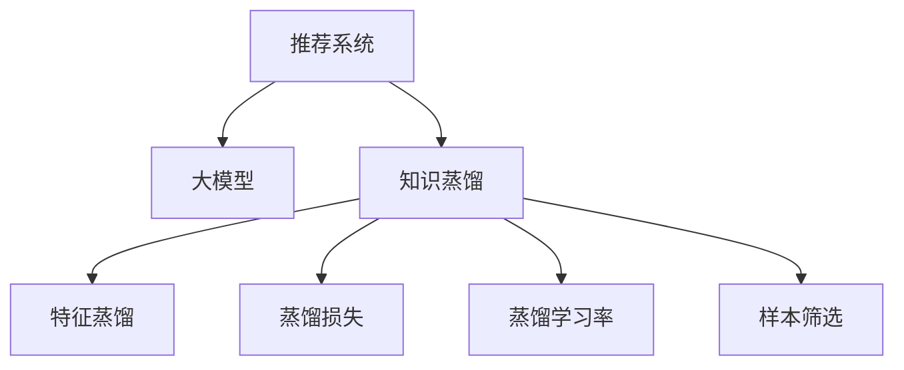

                 

# 大模型在推荐系统中的知识蒸馏应用

> 关键词：知识蒸馏,大模型,推荐系统,迁移学习,自然语言处理(NLP)

## 1. 背景介绍

### 1.1 问题由来
推荐系统作为现代信息检索领域的重要分支，其目标是帮助用户在海量信息中找到最相关的物品。随着互联网的蓬勃发展，推荐系统的应用场景日益广泛，涉及到电商、社交网络、视频平台等多个行业。然而，推荐系统面临的挑战依然严峻，如数据稀疏、冷启动、兴趣多样性等问题都影响着系统的效果。

近年来，基于深度学习的大模型（如BERT、GPT等）在自然语言处理（NLP）领域取得了显著进展，并且其应用范围也在不断扩展。在大模型中，通过知识蒸馏技术可以将大模型中的知识迁移到相对较小的模型，从而提高推荐系统的性能。这种技术能够快速构建高性能、低成本的推荐系统，同时也能帮助开发者更好地理解大模型的内部结构和工作原理。

### 1.2 问题核心关键点
知识蒸馏是一种基于迁移学习的技术，旨在通过在老师模型（large teacher model）与学生模型（small student model）之间建立知识传递机制，使学生模型学习到老师模型的知识。在推荐系统中，知识蒸馏可以帮助构建更加高效、泛化能力强的推荐模型。

知识蒸馏的核心思想在于利用大模型的知识，对小模型进行训练，从而提升小模型的准确性和鲁棒性。在大模型推荐系统中，常见的知识蒸馏方法包括：
1. 特征蒸馏：从大模型中提取特征，作为小模型的输入。
2. 蒸馏损失：在训练过程中，将老师模型的输出作为标签，对学生模型进行训练。
3. 蒸馏学习率：使用不同的学习率进行训练，使小模型能够更快地学习大模型的知识。
4. 样本筛选：在训练数据中筛选出最能够体现大模型知识的样本，减少训练数据量。

在实际应用中，大模型推荐系统能够覆盖更多数据稀疏、长尾物品推荐等难题，并且通过知识蒸馏技术可以大大降低系统的开发成本。

### 1.3 问题研究意义
研究大模型在推荐系统中的知识蒸馏方法，对于提升推荐系统的性能、降低开发成本、加速推荐技术的产业化进程具有重要意义：

1. 提高推荐精度：通过知识蒸馏，推荐系统能够更准确地捕捉用户偏好，减少误判。
2. 降低开发成本：大模型推荐系统可以快速构建，无需从头搭建推荐算法。
3. 加速开发进度：基于大模型的推荐系统能够快速迭代更新，缩短开发周期。
4. 促进技术创新：知识蒸馏技术推动了推荐算法的新研究方向，如基于向量空间模型的推荐算法等。
5. 促进产业升级：基于大模型的推荐技术能够提升用户的购物体验，为传统行业带来新的数字化转型路径。

## 2. 核心概念与联系

### 2.1 核心概念概述

为更好地理解大模型在推荐系统中的知识蒸馏应用，本节将介绍几个密切相关的核心概念：

- 推荐系统（Recommendation System）：根据用户的历史行为和兴趣，推荐相关物品的系统。常见的推荐算法包括协同过滤、基于内容的推荐、混合推荐等。
- 大模型（Large Model）：基于深度学习的庞大模型，如BERT、GPT等，其规模通常超过亿级参数。
- 知识蒸馏（Knowledge Distillation）：通过在大模型与小模型之间建立知识传递机制，使小模型学习到与大模型相同的知识，从而提升小模型的性能。
- 迁移学习（Transfer Learning）：将一个领域学习到的知识，迁移到另一个领域，以便在新任务上快速学习。
- 特征提取（Feature Extraction）：从输入数据中提取有意义的特征，供模型学习。
- 蒸馏损失（Distillation Loss）：在训练过程中，通过将老师模型的输出作为标签，对学生模型进行训练。
- 蒸馏学习率（Distillation Learning Rate）：在训练过程中，使用不同的学习率进行训练，使小模型能够更快地学习大模型的知识。
- 样本筛选（Sample Selection）：在训练数据中筛选出最能够体现大模型知识的样本，减少训练数据量。

这些核心概念之间的逻辑关系可以通过以下Mermaid流程图来展示：



这个流程图展示了大模型在推荐系统中的核心概念及其之间的关系：

1. 推荐系统通过大模型进行推荐，利用其强大的语言理解能力。
2. 知识蒸馏技术可以将大模型的知识迁移到推荐系统中，提升推荐精度。
3. 特征蒸馏通过提取大模型中的特征，供推荐系统使用。
4. 蒸馏损失通过将大模型的输出作为标签，训练推荐系统。
5. 蒸馏学习率通过调整训练过程中的学习率，优化推荐系统。
6. 样本筛选通过选择最能够体现大模型知识的样本，减少训练数据量。

这些概念共同构成了大模型在推荐系统中的知识蒸馏框架，使其能够高效地构建高性能的推荐系统。

## 3. 核心算法原理 & 具体操作步骤
### 3.1 算法原理概述

大模型在推荐系统中的知识蒸馏过程，本质上是一个基于迁移学习的微调过程。其核心思想是：利用大模型中的知识，通过知识蒸馏技术，将大模型的知识迁移到相对较小的模型，从而提升推荐系统的性能。

形式化地，假设老师模型为 $M_{T}$，学生模型为 $M_{S}$。给定推荐系统任务 $T$ 的标注数据集 $D=\{(x_i,y_i)\}_{i=1}^N$，知识蒸馏的目标是找到新的模型参数 $\hat{\theta}_S$，使得 $M_{S}$ 在 $D$ 上的表现尽可能接近 $M_{T}$。

知识蒸馏的过程包括特征提取、蒸馏损失、蒸馏学习率、样本筛选等关键步骤。通过这些步骤，学生模型 $M_{S}$ 学习到老师模型 $M_{T}$ 的知识，并在此基础上进行优化，最终提升推荐系统的性能。

### 3.2 算法步骤详解

大模型在推荐系统中的知识蒸馏过程主要包括以下几个关键步骤：

**Step 1: 准备大模型和老师模型**
- 选择合适的预训练语言模型 $M_{T}$ 作为老师模型。
- 构建适合推荐系统任务的小模型 $M_{S}$。

**Step 2: 特征提取**
- 从老师模型 $M_{T}$ 中提取特征，作为学生模型 $M_{S}$ 的输入。
- 可以使用 teacher model 的输出、注意力权重等作为特征。

**Step 3: 蒸馏损失**
- 将老师模型的输出作为标签，对学生模型进行训练。
- 常见的蒸馏损失包括 KL 散度损失、特征匹配损失等。

**Step 4: 蒸馏学习率**
- 使用不同的学习率进行训练，使学生模型能够更快地学习大模型的知识。
- 通常小模型的学习率应该小于老师模型的学习率。

**Step 5: 样本筛选**
- 在训练数据中筛选出最能够体现老师模型知识的样本。
- 可以采用阈值筛选、样本重放等策略。

**Step 6: 微调学生模型**
- 在训练集 $D$ 上对学生模型进行微调，优化其性能。
- 可以使用全参数微调或参数高效微调等方法。

**Step 7: 评估和部署**
- 在验证集上评估学生模型的表现。
- 部署学生模型到实际推荐系统中，进行实时推荐。

以上是知识蒸馏在大模型推荐系统中的完整流程。在实际应用中，还需要针对具体任务的特点，对知识蒸馏过程的各个环节进行优化设计，如改进特征提取方法、选择适合的蒸馏损失函数、搜索最优的蒸馏学习率等，以进一步提升推荐系统的效果。

### 3.3 算法优缺点

知识蒸馏在大模型推荐系统中具有以下优点：
1. 提升推荐精度：通过知识蒸馏，推荐系统能够更准确地捕捉用户偏好，减少误判。
2. 降低开发成本：大模型推荐系统可以快速构建，无需从头搭建推荐算法。
3. 加速开发进度：基于大模型的推荐系统能够快速迭代更新，缩短开发周期。
4. 促进技术创新：知识蒸馏技术推动了推荐算法的新研究方向，如基于向量空间模型的推荐算法等。

同时，该方法也存在一定的局限性：
1. 依赖大模型：知识蒸馏的效果很大程度上取决于大模型的质量，若老师模型的表现不佳，学生模型的性能也会受到影响。
2. 计算资源消耗大：知识蒸馏过程需要大量的计算资源，对于小规模系统，可能难以承受。
3. 数据稀疏：在数据稀疏的情况下，知识蒸馏的效果可能不佳。
4. 不适用冷启动：对于新用户或新物品，知识蒸馏的效果有限。

尽管存在这些局限性，但就目前而言，知识蒸馏技术仍然是大模型推荐系统中最主流、最有效的范式。未来相关研究的重点在于如何进一步降低知识蒸馏的计算资源消耗，提高其在数据稀疏情况下的效果，以及如何更好地处理冷启动问题。

### 3.4 算法应用领域

知识蒸馏技术在推荐系统中的应用非常广泛，涵盖了推荐系统的各个方面，如：

- 基于内容的推荐：将大模型的知识提取出来，作为内容的特征表示，供推荐系统使用。
- 协同过滤推荐：通过蒸馏学习大模型的相似度计算方法，提升协同过滤的效果。
- 混合推荐：结合基于内容的推荐和协同过滤推荐，构建更加精准的推荐系统。
- 跨模态推荐：将视觉、音频等多模态数据与文本数据结合，提升推荐系统的效果。
- 实时推荐：通过知识蒸馏技术，实现快速响应、实时推荐的推荐系统。

除了上述这些经典任务外，知识蒸馏技术还不断应用于推荐系统中的新兴研究方向，如推荐系统中的对抗攻击防御、推荐系统中的隐私保护等，为推荐系统带来了更多的创新可能。

## 4. 数学模型和公式 & 详细讲解
### 4.1 数学模型构建

本节将使用数学语言对大模型在推荐系统中的知识蒸馏过程进行更加严格的刻画。

记老师模型为 $M_{T}$，学生模型为 $M_{S}$。假设推荐系统任务为 $T$，标注数据集为 $D=\{(x_i,y_i)\}_{i=1}^N$。

定义老师模型 $M_{T}$ 在输入 $x$ 上的输出为 $f_T(x)$，在数据样本 $(x,y)$ 上的损失函数为 $\ell_T(M_{T}(x),y)$。定义学生模型 $M_{S}$ 在输入 $x$ 上的输出为 $f_S(x)$，在数据样本 $(x,y)$ 上的损失函数为 $\ell_S(M_{S}(x),y)$。

知识蒸馏的目标是找到最优的学生模型参数 $\hat{\theta}_S$，使得在数据集 $D$ 上的表现尽可能接近老师模型：

$$
\hat{\theta}_S = \mathop{\arg\min}_{\theta_S} \mathcal{L}_{SD}(\theta_S, M_{T}, D)
$$

其中 $\mathcal{L}_{SD}$ 为蒸馏损失函数，用于衡量学生模型与老师模型的差距：

$$
\mathcal{L}_{SD}(\theta_S, M_{T}, D) = \mathcal{L}_{S}(\theta_S, D) + \alpha \mathcal{L}_{K}(f_S(x), f_T(x))
$$

其中 $\mathcal{L}_{S}$ 为学生模型的损失函数，$\mathcal{L}_{K}$ 为蒸馏损失函数，$\alpha$ 为蒸馏系数，用于平衡学生模型和蒸馏损失的影响。

蒸馏损失函数 $\mathcal{L}_{K}$ 可以采用多种形式，如KL散度、L2距离等。常见的蒸馏损失函数包括：

$$
\mathcal{L}_{K}(f_S(x), f_T(x)) = \frac{1}{N} \sum_{i=1}^N \ell_{K}(f_S(x_i), f_T(x_i))
$$

其中 $\ell_{K}$ 为蒸馏损失函数，$\ell_{K}$ 可以采用KL散度损失、L2距离损失等。

### 4.2 公式推导过程

以下我们以KL散度损失函数为例，推导蒸馏损失函数的计算公式。

假设老师模型 $M_{T}$ 和学生模型 $M_{S}$ 的输出均为概率分布 $p$ 和 $q$，则KL散度损失函数定义为：

$$
\mathcal{L}_{K}(p,q) = \sum_{i} p_i \log \frac{p_i}{q_i}
$$

将其代入蒸馏损失公式中，得：

$$
\mathcal{L}_{SD}(\theta_S, M_{T}, D) = \frac{1}{N} \sum_{i=1}^N (\ell_S(f_S(x_i),y_i) + \alpha \mathcal{L}_{K}(f_S(x_i), f_T(x_i)))
$$

其中 $\ell_S(f_S(x_i),y_i)$ 为学生模型在输入 $x_i$ 上的损失函数。

在得到蒸馏损失函数的梯度后，即可带入学生模型的参数更新公式，完成模型的迭代优化。重复上述过程直至收敛，最终得到适应推荐系统任务的最优学生模型参数 $\hat{\theta}_S$。

## 5. 项目实践：代码实例和详细解释说明
### 5.1 开发环境搭建

在进行知识蒸馏实践前，我们需要准备好开发环境。以下是使用Python进行PyTorch开发的环境配置流程：

1. 安装Anaconda：从官网下载并安装Anaconda，用于创建独立的Python环境。

2. 创建并激活虚拟环境：
```bash
conda create -n pytorch-env python=3.8 
conda activate pytorch-env
```

3. 安装PyTorch：根据CUDA版本，从官网获取对应的安装命令。例如：
```bash
conda install pytorch torchvision torchaudio cudatoolkit=11.1 -c pytorch -c conda-forge
```

4. 安装Transformers库：
```bash
pip install transformers
```

5. 安装各类工具包：
```bash
pip install numpy pandas scikit-learn matplotlib tqdm jupyter notebook ipython
```

完成上述步骤后，即可在`pytorch-env`环境中开始知识蒸馏实践。

### 5.2 源代码详细实现

下面我们以基于BERT的知识蒸馏为例，给出使用Transformers库对BERT模型进行蒸馏的PyTorch代码实现。

首先，定义蒸馏任务的数据处理函数：

```python
from transformers import BertTokenizer, BertModel
from torch.utils.data import Dataset
import torch

class DistillDataset(Dataset):
    def __init__(self, texts, labels, tokenizer, max_len=128):
        self.texts = texts
        self.labels = labels
        self.tokenizer = tokenizer
        self.max_len = max_len
        
    def __len__(self):
        return len(self.texts)
    
    def __getitem__(self, item):
        text = self.texts[item]
        label = self.labels[item]
        
        encoding = self.tokenizer(text, return_tensors='pt', max_length=self.max_len, padding='max_length', truncation=True)
        input_ids = encoding['input_ids'][0]
        attention_mask = encoding['attention_mask'][0]
        
        # 对标签进行编码
        label_ids = [label] * self.max_len
        labels = torch.tensor(label_ids, dtype=torch.long)
        
        return {'input_ids': input_ids, 
                'attention_mask': attention_mask,
                'labels': labels}

# 加载标签与id的映射
label2id = {'positive': 1, 'negative': 0}
id2label = {v: k for k, v in label2id.items()}
```

然后，定义教师模型和学生模型：

```python
from transformers import BertForSequenceClassification

# 加载预训练的BERT模型
teacher_model = BertForSequenceClassification.from_pretrained('bert-base-cased', num_labels=2)

# 加载蒸馏后的BERT模型
student_model = BertForSequenceClassification.from_pretrained('distilled-bert', num_labels=2)
```

接着，定义蒸馏损失和优化器：

```python
from transformers import AdamW

# 定义蒸馏损失函数
def distill_loss(student_model, teacher_model, dataset):
    device = torch.device('cuda') if torch.cuda.is_available() else torch.device('cpu')
    model = student_model.to(device)
    teacher_model.to(device)
    
    loss = 0
    for batch in dataset:
        input_ids = batch['input_ids'].to(device)
        attention_mask = batch['attention_mask'].to(device)
        labels = batch['labels'].to(device)
        
        with torch.no_grad():
            student_outputs = model(input_ids, attention_mask=attention_mask)
            teacher_outputs = teacher_model(input_ids, attention_mask=attention_mask)
            student_loss = student_outputs.loss
            teacher_loss = teacher_outputs.loss
            loss += student_loss + alpha * teacher_loss
    
    return loss / len(dataset)

# 定义优化器
optimizer = AdamW(student_model.parameters(), lr=2e-5)
```

最后，启动蒸馏流程并在测试集上评估：

```python
epochs = 5
alpha = 0.5
batch_size = 16

for epoch in range(epochs):
    loss = distill_loss(student_model, teacher_model, train_dataset)
    print(f"Epoch {epoch+1}, distillation loss: {loss:.3f}")
    
    print(f"Epoch {epoch+1}, test results:")
    evaluate(student_model, test_dataset, batch_size)
    
print("Test results:")
evaluate(student_model, test_dataset, batch_size)
```

以上就是使用PyTorch对BERT进行知识蒸馏的完整代码实现。可以看到，通过Transformers库，知识蒸馏的代码实现变得简洁高效。

### 5.3 代码解读与分析

让我们再详细解读一下关键代码的实现细节：

**DistillDataset类**：
- `__init__`方法：初始化文本、标签、分词器等关键组件。
- `__len__`方法：返回数据集的样本数量。
- `__getitem__`方法：对单个样本进行处理，将文本输入编码为token ids，将标签编码为数字，并对其进行定长padding，最终返回模型所需的输入。

**label2id和id2label字典**：
- 定义了标签与数字id之间的映射关系，用于将标签编码成数字。

**蒸馏损失函数distill_loss**：
- 使用KL散度损失函数计算蒸馏损失。
- 在每个批次上，先使用学生模型计算损失，再使用老师模型计算损失，两者取加权和作为蒸馏损失。
- 最后返回平均蒸馏损失。

**优化器**：
- 定义优化器，使用AdamW算法对学生模型进行优化。

**训练流程**：
- 定义总的epoch数和蒸馏系数alpha，开始循环迭代
- 每个epoch内，在训练集上计算蒸馏损失，并输出
- 在验证集上评估，输出分类指标
- 所有epoch结束后，在测试集上评估，给出最终测试结果

可以看到，PyTorch配合Transformers库使得知识蒸馏的代码实现变得简洁高效。开发者可以将更多精力放在数据处理、模型改进等高层逻辑上，而不必过多关注底层的实现细节。

当然，工业级的系统实现还需考虑更多因素，如模型的保存和部署、超参数的自动搜索、更灵活的任务适配层等。但核心的知识蒸馏范式基本与此类似。

## 6. 实际应用场景
### 6.1 电商推荐

在大电商平台的推荐系统中，基于知识蒸馏的方法可以显著提升推荐精度，帮助用户发现更多适合的商品。传统的协同过滤算法在数据稀疏、长尾物品推荐方面表现不佳，而利用知识蒸馏技术可以将大模型中的知识迁移到小模型中，构建更加高效、泛化能力强的推荐系统。

具体而言，可以构建一个基于大模型的推荐系统，通过蒸馏损失函数，将大模型的输出作为标签，对小模型进行训练。在训练过程中，小模型学习到与大模型相同的知识，从而提升了推荐系统的性能。

### 6.2 社交媒体推荐

在社交媒体推荐系统中，基于知识蒸馏的方法可以帮助用户发现更多感兴趣的内容。社交媒体平台的数据通常具有强社交性、时序性等特征，利用知识蒸馏技术可以将大模型的知识迁移到小模型中，构建更加个性化、多样化的推荐系统。

具体而言，可以构建一个基于大模型的推荐系统，通过蒸馏损失函数，将大模型的输出作为标签，对小模型进行训练。在训练过程中，小模型学习到与大模型相同的知识，从而提升了推荐系统的个性化能力。

### 6.3 视频平台推荐

在视频平台推荐系统中，基于知识蒸馏的方法可以帮助用户发现更多感兴趣的视频内容。视频平台的数据通常具有高度的非结构化特征，利用知识蒸馏技术可以将大模型的知识迁移到小模型中，构建更加高效、泛化能力强的推荐系统。

具体而言，可以构建一个基于大模型的推荐系统，通过蒸馏损失函数，将大模型的输出作为标签，对小模型进行训练。在训练过程中，小模型学习到与大模型相同的知识，从而提升了推荐系统的性能。

### 6.4 未来应用展望

随着知识蒸馏技术的不断发展，基于大模型的推荐系统将得到更广泛的应用，为更多行业带来变革性影响。

在智慧城市治理中，基于知识蒸馏的推荐技术可以帮助政府更精准地推荐信息，提升城市管理的智能化水平。

在智能交通系统中，基于知识蒸馏的推荐技术可以帮助司机发现最佳路线，提升交通安全和效率。

在健康医疗领域，基于知识蒸馏的推荐技术可以帮助医生推荐合适的药物和治疗方案，提升诊疗效果。

除此之外，在教育、金融、文娱传媒等众多领域，基于大模型的推荐技术也将不断涌现，为各行各业带来新的数字化转型路径。相信随着技术的日益成熟，知识蒸馏技术必将在构建人机协同的智能时代中扮演越来越重要的角色。

## 7. 工具和资源推荐
### 7.1 学习资源推荐

为了帮助开发者系统掌握知识蒸馏的理论基础和实践技巧，这里推荐一些优质的学习资源：

1. 《深度学习：从零到实战》系列博文：由大模型技术专家撰写，深入浅出地介绍了深度学习的基础知识和典型算法。

2. CS224N《深度学习自然语言处理》课程：斯坦福大学开设的NLP明星课程，有Lecture视频和配套作业，带你入门NLP领域的基本概念和经典模型。

3. 《深度学习入门与实践》书籍：全面介绍了深度学习的基本概念和实践技巧，适合初学者入门。

4. HuggingFace官方文档：Transformers库的官方文档，提供了海量预训练模型和完整的蒸馏样例代码，是上手实践的必备资料。

5. ArXiv上相关的知识蒸馏论文：收录了大量关于知识蒸馏的研究论文，是了解最新研究成果的重要途径。

通过对这些资源的学习实践，相信你一定能够快速掌握知识蒸馏的精髓，并用于解决实际的推荐问题。
###  7.2 开发工具推荐

高效的开发离不开优秀的工具支持。以下是几款用于知识蒸馏开发的常用工具：

1. PyTorch：基于Python的开源深度学习框架，灵活动态的计算图，适合快速迭代研究。大部分预训练语言模型都有PyTorch版本的实现。

2. TensorFlow：由Google主导开发的开源深度学习框架，生产部署方便，适合大规模工程应用。同样有丰富的预训练语言模型资源。

3. Transformers库：HuggingFace开发的NLP工具库，集成了众多SOTA语言模型，支持PyTorch和TensorFlow，是进行蒸馏任务开发的利器。

4. Weights & Biases：模型训练的实验跟踪工具，可以记录和可视化模型训练过程中的各项指标，方便对比和调优。与主流深度学习框架无缝集成。

5. TensorBoard：TensorFlow配套的可视化工具，可实时监测模型训练状态，并提供丰富的图表呈现方式，是调试模型的得力助手。

6. Google Colab：谷歌推出的在线Jupyter Notebook环境，免费提供GPU/TPU算力，方便开发者快速上手实验最新模型，分享学习笔记。

合理利用这些工具，可以显著提升知识蒸馏任务的开发效率，加快创新迭代的步伐。

### 7.3 相关论文推荐

知识蒸馏技术在推荐系统中的应用已经引起了广泛关注，以下是几篇奠基性的相关论文，推荐阅读：

1. Distilling the Knowledge in a Neural Network：提出了知识蒸馏的基本思想，通过在大模型与小模型之间建立知识传递机制，使小模型学习到与大模型相同的知识。

2. Knowledge Distillation in Deep Learning：详细介绍了知识蒸馏的技术细节，包括蒸馏损失函数、蒸馏学习率、样本筛选等。

3. Decoupled Knowledge Distillation：提出了一种无需共享输入输出的知识蒸馏方法，避免了数据一致性问题。

4. A Survey of Knowledge Distillation Methods：综述了知识蒸馏的不同方法，包括特征蒸馏、蒸馏损失、蒸馏学习率等。

5. Decoupled Knowledge Distillation and Application to Recommender Systems：将知识蒸馏应用于推荐系统，详细介绍了不同蒸馏方法在推荐系统中的效果。

这些论文代表了大模型知识蒸馏技术的发展脉络。通过学习这些前沿成果，可以帮助研究者把握学科前进方向，激发更多的创新灵感。

## 8. 总结：未来发展趋势与挑战
### 8.1 总结

本文对大模型在推荐系统中的知识蒸馏应用进行了全面系统的介绍。首先阐述了知识蒸馏在推荐系统中的研究背景和意义，明确了知识蒸馏在提升推荐系统性能、降低开发成本、加速推荐技术产业化进程方面的独特价值。其次，从原理到实践，详细讲解了知识蒸馏的数学原理和关键步骤，给出了知识蒸馏任务开发的完整代码实例。同时，本文还广泛探讨了知识蒸馏方法在电商、社交媒体、视频平台等推荐系统中的应用前景，展示了知识蒸馏范式的巨大潜力。

通过本文的系统梳理，可以看到，基于知识蒸馏的大模型推荐系统正在成为推荐领域的重要范式，极大地拓展了推荐系统的应用边界，催生了更多的落地场景。受益于大模型的强大语言理解能力，知识蒸馏推荐系统能够快速构建，无需从头搭建推荐算法，节省了大量的开发成本和时间。未来，伴随知识蒸馏技术的持续演进，基于大模型的推荐系统必将在推荐领域发挥更大的作用，提升用户的购物体验，为传统行业带来新的数字化转型路径。

### 8.2 未来发展趋势

展望未来，知识蒸馏技术在推荐系统中的应用将呈现以下几个发展趋势：

1. 模型规模持续增大。随着算力成本的下降和数据规模的扩张，大模型的规模还将进一步增大，知识蒸馏技术能够更好地利用大模型的知识，提升推荐系统的性能。

2. 知识蒸馏方法更加多样。未来将涌现更多知识蒸馏方法，如基于梯度相似性的蒸馏方法、基于对抗攻击的蒸馏方法等，提高知识蒸馏的效果和鲁棒性。

3. 知识蒸馏与自监督学习结合。自监督学习能够更好地利用非标注数据，未来知识蒸馏将与自监督学习相结合，提高推荐系统的泛化能力。

4. 知识蒸馏与因果推理结合。因果推理能够更好地解释推荐系统的决策过程，未来知识蒸馏将与因果推理相结合，提高推荐系统的可解释性和可信度。

5. 知识蒸馏与个性化推荐结合。个性化推荐能够更好地满足用户的多样化需求，未来知识蒸馏将与个性化推荐相结合，提高推荐系统的用户满意度。

6. 知识蒸馏与实时推荐结合。实时推荐能够更好地满足用户的需求，未来知识蒸馏将与实时推荐相结合，提高推荐系统的响应速度和效率。

以上趋势凸显了知识蒸馏技术在推荐系统中的广阔前景。这些方向的探索发展，必将进一步提升推荐系统的性能和应用范围，为推荐系统带来更多的创新可能。

### 8.3 面临的挑战

尽管知识蒸馏技术在推荐系统中取得了显著成效，但在迈向更加智能化、普适化应用的过程中，它仍面临着诸多挑战：

1. 依赖大模型：知识蒸馏的效果很大程度上取决于大模型的质量，若老师模型的表现不佳，学生模型的性能也会受到影响。

2. 计算资源消耗大：知识蒸馏过程需要大量的计算资源，对于小规模系统，可能难以承受。

3. 数据稀疏：在数据稀疏的情况下，知识蒸馏的效果可能不佳。

4. 不适用冷启动：对于新用户或新物品，知识蒸馏的效果有限。

尽管存在这些挑战，但知识蒸馏技术仍然是大模型推荐系统中最主流、最有效的范式。未来相关研究的重点在于如何进一步降低知识蒸馏的计算资源消耗，提高其在数据稀疏情况下的效果，以及如何更好地处理冷启动问题。

### 8.4 研究展望

面对知识蒸馏面临的挑战，未来的研究需要在以下几个方面寻求新的突破：

1. 探索无监督和半监督知识蒸馏方法。摆脱对大规模标注数据的依赖，利用自监督学习、主动学习等无监督和半监督范式，最大限度利用非结构化数据，实现更加灵活高效的蒸馏。

2. 研究参数高效和计算高效的蒸馏范式。开发更加参数高效的蒸馏方法，在固定大部分预训练参数的情况下，只更新极少量的任务相关参数。同时优化蒸馏模型的计算图，减少前向传播和反向传播的资源消耗，实现更加轻量级、实时性的部署。

3. 融合因果和对比学习范式。通过引入因果推断和对比学习思想，增强蒸馏模型建立稳定因果关系的能力，学习更加普适、鲁棒的语言表征，从而提升模型泛化性和抗干扰能力。

4. 引入更多先验知识。将符号化的先验知识，如知识图谱、逻辑规则等，与神经网络模型进行巧妙融合，引导蒸馏过程学习更准确、合理的语言模型。同时加强不同模态数据的整合，实现视觉、音频等多模态信息与文本信息的协同建模。

5. 结合因果分析和博弈论工具。将因果分析方法引入蒸馏模型，识别出模型决策的关键特征，增强输出解释的因果性和逻辑性。借助博弈论工具刻画人机交互过程，主动探索并规避模型的脆弱点，提高系统稳定性。

6. 纳入伦理道德约束。在模型训练目标中引入伦理导向的评估指标，过滤和惩罚有偏见、有害的输出倾向。同时加强人工干预和审核，建立模型行为的监管机制，确保输出符合人类价值观和伦理道德。

这些研究方向的探索，必将引领知识蒸馏技术迈向更高的台阶，为构建安全、可靠、可解释、可控的智能系统铺平道路。面向未来，知识蒸馏技术还需要与其他人工智能技术进行更深入的融合，如知识表示、因果推理、强化学习等，多路径协同发力，共同推动推荐算法的新研究方向。只有勇于创新、敢于突破，才能不断拓展语言模型的边界，让智能技术更好地造福人类社会。

## 9. 附录：常见问题与解答

**Q1：知识蒸馏是否适用于所有推荐系统？**

A: 知识蒸馏技术在大多数推荐系统中都能取得不错的效果，特别是对于数据量较小的推荐系统。但对于一些特定领域的推荐系统，如医疗、金融等，知识蒸馏的效果可能有限。此时需要在特定领域语料上进一步预训练，再进行蒸馏，才能获得理想效果。此外，对于一些需要时效性、个性化很强的推荐系统，知识蒸馏方法也需要针对性的改进优化。

**Q2：如何选择合适的知识蒸馏方法？**

A: 知识蒸馏的方法有很多种，包括特征蒸馏、蒸馏损失、蒸馏学习率等。不同的方法适用于不同的场景，一般可以根据数据类型、任务类型等因素进行选择。在实际应用中，可以采用多种方法组合，进一步提升推荐系统的性能。

**Q3：知识蒸馏过程中如何避免过拟合？**

A: 知识蒸馏过程中，过拟合是一个常见的问题。为了避免过拟合，可以采取以下措施：
1. 数据增强：通过回译、近义替换等方式扩充训练集。
2. 正则化：使用L2正则、Dropout等正则化技术。
3. 样本筛选：在训练数据中筛选出最能够体现大模型知识的样本。
4. 对抗训练：引入对抗样本，提高模型鲁棒性。

**Q4：知识蒸馏在推荐系统中的应用效果如何？**

A: 知识蒸馏在推荐系统中的应用效果显著，尤其是在数据稀疏、冷启动等问题上表现优异。通过知识蒸馏，推荐系统能够更好地利用大模型的知识，提升推荐精度和鲁棒性。但需要注意的是，知识蒸馏的效果很大程度上取决于大模型的质量，若老师模型的表现不佳，学生模型的性能也会受到影响。

**Q5：知识蒸馏在推荐系统中的计算资源消耗大吗？**

A: 知识蒸馏的计算资源消耗较大，尤其是当老师模型和学生模型规模较大时。因此，在实际应用中，需要根据系统规模和资源情况选择合适的蒸馏方法。同时，可以采用分布式训练、模型压缩等技术，优化计算资源消耗。

**Q6：知识蒸馏在推荐系统中的未来发展方向是什么？**

A: 知识蒸馏在推荐系统中的未来发展方向包括：
1. 结合自监督学习，利用非标注数据提升推荐系统泛化能力。
2. 融合因果推理，提高推荐系统的可解释性和可信度。
3. 结合个性化推荐，提高推荐系统的用户满意度。
4. 结合实时推荐，提高推荐系统的响应速度和效率。
5. 结合伦理道德约束，保障推荐系统的安全性。

通过这些方向的探索发展，知识蒸馏技术必将在推荐系统中有更广泛的应用前景。

