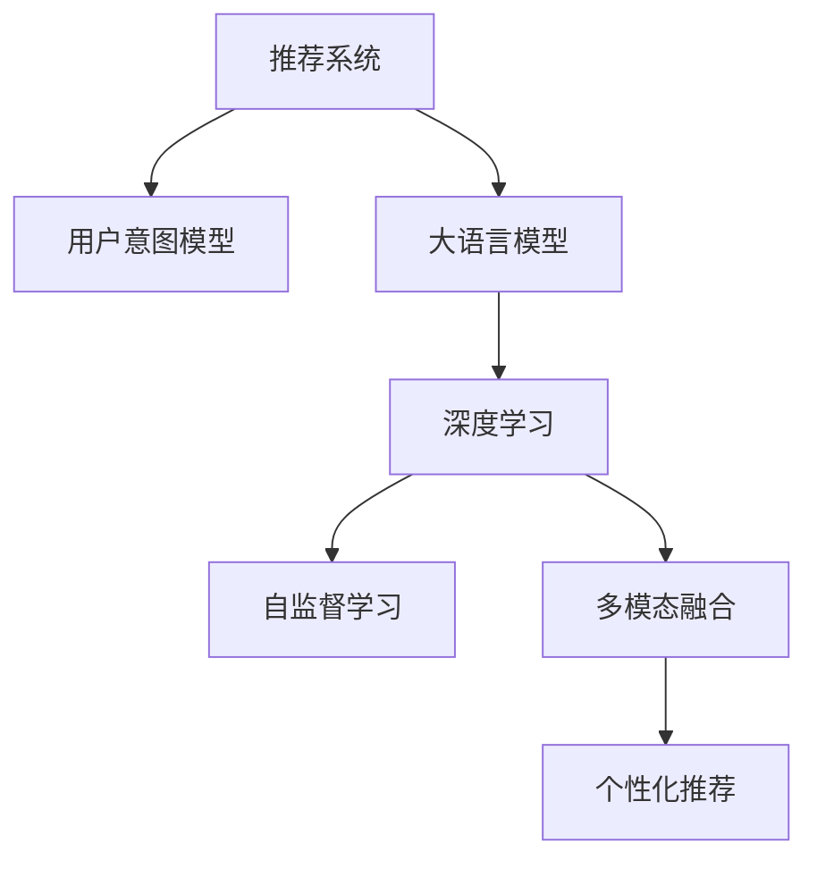

                 

# 大模型在推荐系统用户意图理解中的作用

> 关键词：推荐系统, 用户意图理解, 大语言模型, 深度学习, 数据驱动, 自监督学习, 多模态融合, 个性化推荐

## 1. 背景介绍

### 1.1 问题由来
随着互联网的迅猛发展和电子商务的普及，个性化推荐系统成为各大电商和在线服务平台的核心竞争力之一。推荐系统通过分析用户的历史行为数据和实时反馈信息，为用户推荐最符合其兴趣和需求的商品或内容。然而，传统的基于协同过滤和矩阵分解的推荐方法在处理长尾和稀疏数据时，往往存在准确性不高、推荐效果不稳定等问题。近年来，基于深度学习的推荐系统因其对复杂模式的良好建模能力而广受关注，其中大模型因其强大的表征能力，成为提升推荐系统性能的重要手段。

### 1.2 问题核心关键点
大模型在推荐系统中的应用，核心在于如何利用其强大的语言理解和表示能力，实现用户意图的精准理解和推荐内容的智能匹配。具体关键点包括：
- 用户意图的理解：如何通过大模型准确捕捉用户的历史行为、兴趣偏好和即时反馈，构建完整、动态的用户意图模型。
- 推荐内容的生成：如何基于用户意图生成个性化、多样化、可解释性强的推荐内容。
- 多模态融合：如何将文本、图像、音频等多源数据进行有效融合，构建多模态推荐系统。

### 1.3 问题研究意义
大模型在推荐系统中的应用，不仅能显著提升推荐系统的准确性和用户体验，还能有效应对电商领域的复杂性和动态变化。具体意义体现在：
1. 降低推荐成本：大模型通过自动化的特征学习，减少了人工特征工程的工作量，降低了推荐系统的开发和维护成本。
2. 提高推荐效果：大模型能够处理复杂模式，捕捉用户的深度隐含需求，从而实现更加个性化、精准的推荐。
3. 增强用户粘性：基于大模型的推荐系统，能够动态调整推荐策略，提升用户的满意度和忠诚度。
4. 拓展推荐领域：大模型的多模态融合能力，使得推荐系统能够拓展到更多场景，如视频、音乐、游戏等，实现跨领域的精准推荐。

## 2. 核心概念与联系

### 2.1 核心概念概述

为更好地理解大模型在推荐系统中的作用，本节将介绍几个密切相关的核心概念：

- **推荐系统(Recommendation System)**：通过算法为用户推荐符合其兴趣和需求的商品或内容，包括协同过滤、矩阵分解、内容推荐、深度学习等多种方法。
- **用户意图模型(User Intent Model)**：表示用户对推荐内容的期望和偏好，通常包含历史行为、即时反馈、上下文信息等。
- **大语言模型(Large Language Model, LLM)**：以自回归(如GPT)或自编码(如BERT)模型为代表的、通过大规模无标签文本数据预训练得到的语言模型，具备强大的语言表示能力。
- **深度学习(Deep Learning)**：通过多层神经网络构建复杂模型，实现对数据的深度学习和特征提取。
- **自监督学习(Self-supervised Learning)**：利用大量无标签数据进行模型训练，自动学习数据的内在结构和规律，提升模型的泛化能力。
- **多模态融合(Multimodal Fusion)**：将不同模态的数据（如文本、图像、音频等）进行融合，构建综合性的推荐模型。
- **个性化推荐(Personalized Recommendation)**：针对用户特定需求，生成符合其兴趣偏好的个性化推荐内容。

这些核心概念之间的逻辑关系可以通过以下Mermaid流程图来展示：



这个流程图展示了大语言模型在推荐系统中的核心作用：

1. 推荐系统通过用户意图模型了解用户需求，将其转化为推荐目标。
2. 大语言模型利用深度学习和自监督学习，从大规模文本数据中学习语言表示，构建强大的语义理解能力。
3. 多模态融合技术结合文本、图像、音频等多种数据源，构建更为全面、准确的用户画像。
4. 个性化推荐算法根据用户画像，生成符合其兴趣偏好的推荐内容。

## 3. 核心算法原理 & 具体操作步骤
### 3.1 算法原理概述

大语言模型在推荐系统中的应用，主要涉及以下几个核心算法原理：

- **自监督学习(SSL)**：通过在大规模无标签文本数据上训练语言模型，自动学习语言的内在结构和规律，提升模型的泛化能力。自监督学习通常包含掩码语言模型、相对位置预测、next word prediction等任务。
- **深度学习(DL)**：构建多层神经网络，通过反向传播算法不断优化模型参数，实现对数据的深度学习和特征提取。深度学习包括卷积神经网络(CNN)、循环神经网络(RNN)、Transformer等。
- **多模态融合(MMF)**：将不同模态的数据进行有效融合，构建综合性的推荐模型。多模态融合技术包括特征对齐、数据融合、跨模态学习等。
- **个性化推荐(PR)**：针对用户特定需求，生成符合其兴趣偏好的个性化推荐内容。个性化推荐算法包括协同过滤、基于内容的推荐、深度推荐等。

### 3.2 算法步骤详解

大模型在推荐系统中的应用，主要包括以下几个关键步骤：

**Step 1: 数据准备与预处理**
- 收集用户的历史行为数据和即时反馈数据，如浏览记录、购买历史、评分反馈等。
- 清洗和预处理数据，去除噪音和异常值，进行数据增强和归一化处理。
- 将不同模态的数据（如文本、图像、音频等）转换为统一的格式，便于后续处理和融合。

**Step 2: 大语言模型预训练**
- 使用大规模无标签文本数据（如Common Crawl、维基百科、新闻等）对大语言模型进行预训练，学习语言的通用表示。
- 应用自监督学习任务，如掩码语言模型、相对位置预测等，训练模型学习语言的上下文关系。
- 调整模型超参数，如学习率、批大小、迭代轮数等，优化模型的训练效果。

**Step 3: 用户意图模型构建**
- 根据用户的历史行为数据，构建用户意图模型。模型可以包含时间、地点、物品类别等多个维度。
- 使用大语言模型对用户意图进行编码，提取关键特征，形成用户意图的向量表示。
- 根据用户意图的向量表示，预测用户的推荐兴趣，生成推荐内容。

**Step 4: 推荐内容生成**
- 结合用户意图模型和大语言模型，生成符合用户兴趣偏好的推荐内容。推荐内容可以是商品、文章、视频等多种形式。
- 使用多模态融合技术，将文本、图像、音频等多源数据进行有效融合，提升推荐内容的丰富性和多样性。
- 应用深度推荐算法，如协同过滤、基于内容的推荐、深度推荐等，优化推荐效果。

**Step 5: 结果评估与优化**
- 在测试集上评估推荐系统的性能指标，如准确率、召回率、F1-score等。
- 根据评估结果，不断调整模型参数、优化算法策略，提升推荐效果。
- 引入用户反馈机制，收集用户的评价和反馈，进一步优化推荐内容。

### 3.3 算法优缺点

大语言模型在推荐系统中的应用，具有以下优点：
1. 强大的语言表示能力：大语言模型能够从文本数据中学习丰富的语义信息，提升用户意图的理解和推荐内容的生成。
2. 泛化能力强：通过自监督学习任务，大语言模型能够学习语言的通用规律，提升模型的泛化能力和鲁棒性。
3. 多模态融合能力强：大语言模型能够处理多源数据，实现跨模态的推荐，提升推荐内容的丰富性和多样性。
4. 自动化特征学习：大语言模型能够自动提取特征，减少人工特征工程的工作量，提升推荐系统的开发效率。

同时，该方法也存在一定的局限性：
1. 依赖数据质量：大语言模型的性能很大程度上依赖于数据的质量和多样性，数据缺失或噪声较多的情况会影响模型的训练效果。
2. 计算资源消耗大：大语言模型的参数量较大，训练和推理过程中需要消耗大量计算资源，对硬件环境要求较高。
3. 可解释性不足：大语言模型的决策过程通常缺乏可解释性，难以对其推理逻辑进行分析和调试。
4. 数据隐私问题：大语言模型在训练和推理过程中，需要处理大量的用户数据，存在隐私泄露的风险。

尽管存在这些局限性，但就目前而言，大语言模型在推荐系统中的应用已经成为一种主流范式，广泛应用于电商、视频、音乐等多个领域，为推荐系统带来了新的突破。

### 3.4 算法应用领域

大语言模型在推荐系统中的应用，覆盖了电商、视频、音乐等多个领域，具体应用包括：

- **电商推荐系统**：通过用户的历史浏览记录、购买历史等数据，预测用户对商品的需求，生成个性化的推荐商品列表。
- **视频推荐系统**：根据用户的历史观看记录、评分反馈等数据，预测用户对视频内容的兴趣，生成个性化的推荐视频列表。
- **音乐推荐系统**：通过用户的历史听歌记录、评论反馈等数据，预测用户对音乐风格的偏好，生成个性化的推荐歌单。
- **新闻推荐系统**：根据用户的历史阅读记录、点赞评论等数据，预测用户对新闻内容的兴趣，生成个性化的推荐新闻列表。
- **游戏推荐系统**：通过用户的在线游戏记录、消费数据等，预测用户对游戏的兴趣，生成个性化的游戏推荐。

除了这些经典应用外，大语言模型还能够在教育、社交、金融等更多场景中得到应用，为推荐系统带来新的突破。随着预训练模型和推荐方法的不断进步，相信推荐系统必将在更广阔的应用领域大放异彩。

## 4. 数学模型和公式 & 详细讲解  
### 4.1 数学模型构建

本节将使用数学语言对大语言模型在推荐系统中的作用进行更加严格的刻画。

记用户的历史行为数据为 $X=\{x_i\}_{i=1}^N$，其中 $x_i$ 表示用户第 $i$ 次的行为记录。记用户意图的向量表示为 $H$，记推荐内容为 $Y$。

定义推荐系统的目标函数为：

$$
\min_{H,Y} \mathcal{L}(H,Y) = \frac{1}{N}\sum_{i=1}^N \ell(H,x_i,Y)
$$

其中 $\ell(H,x_i,Y)$ 为损失函数，用于衡量推荐内容的准确性和多样性。推荐系统的优化目标是找到最优的用户意图模型 $H$ 和推荐内容 $Y$。

### 4.2 公式推导过程

以下我们以协同过滤推荐系统为例，推导推荐系统的损失函数及其梯度的计算公式。

记用户历史行为数据为 $X=\{x_i\}_{i=1}^N$，其中 $x_i$ 表示用户第 $i$ 次的行为记录。记用户意图的向量表示为 $H$，记推荐内容为 $Y$。

协同过滤推荐系统通常使用用户-物品相似度矩阵 $W$ 进行推荐，矩阵 $W$ 的每个元素表示用户对物品的兴趣程度。协同过滤的目标是找到用户兴趣与物品相似度之间的映射关系，从而生成推荐内容。

设推荐内容的表示为 $Y=\{y_i\}_{i=1}^N$，则推荐系统的目标函数为：

$$
\min_{H,Y} \mathcal{L}(H,Y) = \frac{1}{N}\sum_{i=1}^N \ell(H,x_i,Y)
$$

其中 $\ell(H,x_i,Y)$ 为损失函数，用于衡量推荐内容的准确性和多样性。常用的损失函数包括交叉熵损失、均方误差损失等。

根据链式法则，损失函数对用户意图模型 $H$ 和推荐内容 $Y$ 的梯度分别为：

$$
\frac{\partial \mathcal{L}}{\partial H} = \frac{1}{N}\sum_{i=1}^N \frac{\partial \ell}{\partial H}
$$

$$
\frac{\partial \mathcal{L}}{\partial Y} = \frac{1}{N}\sum_{i=1}^N \frac{\partial \ell}{\partial Y}
$$

在得到损失函数的梯度后，即可带入优化算法进行模型训练，最小化损失函数。

### 4.3 案例分析与讲解

假设我们要构建一个基于大语言模型的电商推荐系统。首先，收集用户的历史浏览记录、购买历史等数据，构建用户意图模型 $H$。然后，将大语言模型应用于商品描述、用户评价等文本数据，学习商品的语义表示，生成推荐内容的向量表示 $Y$。

在训练过程中，我们定义交叉熵损失函数 $\ell(H,x_i,Y) = -\sum_{j=1}^M y_{ij}\log(Hx_i)_j$，其中 $M$ 为商品数量，$y_{ij}$ 表示用户对商品 $j$ 的评分，$Hx_i$ 表示用户 $i$ 对商品 $j$ 的兴趣预测。

根据上述定义，推荐系统的目标函数为：

$$
\min_{H,Y} \mathcal{L}(H,Y) = \frac{1}{N}\sum_{i=1}^N -\sum_{j=1}^M y_{ij}\log(Hx_i)_j
$$

在得到目标函数后，我们可以使用深度学习算法（如多层神经网络）进行优化。通过反向传播算法计算目标函数对用户意图模型 $H$ 和推荐内容 $Y$ 的梯度，并使用优化算法（如AdamW）更新模型参数，最小化目标函数。

训练完成后，我们将用户意图模型 $H$ 和推荐内容 $Y$ 应用于新用户的推荐过程中，生成个性化的推荐商品列表。

## 5. 项目实践：代码实例和详细解释说明
### 5.1 开发环境搭建

在进行大语言模型在推荐系统中的项目实践前，我们需要准备好开发环境。以下是使用Python进行PyTorch开发的环境配置流程：

1. 安装Anaconda：从官网下载并安装Anaconda，用于创建独立的Python环境。

2. 创建并激活虚拟环境：
```bash
conda create -n pytorch-env python=3.8 
conda activate pytorch-env
```

3. 安装PyTorch：根据CUDA版本，从官网获取对应的安装命令。例如：
```bash
conda install pytorch torchvision torchaudio cudatoolkit=11.1 -c pytorch -c conda-forge
```

4. 安装相关库：
```bash
pip install transformers sklearn pandas numpy matplotlib tqdm jupyter notebook ipython
```

完成上述步骤后，即可在`pytorch-env`环境中开始项目实践。

### 5.2 源代码详细实现

下面我们以电商推荐系统为例，给出使用Transformers库对BERT模型进行微调的PyTorch代码实现。

首先，定义数据处理函数：

```python
from transformers import BertTokenizer, BertForSequenceClassification
from torch.utils.data import Dataset, DataLoader
import torch
import numpy as np

class RecommendationDataset(Dataset):
    def __init__(self, texts, labels):
        self.texts = texts
        self.labels = labels
        self.tokenizer = BertTokenizer.from_pretrained('bert-base-cased')
        self.max_len = 128

    def __len__(self):
        return len(self.texts)

    def __getitem__(self, item):
        text = self.texts[item]
        label = self.labels[item]

        encoding = self.tokenizer(text, return_tensors='pt', max_length=self.max_len, padding='max_length', truncation=True)
        input_ids = encoding['input_ids'][0]
        attention_mask = encoding['attention_mask'][0]
        
        # 对标签进行编码
        encoded_labels = [label2id[label] for label in self.labels] 
        encoded_labels.extend([label2id['O']] * (self.max_len - len(encoded_labels)))
        labels = torch.tensor(encoded_labels, dtype=torch.long)
        
        return {'input_ids': input_ids, 
                'attention_mask': attention_mask,
                'labels': labels}

# 标签与id的映射
label2id = {'buy': 0, 'view': 1, 'add_to_cart': 2, 'not_interest': 3}
id2label = {v: k for k, v in label2id.items()}

# 创建dataset
tokenizer = BertTokenizer.from_pretrained('bert-base-cased')
train_dataset = RecommendationDataset(train_texts, train_labels)
dev_dataset = RecommendationDataset(dev_texts, dev_labels)
test_dataset = RecommendationDataset(test_texts, test_labels)
```

然后，定义模型和优化器：

```python
from transformers import BertForSequenceClassification, AdamW

model = BertForSequenceClassification.from_pretrained('bert-base-cased', num_labels=len(label2id))

optimizer = AdamW(model.parameters(), lr=2e-5)
```

接着，定义训练和评估函数：

```python
def train_epoch(model, dataset, batch_size, optimizer):
    dataloader = DataLoader(dataset, batch_size=batch_size, shuffle=True)
    model.train()
    epoch_loss = 0
    for batch in dataloader:
        input_ids = batch['input_ids'].to(device)
        attention_mask = batch['attention_mask'].to(device)
        labels = batch['labels'].to(device)
        model.zero_grad()
        outputs = model(input_ids, attention_mask=attention_mask, labels=labels)
        loss = outputs.loss
        epoch_loss += loss.item()
        loss.backward()
        optimizer.step()
    return epoch_loss / len(dataloader)

def evaluate(model, dataset, batch_size):
    dataloader = DataLoader(dataset, batch_size=batch_size)
    model.eval()
    preds, labels = [], []
    with torch.no_grad():
        for batch in dataloader:
            input_ids = batch['input_ids'].to(device)
            attention_mask = batch['attention_mask'].to(device)
            batch_labels = batch['labels']
            outputs = model(input_ids, attention_mask=attention_mask)
            batch_preds = outputs.logits.argmax(dim=2).to('cpu').tolist()
            batch_labels = batch_labels.to('cpu').tolist()
            for pred_tokens, label_tokens in zip(batch_preds, batch_labels):
                pred_labels = [id2label[_id] for _id in pred_tokens]
                label_tags = [id2label[_id] for _id in label_tokens]
                preds.append(pred_labels[:len(label_tags)])
                labels.append(label_tags)
                
    print(classification_report(labels, preds))
```

最后，启动训练流程并在测试集上评估：

```python
epochs = 5
batch_size = 16

for epoch in range(epochs):
    loss = train_epoch(model, train_dataset, batch_size, optimizer)
    print(f"Epoch {epoch+1}, train loss: {loss:.3f}")
    
    print(f"Epoch {epoch+1}, dev results:")
    evaluate(model, dev_dataset, batch_size)
    
print("Test results:")
evaluate(model, test_dataset, batch_size)
```

以上就是使用PyTorch对BERT进行电商推荐系统微调的完整代码实现。可以看到，得益于Transformers库的强大封装，我们可以用相对简洁的代码完成BERT模型的加载和微调。

### 5.3 代码解读与分析

让我们再详细解读一下关键代码的实现细节：

**RecommendationDataset类**：
- `__init__`方法：初始化文本、标签、分词器等关键组件。
- `__len__`方法：返回数据集的样本数量。
- `__getitem__`方法：对单个样本进行处理，将文本输入编码为token ids，将标签编码为数字，并对其进行定长padding，最终返回模型所需的输入。

**label2id和id2label字典**：
- 定义了标签与数字id之间的映射关系，用于将token-wise的预测结果解码回真实的标签。

**训练和评估函数**：
- 使用PyTorch的DataLoader对数据集进行批次化加载，供模型训练和推理使用。
- 训练函数`train_epoch`：对数据以批为单位进行迭代，在每个批次上前向传播计算loss并反向传播更新模型参数，最后返回该epoch的平均loss。
- 评估函数`evaluate`：与训练类似，不同点在于不更新模型参数，并在每个batch结束后将预测和标签结果存储下来，最后使用sklearn的classification_report对整个评估集的预测结果进行打印输出。

**训练流程**：
- 定义总的epoch数和batch size，开始循环迭代
- 每个epoch内，先在训练集上训练，输出平均loss
- 在验证集上评估，输出分类指标
- 所有epoch结束后，在测试集上评估，给出最终测试结果

可以看到，PyTorch配合Transformers库使得BERT微调的代码实现变得简洁高效。开发者可以将更多精力放在数据处理、模型改进等高层逻辑上，而不必过多关注底层的实现细节。

当然，工业级的系统实现还需考虑更多因素，如模型的保存和部署、超参数的自动搜索、更灵活的任务适配层等。但核心的微调范式基本与此类似。

## 6. 实际应用场景
### 6.1 电商推荐系统

电商推荐系统是应用大语言模型最为广泛的场景之一。电商推荐系统通过分析用户的历史行为数据和即时反馈信息，为用户推荐符合其兴趣和需求的商品。

在技术实现上，可以收集用户的历史浏览记录、购买历史等数据，将商品描述、用户评价等文本数据作为微调数据，训练大语言模型学习商品的语义表示，构建用户意图的向量表示。微调后的模型能够根据用户意图生成个性化推荐商品列表。

### 6.2 视频推荐系统

视频推荐系统通过分析用户的历史观看记录、评分反馈等数据，预测用户对视频内容的兴趣，生成个性化的推荐视频列表。大语言模型能够处理视频标题、描述等文本数据，学习视频的语义表示，提升推荐内容的精准度。

### 6.3 音乐推荐系统

音乐推荐系统通过分析用户的历史听歌记录、评论反馈等数据，预测用户对音乐风格的偏好，生成个性化的推荐歌单。大语言模型能够处理歌词、评论等文本数据，学习音乐的语义表示，提升推荐内容的丰富性和多样性。

### 6.4 新闻推荐系统

新闻推荐系统通过分析用户的历史阅读记录、点赞评论等数据，预测用户对新闻内容的兴趣，生成个性化的推荐新闻列表。大语言模型能够处理新闻标题、内容等文本数据，学习新闻的语义表示，提升推荐内容的准确性和相关性。

### 6.5 游戏推荐系统

游戏推荐系统通过分析用户的在线游戏记录、消费数据等，预测用户对游戏的兴趣，生成个性化的游戏推荐。大语言模型能够处理游戏界面截图、游戏评论等文本数据，学习游戏的语义表示，提升推荐内容的吸引力。

除了这些经典应用外，大语言模型还能够在教育、社交、金融等更多场景中得到应用，为推荐系统带来新的突破。随着预训练模型和推荐方法的不断进步，相信推荐系统必将在更广阔的应用领域大放异彩。

## 7. 工具和资源推荐
### 7.1 学习资源推荐

为了帮助开发者系统掌握大语言模型在推荐系统中的应用理论基础和实践技巧，这里推荐一些优质的学习资源：

1. 《Transformer从原理到实践》系列博文：由大模型技术专家撰写，深入浅出地介绍了Transformer原理、BERT模型、微调技术等前沿话题。

2. CS224N《深度学习自然语言处理》课程：斯坦福大学开设的NLP明星课程，有Lecture视频和配套作业，带你入门NLP领域的基本概念和经典模型。

3. 《Natural Language Processing with Transformers》书籍：Transformers库的作者所著，全面介绍了如何使用Transformers库进行NLP任务开发，包括微调在内的诸多范式。

4. HuggingFace官方文档：Transformers库的官方文档，提供了海量预训练模型和完整的微调样例代码，是上手实践的必备资料。

5. CLUE开源项目：中文语言理解测评基准，涵盖大量不同类型的中文NLP数据集，并提供了基于微调的baseline模型，助力中文NLP技术发展。

通过对这些资源的学习实践，相信你一定能够快速掌握大语言模型在推荐系统中的应用精髓，并用于解决实际的NLP问题。
###  7.2 开发工具推荐

高效的开发离不开优秀的工具支持。以下是几款用于大语言模型在推荐系统中的应用开发的常用工具：

1. PyTorch：基于Python的开源深度学习框架，灵活动态的计算图，适合快速迭代研究。大部分预训练语言模型都有PyTorch版本的实现。

2. TensorFlow：由Google主导开发的开源深度学习框架，生产部署方便，适合大规模工程应用。同样有丰富的预训练语言模型资源。

3. Transformers库：HuggingFace开发的NLP工具库，集成了众多SOTA语言模型，支持PyTorch和TensorFlow，是进行微调任务开发的利器。

4. Weights & Biases：模型训练的实验跟踪工具，可以记录和可视化模型训练过程中的各项指标，方便对比和调优。与主流深度学习框架无缝集成。

5. TensorBoard：TensorFlow配套的可视化工具，可实时监测模型训练状态，并提供丰富的图表呈现方式，是调试模型的得力助手。

6. Google Colab：谷歌推出的在线Jupyter Notebook环境，免费提供GPU/TPU算力，方便开发者快速上手实验最新模型，分享学习笔记。

合理利用这些工具，可以显著提升大语言模型在推荐系统中的应用开发效率，加快创新迭代的步伐。

### 7.3 相关论文推荐

大语言模型在推荐系统中的应用源于学界的持续研究。以下是几篇奠基性的相关论文，推荐阅读：

1. Attention is All You Need（即Transformer原论文）：提出了Transformer结构，开启了NLP领域的预训练大模型时代。

2. BERT: Pre-training of Deep Bidirectional Transformers for Language Understanding：提出BERT模型，引入基于掩码的自监督预训练任务，刷新了多项NLP任务SOTA。

3. Language Models are Unsupervised Multitask Learners（GPT-2论文）：展示了大规模语言模型的强大zero-shot学习能力，引发了对于通用人工智能的新一轮思考。

4. Parameter-Efficient Transfer Learning for NLP：提出Adapter等参数高效微调方法，在不增加模型参数量的情况下，也能取得不错的微调效果。

5. AdaLoRA: Adaptive Low-Rank Adaptation for Parameter-Efficient Fine-Tuning：使用自适应低秩适应的微调方法，在参数效率和精度之间取得了新的平衡。

6. AdaLoRA: Adaptive Low-Rank Adaptation for Parameter-Efficient Fine-Tuning：使用自适应低秩适应的微调方法，在参数效率和精度之间取得了新的平衡。

这些论文代表了大语言模型在推荐系统中的应用发展脉络。通过学习这些前沿成果，可以帮助研究者把握学科前进方向，激发更多的创新灵感。

## 8. 总结：未来发展趋势与挑战

### 8.1 总结

本文对大语言模型在推荐系统中的应用进行了全面系统的介绍。首先阐述了推荐系统和大语言模型的研究背景和意义，明确了大语言模型在推荐系统中的应用价值。其次，从原理到实践，详细讲解了大语言模型在推荐系统中的作用机制，给出了具体的应用场景和代码实例。同时，本文还探讨了未来大语言模型在推荐系统中的发展趋势和面临的挑战，为研究者提供了理论基础和实践指导。

通过本文的系统梳理，可以看到，大语言模型在推荐系统中的应用已成为一种主流范式，极大地提升了推荐系统的性能和用户体验。未来，伴随预训练模型和推荐方法的不断进步，推荐系统必将在更广阔的应用领域大放异彩，深刻影响人类社会的各个方面。

### 8.2 未来发展趋势

展望未来，大语言模型在推荐系统中的应用将呈现以下几个发展趋势：

1. 模型规模持续增大。随着算力成本的下降和数据规模的扩张，预训练语言模型的参数量还将持续增长。超大规模语言模型蕴含的丰富语言知识，有望支撑更加复杂多变的推荐任务。

2. 多模态融合能力强。未来的推荐系统将能够处理更多模态的数据，如视频、音频、图像等，提升推荐内容的丰富性和多样性。

3. 个性化推荐精准度提升。通过大语言模型的深度学习和自监督学习，推荐系统能够更好地理解用户意图，生成个性化推荐内容，提升用户满意度。

4. 实时性需求增强。随着推荐系统应用场景的拓展，实时推荐成为重要需求，大语言模型需要进一步优化推理速度和计算效率，满足实时性要求。

5. 用户隐私保护加强。在数据隐私保护日益严格的背景下，推荐系统需要采用差分隐私、联邦学习等技术，保护用户数据隐私。

6. 模型鲁棒性提升。推荐系统需要在对抗样本、噪声数据等情况下，保持鲁棒性，提升模型的泛化能力。

以上趋势凸显了大语言模型在推荐系统中的应用前景。这些方向的探索发展，必将进一步提升推荐系统的性能和用户体验，为人类社会带来更多便利和惊喜。

### 8.3 面临的挑战

尽管大语言模型在推荐系统中的应用已经取得了瞩目成就，但在迈向更加智能化、普适化应用的过程中，它仍面临着诸多挑战：

1. 标注成本瓶颈。虽然大语言模型的性能很大程度上依赖于数据的质量和多样性，但标注数据的获取成本较高，特别是在长尾应用场景下，难以获得充足的高质量标注数据。如何进一步降低微调对标注样本的依赖，将是一大难题。

2. 模型鲁棒性不足。当前推荐模型面对域外数据时，泛化性能往往大打折扣。对于测试样本的微小扰动，推荐模型的预测也容易发生波动。如何提高推荐模型的鲁棒性，避免灾难性遗忘，还需要更多理论和实践的积累。

3. 计算资源消耗大。大语言模型的参数量较大，训练和推理过程中需要消耗大量计算资源，对硬件环境要求较高。如何在保证性能的同时，简化模型结构，提升推理速度，优化资源占用，将是重要的优化方向。

4. 可解释性不足。推荐模型的决策过程通常缺乏可解释性，难以对其推理逻辑进行分析和调试。对于医疗、金融等高风险应用，算法的可解释性和可审计性尤为重要。如何赋予推荐模型更强的可解释性，将是亟待攻克的难题。

5. 数据隐私问题。推荐系统需要处理大量的用户数据，存在隐私泄露的风险。如何设计隐私保护机制，保护用户数据安全，将是重要的研究课题。

尽管存在这些挑战，但就目前而言，大语言模型在推荐系统中的应用已经成为一种主流范式，广泛应用于电商、视频、音乐等多个领域，为推荐系统带来了新的突破。未来，伴随预训练模型和推荐方法的不断进步，相信推荐系统必将在更广阔的应用领域大放异彩，深刻影响人类社会的各个方面。

### 8.4 研究展望

面向未来，大语言模型在推荐系统中的应用需要在以下几个方面寻求新的突破：

1. 探索无监督和半监督推荐方法。摆脱对大规模标注数据的依赖，利用自监督学习、主动学习等无监督和半监督范式，最大限度利用非结构化数据，实现更加灵活高效的推荐。

2. 研究参数高效和计算高效的推荐范式。开发更加参数高效的推荐方法，在固定大部分预训练参数的同时，只更新极少量的任务相关参数。同时优化推荐模型的计算图，减少前向传播和反向传播的资源消耗，实现更加轻量级、实时性的部署。

3. 融合因果和对比学习范式。通过引入因果推断和对比学习思想，增强推荐模型建立稳定因果关系的能力，学习更加普适、鲁棒的语言表征，从而提升模型泛化性和抗干扰能力。

4. 引入更多先验知识。将符号化的先验知识，如知识图谱、逻辑规则等，与神经网络模型进行巧妙融合，引导推荐过程学习更准确、合理的语言模型。同时加强不同模态数据的整合，实现视觉、语音等多模态信息与文本信息的协同建模。

5. 结合因果分析和博弈论工具。将因果分析方法引入推荐模型，识别出模型决策的关键特征，增强输出解释的因果性和逻辑性。借助博弈论工具刻画人机交互过程，主动探索并规避模型的脆弱点，提高系统稳定性。

6. 纳入伦理道德约束。在模型训练目标中引入伦理导向的评估指标，过滤和惩罚有偏见、有害的输出倾向。同时加强人工干预和审核，建立模型行为的监管机制，确保输出符合人类价值观和伦理道德。

这些研究方向的探索，必将引领大语言模型在推荐系统中的应用走向更高的台阶，为构建安全、可靠、可解释、可控的智能系统铺平道路。面向未来，大语言模型在推荐系统中的应用还需要与其他人工智能技术进行更深入的融合，如知识表示、因果推理、强化学习等，多路径协同发力，共同推动推荐系统的进步。只有勇于创新、敢于突破，才能不断拓展语言模型的边界，让智能技术更好地造福人类社会。

## 9. 附录：常见问题与解答

**Q1：大语言模型在推荐系统中如何处理长尾和稀疏数据？**

A: 大语言模型在推荐系统中处理长尾和稀疏数据的方法主要包括以下几个方面：
1. 数据增强：通过回译、近义替换等方式扩充训练集，增加数据的多样性。
2. 正则化：使用L2正则、Dropout、Early Stopping等技术，防止模型过拟合。
3. 迁移学习：利用预训练模型在其他领域学到的通用知识，通过微调优化特定领域的表现。
4. 半监督学习：利用少量标注数据和大量未标注数据进行联合训练，提升模型的泛化能力。
5. 对抗样本：引入对抗样本，提高模型在噪声数据和对抗攻击下的鲁棒性。

**Q2：大语言模型在推荐系统中的推理速度如何提升？**

A: 大语言模型在推荐系统中的推理速度可以通过以下几个方面进行优化：
1. 模型压缩：通过剪枝、量化、蒸馏等技术，减小模型大小，提升推理速度。
2. 并行计算：利用GPU/TPU等并行计算设备，加速模型的前向传播和反向传播。
3. 优化算法：采用更为高效的优化算法，如AdaLoRA、AdamW等，提升模型的训练速度。
4. 数据预处理：优化数据加载和预处理流程，减少内存和I/O开销。
5. 多模型集成：通过模型融合、堆叠等方法，提升推荐效果的同时，加快推理速度。

**Q3：大语言模型在推荐系统中的可解释性如何提升？**

A: 大语言模型在推荐系统中的可解释性可以通过以下几个方面进行优化：
1. 可解释性模型：选择可解释性强的模型，如决策树、逻辑回归等，提升模型的透明度。
2. 特征重要性：通过特征重要性分析，了解模型决策的关键因素。
3. 可视化工具：利用可视化工具（如Shapley值、LIME等），生成模型决策的可视化图，帮助理解模型的行为。
4. 知识融合：结合外部知识库、规则库等专家知识，增强模型的可解释性。
5. 用户反馈：收集用户反馈，分析模型的预测错误，优化模型行为。

**Q4：大语言模型在推荐系统中如何处理隐私问题？**

A: 大语言模型在推荐系统中处理隐私问题的方法主要包括以下几个方面：
1. 差分隐私：在模型训练和推理过程中，采用差分隐私技术，保护用户数据隐私。
2. 联邦学习：通过分布式训练方式，将模型训练任务分配到多个设备，减少数据集中化的风险。
3. 匿名化处理：对用户数据进行匿名化处理，保护用户隐私。
4. 数据加密：在数据传输和存储过程中，采用数据加密技术，保护数据安全。
5. 用户控制：赋予用户数据访问和控制的权利，增强用户对数据的掌控感。

**Q5：大语言模型在推荐系统中的超参数调优如何进行？**

A: 大语言模型在推荐系统中的超参数调优主要包括以下几个步骤：
1. 初始化超参数：根据经验和初步实验，设定超参数的初始值。
2. 交叉验证：采用交叉验证技术，评估模型在不同超参数组合下的性能，找到最优超参数。
3. 网格搜索：在超参数空间中，采用网格搜索方法，穷举各种可能的超参数组合，找到最优超参数。
4. 贝叶斯优化：利用贝叶斯优化技术，根据实验结果不断调整超参数，优化模型性能。
5. 集成学习：采用模型集成方法，结合多个超参数组合的模型，提升推荐效果。

通过这些步骤，可以有效地优化大语言模型在推荐系统中的性能，提升推荐系统的用户体验。

**Q6：大语言模型在推荐系统中的推荐效果如何提升？**

A: 大语言模型在推荐系统中的推荐效果可以通过以下几个方面进行提升：
1. 数据质量提升：提高数据的质量和多样性，减少噪声和异常值的影响。
2. 多模态融合：将文本、图像、音频等多种模态的数据进行有效融合，提升推荐内容的丰富性和多样性。
3. 参数高效微调：采用参数高效微调方法，减少模型参数的更新，提高模型的训练效率。
4. 对抗训练：引入对抗样本，提高模型在对抗攻击下的鲁棒性。
5. 上下文感知：结合用户上下文信息，提升推荐内容的个性化和精准度。

通过这些方法的综合应用，可以显著提升大语言模型在推荐系统中的推荐效果，为用户提供更加个性化和满意的推荐服务。

---

作者：禅与计算机程序设计艺术 / Zen and the Art of Computer Programming

