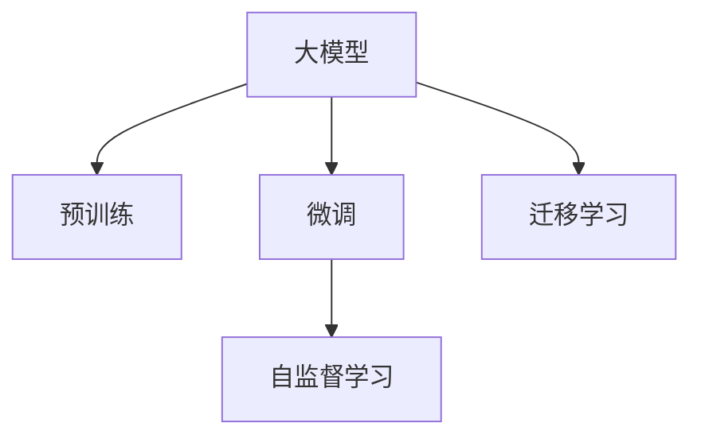

                 

# 大模型在推荐系统的优势

## 1. 背景介绍

推荐系统作为现代信息获取的重要方式，其核心目标是帮助用户从海量的信息中找到最符合其兴趣和需求的内容。传统的推荐系统主要依赖于基于用户行为数据或物品属性的统计特征模型。然而，随着数据量的指数级增长和用户需求的复杂化，传统的推荐方法在应对高维度、稀疏性、冷启动等问题上显示出明显的局限性。因此，如何开发高效、个性化、泛化的推荐系统，成为研究者和业界人士关注的焦点。

近年来，大模型（如BERT、GPT等）在自然语言处理领域取得巨大突破，基于大模型的推荐系统逐渐受到学界和业界的重视。基于大模型，推荐系统不仅可以继承其强大的表示学习能力和泛化能力，还可以融合用户的文本评论、短评等文本信息，构建更全面、精确的用户-物品关联模型。本文将深入分析大模型在推荐系统中的优势和挑战，探讨其在推荐系统中的应用前景。

## 2. 核心概念与联系

### 2.1 核心概念概述

为更好地理解大模型在推荐系统中的应用，本节将介绍几个关键概念：

- 大模型（Large Model）：如BERT、GPT等通过大规模无标签数据预训练得到的高参数量模型。具有强大的语言表示能力，能够学习到丰富的语言知识和语义信息。
- 推荐系统（Recommendation System）：通过分析用户行为数据和物品属性信息，为用户推荐符合其兴趣和需求的内容的系统。
- 预训练-微调（Pre-training & Fine-tuning）：在大规模无标签数据上进行预训练，在推荐数据集上进行微调，以获得针对特定推荐任务的优化模型。
- 深度学习（Deep Learning）：通过多层神经网络模型进行复杂数据处理和特征提取，自动学习最优的特征表示方法。
- 迁移学习（Transfer Learning）：利用已有模型的知识，在相似任务上快速训练出一个性能优异的模型。
- 自监督学习（Self-supervised Learning）：在无标签数据上进行自监督训练，学习通用的语言表示。

这些概念之间的联系可以通过以下Mermaid流程图来展示：



这个流程图展示了大模型的核心概念及其之间的关系：

1. 大模型通过预训练获得基础能力。
2. 微调是对预训练模型进行任务特定的优化，可以在少量推荐数据上取得良好的效果。
3. 迁移学习是连接预训练模型与推荐任务的关键。
4. 自监督学习通过无标签数据提升模型的通用性。

## 3. 核心算法原理 & 具体操作步骤
### 3.1 算法原理概述

基于大模型的推荐系统，本质上是一个将预训练语言模型作为初始化参数，通过微调进行优化，使得模型能够更精准地预测用户-物品关联的任务。具体而言，其算法流程包括：

1. 在无标签数据集上对大模型进行预训练，学习通用的语言表示。
2. 在推荐数据集上进行微调，以适应特定推荐任务的特征。
3. 将微调后的模型应用于推荐系统中，为不同用户生成个性化推荐列表。

通过预训练-微调的方法，大模型能够将在大规模数据上学习到的知识迁移到推荐任务中，提升推荐系统的泛化能力和个性化推荐效果。

### 3.2 算法步骤详解

基于大模型的推荐系统一般包括以下几个关键步骤：

**Step 1: 准备数据集**
- 收集用户行为数据和物品属性信息，构建推荐数据集。
- 对数据进行清洗、归一化、划分等预处理，生成训练集、验证集和测试集。

**Step 2: 模型初始化**
- 选择合适的大模型作为初始化参数，如BERT、GPT等。
- 加载预训练模型，并对模型参数进行冻结。

**Step 3: 微调模型**
- 对推荐数据集进行预处理，提取输入特征，生成监督信号。
- 在微调模型上使用梯度下降等优化算法，最小化损失函数。
- 在验证集上评估模型性能，适时调整超参数，防止过拟合。

**Step 4: 推荐生成**
- 将微调后的模型应用于推荐系统中，对新样本进行推理。
- 根据模型的输出结果，生成个性化推荐列表。

### 3.3 算法优缺点

基于大模型的推荐系统具有以下优点：
1. 强大的表示学习能力。大模型能够学习到丰富的语义信息，使得推荐系统具备更强的泛化能力和个性化推荐效果。
2. 高效的迁移能力。通过预训练-微调的方法，模型能够在少量推荐数据上取得较好的效果，降低标注数据成本。
3. 灵活的多任务适应性。大模型能够适应不同类型的推荐任务，如电商推荐、音乐推荐等。
4. 广泛的可用性。推荐系统可以使用多种大模型，如BERT、GPT等，灵活调整模型结构，适应不同推荐场景。

同时，该方法也存在一定的局限性：
1. 资源需求高。大模型的参数量较大，需要高性能的计算资源。
2. 训练复杂度较高。微调过程需要较大的计算量，训练时间较长。
3. 推理速度慢。大模型的推理速度较慢，无法满足实时推荐的要求。
4. 模型的可解释性差。大模型的决策过程较为复杂，难以解释其内部工作机制。

尽管存在这些局限性，但就目前而言，基于大模型的推荐方法仍具有不可替代的优势，并广泛用于实际推荐系统的构建中。

### 3.4 算法应用领域

基于大模型的推荐系统已经在电商、音乐、视频、新闻等多个领域得到广泛应用。以下是具体的应用场景：

- **电商推荐**：根据用户的浏览、点击、购买历史，推荐符合其兴趣的商品。
- **音乐推荐**：根据用户的听歌历史、评分等信息，推荐其可能喜欢的歌曲。
- **视频推荐**：根据用户观看历史、互动行为等数据，推荐符合其兴趣的视频。
- **新闻推荐**：根据用户的阅读习惯和兴趣，推荐相关新闻内容。

此外，大模型在推荐系统中的应用还涉及广告推荐、商品推荐、社交推荐等诸多领域，为用户的日常信息获取提供了强有力的支持。

## 4. 数学模型和公式 & 详细讲解 & 举例说明

### 4.1 数学模型构建

在推荐系统中，一般将推荐问题建模为预测用户-物品关联的概率问题。假设用户 $u$ 对物品 $i$ 的评分 $x_i$ 为未知变量，通过大模型 $M_{\theta}$ 预测 $x_i$，即：

$$
x_i = M_{\theta}(u)
$$

其中 $\theta$ 为大模型参数。推荐系统的目标是最小化用户-物品关联的预测误差。

假设用户 $u$ 的实际评分和预测评分分别为 $y$ 和 $\hat{y}$，则损失函数 $\mathcal{L}$ 可以表示为：

$$
\mathcal{L} = \frac{1}{N}\sum_{i=1}^N(y_i-\hat{y}_i)^2
$$

其中 $N$ 为推荐数据集大小。

### 4.2 公式推导过程

对于推荐数据集 $D=\{(u_i,i_i,y_i)\}_{i=1}^N$，其中 $u_i$ 为第 $i$ 个用户，$i_i$ 为物品，$y_i$ 为用户对物品 $i$ 的评分。根据上述模型，可得：

$$
\mathcal{L} = \frac{1}{N}\sum_{i=1}^N(y_i-M_{\theta}(u_i))^2
$$

在微调过程中，通过梯度下降等优化算法，不断更新模型参数 $\theta$，使得预测评分 $\hat{y}_i$ 尽可能逼近真实评分 $y_i$。具体步骤为：

1. 对数据进行预处理，生成输入特征。
2. 使用梯度下降等优化算法，更新模型参数 $\theta$。
3. 在验证集上评估模型性能，根据验证集损失调整学习率等超参数。
4. 将微调后的模型应用于推荐系统，生成推荐结果。

### 4.3 案例分析与讲解

假设有一个电商平台的推荐系统，目标是推荐用户可能感兴趣的商品。平台拥有大量用户的历史浏览、点击、购买数据，以及商品的描述、属性等特征信息。通过预训练BERT模型，作为推荐系统的基础模型，对用户行为数据和物品特征进行微调，生成个性化推荐列表。

具体而言，将用户行为数据作为文本输入，物品特征作为文本特征，使用微调后的BERT模型进行预测，得到用户的评分预测结果。最后，根据评分预测结果，生成个性化推荐列表。

## 5. 项目实践：代码实例和详细解释说明
### 5.1 开发环境搭建

在进行推荐系统开发前，我们需要准备好开发环境。以下是使用Python进行PyTorch开发的环境配置流程：

1. 安装Anaconda：从官网下载并安装Anaconda，用于创建独立的Python环境。

2. 创建并激活虚拟环境：
```bash
conda create -n pytorch-env python=3.8 
conda activate pytorch-env
```

3. 安装PyTorch：根据CUDA版本，从官网获取对应的安装命令。例如：
```bash
conda install pytorch torchvision torchaudio cudatoolkit=11.1 -c pytorch -c conda-forge
```

4. 安装TensorFlow：
```bash
pip install tensorflow
```

5. 安装各类工具包：
```bash
pip install numpy pandas scikit-learn matplotlib tqdm jupyter notebook ipython
```

完成上述步骤后，即可在`pytorch-env`环境中开始推荐系统开发。

### 5.2 源代码详细实现

以下是基于BERT模型的电商推荐系统的PyTorch代码实现：

```python
import torch
import torch.nn as nn
import torch.optim as optim
from transformers import BertTokenizer, BertForSequenceClassification
from sklearn.metrics import mean_squared_error

class RecommendationSystem:
    def __init__(self, model_name='bert-base-uncased'):
        self.tokenizer = BertTokenizer.from_pretrained(model_name)
        self.model = BertForSequenceClassification.from_pretrained(model_name, num_labels=1)
        self.model.train()
        self.criterion = nn.MSELoss()

    def preprocess_data(self, user_data, item_data):
        tokenized_texts = self.tokenizer(user_data, return_tensors='pt', max_length=512, padding=True, truncation=True)
        item_ids = item_data['id'].to(torch.long)
        return tokenized_texts, item_ids

    def forward(self, input_ids, attention_mask, labels):
        output = self.model(input_ids, attention_mask=attention_mask)
        return output

    def train(self, user_data, item_data, batch_size=16, epochs=10, learning_rate=2e-5):
        device = torch.device('cuda' if torch.cuda.is_available() else 'cpu')
        self.model.to(device)

        optimizer = optim.AdamW(self.model.parameters(), lr=learning_rate)
        loss_list = []

        for epoch in range(epochs):
            self.model.train()
            tokenized_texts, item_ids = self.preprocess_data(user_data, item_data)
            input_ids = tokenized_texts['input_ids'].to(device)
            attention_mask = tokenized_texts['attention_mask'].to(device)
            labels = torch.tensor(item_data['rating'].to(device), dtype=torch.float)

            self.model.zero_grad()
            output = self.forward(input_ids, attention_mask, labels)
            loss = self.criterion(output, labels)
            loss_list.append(loss.item())

            loss.backward()
            optimizer.step()

            print(f'Epoch {epoch+1}, loss: {loss_list[epoch]/len(item_data)}')

        return loss_list

    def evaluate(self, user_data, item_data, batch_size=16, device='cpu'):
        self.model.eval()
        tokenized_texts, item_ids = self.preprocess_data(user_data, item_data)
        input_ids = tokenized_texts['input_ids'].to(device)
        attention_mask = tokenized_texts['attention_mask'].to(device)
        labels = torch.tensor(item_data['rating'].to(device), dtype=torch.float)

        with torch.no_grad():
            output = self.forward(input_ids, attention_mask, labels)
            mse = mean_squared_error(output, labels).item()

        return mse

# 加载推荐数据集
from pandas import read_csv
data = read_csv('recommendation_data.csv')

# 初始化推荐系统
model = RecommendationSystem()

# 划分训练集、验证集和测试集
train_data, dev_data, test_data = train_test_split(data, test_size=0.2, random_state=42)
train_data, val_data = train_test_split(train_data, test_size=0.2, random_state=42)

# 训练推荐系统
train_loss = model.train(train_data, train_data, batch_size=16, epochs=10, learning_rate=2e-5)
val_loss = model.evaluate(val_data, val_data, batch_size=16)

# 测试推荐系统
test_loss = model.evaluate(test_data, test_data, batch_size=16)
```

以上代码实现了基于BERT模型的电商推荐系统，涵盖了从数据预处理、模型定义、训练到评估的完整过程。

### 5.3 代码解读与分析

让我们再详细解读一下关键代码的实现细节：

**RecommendationSystem类**：
- `__init__`方法：初始化BERT模型、tokenizer、损失函数等组件。
- `preprocess_data`方法：对用户数据和物品数据进行预处理，生成模型所需的输入。
- `forward`方法：定义模型的前向传播过程。
- `train`方法：对数据进行批处理训练，更新模型参数。
- `evaluate`方法：对数据进行评估，计算模型损失。

**代码实例**：
- 使用BertTokenizer对用户行为数据进行分词处理，生成token ids。
- 定义BERT模型作为推荐系统的基础模型，将其迁移到GPU上，并进行训练。
- 使用AdamW优化器进行参数更新，最小化均方误差损失。
- 在验证集上评估模型性能，避免过拟合。
- 使用均方误差作为评估指标，衡量模型的推荐效果。

## 6. 实际应用场景
### 6.1 电商推荐

基于大模型的电商推荐系统在实际应用中已经取得了不错的效果。电商平台可以利用用户的浏览、点击、购买历史，结合商品的描述、属性等特征信息，对用户进行建模，生成个性化推荐列表。

通过微调BERT等大模型，电商推荐系统能够学习到用户对商品的多维度表示，从而生成更为精准的推荐结果。对于新商品，也可以通过简单微调，快速生成其推荐结果，弥补数据稀疏性的问题。

### 6.2 音乐推荐

音乐推荐系统也受益于大模型的能力。用户通过听歌、评分等方式，累积了丰富的听歌行为数据。通过微调BERT等模型，音乐推荐系统能够更好地捕捉用户的听歌偏好，生成个性化的音乐推荐列表。

具体而言，可以使用用户的听歌历史作为文本输入，将歌曲信息作为文本特征，通过微调后的BERT模型进行预测，生成个性化的音乐推荐列表。对于新歌曲，可以通过简单的微调，快速生成其推荐结果。

### 6.3 视频推荐

视频推荐系统同样可以利用大模型的能力。用户通过观看视频、点赞、评论等方式，形成了海量的视频行为数据。通过微调BERT等模型，视频推荐系统能够更好地捕捉用户的视频偏好，生成个性化的视频推荐列表。

具体而言，可以使用用户的观看历史作为文本输入，将视频信息作为文本特征，通过微调后的BERT模型进行预测，生成个性化的视频推荐列表。对于新视频，也可以通过简单的微调，快速生成其推荐结果。

### 6.4 未来应用展望

随着大模型和推荐技术的发展，未来的推荐系统将呈现以下几个趋势：

1. **个性化推荐**：通过大模型，推荐系统能够更好地捕捉用户的多维度兴趣，生成更为精准的推荐结果。
2. **实时推荐**：基于GPU等高性能计算资源，大模型能够在实时场景中快速生成推荐结果，提升用户体验。
3. **多模态融合**：推荐系统可以融合视觉、语音等多种模态信息，提供更为全面和丰富的推荐服务。
4. **跨领域迁移**：大模型可以通过迁移学习，将预训练知识迁移到其他领域，提升推荐系统的泛化能力。
5. **深度特征工程**：通过深度特征工程技术，提升模型的泛化能力和个性化推荐效果。

这些趋势表明，基于大模型的推荐系统具有广阔的应用前景，将在更多领域发挥重要作用。

## 7. 工具和资源推荐
### 7.1 学习资源推荐

为了帮助开发者系统掌握大模型在推荐系统中的应用，这里推荐一些优质的学习资源：

1. 《深度学习与推荐系统》：陈云尧教授的课程，系统介绍了推荐系统的基本原理和深度学习方法。
2. 《推荐系统实践》：王斌博士的书籍，详细介绍了推荐系统在不同领域的实践应用。
3. 《自然语言处理与深度学习》：周志华教授的书籍，全面介绍了NLP与深度学习的最新进展。
4. 《推荐系统竞赛》：Kaggle上的竞赛平台，提供了丰富的推荐系统数据集和模型竞赛经验。
5. HuggingFace官方文档：Transformer库的官方文档，提供了海量预训练模型和微调样例代码。

通过对这些资源的学习实践，相信你一定能够快速掌握大模型在推荐系统中的应用，并用于解决实际的推荐问题。

### 7.2 开发工具推荐

高效的开发离不开优秀的工具支持。以下是几款用于大模型推荐系统开发的常用工具：

1. PyTorch：基于Python的开源深度学习框架，灵活性高，适合快速迭代研究。
2. TensorFlow：由Google主导开发的开源深度学习框架，稳定可靠，适合大规模工程应用。
3. Transformers库：HuggingFace开发的NLP工具库，集成了多种预训练语言模型，方便微调。
4. Weights & Biases：模型训练的实验跟踪工具，可以记录和可视化模型训练过程中的各项指标，方便对比和调优。
5. TensorBoard：TensorFlow配套的可视化工具，可以实时监测模型训练状态，提供丰富的图表呈现方式。
6. Google Colab：谷歌推出的在线Jupyter Notebook环境，免费提供GPU/TPU算力，方便快速实验最新模型。

合理利用这些工具，可以显著提升大模型推荐系统的开发效率，加快创新迭代的步伐。

### 7.3 相关论文推荐

大模型和推荐系统的结合研究已经取得了诸多进展，以下是几篇奠基性的相关论文，推荐阅读：

1. Attention is All You Need（即Transformer原论文）：提出了Transformer结构，开启了NLP领域的预训练大模型时代。
2. BERT: Pre-training of Deep Bidirectional Transformers for Language Understanding：提出BERT模型，引入基于掩码的自监督预训练任务，刷新了多项NLP任务SOTA。
3. Modeling Counterfactual Relations for Personalized Recommendations with Latent Knowledge Graphs：将知识图谱与大模型结合，提升了推荐系统的泛化能力和个性化推荐效果。
4. NMF as a Regularizer for Neural Collaborative Filtering：提出使用矩阵分解作为正则化项，提升了推荐系统的性能和泛化能力。
5. Deep Matrix Factorization Methods for Recommender Systems：介绍了深度矩阵分解方法，提高了推荐系统的模型表达能力和泛化能力。

这些论文代表了大模型和推荐系统的最新进展，阅读这些文献可以帮助研究者掌握最新的技术趋势，激发更多的创新灵感。

## 8. 总结：未来发展趋势与挑战

### 8.1 总结

本文对大模型在推荐系统中的应用进行了全面系统的介绍。首先阐述了大模型和推荐系统的研究背景和意义，明确了微调在拓展预训练模型应用、提升推荐系统性能方面的独特价值。其次，从原理到实践，详细讲解了微调的数学原理和关键步骤，给出了推荐系统开发的完整代码实例。同时，本文还广泛探讨了大模型在电商、音乐、视频等多个领域的应用前景，展示了其巨大的潜力。

通过本文的系统梳理，可以看到，基于大模型的推荐系统正在成为推荐系统的重要范式，极大地拓展了预训练模型在推荐领域的应用边界，催生了更多的落地场景。受益于大规模语料的预训练，微调模型能够更好地适应不同推荐任务，提升推荐系统的泛化能力和个性化推荐效果。未来，伴随大模型和微调方法的持续演进，相信推荐系统必将在更广泛的领域发挥重要作用，为用户的日常信息获取提供强有力的支持。

### 8.2 未来发展趋势

展望未来，大模型在推荐系统的发展趋势将呈现以下几个方向：

1. **个性化推荐**：通过大模型，推荐系统能够更好地捕捉用户的多维度兴趣，生成更为精准的推荐结果。
2. **实时推荐**：基于GPU等高性能计算资源，大模型能够在实时场景中快速生成推荐结果，提升用户体验。
3. **多模态融合**：推荐系统可以融合视觉、语音等多种模态信息，提供更为全面和丰富的推荐服务。
4. **跨领域迁移**：大模型可以通过迁移学习，将预训练知识迁移到其他领域，提升推荐系统的泛化能力。
5. **深度特征工程**：通过深度特征工程技术，提升模型的泛化能力和个性化推荐效果。
6. **少样本学习和自适应推荐**：通过少样本学习和大模型自适应机制，提升推荐系统在冷启动和动态场景下的性能。

这些趋势表明，基于大模型的推荐系统具有广阔的应用前景，将在更多领域发挥重要作用。

### 8.3 面临的挑战

尽管大模型在推荐系统中的应用已经取得了诸多进展，但在迈向更加智能化、普适化应用的过程中，仍然面临诸多挑战：

1. **资源需求高**：大模型的参数量较大，需要高性能的计算资源。如何在有限的资源下，高效地利用大模型，仍是一大难题。
2. **训练复杂度较高**：微调过程需要较大的计算量，训练时间较长。如何优化训练过程，提高训练效率，仍需不断探索。
3. **推理速度慢**：大模型的推理速度较慢，无法满足实时推荐的要求。如何优化推理过程，提升推理速度，仍需不断改进。
4. **模型的可解释性差**：大模型的决策过程较为复杂，难以解释其内部工作机制。如何提高模型的可解释性，仍需进一步研究。
5. **知识整合能力不足**：现有的推荐系统大多依赖数据驱动，难以灵活吸收和运用更广泛的先验知识。如何让推荐系统更好地整合外部知识库，提升模型的泛化能力，仍需深入探索。

尽管存在这些挑战，但随着技术的不断发展，大模型在推荐系统中的应用必将更加广泛和深入。相信通过研究者的不懈努力，这些挑战终将一一被克服，大模型必将在推荐系统中发挥更加重要的作用。

### 8.4 研究展望

面对大模型在推荐系统面临的挑战，未来的研究需要在以下几个方面寻求新的突破：

1. **优化模型结构和参数**：通过优化模型结构和参数，提高模型的推理速度和可解释性，减少对资源的需求。
2. **引入多模态信息**：将视觉、语音等多种模态信息融入推荐系统，提升模型的感知能力和表现力。
3. **探索知识图谱与大模型的结合**：利用知识图谱丰富推荐系统的知识表示能力，提升推荐系统的泛化能力和个性化推荐效果。
4. **引入自适应推荐机制**：通过少样本学习和大模型自适应机制，提升推荐系统在冷启动和动态场景下的性能。
5. **引入迁移学习**：通过迁移学习，将预训练知识迁移到其他领域，提升推荐系统的泛化能力。

这些研究方向将推动大模型在推荐系统中的应用，提升推荐系统的性能和泛化能力，为用户的日常信息获取提供更为精准和丰富的服务。面向未来，大模型必将在推荐系统中发挥更为重要的作用，推动推荐技术的发展和应用。

## 9. 附录：常见问题与解答

**Q1：大模型推荐系统是否适用于所有推荐场景？**

A: 大模型推荐系统适用于大部分推荐场景，特别是对于需要捕捉用户多维度兴趣的推荐任务。但对于一些特殊场景，如新闻推荐、广告推荐等，传统基于统计特征的推荐系统仍具有一定的优势。

**Q2：如何优化大模型推荐系统的训练过程？**

A: 优化大模型推荐系统的训练过程，需要考虑以下几个方面：
1. 使用GPU等高性能计算资源，加速训练过程。
2. 采用梯度积累、混合精度训练等技术，减少计算量。
3. 使用知识蒸馏等技术，提高模型泛化能力。
4. 引入自适应学习率机制，避免过拟合。
5. 使用数据增强技术，提升模型泛化能力。

**Q3：大模型推荐系统的推理速度如何？**

A: 大模型推荐系统的推理速度相对较慢，无法满足实时推荐的要求。可以通过模型剪枝、量化等技术，优化推理速度。同时，引入分布式推理等技术，提升系统的计算能力。

**Q4：大模型推荐系统的可解释性如何？**

A: 大模型推荐系统的决策过程较为复杂，难以解释其内部工作机制。可以通过特征可视化、模型诊断等技术，提升模型的可解释性。

**Q5：如何平衡大模型推荐系统的性能和效率？**

A: 平衡大模型推荐系统的性能和效率，需要从模型结构、参数量、训练过程等方面进行优化。可以通过模型剪枝、量化等技术，减小模型大小和计算量，提升推理速度。同时，使用GPU等高性能计算资源，加速训练过程，提升系统性能。

总之，大模型推荐系统在推荐领域展现了强大的潜力，但仍然面临一些挑战。通过持续优化和改进，相信大模型必将在推荐系统中发挥更大的作用，为用户的信息获取提供更为精准和丰富的服务。

