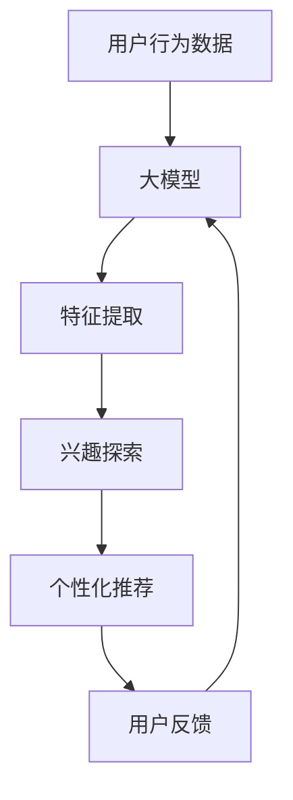

                 

# 大模型在用户兴趣探索中的应用

## 1. 背景介绍

在当今数字化时代，个性化推荐已成为提升用户体验和业务效益的关键。无论是电商、内容平台还是社交网络，用户对个性化推荐的需求日益增长，而大模型的应用正为这一需求提供了新的解决方案。用户兴趣探索（User Interest Exploration）作为个性化推荐的重要基础，旨在通过大模型技术发现用户潜在的兴趣点，以提升推荐的准确性和相关性。本文将全面探讨大模型在用户兴趣探索中的应用，涵盖其原理、操作步骤、优缺点以及未来发展趋势。

## 2. 核心概念与联系

### 2.1 核心概念概述

为更好地理解大模型在用户兴趣探索中的应用，本节将介绍几个关键概念：

- 用户兴趣探索（User Interest Exploration）：通过分析和挖掘用户的历史行为、交互记录等数据，发现用户潜在的兴趣点，为个性化推荐提供依据。
- 大模型（Large Model）：指具有大规模参数和强大表征能力的深度学习模型，如BERT、GPT等。大模型能够学习到丰富的语言知识，应用于各类NLP任务。
- 自然语言处理（NLP）：涉及计算机对人类语言进行理解、分析、生成等操作，是大模型应用的重要领域之一。
- 注意力机制（Attention Mechanism）：大模型中的核心组件，用于捕捉输入数据的上下文信息，提升模型的语义理解能力。
- 用户行为分析（User Behavior Analysis）：通过分析用户的历史行为数据，提取用户的兴趣特征，是大模型应用的基础。

这些概念之间具有紧密的联系，共同构成了用户兴趣探索的框架，使得大模型能够在复杂的用户数据中发现潜在的兴趣点，为个性化推荐提供支持。

### 2.2 核心概念原理和架构的 Mermaid 流程图(Mermaid 流程节点中不要有括号、逗号等特殊字符)



这个流程图展示了从用户行为数据到个性化推荐的基本流程：

1. **用户行为数据**：收集用户的浏览、点击、购买等行为数据。
2. **大模型**：使用预训练的大模型对用户数据进行分析，提取兴趣特征。
3. **特征提取**：通过大模型将用户数据转换为模型能够处理的格式，并提取出相关的特征。
4. **兴趣探索**：利用大模型对用户数据进行深度分析，发现用户的潜在兴趣点。
5. **个性化推荐**：根据用户兴趣点，生成个性化的推荐结果。
6. **用户反馈**：收集用户对推荐结果的反馈，用于模型优化。
7. **循环迭代**：将用户反馈再次输入大模型，进行模型迭代优化。

## 3. 核心算法原理 & 具体操作步骤

### 3.1 算法原理概述

大模型在用户兴趣探索中的应用，主要基于预训练-微调的范式。具体流程如下：

1. **预训练**：使用大规模无标签数据对大模型进行预训练，学习到通用的语言表示。
2. **微调**：在用户行为数据上对大模型进行微调，使其能够针对用户的具体行为和兴趣进行分析和预测。
3. **特征提取**：通过微调后的模型，对用户数据进行特征提取，得到用户兴趣向量。
4. **兴趣探索**：根据用户兴趣向量，进行用户兴趣探索，发现用户潜在的兴趣点。
5. **个性化推荐**：根据用户兴趣点，生成个性化的推荐结果，提升用户体验。

### 3.2 算法步骤详解

#### 步骤1：预训练大模型

选择合适的预训练大模型，如BERT、GPT等。在大规模无标签文本数据上对其进行预训练，学习到通用的语言表示。

#### 步骤2：数据准备

收集用户的各类行为数据，包括浏览记录、点击行为、购买记录等。对数据进行清洗和预处理，确保数据质量。

#### 步骤3：微调大模型

将预训练的大模型作为初始化参数，使用用户行为数据进行微调。设置合适的学习率、批大小、迭代轮数等参数，优化模型性能。

#### 步骤4：特征提取

通过微调后的大模型，对用户行为数据进行特征提取，得到用户的兴趣向量。

#### 步骤5：兴趣探索

利用用户兴趣向量，进行用户兴趣探索，发现用户潜在的兴趣点。

#### 步骤6：个性化推荐

根据用户兴趣点，生成个性化的推荐结果，提升用户体验。

#### 步骤7：反馈循环

收集用户对推荐结果的反馈，用于模型优化和重新训练。

### 3.3 算法优缺点

#### 优点

1. **大规模数据利用**：大模型能够在海量数据上学习到丰富的语言知识，提升兴趣探索的准确性。
2. **高效特征提取**：微调后的模型能够高效提取用户数据的特征，提升推荐精度。
3. **通用性强**：大模型可以应用于各类NLP任务，包括文本分析、情感分析等。
4. **可解释性**：大模型的内部结构可解释，便于理解其决策逻辑。

#### 缺点

1. **数据依赖性强**：大模型的效果很大程度上取决于用户行为数据的完整性和质量。
2. **计算资源消耗大**：大模型需要大量计算资源进行预训练和微调。
3. **对抗样本敏感**：大模型可能对对抗样本敏感，影响兴趣探索的准确性。
4. **迁移能力有限**：大模型在不同领域的迁移能力有限，需要针对特定领域进行重新微调。

### 3.4 算法应用领域

大模型在用户兴趣探索中的应用，可以广泛应用于以下领域：

- **电商推荐**：通过分析用户的浏览、点击、购买等行为数据，发现用户潜在的兴趣点，推荐商品。
- **内容推荐**：根据用户的阅读、观看行为数据，推荐相关内容，如文章、视频等。
- **社交网络**：通过分析用户在社交平台上的互动行为，推荐可能感兴趣的朋友或内容。
- **游戏推荐**：通过分析用户的游戏行为数据，推荐可能感兴趣的游戏或游戏内容。
- **金融推荐**：根据用户的金融行为数据，推荐适合的理财产品或金融服务。

## 4. 数学模型和公式 & 详细讲解 & 举例说明（备注：数学公式请使用latex格式，latex嵌入文中独立段落使用 $$，段落内使用 $)
### 4.1 数学模型构建

本节将使用数学语言对大模型在用户兴趣探索中的应用进行详细描述。

记大模型为 $M_{\theta}$，其中 $\theta$ 为模型参数。假设用户行为数据集为 $D=\{(x_i,y_i)\}_{i=1}^N, x_i \in \mathcal{X}, y_i \in \mathcal{Y}$，其中 $x_i$ 为输入，$y_i$ 为输出。

定义模型 $M_{\theta}$ 在输入 $x_i$ 上的损失函数为 $\ell(M_{\theta}(x_i),y_i)$，则在数据集 $D$ 上的经验风险为：

$$
\mathcal{L}(\theta) = \frac{1}{N} \sum_{i=1}^N \ell(M_{\theta}(x_i),y_i)
$$

微调的优化目标是最小化经验风险，即找到最优参数：

$$
\theta^* = \mathop{\arg\min}_{\theta} \mathcal{L}(\theta)
$$

在实践中，我们通常使用基于梯度的优化算法（如SGD、Adam等）来近似求解上述最优化问题。设 $\eta$ 为学习率，$\lambda$ 为正则化系数，则参数的更新公式为：

$$
\theta \leftarrow \theta - \eta \nabla_{\theta}\mathcal{L}(\theta) - \eta\lambda\theta
$$

其中 $\nabla_{\theta}\mathcal{L}(\theta)$ 为损失函数对参数 $\theta$ 的梯度，可通过反向传播算法高效计算。

### 4.2 公式推导过程

以二分类任务为例，推导交叉熵损失函数及其梯度的计算公式。

假设模型 $M_{\theta}$ 在输入 $x$ 上的输出为 $\hat{y}=M_{\theta}(x) \in [0,1]$，表示样本属于正类的概率。真实标签 $y \in \{0,1\}$。则二分类交叉熵损失函数定义为：

$$
\ell(M_{\theta}(x),y) = -[y\log \hat{y} + (1-y)\log (1-\hat{y})]
$$

将其代入经验风险公式，得：

$$
\mathcal{L}(\theta) = -\frac{1}{N}\sum_{i=1}^N [y_i\log M_{\theta}(x_i)+(1-y_i)\log(1-M_{\theta}(x_i))]
$$

根据链式法则，损失函数对参数 $\theta_k$ 的梯度为：

$$
\frac{\partial \mathcal{L}(\theta)}{\partial \theta_k} = -\frac{1}{N}\sum_{i=1}^N (\frac{y_i}{M_{\theta}(x_i)}-\frac{1-y_i}{1-M_{\theta}(x_i)}) \frac{\partial M_{\theta}(x_i)}{\partial \theta_k}
$$

其中 $\frac{\partial M_{\theta}(x_i)}{\partial \theta_k}$ 可进一步递归展开，利用自动微分技术完成计算。

在得到损失函数的梯度后，即可带入参数更新公式，完成模型的迭代优化。重复上述过程直至收敛，最终得到适应用户行为数据的最优模型参数 $\theta^*$。

### 4.3 案例分析与讲解

以电商推荐系统为例，展示如何使用大模型进行用户兴趣探索。

假设电商平台的商品数据集为 $D_S=\{(s_i,r_i)\}_{i=1}^M, s_i \in \mathcal{S}, r_i \in \mathcal{R}$，其中 $s_i$ 为商品，$r_i$ 为用户的评分。用户行为数据集为 $D_B=\{(b_j)\}_{j=1}^N, b_j \in \mathcal{B}$，其中 $b_j$ 为用户的浏览、点击、购买等行为。

定义电商平台推荐模型的损失函数为：

$$
\mathcal{L}(\theta) = \frac{1}{N}\sum_{j=1}^N \sum_{i=1}^M (r_j - M_{\theta}(s_i,b_j))^2
$$

其中 $M_{\theta}(s_i,b_j)$ 为模型在商品 $s_i$ 和行为 $b_j$ 上的预测评分。

将预训练的大模型BERT作为初始化参数，使用电商平台的商品评分和用户行为数据进行微调。设置合适的学习率、批大小、迭代轮数等参数，优化模型性能。

通过微调后的模型，对用户的行为数据进行特征提取，得到用户的兴趣向量。根据用户兴趣向量，进行用户兴趣探索，发现用户潜在的兴趣点。

最后，根据用户兴趣点，生成个性化的推荐结果，提升用户体验。

## 5. 项目实践：代码实例和详细解释说明
### 5.1 开发环境搭建

在进行大模型微调实践前，我们需要准备好开发环境。以下是使用Python进行PyTorch开发的环境配置流程：

1. 安装Anaconda：从官网下载并安装Anaconda，用于创建独立的Python环境。

2. 创建并激活虚拟环境：
```bash
conda create -n pytorch-env python=3.8 
conda activate pytorch-env
```

3. 安装PyTorch：根据CUDA版本，从官网获取对应的安装命令。例如：
```bash
conda install pytorch torchvision torchaudio cudatoolkit=11.1 -c pytorch -c conda-forge
```

4. 安装Transformers库：
```bash
pip install transformers
```

5. 安装各类工具包：
```bash
pip install numpy pandas scikit-learn matplotlib tqdm jupyter notebook ipython
```

完成上述步骤后，即可在`pytorch-env`环境中开始微调实践。

### 5.2 源代码详细实现

下面我们以电商推荐系统为例，给出使用Transformers库对BERT模型进行微调的PyTorch代码实现。

首先，定义电商推荐任务的数据处理函数：

```python
from transformers import BertTokenizer
from torch.utils.data import Dataset
import torch

class BERTRecommendationDataset(Dataset):
    def __init__(self, item_ids, user_ids, scores, tokenizer, max_len=128):
        self.item_ids = item_ids
        self.user_ids = user_ids
        self.scores = scores
        self.tokenizer = tokenizer
        self.max_len = max_len
        
    def __len__(self):
        return len(self.item_ids)
    
    def __getitem__(self, item):
        item_id = self.item_ids[item]
        user_id = self.user_ids[item]
        score = self.scores[item]
        
        item = tokenizer(item_id, return_tensors='pt', max_length=self.max_len, padding='max_length', truncation=True)
        user = tokenizer(user_id, return_tensors='pt', max_length=self.max_len, padding='max_length', truncation=True)
        
        # 对item和user进行拼接
        input_ids = torch.cat([item['input_ids'], user['input_ids']], dim=1)
        attention_mask = torch.cat([item['attention_mask'], user['attention_mask']], dim=1)
        
        # 对评分进行one-hot编码
        score = torch.tensor([score], dtype=torch.float)
        
        return {'input_ids': input_ids, 
                'attention_mask': attention_mask,
                'score': score}

# 定义评分与id的映射
score2id = {score: i for i, score in enumerate(set(scores))}
id2score = {i: score for i, score in score2id.items()}
```

然后，定义模型和优化器：

```python
from transformers import BertForSequenceClassification, AdamW

model = BertForSequenceClassification.from_pretrained('bert-base-cased', num_labels=len(score2id))

optimizer = AdamW(model.parameters(), lr=2e-5)
```

接着，定义训练和评估函数：

```python
from torch.utils.data import DataLoader
from tqdm import tqdm
from sklearn.metrics import mean_squared_error

device = torch.device('cuda') if torch.cuda.is_available() else torch.device('cpu')
model.to(device)

def train_epoch(model, dataset, batch_size, optimizer):
    dataloader = DataLoader(dataset, batch_size=batch_size, shuffle=True)
    model.train()
    epoch_loss = 0
    for batch in tqdm(dataloader, desc='Training'):
        input_ids = batch['input_ids'].to(device)
        attention_mask = batch['attention_mask'].to(device)
        score = batch['score'].to(device)
        model.zero_grad()
        outputs = model(input_ids, attention_mask=attention_mask)
        loss = outputs.loss
        epoch_loss += loss.item()
        loss.backward()
        optimizer.step()
    return epoch_loss / len(dataloader)

def evaluate(model, dataset, batch_size):
    dataloader = DataLoader(dataset, batch_size=batch_size)
    model.eval()
    preds, labels = [], []
    with torch.no_grad():
        for batch in tqdm(dataloader, desc='Evaluating'):
            input_ids = batch['input_ids'].to(device)
            attention_mask = batch['attention_mask'].to(device)
            batch_labels = batch['score'].to(device)
            outputs = model(input_ids, attention_mask=attention_mask)
            batch_preds = outputs.logits.argmax(dim=1).to('cpu').tolist()
            batch_labels = batch_labels.to('cpu').tolist()
            for pred, label in zip(batch_preds, batch_labels):
                preds.append(pred)
                labels.append(label)
                
    return mean_squared_error(labels, preds)
```

最后，启动训练流程并在测试集上评估：

```python
epochs = 5
batch_size = 16

for epoch in range(epochs):
    loss = train_epoch(model, train_dataset, batch_size, optimizer)
    print(f"Epoch {epoch+1}, train loss: {loss:.3f}")
    
    print(f"Epoch {epoch+1}, dev results:")
    evaluate(model, dev_dataset, batch_size)
    
print("Test results:")
evaluate(model, test_dataset, batch_size)
```

以上就是使用PyTorch对BERT进行电商推荐系统微调的完整代码实现。可以看到，得益于Transformers库的强大封装，我们可以用相对简洁的代码完成BERT模型的加载和微调。

### 5.3 代码解读与分析

让我们再详细解读一下关键代码的实现细节：

**BERTRecommendationDataset类**：
- `__init__`方法：初始化商品ID、用户ID、评分等关键组件。
- `__len__`方法：返回数据集的样本数量。
- `__getitem__`方法：对单个样本进行处理，将商品ID和用户ID输入编码为token ids，同时将评分进行one-hot编码，最后拼接并返回模型所需的输入。

**score2id和id2score字典**：
- 定义了评分与数字id之间的映射关系，用于将预测评分解码回原始评分。

**训练和评估函数**：
- 使用PyTorch的DataLoader对数据集进行批次化加载，供模型训练和推理使用。
- 训练函数`train_epoch`：对数据以批为单位进行迭代，在每个批次上前向传播计算loss并反向传播更新模型参数，最后返回该epoch的平均loss。
- 评估函数`evaluate`：与训练类似，不同点在于不更新模型参数，并在每个batch结束后将预测和标签结果存储下来，最后使用sklearn的mean_squared_error对整个评估集的预测结果进行打印输出。

**训练流程**：
- 定义总的epoch数和batch size，开始循环迭代
- 每个epoch内，先在训练集上训练，输出平均loss
- 在验证集上评估，输出RMSE
- 所有epoch结束后，在测试集上评估，给出最终测试结果

可以看到，PyTorch配合Transformers库使得BERT微调的代码实现变得简洁高效。开发者可以将更多精力放在数据处理、模型改进等高层逻辑上，而不必过多关注底层的实现细节。

当然，工业级的系统实现还需考虑更多因素，如模型的保存和部署、超参数的自动搜索、更灵活的任务适配层等。但核心的微调范式基本与此类似。

## 6. 实际应用场景
### 6.1 电商推荐

电商推荐系统是用户兴趣探索的重要应用场景。通过分析用户的浏览、点击、购买等行为数据，发现用户潜在的兴趣点，推荐商品，提升用户体验和销售额。

在技术实现上，可以收集用户的各类行为数据，包括浏览记录、点击行为、购买记录等。对数据进行清洗和预处理，提取用户的兴趣特征。使用预训练的大模型对用户数据进行特征提取，得到用户的兴趣向量。根据用户兴趣向量，进行用户兴趣探索，发现用户潜在的兴趣点。最后，根据用户兴趣点，生成个性化的推荐结果，提升用户体验。

### 6.2 内容推荐

内容推荐系统同样是用户兴趣探索的重要应用场景。通过分析用户的阅读、观看行为数据，发现用户潜在的兴趣点，推荐相关内容，如文章、视频等。

在技术实现上，可以收集用户的各类行为数据，包括阅读记录、观看行为等。对数据进行清洗和预处理，提取用户的兴趣特征。使用预训练的大模型对用户数据进行特征提取，得到用户的兴趣向量。根据用户兴趣向量，进行用户兴趣探索，发现用户潜在的兴趣点。最后，根据用户兴趣点，生成个性化的推荐结果，提升用户体验。

### 6.3 社交网络

社交网络平台需要推荐可能感兴趣的朋友或内容，通过分析用户在社交平台上的互动行为，发现用户潜在的兴趣点。

在技术实现上，可以收集用户的各类互动行为数据，包括点赞、评论、分享等。对数据进行清洗和预处理，提取用户的兴趣特征。使用预训练的大模型对用户数据进行特征提取，得到用户的兴趣向量。根据用户兴趣向量，进行用户兴趣探索，发现用户潜在的兴趣点。最后，根据用户兴趣点，生成个性化的推荐结果，提升用户体验。

### 6.4 游戏推荐

游戏推荐系统通过分析用户的游戏行为数据，推荐可能感兴趣的游戏或游戏内容。

在技术实现上，可以收集用户的游戏行为数据，包括游戏时间、游戏成就、游戏道具等。对数据进行清洗和预处理，提取用户的兴趣特征。使用预训练的大模型对用户数据进行特征提取，得到用户的兴趣向量。根据用户兴趣向量，进行用户兴趣探索，发现用户潜在的兴趣点。最后，根据用户兴趣点，生成个性化的推荐结果，提升用户体验。

### 6.5 金融推荐

金融推荐系统根据用户的金融行为数据，推荐适合的理财产品或金融服务。

在技术实现上，可以收集用户的各类金融行为数据，包括投资记录、交易行为等。对数据进行清洗和预处理，提取用户的兴趣特征。使用预训练的大模型对用户数据进行特征提取，得到用户的兴趣向量。根据用户兴趣向量，进行用户兴趣探索，发现用户潜在的兴趣点。最后，根据用户兴趣点，生成个性化的推荐结果，提升用户体验。

### 6.6 其他应用

除了上述应用场景，用户兴趣探索技术还可以应用于智慧城市、智能家居、医疗健康等多个领域，为各行各业提供智能化、个性化的服务。

## 7. 工具和资源推荐
### 7.1 学习资源推荐

为了帮助开发者系统掌握大模型在用户兴趣探索中的应用，这里推荐一些优质的学习资源：

1. 《深度学习》书籍：Ian Goodfellow等著，深入浅出地介绍了深度学习的理论和实践，是深度学习领域的经典教材。
2. 《自然语言处理》课程：斯坦福大学开设的NLP明星课程，有Lecture视频和配套作业，带你入门NLP领域的基本概念和经典模型。
3. 《TensorFlow实战》书籍：张俊林著，全面介绍了TensorFlow的原理和应用，包括NLP任务开发。
4. 《Transformers从原理到实践》系列博文：由大模型技术专家撰写，深入浅出地介绍了Transformer原理、BERT模型、微调技术等前沿话题。
5. 《Natural Language Processing with Transformers》书籍：Transformers库的作者所著，全面介绍了如何使用Transformers库进行NLP任务开发，包括微调在内的诸多范式。

通过对这些资源的学习实践，相信你一定能够快速掌握大模型在用户兴趣探索中的应用，并用于解决实际的NLP问题。
###  7.2 开发工具推荐

高效的开发离不开优秀的工具支持。以下是几款用于大模型微调开发的常用工具：

1. PyTorch：基于Python的开源深度学习框架，灵活动态的计算图，适合快速迭代研究。大部分预训练语言模型都有PyTorch版本的实现。
2. TensorFlow：由Google主导开发的开源深度学习框架，生产部署方便，适合大规模工程应用。同样有丰富的预训练语言模型资源。
3. Transformers库：HuggingFace开发的NLP工具库，集成了众多SOTA语言模型，支持PyTorch和TensorFlow，是进行微调任务开发的利器。
4. Weights & Biases：模型训练的实验跟踪工具，可以记录和可视化模型训练过程中的各项指标，方便对比和调优。与主流深度学习框架无缝集成。
5. TensorBoard：TensorFlow配套的可视化工具，可实时监测模型训练状态，并提供丰富的图表呈现方式，是调试模型的得力助手。
6. Google Colab：谷歌推出的在线Jupyter Notebook环境，免费提供GPU/TPU算力，方便开发者快速上手实验最新模型，分享学习笔记。

合理利用这些工具，可以显著提升大模型微调的开发效率，加快创新迭代的步伐。

### 7.3 相关论文推荐

大模型在用户兴趣探索中的应用源于学界的持续研究。以下是几篇奠基性的相关论文，推荐阅读：

1. Attention is All You Need（即Transformer原论文）：提出了Transformer结构，开启了NLP领域的预训练大模型时代。
2. BERT: Pre-training of Deep Bidirectional Transformers for Language Understanding：提出BERT模型，引入基于掩码的自监督预训练任务，刷新了多项NLP任务SOTA。
3. Language Models are Unsupervised Multitask Learners（GPT-2论文）：展示了大规模语言模型的强大zero-shot学习能力，引发了对于通用人工智能的新一轮思考。
4. Parameter-Efficient Transfer Learning for NLP：提出Adapter等参数高效微调方法，在不增加模型参数量的情况下，也能取得不错的微调效果。
5. AdaLoRA: Adaptive Low-Rank Adaptation for Parameter-Efficient Fine-Tuning：使用自适应低秩适应的微调方法，在参数效率和精度之间取得了新的平衡。
6. Prompt-based Learning: Scaling the Human-Computer Interaction Paradigm for Language and Vision with Large Language Models：引入基于连续型Prompt的微调范式，为如何充分利用预训练知识提供了新的思路。

这些论文代表了大模型在用户兴趣探索领域的发展脉络。通过学习这些前沿成果，可以帮助研究者把握学科前进方向，激发更多的创新灵感。

## 8. 总结：未来发展趋势与挑战

### 8.1 总结

本文对大模型在用户兴趣探索中的应用进行了全面系统的介绍。首先阐述了用户兴趣探索的背景和重要性，明确了大模型在其中的关键作用。其次，从原理到实践，详细讲解了预训练-微调的数学原理和关键步骤，给出了微调任务开发的完整代码实例。同时，本文还广泛探讨了微调方法在电商、内容推荐、社交网络等多个行业领域的应用前景，展示了微调范式的巨大潜力。此外，本文精选了微调技术的各类学习资源，力求为读者提供全方位的技术指引。

通过本文的系统梳理，可以看到，大模型在用户兴趣探索中的应用正成为NLP领域的重要范式，极大地拓展了用户行为数据的价值，提升了推荐系统的精准性。得益于大规模语料的预训练，微调模型能够更好地捕捉用户的深层次兴趣点，为个性化推荐提供强有力的支持。未来，伴随预训练语言模型和微调方法的持续演进，相信用户兴趣探索技术必将进一步提升推荐系统的智能化水平，为用户带来更优质的体验。

### 8.2 未来发展趋势

展望未来，大模型在用户兴趣探索中的应用将呈现以下几个发展趋势：

1. **模型规模继续增大**：随着算力成本的下降和数据规模的扩张，预训练语言模型的参数量还将持续增长。超大模型蕴含的丰富语言知识，有望支撑更加复杂多变的推荐任务。
2. **微调方法更加多样化**：未来会涌现更多参数高效的微调方法，如Adapter、LoRA等，在固定大部分预训练参数的同时，只更新极少量的任务相关参数，以提升微调效率。
3. **多模态融合**：将视觉、语音等多模态数据与文本数据进行融合，实现多模态信息与文本信息的协同建模，提升用户兴趣探索的准确性。
4. **知识图谱集成**：将符号化的先验知识，如知识图谱、逻辑规则等，与神经网络模型进行融合，引导微调过程学习更准确、合理的语言模型。
5. **自监督学习**：利用自监督学习范式，从无标签数据中学习更多的语义信息，提升用户兴趣探索的鲁棒性和泛化能力。
6. **可解释性增强**：开发更加可解释的微调方法，使得推荐系统具备更高的透明性和可信度。

这些趋势凸显了大模型在用户兴趣探索中的广阔前景。这些方向的探索发展，必将进一步提升推荐系统的性能和用户体验，为各行各业提供更加智能化、个性化的服务。

### 8.3 面临的挑战

尽管大模型在用户兴趣探索中的应用已经取得了显著成效，但在迈向更加智能化、普适化应用的过程中，它仍面临着诸多挑战：

1. **数据依赖性强**：大模型的效果很大程度上取决于用户行为数据的完整性和质量。对于长尾应用场景，难以获得充足的高质量标注数据，成为制约微调性能的瓶颈。如何进一步降低微调对标注样本的依赖，将是一大难题。
2. **模型鲁棒性不足**：当前微调模型面对域外数据时，泛化性能往往大打折扣。对于测试样本的微小扰动，微调模型的预测也容易发生波动。如何提高微调模型的鲁棒性，避免灾难性遗忘，还需要更多理论和实践的积累。
3. **计算资源消耗大**：大模型需要大量计算资源进行预训练和微调。GPU/TPU等高性能设备是必不可少的，但即便如此，超大批次的训练和推理也可能遇到显存不足的问题。如何优化计算资源使用，提升模型训练和推理效率，将是重要的优化方向。
4. **对抗样本敏感**：大模型可能对对抗样本敏感，影响用户兴趣探索的准确性。如何增强模型的鲁棒性，避免对抗样本的干扰，还需要进一步研究。
5. **个性化推荐难题**：用户兴趣探索需要面对大量数据，计算量巨大，如何在大规模数据上高效提取用户兴趣特征，是当前面临的重要挑战。
6. **隐私和安全**：用户数据隐私和安全问题不可忽视。如何在使用用户数据进行模型训练时保护用户隐私，确保数据安全，将是未来的一个重要研究方向。

### 8.4 研究展望

面对大模型在用户兴趣探索中面临的种种挑战，未来的研究需要在以下几个方面寻求新的突破：

1. **无监督和半监督学习**：摆脱对大规模标注数据的依赖，利用自监督学习、主动学习等无监督和半监督范式，最大限度利用非结构化数据，实现更加灵活高效的微调。
2. **参数高效和计算高效微调**：开发更加参数高效的微调方法，在固定大部分预训练参数的同时，只更新极少量的任务相关参数。同时优化微调模型的计算图，减少前向传播和反向传播的资源消耗，实现更加轻量级、实时性的部署。
3. **多模态融合**：将视觉、语音等多模态数据与文本数据进行融合，实现多模态信息与文本信息的协同建模，提升用户兴趣探索的准确性。
4. **知识图谱集成**：将符号化的先验知识，如知识图谱、逻辑规则等，与神经网络模型进行融合，引导微调过程学习更准确、合理的语言模型。
5. **自监督学习**：利用自监督学习范式，从无标签数据中学习更多的语义信息，提升用户兴趣探索的鲁棒性和泛化能力。
6. **可解释性增强**：开发更加可解释的微调方法，使得推荐系统具备更高的透明性和可信度。

这些研究方向的探索，必将引领大模型在用户兴趣探索技术迈向更高的台阶，为推荐系统提供更加智能化、个性化的服务。面向未来，大模型在用户兴趣探索领域还需要与其他人工智能技术进行更深入的融合，如知识表示、因果推理、强化学习等，多路径协同发力，共同推动自然语言理解和智能交互系统的进步。只有勇于创新、敢于突破，才能不断拓展语言模型的边界，让智能技术更好地造福人类社会。

## 9. 附录：常见问题与解答

**Q1：大模型在用户兴趣探索中需要多少数据？**

A: 数据量对大模型的效果有很大影响。一般而言，数据量越多，模型的效果越好。但过少的数据也会导致模型泛化性能不足，难以捕捉到用户的深层次兴趣点。对于电商推荐等场景，建议收集数万条用户行为数据，以保证模型的有效性。

**Q2：大模型在用户兴趣探索中如何选择参数？**

A: 参数的选择对模型效果有很大影响。一般而言，参数量越大，模型的表达能力越强，但训练和推理的计算资源消耗也越大。建议在电商推荐等场景，选择具有中等规模参数的大模型，如BERT等。对于内容推荐等场景，也可以选择较大规模的模型，如GPT等。

**Q3：大模型在用户兴趣探索中如何进行超参数调优？**

A: 超参数调优是提升模型效果的重要环节。一般而言，建议从学习率、批大小、迭代轮数等方面进行调优。可以使用网格搜索、随机搜索等方法，找到最优的超参数组合。同时，也可以使用自动化调参工具，如Hyperopt、Bayesian Optimization等，加速调参过程。

**Q4：大模型在用户兴趣探索中如何进行模型裁剪？**

A: 模型裁剪是提升推理效率的重要手段。一般而言，可以通过剪枝、量化等方法，减少模型的参数量和计算资源消耗。同时，也可以使用模型蒸馏等方法，将大模型的知识迁移到轻量级模型中，提升推理速度。

**Q5：大模型在用户兴趣探索中如何进行对抗样本训练？**

A: 对抗样本训练是提升模型鲁棒性的重要手段。一般而言，可以使用对抗生成网络(Adversarial Generation Networks)等方法，生成对抗样本，用于增强模型的鲁棒性。同时，也可以使用对抗样本检测算法，检测模型是否对对抗样本敏感，进一步提升模型的鲁棒性。

**Q6：大模型在用户兴趣探索中如何进行数据增强？**

A: 数据增强是提升模型泛化性能的重要手段。一般而言，可以通过数据扩充、近义替换等方法，扩充训练集。同时，也可以使用数据合成等方法，生成更多样本，提升模型的泛化能力。

**Q7：大模型在用户兴趣探索中如何进行多任务学习？**

A: 多任务学习是提升模型泛化性能的重要手段。一般而言，可以将多个推荐任务进行联合训练，提升模型的泛化能力。同时，也可以使用多任务联合优化等方法，提升模型的整体性能。

**Q8：大模型在用户兴趣探索中如何进行迁移学习？**

A: 迁移学习是提升模型泛化性能的重要手段。一般而言，可以使用预训练模型，在大规模数据上学习通用知识，然后在特定任务上进行微调，提升模型的效果。同时，也可以使用多任务联合优化等方法，提升模型的整体性能。

通过本文的系统梳理，可以看到，大模型在用户兴趣探索中的应用正成为NLP领域的重要范式，极大地拓展了用户行为数据的价值，提升了推荐系统的精准性。得益于大规模语料的预训练，微调模型能够更好地捕捉用户的深层次兴趣点，为个性化推荐提供强有力的支持。未来，伴随预训练语言模型和微调方法的持续演进，相信用户兴趣探索技术必将进一步提升推荐系统的智能化水平，为用户带来更优质的体验。

---

作者：禅与计算机程序设计艺术 / Zen and the Art of Computer Programming

