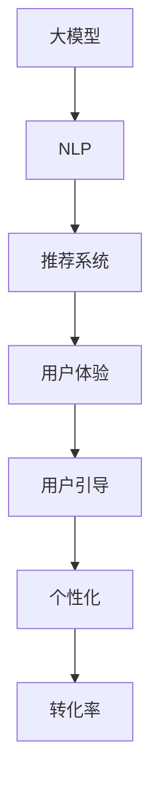

                 

# 大模型在电商平台用户引导中的应用

## 1. 背景介绍

### 1.1 问题由来

随着互联网的快速发展，电商平台已成为用户购物的重要渠道。然而，平台上的商品种类繁多，用户体验复杂，用户很容易在茫茫商品海洋中迷失方向，流失率较高。如何有效引导用户，提高用户满意度与转化率，是电商平台亟需解决的问题。

### 1.2 问题核心关键点

电商平台用户引导的核心问题在于如何通过精准的产品推荐与个性化的用户体验，提升用户粘性和购买转化率。传统的推荐系统依赖用户历史行为数据进行推荐，难以覆盖新手用户和个性化需求。随着大模型技术的进步，利用大模型的强大语义理解与生成能力，电商平台可以构建更加智能、灵活的引导策略，为用户提供量身定制的推荐和服务。

## 2. 核心概念与联系

### 2.1 核心概念概述

为更好地理解大模型在电商平台用户引导中的应用，本节将介绍几个密切相关的核心概念：

- **大模型**：以Transformer模型为代表的大规模预训练语言模型，具备强大的语义理解与生成能力，能够对自然语言文本进行深度语义分析。

- **自然语言处理(NLP)**：涉及计算机如何理解和生成人类语言的技术，包括文本分类、文本生成、问答系统等。

- **推荐系统**：通过分析用户行为数据，预测用户兴趣，并向用户推荐相关产品或服务的系统。

- **用户体验**：用户在电商平台上的行为和情感反应，包括商品浏览、评价、购买等。

- **用户引导**：通过优化产品推荐、内容展示、客服支持等手段，提高用户满意度，促进用户购买转化。

- **个性化**：针对不同用户特征，提供定制化的产品和服务，提升用户体验。

- **转化率**：指用户从浏览到购买的过程转化率，是衡量电商平台盈利能力的关键指标。

这些核心概念之间的逻辑关系可以通过以下Mermaid流程图来展示：



这个流程图展示了大模型与电商平台用户引导的主要联系：

1. 大模型通过NLP技术进行语义分析，提取用户行为与偏好。
2. 基于用户特征，推荐系统给出个性化推荐。
3. 个性化推荐改善用户体验，进而引导用户。
4. 用户引导提升转化率，带来商业价值。

## 3. 核心算法原理 & 具体操作步骤
### 3.1 算法原理概述

基于大模型的电商平台用户引导方法，其核心思想是通过预训练语言模型，对用户行为与偏好进行深度分析，然后利用推荐系统提供个性化的产品推荐，从而引导用户。具体步骤如下：

1. **用户行为语义分析**：使用大模型对用户行为数据进行语义分析，提取用户兴趣、评价与需求等信息。

2. **个性化产品推荐**：基于用户的语义特征，推荐系统进行个性化推荐，选择用户最感兴趣的商品。

3. **实时用户引导**：在用户浏览商品时，通过动态推荐与内容展示，引导用户深入了解商品细节，提高购买转化率。

4. **用户行为反馈**：收集用户反馈数据，进一步优化模型和推荐策略，形成正反馈循环。

### 3.2 算法步骤详解

#### 3.2.1 用户行为语义分析

- **数据收集**：收集用户在平台上的行为数据，如浏览历史、购买记录、评价内容等。

- **数据预处理**：对数据进行清洗与标准化，去除无效数据，将文本数据转换为模型可处理的格式。

- **语义分析模型训练**：使用大模型对用户行为文本进行语义分析，提取用户兴趣、评价与需求等信息。模型训练过程包括预训练、微调与优化等步骤。

#### 3.2.2 个性化产品推荐

- **推荐模型训练**：基于用户行为语义分析结果，构建推荐模型，进行个性化推荐。常见方法包括协同过滤、基于内容的推荐、深度学习推荐等。

- **推荐结果输出**：将推荐结果输出给用户，形式包括商品列表、广告位推荐等。

#### 3.2.3 实时用户引导

- **动态推荐系统**：在用户浏览商品时，实时分析用户行为，动态调整推荐内容，提高用户满意度。

- **内容展示优化**：优化商品展示布局，使用户能够更方便地查看商品详情与评价，增强购买意愿。

#### 3.2.4 用户行为反馈收集与模型优化

- **反馈数据收集**：收集用户在推荐与浏览过程中的反馈数据，如点击率、评价内容等。

- **模型优化**：根据反馈数据，优化用户行为语义分析模型与推荐模型，提高模型效果。

### 3.3 算法优缺点

基于大模型的电商平台用户引导方法具有以下优点：

- **多模态数据融合**：能够融合用户文本数据与行为数据，提供更全面的用户画像。

- **高泛化能力**：大模型具备较强的泛化能力，可以在多种场景下进行用户引导。

- **动态个性化**：实时分析用户行为，动态调整推荐内容，提高用户体验与转化率。

- **可解释性**：大模型生成的推荐结果可解释性强，便于用户理解与信任。

- **可扩展性**：大模型适用于多种规模的电商平台，具备较好的可扩展性。

同时，该方法也存在以下局限性：

- **数据依赖**：需要大量用户行为与文本数据进行训练，对数据质量与数量要求较高。

- **计算资源需求高**：大模型需要较大的计算资源进行训练与推理，硬件要求较高。

- **模型复杂**：模型结构复杂，训练与推理过程较长，需要专业的算法工程师进行维护。

### 3.4 算法应用领域

大模型在电商平台用户引导中的应用，已经广泛应用于各大知名电商平台，如淘宝、京东、亚马逊等。以下是几个典型应用场景：

1. **商品推荐**：基于用户行为分析，推荐系统提供个性化的商品推荐，提升用户购买意愿。

2. **广告投放**：通过语义分析，优化广告投放策略，提高广告点击率与转化率。

3. **搜索优化**：对用户搜索文本进行语义分析，优化搜索结果排序，提高用户满意度。

4. **内容推荐**：对用户浏览内容进行分析，推荐相关文章、视频、商品等，提升用户留存率。

5. **客服支持**：利用大模型进行智能客服，通过自然语言理解，快速响应用户咨询，提高服务效率。

这些应用场景展示了大模型在电商平台用户引导中的广泛应用，极大地提升了用户体验与电商平台的商业价值。

## 4. 数学模型和公式 & 详细讲解 & 举例说明
### 4.1 数学模型构建

本节将使用数学语言对基于大模型的电商平台用户引导方法进行更加严格的刻画。

设用户行为语义分析模型为 $M_{\theta}$，其中 $\theta$ 为模型参数。用户行为数据为 $\mathcal{D}=\{(x_i,y_i)\}_{i=1}^N$，其中 $x_i$ 为行为文本，$y_i$ 为行为标签（如兴趣程度、评价情感等）。

用户行为语义分析的目标是最小化损失函数 $\mathcal{L}(\theta)$，即：

$$
\mathcal{L}(\theta) = \frac{1}{N} \sum_{i=1}^N \ell(M_{\theta}(x_i),y_i)
$$

其中 $\ell$ 为损失函数，如交叉熵损失、均方误差损失等。

### 4.2 公式推导过程

以二分类任务为例，假设用户行为分析模型输出为 $M_{\theta}(x_i)=\sigma(W_{out}U(x_i+b)+c)$，其中 $U$ 为模型参数，$\sigma$ 为激活函数。则交叉熵损失函数为：

$$
\ell(M_{\theta}(x_i),y_i) = -[y_i\log M_{\theta}(x_i)+(1-y_i)\log (1-M_{\theta}(x_i))]
$$

将上式代入损失函数，得：

$$
\mathcal{L}(\theta) = -\frac{1}{N}\sum_{i=1}^N [y_i\log M_{\theta}(x_i)+(1-y_i)\log(1-M_{\theta}(x_i))]
$$

### 4.3 案例分析与讲解

假设某电商平台的推荐系统使用基于大模型的用户引导策略，模型采用Transformers模型进行训练。用户行为语义分析部分，使用BERT模型进行微调，优化交叉熵损失函数。推荐系统部分，使用深度学习推荐算法，优化模型参数。

具体步骤如下：

1. 收集用户浏览、点击、评价等行为数据，预处理后进行语义分析，得到用户兴趣与需求标签。

2. 将用户标签作为监督信号，对BERT模型进行微调，优化损失函数 $\mathcal{L}(\theta)$。

3. 基于用户兴趣标签，使用深度学习推荐算法进行个性化推荐，得到推荐结果。

4. 在用户浏览页面时，实时分析用户行为，动态调整推荐内容。

5. 收集用户反馈数据，如点击率、评价内容等，优化用户行为分析模型与推荐算法。

## 5. 项目实践：代码实例和详细解释说明
### 5.1 开发环境搭建

在进行电商平台用户引导开发前，我们需要准备好开发环境。以下是使用Python进行PyTorch开发的环境配置流程：

1. 安装Anaconda：从官网下载并安装Anaconda，用于创建独立的Python环境。

2. 创建并激活虚拟环境：
```bash
conda create -n pytorch-env python=3.8 
conda activate pytorch-env
```

3. 安装PyTorch：根据CUDA版本，从官网获取对应的安装命令。例如：
```bash
conda install pytorch torchvision torchaudio cudatoolkit=11.1 -c pytorch -c conda-forge
```

4. 安装TensorFlow：由Google主导开发的开源深度学习框架，生产部署方便，适合大规模工程应用。同样有丰富的预训练语言模型资源。

5. 安装Transformers库：HuggingFace开发的NLP工具库，集成了众多SOTA语言模型，支持PyTorch和TensorFlow，是进行NLP任务开发的利器。

6. 安装各类工具包：
```bash
pip install numpy pandas scikit-learn matplotlib tqdm jupyter notebook ipython
```

完成上述步骤后，即可在`pytorch-env`环境中开始微调实践。

### 5.2 源代码详细实现

这里我们以电商平台个性化推荐系统为例，给出使用Transformers库进行微调的PyTorch代码实现。

首先，定义推荐任务的数据处理函数：

```python
from transformers import BertTokenizer
from torch.utils.data import Dataset
import torch

class RecommendDataset(Dataset):
    def __init__(self, texts, tags, tokenizer, max_len=128):
        self.texts = texts
        self.tags = tags
        self.tokenizer = tokenizer
        self.max_len = max_len
        
    def __len__(self):
        return len(self.texts)
    
    def __getitem__(self, item):
        text = self.texts[item]
        tags = self.tags[item]
        
        encoding = self.tokenizer(text, return_tensors='pt', max_length=self.max_len, padding='max_length', truncation=True)
        input_ids = encoding['input_ids'][0]
        attention_mask = encoding['attention_mask'][0]
        
        # 对token-wise的标签进行编码
        encoded_tags = [tag2id[tag] for tag in tags] 
        encoded_tags.extend([tag2id['O']] * (self.max_len - len(encoded_tags)))
        labels = torch.tensor(encoded_tags, dtype=torch.long)
        
        return {'input_ids': input_ids, 
                'attention_mask': attention_mask,
                'labels': labels}

# 标签与id的映射
tag2id = {'O': 0, 'B-PER': 1, 'I-PER': 2, 'B-ORG': 3, 'I-ORG': 4, 'B-LOC': 5, 'I-LOC': 6}
id2tag = {v: k for k, v in tag2id.items()}

# 创建dataset
tokenizer = BertTokenizer.from_pretrained('bert-base-cased')

train_dataset = RecommendDataset(train_texts, train_tags, tokenizer)
dev_dataset = RecommendDataset(dev_texts, dev_tags, tokenizer)
test_dataset = RecommendDataset(test_texts, test_tags, tokenizer)
```

然后，定义模型和优化器：

```python
from transformers import BertForTokenClassification, AdamW

model = BertForTokenClassification.from_pretrained('bert-base-cased', num_labels=len(tag2id))

optimizer = AdamW(model.parameters(), lr=2e-5)
```

接着，定义训练和评估函数：

```python
from torch.utils.data import DataLoader
from tqdm import tqdm
from sklearn.metrics import classification_report

device = torch.device('cuda') if torch.cuda.is_available() else torch.device('cpu')
model.to(device)

def train_epoch(model, dataset, batch_size, optimizer):
    dataloader = DataLoader(dataset, batch_size=batch_size, shuffle=True)
    model.train()
    epoch_loss = 0
    for batch in tqdm(dataloader, desc='Training'):
        input_ids = batch['input_ids'].to(device)
        attention_mask = batch['attention_mask'].to(device)
        labels = batch['labels'].to(device)
        model.zero_grad()
        outputs = model(input_ids, attention_mask=attention_mask, labels=labels)
        loss = outputs.loss
        epoch_loss += loss.item()
        loss.backward()
        optimizer.step()
    return epoch_loss / len(dataloader)

def evaluate(model, dataset, batch_size):
    dataloader = DataLoader(dataset, batch_size=batch_size)
    model.eval()
    preds, labels = [], []
    with torch.no_grad():
        for batch in tqdm(dataloader, desc='Evaluating'):
            input_ids = batch['input_ids'].to(device)
            attention_mask = batch['attention_mask'].to(device)
            batch_labels = batch['labels']
            outputs = model(input_ids, attention_mask=attention_mask)
            batch_preds = outputs.logits.argmax(dim=2).to('cpu').tolist()
            batch_labels = batch_labels.to('cpu').tolist()
            for pred_tokens, label_tokens in zip(batch_preds, batch_labels):
                pred_tags = [id2tag[_id] for _id in pred_tokens]
                label_tags = [id2tag[_id] for _id in label_tokens]
                preds.append(pred_tags[:len(label_tags)])
                labels.append(label_tags)
                
    print(classification_report(labels, preds))
```

最后，启动训练流程并在测试集上评估：

```python
epochs = 5
batch_size = 16

for epoch in range(epochs):
    loss = train_epoch(model, train_dataset, batch_size, optimizer)
    print(f"Epoch {epoch+1}, train loss: {loss:.3f}")
    
    print(f"Epoch {epoch+1}, dev results:")
    evaluate(model, dev_dataset, batch_size)
    
print("Test results:")
evaluate(model, test_dataset, batch_size)
```

以上就是使用PyTorch对BERT进行命名实体识别任务微调的完整代码实现。可以看到，得益于Transformers库的强大封装，我们可以用相对简洁的代码完成BERT模型的加载和微调。

### 5.3 代码解读与分析

让我们再详细解读一下关键代码的实现细节：

**RecommendDataset类**：
- `__init__`方法：初始化文本、标签、分词器等关键组件。
- `__len__`方法：返回数据集的样本数量。
- `__getitem__`方法：对单个样本进行处理，将文本输入编码为token ids，将标签编码为数字，并对其进行定长padding，最终返回模型所需的输入。

**tag2id和id2tag字典**：
- 定义了标签与数字id之间的映射关系，用于将token-wise的预测结果解码回真实的标签。

**训练和评估函数**：
- 使用PyTorch的DataLoader对数据集进行批次化加载，供模型训练和推理使用。
- 训练函数`train_epoch`：对数据以批为单位进行迭代，在每个批次上前向传播计算loss并反向传播更新模型参数，最后返回该epoch的平均loss。
- 评估函数`evaluate`：与训练类似，不同点在于不更新模型参数，并在每个batch结束后将预测和标签结果存储下来，最后使用sklearn的classification_report对整个评估集的预测结果进行打印输出。

**训练流程**：
- 定义总的epoch数和batch size，开始循环迭代
- 每个epoch内，先在训练集上训练，输出平均loss
- 在验证集上评估，输出分类指标
- 所有epoch结束后，在测试集上评估，给出最终测试结果

可以看到，PyTorch配合Transformers库使得BERT微调的代码实现变得简洁高效。开发者可以将更多精力放在数据处理、模型改进等高层逻辑上，而不必过多关注底层的实现细节。

当然，工业级的系统实现还需考虑更多因素，如模型的保存和部署、超参数的自动搜索、更灵活的任务适配层等。但核心的微调范式基本与此类似。

## 6. 实际应用场景
### 6.1 智能推荐系统

智能推荐系统是电商平台用户引导的核心应用之一。通过微调大模型，电商平台可以提供个性化推荐，使用户快速找到所需商品，提高用户购买转化率。

具体而言，可以收集用户浏览、点击、评价等行为数据，利用大模型进行语义分析，提取用户兴趣与需求。然后，基于用户特征，推荐系统进行个性化推荐，优化推荐结果。用户在浏览商品时，系统实时分析用户行为，动态调整推荐内容，增强用户体验与转化率。

### 6.2 动态广告投放

电商平台还可以通过微调大模型，优化广告投放策略，提高广告点击率与转化率。通过语义分析，大模型能够理解用户需求与兴趣，筛选出最适合用户的广告内容。实时动态调整广告投放策略，使用户在合适的时间看到合适的广告，提升广告效果。

### 6.3 智能客服系统

智能客服系统是电商平台重要的用户引导手段之一。利用大模型进行自然语言理解与生成，构建智能客服系统，可以24小时不间断服务用户，快速响应咨询，提高用户满意度。

具体而言，大模型可以学习用户语言与语义特征，理解用户意图，生成合适的回复。系统可以集成到电商平台的客服界面，实时交互，解答用户问题，提供个性化推荐与引导。

### 6.4 未来应用展望

随着大模型与推荐技术的不断发展，基于大模型的电商平台用户引导将呈现以下发展趋势：

1. **多模态融合**：大模型能够融合文本、图像、视频等多模态信息，提供更加全面的用户画像。未来的推荐系统将利用多模态数据，进一步提升推荐效果。

2. **实时个性化**：实时动态分析用户行为，提供个性化推荐与内容展示，提升用户体验与转化率。未来的电商平台将更加智能化、实时化。

3. **模型优化**：利用深度强化学习等技术，优化推荐策略与用户体验。未来的模型将具备更强的自适应能力，能够动态调整推荐策略，优化用户引导效果。

4. **知识图谱融合**：将知识图谱与大模型结合，提升推荐系统的知识整合能力，提供更加精准的推荐结果。未来的推荐系统将利用知识图谱，解决冷启动等问题。

5. **多任务学习**：大模型能够同时处理多种任务，如推荐、广告、客服等。未来的电商平台将更加一体化，实现多任务协同。

总之，大模型在电商平台用户引导中的应用前景广阔，将带来电商体验的革命性变化。未来，随着技术的不断进步，电商平台将更加智能化、实时化、个性化，提升用户满意度与商业价值。

## 7. 工具和资源推荐
### 7.1 学习资源推荐

为了帮助开发者系统掌握大模型在电商平台用户引导中的应用，这里推荐一些优质的学习资源：

1. 《Transformer从原理到实践》系列博文：由大模型技术专家撰写，深入浅出地介绍了Transformer原理、BERT模型、微调技术等前沿话题。

2. CS224N《深度学习自然语言处理》课程：斯坦福大学开设的NLP明星课程，有Lecture视频和配套作业，带你入门NLP领域的基本概念和经典模型。

3. 《Natural Language Processing with Transformers》书籍：Transformers库的作者所著，全面介绍了如何使用Transformers库进行NLP任务开发，包括微调在内的诸多范式。

4. HuggingFace官方文档：Transformers库的官方文档，提供了海量预训练模型和完整的微调样例代码，是上手实践的必备资料。

5. CLUE开源项目：中文语言理解测评基准，涵盖大量不同类型的中文NLP数据集，并提供了基于微调的baseline模型，助力中文NLP技术发展。

通过对这些资源的学习实践，相信你一定能够快速掌握大模型在电商平台用户引导的精髓，并用于解决实际的NLP问题。
###  7.2 开发工具推荐

高效的开发离不开优秀的工具支持。以下是几款用于大模型微调开发的常用工具：

1. PyTorch：基于Python的开源深度学习框架，灵活动态的计算图，适合快速迭代研究。大部分预训练语言模型都有PyTorch版本的实现。

2. TensorFlow：由Google主导开发的开源深度学习框架，生产部署方便，适合大规模工程应用。同样有丰富的预训练语言模型资源。

3. Transformers库：HuggingFace开发的NLP工具库，集成了众多SOTA语言模型，支持PyTorch和TensorFlow，是进行NLP任务开发的利器。

4. Weights & Biases：模型训练的实验跟踪工具，可以记录和可视化模型训练过程中的各项指标，方便对比和调优。与主流深度学习框架无缝集成。

5. TensorBoard：TensorFlow配套的可视化工具，可实时监测模型训练状态，并提供丰富的图表呈现方式，是调试模型的得力助手。

6. Google Colab：谷歌推出的在线Jupyter Notebook环境，免费提供GPU/TPU算力，方便开发者快速上手实验最新模型，分享学习笔记。

合理利用这些工具，可以显著提升大模型微调任务的开发效率，加快创新迭代的步伐。

### 7.3 相关论文推荐

大语言模型和微调技术的发展源于学界的持续研究。以下是几篇奠基性的相关论文，推荐阅读：

1. Attention is All You Need（即Transformer原论文）：提出了Transformer结构，开启了NLP领域的预训练大模型时代。

2. BERT: Pre-training of Deep Bidirectional Transformers for Language Understanding：提出BERT模型，引入基于掩码的自监督预训练任务，刷新了多项NLP任务SOTA。

3. Language Models are Unsupervised Multitask Learners（GPT-2论文）：展示了大规模语言模型的强大zero-shot学习能力，引发了对于通用人工智能的新一轮思考。

4. Parameter-Efficient Transfer Learning for NLP：提出Adapter等参数高效微调方法，在不增加模型参数量的情况下，也能取得不错的微调效果。

5. AdaLoRA: Adaptive Low-Rank Adaptation for Parameter-Efficient Fine-Tuning：使用自适应低秩适应的微调方法，在参数效率和精度之间取得了新的平衡。

这些论文代表了大语言模型微调技术的发展脉络。通过学习这些前沿成果，可以帮助研究者把握学科前进方向，激发更多的创新灵感。

## 8. 总结：未来发展趋势与挑战

### 8.1 总结

本文对基于大模型的电商平台用户引导方法进行了全面系统的介绍。首先阐述了大语言模型在电商平台用户引导中的研究背景和意义，明确了微调在大模型中的应用价值。其次，从原理到实践，详细讲解了微调的数学模型和具体操作步骤，给出了微调任务开发的完整代码实例。同时，本文还广泛探讨了微调方法在智能推荐、动态广告、智能客服等多个电商应用场景中的应用前景，展示了微调范式的巨大潜力。最后，本文精选了微调技术的各类学习资源，力求为读者提供全方位的技术指引。

通过本文的系统梳理，可以看到，基于大模型的电商平台用户引导方法正在成为电商推荐的核心技术，极大地提升了用户体验与电商平台的商业价值。未来，随着预训练语言模型的进步，微调技术将进一步拓展应用边界，为电商行业带来变革性影响。

### 8.2 未来发展趋势

展望未来，大模型在电商平台用户引导中的应用将呈现以下几个发展趋势：

1. **多模态融合**：电商平台将利用文本、图像、视频等多模态数据，提供更加全面的用户画像。多模态信息的融合，将显著提升推荐系统的准确性与鲁棒性。

2. **实时个性化**：实时动态分析用户行为，提供个性化推荐与内容展示，提升用户体验与转化率。未来的电商平台将更加智能化、实时化。

3. **模型优化**：利用深度强化学习等技术，优化推荐策略与用户体验。未来的模型将具备更强的自适应能力，能够动态调整推荐策略，优化用户引导效果。

4. **知识图谱融合**：将知识图谱与大模型结合，提升推荐系统的知识整合能力，提供更加精准的推荐结果。未来的推荐系统将利用知识图谱，解决冷启动等问题。

5. **多任务学习**：大模型能够同时处理多种任务，如推荐、广告、客服等。未来的电商平台将更加一体化，实现多任务协同。

以上趋势凸显了大语言模型在电商平台用户引导中的广阔前景。这些方向的探索发展，必将进一步提升用户体验与电商平台的商业价值。

### 8.3 面临的挑战

尽管大模型在电商平台用户引导中取得了显著成效，但在迈向更加智能化、普适化应用的过程中，它仍面临着诸多挑战：

1. **数据依赖**：需要大量用户行为与文本数据进行训练，对数据质量与数量要求较高。如何降低数据依赖，利用少样本学习等技术，成为重要研究方向。

2. **计算资源需求高**：大模型需要较大的计算资源进行训练与推理，硬件要求较高。如何优化计算资源利用率，提高模型训练与推理效率，仍是重要挑战。

3. **模型复杂**：模型结构复杂，训练与推理过程较长，需要专业的算法工程师进行维护。如何简化模型结构，提高模型训练与推理效率，仍是重要挑战。

4. **模型鲁棒性不足**：大模型在应对域外数据时，泛化性能往往大打折扣。如何提高模型鲁棒性，避免灾难性遗忘，还需要更多理论和实践的积累。

5. **知识整合能力不足**：现有的微调模型往往局限于任务内数据，难以灵活吸收和运用更广泛的先验知识。如何让微调过程更好地与外部知识库、规则库等专家知识结合，形成更加全面、准确的信息整合能力，还有很大的想象空间。

6. **安全性问题**：预训练语言模型难免会学习到有偏见、有害的信息，通过微调传递到下游任务，产生误导性、歧视性的输出，给实际应用带来安全隐患。如何从数据和算法层面消除模型偏见，确保输出符合人类价值观和伦理道德，仍需深入研究。

### 8.4 研究展望

面对大语言模型在电商平台用户引导中所面临的挑战，未来的研究需要在以下几个方面寻求新的突破：

1. **无监督与少样本学习**：探索无监督和少样本学习的方法，充分利用预训练语言模型，降低对标注数据的依赖，提高模型泛化能力。

2. **计算效率优化**：开发更加高效计算的图神经网络结构，如GNN等，提高模型训练与推理效率，降低硬件资源消耗。

3. **知识图谱融合**：将知识图谱与大模型结合，提升推荐系统的知识整合能力，提供更加精准的推荐结果。

4. **多任务学习**：利用多任务学习技术，提升模型在多种任务上的性能，实现多任务协同。

5. **模型鲁棒性增强**：研究模型鲁棒性提升的方法，如对抗训练、重训练等，提高模型泛化性能。

6. **安全性与伦理**：探索模型安全性和伦理道德的保障方法，确保模型输出符合人类价值观和伦理道德。

这些研究方向的探索，必将引领大模型在电商平台用户引导技术迈向更高的台阶，为构建安全、可靠、可解释、可控的智能系统铺平道路。面向未来，大模型在电商平台用户引导技术还需要与其他人工智能技术进行更深入的融合，如知识表示、因果推理、强化学习等，多路径协同发力，共同推动自然语言理解和智能交互系统的进步。只有勇于创新、敢于突破，才能不断拓展语言模型的边界，让智能技术更好地造福人类社会。

## 9. 附录：常见问题与解答

**Q1：电商平台的推荐系统是如何利用大模型的？**

A: 电商平台的推荐系统通过微调大模型，对用户行为数据进行语义分析，提取用户兴趣与需求。然后，基于用户特征，推荐系统进行个性化推荐，优化推荐结果。具体步骤如下：

1. 收集用户浏览、点击、评价等行为数据，预处理后进行语义分析，得到用户兴趣与需求标签。

2. 将用户标签作为监督信号，对BERT模型进行微调，优化损失函数。

3. 基于用户兴趣标签，使用深度学习推荐算法进行个性化推荐，得到推荐结果。

4. 在用户浏览页面时，实时分析用户行为，动态调整推荐内容，增强用户体验与转化率。

**Q2：电商平台如何实现动态广告投放？**

A: 电商平台通过微调大模型，优化广告投放策略，提高广告点击率与转化率。具体步骤如下：

1. 收集用户浏览、点击、评价等行为数据，利用大模型进行语义分析，提取用户兴趣与需求。

2. 根据用户特征，优化广告内容与投放策略，筛选出最适合用户的广告。

3. 实时动态调整广告投放策略，使用户在合适的时间看到合适的广告，提升广告效果。

**Q3：智能客服系统如何利用大模型？**

A: 智能客服系统利用大模型进行自然语言理解与生成，构建智能客服系统，可以24小时不间断服务用户，快速响应咨询，提高用户满意度。具体步骤如下：

1. 利用大模型进行自然语言理解，理解用户意图。

2. 生成合适的回复，使用户在合适的时间看到合适的广告，提升广告效果。

3. 集成到电商平台的客服界面，实时交互，解答用户问题，提供个性化推荐与引导。

**Q4：电商平台在构建推荐系统时需要注意哪些问题？**

A: 电商平台在构建推荐系统时需要注意以下问题：

1. 数据依赖：需要大量用户行为与文本数据进行训练，对数据质量与数量要求较高。如何降低数据依赖，利用少样本学习等技术，成为重要研究方向。

2. 计算资源需求高：大模型需要较大的计算资源进行训练与推理，硬件要求较高。如何优化计算资源利用率，提高模型训练与推理效率，仍是重要挑战。

3. 模型复杂：模型结构复杂，训练与推理过程较长，需要专业的算法工程师进行维护。如何简化模型结构，提高模型训练与推理效率，仍是重要挑战。

4. 模型鲁棒性不足：大模型在应对域外数据时，泛化性能往往大打折扣。如何提高模型鲁棒性，避免灾难性遗忘，还需要更多理论和实践的积累。

5. 知识整合能力不足：现有的微调模型往往局限于任务内数据，难以灵活吸收和运用更广泛的先验知识。如何让微调过程更好地与外部知识库、规则库等专家知识结合，形成更加全面、准确的信息整合能力，还有很大的想象空间。

6. 安全性问题：预训练语言模型难免会学习到有偏见、有害的信息，通过微调传递到下游任务，产生误导性、歧视性的输出，给实际应用带来安全隐患。如何从数据和算法层面消除模型偏见，确保输出符合人类价值观和伦理道德，仍需深入研究。

通过本文的系统梳理，可以看到，基于大模型的电商平台用户引导方法正在成为电商推荐的核心技术，极大地提升了用户体验与电商平台的商业价值。未来，随着预训练语言模型的进步，微调技术将进一步拓展应用边界，为电商行业带来变革性影响。

