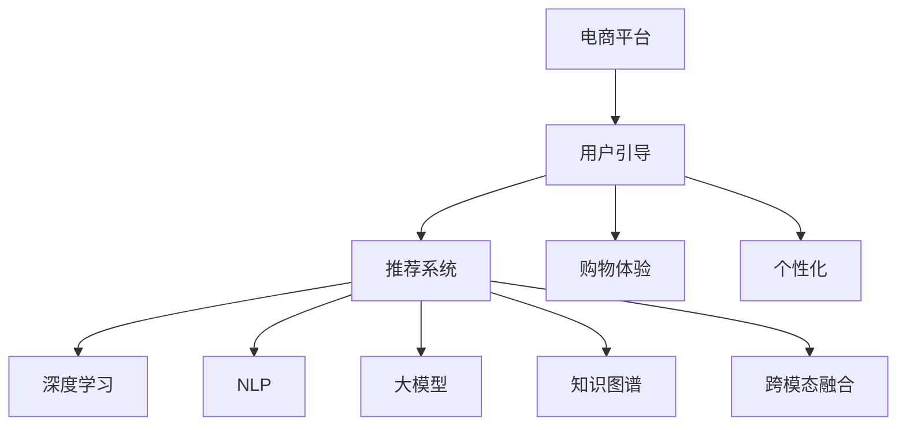

                 

# 大模型在电商平台用户引导中的应用

> 关键词：电商平台,用户引导,推荐系统,购物体验,个性化,深度学习,大模型,自然语言处理

## 1. 背景介绍

### 1.1 问题由来

随着电商平台的快速发展，如何提升用户体验、提高转化率、降低流失率，成为各电商企业面临的共同挑战。传统的推荐系统基于用户行为数据，存在冷启动和长尾问题，难以有效满足个性化需求。

为了更好地服务用户，电商平台引入大模型进行用户引导，帮助用户更便捷地找到所需商品，提升购物体验。基于大模型的用户引导方法，通过自然语言处理(NLP)和深度学习技术，从语义和行为两个维度理解用户需求，生成个性化的商品推荐和购物指导，提升用户黏性和消费转化。

### 1.2 问题核心关键点

大模型在电商平台用户引导的应用，核心在于：

1. **用户意图的自然语言理解**：通过大模型解析用户的自然语言输入，自动抽取意图，挖掘用户的潜在需求。
2. **上下文感知推荐**：基于用户历史行为、实时场景数据，结合大模型推荐算法，生成个性化的商品和内容推荐。
3. **购物指南生成**：利用大模型生成自然流畅的购物指导文本，提升用户体验。
4. **知识图谱融合**：通过大模型与知识图谱的结合，增强推荐和指南的逻辑性和准确性。
5. **跨模态融合**：将视觉、音频等多模态信息与文本信息融合，提升推荐的全面性和直观性。

## 2. 核心概念与联系

### 2.1 核心概念概述

为更好地理解大模型在电商平台用户引导中的应用，本节将介绍几个密切相关的核心概念：

- **电商平台**：通过网络销售商品的电子商务平台，如淘宝、京东、亚马逊等。
- **用户引导**：通过推荐系统、搜索排序等手段，提升用户购物体验，降低流失率，提高转化率。
- **推荐系统**：根据用户历史行为和实时数据，推荐用户可能感兴趣的商品或内容。
- **购物体验**：用户在浏览、购买商品过程中的满意度、便利性和愉悦度。
- **个性化**：针对不同用户设计个性化的推荐和引导方案。
- **深度学习**：基于神经网络结构的机器学习方法，能够从大量数据中学习特征。
- **自然语言处理(NLP)**：处理和理解人类语言的技术，包括文本分类、情感分析、语言生成等。
- **大模型**：大规模预训练语言模型，如BERT、GPT等，具备强大的语言理解能力和生成能力。
- **知识图谱**：结构化的知识库，记录实体和实体之间的关系。
- **跨模态融合**：将不同模态的数据进行融合，提高推荐的全面性和准确性。

这些核心概念之间的逻辑关系可以通过以下Mermaid流程图来展示：



这个流程图展示了大模型在电商平台用户引导的关键概念及其之间的关系：

1. 电商平台通过推荐系统对用户进行引导，提升用户体验。
2. 推荐系统依赖深度学习和NLP技术，通过大模型进行个性化推荐和上下文感知。
3. 大模型结合知识图谱和跨模态数据，增强推荐和购物引导的逻辑性和全面性。

## 3. 核心算法原理 & 具体操作步骤
### 3.1 算法原理概述

基于大模型的电商平台用户引导方法，其核心思想是：

1. **用户意图抽取**：利用大模型解析用户的自然语言输入，自动抽取用户的意图和需求。
2. **上下文感知推荐**：根据用户历史行为和实时场景数据，结合大模型推荐算法，生成个性化的商品和内容推荐。
3. **购物指南生成**：利用大模型生成自然流畅的购物指导文本，提升用户体验。
4. **知识图谱融合**：通过大模型与知识图谱的结合，增强推荐和指南的逻辑性和准确性。
5. **跨模态融合**：将视觉、音频等多模态信息与文本信息融合，提升推荐的全面性和直观性。

### 3.2 算法步骤详解

基于大模型的电商平台用户引导方法，主要包括以下几个关键步骤：

**Step 1: 数据准备**
- 收集用户的历史行为数据、实时搜索数据、评论数据等，构建电商平台用户行为数据库。
- 收集用户的自然语言输入，如搜索关键词、购物指南等，构建自然语言数据库。

**Step 2: 意图抽取**
- 使用大模型（如BERT、GPT等）对用户的自然语言输入进行解析，抽取用户的意图和需求。
- 通过BiLSTM、GRU等序列模型对抽取结果进行进一步处理，提高抽取精度。

**Step 3: 上下文感知推荐**
- 使用大模型对用户历史行为数据进行编码，生成用户行为向量。
- 结合实时场景数据（如时间、地点、商品类别等），生成实时场景向量。
- 通过Transformer模型对用户行为向量和场景向量进行融合，生成上下文感知向量。
- 使用MLP、Attention等网络对上下文感知向量进行处理，生成商品推荐列表。

**Step 4: 购物指南生成**
- 使用大模型对用户的自然语言输入进行语义理解和生成，生成购物指导文本。
- 结合知识图谱信息，对购物指导文本进行优化，提高准确性和逻辑性。

**Step 5: 跨模态融合**
- 将用户的视觉信息（如图片、视频等）与文本信息融合，生成多模态推荐结果。
- 将用户的音频信息（如语音指令、背景音乐等）与文本信息融合，生成多模态购物指南。

**Step 6: 模型评估与优化**
- 使用A/B测试等方法评估推荐和购物指导的效果，收集用户反馈数据。
- 根据用户反馈数据，不断优化模型参数和推荐算法，提升用户体验和满意度。

### 3.3 算法优缺点

基于大模型的电商平台用户引导方法具有以下优点：

1. **强大的自然语言处理能力**：大模型能够自动理解用户输入的自然语言，抽取用户的意图和需求。
2. **上下文感知推荐**：结合用户历史行为和实时场景数据，生成个性化的商品推荐，提升用户体验。
3. **智能购物指导**：利用大模型生成自然流畅的购物指导文本，提升用户满意度。
4. **知识图谱融合**：通过与知识图谱的结合，增强推荐和购物指导的逻辑性和准确性。
5. **跨模态融合**：将不同模态的数据进行融合，提高推荐的全面性和直观性。

同时，该方法也存在一定的局限性：

1. **对标注数据的依赖**：意图抽取需要大量标注数据进行训练，收集和标注这些数据成本较高。
2. **模型复杂度**：大模型的计算资源和存储空间需求较大，对服务器配置有较高要求。
3. **上下文理解**：实时场景数据的收集和处理可能存在偏差，影响上下文感知的准确性。
4. **推荐算法多样性**：推荐算法的选择和优化需要丰富的经验和知识，对开发者要求较高。
5. **用户隐私**：用户行为数据和自然语言输入的收集和使用需要遵守隐私保护规定。

尽管存在这些局限性，但就目前而言，基于大模型的用户引导方法仍是最主流范式。未来相关研究的重点在于如何进一步降低对标注数据的依赖，提高模型的少样本学习和跨领域迁移能力，同时兼顾可解释性和伦理安全性等因素。

### 3.4 算法应用领域

基于大模型的电商平台用户引导方法，在多个领域得到广泛应用，如：

- **商品推荐**：基于用户的搜索历史和行为数据，生成个性化商品推荐。
- **购物指南生成**：帮助用户找到所需商品，生成详细购物指南。
- **实时搜索排序**：根据用户输入的搜索关键词，生成上下文感知的搜索结果排序。
- **智能客服**：利用大模型进行自然语言处理，自动回答用户咨询，提升客户满意度。
- **个性化营销**：结合用户兴趣和行为数据，生成个性化广告和推荐内容。

除了上述这些经典应用外，大模型在电商平台的应用还包括智能定价、库存管理、供应链优化等，为电商平台的运营提供更高效、智能的支持。

## 4. 数学模型和公式 & 详细讲解 & 举例说明
### 4.1 数学模型构建

本节将使用数学语言对基于大模型的电商平台用户引导方法进行更加严格的刻画。

记用户输入的自然语言为 $x$，用户的意图标签为 $y$，电商平台行为数据库为 $\mathcal{D}$，知识图谱为 $\mathcal{G}$。假设大模型的参数为 $\theta$。

定义用户意图抽取模型的损失函数为：
$$
L_{intent}(\theta) = -\frac{1}{N}\sum_{(x_i,y_i) \in \mathcal{D}} \log p(y_i | x_i, \theta)
$$

其中 $p(y_i | x_i, \theta)$ 为模型在输入 $x_i$ 下输出 $y_i$ 的概率。

定义上下文感知推荐模型的损失函数为：
$$
L_{contextual}(\theta) = -\frac{1}{N}\sum_{(x_i,y_i) \in \mathcal{D}} \log p(r_i | x_i, \theta)
$$

其中 $r_i$ 为用户 $i$ 的推荐列表。

定义购物指南生成模型的损失函数为：
$$
L_{guide}(\theta) = -\frac{1}{N}\sum_{(x_i,y_i) \in \mathcal{D}} \log p(g_i | x_i, \theta)
$$

其中 $g_i$ 为用户 $i$ 的购物指南。

定义知识图谱融合模型的损失函数为：
$$
L_{knowledge}(\theta) = -\frac{1}{N}\sum_{(x_i,y_i) \in \mathcal{D}} \log p(k_i | x_i, \theta)
$$

其中 $k_i$ 为用户 $i$ 推荐商品对应的知识图谱节点。

### 4.2 公式推导过程

以下我们以推荐系统为例，推导基于大模型的上下文感知推荐模型的损失函数及其梯度的计算公式。

假设推荐系统的大模型为 $M_{\theta}$，输入为用户的意图 $y_i$ 和行为数据 $\mathcal{D}_i$，输出为推荐列表 $r_i$。假设推荐列表为 $r_i = \{r_i^1, r_i^2, \dots, r_i^n\}$。

定义推荐列表的损失函数为：
$$
L_{contextual}(\theta) = -\frac{1}{N}\sum_{i=1}^N \sum_{j=1}^n \log p(r_i^j | y_i, \mathcal{D}_i, \theta)
$$

其中 $p(r_i^j | y_i, \mathcal{D}_i, \theta)$ 为模型在输入 $y_i$ 和行为数据 $\mathcal{D}_i$ 下，推荐商品 $r_i^j$ 的概率。

根据链式法则，损失函数对参数 $\theta$ 的梯度为：
$$
\frac{\partial L_{contextual}(\theta)}{\partial \theta} = -\frac{1}{N}\sum_{i=1}^N \sum_{j=1}^n \frac{\partial \log p(r_i^j | y_i, \mathcal{D}_i, \theta)}{\partial \theta}
$$

将 $p(r_i^j | y_i, \mathcal{D}_i, \theta)$ 带入，并递归展开，得到：
$$
\frac{\partial L_{contextual}(\theta)}{\partial \theta} = -\frac{1}{N}\sum_{i=1}^N \sum_{j=1}^n \left( \frac{\partial \log \frac{p(r_i^j | y_i, \mathcal{D}_i, \theta)}{p(r_i^j)} + \frac{\partial \log p(r_i^j)}{\partial \theta} \right)
$$

其中 $\frac{\partial \log p(r_i^j)}{\partial \theta}$ 为推荐列表的生成概率对参数 $\theta$ 的梯度，可通过自动微分技术高效计算。

在得到损失函数的梯度后，即可带入优化算法进行模型训练。重复上述过程直至收敛，最终得到适应电商平台的推荐模型参数 $\theta^*$。

## 5. 项目实践：代码实例和详细解释说明
### 5.1 开发环境搭建

在进行电商平台用户引导方法开发前，我们需要准备好开发环境。以下是使用Python进行TensorFlow开发的环境配置流程：

1. 安装Anaconda：从官网下载并安装Anaconda，用于创建独立的Python环境。

2. 创建并激活虚拟环境：
```bash
conda create -n tf-env python=3.8 
conda activate tf-env
```

3. 安装TensorFlow：根据CUDA版本，从官网获取对应的安装命令。例如：
```bash
conda install tensorflow-gpu -c tf
```

4. 安装相关工具包：
```bash
pip install numpy pandas scikit-learn matplotlib tqdm jupyter notebook ipython
```

完成上述步骤后，即可在`tf-env`环境中开始电商平台用户引导方法的开发。

### 5.2 源代码详细实现

下面以推荐系统为例，给出使用TensorFlow对大模型进行上下文感知推荐开发的PyTorch代码实现。

首先，定义推荐系统的大模型：

```python
import tensorflow as tf
from tensorflow.keras import layers

model = tf.keras.Sequential([
    layers.Dense(128, activation='relu', input_shape=(num_features,)),
    layers.Dense(num_products, activation='softmax')
])
```

其中，num_features为输入特征数量，num_products为商品数量。

然后，定义损失函数和优化器：

```python
loss_fn = tf.keras.losses.SparseCategoricalCrossentropy(from_logits=True)

optimizer = tf.keras.optimizers.Adam(learning_rate=0.001)
```

接着，定义训练和评估函数：

```python
def train_epoch(model, dataset, batch_size, optimizer):
    for x, y in dataset:
        with tf.GradientTape() as tape:
            logits = model(x)
            loss = loss_fn(y, logits)
        gradients = tape.gradient(loss, model.trainable_variables)
        optimizer.apply_gradients(zip(gradients, model.trainable_variables))
        
def evaluate(model, dataset, batch_size):
    correct = tf.keras.metrics.SparseCategoricalAccuracy('accuracy')
    for x, y in dataset:
        logits = model(x)
        predictions = tf.argmax(logits, axis=1)
        correct.update_state(y, predictions)
    return correct.result().numpy()
```

最后，启动训练流程并在测试集上评估：

```python
epochs = 10
batch_size = 128

for epoch in range(epochs):
    train_epoch(model, train_dataset, batch_size, optimizer)
    
    print(f"Epoch {epoch+1}, train loss: {loss_fn(y, model(x)):.3f}")
    evaluate(model, dev_dataset, batch_size)
    
print("Test results:")
evaluate(model, test_dataset, batch_size)
```

以上就是使用TensorFlow对大模型进行上下文感知推荐系统的完整代码实现。可以看到，通过TensorFlow和Keras的简洁API，大模型的开发和训练变得异常方便。

### 5.3 代码解读与分析

让我们再详细解读一下关键代码的实现细节：

**Sequential模型**：
- 定义了一个由两个Dense层构成的神经网络，第一层输出128个神经元，第二层输出商品数量num_products个神经元，并采用softmax激活函数输出概率分布。

**SparseCategoricalCrossentropy损失函数**：
- 使用稀疏分类交叉熵损失函数，用于计算预测结果与真实标签之间的差异。

**Adam优化器**：
- 使用Adam优化器，设置学习率为0.001，用于更新模型参数。

**训练函数train_epoch**：
- 在每个epoch内，对训练集进行迭代训练，计算模型输出和损失函数，并使用梯度下降更新模型参数。

**评估函数evaluate**：
- 在验证集上计算模型预测结果与真实标签的匹配度，使用准确率作为评估指标。

**训练流程**：
- 定义总的epoch数和batch size，开始循环迭代
- 每个epoch内，先在训练集上训练，输出训练损失
- 在验证集上评估，输出模型准确率
- 所有epoch结束后，在测试集上评估，给出最终测试结果

可以看到，TensorFlow和Keras的简洁API使得大模型的开发和训练变得异常方便。开发者可以将更多精力放在数据处理、模型改进等高层逻辑上，而不必过多关注底层的实现细节。

当然，工业级的系统实现还需考虑更多因素，如模型的保存和部署、超参数的自动搜索、更灵活的任务适配层等。但核心的微调范式基本与此类似。

## 6. 实际应用场景
### 6.1 智能客服系统

基于大模型的电商平台智能客服系统，通过自然语言处理(NLP)技术，帮助用户快速解决问题，提升用户体验。在技术实现上，可以收集平台客服对话记录，将其作为监督数据，训练模型进行自然语言理解，自动生成回答。

在用户输入查询后，智能客服系统利用大模型解析用户输入，抽取意图和需求。然后，结合知识图谱和实时场景数据，生成相应的回答。对于用户提出的新问题，可以接入检索系统实时搜索相关内容，动态组织生成回答。如此构建的智能客服系统，能显著提升客户咨询体验和问题解决效率。

### 6.2 个性化推荐系统

电商平台个性化推荐系统，通过大模型理解用户行为和需求，生成个性化的商品和内容推荐。在技术实现上，可以收集用户浏览、点击、评论、分享等行为数据，提取和商品相关的文本内容。将文本内容作为模型输入，用户的后续行为（如是否点击、购买等）作为监督信号，在此基础上微调预训练语言模型。微调后的模型能够从文本内容中准确把握用户的兴趣点。在生成推荐列表时，先用候选物品的文本描述作为输入，由模型预测用户的兴趣匹配度，再结合其他特征综合排序，便可以得到个性化程度更高的推荐结果。

### 6.3 实时搜索排序

电商平台的实时搜索排序系统，通过大模型解析用户的搜索关键词，生成上下文感知的搜索结果排序。在技术实现上，可以收集用户的搜索历史和行为数据，结合实时场景数据（如时间、地点、商品类别等），利用大模型进行上下文感知推荐，生成个性化的搜索结果排序。

### 6.4 未来应用展望

随着大语言模型和用户引导方法的发展，未来在电商平台的应用将更加广泛，为电商平台的运营提供更高效、智能的支持。

在智慧零售领域，大模型将帮助电商平台进行供应链优化、库存管理、需求预测等，提升运营效率和市场竞争力。

在社交电商领域，大模型将帮助电商平台进行个性化推荐、内容生成、智能客服等，提升用户体验和平台粘性。

在虚拟现实(VR)和增强现实(AR)电商领域，大模型将帮助电商平台进行沉浸式购物体验、智能导购等，开创新的消费模式。

## 7. 工具和资源推荐
### 7.1 学习资源推荐

为了帮助开发者系统掌握大语言模型在电商平台用户引导中的应用，这里推荐一些优质的学习资源：

1. 《深度学习与NLP》系列博文：由大模型技术专家撰写，深入浅出地介绍了深度学习与NLP的基本概念和前沿技术。

2. 《自然语言处理综述》课程：斯坦福大学开设的NLP明星课程，涵盖了NLP领域的经典算法和实际应用，是入门NLP领域的必备课程。

3. 《深度学习在NLP中的应用》书籍：系统介绍了深度学习在NLP中的典型应用，包括文本分类、情感分析、机器翻译等。

4. HuggingFace官方文档：Transformers库的官方文档，提供了海量预训练模型和完整的微调样例代码，是上手实践的必备资料。

5. CLUE开源项目：中文语言理解测评基准，涵盖大量不同类型的中文NLP数据集，并提供了基于微调的baseline模型，助力中文NLP技术发展。

通过对这些资源的学习实践，相信你一定能够快速掌握大模型在电商平台用户引导中的应用精髓，并用于解决实际的NLP问题。

### 7.2 开发工具推荐

高效的开发离不开优秀的工具支持。以下是几款用于电商平台用户引导开发的常用工具：

1. TensorFlow：基于Python的开源深度学习框架，灵活动态的计算图，适合快速迭代研究。支持GPU/TPU等高性能设备，适用于大规模工程应用。

2. PyTorch：基于Python的开源深度学习框架，动态计算图，适合灵活构建和训练模型。同样支持GPU/TPU等高性能设备，具备强大的计算能力。

3. Keras：基于TensorFlow和Theano的高级API，简单易用的模型构建工具，适合快速原型开发和模型评估。

4. Weights & Biases：模型训练的实验跟踪工具，可以记录和可视化模型训练过程中的各项指标，方便对比和调优。与主流深度学习框架无缝集成。

5. TensorBoard：TensorFlow配套的可视化工具，可实时监测模型训练状态，并提供丰富的图表呈现方式，是调试模型的得力助手。

6. Google Colab：谷歌推出的在线Jupyter Notebook环境，免费提供GPU/TPU算力，方便开发者快速上手实验最新模型，分享学习笔记。

合理利用这些工具，可以显著提升电商平台用户引导的开发效率，加快创新迭代的步伐。

### 7.3 相关论文推荐

大语言模型和用户引导方法的发展源于学界的持续研究。以下是几篇奠基性的相关论文，推荐阅读：

1. Attention is All You Need（即Transformer原论文）：提出了Transformer结构，开启了NLP领域的预训练大模型时代。

2. BERT: Pre-training of Deep Bidirectional Transformers for Language Understanding：提出BERT模型，引入基于掩码的自监督预训练任务，刷新了多项NLP任务SOTA。

3. Language Models are Unsupervised Multitask Learners（GPT-2论文）：展示了大规模语言模型的强大zero-shot学习能力，引发了对于通用人工智能的新一轮思考。

4. Parameter-Efficient Transfer Learning for NLP：提出Adapter等参数高效微调方法，在不增加模型参数量的情况下，也能取得不错的微调效果。

5. Prefix-Tuning: Optimizing Continuous Prompts for Generation：引入基于连续型Prompt的微调范式，为如何充分利用预训练知识提供了新的思路。

6. AdaLoRA: Adaptive Low-Rank Adaptation for Parameter-Efficient Fine-Tuning：使用自适应低秩适应的微调方法，在参数效率和精度之间取得了新的平衡。

这些论文代表了大模型在电商平台用户引导技术的发展脉络。通过学习这些前沿成果，可以帮助研究者把握学科前进方向，激发更多的创新灵感。

## 8. 总结：未来发展趋势与挑战

### 8.1 总结

本文对基于大模型的电商平台用户引导方法进行了全面系统的介绍。首先阐述了电商平台的背景和面临的挑战，明确了用户引导在提升用户体验、提高转化率、降低流失率方面的独特价值。其次，从原理到实践，详细讲解了基于大模型的用户引导方法的核心算法和操作步骤，给出了微调任务开发的完整代码实例。同时，本文还广泛探讨了用户引导方法在智能客服、个性化推荐、实时搜索排序等多个领域的应用前景，展示了微调范式的巨大潜力。

通过本文的系统梳理，可以看到，基于大模型的电商平台用户引导方法正在成为电商领域的重要范式，极大地拓展了用户引导的应用边界，催生了更多的落地场景。受益于大模型的强大语言理解和生成能力，用户引导技术在提高用户满意度、降低运营成本方面发挥了显著作用。未来，伴随大语言模型和微调方法的持续演进，相信用户引导技术也将不断提升，为电商平台的可持续发展提供更强的动力。

### 8.2 未来发展趋势

展望未来，电商平台用户引导技术将呈现以下几个发展趋势：

1. **智能化水平提升**：随着大模型的不断优化，用户引导技术将具备更强的自然语言理解能力、上下文感知能力和跨模态融合能力，提升推荐和购物引导的智能化水平。

2. **个性化程度加深**：通过更好的模型训练和参数优化，用户引导技术将能够更精准地理解用户需求，提供更个性化的推荐和购物指导。

3. **实时响应增强**：结合实时数据和边缘计算技术，用户引导系统将具备更强的实时响应能力，满足用户的即时需求。

4. **多模态融合**：将视觉、音频等多模态信息与文本信息融合，提升推荐的全面性和直观性，创建更丰富的用户体验。

5. **知识图谱融合**：通过与知识图谱的结合，增强推荐和购物指导的逻辑性和准确性，提升系统的高阶认知能力。

6. **自动化水平提升**：引入自动化调参、自动化模型管理等技术，提升系统的可运营性和可维护性。

以上趋势凸显了电商平台用户引导技术的广阔前景。这些方向的探索发展，必将进一步提升用户引导系统的性能和用户体验，推动电商平台走向智能化、个性化、实时化的方向。

### 8.3 面临的挑战

尽管电商平台用户引导技术已经取得了显著成就，但在迈向更加智能化、普适化应用的过程中，它仍面临诸多挑战：

1. **数据质量问题**：用户行为数据和自然语言输入的质量对推荐和购物引导的效果有直接影响。数据清洗和标注需要耗费大量时间和精力，难以保证数据的准确性和多样性。

2. **模型复杂性**：大模型的计算资源和存储空间需求较大，对服务器配置有较高要求。模型训练和推理过程中，可能面临计算资源不足、数据传输延迟等问题。

3. **上下文理解难度**：实时场景数据的收集和处理可能存在偏差，影响上下文感知的准确性。不同用户在不同情境下的需求和行为模式差异较大，难以统一建模。

4. **推荐算法多样性**：推荐算法的选择和优化需要丰富的经验和知识，对开发者要求较高。不同算法在不同场景下的效果差异较大，难以找到一个通用的最优解。

5. **用户隐私保护**：用户行为数据和自然语言输入的收集和使用需要遵守隐私保护规定。如何平衡数据利用和隐私保护，是一个重要难题。

6. **系统稳定性**：大模型的鲁棒性和可靠性需要不断优化，避免在数据分布变化或噪声干扰时出现性能波动。

正视用户引导面临的这些挑战，积极应对并寻求突破，将是大模型在电商平台用户引导技术迈向成熟的必由之路。相信随着学界和产业界的共同努力，这些挑战终将一一被克服，用户引导技术也将迎来更加智能、高效、稳定的未来。

### 8.4 研究展望

面对电商平台用户引导所面临的种种挑战，未来的研究需要在以下几个方面寻求新的突破：

1. **多任务联合学习**：将推荐、搜索排序、智能客服等多个任务联合训练，提升模型的综合能力和泛化能力。

2. **自监督学习**：探索无监督或半监督学习方式，利用自监督任务训练大模型，降低对标注数据的依赖。

3. **迁移学习**：将预训练大模型的知识迁移到电商平台用户引导任务中，提高模型泛化能力和少样本学习能力。

4. **因果推断**：引入因果推断方法，分析推荐和购物引导的因果关系，提升系统的透明度和可解释性。

5. **多模态融合**：结合视觉、音频等多模态信息，提升推荐的全面性和直观性，创建更丰富的用户体验。

6. **跨领域迁移**：通过多领域任务的联合训练，增强模型在不同场景下的适应能力和迁移能力。

这些研究方向将引领电商平台用户引导技术迈向更高的台阶，为构建更智能、更个性化的电商平台提供强有力的技术支持。面向未来，用户引导技术还将与其他人工智能技术进行更深入的融合，如知识表示、因果推理、强化学习等，协同发力，共同推动电商平台的智能化进程。

## 9. 附录：常见问题与解答

**Q1：电商平台的用户引导方法是否可以应用于其他领域？**

A: 电商平台的用户引导方法在原理上与自然语言理解和上下文感知推荐密切相关，因此可以应用于多个领域。例如，金融领域可以用于推荐理财产品，教育领域可以用于推荐学习资源，医疗领域可以用于推荐诊疗方案等。

**Q2：如何平衡推荐模型的个性化和普适性？**

A: 推荐模型的个性化和普适性是相辅相成的。在个性化推荐中，可以通过模型训练数据的丰富性和多样性，提升模型的泛化能力，使其在更广泛场景下具有较好的表现。同时，利用用户画像和行为特征，在个性化推荐中融入更多的通用规则和约束，避免过度个性化带来的不良影响。

**Q3：电商平台用户引导中的实时数据如何处理？**

A: 电商平台的实时数据处理涉及数据采集、存储、传输等多个环节。需要采用分布式系统和流式计算技术，确保数据的实时性和准确性。同时，结合缓存技术和异步处理机制，降低系统延迟和资源消耗。

**Q4：电商平台用户引导的推荐算法有哪些？**

A: 电商平台用户引导的推荐算法包括协同过滤、基于内容的推荐、基于矩阵分解的推荐、基于深度学习的推荐等。不同的算法在不同的场景下可能有不同的表现，选择合适的算法需要根据具体任务和数据特点进行灵活组合。

**Q5：电商平台用户引导的系统架构是怎样的？**

A: 电商平台用户引导的系统架构通常包括数据收集、数据处理、模型训练、模型推理等多个模块。数据收集模块负责从不同渠道获取用户数据和商品数据；数据处理模块对数据进行清洗、标注、融合等操作；模型训练模块通过微调大模型进行推荐和购物引导的优化；模型推理模块根据用户输入生成推荐列表和购物指南。

通过本文的系统梳理，可以看到，基于大模型的电商平台用户引导方法正在成为电商领域的重要范式，极大地拓展了用户引导的应用边界，催生了更多的落地场景。受益于大模型的强大语言理解和生成能力，用户引导技术在提高用户满意度、降低运营成本方面发挥了显著作用。未来，伴随大语言模型和微调方法的持续演进，相信用户引导技术也将不断提升，为电商平台的可持续发展提供更强的动力。

---

作者：禅与计算机程序设计艺术 / Zen and the Art of Computer Programming

