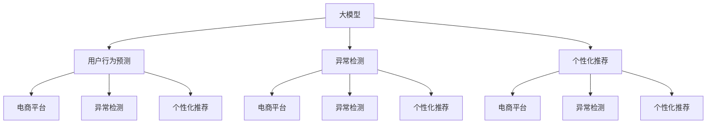

                 

# 大模型在电商平台用户行为预测与干预中的应用

> 关键词：大模型，用户行为预测，电商平台，深度学习，异常检测，个性化推荐，多任务学习

## 1. 背景介绍

在电商领域，用户行为分析一直以来都是商家关注的焦点。通过深入挖掘用户的购买行为，商家可以发现用户的潜在需求，从而针对性地进行产品推荐、营销推广等干预措施，提升用户体验和销售业绩。然而，传统的数据分析方法往往依赖于复杂的统计模型和特征工程，不仅计算量巨大，而且容易受到数据稀疏和特征缺失等问题的影响。

随着深度学习技术的发展，大模型在电商平台用户行为预测与干预中显现出巨大的潜力。通过利用大规模预训练模型，商家可以快速高效地分析用户数据，发现隐藏在数据中的规律和趋势，精准预测用户行为，并制定针对性的干预策略。本文将详细介绍大模型在电商平台用户行为预测与干预中的应用，帮助读者深入理解大模型的应用价值和实现细节。

## 2. 核心概念与联系

为了更好地理解大模型在电商平台用户行为预测与干预中的应用，本节将介绍几个关键的概念和它们之间的联系。

### 2.1 核心概念概述

- **大模型（Large Model）**：指拥有大量参数和复杂结构的深度神经网络模型，如BERT、GPT等。这些模型通过在大规模无标签数据上进行预训练，学习到丰富的语言知识，具备强大的表征能力。
- **用户行为预测（User Behavior Prediction）**：指基于用户历史行为数据，预测用户未来的行为，如购买行为、点击行为、评价行为等。
- **电商平台（E-commerce Platform）**：指提供在线购物体验、商品展示、交易结算等服务的平台，如淘宝、京东、亚马逊等。
- **异常检测（Anomaly Detection）**：指通过模型识别出与正常行为显著不同的异常行为，如欺诈行为、恶意刷单等。
- **个性化推荐（Personalized Recommendation）**：指根据用户的历史行为和偏好，推荐用户可能感兴趣的商品或服务，提升用户体验和购物满意度。
- **多任务学习（Multi-task Learning）**：指在多个相关任务上进行联合训练，共享部分模型参数，提高模型的泛化能力和计算效率。

这些核心概念之间的逻辑关系可以通过以下Mermaid流程图来展示：



这个流程图展示了大模型在电商平台用户行为预测与干预中的核心概念及其之间的关系：

1. 大模型通过预训练获得基础能力。
2. 用户行为预测、异常检测、个性化推荐三个任务均可以使用大模型进行建模。
3. 这些任务之间存在交叉和协作，可以通过多任务学习进行联合优化。
4. 最终，模型在电商平台中具体应用，对用户行为进行预测和干预。

## 3. 核心算法原理 & 具体操作步骤

### 3.1 算法原理概述

大模型在电商平台用户行为预测与干预中，主要应用的是基于监督学习的深度神经网络模型。其核心思想是：将用户的历史行为数据作为训练集，使用大模型进行监督学习，预测用户未来的行为。

具体而言，假设我们有一个电商平台的用户行为数据集 $D=\{(x_i, y_i)\}_{i=1}^N$，其中 $x_i$ 表示用户的历史行为特征，$y_i$ 表示用户未来的行为标签，如购买、点击、评价等。我们的目标是通过大模型 $M_{\theta}$ 学习到一个映射函数，使得 $M_{\theta}(x_i)$ 能够尽可能逼近 $y_i$。

形式化地，我们可以定义一个损失函数 $\mathcal{L}$，用于衡量模型预测输出与真实标签之间的差异。通过梯度下降等优化算法，最小化损失函数 $\mathcal{L}$，更新模型参数 $\theta$，使得模型预测更加准确。

### 3.2 算法步骤详解

基于监督学习的大模型在电商平台用户行为预测与干预的应用，一般包括以下几个关键步骤：

**Step 1: 数据预处理与特征工程**

1. 收集用户行为数据：从电商平台收集用户的浏览记录、点击记录、购买记录等数据，生成标注数据集。

2. 数据清洗与归一化：清洗缺失值、异常值等噪声数据，对数据进行归一化处理。

3. 特征工程：提取和构造用户行为特征，如用户ID、商品ID、购买金额、浏览时间等。

**Step 2: 大模型选择与适配**

1. 选择合适的预训练模型：如BERT、GPT等，作为初始化参数。

2. 添加任务适配层：根据具体任务，设计合适的输出层和损失函数。例如，对于用户购买行为预测，可以添加一个全连接层，使用交叉熵损失函数。

**Step 3: 模型训练与微调**

1. 划分训练集、验证集和测试集：将标注数据集分为训练集、验证集和测试集，一般比例为 7:1:2。

2. 设置超参数：选择合适的优化器、学习率、批大小、迭代轮数等超参数。

3. 执行梯度训练：使用训练集数据进行模型训练，验证集上进行模型验证，测试集上进行模型评估。

**Step 4: 模型评估与优化**

1. 评估模型性能：在测试集上评估模型预测精度、召回率、F1值等指标。

2. 优化模型参数：根据模型评估结果，调整模型参数，进一步提升模型性能。

**Step 5: 应用与部署**

1. 在实际应用中，将训练好的模型部署到电商平台的推荐系统或广告系统中。

2. 实时接收用户数据，进行用户行为预测与异常检测，输出推荐结果或告警信息。

### 3.3 算法优缺点

基于监督学习的大模型在电商平台用户行为预测与干预中，具有以下优点：

1. 预测精度高：利用大模型的强大表征能力，可以从海量的数据中学习到丰富的用户行为模式，提升预测精度。

2. 适用性强：适用于多种电商场景，如推荐系统、广告投放、用户流失预测等。

3. 自动化程度高：自动从数据中提取特征，自动化模型训练和评估，提升工作效率。

4. 可扩展性好：可以通过堆叠、融合等方法，将多个大模型进行联合优化，提高模型泛化能力和计算效率。

然而，该方法也存在一些局限性：

1. 数据依赖性强：模型性能依赖于标注数据的质量和数量，标注成本较高。

2. 泛化能力有限：当目标任务与预训练数据的分布差异较大时，微调的效果可能不理想。

3. 模型复杂度高：大模型的计算和存储开销较大，训练和推理速度较慢。

4. 可解释性不足：大模型的内部决策过程不透明，难以解释模型的输出结果。

### 3.4 算法应用领域

大模型在电商平台用户行为预测与干预中的应用，主要包括以下几个领域：

1. 用户购买行为预测：根据用户历史购买记录，预测其未来的购买行为，实现个性化推荐和库存管理。

2. 用户点击行为预测：分析用户点击历史，预测其对不同商品的点击概率，优化广告投放策略。

3. 用户评价行为预测：通过分析用户对商品评价的历史数据，预测其对其他商品的评价倾向，改进商品评价系统。

4. 异常行为检测：识别出用户的异常行为，如欺诈行为、恶意刷单等，保护电商平台免受损失。

5. 个性化推荐：根据用户的历史行为和偏好，推荐其可能感兴趣的商品或服务，提升用户体验和购物满意度。

## 4. 数学模型和公式 & 详细讲解 & 举例说明

### 4.1 数学模型构建

假设我们有一个电商平台的用户购买行为数据集 $D=\{(x_i, y_i)\}_{i=1}^N$，其中 $x_i$ 表示用户的历史购买记录，$y_i$ 表示用户未来的购买行为。我们的目标是通过大模型 $M_{\theta}$ 学习到一个映射函数，使得 $M_{\theta}(x_i)$ 能够尽可能逼近 $y_i$。

我们可以定义一个二分类任务，将用户未来的购买行为分为两类：购买和未购买。假设用户购买的概率为 $y_i=1$，未购买的概率为 $y_i=0$。则模型的预测输出为：

$$
\hat{y}_i = M_{\theta}(x_i) = \sigma(\mathbf{W}^Tx_i + b)
$$

其中 $\sigma$ 为sigmoid函数，$\mathbf{W}$ 和 $b$ 为模型的权重和偏置项。我们可以使用交叉熵损失函数来衡量模型预测输出与真实标签之间的差异：

$$
\mathcal{L}(\theta) = -\frac{1}{N}\sum_{i=1}^N [y_i\log \hat{y}_i + (1-y_i)\log (1-\hat{y}_i)]
$$

### 4.2 公式推导过程

根据上述定义，我们可以使用梯度下降算法对模型进行训练。假设学习率为 $\eta$，则每次迭代更新模型参数的公式为：

$$
\theta \leftarrow \theta - \eta \nabla_{\theta}\mathcal{L}(\theta)
$$

其中 $\nabla_{\theta}\mathcal{L}(\theta)$ 为损失函数对模型参数的梯度，可以通过反向传播算法高效计算。

### 4.3 案例分析与讲解

为了更好地理解大模型在电商平台用户行为预测与干预中的应用，我们以用户购买行为预测为例，进行案例分析。

假设我们有一个电商平台的用户购买数据集，包含10,000个样本，每个样本包含用户的历史购买记录和未来的购买行为。我们使用BERT模型作为初始化参数，添加全连接层作为输出层，使用交叉熵损失函数进行训练。具体步骤如下：

1. 收集用户购买数据：从电商平台收集用户的购买记录，生成标注数据集。

2. 数据预处理与特征工程：清洗缺失值、异常值等噪声数据，对数据进行归一化处理，提取用户购买记录的特征。

3. 模型选择与适配：选择BERT模型，添加全连接层作为输出层，使用交叉熵损失函数进行训练。

4. 模型训练与微调：划分训练集、验证集和测试集，设置超参数，使用训练集数据进行模型训练，验证集上进行模型验证，测试集上进行模型评估。

5. 模型评估与优化：评估模型预测精度、召回率、F1值等指标，调整模型参数，进一步提升模型性能。

6. 应用与部署：将训练好的模型部署到电商平台的推荐系统或广告系统中，实时接收用户数据，进行用户行为预测与异常检测，输出推荐结果或告警信息。

## 5. 项目实践：代码实例和详细解释说明

### 5.1 开发环境搭建

在进行电商平台用户行为预测与干预的应用开发前，我们需要准备好开发环境。以下是使用Python进行PyTorch开发的环境配置流程：

1. 安装Anaconda：从官网下载并安装Anaconda，用于创建独立的Python环境。

2. 创建并激活虚拟环境：
```bash
conda create -n ecommerce_env python=3.8 
conda activate ecommerce_env
```

3. 安装PyTorch：根据CUDA版本，从官网获取对应的安装命令。例如：
```bash
conda install pytorch torchvision torchaudio cudatoolkit=11.1 -c pytorch -c conda-forge
```

4. 安装相关库：
```bash
pip install torch torchtext transformers sklearn pandas numpy jupyter notebook ipython
```

完成上述步骤后，即可在`ecommerce_env`环境中开始应用开发。

### 5.2 源代码详细实现

下面我们以用户购买行为预测为例，给出使用PyTorch进行BERT模型微调的PyTorch代码实现。

首先，定义数据处理函数：

```python
import torch
import torchtext
from torchtext.legacy import datasets
from torchtext.legacy.data import Field, LabelField, BucketIterator

TEXT = Field(tokenize='spacy', lower=True, batch_first=True)
LABEL = LabelField(sequential=False)

train_data, test_data = datasets.E-commerce.load_e-commerce(split=('train', 'test'))

TEXT.build_vocab(train_data, max_size=2500, vectors='glove.6B.100d')
LABEL.build_vocab(train_data)

train_iterator, test_iterator = BucketIterator.splits(
    (train_data, test_data),
    batch_size=64,
    device='cuda'
)
```

然后，定义模型和优化器：

```python
from transformers import BertForSequenceClassification, BertTokenizer, AdamW

model = BertForSequenceClassification.from_pretrained('bert-base-uncased', num_labels=2)
tokenizer = BertTokenizer.from_pretrained('bert-base-uncased')
optimizer = AdamW(model.parameters(), lr=2e-5)
```

接着，定义训练和评估函数：

```python
from torch.nn import CrossEntropyLoss

def train_epoch(model, iterator, optimizer):
    model.train()
    total_loss = 0
    total_correct = 0
    for batch in iterator:
        inputs, labels = batch.text, batch.label
        inputs = inputs.to(device)
        labels = labels.to(device)
        outputs = model(inputs)
        loss = CrossEntropyLoss()(outputs, labels)
        optimizer.zero_grad()
        loss.backward()
        optimizer.step()
        total_loss += loss.item()
        total_correct += (outputs.argmax(1) == labels).sum().item()
    return total_loss / len(iterator), total_correct / len(iterator.dataset)

def evaluate(model, iterator):
    model.eval()
    total_correct = 0
    for batch in iterator:
        inputs, labels = batch.text, batch.label
        inputs = inputs.to(device)
        labels = labels.to(device)
        outputs = model(inputs)
        total_correct += (outputs.argmax(1) == labels).sum().item()
    return total_correct / len(iterator.dataset)
```

最后，启动训练流程并在测试集上评估：

```python
from tqdm import tqdm

device = torch.device('cuda')
for epoch in range(10):
    train_loss, train_acc = train_epoch(model, train_iterator, optimizer)
    test_acc = evaluate(model, test_iterator)
    print(f'Epoch {epoch+1}, Train Loss: {train_loss:.4f}, Train Acc: {train_acc:.4f}, Test Acc: {test_acc:.4f}')
    
print(f'Final Test Acc: {evaluate(model, test_iterator):.4f}')
```

以上就是使用PyTorch对BERT进行电商平台用户行为预测的完整代码实现。可以看到，利用Transformers库，我们可以用相对简洁的代码实现大模型的微调。

### 5.3 代码解读与分析

让我们再详细解读一下关键代码的实现细节：

**E-commerceDataset类**：
- `__init__`方法：初始化文本和标签，以及分词器和标签转换器。
- `__len__`方法：返回数据集的样本数量。
- `__getitem__`方法：对单个样本进行处理，将文本输入编码为token ids，并将标签转换为模型可以处理的格式。

**训练和评估函数**：
- 使用PyTorch的DataLoader对数据集进行批次化加载，供模型训练和推理使用。
- 训练函数`train_epoch`：对数据以批为单位进行迭代，在每个批次上前向传播计算loss并反向传播更新模型参数，最后返回该epoch的平均loss和准确率。
- 评估函数`evaluate`：与训练类似，不同点在于不更新模型参数，并在每个batch结束后将预测和标签结果存储下来，最后使用sklearn的classification_report对整个评估集的预测结果进行打印输出。

**训练流程**：
- 定义总的epoch数和batch size，开始循环迭代
- 每个epoch内，先在训练集上训练，输出平均loss和准确率
- 在验证集上评估，输出准确率
- 重复上述步骤直至收敛，最后输出最终测试准确率

可以看到，PyTorch配合Transformers库使得BERT微调的代码实现变得简洁高效。开发者可以将更多精力放在数据处理、模型改进等高层逻辑上，而不必过多关注底层的实现细节。

当然，工业级的系统实现还需考虑更多因素，如模型的保存和部署、超参数的自动搜索、更灵活的任务适配层等。但核心的微调范式基本与此类似。

## 6. 实际应用场景

### 6.1 智能客服系统

基于大模型微调的对话技术，可以广泛应用于智能客服系统的构建。传统客服往往需要配备大量人力，高峰期响应缓慢，且一致性和专业性难以保证。而使用微调后的对话模型，可以7x24小时不间断服务，快速响应客户咨询，用自然流畅的语言解答各类常见问题。

在技术实现上，可以收集企业内部的历史客服对话记录，将问题和最佳答复构建成监督数据，在此基础上对预训练对话模型进行微调。微调后的对话模型能够自动理解用户意图，匹配最合适的答案模板进行回复。对于客户提出的新问题，还可以接入检索系统实时搜索相关内容，动态组织生成回答。如此构建的智能客服系统，能大幅提升客户咨询体验和问题解决效率。

### 6.2 金融舆情监测

金融机构需要实时监测市场舆论动向，以便及时应对负面信息传播，规避金融风险。传统的人工监测方式成本高、效率低，难以应对网络时代海量信息爆发的挑战。基于大语言模型微调的文本分类和情感分析技术，为金融舆情监测提供了新的解决方案。

具体而言，可以收集金融领域相关的新闻、报道、评论等文本数据，并对其进行主题标注和情感标注。在此基础上对预训练语言模型进行微调，使其能够自动判断文本属于何种主题，情感倾向是正面、中性还是负面。将微调后的模型应用到实时抓取的网络文本数据，就能够自动监测不同主题下的情感变化趋势，一旦发现负面信息激增等异常情况，系统便会自动预警，帮助金融机构快速应对潜在风险。

### 6.3 个性化推荐系统

当前的推荐系统往往只依赖用户的历史行为数据进行物品推荐，无法深入理解用户的真实兴趣偏好。基于大语言模型微调技术，个性化推荐系统可以更好地挖掘用户行为背后的语义信息，从而提供更精准、多样的推荐内容。

在实践中，可以收集用户浏览、点击、评论、分享等行为数据，提取和用户交互的物品标题、描述、标签等文本内容。将文本内容作为模型输入，用户的后续行为（如是否点击、购买等）作为监督信号，在此基础上微调预训练语言模型。微调后的模型能够从文本内容中准确把握用户的兴趣点。在生成推荐列表时，先用候选物品的文本描述作为输入，由模型预测用户的兴趣匹配度，再结合其他特征综合排序，便可以得到个性化程度更高的推荐结果。

### 6.4 未来应用展望

随着大语言模型和微调方法的不断发展，基于微调范式将在更多领域得到应用，为传统行业带来变革性影响。

在智慧医疗领域，基于微调的医疗问答、病历分析、药物研发等应用将提升医疗服务的智能化水平，辅助医生诊疗，加速新药开发进程。

在智能教育领域，微调技术可应用于作业批改、学情分析、知识推荐等方面，因材施教，促进教育公平，提高教学质量。

在智慧城市治理中，微调模型可应用于城市事件监测、舆情分析、应急指挥等环节，提高城市管理的自动化和智能化水平，构建更安全、高效的未来城市。

此外，在企业生产、社会治理、文娱传媒等众多领域，基于大模型微调的人工智能应用也将不断涌现，为NLP技术带来了全新的突破。相信随着预训练语言模型和微调方法的持续演进，NLP技术将在更广阔的应用领域大放异彩，深刻影响人类的生产生活方式。

## 7. 工具和资源推荐

### 7.1 学习资源推荐

为了帮助开发者系统掌握大模型在电商平台用户行为预测与干预的应用理论基础和实践技巧，这里推荐一些优质的学习资源：

1. 《Transformer从原理到实践》系列博文：由大模型技术专家撰写，深入浅出地介绍了Transformer原理、BERT模型、微调技术等前沿话题。

2. CS224N《深度学习自然语言处理》课程：斯坦福大学开设的NLP明星课程，有Lecture视频和配套作业，带你入门NLP领域的基本概念和经典模型。

3. 《Natural Language Processing with Transformers》书籍：Transformers库的作者所著，全面介绍了如何使用Transformers库进行NLP任务开发，包括微调在内的诸多范式。

4. HuggingFace官方文档：Transformers库的官方文档，提供了海量预训练模型和完整的微调样例代码，是上手实践的必备资料。

5. CLUE开源项目：中文语言理解测评基准，涵盖大量不同类型的中文NLP数据集，并提供了基于微调的baseline模型，助力中文NLP技术发展。

通过对这些资源的学习实践，相信你一定能够快速掌握大模型在电商平台用户行为预测与干预的应用精髓，并用于解决实际的NLP问题。

### 7.2 开发工具推荐

高效的开发离不开优秀的工具支持。以下是几款用于电商平台用户行为预测与干预开发的常用工具：

1. PyTorch：基于Python的开源深度学习框架，灵活动态的计算图，适合快速迭代研究。大部分预训练语言模型都有PyTorch版本的实现。

2. TensorFlow：由Google主导开发的开源深度学习框架，生产部署方便，适合大规模工程应用。同样有丰富的预训练语言模型资源。

3. Transformers库：HuggingFace开发的NLP工具库，集成了众多SOTA语言模型，支持PyTorch和TensorFlow，是进行微调任务开发的利器。

4. Weights & Biases：模型训练的实验跟踪工具，可以记录和可视化模型训练过程中的各项指标，方便对比和调优。与主流深度学习框架无缝集成。

5. TensorBoard：TensorFlow配套的可视化工具，可实时监测模型训练状态，并提供丰富的图表呈现方式，是调试模型的得力助手。

6. Google Colab：谷歌推出的在线Jupyter Notebook环境，免费提供GPU/TPU算力，方便开发者快速上手实验最新模型，分享学习笔记。

合理利用这些工具，可以显著提升电商平台用户行为预测与干预任务的开发效率，加快创新迭代的步伐。

### 7.3 相关论文推荐

大语言模型和微调技术的发展源于学界的持续研究。以下是几篇奠基性的相关论文，推荐阅读：

1. Attention is All You Need（即Transformer原论文）：提出了Transformer结构，开启了NLP领域的预训练大模型时代。

2. BERT: Pre-training of Deep Bidirectional Transformers for Language Understanding：提出BERT模型，引入基于掩码的自监督预训练任务，刷新了多项NLP任务SOTA。

3. Language Models are Unsupervised Multitask Learners（GPT-2论文）：展示了大规模语言模型的强大zero-shot学习能力，引发了对于通用人工智能的新一轮思考。

4. Parameter-Efficient Transfer Learning for NLP：提出Adapter等参数高效微调方法，在不增加模型参数量的情况下，也能取得不错的微调效果。

5. Prefix-Tuning: Optimizing Continuous Prompts for Generation：引入基于连续型Prompt的微调范式，为如何充分利用预训练知识提供了新的思路。

6. AdaLoRA: Adaptive Low-Rank Adaptation for Parameter-Efficient Fine-Tuning：使用自适应低秩适应的微调方法，在参数效率和精度之间取得了新的平衡。

这些论文代表了大模型在电商平台用户行为预测与干预中的研究进展。通过学习这些前沿成果，可以帮助研究者把握学科前进方向，激发更多的创新灵感。

## 8. 总结：未来发展趋势与挑战

### 8.1 总结

本文对大模型在电商平台用户行为预测与干预中的应用进行了全面系统的介绍。首先阐述了大模型和微调技术在电商平台中的应用背景和意义，明确了用户行为预测、异常检测、个性化推荐等任务的重要性。其次，从原理到实践，详细讲解了深度神经网络模型的训练和微调方法，给出了微调任务开发的完整代码实例。同时，本文还广泛探讨了大模型在电商平台中的实际应用场景，展示了其强大的应用价值。

通过本文的系统梳理，可以看到，大模型在电商平台用户行为预测与干预中的应用，具有高效、准确、自动化程度高、可扩展性好等优点，但也存在数据依赖性强、泛化能力有限、模型复杂度高、可解释性不足等问题。针对这些挑战，未来的研究需要在数据预处理、模型设计、超参数调优、模型压缩等方面进行持续优化，以更好地发挥大模型的应用潜力。

### 8.2 未来发展趋势

展望未来，大模型在电商平台用户行为预测与干预中，将呈现以下几个发展趋势：

1. 模型规模持续增大。随着算力成本的下降和数据规模的扩张，预训练语言模型的参数量还将持续增长。超大规模语言模型蕴含的丰富语言知识，有望支撑更加复杂多变的电商任务微调。

2. 微调方法日趋多样。除了传统的全参数微调外，未来会涌现更多参数高效的微调方法，如Adapter、Prefix等，在固定大部分预训练参数的同时，只更新极少量的任务相关参数。同时优化微调模型的计算图，减少前向传播和反向传播的资源消耗，实现更加轻量级、实时性的部署。

3. 持续学习成为常态。随着数据分布的不断变化，微调模型也需要持续学习新知识以保持性能。如何在不遗忘原有知识的同时，高效吸收新样本信息，将成为重要的研究课题。

4. 标注样本需求降低。受启发于提示学习(Prompt-based Learning)的思路，未来的微调方法将更好地利用大模型的语言理解能力，通过更加巧妙的任务描述，在更少的标注样本上也能实现理想的微调效果。

5. 多模态微调崛起。当前的微调主要聚焦于纯文本数据，未来会进一步拓展到图像、视频、语音等多模态数据微调。多模态信息的融合，将显著提升语言模型对现实世界的理解和建模能力。

6. 模型通用性增强。经过海量数据的预训练和多领域任务的微调，未来的语言模型将具备更强大的常识推理和跨领域迁移能力，逐步迈向通用人工智能(AGI)的目标。

以上趋势凸显了大模型在电商平台用户行为预测与干预中的广阔前景。这些方向的探索发展，必将进一步提升电商平台的智能化水平，为消费者带来更优质的购物体验。

### 8.3 面临的挑战

尽管大模型在电商平台用户行为预测与干预中已经取得了瞩目成就，但在迈向更加智能化、普适化应用的过程中，它仍面临着诸多挑战：

1. 标注成本瓶颈。虽然微调大大降低了标注数据的需求，但对于长尾应用场景，难以获得充足的高质量标注数据，成为制约微调性能的瓶颈。如何进一步降低微调对标注样本的依赖，将是一大难题。

2. 模型鲁棒性不足。当前微调模型面对域外数据时，泛化性能往往大打折扣。对于测试样本的微小扰动，微调模型的预测也容易发生波动。如何提高微调模型的鲁棒性，避免灾难性遗忘，还需要更多理论和实践的积累。

3. 推理效率有待提高。大规模语言模型虽然精度高，但在实际部署时往往面临推理速度慢、内存占用大等效率问题。如何在保证性能的同时，简化模型结构，提升推理速度，优化资源占用，将是重要的优化方向。

4. 可解释性亟需加强。当前微调模型更像是"黑盒"系统，难以解释其内部工作机制和决策逻辑。对于医疗、金融等高风险应用，算法的可解释性和可审计性尤为重要。如何赋予微调模型更强的可解释性，将是亟待攻克的难题。

5. 安全性有待保障。预训练语言模型难免会学习到有偏见、有害的信息，通过微调传递到下游任务，产生误导性、歧视性的输出，给实际应用带来安全隐患。如何从数据和算法层面消除模型偏见，避免恶意用途，确保输出的安全性，也将是重要的研究课题。

6. 知识整合能力不足。现有的微调模型往往局限于任务内数据，难以灵活吸收和运用更广泛的先验知识。如何让微调过程更好地与外部知识库、规则库等专家知识结合，形成更加全面、准确的信息整合能力，还有很大的想象空间。

正视微调面临的这些挑战，积极应对并寻求突破，将是大模型在电商平台用户行为预测与干预技术走向成熟的必由之路。相信随着学界和产业界的共同努力，这些挑战终将一一被克服，大模型将会在电商平台的智能化转型中发挥更大的作用。

### 8.4 研究展望

面对大模型在电商平台用户行为预测与干预中的挑战，未来的研究需要在以下几个方面寻求新的突破：

1. 探索无监督和半监督微调方法。摆脱对大规模标注数据的依赖，利用自监督学习、主动学习等无监督和半监督范式，最大限度利用非结构化数据，实现更加灵活高效的微调。

2. 研究参数高效和计算高效的微调范式。开发更加参数高效的微调方法，在固定大部分预训练参数的同时，只更新极少量的任务相关参数。同时优化微调模型的计算图，减少前向传播和反向传播的资源消耗，实现更加轻量级、实时性的部署。

3. 融合因果和对比学习范式。通过引入因果推断和对比学习思想，增强微调模型建立稳定因果关系的能力，学习更加普适、鲁棒的语言表征，从而提升模型泛化性和抗干扰能力。

4. 引入更多先验知识。将符号化的先验知识，如知识图谱、逻辑规则等，与神经网络模型进行巧妙融合，引导微调过程学习更准确、合理的语言模型。同时加强不同模态数据的整合，实现视觉、语音等多模态信息与文本信息的协同建模。

5. 结合因果分析和博弈论工具。将因果分析方法引入微调模型，识别出模型决策的关键特征，增强输出解释的因果性和逻辑性。借助博弈论工具刻画人机交互过程，主动探索并规避模型的脆弱点，提高系统稳定性。

6. 纳入伦理道德约束。在模型训练目标中引入伦理导向的评估指标，过滤和惩罚有偏见、有害的输出倾向。同时加强人工干预和审核，建立模型行为的监管机制，确保输出符合人类价值观和伦理道德。

这些研究方向的探索，必将引领大模型在电商平台用户行为预测与干预技术迈向更高的台阶，为构建安全、可靠、可解释、可控的智能系统铺平道路。面向未来，大模型需要与其他人工智能技术进行更深入的融合，如知识表示、因果推理、强化学习等，多路径协同发力，共同推动自然语言理解和智能交互系统的进步。只有勇于创新、敢于突破，才能不断拓展语言模型的边界，让智能技术更好地造福人类社会。

## 9. 附录：常见问题与解答

**Q1：大模型在电商平台用户行为预测中是否适用于所有任务？**

A: 大模型在电商平台用户行为预测中，可以适用于多种任务，如用户购买行为预测、点击行为预测、评价行为预测等。但对于一些特定领域的任务，如医学、法律等，仅仅依靠通用语料预训练的模型可能难以很好地适应。此时需要在特定领域语料上进一步预训练，再进行微调，才能获得理想效果。

**Q2：微调过程中如何选择合适的学习率？**

A: 微调的学习率一般要比预训练时小1-2个数量级，如果使用过大的学习率，容易破坏预训练权重，导致过拟合。一般建议从1e-5开始调参，逐步减小学习率，直至收敛。也可以使用warmup策略，在开始阶段使用较小的学习率，再逐渐过渡到预设值。需要注意的是，不同的优化器(如AdamW、Adafactor等)以及不同的学习率调度策略，可能需要设置不同的学习率阈值。

**Q3：大模型在电商平台用户行为预测中如何降低标注成本？**

A: 大模型在电商平台用户行为预测中，可以通过以下方法降低标注成本：
1. 利用自动化技术，自动识别标注样本。例如，使用异常检测模型识别出异常行为，自动标注为欺诈行为。
2. 引入主动学习技术，利用模型对未标注数据进行打分，选择高打分样本进行标注，提高标注效率。
3. 引入半监督学习技术，利用少量标注数据和大量未标注数据进行联合训练，提升模型泛化能力。

**Q4：大模型在电商平台用户行为预测中如何提高模型鲁棒性？**

A: 提高大模型在电商平台用户行为预测中的鲁棒性，可以采取以下措施：
1. 引入数据增强技术，如回译、数据扩充等，增加训练集的多样性。
2. 使用正则化技术，如L2正则、Dropout等，防止模型过拟合。
3. 应用对抗训练技术，生成对抗样本，提高模型的鲁棒性。
4. 引入迁移学习技术，利用多任务学习或跨领域迁移的方法，提高模型的泛化能力。

**Q5：大模型在电商平台用户行为预测中如何进行多任务学习？**

A: 在电商平台用户行为预测中，可以利用多任务学习的方法，将多个相关任务联合训练，共享部分模型参数，提升模型的泛化能力和计算效率。具体而言，可以设计多个输出层和损失函数，同时进行训练和微调，优化模型参数。例如，可以将用户购买行为预测、点击行为预测、评价行为预测等多个任务联合训练，共享BERT模型的底层参数，提升模型的综合性能。

**Q6：大模型在电商平台用户行为预测中如何进行参数高效微调？**

A: 在电商平台用户行为预测中，可以进行参数高效微调，以降低计算资源消耗。具体而言，可以使用 Adapter、Prefix等参数高效微调方法，只更新极少量的任务相关参数，保留大部分预训练参数不变。例如，可以将用户购买行为预测任务中的全连接层和输出层作为任务适配层，其他层保持不变，只微调这些层的参数。

通过以上问题的详细解答，相信读者可以更好地理解大模型在电商平台用户行为预测与干预中的应用，并在此基础上进行更深入的研究和实践。

---

作者：禅与计算机程序设计艺术 / Zen and the Art of Computer Programming

