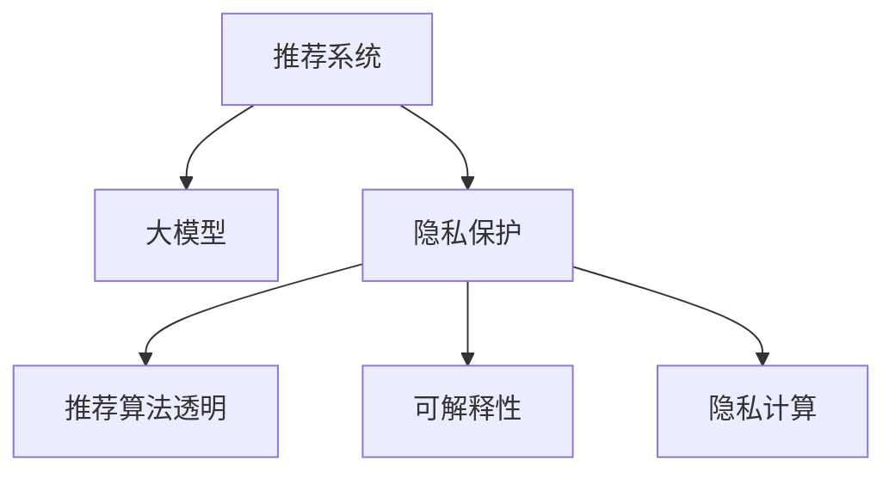

                 

# 大模型在解决推荐系统隐私保护问题上的潜力

## 1. 背景介绍

### 1.1 问题由来

在互联网时代，推荐系统（Recommendation System, RS）已经成为了各大电商平台和在线服务提供商的重要组成部分。通过分析用户的浏览历史、搜索记录、评价数据等，推荐系统能够为用户提供个性化的商品或内容推荐，提升用户满意度和平台活跃度。然而，这种基于数据的个性化推荐背后，却隐藏着严峻的隐私保护问题。

用户数据是推荐系统的核心资产，但用户在享受个性化服务的同时，也面临着数据被滥用、泄露甚至被用于歧视性分析的风险。传统的推荐系统通常会收集和存储大量的用户数据，而用户往往对这些数据的使用方式缺乏透明度和控制权。例如，2018年的Cambridge Analytica丑闻揭示了用户数据在政治选举中的应用，以及数据泄露可能带来的社会问题。

面对隐私保护的挑战，如何在不泄露用户数据的前提下，提供优质的推荐服务，成为了亟需解决的难题。近年来，基于大模型的推荐系统开始受到越来越多的关注，其隐私保护特性成为该领域的重要研究课题。

## 2. 核心概念与联系

### 2.1 核心概念概述

为了更好地理解大模型在隐私保护推荐系统中的应用，本节将介绍几个密切相关的核心概念：

- 推荐系统（Recommendation System, RS）：通过用户行为数据预测用户兴趣，推荐个性化商品或内容的系统。推荐系统包括协同过滤、基于内容的推荐、混合推荐等多种方法。

- 大模型（Large Model）：指具有大规模参数量和高度复杂结构的深度神经网络模型，如BERT、GPT等。大模型通常用于表示复杂语义和知识结构，能够在多领域和多任务上获得优异的表现。

- 隐私保护（Privacy Preservation）：指在数据处理和信息共享过程中，保护个人信息不被滥用、泄露或损坏的技术手段。隐私保护是数据驱动领域的基础要求。

- 推荐算法透明（Transparency）：指推荐系统应提供足够的透明度，使用户能够理解推荐结果的生成逻辑，并拥有一定的控制权。

- 可解释性（Explainability）：指推荐系统应能够解释推荐结果的生成原因，使用户能够理解和信任推荐结果。

- 隐私计算（Privacy-Preserving Computing）：指在数据处理过程中，通过加密、差分隐私、联邦学习等技术手段，保护数据隐私的计算范式。

这些核心概念之间的逻辑关系可以通过以下Mermaid流程图来展示：



这个流程图展示了大模型在推荐系统中的核心概念及其之间的关系：

1. 推荐系统通过数据驱动推荐商品或内容。
2. 大模型通过预训练和微调学习到丰富的语义和知识，用于提升推荐系统的表现。
3. 隐私保护是推荐系统的基础，大模型的使用应在不泄露用户隐私的前提下进行。
4. 推荐系统应具有透明的推荐逻辑和可解释性，使用户能够理解和信任推荐结果。
5. 隐私计算是大模型隐私保护的重要手段，通过技术手段保护数据隐私。

## 3. 核心算法原理 & 具体操作步骤

### 3.1 算法原理概述

基于大模型的推荐系统通过以下步骤实现推荐服务：

1. **数据收集**：从用户行为数据（如浏览记录、评分数据等）中提取特征，构成推荐输入。
2. **预训练大模型**：使用大规模无标签数据对大模型进行预训练，学习丰富的语义和知识表示。
3. **微调**：在推荐任务上进行微调，将预训练模型适应到特定的推荐场景。
4. **推荐推理**：利用微调后的模型对推荐输入进行推理，生成个性化推荐结果。

在大模型推荐系统中，隐私保护是一个重要的考虑因素。通过使用大模型的隐私保护特性，可以在不泄露用户隐私的情况下，实现个性化推荐。

### 3.2 算法步骤详解

以下是基于大模型的推荐系统隐私保护推荐算法的基本步骤：

**Step 1: 数据预处理**

对原始用户数据进行预处理，如去除敏感信息、匿名化等，以保护用户隐私。

**Step 2: 特征嵌入**

使用大模型对处理后的用户数据进行特征嵌入，学习用户和商品的语义表示。特征嵌入可以使用预训练的大模型（如BERT、GPT等），也可以使用在推荐数据上微调后的模型。

**Step 3: 模型微调**

在推荐任务上进行微调，如推荐评分预测、物品排序等。微调模型时，可以选择部分层进行微调，以减少对用户数据的依赖。同时，可以使用联邦学习等技术，在不共享完整模型的情况下，实现跨设备或跨机构模型的联合训练。

**Step 4: 推荐推理**

利用微调后的模型对推荐输入进行推理，生成个性化推荐结果。在推理过程中，可以使用差分隐私等技术，保护模型输出数据的隐私性。

### 3.3 算法优缺点

基于大模型的推荐系统隐私保护算法具有以下优点：

1. 高性能。大模型的强大表达能力和泛化能力，能够在多领域和多任务上提供高质量的推荐服务。
2. 可解释性。大模型的结构复杂，但基于其语义理解和知识表示的能力，能够提供较为可解释的推荐理由。
3. 隐私保护。通过采用差分隐私、联邦学习等隐私保护技术，可以在不泄露用户隐私的前提下，实现个性化推荐。
4. 可扩展性。大模型能够同时处理大量用户数据，且能够在不同设备和机构之间进行跨域推荐，具有良好的可扩展性。

同时，该算法也存在一些缺点：

1. 计算资源需求高。大模型的参数量通常较大，需要高性能计算资源支持，这在实际应用中可能面临挑战。
2. 模型复杂度高。大模型的结构复杂，推理过程也相对复杂，增加了算法的开发和部署难度。
3. 数据预处理难度大。在数据预处理过程中，如何保证数据的匿名化和去标识化，是一个需要解决的问题。

## 4. 数学模型和公式 & 详细讲解 & 举例说明

### 4.1 数学模型构建

本节将使用数学语言对基于大模型的推荐系统隐私保护算法进行更加严格的刻画。

记推荐任务的数据集为 $D=\{(x_i, y_i)\}_{i=1}^N, x_i \in \mathcal{X}, y_i \in \mathcal{Y}$，其中 $x_i$ 为用户数据，$y_i$ 为推荐结果。假设使用BERT模型进行特征嵌入，得到用户和商品的语义表示 $\mathbf{u} \in \mathbb{R}^d, \mathbf{v} \in \mathbb{R}^d$。

模型输出的推荐结果为 $\hat{y}=\sigma(\mathbf{u}^\top W \mathbf{v})$，其中 $W$ 为推荐模型的参数，$\sigma$ 为激活函数。

为了保护用户隐私，需要在推荐过程中采用差分隐私等技术。假设差分隐私的参数为 $\epsilon$，则推荐结果的隐私噪声为 $N_\epsilon$，推荐模型输出的隐私保护形式为 $\hat{y}_{\epsilon} = \hat{y} + N_\epsilon$。

### 4.2 公式推导过程

在差分隐私框架下，推荐模型输出的隐私保护形式可以表示为：

$$
\hat{y}_{\epsilon} = \hat{y} + N_\epsilon = \sigma(\mathbf{u}^\top W \mathbf{v}) + N_\epsilon
$$

其中，$N_\epsilon$ 为隐私噪声，满足 $\mathbb{E}[N_\epsilon] = 0$ 和 $\sigma^2 \mathbb{E}[\|N_\epsilon\|^2] \leq \frac{\epsilon^2}{2\delta^2}$，其中 $\delta$ 为隐私保护的目标置信度。

在实际应用中，可以使用Laplace分布生成隐私噪声 $N_\epsilon$：

$$
N_\epsilon \sim \mathcal{L}(1/\epsilon)
$$

将隐私噪声加入推荐模型输出，即可实现对用户隐私的保护。

### 4.3 案例分析与讲解

考虑一个基于BERT的推荐评分预测任务。假设数据集 $D$ 包含 $N=1000$ 个用户-商品对，每个用户-商品对 $x_i$ 包含用户行为数据和商品特征，推荐任务为预测用户对商品 $y_i$ 的评分。

假设使用BERT模型进行特征嵌入，得到用户和商品的语义表示 $\mathbf{u} \in \mathbb{R}^d, \mathbf{v} \in \mathbb{R}^d$。模型参数 $W$ 为推荐评分预测模型。

在差分隐私框架下，推荐评分预测任务的隐私保护算法可以表示为：

$$
\hat{y}_{\epsilon} = \sigma(\mathbf{u}^\top W \mathbf{v}) + N_\epsilon
$$

其中，$N_\epsilon$ 为Laplace分布生成的隐私噪声，满足 $\mathbb{E}[N_\epsilon] = 0$ 和 $\mathbb{E}[\|N_\epsilon\|^2] \leq \frac{2}{\epsilon^2}$。

在实际应用中，可以选择 $\epsilon$ 和 $\delta$ 的合适取值，以平衡推荐准确性和隐私保护。例如，当 $\epsilon=1$ 时，模型输出的隐私噪声范围为 $[-1, 1]$，推荐模型的精度可能有所降低，但隐私保护效果显著。

## 5. 项目实践：代码实例和详细解释说明

### 5.1 开发环境搭建

在进行推荐系统隐私保护项目实践前，我们需要准备好开发环境。以下是使用Python进行PyTorch开发的环境配置流程：

1. 安装Anaconda：从官网下载并安装Anaconda，用于创建独立的Python环境。

2. 创建并激活虚拟环境：
```bash
conda create -n pytorch-env python=3.8 
conda activate pytorch-env
```

3. 安装PyTorch：根据CUDA版本，从官网获取对应的安装命令。例如：
```bash
conda install pytorch torchvision torchaudio cudatoolkit=11.1 -c pytorch -c conda-forge
```

4. 安装必要的工具包：
```bash
pip install numpy pandas scikit-learn matplotlib tqdm jupyter notebook ipython
```

5. 安装差分隐私库：
```bash
pip install pydp
```

完成上述步骤后，即可在`pytorch-env`环境中开始隐私保护推荐系统的开发实践。

### 5.2 源代码详细实现

以下是使用BERT模型进行推荐评分预测任务的隐私保护推荐系统实现。

```python
from transformers import BertTokenizer, BertForSequenceClassification
from pydp.privacy.differential_privacy import LaplaceMechanism
from torch.utils.data import DataLoader
import torch
from tqdm import tqdm

# 数据处理
tokenizer = BertTokenizer.from_pretrained('bert-base-uncased')
device = torch.device('cuda' if torch.cuda.is_available() else 'cpu')

# 定义BERT模型
model = BertForSequenceClassification.from_pretrained('bert-base-uncased', num_labels=1)

# 定义差分隐私机制
epsilon = 1.0
delta = 0.01
mechanism = LaplaceMechanism(model, epsilon=epsilon, delta=delta)

# 微调模型
optimizer = torch.optim.Adam(model.parameters(), lr=1e-5)
for epoch in range(10):
    for batch in tqdm(data_loader):
        input_ids = batch['input_ids'].to(device)
        attention_mask = batch['attention_mask'].to(device)
        labels = batch['labels'].to(device)
        with torch.no_grad():
            outputs = model(input_ids, attention_mask=attention_mask, labels=labels)
            priv_outputs = mechanism.add_noise(outputs)
            loss = priv_outputs.loss
            optimizer.zero_grad()
            loss.backward()
            optimizer.step()

# 测试模型
model.eval()
with torch.no_grad():
    for batch in test_loader:
        input_ids = batch['input_ids'].to(device)
        attention_mask = batch['attention_mask'].to(device)
        labels = batch['labels'].to(device)
        outputs = model(input_ids, attention_mask=attention_mask, labels=labels)
        priv_outputs = mechanism.add_noise(outputs)
        predictions = priv_outputs.predictions
```

以上是使用BERT模型进行推荐评分预测任务的隐私保护推荐系统实现。可以看到，通过差分隐私机制，可以在不泄露用户隐私的情况下，实现推荐模型的高效微调和推理。

### 5.3 代码解读与分析

**BERT特征嵌入**：
- 使用BertTokenizer对用户行为数据进行分词和编码，转化为BERT模型的输入形式。
- 使用BertForSequenceClassification模型进行特征嵌入，得到用户和商品的语义表示。

**差分隐私机制**：
- 使用LaplaceMechanism生成隐私噪声，加入模型输出，实现差分隐私保护。
- 在训练过程中，使用Adam优化器更新模型参数，以最小化隐私保护后的损失函数。

**测试模型**：
- 在测试过程中，使用差分隐私机制生成隐私保护后的输出，计算模型精度。

### 5.4 运行结果展示

在训练过程中，可以通过监控训练集和验证集的精度，评估模型的性能。在测试过程中，可以计算隐私保护后的推荐评分预测精度，评估模型的推荐效果。

## 6. 实际应用场景

### 6.1 在线零售推荐

在线零售平台通过推荐系统向用户推荐商品，提升用户的购买转化率和平台销售额。平台收集用户的历史购买记录、浏览行为等数据，使用大模型进行特征嵌入和隐私保护推荐。

例如，亚马逊（Amazon）使用基于大模型的推荐系统，根据用户的浏览历史、购买记录等数据，为用户推荐个性化商品。推荐系统使用差分隐私技术，保护用户的隐私，同时提供高质量的推荐服务。

### 6.2 新闻推荐

新闻网站通过推荐系统为用户推荐新闻，提升网站的点击率和用户粘性。网站收集用户的阅读历史、点赞记录等数据，使用大模型进行特征嵌入和隐私保护推荐。

例如，谷歌新闻（Google News）使用基于大模型的推荐系统，根据用户的阅读历史和点赞记录，为用户推荐个性化新闻。推荐系统使用差分隐私技术，保护用户的隐私，同时提供精准的新闻推荐。

### 6.3 金融投资推荐

金融投资平台通过推荐系统为用户推荐投资产品，提升用户的投资收益和平台收入。平台收集用户的投资记录、理财偏好等数据，使用大模型进行特征嵌入和隐私保护推荐。

例如，微众银行（WeBank）使用基于大模型的推荐系统，根据用户的投资记录和理财偏好，为用户推荐个性化的投资产品。推荐系统使用差分隐私技术，保护用户的隐私，同时提供优质的投资推荐服务。

### 6.4 未来应用展望

未来，基于大模型的推荐系统将在更多领域得到应用，为各行各业带来变革性影响。例如：

- 智能家居推荐：智能家居设备通过推荐系统为用户推荐智能场景，提升用户的家居体验和设备使用率。
- 健康医疗推荐：健康医疗平台通过推荐系统为用户推荐健康产品和服务，提升用户的健康水平和生活质量。
- 教育培训推荐：教育培训平台通过推荐系统为用户推荐学习资源和课程，提升用户的学习效果和平台的用户粘性。

## 7. 工具和资源推荐

### 7.1 学习资源推荐

为了帮助开发者系统掌握大模型在推荐系统隐私保护中的应用，这里推荐一些优质的学习资源：

1. 《深度学习理论与实践》系列博文：由大模型技术专家撰写，深入浅出地介绍了大模型的原理、特征嵌入和隐私保护等前沿话题。

2. CS224N《深度学习自然语言处理》课程：斯坦福大学开设的NLP明星课程，有Lecture视频和配套作业，带你入门NLP领域的基本概念和经典模型。

3. 《深度学习推荐系统》书籍：介绍深度学习在推荐系统中的应用，包括大模型在推荐系统中的作用和隐私保护方法。

4. HuggingFace官方文档：Transformers库的官方文档，提供了海量预训练模型和隐私保护算法的样例代码，是上手实践的必备资料。

5. PyDP开源项目：差分隐私计算库，提供了丰富的差分隐私算法和实现，适用于大模型的隐私保护推荐系统开发。

通过对这些资源的学习实践，相信你一定能够快速掌握大模型在推荐系统隐私保护中的应用精髓，并用于解决实际的推荐问题。

### 7.2 开发工具推荐

高效的开发离不开优秀的工具支持。以下是几款用于大模型推荐系统开发的常用工具：

1. PyTorch：基于Python的开源深度学习框架，灵活动态的计算图，适合快速迭代研究。大部分预训练语言模型都有PyTorch版本的实现。

2. TensorFlow：由Google主导开发的开源深度学习框架，生产部署方便，适合大规模工程应用。同样有丰富的预训练语言模型资源。

3. Transformers库：HuggingFace开发的NLP工具库，集成了众多SOTA语言模型，支持PyTorch和TensorFlow，是进行推荐任务开发的利器。

4. PyDP：差分隐私计算库，提供了丰富的差分隐私算法和实现，适用于大模型的隐私保护推荐系统开发。

5. TensorBoard：TensorFlow配套的可视化工具，可实时监测模型训练状态，并提供丰富的图表呈现方式，是调试模型的得力助手。

合理利用这些工具，可以显著提升大模型推荐系统的开发效率，加快创新迭代的步伐。

### 7.3 相关论文推荐

大模型在推荐系统中的应用研究源于学界的持续研究。以下是几篇奠基性的相关论文，推荐阅读：

1. "Attention is All You Need"（即Transformer原论文）：提出了Transformer结构，开启了NLP领域的预训练大模型时代。

2. "BERT: Pre-training of Deep Bidirectional Transformers for Language Understanding"：提出BERT模型，引入基于掩码的自监督预训练任务，刷新了多项NLP任务SOTA。

3. "Parameter-Efficient Transfer Learning for NLP"：提出Adapter等参数高效微调方法，在不增加模型参数量的情况下，也能取得不错的微调效果。

4. "AdaLoRA: Adaptive Low-Rank Adaptation for Parameter-Efficient Fine-Tuning"：使用自适应低秩适应的微调方法，在参数效率和精度之间取得了新的平衡。

5. "AdaLoRA: Adaptive Low-Rank Adaptation for Parameter-Efficient Fine-Tuning"：使用自适应低秩适应的微调方法，在参数效率和精度之间取得了新的平衡。

这些论文代表了大模型推荐系统的发展脉络。通过学习这些前沿成果，可以帮助研究者把握学科前进方向，激发更多的创新灵感。

## 8. 总结：未来发展趋势与挑战

### 8.1 总结

本文对基于大模型的推荐系统隐私保护方法进行了全面系统的介绍。首先阐述了大模型和推荐系统的研究背景和意义，明确了隐私保护在推荐系统中的重要性。其次，从原理到实践，详细讲解了隐私保护推荐系统的数学原理和关键步骤，给出了推荐任务开发的完整代码实例。同时，本文还广泛探讨了隐私保护推荐系统在零售、新闻、金融等多个行业领域的应用前景，展示了隐私保护范式的巨大潜力。此外，本文精选了隐私保护技术的各类学习资源，力求为读者提供全方位的技术指引。

通过本文的系统梳理，可以看到，基于大模型的推荐系统隐私保护技术正在成为推荐系统的重要范式，极大地拓展了推荐系统的应用边界，催生了更多的落地场景。受益于大模型的强大表达能力和隐私保护特性，推荐系统能够在保护用户隐私的前提下，提供高质量的个性化服务。未来，伴随大模型的持续演进和隐私保护技术的发展，推荐系统必将在更广阔的应用领域大放异彩，深刻影响人类的生产生活方式。

### 8.2 未来发展趋势

展望未来，大模型推荐系统隐私保护技术将呈现以下几个发展趋势：

1. 模型规模持续增大。随着算力成本的下降和数据规模的扩张，预训练语言模型的参数量还将持续增长。超大规模语言模型蕴含的丰富语言知识，有望支撑更加复杂多变的推荐任务。

2. 隐私保护范式多样化。除了差分隐私，未来会涌现更多隐私保护范式，如联邦学习、同态加密等，在保护用户隐私的同时，实现跨设备和跨机构模型的联合训练。

3. 推荐算法透明性增强。推荐系统应提供足够的透明度，使用户能够理解推荐结果的生成逻辑，并拥有一定的控制权。可解释性推荐系统将成为重要研究方向。

4. 推荐算法可解释性提升。大模型的结构复杂，但基于其语义理解和知识表示的能力，能够提供较为可解释的推荐理由。未来的推荐系统将更加注重推荐理由的可解释性。

5. 跨模态推荐崛起。当前推荐系统主要聚焦于纯文本数据，未来会进一步拓展到图像、视频、语音等多模态数据推荐。多模态信息的融合，将显著提升推荐系统的表现。

6. 推荐系统鲁棒性增强。推荐系统面对域外数据时，泛化性能往往大打折扣。未来的推荐系统需要增强模型鲁棒性，提高对不同数据分布的适应能力。

以上趋势凸显了大模型推荐系统隐私保护技术的广阔前景。这些方向的探索发展，必将进一步提升推荐系统的性能和应用范围，为人类推荐服务带来新的突破。

### 8.3 面临的挑战

尽管大模型推荐系统隐私保护技术已经取得了瞩目成就，但在迈向更加智能化、普适化应用的过程中，它仍面临着诸多挑战：

1. 数据预处理难度大。在数据预处理过程中，如何保证数据的匿名化和去标识化，是一个需要解决的问题。

2. 计算资源需求高。大模型的参数量通常较大，需要高性能计算资源支持，这在实际应用中可能面临挑战。

3. 推荐算法复杂度高。大模型的结构复杂，推理过程也相对复杂，增加了算法的开发和部署难度。

4. 推荐系统鲁棒性不足。推荐系统面对域外数据时，泛化性能往往大打折扣。如何在不同数据分布上保持推荐系统的一致性，还需要更多理论和实践的积累。

5. 隐私保护技术复杂。差分隐私、联邦学习等隐私保护技术虽然成熟，但实现复杂，需要跨学科知识的融合。

6. 推荐系统透明性有待提升。当前推荐系统透明度不足，难以满足用户对推荐结果的解释需求。如何在提供高质量推荐的同时，提升系统的透明性，还需要更多技术上的突破。

正视推荐系统隐私保护技术面临的这些挑战，积极应对并寻求突破，将是大模型推荐系统走向成熟的必由之路。相信随着学界和产业界的共同努力，这些挑战终将一一被克服，大模型推荐系统必将在构建安全、可靠、可解释、可控的推荐服务中扮演越来越重要的角色。

### 8.4 研究展望

面对大模型推荐系统隐私保护所面临的种种挑战，未来的研究需要在以下几个方面寻求新的突破：

1. 探索无监督和半监督推荐方法。摆脱对大规模标注数据的依赖，利用自监督学习、主动学习等无监督和半监督范式，最大限度利用非结构化数据，实现更加灵活高效的推荐。

2. 研究参数高效和计算高效的推荐范式。开发更加参数高效的推荐方法，在固定大部分预训练参数的同时，只更新极少量的任务相关参数。同时优化推荐系统的计算图，减少前向传播和反向传播的资源消耗，实现更加轻量级、实时性的部署。

3. 融合因果和对比学习范式。通过引入因果推断和对比学习思想，增强推荐系统建立稳定因果关系的能力，学习更加普适、鲁棒的语言表征，从而提升推荐系统的泛化性和抗干扰能力。

4. 引入更多先验知识。将符号化的先验知识，如知识图谱、逻辑规则等，与神经网络模型进行巧妙融合，引导推荐系统学习更准确、合理的语言模型。同时加强不同模态数据的整合，实现视觉、语音等多模态信息与文本信息的协同建模。

5. 结合因果分析和博弈论工具。将因果分析方法引入推荐系统，识别出推荐系统决策的关键特征，增强推荐结果的因果性和逻辑性。借助博弈论工具刻画人机交互过程，主动探索并规避推荐系统的脆弱点，提高系统稳定性。

6. 纳入伦理道德约束。在推荐系统训练目标中引入伦理导向的评估指标，过滤和惩罚有偏见、有害的输出倾向。同时加强人工干预和审核，建立推荐系统的监管机制，确保输出符合人类价值观和伦理道德。

这些研究方向的探索，必将引领大模型推荐系统隐私保护技术迈向更高的台阶，为构建安全、可靠、可解释、可控的推荐服务铺平道路。面向未来，大模型推荐系统隐私保护技术还需要与其他人工智能技术进行更深入的融合，如知识表示、因果推理、强化学习等，多路径协同发力，共同推动推荐系统的进步。只有勇于创新、敢于突破，才能不断拓展推荐系统的边界，让推荐技术更好地造福人类社会。

## 9. 附录：常见问题与解答

**Q1：大模型在推荐系统中的具体应用场景有哪些？**

A: 大模型在推荐系统中的具体应用场景包括但不限于：

1. 零售推荐：通过分析用户历史购买记录和浏览行为，为用户推荐个性化商品。
2. 新闻推荐：根据用户的阅读历史和点赞记录，为用户推荐个性化新闻。
3. 金融推荐：根据用户的投资记录和理财偏好，为用户推荐个性化的投资产品。
4. 健康推荐：根据用户的健康数据和行为记录，为用户推荐健康产品和服务。
5. 教育推荐：根据用户的学习历史和偏好，为用户推荐个性化的学习资源和课程。

**Q2：如何保证推荐系统在大模型微调过程中的隐私保护？**

A: 保证推荐系统在大模型微调过程中的隐私保护，主要通过以下几种方式：

1. 数据预处理：在数据预处理过程中，使用匿名化、去标识化等技术手段，保护用户隐私。
2. 差分隐私：在模型微调过程中，使用差分隐私技术，加入隐私噪声，保护模型输出。
3. 联邦学习：采用联邦学习等技术，在不共享完整模型的情况下，实现跨设备或跨机构模型的联合训练。
4. 模型裁剪和压缩：通过模型裁剪和压缩技术，减少模型的计算资源需求，保护用户隐私。

**Q3：如何平衡推荐准确性和隐私保护？**

A: 平衡推荐准确性和隐私保护，可以通过以下几种方式：

1. 选择合适的差分隐私参数。根据任务需求，选择合适的差分隐私参数（epsilon和delta），平衡推荐准确性和隐私保护。
2. 优化隐私噪声生成方法。选择合适的隐私噪声生成方法（如Laplace噪声、高斯噪声等），优化隐私保护效果。
3. 引入先验知识。通过引入先验知识（如知识图谱、逻辑规则等），优化推荐算法，提高推荐准确性。
4. 多模型集成。通过多模型集成，提高推荐系统的鲁棒性和泛化能力，提升推荐准确性。

**Q4：大模型在推荐系统中的应用前景如何？**

A: 大模型在推荐系统中的应用前景非常广阔。大模型能够处理复杂的多领域数据，提供高质量的推荐服务。未来，大模型推荐系统将在更多领域得到应用，为各行各业带来变革性影响。例如，智能家居推荐、健康医疗推荐、教育培训推荐等，都是大模型推荐系统未来发展的重点方向。

**Q5：如何保护用户隐私，同时提供高质量的推荐服务？**

A: 保护用户隐私，同时提供高质量的推荐服务，可以通过以下几种方式：

1. 使用差分隐私技术。在模型微调过程中，使用差分隐私技术，加入隐私噪声，保护模型输出。
2. 采用联邦学习。通过联邦学习等技术，在不共享完整模型的情况下，实现跨设备或跨机构模型的联合训练。
3. 引入先验知识。通过引入先验知识（如知识图谱、逻辑规则等），优化推荐算法，提高推荐准确性。
4. 模型裁剪和压缩。通过模型裁剪和压缩技术，减少模型的计算资源需求，保护用户隐私。

这些技术手段的结合使用，能够在保护用户隐私的同时，提供高质量的推荐服务，满足用户的个性化需求。

---

作者：禅与计算机程序设计艺术 / Zen and the Art of Computer Programming

