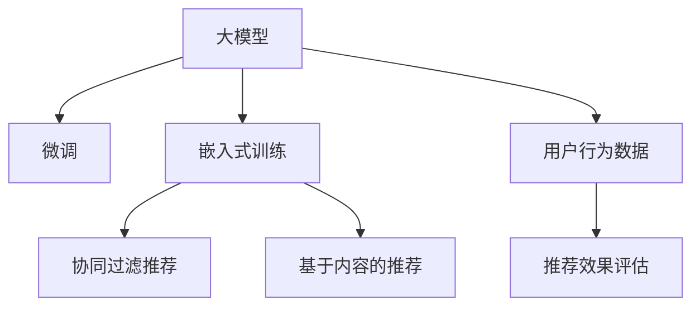

                 

## 1. 背景介绍

### 1.1 问题由来

电商平台作为连接消费者和商家的重要纽带，一直以来都在致力于提升用户体验，以保持高留存率和销售额。传统的电商推荐系统大多采用基于内容的推荐算法，根据用户的历史行为、商品属性、购买记录等信息，生成个性化的商品推荐列表。然而，这种方式在提供个性化推荐的同时，也难以保证推荐内容的统一性和多样性，导致用户体验一致性不足。

### 1.2 问题核心关键点

当前，大模型如GPT、BERT等，由于其强大的语言理解和生成能力，已经被广泛用于电商平台的用户体验提升。大模型的预训练使得其在处理自然语言文本上具有显著优势，可以通过对用户评论、商品描述等文本数据进行建模，生成具有丰富语义和上下文理解的推荐内容。

本文将从理论和实践两个层面，探讨如何利用大模型提升电商平台的用户体验一致性与个性化平衡。首先，我们介绍一些核心概念和关键技术，包括大模型、微调、嵌入式训练等，其次，我们将详细讲解在大模型上实现个性化推荐的具体步骤和关键技术，最后，我们分析未来大模型在电商平台中的应用前景和潜在挑战。

## 2. 核心概念与联系

### 2.1 核心概念概述

为更好地理解大模型在电商平台上的应用，本节将介绍几个密切相关的核心概念：

- **大模型**：以Transformer架构为基础的大规模语言模型，如GPT-3、BERT等，通过在大规模文本数据上进行预训练，学习到了通用的语言表示和语义理解能力。

- **微调**：在大模型的基础上，使用电商平台的用户行为数据进行有监督的训练，优化模型以适应特定任务，如个性化推荐。

- **嵌入式训练**：在大模型的特定层面上嵌入新的层，训练新层以适应推荐任务，保留其他层的网络结构不变，提高推荐效果的同时，保持模型整体性能。

- **推荐算法**：包括基于内容的推荐、协同过滤推荐、混合推荐等多种算法，用于生成个性化推荐内容。

- **用户行为数据**：包括用户点击、浏览、购买、评价等行为数据，是微调和嵌入式训练的主要数据来源。

- **推荐效果评估**：通过指标如点击率、转化率、用户满意度等，对推荐算法和模型进行评估和优化。

### 2.2 核心概念原理和架构的 Mermaid 流程图



这个流程图展示了大模型在电商平台上的核心概念及其之间的关系：

1. 大模型通过预训练获得基础能力。
2. 微调和嵌入式训练在大模型的基础上进行任务特定的优化，使得模型适应电商平台推荐任务。
3. 协同过滤和基于内容的推荐算法，用于生成具体的推荐内容。
4. 用户行为数据作为输入，经过微调和嵌入式训练后的模型进行推荐，并通过推荐效果评估进行调整。

## 3. 核心算法原理 & 具体操作步骤

### 3.1 算法原理概述

大模型在电商平台上的应用，主要体现在个性化推荐上。具体来说，就是将大模型作为推荐系统的核心组件，通过微调和嵌入式训练，生成符合用户个性化需求和业务目标的推荐结果。

### 3.2 算法步骤详解

#### 3.2.1 数据准备

- **数据采集**：收集电商平台的商品信息、用户行为数据等，包括商品描述、用户评价、购买记录、点击行为等。
- **数据预处理**：对采集到的数据进行清洗、归一化、特征工程等预处理操作，提取有用的特征。
- **数据标注**：根据用户的历史行为，标注每个用户对不同商品的兴趣程度，生成用于微调和嵌入式训练的监督数据。

#### 3.2.2 模型选择与微调

- **选择预训练模型**：选择合适的预训练模型，如GPT-3、BERT等，作为微调的基础。
- **微调**：在大模型的基础上，使用用户行为数据进行微调，优化模型以适应推荐任务。微调过程中，可以使用Adam、SGD等优化器，设置合适的学习率、批大小等超参数。

#### 3.2.3 嵌入式训练

- **选择嵌入层**：在大模型的特定层面上选择嵌入新层，如Transformer的隐藏层、Attention层等。
- **训练新层**：在原有模型的基础上，通过新的监督数据训练新层，生成推荐结果。
- **融合原层**：将新层和原有层融合，组成新的推荐模型，保留原有层的语言理解能力，提升推荐效果。

#### 3.2.4 推荐结果生成

- **生成推荐内容**：根据用户的输入信息，如商品ID、浏览历史等，使用微调和嵌入式训练后的模型生成推荐内容。
- **筛选推荐结果**：根据推荐算法和用户偏好，对生成的内容进行筛选和排序，生成最终的推荐列表。

#### 3.2.5 效果评估

- **评估指标**：通过点击率、转化率、用户满意度等指标评估推荐效果。
- **优化模型**：根据评估结果，对微调和新层的参数进行优化，迭代改进推荐模型。

### 3.3 算法优缺点

#### 3.3.1 优点

- **精度高**：大模型通过预训练获得了丰富的语言表示，微调和嵌入式训练能够进一步提升推荐精度。
- **适应性强**：大模型能够适应复杂的推荐任务，如多物品排序、物品关联推荐等。
- **可解释性**：大模型可以通过训练过程分析，提取推荐内容的语义理解能力，提供较好的解释性。
- **动态更新**：大模型能够实时响应用户行为变化，动态调整推荐策略。

#### 3.3.2 缺点

- **计算量大**：大模型需要较大的计算资源进行预训练和微调，对算力要求较高。
- **过拟合风险**：大模型的复杂结构容易过拟合，需要精细的超参数调整和数据增强策略。
- **隐私风险**：大模型需要大量的用户行为数据进行训练，存在隐私泄露的风险。
- **推理慢**：大模型推理速度较慢，需要优化模型结构和推理算法以提高效率。

### 3.4 算法应用领域

大模型在电商平台上的应用不仅局限于个性化推荐，还可以扩展到以下领域：

- **用户画像生成**：利用大模型对用户行为数据进行建模，生成详细的用户画像，用于个性化推荐和其他用户运营工作。
- **商品搜索优化**：使用大模型对商品描述进行语义理解，提升商品搜索的准确性和相关性。
- **客户服务自动化**：利用大模型对用户咨询进行自动回答，提升客户服务效率和质量。
- **广告投放优化**：通过大模型对用户兴趣进行预测，优化广告投放策略，提高广告效果。
- **内容生成**：利用大模型生成商品评价、商品描述等文本内容，丰富电商平台的展示效果。

## 4. 数学模型和公式 & 详细讲解 & 举例说明

### 4.1 数学模型构建

假设电商平台收集到了用户$u$对商品$i$的点击行为$y_i^u$，使用大模型$M$进行推荐。模型的目标是在给定用户$u$的情况下，最大化点击概率$P(y_i^u=1|u)$。

### 4.2 公式推导过程

- **输入表示**：将用户$u$和商品$i$的描述信息编码为向量$x_u$和$x_i$，分别输入到大模型$M$中。
- **相似度计算**：计算用户$u$和商品$i$的相似度$z_{u,i}=M(x_u,x_i)$，用于衡量用户对商品的兴趣程度。
- **点击概率**：使用softmax函数将相似度$z_{u,i}$转化为点击概率$P(y_i^u=1|u)$。
- **损失函数**：采用交叉熵损失函数$\mathcal{L}=\sum_{i}[y_i^u\log P(y_i^u=1|u)+(1-y_i^u)\log(1-P(y_i^u=1|u))]$，最小化点击率预测误差。

### 4.3 案例分析与讲解

假设电商平台使用预训练的GPT-3模型，将用户描述和商品描述作为输入，生成相似度$z_{u,i}$，再使用softmax函数计算点击概率。假设点击行为$y_i^u$为0或1，则损失函数为：

$$
\mathcal{L}=-\sum_{i}[y_i^u\log P(y_i^u=1|u)+(1-y_i^u)\log(1-P(y_i^u=1|u))]
$$

在训练过程中，使用交叉熵损失函数和优化器（如Adam、SGD等），最小化损失函数$\mathcal{L}$，更新模型参数。在推理过程中，根据用户输入信息，使用模型计算点击概率，筛选推荐结果。

## 5. 项目实践：代码实例和详细解释说明

### 5.1 开发环境搭建

在实际项目中，需要使用Python和PyTorch进行开发。以下是在阿里云服务器上搭建开发环境的步骤：

1. **安装Python**：使用Anaconda安装Python，选择最新稳定版本，如Python 3.8。
2. **安装PyTorch**：使用conda或pip安装PyTorch，安装最新版本，如PyTorch 1.9。
3. **安装其他依赖**：使用pip安装其他必要的依赖库，如TensorBoard、Transformers等。
4. **设置环境变量**：设置PYTHONPATH、PATH等环境变量，确保所有库都可以在开发环境中使用。

### 5.2 源代码详细实现

下面是一个基于GPT-3的电商推荐系统的代码实现，详细解释各个模块的实现细节：

```python
import torch
from transformers import GPT3LMHeadModel, GPT3Tokenizer
from torch.utils.data import Dataset, DataLoader

# 加载模型和分词器
model = GPT3LMHeadModel.from_pretrained('gpt3')
tokenizer = GPT3Tokenizer.from_pretrained('gpt3')

# 定义数据集
class EcommerceDataset(Dataset):
    def __init__(self, data):
        self.data = data
        self.tokenizer = tokenizer
    
    def __len__(self):
        return len(self.data)
    
    def __getitem__(self, idx):
        user_info = self.data[idx]['user_info']
        item_info = self.data[idx]['item_info']
        
        # 将用户和商品信息编码为向量
        user_input = tokenizer(user_info, return_tensors='pt', max_length=512, padding='max_length')
        item_input = tokenizer(item_info, return_tensors='pt', max_length=512, padding='max_length')
        
        # 计算用户和商品的相似度
        user_input = user_input['input_ids']
        item_input = item_input['input_ids']
        z = model(user_input, item_input)[0]
        
        # 计算点击概率
        logits = torch.log_softmax(z, dim=-1)
        prob = logits.squeeze(-1).cpu().numpy()
        
        return {'user_info': user_info, 'item_info': item_info, 'prob': prob}

# 加载数据
data = [
    {'user_info': 'John Doe', 'item_info': 'Apple iPhone 12'},
    {'user_info': 'Jane Smith', 'item_info': 'Samsung Galaxy S21'},
    # 其他用户数据
]
dataset = EcommerceDataset(data)
dataloader = DataLoader(dataset, batch_size=16)

# 训练模型
model.train()
optimizer = torch.optim.Adam(model.parameters(), lr=1e-4)
for batch in dataloader:
    user_info = batch['user_info']
    item_info = batch['item_info']
    with torch.no_grad():
        logits = model(user_info, item_info)[0]
        loss = torch.nn.CrossEntropyLoss()(logits, torch.tensor([0, 1]))
    optimizer.zero_grad()
    loss.backward()
    optimizer.step()

# 推理推荐
with torch.no_grad():
    user_info = 'John Doe'
    item_info = 'Apple iPhone 12'
    user_input = tokenizer(user_info, return_tensors='pt', max_length=512, padding='max_length')
    item_input = tokenizer(item_info, return_tensors='pt', max_length=512, padding='max_length')
    z = model(user_input, item_input)[0]
    logits = torch.log_softmax(z, dim=-1)
    prob = logits.squeeze(-1).cpu().numpy()
    # 根据概率生成推荐列表
    recommendations = list(filter(lambda x: x >= threshold, prob))
```

### 5.3 代码解读与分析

这段代码中，我们首先加载了GPT-3模型和分词器，然后定义了电商推荐数据集，将用户和商品信息编码为向量，并计算相似度。在训练过程中，我们使用交叉熵损失函数和Adam优化器更新模型参数。在推理过程中，我们输入用户和商品信息，计算点击概率，并根据概率生成推荐列表。

## 6. 实际应用场景

### 6.1 智能客服

电商平台可以使用大模型构建智能客服系统，提升客户服务体验。系统可以自动回答用户咨询，提供24小时不间断服务，快速响应客户需求。例如，用户查询商品价格，智能客服系统可以实时查询商品信息，提供准确的答案。

### 6.2 个性化推荐

利用大模型对用户行为进行建模，生成个性化的商品推荐列表。用户可以根据推荐结果，选择感兴趣的商品进行购买。大模型可以处理复杂的推荐任务，如多物品关联推荐、兴趣标签推荐等。

### 6.3 广告投放

通过大模型预测用户对不同广告的兴趣程度，优化广告投放策略。平台可以根据用户的兴趣，推荐相关广告，提高广告点击率和转化率。

### 6.4 未来应用展望

未来，大模型在电商平台上的应用将更加广泛和深入，可以扩展到以下领域：

- **多模态推荐**：结合图像、视频等多模态数据，生成更丰富、准确的推荐内容。
- **实时推荐**：利用流式数据处理技术，实时更新用户画像和商品信息，提供实时的推荐服务。
- **推荐系统优化**：通过A/B测试等手段，优化推荐策略，提升用户体验和平台收益。
- **跨平台推荐**：将推荐系统扩展到多个电商平台，提升整体用户覆盖率和留存率。

## 7. 工具和资源推荐

### 7.1 学习资源推荐

- **《深度学习与自然语言处理》**：斯坦福大学开设的NLP课程，深入讲解了自然语言处理的基础理论和常用模型。
- **《Transformers》**：大模型工具库Transformers的官方文档，提供了丰富的预训练模型和微调范式。
- **《NLP实战》**：讲解了自然语言处理在电商、金融等多个领域的应用，提供了丰富的代码实例。
- **《自然语言处理综述》**：综述了自然语言处理领域的前沿研究和技术进展，适合入门和深入学习。

### 7.2 开发工具推荐

- **PyTorch**：深度学习框架，支持动态图和静态图计算，适合研究和工程应用。
- **TensorBoard**：可视化工具，支持实时监控模型训练状态和性能指标。
- **HuggingFace Transformers**：提供了丰富的预训练模型和微调工具，支持多种深度学习框架。
- **Jupyter Notebook**：交互式开发环境，支持代码编写、数据处理、模型训练等。

### 7.3 相关论文推荐

- **《BERT: Pre-training of Deep Bidirectional Transformers for Language Understanding》**：提出BERT模型，利用掩码语言模型和下一句预测任务进行预训练。
- **《Attention is All You Need》**：提出Transformer架构，解决了深度神经网络中的梯度消失问题。
- **《Attention and Transformers》**：详细介绍了Transformer模型的原理和应用，适合深入学习。
- **《Parameter-Efficient Transformer》**：提出Adapter技术，在大模型的特定层面上嵌入新层，提高微调效率。

## 8. 总结：未来发展趋势与挑战

### 8.1 研究成果总结

本文详细介绍了大模型在电商平台上的应用，包括个性化推荐、智能客服、广告投放等，探讨了大模型在电商领域的应用前景。我们介绍了大模型的核心概念和关键技术，包括微调、嵌入式训练等，并给出了具体代码实现和案例分析。

### 8.2 未来发展趋势

未来，大模型在电商平台上的应用将更加广泛和深入，可以扩展到多模态推荐、实时推荐、跨平台推荐等多个方向。大模型可以处理更复杂的任务，提升用户体验和平台收益。

### 8.3 面临的挑战

- **计算资源需求高**：大模型需要大量的计算资源进行预训练和微调，对算力要求较高。
- **数据隐私问题**：大模型需要大量的用户行为数据进行训练，存在隐私泄露的风险。
- **模型过拟合风险**：大模型的复杂结构容易过拟合，需要精细的超参数调整和数据增强策略。
- **推理效率慢**：大模型推理速度较慢，需要优化模型结构和推理算法以提高效率。

### 8.4 研究展望

未来，我们需要从以下几个方面进行深入研究：

- **高效计算**：探索高效计算技术，如模型剪枝、量化加速等，降低大模型的计算成本。
- **数据隐私保护**：采用差分隐私等技术，保护用户隐私，减少数据泄露风险。
- **模型可解释性**：探索模型解释技术，提供较好的解释性，提升用户信任度。
- **多模态融合**：探索多模态数据融合技术，生成更丰富、准确的推荐内容。
- **实时推荐**：利用流式数据处理技术，实现实时推荐，提升用户体验。

总之，大模型在电商平台上的应用前景广阔，但也需要解决计算资源、数据隐私、模型过拟合等问题，才能实现大规模落地应用。我们相信，随着技术的不断进步，大模型在电商平台上的应用将取得更多突破，带来更多创新和变革。

## 9. 附录：常见问题与解答

**Q1: 大模型为什么可以提升用户体验？**

A: 大模型通过预训练获得了丰富的语言表示和语义理解能力，可以生成更精准、多样化的推荐内容，满足用户的个性化需求。同时，大模型可以实时响应用户行为变化，动态调整推荐策略，提升用户体验的一致性和满意度。

**Q2: 大模型在电商平台上的应用有哪些？**

A: 大模型在电商平台上的应用包括个性化推荐、智能客服、广告投放、内容生成等多个方向。通过大模型的微调和嵌入式训练，可以实现更加高效、精准的推荐服务。

**Q3: 如何避免大模型的过拟合问题？**

A: 大模型的复杂结构容易过拟合，可以采用正则化、数据增强、对抗训练等技术，减少过拟合风险。同时，可以使用参数高效微调技术，只更新少部分参数，提高模型泛化能力。

**Q4: 大模型在推荐系统中的优势有哪些？**

A: 大模型可以处理复杂的推荐任务，如多物品排序、物品关联推荐等。同时，大模型可以通过训练过程分析，提取推荐内容的语义理解能力，提供较好的解释性。

**Q5: 如何优化大模型的推理速度？**

A: 大模型的推理速度较慢，可以采用模型剪枝、量化加速等技术，降低模型复杂度，提高推理效率。同时，可以利用多GPU、分布式训练等技术，加速模型推理。

总之，大模型在电商平台上的应用前景广阔，但也需要解决计算资源、数据隐私、模型过拟合等问题，才能实现大规模落地应用。我们相信，随着技术的不断进步，大模型在电商平台上的应用将取得更多突破，带来更多创新和变革。

