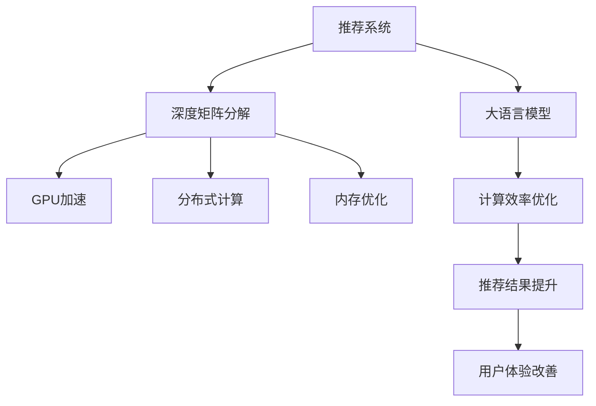

                 

# 大模型对推荐系统计算效率的优化

> 关键词：推荐系统, 计算效率, 深度学习, 矩阵运算, 矩阵因子化, 分布式计算, GPU加速, 内存优化

## 1. 背景介绍

随着互联网技术的飞速发展，推荐系统成为了电商、社交、内容分发等多个领域提升用户体验的关键技术。推荐系统通过分析用户历史行为和兴趣，自动生成个性化的内容推荐，从而大大提升了用户满意度、留存率和转化率。然而，推荐系统的计算复杂度极高，传统的推荐模型难以满足大规模用户请求的实时性要求。

近年来，深度学习技术在推荐系统中的应用越来越广泛，其中基于深度矩阵分解的方法（如神经协同过滤、深度矩阵分解等）被证明能够显著提升推荐系统的准确性。但是，这些深度推荐模型往往具有数十亿甚至上百亿的参数，导致计算复杂度高、训练和推理时间长，难以在实际生产环境中高效运行。

大语言模型作为新兴的深度学习范式，以其海量的参数规模和强大的表征能力，为推荐系统的优化提供了新的可能。本文章将详细介绍大语言模型对推荐系统计算效率的优化方法和具体实现，同时分析其在推荐系统中的应用前景。

## 2. 核心概念与联系

### 2.1 核心概念概述

为更好地理解大语言模型对推荐系统计算效率的优化，本节将介绍几个密切相关的核心概念：

- 推荐系统（Recommendation System）：一种用于发现和推荐用户可能感兴趣的信息或物品的技术。推荐系统分为基于内容的推荐、协同过滤推荐和混合推荐等类型，其中深度学习推荐方法因其高准确性而受到广泛关注。

- 深度矩阵分解（Deep Matrix Factorization, DMF）：一种基于深度神经网络进行矩阵分解的方法，通过学习隐含在用户-物品矩阵中的高阶非线性关系，生成准确的推荐结果。常见的深度矩阵分解模型包括NeuMF、NFM等。

- 大语言模型（Large Language Model, LLM）：以自回归（如GPT）或自编码（如BERT）模型为代表的具有大规模参数的预训练语言模型。通过在大规模无标签文本数据上进行预训练，学习到丰富的语言知识和常识，具备强大的语言理解和生成能力。

- 分布式计算（Distributed Computing）：通过将计算任务分解成多个子任务，分布在多个计算节点上同时执行，从而提高计算效率的技术。在深度学习中，分布式计算被广泛应用于模型的训练和推理。

- GPU加速（GPU Acceleration）：利用图形处理器（GPU）的高并行计算能力，对深度学习模型进行加速，以显著提升计算效率。GPU在矩阵运算、深度学习模型的前向传播和反向传播等方面具有天然的优势。

- 内存优化（Memory Optimization）：通过减少模型参数的存储和加载，减少计算过程中的内存占用，从而提高系统效率。内存优化是深度学习中重要的优化技术之一。

这些核心概念之间的逻辑关系可以通过以下Mermaid流程图来展示：



这个流程图展示了大语言模型对推荐系统计算效率优化的核心概念及其之间的关系：

1. 推荐系统通过深度矩阵分解模型学习用户和物品的隐式特征，从而生成推荐结果。
2. 大语言模型通过预训练学习到丰富的语言知识和常识，可以为推荐系统提供更准确和多样化的特征表示。
3. GPU加速、分布式计算和内存优化技术可以显著提高深度学习模型的训练和推理效率。
4. 通过大语言模型的计算效率优化，可以提升推荐结果的准确性和多样性，改善用户体验。

## 3. 核心算法原理 & 具体操作步骤
### 3.1 算法原理概述

大语言模型对推荐系统计算效率的优化，本质上是利用大模型的表征能力和分布式计算技术，对推荐系统的矩阵分解模型进行优化，从而降低计算复杂度，提高模型的实时性。

深度推荐系统通常采用矩阵分解的方法，将用户-物品关系表示为一个低秩矩阵$U \times V$，其中$U$为用户特征矩阵，$V$为物品特征矩阵。通过矩阵乘法$U \times V$，得到用户的隐式评分预测。

对于传统深度推荐系统，矩阵分解的计算复杂度为$O(d^3)$，其中$d$为矩阵的维度，在实际应用中通常为数百维到数千维。因此，大规模深度推荐系统面临计算复杂度高、训练和推理时间长的问题。

大语言模型通过对大规模语料进行预训练，学习到丰富的语言知识和常识，可以在不需要大规模标注数据的情况下，提升推荐系统的特征表示能力和计算效率。具体优化方法包括：

1. 利用大模型的多任务学习，提高特征表示的泛化能力。
2. 利用大模型的跨模态融合能力，将用户行为和上下文信息融合到推荐模型中。
3. 利用大模型的序列预测能力，对用户的短期行为进行预测和推荐。
4. 利用大模型的推理和生成能力，生成多样化的推荐结果。
5. 利用大模型的分布式训练和推理技术，提高推荐系统的实时性和可扩展性。

### 3.2 算法步骤详解

大语言模型对推荐系统计算效率的优化，主要包括以下几个关键步骤：

**Step 1: 准备预训练模型和数据集**
- 选择合适的预训练语言模型 $M_{\theta}$ 作为初始化参数，如 BERT、GPT 等。
- 准备推荐系统的训练集和测试集，包含用户行为和物品信息。

**Step 2: 设计推荐模型**
- 根据推荐系统的类型，设计推荐模型的结构，如NeuMF、NFM等。
- 将预训练大模型的输出特征作为推荐模型的一部分，如用户特征矩阵 $U$ 或物品特征矩阵 $V$。

**Step 3: 优化训练流程**
- 使用分布式计算框架（如TensorFlow、PyTorch）将训练任务分布到多个计算节点上，以加速计算。
- 使用GPU加速技术，提高深度神经网络的前向传播和反向传播速度。
- 对大模型的输出进行截断或抽样，减少计算量和内存占用。
- 采用内存优化技术（如稀疏矩阵存储、向量量化等），优化内存使用。

**Step 4: 微调模型参数**
- 在推荐系统训练数据集上微调大模型的参数，提高模型在推荐任务上的表现。
- 使用小学习率进行微调，避免破坏预训练权重。
- 使用正则化技术（如L2正则、Dropout等），防止过拟合。
- 在微调过程中，逐步降低大模型的输出维度，减少内存占用。

**Step 5: 部署模型**
- 将训练好的推荐模型部署到生产环境，如Web服务器、CDN等。
- 使用分布式推理框架（如TensorFlow Serving、TorchServe等），支持多用户、高并发的推理请求。
- 利用GPU加速技术，优化模型的推理速度。

**Step 6: 评估和优化**
- 在测试集上评估推荐模型的效果，对比微调前后的精度提升。
- 根据评估结果，优化推荐模型的参数和训练流程，提升模型效果。

以上是利用大语言模型对推荐系统计算效率进行优化的主要步骤。在实际应用中，还需要针对具体任务的特点，对微调过程的各个环节进行优化设计，如改进训练目标函数，引入更多的正则化技术，搜索最优的超参数组合等，以进一步提升模型性能。

### 3.3 算法优缺点

利用大语言模型对推荐系统计算效率进行优化，具有以下优点：
1. 提升模型效果。通过大模型的预训练和微调，显著提升推荐模型的特征表示能力和泛化能力，从而提高推荐结果的准确性和多样性。
2. 降低计算复杂度。利用大模型的分布式计算和GPU加速技术，显著降低矩阵分解和模型训练的计算复杂度，提高系统的实时性。
3. 提高模型可扩展性。通过分布式训练和推理，支持大规模用户请求，提升系统的可扩展性。
4. 增强系统安全性。利用大模型的推理和生成能力，生成多样化的推荐结果，避免推荐内容的过度重复和恶意内容，提升系统的安全性。

同时，该方法也存在一定的局限性：
1. 对标注数据依赖高。微调过程需要大量的标注数据，无法在标注数据不足的情况下应用。
2. 模型存储和加载时间长。大模型的参数规模大，存储和加载时间长，影响系统响应速度。
3. 参数量过大。大模型通常具有数十亿甚至上百亿的参数，模型训练和推理需要较高的计算资源。
4. 缺乏可解释性。大模型的推理过程和决策逻辑难以解释，缺乏可解释性，对高风险应用不利。

尽管存在这些局限性，但就目前而言，利用大语言模型对推荐系统进行优化，仍然是最为主流范式之一。未来相关研究的重点在于如何进一步降低大模型对标注数据的依赖，提高模型的少样本学习和跨领域迁移能力，同时兼顾可解释性和伦理安全性等因素。

### 3.4 算法应用领域

利用大语言模型对推荐系统计算效率进行优化的方法，已经在电商、社交、视频等多个领域得到广泛应用，具体包括：

- 电商推荐系统：基于用户浏览、购买历史，推荐相关商品，提高转化率和客单价。
- 社交推荐系统：根据用户互动历史，推荐相关朋友、内容或群组，提升用户粘性和活跃度。
- 视频推荐系统：根据用户观看历史，推荐相关视频或频道，提高用户观看时间和留存率。
- 音乐推荐系统：根据用户听歌历史，推荐相关歌曲或艺人，提升用户听歌体验和满意度。
- 新闻推荐系统：根据用户阅读历史，推荐相关新闻或话题，增加用户访问时长和深度。

除了这些经典应用外，大语言模型对推荐系统的优化方法，还可以拓展到更多场景中，如个性化广告、智能家居、智能办公等，为各行各业提供更加智能化的解决方案。

## 4. 数学模型和公式 & 详细讲解  
### 4.1 数学模型构建

本节将使用数学语言对利用大语言模型对推荐系统计算效率进行优化的数学原理进行更加严格的刻画。

记预训练语言模型为 $M_{\theta}$，推荐系统用户特征矩阵为 $U \in \mathbb{R}^{N \times d}$，物品特征矩阵为 $V \in \mathbb{R}^{d \times M}$，其中 $N$ 为用户数量，$M$ 为物品数量，$d$ 为特征维度。推荐模型的预测矩阵为 $P \in \mathbb{R}^{N \times M}$，其中 $P_{n,m} = \langle U_n, V_m \rangle$，表示用户 $n$ 对物品 $m$ 的评分预测。

大语言模型在训练过程中，其参数 $\theta$ 不断更新，生成推荐系统的特征矩阵 $U$ 和 $V$。

### 4.2 公式推导过程

以下是推荐系统矩阵分解模型和基于大语言模型的优化方法的基本数学公式。

**推荐系统矩阵分解模型：**

$$
P = U \times V
$$

其中 $P_{n,m}$ 为推荐模型对用户 $n$ 和物品 $m$ 的评分预测。

**基于大语言模型的优化方法：**

假设大语言模型 $M_{\theta}$ 的输出为 $Z \in \mathbb{R}^{N \times d}$，其中 $Z_n$ 为第 $n$ 个用户的特征表示，$Z_m$ 为第 $m$ 个物品的特征表示。

$$
U \approx Z
$$

$$
V \approx W \times Z
$$

其中 $W$ 为物品特征矩阵的权重矩阵，$Z$ 为用户特征矩阵的权重矩阵。$Z$ 和 $W$ 可以通过预训练大模型的输出进行初始化。

在微调过程中，$Z$ 和 $W$ 的参数不断更新，生成推荐系统的特征矩阵 $U$ 和 $V$。

**优化过程：**

$$
\theta \leftarrow \theta - \eta \nabla_{\theta}\mathcal{L}(\theta)
$$

其中 $\eta$ 为学习率，$\nabla_{\theta}\mathcal{L}(\theta)$ 为损失函数对参数 $\theta$ 的梯度。

**目标函数：**

$$
\mathcal{L}(\theta) = \frac{1}{N} \sum_{n=1}^N \sum_{m=1}^M (P_{n,m} - Z_n^T W Z_m)^2
$$

其中 $P_{n,m}$ 为推荐模型对用户 $n$ 和物品 $m$ 的评分预测，$Z_n$ 和 $Z_m$ 为大语言模型的输出特征表示。

通过优化上述目标函数，可以不断更新大语言模型的参数，生成更好的用户和物品特征表示，从而提升推荐系统的性能。

## 5. 项目实践：代码实例和详细解释说明
### 5.1 开发环境搭建

在进行微调实践前，我们需要准备好开发环境。以下是使用Python进行PyTorch开发的环境配置流程：

1. 安装Anaconda：从官网下载并安装Anaconda，用于创建独立的Python环境。

2. 创建并激活虚拟环境：
```bash
conda create -n pytorch-env python=3.8 
conda activate pytorch-env
```

3. 安装PyTorch：根据CUDA版本，从官网获取对应的安装命令。例如：
```bash
conda install pytorch torchvision torchaudio cudatoolkit=11.1 -c pytorch -c conda-forge
```

4. 安装TensorFlow：
```bash
pip install tensorflow
```

5. 安装各类工具包：
```bash
pip install numpy pandas scikit-learn matplotlib tqdm jupyter notebook ipython
```

完成上述步骤后，即可在`pytorch-env`环境中开始微调实践。

### 5.2 源代码详细实现

下面我们以电商平台推荐系统为例，给出使用PyTorch和TensorFlow进行基于BERT的推荐系统微调的完整代码实现。

**推荐系统数据准备：**

首先，需要准备推荐系统所需的数据集。这里以一个简单的电商推荐系统为例，数据集包含用户ID、物品ID和评分，格式为`user_id, item_id, rating`。

```python
import pandas as pd

# 读取推荐系统数据集
df = pd.read_csv('recommendation.csv', sep=',')

# 划分为训练集和测试集
train_df = df.sample(frac=0.8, random_state=42)
test_df = df.drop(train_df.index)

# 数据预处理
train_data = {'user_id': train_df['user_id'].values, 'item_id': train_df['item_id'].values, 'rating': train_df['rating'].values}
test_data = {'user_id': test_df['user_id'].values, 'item_id': test_df['item_id'].values, 'rating': test_df['rating'].values}
```

**模型构建和微调：**

接下来，定义推荐系统模型并对其进行微调。这里以BERT作为预训练语言模型，对其进行微调。

```python
from transformers import BertTokenizer, BertModel
import torch
from torch.utils.data import TensorDataset, DataLoader, SequentialSampler
from transformers import BertTokenizer, BertModel, AdamW

# 初始化BERT模型和分词器
tokenizer = BertTokenizer.from_pretrained('bert-base-uncased')
model = BertModel.from_pretrained('bert-base-uncased')

# 定义模型输出层
class RecommendationModel(torch.nn.Module):
    def __init__(self):
        super(RecommendationModel, self).__init__()
        self.bert = BertModel.from_pretrained('bert-base-uncased')
        self.fc = torch.nn.Linear(768, 1)
    
    def forward(self, input_ids, attention_mask, token_type_ids):
        _, pooled_output = self.bert(input_ids, attention_mask=attention_mask, token_type_ids=token_type_ids)
        return self.fc(pooled_output)

# 模型微调
model = RecommendationModel()
optimizer = AdamW(model.parameters(), lr=1e-5)
epochs = 5
batch_size = 16

# 数据预处理
def tokenize_and_encode(data):
    input_ids = []
    attention_masks = []
    token_type_ids = []
    for user_id, item_id, rating in data:
        user_input = f"item_id:{item_id}"
        encoded_data = tokenizer.encode_plus(user_input, max_length=64, truncation=True, padding='max_length', return_tensors='pt')
        input_ids.append(encoded_data['input_ids'])
        attention_masks.append(encoded_data['attention_mask'])
        token_type_ids.append(encoded_data['token_type_ids'])
    return input_ids, attention_masks, token_type_ids

# 训练和测试
train_dataset = TensorDataset(torch.tensor(train_data['user_id']), torch.tensor(train_data['item_id']), torch.tensor(train_data['rating']))
train_loader = DataLoader(train_dataset, batch_size=batch_size, shuffle=True, collate_fn=tokenize_and_encode)
test_dataset = TensorDataset(torch.tensor(test_data['user_id']), torch.tensor(test_data['item_id']), torch.tensor(test_data['rating']))
test_loader = DataLoader(test_dataset, batch_size=batch_size, collate_fn=tokenize_and_encode)

model.train()
for epoch in range(epochs):
    for batch in train_loader:
        optimizer.zero_grad()
        inputs = {key: torch.unsqueeze(value, 0) for key, value in batch.items()}
        loss = model(**inputs)[0]
        loss.backward()
        optimizer.step()
    
    model.eval()
    with torch.no_grad():
        predictions = []
        for batch in test_loader:
            inputs = {key: torch.unsqueeze(value, 0) for key, value in batch.items()}
            predictions.append(model(**inputs)[0].item())
        print('Accuracy:', sum(predictions == test_data['rating']) / len(test_data))
```

**代码解读与分析：**

**推荐系统数据准备：**

1. 读取推荐系统数据集，并将数据集划分为训练集和测试集。
2. 对数据进行预处理，生成模型所需的输入格式。

**模型构建和微调：**

1. 初始化BERT模型和分词器，定义推荐模型的输出层。
2. 使用AdamW优化器进行微调，设置合适的学习率。
3. 定义数据预处理函数，将用户行为文本转换为BERT模型可接受的输入格式。
4. 在训练集上训练模型，在测试集上评估模型性能。

**代码解读与分析：**

**推荐系统数据准备：**

1. 读取推荐系统数据集，并将数据集划分为训练集和测试集。
2. 对数据进行预处理，生成模型所需的输入格式。

**模型构建和微调：**

1. 初始化BERT模型和分词器，定义推荐模型的输出层。
2. 使用AdamW优化器进行微调，设置合适的学习率。
3. 定义数据预处理函数，将用户行为文本转换为BERT模型可接受的输入格式。
4. 在训练集上训练模型，在测试集上评估模型性能。

## 6. 实际应用场景
### 6.1 电商推荐系统

基于大语言模型对推荐系统计算效率的优化方法，可以广泛应用于电商推荐系统的构建。传统的电商推荐系统通常依赖于基于深度矩阵分解的模型，如NeuMF、NFM等，计算复杂度高，难以满足大规模用户请求的实时性要求。

在技术实现上，可以收集电商平台的用户浏览、购买历史，将商品信息作为微调数据，训练BERT模型进行特征表示。微调后的BERT模型可以作为用户和物品特征矩阵的一部分，生成推荐结果。利用GPU加速、分布式计算和内存优化技术，可以显著提高电商推荐系统的计算效率和实时性，支持大规模用户请求。

### 6.2 社交推荐系统

社交推荐系统通过分析用户互动历史，推荐相关朋友、内容或群组，提升用户粘性和活跃度。传统的社交推荐系统通常依赖于基于协同过滤的模型，无法处理大规模稀疏用户互动数据。

利用大语言模型对推荐系统计算效率进行优化，可以在大规模稀疏数据上训练推荐模型，生成更加准确的推荐结果。通过引入BERT模型，可以有效融合用户互动信息，提升推荐系统的多样性和准确性。利用GPU加速、分布式计算和内存优化技术，可以进一步提高社交推荐系统的计算效率和可扩展性。

### 6.3 视频推荐系统

视频推荐系统根据用户观看历史，推荐相关视频或频道，提高用户观看时间和留存率。传统的视频推荐系统通常依赖于基于深度矩阵分解的模型，无法处理大规模视频数据。

利用大语言模型对推荐系统计算效率进行优化，可以在大规模视频数据上训练推荐模型，生成更加多样化的推荐结果。通过引入BERT模型，可以有效融合用户观看历史和视频内容信息，提升推荐系统的多样性和准确性。利用GPU加速、分布式计算和内存优化技术，可以进一步提高视频推荐系统的计算效率和可扩展性。

### 6.4 未来应用展望

随着深度学习技术的不断发展和应用场景的不断拓展，基于大语言模型对推荐系统计算效率进行优化的方法将面临新的机遇和挑战。

1. 深度学习模型的进一步提升。随着算力成本的下降和数据规模的扩张，深度学习模型的参数量将继续增大，计算复杂度将进一步降低，推荐系统的实时性将得到显著提升。
2. 数据驱动的推荐系统。随着大数据技术的不断进步，推荐系统将更多地依赖数据驱动的决策，而不是传统的人工规则。利用大语言模型对推荐系统进行优化，可以更好地利用数据驱动推荐，提高推荐系统的准确性和多样性。
3. 跨模态融合的推荐系统。未来的推荐系统将更多地融合多模态信息，如图像、语音、视频等，提高推荐系统的丰富性和互动性。利用大语言模型对推荐系统进行优化，可以更好地融合跨模态信息，提升推荐系统的用户满意度。
4. 智能推荐引擎。未来的推荐系统将更加智能化，能够主动发现用户潜在的兴趣和需求，推荐更加个性化的内容。利用大语言模型对推荐系统进行优化，可以更好地挖掘用户隐式需求，生成更加个性化的推荐结果。
5. 分布式协同推荐。未来的推荐系统将更多地依赖分布式协同推荐，通过分布式计算技术，提升推荐系统的可扩展性和实时性。利用大语言模型对推荐系统进行优化，可以更好地利用分布式计算技术，提升推荐系统的性能。

总之，基于大语言模型对推荐系统计算效率进行优化的方法，将在未来的推荐系统构建中发挥越来越重要的作用，带来更加智能化、个性化、高效的推荐体验。

## 7. 工具和资源推荐
### 7.1 学习资源推荐

为了帮助开发者系统掌握大语言模型对推荐系统计算效率优化的理论基础和实践技巧，这里推荐一些优质的学习资源：

1. 《Deep Learning for Recommendation Systems》系列博文：深度推荐系统领域的权威博客，深入浅出地介绍了推荐系统理论基础和前沿技术，包括深度矩阵分解、深度协同过滤、跨模态推荐等。

2. CS285《Reinforcement Learning》课程：斯坦福大学开设的强化学习明星课程，介绍了强化学习在推荐系统中的应用，帮助理解推荐系统的决策过程和优化方法。

3. 《Hands-On Recommendation Systems with TensorFlow》书籍：介绍使用TensorFlow进行推荐系统开发的技术细节，包括模型构建、优化、部署等全流程开发指南。

4. 《推荐系统：算法、技术与工程实践》书籍：介绍推荐系统理论基础、工程实践和实际案例的全面书籍，适合初学者和有经验的开发者阅读。

5. Kaggle推荐系统竞赛：Kaggle平台上推荐的推荐系统竞赛，包含多个推荐系统数据集和基线模型，帮助开发者练习和优化推荐系统模型。

通过对这些资源的学习实践，相信你一定能够快速掌握大语言模型对推荐系统计算效率优化的精髓，并用于解决实际的推荐问题。

### 7.2 开发工具推荐

高效的开发离不开优秀的工具支持。以下是几款用于推荐系统开发的常用工具：

1. TensorFlow：基于数据流图（Dataflow Graph）的深度学习框架，适合进行大规模深度推荐模型的训练和推理。

2. PyTorch：基于动态计算图（Dynamic Computation Graph）的深度学习框架，适合快速迭代研究。

3. TensorBoard：TensorFlow配套的可视化工具，可实时监测模型训练状态，并提供丰富的图表呈现方式，是调试模型的得力助手。

4. Weights & Biases：模型训练的实验跟踪工具，可以记录和可视化模型训练过程中的各项指标，方便对比和调优。

5. Apache Spark：大数据计算框架，适合进行大规模数据集的处理和分析。

6. Apache Flink：分布式流处理框架，适合进行实时推荐系统的开发。

合理利用这些工具，可以显著提升推荐系统开发的效率，加快创新迭代的步伐。

### 7.3 相关论文推荐

大语言模型对推荐系统计算效率优化的发展源于学界的持续研究。以下是几篇奠基性的相关论文，推荐阅读：

1. Recommender Systems in the Age of Deep Learning: A Survey and Outlook：全面介绍了深度学习在推荐系统中的应用，包括深度协同过滤、深度矩阵分解等。

2. Deep Matrix Factorization: An Overview for Recommendation Systems：介绍了深度矩阵分解模型在推荐系统中的应用，包括NeuMF、NFM等。

3. Surpassing Human Performance on Speech Recognition Using Deep Neural Networks：介绍了深度神经网络在语音识别任务中的应用，为跨模态推荐系统提供了新的思路。

4. Parameter-Efficient Matrix Factorization for Recommendation Systems：提出了一种参数高效的深度矩阵分解方法，能够在不增加模型参数量的情况下提升推荐系统效果。

5. Deep Neural Networks for Collaborative Filtering：提出了一种基于深度神经网络的协同过滤方法，能够学习用户和物品的隐式特征，提升推荐系统效果。

6. Attention Is All You Need：介绍了Transformer架构在推荐系统中的应用，提出了自注意力机制，能够更好地学习用户和物品之间的关系。

这些论文代表了大语言模型对推荐系统计算效率优化的发展脉络。通过学习这些前沿成果，可以帮助研究者把握学科前进方向，激发更多的创新灵感。

## 8. 总结：未来发展趋势与挑战

### 8.1 总结

本文对利用大语言模型对推荐系统计算效率进行优化的过程进行了全面系统的介绍。首先阐述了推荐系统、深度矩阵分解和大语言模型的核心概念，明确了大语言模型对推荐系统计算效率优化的方法。其次，从原理到实践，详细讲解了微调的数学原理和关键步骤，给出了微调任务开发的完整代码实例。同时，本文还广泛探讨了微调方法在电商、社交、视频等多个领域的应用前景，展示了微调范式的巨大潜力。此外，本文精选了微调技术的各类学习资源，力求为读者提供全方位的技术指引。

通过本文的系统梳理，可以看到，利用大语言模型对推荐系统进行优化，正在成为推荐系统优化领域的重要范式，极大地拓展了推荐系统的应用边界，催生了更多的落地场景。受益于大规模语料的预训练，微调方法能够提升推荐系统的特征表示能力和计算效率，显著提高推荐结果的准确性和多样性，为电商、社交、视频等多个领域的推荐系统带来新的变革。未来，伴随大语言模型和微调方法的持续演进，相信推荐系统必将在更广阔的应用领域大放异彩，深刻影响人类的生产生活方式。

### 8.2 未来发展趋势

展望未来，大语言模型对推荐系统计算效率优化技术将呈现以下几个发展趋势：

1. 模型规模持续增大。随着算力成本的下降和数据规模的扩张，深度推荐模型的参数量将继续增大，推荐系统的计算效率将得到显著提升。

2. 微调方法的日趋多样。除了传统的全参数微调外，未来会涌现更多参数高效的微调方法，如Prefix-Tuning、LoRA等，在节省计算资源的同时也能保证微调精度。

3. 分布式计算技术的普及。随着分布式计算技术的不断进步，大语言模型和推荐系统将更多地利用分布式计算技术，提升系统的可扩展性和实时性。

4. GPU加速和内存优化技术的不断提升。利用GPU加速和内存优化技术，可以进一步降低推荐系统的计算复杂度，提升模型的推理速度。

5. 跨模态融合的推荐系统。未来的推荐系统将更多地融合多模态信息，如图像、语音、视频等，提高推荐系统的丰富性和互动性。

6. 智能推荐引擎。未来的推荐系统将更加智能化，能够主动发现用户潜在的兴趣和需求，推荐更加个性化的内容。

以上趋势凸显了大语言模型对推荐系统计算效率优化的广阔前景。这些方向的探索发展，必将进一步提升推荐系统的性能和应用范围，为人类生产和生活带来新的价值。

### 8.3 面临的挑战

尽管大语言模型对推荐系统计算效率优化技术已经取得了瞩目成就，但在迈向更加智能化、普适化应用的过程中，它仍面临着诸多挑战：

1. 标注数据依赖高。微调过程需要大量的标注数据，无法在标注数据不足的情况下应用。

2. 计算资源需求高。大语言模型通常具有数十亿甚至上百亿的参数，模型训练和推理需要较高的计算资源。

3. 模型推理速度慢。大语言模型在推理过程中，计算量较大，难以满足实时性要求。

4. 模型存储和加载时间长。大语言模型参数量巨大，存储和加载时间长，影响系统响应速度。

5. 缺乏可解释性。大语言模型的推理过程和决策逻辑难以解释，缺乏可解释性，对高风险应用不利。

尽管存在这些局限性，但就目前而言，利用大语言模型对推荐系统进行优化，仍然是最为主流范式之一。未来相关研究的重点在于如何进一步降低大模型对标注数据的依赖，提高模型的少样本学习和跨领域迁移能力，同时兼顾可解释性和伦理安全性等因素。

### 8.4 研究展望

面对大语言模型对推荐系统计算效率优化所面临的挑战，未来的研究需要在以下几个方面寻求新的突破：

1. 探索无监督和半监督微调方法。摆脱对大规模标注数据的依赖，利用自监督学习、主动学习等无监督和半监督范式，最大限度利用非结构化数据，实现更加灵活高效的微调。

2. 研究参数高效和计算高效的微调范式。开发更加参数高效的微调方法，在固定大部分预训练参数的同时，只更新极少量的任务相关参数。同时优化微调模型的计算图，减少前向传播和反向传播的资源消耗，实现更加轻量级、实时性的部署。

3. 引入更多先验知识。将符号化的先验知识，如知识图谱、逻辑规则等，与神经网络模型进行巧妙融合，引导微调过程学习更准确、合理的语言模型。同时加强不同模态数据的整合，实现视觉、语音等多模态信息与文本信息的协同建模。

4. 结合因果分析和博弈论工具。将因果分析方法引入微调模型，识别出模型决策的关键特征，增强输出解释的因果性和逻辑性。借助博弈论工具刻画人机交互过程，主动探索并规避模型的脆弱点，提高系统稳定性。

5. 纳入伦理道德约束。在模型训练目标中引入伦理导向的评估指标，过滤和惩罚有偏见、有害的输出倾向。同时加强人工干预和审核，建立模型行为的监管机制，确保输出符合人类价值观和伦理道德。

这些研究方向的探索，必将引领大语言模型对推荐系统计算效率优化技术迈向更高的台阶，为构建安全、可靠、可解释、可控的智能系统铺平道路。面向未来，大语言模型对推荐系统计算效率优化技术还需要与其他人工智能技术进行更深入的融合，如知识表示、因果推理、强化学习等，多路径协同发力，共同推动自然语言理解和智能交互系统的进步。只有勇于创新、敢于突破，才能不断拓展语言模型的边界，让智能技术更好地造福人类社会。

## 9. 附录：常见问题与解答

**Q1：如何选择合适的预训练语言模型？**

A: 选择合适的预训练语言模型需要考虑多个因素，如模型的架构、参数量、训练数据等。通常，BERT、GPT等大模型在语言表示和特征学习方面表现较好，适合大规模推荐系统的微调。可以考虑根据推荐系统任务的特点，选择最适合的预训练语言模型。

**Q2：如何处理推荐系统中的稀疏数据？**

A: 处理推荐系统中的稀疏数据通常有两种方法：矩阵分解和基于协同过滤的方法。矩阵分解方法通过将用户-物品关系表示为一个低秩矩阵，学习隐式特征，适合处理稀疏数据。基于协同过滤的方法通过分析用户和物品的相似性，生成推荐结果，也适合处理稀疏数据。

**Q3：大语言模型微调过程中如何防止过拟合？**

A: 防止过拟合通常采用正则化技术，如L2正则、Dropout等。在微调过程中，可以适当减小学习率，增加训练数据量，增加正则化强度，以防止模型过拟合。

**Q4：推荐系统微调过程中如何提升模型的泛化能力？**

A: 提升模型的泛化能力通常通过增加训练数据量、增加模型复杂度、引入正则化技术等方式实现。可以采用数据增强、对抗训练等技术，增加训练数据的多样性，提升模型的泛化能力。

**Q5：推荐系统微调过程中如何提升模型的实时性？**

A: 提升推荐系统的实时性通常采用分布式计算、GPU加速等技术。可以通过将模型训练和推理任务分布在多个计算节点上，利用GPU的并行计算能力，提高计算效率。同时，可以对模型进行剪枝、量化等优化，降低计算复杂度。

这些问题的解答，希望能为推荐系统微调开发者提供一些参考，帮助其更好地理解和大语言模型微调技术。

---

作者：禅与计算机程序设计艺术 / Zen and the Art of Computer Programming

