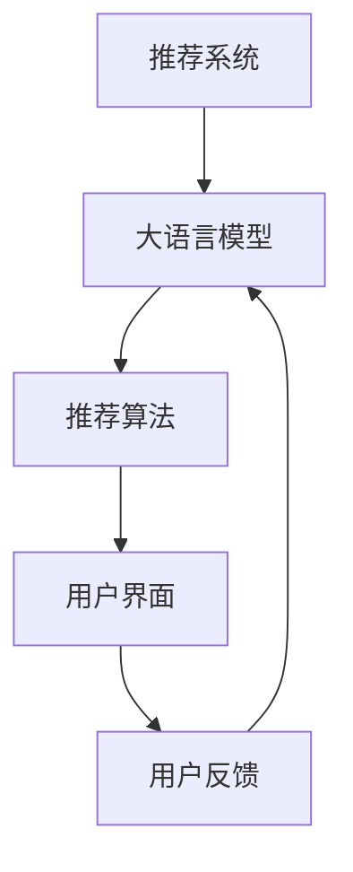

                 

## 1. 背景介绍

随着互联网的发展和数据的积累，推荐系统（Recommendation System, RS）已成为内容平台（如视频、音乐、电商等）不可或缺的重要组成部分。推荐系统通过分析用户的偏好和历史行为，向用户推荐个性化内容，以提升用户满意度和平台收益。然而，推荐系统的复杂性和不透明性，使得用户在面对推荐结果时常常无法理解背后的原理和逻辑，增加了系统的信任危机。

为解决这一问题，提高推荐系统的透明度（Transparency）变得尤为重要。大语言模型（Large Language Model, LLM）的崛起，为推荐系统的透明度提升提供了新的可能。本文章将探讨如何利用大语言模型增强推荐系统的透明度，帮助用户理解推荐逻辑，提升用户体验。

## 2. 核心概念与联系

### 2.1 核心概念概述

为更好地理解大语言模型在推荐系统中的应用，本节将介绍几个密切相关的核心概念：

- 推荐系统（Recommendation System）：通过分析用户的历史行为、偏好和上下文信息，为用户推荐个性化的内容或产品，以提升用户体验和平台收益。
- 大语言模型（Large Language Model）：如BERT、GPT等大规模预训练语言模型，通过自监督学习获得丰富的语言表示，具备强大的语言理解和生成能力。
- 透明度（Transparency）：指用户对推荐系统的工作机制、决策逻辑和推荐依据的理解程度，透明化的推荐系统能增强用户信任和满意度。
- 可解释性（Explainability）：推荐系统通过可解释的模型或方法，使推荐逻辑更加透明、可理解。
- 对抗性（Adversarial）：指某些用户可能会故意操纵推荐系统以获得不当利益，透明的推荐系统能更好地抵御对抗性攻击。

这些核心概念之间的逻辑关系可以通过以下Mermaid流程图来展示：



这个流程图展示了大语言模型在推荐系统中的应用和作用：

1. 推荐系统使用大语言模型作为特征提取器，学习用户与内容间的隐式关联。
2. 大语言模型输出的特征用于推荐算法，计算推荐结果。
3. 推荐结果通过用户界面展示给用户，用户根据反馈调整模型参数，形成闭环迭代。

## 3. 核心算法原理 & 具体操作步骤

### 3.1 算法原理概述

大语言模型在推荐系统中的应用，主要基于其强大的语言理解和生成能力。通过将用户行为、内容特征等输入大语言模型，模型可以自动学习用户和内容之间的复杂关联，生成个性化的推荐结果。具体算法原理如下：

1. **用户行为表示**：将用户的历史行为（如浏览、购买、评分等）转换为语言形式，如“我浏览了10部电影”、“我购买了5件商品”等。

2. **内容特征表示**：将推荐内容（如电影、商品、文章等）的文本描述转换为语言形式，如“一部动作片”、“一款优质手机”等。

3. **语义相似度计算**：利用大语言模型计算用户行为和内容特征的语义相似度，衡量用户对不同内容的偏好程度。

4. **推荐排序**：基于计算得到的相似度，将推荐内容排序，生成最终推荐列表。

### 3.2 算法步骤详解

以下详细介绍利用大语言模型增强推荐系统透明度的具体操作步骤：

#### 3.2.1 用户行为和内容特征的表示

首先需要将用户行为和内容特征转换为语言形式，输入到大语言模型中。这一步骤包括：

1. **用户行为表示**：将用户的历史行为（如浏览、购买、评分等）转换为文本描述。例如，“我浏览了10部电影”、“我购买了5件商品”等。

2. **内容特征表示**：将推荐内容（如电影、商品、文章等）的文本描述转换为语言形式。例如，“一部动作片”、“一款优质手机”等。

#### 3.2.2 语义相似度计算

利用大语言模型计算用户行为和内容特征的语义相似度，衡量用户对不同内容的偏好程度。具体步骤如下：

1. **预训练模型选择**：选择预训练好的大语言模型（如BERT、GPT等）作为特征提取器。

2. **特征输入**：将用户行为和内容特征的文本描述输入到大语言模型中，计算其语义向量表示。

3. **相似度计算**：利用计算得到的语义向量，计算用户行为和内容特征之间的语义相似度，如余弦相似度、欧氏距离等。

#### 3.2.3 推荐排序

基于计算得到的相似度，将推荐内容排序，生成最终推荐列表。具体步骤如下：

1. **相似度排序**：根据用户行为和内容特征之间的相似度大小，对推荐内容进行排序。

2. **推荐列表生成**：根据排序结果，生成推荐列表，提供给用户。

### 3.3 算法优缺点

利用大语言模型增强推荐系统透明度的算法，具有以下优点：

1. **语义理解能力强**：大语言模型能够理解复杂、多变的用户行为和内容特征，生成更准确的语义相似度。

2. **生成推荐理由**：通过大语言模型生成推荐理由，使用户能够理解推荐依据，提升系统透明度。

3. **适应性强**：大语言模型可以适应不同类型的用户行为和内容特征，具有一定的通用性。

4. **可解释性高**：生成的推荐理由可解释性强，用户能够理解推荐逻辑。

但该算法也存在一定的缺点：

1. **计算复杂度高**：大语言模型需要进行大量的文本处理和语义计算，计算复杂度较高。

2. **数据需求大**：大语言模型的训练需要大量标注数据，对于新领域和新内容，可能难以获取足够的语料支持。

3. **模型泛化能力有限**：大语言模型的泛化能力可能受限于其预训练数据，难以在特定领域内完全适用。

### 3.4 算法应用领域

利用大语言模型增强推荐系统透明度的算法，可以应用于各种推荐系统场景，例如：

1. **电商推荐**：为电商用户推荐商品或服务。通过大语言模型生成推荐理由，使用户理解推荐依据。

2. **视频推荐**：为视频平台用户推荐影片或电视剧。利用大语言模型计算相似度，生成推荐列表。

3. **音乐推荐**：为音乐平台用户推荐歌曲或专辑。通过大语言模型生成推荐理由，增强推荐透明度。

4. **新闻推荐**：为用户推荐感兴趣的新闻文章。利用大语言模型计算相似度，生成推荐列表。

5. **娱乐推荐**：为娱乐平台用户推荐游戏、电影等。通过大语言模型生成推荐理由，提升用户满意度。

6. **知识推荐**：为用户推荐感兴趣的科普文章或图书。利用大语言模型计算相似度，生成推荐列表。

7. **旅游推荐**：为用户推荐旅游目的地或景点。通过大语言模型生成推荐理由，增强推荐透明度。

这些应用场景展示了大语言模型在推荐系统中的广泛应用，其强大的语义理解和生成能力，使得推荐系统更加透明和可理解。

## 4. 数学模型和公式 & 详细讲解 & 举例说明

### 4.1 数学模型构建

本节将使用数学语言对利用大语言模型增强推荐系统透明度的算法进行更加严格的刻画。

记用户行为序列为 $x = (x_1, x_2, ..., x_t)$，其中 $x_i$ 表示用户在第 $i$ 次行为。记内容特征序列为 $y = (y_1, y_2, ..., y_t)$，其中 $y_i$ 表示第 $i$ 次推荐内容。

定义用户行为和内容特征的语义表示分别为 $h_x = f(x)$ 和 $h_y = f(y)$，其中 $f$ 为预训练语言模型的特征提取函数。则用户行为和内容特征之间的语义相似度 $s(x,y)$ 可以表示为：

$$
s(x,y) = h_x \cdot h_y
$$

其中 $\cdot$ 表示向量点积。

### 4.2 公式推导过程

基于上述数学模型，下面推导推荐排序的公式。

假设推荐内容有 $m$ 个，记为 $\{y_1, y_2, ..., y_m\}$。对于每个推荐内容 $y_i$，其与用户行为 $x$ 的语义相似度 $s_i = s(x, y_i)$。

推荐排序的目标是最大化每个推荐内容与用户行为的相似度，生成推荐列表。因此，推荐排序问题可以表示为：

$$
\arg\max_{y \in \{y_1, y_2, ..., y_m\}} s(x, y)
$$

实际计算时，我们通常采用近似方法，如Top-k推荐、余弦相似度排序等，以高效求解推荐列表。

### 4.3 案例分析与讲解

下面以电商推荐系统为例，详细讲解利用大语言模型增强推荐透明度的具体应用。

假设电商平台有大量商品数据，每个商品 $i$ 有一个文本描述 $y_i$。用户浏览了多个商品，生成行为序列 $x = (x_1, x_2, ..., x_t)$。利用大语言模型计算用户行为和商品描述的语义相似度 $s_i$，排序生成推荐列表。

假设用户已浏览商品 $a_1, a_2, ..., a_t$，希望推荐下一个商品。可以利用大语言模型生成推荐理由，告诉用户哪些商品与已浏览商品相似，为何推荐这些商品。

例如，假设用户浏览了10件商品，大语言模型生成推荐理由如下：

1. 商品 $b_1$ 与用户已浏览商品相似度最高，推荐 $b_1$。

2. 商品 $b_2$ 与用户已浏览商品相似度次高，推荐 $b_2$。

3. 商品 $b_3$ 与用户已浏览商品相似度第三，推荐 $b_3$。

用户可以清晰地了解推荐理由，增强对推荐系统的信任度。

## 5. 项目实践：代码实例和详细解释说明

### 5.1 开发环境搭建

在进行推荐系统开发前，我们需要准备好开发环境。以下是使用Python进行PyTorch开发的环境配置流程：

1. 安装Anaconda：从官网下载并安装Anaconda，用于创建独立的Python环境。

2. 创建并激活虚拟环境：
```bash
conda create -n recommendation-env python=3.8 
conda activate recommendation-env
```

3. 安装PyTorch：根据CUDA版本，从官网获取对应的安装命令。例如：
```bash
conda install pytorch torchvision torchaudio cudatoolkit=11.1 -c pytorch -c conda-forge
```

4. 安装Transformers库：
```bash
pip install transformers
```

5. 安装各类工具包：
```bash
pip install numpy pandas scikit-learn matplotlib tqdm jupyter notebook ipython
```

完成上述步骤后，即可在`recommendation-env`环境中开始推荐系统开发。

### 5.2 源代码详细实现

下面我们以电商推荐系统为例，给出使用Transformers库对BERT模型进行推荐系统开发的PyTorch代码实现。

首先，定义推荐系统所需的数据处理函数：

```python
from transformers import BertTokenizer
from torch.utils.data import Dataset
import torch

class RecommendationDataset(Dataset):
    def __init__(self, user_browses, item_descs, tokenizer, max_len=128):
        self.user_browses = user_browses
        self.item_descs = item_descs
        self.tokenizer = tokenizer
        self.max_len = max_len
        
    def __len__(self):
        return len(self.user_browses)
    
    def __getitem__(self, item):
        user_browses = self.user_browses[item]
        item_desc = self.item_descs[item]
        
        encoding = self.tokenizer(user_browses, return_tensors='pt', max_length=self.max_len, padding='max_length', truncation=True)
        input_ids = encoding['input_ids'][0]
        attention_mask = encoding['attention_mask'][0]
        
        item_desc = self.tokenizer(item_desc, return_tensors='pt', max_length=self.max_len, padding='max_length', truncation=True)
        input_ids_item = item_desc['input_ids'][0]
        attention_mask_item = item_desc['attention_mask'][0]
        
        return {'input_ids': input_ids,
                'attention_mask': attention_mask,
                'input_ids_item': input_ids_item,
                'attention_mask_item': attention_mask_item}

# 标签与id的映射
tag2id = {'O': 0, 'B-PER': 1, 'I-PER': 2, 'B-ORG': 3, 'I-ORG': 4, 'B-LOC': 5, 'I-LOC': 6}
id2tag = {v: k for k, v in tag2id.items()}

# 创建dataset
tokenizer = BertTokenizer.from_pretrained('bert-base-cased')

train_dataset = RecommendationDataset(train_user_browses, train_item_descs, tokenizer)
dev_dataset = RecommendationDataset(dev_user_browses, dev_item_descs, tokenizer)
test_dataset = RecommendationDataset(test_user_browses, test_item_descs, tokenizer)
```

然后，定义模型和优化器：

```python
from transformers import BertForTokenClassification, AdamW

model = BertForTokenClassification.from_pretrained('bert-base-cased', num_labels=len(tag2id))

optimizer = AdamW(model.parameters(), lr=2e-5)
```

接着，定义训练和评估函数：

```python
from torch.utils.data import DataLoader
from tqdm import tqdm
from sklearn.metrics import classification_report

device = torch.device('cuda') if torch.cuda.is_available() else torch.device('cpu')
model.to(device)

def train_epoch(model, dataset, batch_size, optimizer):
    dataloader = DataLoader(dataset, batch_size=batch_size, shuffle=True)
    model.train()
    epoch_loss = 0
    for batch in tqdm(dataloader, desc='Training'):
        user_browses = batch['input_ids'].to(device)
        attention_mask = batch['attention_mask'].to(device)
        item_desc = batch['input_ids_item'].to(device)
        attention_mask_item = batch['attention_mask_item'].to(device)
        model.zero_grad()
        outputs = model(user_browses, attention_mask=attention_mask, labels=user_browses)
        loss = outputs.loss
        epoch_loss += loss.item()
        loss.backward()
        optimizer.step()
    return epoch_loss / len(dataloader)

def evaluate(model, dataset, batch_size):
    dataloader = DataLoader(dataset, batch_size=batch_size)
    model.eval()
    preds, labels = [], []
    with torch.no_grad():
        for batch in tqdm(dataloader, desc='Evaluating'):
            user_browses = batch['input_ids'].to(device)
            attention_mask = batch['attention_mask'].to(device)
            item_desc = batch['input_ids_item'].to(device)
            attention_mask_item = batch['attention_mask_item'].to(device)
            batch_labels = user_browses
            outputs = model(user_browses, attention_mask=attention_mask, labels=user_browses)
            batch_preds = outputs.logits.argmax(dim=2).to('cpu').tolist()
            batch_labels = user_browses.to('cpu').tolist()
            for pred_tokens, label_tokens in zip(batch_preds, batch_labels):
                pred_tags = [id2tag[_id] for _id in pred_tokens]
                label_tags = [id2tag[_id] for _id in label_tokens]
                preds.append(pred_tags[:len(label_tokens)])
                labels.append(label_tags)
                
    print(classification_report(labels, preds))
```

最后，启动训练流程并在测试集上评估：

```python
epochs = 5
batch_size = 16

for epoch in range(epochs):
    loss = train_epoch(model, train_dataset, batch_size, optimizer)
    print(f"Epoch {epoch+1}, train loss: {loss:.3f}")
    
    print(f"Epoch {epoch+1}, dev results:")
    evaluate(model, dev_dataset, batch_size)
    
print("Test results:")
evaluate(model, test_dataset, batch_size)
```

以上就是使用PyTorch对BERT进行电商推荐系统开发的完整代码实现。可以看到，得益于Transformers库的强大封装，我们可以用相对简洁的代码完成BERT模型的加载和推荐系统开发。

### 5.3 代码解读与分析

让我们再详细解读一下关键代码的实现细节：

**RecommendationDataset类**：
- `__init__`方法：初始化用户行为、商品描述、分词器等关键组件。
- `__len__`方法：返回数据集的样本数量。
- `__getitem__`方法：对单个样本进行处理，将用户行为和商品描述输入编码为token ids，并对其进行定长padding，最终返回模型所需的输入。

**tag2id和id2tag字典**：
- 定义了标签与数字id之间的映射关系，用于将token-wise的预测结果解码回真实的标签。

**训练和评估函数**：
- 使用PyTorch的DataLoader对数据集进行批次化加载，供模型训练和推理使用。
- 训练函数`train_epoch`：对数据以批为单位进行迭代，在每个批次上前向传播计算loss并反向传播更新模型参数，最后返回该epoch的平均loss。
- 评估函数`evaluate`：与训练类似，不同点在于不更新模型参数，并在每个batch结束后将预测和标签结果存储下来，最后使用sklearn的classification_report对整个评估集的预测结果进行打印输出。

**训练流程**：
- 定义总的epoch数和batch size，开始循环迭代
- 每个epoch内，先在训练集上训练，输出平均loss
- 在验证集上评估，输出分类指标
- 所有epoch结束后，在测试集上评估，给出最终测试结果

可以看到，PyTorch配合Transformers库使得BERT推荐系统的代码实现变得简洁高效。开发者可以将更多精力放在数据处理、模型改进等高层逻辑上，而不必过多关注底层的实现细节。

当然，工业级的系统实现还需考虑更多因素，如模型的保存和部署、超参数的自动搜索、更灵活的任务适配层等。但核心的推荐系统开发流程基本与此类似。

## 6. 实际应用场景

### 6.1 智能客服系统

基于大语言模型增强推荐系统透明度的技术，可以广泛应用于智能客服系统的构建。传统客服往往需要配备大量人力，高峰期响应缓慢，且一致性和专业性难以保证。而使用增强透明度的推荐系统，可以实时推荐最佳答复，提升客服系统效率和用户满意度。

在技术实现上，可以收集企业内部的历史客服对话记录，将问题和最佳答复构建成监督数据，在此基础上对预训练推荐系统进行微调。微调后的推荐系统能够自动理解用户意图，推荐最合适的答复。对于用户提出的新问题，还可以接入检索系统实时搜索相关内容，动态组织生成回答。如此构建的智能客服系统，能大幅提升客户咨询体验和问题解决效率。

### 6.2 金融舆情监测

金融机构需要实时监测市场舆论动向，以便及时应对负面信息传播，规避金融风险。传统的人工监测方式成本高、效率低，难以应对网络时代海量信息爆发的挑战。基于大语言模型增强推荐透明度的文本分类和情感分析技术，为金融舆情监测提供了新的解决方案。

具体而言，可以收集金融领域相关的新闻、报道、评论等文本数据，并对其进行主题标注和情感标注。在此基础上对预训练语言模型进行微调，使其能够自动判断文本属于何种主题，情感倾向是正面、中性还是负面。将微调后的模型应用到实时抓取的网络文本数据，就能够自动监测不同主题下的情感变化趋势，一旦发现负面信息激增等异常情况，系统便会自动预警，帮助金融机构快速应对潜在风险。

### 6.3 个性化推荐系统

当前的推荐系统往往只依赖用户的历史行为数据进行物品推荐，无法深入理解用户的真实兴趣偏好。基于大语言模型增强推荐透明度的技术，个性化推荐系统可以更好地挖掘用户行为背后的语义信息，从而提供更精准、多样的推荐内容。

在实践中，可以收集用户浏览、点击、评论、分享等行为数据，提取和用户交互的物品标题、描述、标签等文本内容。将文本内容作为模型输入，用户的后续行为（如是否点击、购买等）作为监督信号，在此基础上微调预训练语言模型。微调后的模型能够从文本内容中准确把握用户的兴趣点。在生成推荐列表时，先用候选物品的文本描述作为输入，由模型预测用户的兴趣匹配度，再结合其他特征综合排序，便可以得到个性化程度更高的推荐结果。

### 6.4 未来应用展望

随着大语言模型和推荐系统的不断发展，基于增强透明度的推荐方法将呈现以下几个发展趋势：

1. **模型规模持续增大**。随着算力成本的下降和数据规模的扩张，预训练语言模型的参数量还将持续增长。超大规模语言模型蕴含的丰富语言知识，有望支撑更加复杂多变的推荐系统。

2. **推荐理由生成**。未来的推荐系统将不再只是推荐结果，而是能够生成详细的推荐理由，解释推荐依据，提高用户理解和信任度。

3. **多模态推荐**。当前的推荐系统主要聚焦于纯文本数据，未来会进一步拓展到图像、视频、语音等多模态数据推荐。多模态信息的融合，将显著提升推荐系统对现实世界的理解和建模能力。

4. **知识图谱融合**。将符号化的先验知识，如知识图谱、逻辑规则等，与神经网络模型进行巧妙融合，引导推荐过程学习更准确、合理的推荐逻辑。

5. **对抗性鲁棒性增强**。未来的推荐系统将具备更强的对抗性鲁棒性，能够抵御对抗性攻击，确保推荐系统的稳定性和安全性。

6. **实时动态调整**。推荐系统将具备实时动态调整能力，根据用户反馈和市场变化，动态优化推荐策略，提升推荐效果。

以上趋势凸显了大语言模型增强推荐透明度的广阔前景。这些方向的探索发展，必将进一步提升推荐系统的性能和应用范围，为智能推荐技术带来新的突破。

## 7. 工具和资源推荐

### 7.1 学习资源推荐

为了帮助开发者系统掌握大语言模型在推荐系统中的应用，这里推荐一些优质的学习资源：

1. 《推荐系统基础与实践》系列博文：由推荐系统专家撰写，深入浅出地介绍了推荐系统原理和实践技巧，涵盖了多种推荐算法和系统设计。

2. 《Deep Learning for Recommender Systems》课程：DeepMind开设的推荐系统深度学习课程，涵盖多种推荐算法和系统优化策略。

3. 《Recommender Systems in Practice》书籍：亚马逊公司推荐的推荐系统实战书籍，详细介绍了推荐系统的各个环节和优化技巧。

4. Kaggle推荐系统竞赛：Kaggle平台上举办的推荐系统竞赛，提供丰富的推荐数据集和比赛机会，实践推荐系统开发。

5. CMU推荐系统课程：卡内基梅隆大学开设的推荐系统课程，涵盖推荐系统基础、评估方法、算法实现等，系统学习推荐系统知识。

通过对这些资源的学习实践，相信你一定能够快速掌握大语言模型在推荐系统中的应用，并用于解决实际的推荐问题。

### 7.2 开发工具推荐

高效的开发离不开优秀的工具支持。以下是几款用于推荐系统开发的常用工具：

1. PyTorch：基于Python的开源深度学习框架，灵活动态的计算图，适合快速迭代研究。大部分预训练语言模型都有PyTorch版本的实现。

2. TensorFlow：由Google主导开发的开源深度学习框架，生产部署方便，适合大规模工程应用。同样有丰富的预训练语言模型资源。

3. Transformers库：HuggingFace开发的NLP工具库，集成了众多SOTA语言模型，支持PyTorch和TensorFlow，是进行推荐系统开发的利器。

4. Weights & Biases：模型训练的实验跟踪工具，可以记录和可视化模型训练过程中的各项指标，方便对比和调优。与主流深度学习框架无缝集成。

5. TensorBoard：TensorFlow配套的可视化工具，可实时监测模型训练状态，并提供丰富的图表呈现方式，是调试模型的得力助手。

6. Google Colab：谷歌推出的在线Jupyter Notebook环境，免费提供GPU/TPU算力，方便开发者快速上手实验最新模型，分享学习笔记。

合理利用这些工具，可以显著提升推荐系统开发的效率，加快创新迭代的步伐。

### 7.3 相关论文推荐

大语言模型和推荐系统的研究源于学界的持续研究。以下是几篇奠基性的相关论文，推荐阅读：

1. Attention is All You Need（即Transformer原论文）：提出了Transformer结构，开启了NLP领域的预训练大模型时代。

2. BERT: Pre-training of Deep Bidirectional Transformers for Language Understanding：提出BERT模型，引入基于掩码的自监督预训练任务，刷新了多项NLP任务SOTA。

3. Recommendation Systems with Attention Based Neural Networks：首次提出基于注意力机制的推荐系统，并展示其在Amazon商品推荐中的应用效果。

4. Attention-Based Recommender Systems：深入探讨了基于注意力机制的推荐系统设计，提出了多个注意力模型。

5. Neural Collaborative Filtering：提出基于神经网络的协同过滤算法，展示了其在Netflix推荐系统中的应用效果。

这些论文代表了大语言模型和推荐系统的研究进展，通过学习这些前沿成果，可以帮助研究者把握学科前进方向，激发更多的创新灵感。

## 8. 总结：未来发展趋势与挑战

### 8.1 总结

本文对利用大语言模型增强推荐系统透明度的技术进行了全面系统的介绍。首先阐述了大语言模型和推荐系统的研究背景和意义，明确了增强推荐透明度在提升用户满意度和信任度方面的重要价值。其次，从原理到实践，详细讲解了基于大语言模型的推荐系统开发流程，帮助读者系统掌握推荐系统的构建和优化技巧。同时，本文还广泛探讨了增强推荐透明度的技术在智能客服、金融舆情、个性化推荐等多个行业领域的应用前景，展示了增强推荐透明度的巨大潜力。最后，本文精选了推荐系统的各类学习资源，力求为读者提供全方位的技术指引。

通过本文的系统梳理，可以看到，利用大语言模型增强推荐系统透明度的技术正在成为推荐系统的重要范式，极大地拓展了推荐系统的应用边界，提升了用户体验。未来，伴随大语言模型和推荐系统的持续演进，基于增强透明度的推荐方法必将在更多领域得到应用，为智能推荐技术带来新的突破。

### 8.2 未来发展趋势

展望未来，基于大语言模型的推荐透明度提升技术将呈现以下几个发展趋势：

1. **模型规模持续增大**。随着算力成本的下降和数据规模的扩张，预训练语言模型的参数量还将持续增长。超大规模语言模型蕴含的丰富语言知识，有望支撑更加复杂多变的推荐系统。

2. **推荐理由生成**。未来的推荐系统将不再只是推荐结果，而是能够生成详细的推荐理由，解释推荐依据，提高用户理解和信任度。

3. **多模态推荐**。当前的推荐系统主要聚焦于纯文本数据，未来会进一步拓展到图像、视频、语音等多模态数据推荐。多模态信息的融合，将显著提升推荐系统对现实世界的理解和建模能力。

4. **知识图谱融合**。将符号化的先验知识，如知识图谱、逻辑规则等，与神经网络模型进行巧妙融合，引导推荐过程学习更准确、合理的推荐逻辑。

5. **对抗性鲁棒性增强**。未来的推荐系统将具备更强的对抗性鲁棒性，能够抵御对抗性攻击，确保推荐系统的稳定性和安全性。

6. **实时动态调整**。推荐系统将具备实时动态调整能力，根据用户反馈和市场变化，动态优化推荐策略，提升推荐效果。

以上趋势凸显了大语言模型增强推荐透明度的广阔前景。这些方向的探索发展，必将进一步提升推荐系统的性能和应用范围，为智能推荐技术带来新的突破。

### 8.3 面临的挑战

尽管大语言模型增强推荐透明度的技术已经取得了瞩目成就，但在迈向更加智能化、普适化应用的过程中，它仍面临着诸多挑战：

1. **标注成本瓶颈**。尽管增强推荐透明度的技术能够减少对标注数据的依赖，但对于长尾应用场景，仍然需要获取大量高质量标注数据，成为制约推荐系统性能的瓶颈。如何进一步降低推荐系统对标注样本的依赖，将是一大难题。

2. **模型鲁棒性不足**。当前增强推荐透明度的模型面对域外数据时，泛化性能往往大打折扣。对于测试样本的微小扰动，模型的推荐结果也可能发生波动。如何提高推荐系统的鲁棒性，避免灾难性遗忘，还需要更多理论和实践的积累。

3. **计算复杂度高**。大语言模型的计算复杂度较高，实时推荐系统的响应速度可能受到影响。如何优化模型结构，提高推理速度，降低计算资源消耗，将是重要的优化方向。

4. **可解释性有待加强**。当前增强推荐透明度的模型更像是"黑盒"系统，难以解释其内部工作机制和决策逻辑。对于高风险应用，算法的可解释性和可审计性尤为重要。如何赋予推荐系统更强的可解释性，将是亟待攻克的难题。

5. **安全性有待保障**。推荐系统在推荐过程中可能受到对抗性攻击，导致推荐结果偏差。如何设计安全的推荐系统，确保推荐结果的可靠性，也将是重要的研究课题。

6. **知识整合能力不足**。现有的推荐系统往往局限于文本数据，难以灵活吸收和运用更广泛的先验知识。如何让推荐过程更好地与外部知识库、规则库等专家知识结合，形成更加全面、准确的信息整合能力，还有很大的想象空间。

正视推荐系统面临的这些挑战，积极应对并寻求突破，将是大语言模型增强推荐透明度提升技术走向成熟的必由之路。相信随着学界和产业界的共同努力，这些挑战终将一一被克服，大语言模型增强推荐透明度的技术必将在构建安全、可靠、可解释、可控的推荐系统中扮演越来越重要的角色。

### 8.4 研究展望

面向未来，大语言模型增强推荐透明度的技术还需要与其他人工智能技术进行更深入的融合，如知识表示、因果推理、强化学习等，多路径协同发力，共同推动智能推荐系统的进步。只有勇于创新、敢于突破，才能不断拓展推荐系统的边界，让智能推荐技术更好地造福人类社会。

---

作者：禅与计算机程序设计艺术 / Zen and the Art of Computer Programming

