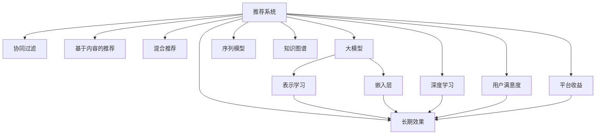

                 

# 大模型对推荐系统长期效果的影响研究

> 关键词：大模型推荐系统,长期效果,深度学习,协同过滤,序列模型,知识图谱

## 1. 背景介绍

### 1.1 问题由来
随着互联网信息爆炸，推荐系统已成为各大平台提升用户体验、增加商业价值的关键技术。推荐系统的目标是为用户推荐最符合其兴趣和需求的物品，帮助用户从海量数据中发现价值。但传统推荐系统面临冷启动、长尾效应、物品多样性不足等问题，需要通过引入新的模型和技术手段进行优化。近年来，随着深度学习技术的迅猛发展，基于大模型的推荐系统逐渐成为研究热点。

大模型如BERT、GPT-3等，通过预训练在大规模语料库上进行深度学习，学习到丰富的语言和语义知识。这些知识可以被迁移到推荐系统，提升推荐效果。但大模型的高复杂度和高成本也带来了新的挑战，如计算资源需求大、训练时间长、推理效率低等。本文将重点研究大模型在推荐系统中的应用，分析其对推荐系统长期效果的影响，探讨如何在大模型推荐系统中找到性能和成本之间的平衡点。

### 1.2 问题核心关键点
大模型在推荐系统中的应用主要体现在两个方面：一是作为用户和物品交互的表示学习器，二是作为推荐模型的嵌入层。具体而言：

1. **表示学习器**：大模型能自动学习用户的兴趣表示和物品的属性特征表示，有效缓解冷启动问题和长尾物品问题。

2. **推荐模型**：大模型的嵌入层可以用于增强推荐模型的表现力，提升推荐结果的相关性和多样性。

3. **效果评估**：大模型的引入可能会改变推荐系统的长期效果，包括点击率、转化率、用户满意度等指标。

### 1.3 问题研究意义
研究大模型在推荐系统中的应用，对于提升推荐系统的智能水平、优化用户体验、增加平台收益具有重要意义：

1. **智能推荐**：大模型可以学习到更深层次的语义知识，提升推荐结果的智能性和个性化程度。

2. **用户满意度**：通过大模型增强推荐模型的表现力，提供更贴合用户需求的推荐结果，提升用户满意度。

3. **平台收益**：通过个性化推荐增加用户粘性，提高转化率和点击率，带来更多收益。

4. **技术进步**：推动深度学习、自然语言处理等技术的进步，为其他领域的技术创新提供借鉴。

5. **平台应用**：提升推荐系统在新闻、电商、社交媒体等平台的应用效果，推动NLP技术在更广泛领域的应用。

## 2. 核心概念与联系

### 2.1 核心概念概述

为更好地理解大模型在推荐系统中的应用，本节将介绍几个密切相关的核心概念：

- **推荐系统(Recommender System)**：通过分析用户行为数据和物品属性数据，为用户推荐相关物品的系统。常见的推荐模型包括协同过滤、基于内容的推荐、混合推荐等。

- **大模型(Large Model)**：指在预训练阶段使用大规模数据进行训练，具有复杂结构和高表现力的深度学习模型。如BERT、GPT-3等。

- **表示学习(Representation Learning)**：通过深度学习模型自动学习用户和物品的表示，提高推荐系统的智能性和个性化程度。

- **嵌入层(Embedding Layer)**：深度学习模型中用于将离散的数据映射到高维连续空间的层，可以用于增强推荐模型的表现力。

- **长期效果(Long-term Effect)**：推荐系统的长期效果不仅包括点击率和转化率等短期指标，还包括用户满意度、平台收益等长期指标。

- **协同过滤(Collaborative Filtering)**：一种通过分析用户和物品的交互数据进行推荐的方法，分为基于用户的协同过滤和基于物品的协同过滤。

- **序列模型(Sequence Model)**：基于用户行为序列进行推荐的方法，通过捕捉用户行为的模式，提高推荐准确性。

- **知识图谱(Knowledge Graph)**：用于表示实体、关系和属性的图形结构，可以用于增强推荐系统的知识表示能力。

这些核心概念之间的逻辑关系可以通过以下Mermaid流程图来展示：



这个流程图展示了大模型推荐系统的核心概念及其之间的关系：

1. 推荐系统通过多种推荐模型为用户提供个性化推荐。
2. 大模型用于学习用户和物品的表示，提高推荐系统的智能性。
3. 大模型的嵌入层增强推荐模型的表现力。
4. 长期效果不仅包括短期指标，还包括用户满意度和平台收益等长期指标。
5. 深度学习推动了推荐系统从基于统计的推荐转向基于深度学习的推荐。
6. 用户满意度和平台收益的提升最终反映在长期效果上。

这些概念共同构成了大模型推荐系统的学习框架，使得模型能够更好地适应用户需求，提升推荐系统的整体表现。

## 3. 核心算法原理 & 具体操作步骤
### 3.1 算法原理概述

大模型在推荐系统中的应用，主要通过两种方式实现：一种是将大模型作为表示学习器，学习用户和物品的表示；另一种是作为推荐模型的嵌入层，增强推荐模型的表现力。本文将重点分析这两种方式，并探讨其对推荐系统长期效果的影响。

### 3.2 算法步骤详解

#### 3.2.1 表示学习

1. **用户表示学习**：通过大模型学习用户的兴趣表示，用户表示可以是一个向量，包含用户的历史行为、兴趣偏好等信息。
2. **物品表示学习**：通过大模型学习物品的属性特征表示，物品表示也是一个向量，包含物品的描述、属性等信息。
3. **交互表示学习**：通过大模型学习用户和物品之间的交互表示，交互表示也是一个向量，反映用户对物品的兴趣程度。

#### 3.2.2 嵌入层增强

1. **用户嵌入层**：将用户表示作为大模型的输入，通过大模型学习用户嵌入向量。
2. **物品嵌入层**：将物品表示作为大模型的输入，通过大模型学习物品嵌入向量。
3. **交互嵌入层**：将用户和物品的交互表示作为大模型的输入，通过大模型学习交互嵌入向量。

#### 3.2.3 推荐模型

1. **协同过滤推荐模型**：使用用户嵌入和物品嵌入计算用户对物品的评分，再通过Top-K排序返回推荐结果。
2. **序列推荐模型**：使用用户行为序列作为大模型的输入，通过大模型预测用户下一步的交互行为，根据预测结果进行推荐。
3. **混合推荐模型**：结合协同过滤和序列推荐两种模型的输出，综合考虑用户的历史行为和未来预测，提高推荐结果的准确性和多样性。

#### 3.2.4 长期效果评估

1. **点击率(CTR)**：用户点击推荐结果的概率，反映推荐系统的短期效果。
2. **转化率**：用户点击推荐结果后进行购买或其他转化行为的概率，反映推荐系统的短期效果。
3. **用户满意度**：用户对推荐结果的满意度，反映推荐系统的长期效果。
4. **平台收益**：平台通过推荐系统带来的收益，反映推荐系统的长期效果。

### 3.3 算法优缺点

大模型在推荐系统中的应用具有以下优点：

1. **深度表示学习**：大模型可以学习到更深层次的语义知识，提升推荐结果的智能性和个性化程度。
2. **模型表现力**：大模型的嵌入层可以增强推荐模型的表现力，提高推荐结果的相关性和多样性。
3. **用户行为理解**：大模型能够学习到用户的行为模式和偏好，提供更贴合用户需求的推荐结果。
4. **冷启动问题缓解**：通过大模型学习用户的表示，可以缓解冷启动问题，提高新用户的推荐效果。

同时，大模型在推荐系统中也存在一些局限性：

1. **计算资源需求大**：大模型的复杂度高，训练和推理所需计算资源较大，可能影响系统部署。
2. **推理效率低**：大模型的推理速度较慢，可能影响推荐系统的实时性。
3. **过拟合风险高**：大模型容易过拟合训练数据，影响模型的泛化能力。
4. **可解释性不足**：大模型的决策过程难以解释，可能影响用户对推荐结果的信任。

### 3.4 算法应用领域

大模型在推荐系统中的应用已经涵盖了多种推荐模型，具体包括：

1. **协同过滤推荐**：使用大模型学习用户和物品的表示，通过计算评分排序推荐结果。
2. **基于内容的推荐**：使用大模型学习物品的属性特征表示，提高推荐的个性化程度。
3. **混合推荐**：结合协同过滤和基于内容的推荐，提高推荐效果。
4. **序列推荐**：使用大模型学习用户行为序列，预测用户下一步行为，提高推荐准确性。
5. **知识图谱增强**：使用大模型学习知识图谱中的实体和关系，提升推荐系统的知识表示能力。

除了推荐系统本身，大模型还广泛应用于广告投放、金融风险评估、医疗诊断等领域，成为解决复杂问题的有力工具。

## 4. 数学模型和公式 & 详细讲解 & 举例说明

### 4.1 数学模型构建

假设用户集为 $U$，物品集为 $I$，用户与物品的交互矩阵为 $R \in \{0,1\}^{N \times M}$，其中 $N$ 为用户的数量，$M$ 为物品的数量。设大模型为 $M$，用户表示为 $u \in \mathbb{R}^{d_u}$，物品表示为 $i \in \mathbb{R}^{d_i}$，用户与物品的交互表示为 $r \in \mathbb{R}^{d_r}$。

大模型的表示学习目标为：

$$
\min_{u,i,r} \mathcal{L}(u,i,r) = \frac{1}{N} \sum_{n=1}^{N} \ell(M(u_n),i_n) + \frac{1}{M} \sum_{m=1}^{M} \ell(M(u_n),i_m) + \frac{1}{NM} \sum_{n=1}^{N} \sum_{m=1}^{M} \ell(M(u_n),i_m)
$$

其中 $\ell$ 为损失函数，$\mathcal{L}$ 为整体损失函数。

大模型的嵌入层增强目标为：

$$
\min_{u,i,r} \mathcal{L}_{\text{embed}}(u,i,r) = \frac{1}{N} \sum_{n=1}^{N} \|M(u_n) - u_n\|^2 + \frac{1}{M} \sum_{m=1}^{M} \|M(i_m) - i_m\|^2 + \frac{1}{NM} \sum_{n=1}^{N} \sum_{m=1}^{M} \|M(u_n) - r_{nm}\|^2
$$

其中 $\|\cdot\|$ 为欧几里得范数。

推荐模型的目标为：

$$
\min_{u,i,r} \mathcal{L}_{\text{recommend}}(u,i,r) = \frac{1}{N} \sum_{n=1}^{N} \max(0, R_{n}^T M(u_n) - \theta) + \frac{1}{NM} \sum_{n=1}^{N} \sum_{m=1}^{M} \max(0, R_{nm} - M(u_n) \odot M(i_m))
$$

其中 $\theta$ 为阈值，$\odot$ 为逐元素乘法。

### 4.2 公式推导过程

**用户表示学习**：

假设用户 $u_n$ 的历史行为为 $h_{n} \in \mathbb{R}^{d_h}$，通过大模型 $M$ 学习用户表示 $u_n$，最小化损失函数：

$$
\min_{u_n} \mathcal{L}(u_n) = \frac{1}{N} \sum_{n=1}^{N} \ell(M(u_n),h_{n})
$$

使用大模型 $M$ 的softmax层输出用户表示 $u_n$，即 $u_n = M(h_{n})$。

**物品表示学习**：

假设物品 $i_m$ 的属性特征为 $a_{m} \in \mathbb{R}^{d_a}$，通过大模型 $M$ 学习物品表示 $i_m$，最小化损失函数：

$$
\min_{i_m} \mathcal{L}(i_m) = \frac{1}{M} \sum_{m=1}^{M} \ell(M(i_m),a_{m})
$$

使用大模型 $M$ 的softmax层输出物品表示 $i_m$，即 $i_m = M(a_{m})$。

**交互表示学习**：

假设用户 $u_n$ 对物品 $i_m$ 的交互为 $b_{nm} \in \mathbb{R}^{d_b}$，通过大模型 $M$ 学习交互表示 $r_{nm}$，最小化损失函数：

$$
\min_{r_{nm}} \mathcal{L}(r_{nm}) = \frac{1}{NM} \sum_{n=1}^{N} \sum_{m=1}^{M} \ell(M(r_{nm}),b_{nm})
$$

使用大模型 $M$ 的softmax层输出交互表示 $r_{nm}$，即 $r_{nm} = M(b_{nm})$。

**嵌入层增强**：

假设用户嵌入为 $u_n^{e}$，物品嵌入为 $i_m^{e}$，交互嵌入为 $r_{nm}^{e}$，通过大模型 $M$ 学习嵌入层，最小化损失函数：

$$
\min_{u_n^{e},i_m^{e},r_{nm}^{e}} \mathcal{L}_{\text{embed}}(u_n^{e},i_m^{e},r_{nm}^{e}) = \frac{1}{N} \sum_{n=1}^{N} \|u_n - u_n^{e}\|^2 + \frac{1}{M} \sum_{m=1}^{M} \|i_m - i_m^{e}\|^2 + \frac{1}{NM} \sum_{n=1}^{N} \sum_{m=1}^{M} \|r_{nm} - r_{nm}^{e}\|^2
$$

其中 $u_n^{e} = M(u_n)$，$i_m^{e} = M(i_m)$，$r_{nm}^{e} = M(r_{nm})$。

**推荐模型**：

假设用户嵌入为 $u_n^{e}$，物品嵌入为 $i_m^{e}$，交互嵌入为 $r_{nm}^{e}$，通过大模型 $M$ 学习推荐模型，最小化损失函数：

$$
\min_{u_n^{e},i_m^{e},r_{nm}^{e}} \mathcal{L}_{\text{recommend}}(u_n^{e},i_m^{e},r_{nm}^{e}) = \frac{1}{N} \sum_{n=1}^{N} \max(0, R_{n}^T M(u_n) - \theta) + \frac{1}{NM} \sum_{n=1}^{N} \sum_{m=1}^{M} \max(0, R_{nm} - M(u_n) \odot M(i_m))
$$

其中 $u_n^{e} = M(u_n)$，$i_m^{e} = M(i_m)$，$r_{nm}^{e} = M(r_{nm})$。

### 4.3 案例分析与讲解

**案例一：协同过滤推荐**

假设平台收集了用户 $u$ 对物品 $i$ 的评分数据 $R$，使用协同过滤推荐模型进行推荐。具体步骤如下：

1. 使用大模型 $M$ 学习用户嵌入 $u_n^{e}$ 和物品嵌入 $i_m^{e}$。
2. 计算用户对物品的评分 $s_{nm} = u_n^{e} \odot i_m^{e}$。
3. 通过Top-K排序，选择评分最高的物品进行推荐。

**案例二：基于内容的推荐**

假设平台收集了物品 $i$ 的属性特征 $a$，使用基于内容的推荐模型进行推荐。具体步骤如下：

1. 使用大模型 $M$ 学习物品嵌入 $i_m^{e}$。
2. 根据物品的特征向量 $a$，计算用户对物品的评分 $s_{m} = i_m^{e} \cdot a$。
3. 通过Top-K排序，选择评分最高的物品进行推荐。

**案例三：序列推荐**

假设平台收集了用户 $u$ 的历史行为序列 $h$，使用序列推荐模型进行推荐。具体步骤如下：

1. 使用大模型 $M$ 学习用户嵌入 $u_n^{e}$。
2. 根据用户的历史行为序列 $h$，预测用户下一步的行为 $y_{t+1} = M(h_{t})$。
3. 根据预测结果，选择用户可能感兴趣的物品进行推荐。

### 4.4 数据和标签的表示

在推荐系统中，用户和物品通常以离散的方式表示。例如，用户可以用用户ID表示，物品可以用物品ID表示。这些离散的数据需要通过嵌入层转换为高维连续向量。使用大模型学习嵌入向量，可以更好地捕捉用户和物品之间的语义关系。

用户和物品的表示可以通过以下方式进行转换：

- **用户表示**：使用one-hot编码表示用户ID，将其输入大模型 $M$ 学习用户嵌入 $u_n^{e}$。
- **物品表示**：使用one-hot编码表示物品ID，将其输入大模型 $M$ 学习物品嵌入 $i_m^{e}$。
- **交互表示**：将用户和物品的交互数据作为输入，通过大模型 $M$ 学习交互嵌入 $r_{nm}^{e}$。

## 5. 项目实践：代码实例和详细解释说明

### 5.1 开发环境搭建

在进行推荐系统开发前，我们需要准备好开发环境。以下是使用Python进行PyTorch开发的环境配置流程：

1. 安装Anaconda：从官网下载并安装Anaconda，用于创建独立的Python环境。

2. 创建并激活虚拟环境：
```bash
conda create -n pytorch-env python=3.8 
conda activate pytorch-env
```

3. 安装PyTorch：根据CUDA版本，从官网获取对应的安装命令。例如：
```bash
conda install pytorch torchvision torchaudio cudatoolkit=11.1 -c pytorch -c conda-forge
```

4. 安装TensorFlow：
```bash
pip install tensorflow
```

5. 安装各类工具包：
```bash
pip install numpy pandas scikit-learn matplotlib tqdm jupyter notebook ipython
```

完成上述步骤后，即可在`pytorch-env`环境中开始推荐系统开发。

### 5.2 源代码详细实现

这里我们以协同过滤推荐为例，给出使用PyTorch进行大模型微调的推荐系统实现。

```python
import torch
import torch.nn as nn
import torch.nn.functional as F
import torch.optim as optim

class Embedding(nn.Module):
    def __init__(self, d):
        super(Embedding, self).__init__()
        self.embedding = nn.Embedding(d, 100)

    def forward(self, x):
        return self.embedding(x)

class协同过滤推荐器(nn.Module):
    def __init__(self, user_dim, item_dim, embedding_dim):
        super(协同过滤推荐器, self).__init__()
        self.user_embed = Embedding(user_dim)
        self.item_embed = Embedding(item_dim)
        self.interaction_embed = nn.Sequential(
            nn.Linear(embedding_dim*2, embedding_dim),
            nn.ReLU(),
            nn.Linear(embedding_dim, 1)
        )

    def forward(self, user, item, interaction):
        user_embed = self.user_embed(user)
        item_embed = self.item_embed(item)
        interaction_embed = self.interaction_embed(torch.cat([user_embed, item_embed], dim=1))
        rating = interaction_embed.squeeze(-1)
        return rating

user_dim = 100000
item_dim = 100000
embedding_dim = 100

model = 协同过滤推荐器(user_dim, item_dim, embedding_dim)
optimizer = optim.Adam(model.parameters(), lr=0.001)
criterion = nn.BCELoss()

# 训练数据
user = torch.randint(user_dim, (100, 1))
item = torch.randint(item_dim, (100, 1))
rating = torch.rand((100, 1))
# 训练模型
for epoch in range(100):
    optimizer.zero_grad()
    prediction = model(user, item, interaction)
    loss = criterion(prediction, rating)
    loss.backward()
    optimizer.step()
    print(f'Epoch {epoch+1}, loss: {loss.item():.4f}')
```

### 5.3 代码解读与分析

让我们再详细解读一下关键代码的实现细节：

**Embedding类**：
- `__init__`方法：初始化embedding层，将输入维度映射到指定维度。
- `forward`方法：对输入进行嵌入操作，返回嵌入后的结果。

**协同过滤推荐器类**：
- `__init__`方法：初始化协同过滤推荐器，包括用户嵌入层、物品嵌入层和交互嵌入层。
- `forward`方法：计算用户和物品的交互评分，返回预测结果。

**训练数据**：
- `user`：用户ID，作为嵌入层的输入。
- `item`：物品ID，作为嵌入层的输入。
- `rating`：用户对物品的评分，作为模型的输出。

**训练过程**：
- `optimizer.zero_grad()`：清空优化器的梯度。
- `prediction = model(user, item, interaction)`：使用协同过滤推荐器计算预测评分。
- `loss = criterion(prediction, rating)`：计算预测评分与真实评分之间的损失。
- `loss.backward()`：反向传播计算梯度。
- `optimizer.step()`：更新模型参数。

**输出结果**：
- 输出每个epoch的损失，以衡量模型训练的效果。

可以看出，PyTorch提供了简单易用的API，使得大模型在推荐系统中的应用变得容易实现。开发者只需关注模型结构、损失函数、优化器等高层逻辑，即可构建出高性能的推荐系统。

当然，工业级的系统实现还需考虑更多因素，如模型的保存和部署、超参数的自动搜索、多模型集成等。但核心的微调范式基本与此类似。

## 6. 实际应用场景
### 6.1 电商推荐

电商推荐系统是推荐系统的重要应用场景之一，能够提升用户的购物体验和平台收益。通过大模型学习用户和物品的表示，可以有效缓解长尾物品问题和冷启动问题，提供个性化的推荐结果。

在电商推荐系统中，大模型的嵌入层可以用于增强推荐模型的表现力，提高推荐结果的相关性和多样性。例如，可以使用大模型学习用户和物品的嵌入向量，通过计算评分排序推荐结果，缓解冷启动问题和长尾物品问题。

### 6.2 新闻推荐

新闻推荐系统用于为用户推荐感兴趣的新闻内容，提高用户粘性和平台流量。通过大模型学习用户和新闻的表示，可以提供个性化的新闻推荐，提升用户满意度。

在新闻推荐系统中，大模型的嵌入层可以用于增强推荐模型的表现力，提高推荐结果的相关性和多样性。例如，可以使用大模型学习用户和新闻的嵌入向量，通过计算评分排序推荐结果，提升用户满意度。

### 6.3 社交媒体推荐

社交媒体推荐系统用于为用户推荐感兴趣的朋友和内容，提高用户粘性和平台流量。通过大模型学习用户和内容的表示，可以提供个性化的推荐结果，提升用户满意度。

在社交媒体推荐系统中，大模型的嵌入层可以用于增强推荐模型的表现力，提高推荐结果的相关性和多样性。例如，可以使用大模型学习用户和内容的嵌入向量，通过计算评分排序推荐结果，提升用户满意度。

### 6.4 未来应用展望

随着深度学习技术的不断发展，大模型推荐系统将在更多领域得到应用，为各行各业带来变革性影响。

在智慧医疗领域，基于大模型的推荐系统可以辅助医生进行个性化诊疗，推荐最适合的药物和治疗方法，提高诊疗效率和效果。

在智能教育领域，基于大模型的推荐系统可以推荐最适合的教育资源，提高学习效果和学生满意度。

在智慧城市治理中，基于大模型的推荐系统可以推荐最适合的公共服务，提高城市管理效率和服务质量。

此外，在企业生产、金融风险评估、金融理财等领域，基于大模型的推荐系统也将不断涌现，为经济社会发展注入新的动力。相信随着技术的日益成熟，大模型推荐系统必将在更广泛的领域发挥作用，推动人工智能技术在各行各业的深入应用。

## 7. 工具和资源推荐
### 7.1 学习资源推荐

为了帮助开发者系统掌握大模型推荐系统的理论和实践，这里推荐一些优质的学习资源：

1. **《推荐系统实战》系列博文**：由推荐系统专家撰写，深入浅出地介绍了推荐系统的核心概念和实现方法，包括协同过滤、序列推荐、混合推荐等。

2. **Coursera《机器学习》课程**：斯坦福大学开设的机器学习经典课程，涵盖了机器学习的基本原理和算法，适合入门推荐系统开发。

3. **《推荐系统实践》书籍**：详细介绍了推荐系统的设计、实现和优化方法，包括深度学习在大模型推荐系统中的应用。

4. **Kaggle竞赛**：参与推荐系统相关的Kaggle竞赛，通过实战练习提升推荐系统开发能力。

5. **DeepLearning.ai官方文档**：提供了深度学习相关的学习资源和工具，包括推荐系统相关的教程和样例代码。

通过对这些资源的学习实践，相信你一定能够快速掌握大模型推荐系统的精髓，并用于解决实际的推荐问题。

### 7.2 开发工具推荐

高效的开发离不开优秀的工具支持。以下是几款用于大模型推荐系统开发的常用工具：

1. **PyTorch**：基于Python的开源深度学习框架，灵活动态的计算图，适合快速迭代研究。大部分推荐系统模型都有PyTorch版本的实现。

2. **TensorFlow**：由Google主导开发的开源深度学习框架，生产部署方便，适合大规模工程应用。推荐系统的许多经典模型都有TensorFlow版本的实现。

3. **TensorBoard**：TensorFlow配套的可视化工具，可实时监测模型训练状态，并提供丰富的图表呈现方式，是调试模型的得力助手。

4. **Weights & Biases**：模型训练的实验跟踪工具，可以记录和可视化模型训练过程中的各项指标，方便对比和调优。

5. **Jupyter Notebook**：交互式的Python编程环境，适合开发和调试推荐系统模型。

合理利用这些工具，可以显著提升大模型推荐系统的开发效率，加快创新迭代的步伐。

### 7.3 相关论文推荐

大模型推荐系统的发展离不开学界的持续研究。以下是几篇奠基性的相关论文，推荐阅读：

1. **Deep Neural Networks for Click Prediction on E-commerce Platforms**：提出使用深度神经网络进行电商推荐，取得了显著的推荐效果。

2. **A Multi-task Learning Framework for Recommender Systems**：提出多任务学习框架，提升推荐系统的效果和多样性。

3. **Neural Collaborative Filtering**：提出使用神经网络进行协同过滤推荐，取得了良好的推荐效果。

4. **Learning Deep Structure from Massive Unlabeled Data with Noisy Feature Labels**：提出使用深度学习模型学习用户和物品的表示，提高了推荐系统的智能性。

5. **Hidden Tensor Networks for Knowledge Graph-Based Recommender Systems**：提出使用知识图谱增强推荐系统，提高了推荐系统的知识表示能力。

这些论文代表了大模型推荐系统的发展脉络。通过学习这些前沿成果，可以帮助研究者把握学科前进方向，激发更多的创新灵感。

## 8. 总结：未来发展趋势与挑战

### 8.1 总结

本文对大模型在推荐系统中的应用进行了全面系统的介绍。首先阐述了大模型和推荐系统的发展背景和意义，明确了二者结合后的巨大潜力。其次，从原理到实践，详细讲解了大模型在推荐系统中的实现方法，给出了具体的代码实例。同时，本文还广泛探讨了推荐系统在大规模数据上的应用场景，展示了其广阔的前景。

通过本文的系统梳理，可以看到，大模型推荐系统已经在电商、新闻、社交媒体等领域得到广泛应用，成为推荐系统领域的重要技术手段。未来，随着深度学习技术的不断发展，大模型推荐系统必将在更多领域得到应用，推动NLP技术在更广泛领域的应用。

### 8.2 未来发展趋势

展望未来，大模型在推荐系统中的应用将呈现以下几个发展趋势：

1. **深度表示学习**：大模型可以学习到更深层次的语义知识，提升推荐结果的智能性和个性化程度。

2. **模型表现力增强**：大模型的嵌入层可以增强推荐模型的表现力，提高推荐结果的相关性和多样性。

3. **多任务学习**：通过多任务学习，大模型可以在多个推荐任务上获得更好的表现。

4. **序列推荐模型**：基于用户行为序列的推荐模型，通过捕捉用户行为模式，提高推荐准确性。

5. **知识图谱增强**：使用知识图谱增强推荐系统，提升推荐系统的知识表示能力。

6. **混合推荐模型**：结合多种推荐模型，综合考虑用户的历史行为和未来预测，提高推荐效果。

7. **跨领域迁移学习**：通过跨领域迁移学习，提升推荐系统在不同场景下的通用性。

8. **联邦学习**：利用联邦学习技术，在多个推荐系统中共享模型参数，提高推荐系统的公平性和安全性。

以上趋势凸显了大模型推荐系统的广阔前景。这些方向的探索发展，必将进一步提升推荐系统的智能性和个性化程度，为更多应用场景提供更精准、高效、灵活的推荐结果。

### 8.3 面临的挑战

尽管大模型在推荐系统中的应用已经取得了显著效果，但在实现过程中仍面临诸多挑战：

1. **计算资源需求大**：大模型的复杂度高，训练和推理所需计算资源较大，可能影响系统部署。

2. **推理效率低**：大模型的推理速度较慢，可能影响推荐系统的实时性。

3. **过拟合风险高**：大模型容易过拟合训练数据，影响模型的泛化能力。

4. **可解释性不足**：大模型的决策过程难以解释，可能影响用户对推荐结果的信任。

5. **数据隐私问题**：用户行为数据涉及隐私，如何保护用户数据安全，是一个重要问题。

6. **模型公平性**：推荐系统可能存在偏见，如何保证推荐系统的公平性，是一个重要问题。

7. **知识图谱构建**：知识图谱的构建需要大量的人工干预和标注工作，可能影响知识表示的全面性和准确性。

8. **模型融合复杂**：多种推荐模型和数据源的融合需要复杂的工程实现，可能影响推荐系统的稳定性和可维护性。

这些挑战需要研究者不断地探索和解决，才能进一步提升大模型推荐系统的性能和效果。

### 8.4 研究展望

未来的研究需要在以下几个方面寻求新的突破：

1. **参数高效微调方法**：开发更加参数高效的微调方法，在固定大部分预训练参数的同时，只更新极少量的任务相关参数。

2. **多任务学习框架**：构建多任务学习框架，提高推荐系统在多个任务上的表现。

3. **深度表示学习**：研究深度表示学习方法，提升推荐结果的智能性和个性化程度。

4. **知识图谱增强**：利用知识图谱增强推荐系统，提高推荐系统的知识表示能力。

5. **跨领域迁移学习**：通过跨领域迁移学习，提升推荐系统在不同场景下的通用性。

6. **联邦学习**：利用联邦学习技术，在多个推荐系统中共享模型参数，提高推荐系统的公平性和安全性。

7. **序列推荐模型**：研究序列推荐模型，提高推荐准确性。

8. **推荐系统解释性**：研究推荐系统的解释性，提升用户对推荐结果的信任。

这些研究方向的探索，必将引领大模型推荐系统迈向更高的台阶，为构建更加智能、灵活、可信的推荐系统提供技术支持。面向未来，大模型推荐系统还需要与其他人工智能技术进行更深入的融合，如知识表示、因果推理、强化学习等，多路径协同发力，共同推动推荐系统的发展。

## 9. 附录：常见问题与解答

**Q1：大模型推荐系统是否适用于所有推荐任务？**

A: 大模型推荐系统在大多数推荐任务上都能取得不错的效果，特别是对于数据量较小的任务。但对于一些特定领域的任务，如医学、法律等，仅仅依靠通用语料预训练的模型可能难以很好地适应。此时需要在特定领域语料上进一步预训练，再进行微调，才能获得理想效果。此外，对于一些需要时效性、个性化很强的任务，如对话、推荐等，微调方法也需要针对性的改进优化。

**Q2：大模型推荐系统是否需要大量标注数据？**

A: 大模型推荐系统通常不需要大量标注数据，而是通过深度表示学习和大模型嵌入层来提升推荐效果。但在某些特定的推荐任务中，例如序列推荐，可能需要使用序列标注数据进行训练。对于冷启动用户和长尾物品，仍然需要一定量的标注数据进行微调。

**Q3：大模型推荐系统的计算资源需求大吗？**

A: 大模型的复杂度高，训练和推理所需计算资源较大，可能影响系统部署。但通过参数高效微调、模型压缩等技术，可以显著降低计算资源需求，提高推荐系统的实用性。

**Q4：大模型推荐系统的推理效率低吗？**

A: 大模型的推理速度较慢，可能影响推荐系统的实时性。但通过参数高效微调、模型剪枝等技术，可以提高推理效率，提升推荐系统的实时性。

**Q5：大模型推荐系统的可解释性差吗？**

A: 大模型的决策过程难以解释，可能影响用户对推荐结果的信任。但通过模型可解释性技术，如因果分析、注意力机制等，可以提高模型的可解释性，提升用户对推荐结果的信任。

**Q6：大模型推荐系统如何保护用户数据隐私？**

A: 大模型推荐系统需要保护用户数据隐私，可以通过差分隐私、联邦学习等技术，保护用户数据安全。在数据收集和处理过程中，需要严格遵循数据保护法规和标准。

**Q7：大模型推荐系统如何保证公平性？**

A: 大模型推荐系统可能存在偏见，可以通过多样性约束、公平性指标等技术，保证推荐系统的公平性。在数据收集和处理过程中，需要避免数据偏见，保证数据的多样性。

通过这些问题的回答，可以看到大模型推荐系统在实际应用中面临的挑战和解决思路。研究者需要不断探索和解决这些挑战，才能进一步提升大模型推荐系统的性能和效果。

---

作者：禅与计算机程序设计艺术 / Zen and the Art of Computer Programming

