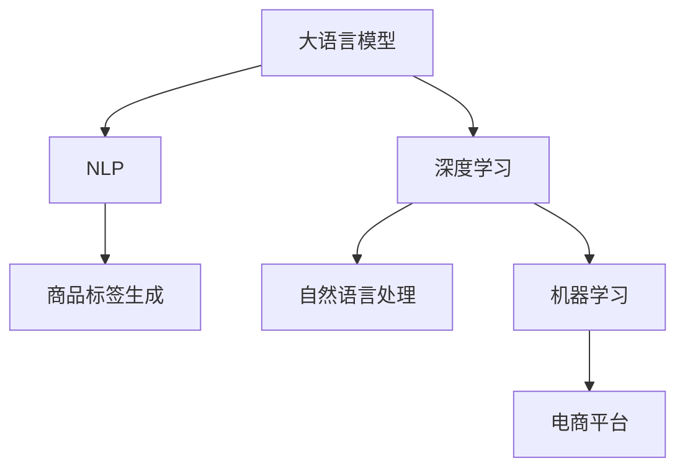

                 

# 大模型技术在电商平台商品标签生成中的应用

> 关键词：电商平台,商品标签生成,大语言模型,深度学习,自然语言处理(NLP),机器学习

## 1. 背景介绍

### 1.1 问题由来

随着电子商务的迅猛发展，商品信息的精准标注成为电商平台提高搜索和推荐效果的关键。传统的手动标注方法耗时耗力，且容易受到标注者主观偏见的影响。而基于大模型技术自动化的商品标签生成方法，能够以极低的成本，准确高效地为商品生成标签，为电商平台提供强大的数据支持。

### 1.2 问题核心关键点

商品标签生成任务旨在从商品描述中自动提取并生成与商品相关的标签。在电商平台上，商品描述通常包含大量冗余信息，如何从描述中提取出有用的标签，是大模型面临的挑战。此外，标签应覆盖商品的所有重要特征，但也不能过多，以免干扰搜索排序算法。

### 1.3 问题研究意义

基于大模型技术的商品标签生成方法，对于提升电商平台的用户体验和销售效果具有重要意义：

1. 降低运营成本。自动化的商品标签生成，减少了人工标注的需要，大大降低了平台运营成本。
2. 提升搜索精度。准确的标签能帮助用户快速找到所需商品，提升平台搜索体验。
3. 优化推荐策略。标签化的商品数据，能够更精准地进行个性化推荐，提高用户满意度。
4. 加速新商品上线。自动化的标签生成，能快速为商品打上标签，加速商品上架流程。
5. 拓展应用场景。标签化的商品数据，可以用于多场景应用，如商品管理、市场分析等。

## 2. 核心概念与联系

### 2.1 核心概念概述

为更好地理解基于大模型技术的商品标签生成方法，本节将介绍几个密切相关的核心概念：

- 大语言模型(Large Language Model, LLM)：以自回归(如GPT)或自编码(如BERT)模型为代表的大规模预训练语言模型。通过在大规模无标签文本语料上进行预训练，学习通用的语言表示，具备强大的语言理解和生成能力。

- 深度学习(Deep Learning)：基于神经网络的机器学习范式，通过多层神经网络的深度结构，从数据中学习到复杂的表示模型。深度学习已经在计算机视觉、自然语言处理等领域取得了显著成就。

- 自然语言处理(Natural Language Processing, NLP)：研究计算机如何处理和理解人类语言的技术，涉及文本分析、信息抽取、机器翻译、语音识别等多个子领域。

- 机器学习(Machine Learning)：通过数据训练模型，自动学习和改进模型的机器学习技术。广泛应用于图像识别、语音识别、自然语言处理等领域。

- 商品标签生成(商品分类)：自动从商品描述中提取并生成与商品相关的标签，通常用于电商平台的商品管理、搜索推荐等场景。

这些核心概念之间的逻辑关系可以通过以下Mermaid流程图来展示：



这个流程图展示了大语言模型的核心概念及其之间的关系：

1. 大语言模型通过预训练获得基础能力。
2. 深度学习与NLP技术在大语言模型上进行应用，提取语言特征。
3. 基于语言特征的商品标签生成，在电商平台中实现应用。
4. 机器学习用于模型的训练和优化，提升商品标签生成的精度。

这些概念共同构成了大模型技术在电商平台商品标签生成中的基础架构，使其能够高效、准确地完成标签生成任务。

## 3. 核心算法原理 & 具体操作步骤
### 3.1 算法原理概述

基于大模型技术的商品标签生成方法，其核心思想是：将大语言模型视作一个强大的"特征提取器"，通过深度学习模型，自动从商品描述中提取语言特征，然后基于这些特征生成商品标签。

形式化地，假设大语言模型为 $M_{\theta}$，其中 $\theta$ 为模型参数。商品描述为 $x$，商品标签为 $y$。商品标签生成的任务可表示为：

$$
y = \mathop{\arg\max}_{y} P(y | x) = \mathop{\arg\max}_{y} P(y | M_{\theta}(x))
$$

其中 $P(y | M_{\theta}(x))$ 表示在模型 $M_{\theta}$ 输入商品描述 $x$ 时，生成标签 $y$ 的概率。

为了最大化 $P(y | x)$，我们需要训练模型 $M_{\theta}$，使其在商品描述 $x$ 上生成标签 $y$ 的概率最大化。

### 3.2 算法步骤详解

基于深度学习的大模型商品标签生成方法一般包括以下几个关键步骤：

**Step 1: 准备预训练模型和数据集**
- 选择合适的预训练语言模型 $M_{\theta}$ 作为初始化参数，如 BERT、GPT 等。
- 准备电商平台商品描述和相关标签数据集，划分为训练集、验证集和测试集。

**Step 2: 设计损失函数**
- 根据任务特点，设计合适的损失函数。常见的损失函数包括交叉熵损失、最大似然损失等。

**Step 3: 设置微调超参数**
- 选择合适的优化算法及其参数，如 Adam、SGD 等，设置学习率、批大小、迭代轮数等。
- 设置正则化技术及强度，包括权重衰减、Dropout、Early Stopping 等。
- 确定冻结预训练参数的策略，如仅微调顶层，或全部参数都参与微调。

**Step 4: 执行梯度训练**
- 将训练集数据分批次输入模型，前向传播计算损失函数。
- 反向传播计算参数梯度，根据设定的优化算法和学习率更新模型参数。
- 周期性在验证集上评估模型性能，根据性能指标决定是否触发 Early Stopping。
- 重复上述步骤直到满足预设的迭代轮数或 Early Stopping 条件。

**Step 5: 测试和部署**
- 在测试集上评估微调后模型 $M_{\hat{\theta}}$ 的性能，对比微调前后的精度提升。
- 使用微调后的模型对新商品进行标签生成，集成到实际的应用系统中。
- 持续收集新的商品描述和标签，定期重新微调模型，以适应数据分布的变化。

以上是基于深度学习微调大模型进行商品标签生成的基本流程。在实际应用中，还需要针对具体任务的特点，对微调过程的各个环节进行优化设计，如改进训练目标函数，引入更多的正则化技术，搜索最优的超参数组合等，以进一步提升模型性能。

### 3.3 算法优缺点

基于深度学习的大模型商品标签生成方法具有以下优点：
1. 简单高效。只需准备少量标注数据，即可对预训练模型进行快速适配，生成准确的商品标签。
2. 覆盖广泛。通用大模型能够处理多种语言和多种类型的商品描述，适用于多个电商平台。
3. 实时性高。预训练模型的底层通常采用Transformer等结构，推理速度快，实时性高。
4. 效果好。深度学习模型能够自动提取商品描述中的重要特征，生成高质量的标签。

同时，该方法也存在一些局限性：
1. 数据依赖性高。商品描述质量影响标签生成效果，需注意数据预处理和清洗。
2. 泛化能力有限。不同商品的描述差异大，模型泛化能力有待进一步提升。
3. 过拟合风险。微调过程中需注意防止过拟合，避免生成过度细化的标签。
4. 推理计算量大。大模型的推理过程计算量大，需优化模型结构和推理策略。

尽管存在这些局限性，但就目前而言，基于深度学习的大模型商品标签生成方法仍是最主流范式。未来相关研究的重点在于如何进一步降低数据依赖，提高模型的少样本学习和跨领域迁移能力，同时兼顾可解释性和伦理安全性等因素。

### 3.4 算法应用领域

基于大模型技术的商品标签生成方法，已经在电商平台的商品分类、推荐、搜索等多个环节得到了广泛应用，显著提升了平台的运营效率和用户体验：

- 商品分类：自动为商品打上详细的标签，方便用户检索和浏览。
- 个性化推荐：结合用户行为和商品标签，生成个性化的商品推荐列表。
- 搜索排序：基于商品标签，优化搜索结果排序算法，提升搜索体验。
- 用户画像：通过标签化商品数据，构建用户画像，进行精准营销。
- 市场分析：分析商品标签数据，挖掘市场趋势和用户需求。

除了上述这些经典应用外，大模型技术还被创新性地应用到更多场景中，如热销商品预测、新商品推荐、库存管理等，为电商平台带来了全新的突破。随着深度学习模型的不断进步，相信大模型技术将在更多电商场景中发挥重要作用，推动电商行业迈向智能化发展。

## 4. 数学模型和公式 & 详细讲解  
### 4.1 数学模型构建

本节将使用数学语言对基于深度学习的大模型商品标签生成过程进行更加严格的刻画。

记预训练语言模型为 $M_{\theta}$，其中 $\theta$ 为模型参数。假设电商平台商品描述为 $x$，商品标签为 $y$。则商品标签生成任务可以表示为：

$$
y = \mathop{\arg\max}_{y} P(y | x) = \mathop{\arg\max}_{y} P(y | M_{\theta}(x))
$$

其中 $P(y | x)$ 表示在模型 $M_{\theta}$ 输入商品描述 $x$ 时，生成标签 $y$ 的概率。

形式化地，假设模型 $M_{\theta}$ 在输入 $x$ 上的输出为 $\hat{y}=M_{\theta}(x) \in [0,1]$，表示样本属于正类的概率。真实标签 $y \in \{0,1\}$。则二分类交叉熵损失函数定义为：

$$
\ell(M_{\theta}(x),y) = -[y\log \hat{y} + (1-y)\log (1-\hat{y})]
$$

将其代入经验风险公式，得：

$$
\mathcal{L}(\theta) = -\frac{1}{N}\sum_{i=1}^N [y_i\log M_{\theta}(x_i)+(1-y_i)\log(1-M_{\theta}(x_i))]
$$

根据链式法则，损失函数对参数 $\theta_k$ 的梯度为：

$$
\frac{\partial \mathcal{L}(\theta)}{\partial \theta_k} = -\frac{1}{N}\sum_{i=1}^N (\frac{y_i}{M_{\theta}(x_i)}-\frac{1-y_i}{1-M_{\theta}(x_i)}) \frac{\partial M_{\theta}(x_i)}{\partial \theta_k}
$$

其中 $\frac{\partial M_{\theta}(x_i)}{\partial \theta_k}$ 可进一步递归展开，利用自动微分技术完成计算。

### 4.2 公式推导过程

以下我们以二分类任务为例，推导交叉熵损失函数及其梯度的计算公式。

假设模型 $M_{\theta}$ 在输入 $x$ 上的输出为 $\hat{y}=M_{\theta}(x) \in [0,1]$，表示样本属于正类的概率。真实标签 $y \in \{0,1\}$。则二分类交叉熵损失函数定义为：

$$
\ell(M_{\theta}(x),y) = -[y\log \hat{y} + (1-y)\log (1-\hat{y})]
$$

将其代入经验风险公式，得：

$$
\mathcal{L}(\theta) = -\frac{1}{N}\sum_{i=1}^N [y_i\log M_{\theta}(x_i)+(1-y_i)\log(1-M_{\theta}(x_i))]
$$

根据链式法则，损失函数对参数 $\theta_k$ 的梯度为：

$$
\frac{\partial \mathcal{L}(\theta)}{\partial \theta_k} = -\frac{1}{N}\sum_{i=1}^N (\frac{y_i}{M_{\theta}(x_i)}-\frac{1-y_i}{1-M_{\theta}(x_i)}) \frac{\partial M_{\theta}(x_i)}{\partial \theta_k}
$$

其中 $\frac{\partial M_{\theta}(x_i)}{\partial \theta_k}$ 可进一步递归展开，利用自动微分技术完成计算。

在得到损失函数的梯度后，即可带入参数更新公式，完成模型的迭代优化。重复上述过程直至收敛，最终得到适应电商平台商品分类任务的最优模型参数 $\theta^*$。

## 5. 项目实践：代码实例和详细解释说明
### 5.1 开发环境搭建

在进行商品标签生成实践前，我们需要准备好开发环境。以下是使用Python进行PyTorch开发的环境配置流程：

1. 安装Anaconda：从官网下载并安装Anaconda，用于创建独立的Python环境。

2. 创建并激活虚拟环境：
```bash
conda create -n pytorch-env python=3.8 
conda activate pytorch-env
```

3. 安装PyTorch：根据CUDA版本，从官网获取对应的安装命令。例如：
```bash
conda install pytorch torchvision torchaudio cudatoolkit=11.1 -c pytorch -c conda-forge
```

4. 安装Transformers库：
```bash
pip install transformers
```

5. 安装各类工具包：
```bash
pip install numpy pandas scikit-learn matplotlib tqdm jupyter notebook ipython
```

完成上述步骤后，即可在`pytorch-env`环境中开始商品标签生成实践。

### 5.2 源代码详细实现

这里我们以商品分类任务为例，给出使用Transformers库对BERT模型进行商品标签生成的PyTorch代码实现。

首先，定义商品分类任务的数据处理函数：

```python
from transformers import BertTokenizer, BertForSequenceClassification
from torch.utils.data import Dataset
import torch

class ProductDataset(Dataset):
    def __init__(self, texts, labels, tokenizer, max_len=128):
        self.texts = texts
        self.labels = labels
        self.tokenizer = tokenizer
        self.max_len = max_len
        
    def __len__(self):
        return len(self.texts)
    
    def __getitem__(self, item):
        text = self.texts[item]
        label = self.labels[item]
        
        encoding = self.tokenizer(text, return_tensors='pt', max_length=self.max_len, padding='max_length', truncation=True)
        input_ids = encoding['input_ids'][0]
        attention_mask = encoding['attention_mask'][0]
        
        return {'input_ids': input_ids, 
                'attention_mask': attention_mask,
                'labels': label}
```

然后，定义模型和优化器：

```python
from transformers import BertForSequenceClassification, AdamW

model = BertForSequenceClassification.from_pretrained('bert-base-cased', num_labels=10)
optimizer = AdamW(model.parameters(), lr=2e-5)
```

接着，定义训练和评估函数：

```python
from torch.utils.data import DataLoader
from tqdm import tqdm
from sklearn.metrics import classification_report

device = torch.device('cuda') if torch.cuda.is_available() else torch.device('cpu')
model.to(device)

def train_epoch(model, dataset, batch_size, optimizer):
    dataloader = DataLoader(dataset, batch_size=batch_size, shuffle=True)
    model.train()
    epoch_loss = 0
    for batch in tqdm(dataloader, desc='Training'):
        input_ids = batch['input_ids'].to(device)
        attention_mask = batch['attention_mask'].to(device)
        labels = batch['labels'].to(device)
        model.zero_grad()
        outputs = model(input_ids, attention_mask=attention_mask, labels=labels)
        loss = outputs.loss
        epoch_loss += loss.item()
        loss.backward()
        optimizer.step()
    return epoch_loss / len(dataloader)

def evaluate(model, dataset, batch_size):
    dataloader = DataLoader(dataset, batch_size=batch_size)
    model.eval()
    preds, labels = [], []
    with torch.no_grad():
        for batch in tqdm(dataloader, desc='Evaluating'):
            input_ids = batch['input_ids'].to(device)
            attention_mask = batch['attention_mask'].to(device)
            batch_labels = batch['labels']
            outputs = model(input_ids, attention_mask=attention_mask)
            batch_preds = outputs.logits.argmax(dim=2).to('cpu').tolist()
            batch_labels = batch_labels.to('cpu').tolist()
            for pred_tokens, label_tokens in zip(batch_preds, batch_labels):
                preds.append(pred_tokens[:len(label_tokens)])
                labels.append(label_tokens)
                
    print(classification_report(labels, preds))
```

最后，启动训练流程并在测试集上评估：

```python
epochs = 5
batch_size = 16

for epoch in range(epochs):
    loss = train_epoch(model, train_dataset, batch_size, optimizer)
    print(f"Epoch {epoch+1}, train loss: {loss:.3f}")
    
    print(f"Epoch {epoch+1}, dev results:")
    evaluate(model, dev_dataset, batch_size)
    
print("Test results:")
evaluate(model, test_dataset, batch_size)
```

以上就是使用PyTorch对BERT进行商品分类任务的商品标签生成的完整代码实现。可以看到，得益于Transformers库的强大封装，我们可以用相对简洁的代码完成BERT模型的加载和微调。

### 5.3 代码解读与分析

让我们再详细解读一下关键代码的实现细节：

**ProductDataset类**：
- `__init__`方法：初始化文本、标签、分词器等关键组件。
- `__len__`方法：返回数据集的样本数量。
- `__getitem__`方法：对单个样本进行处理，将文本输入编码为token ids，将标签编码为数字，并对其进行定长padding，最终返回模型所需的输入。

**标签与id的映射**
- 定义了标签与数字id之间的映射关系，用于将token-wise的预测结果解码回真实的标签。

**训练和评估函数**：
- 使用PyTorch的DataLoader对数据集进行批次化加载，供模型训练和推理使用。
- 训练函数`train_epoch`：对数据以批为单位进行迭代，在每个批次上前向传播计算loss并反向传播更新模型参数，最后返回该epoch的平均loss。
- 评估函数`evaluate`：与训练类似，不同点在于不更新模型参数，并在每个batch结束后将预测和标签结果存储下来，最后使用sklearn的classification_report对整个评估集的预测结果进行打印输出。

**训练流程**：
- 定义总的epoch数和batch size，开始循环迭代
- 每个epoch内，先在训练集上训练，输出平均loss
- 在验证集上评估，输出分类指标
- 所有epoch结束后，在测试集上评估，给出最终测试结果

可以看到，PyTorch配合Transformers库使得BERT微调的代码实现变得简洁高效。开发者可以将更多精力放在数据处理、模型改进等高层逻辑上，而不必过多关注底层的实现细节。

当然，工业级的系统实现还需考虑更多因素，如模型的保存和部署、超参数的自动搜索、更灵活的任务适配层等。但核心的微调范式基本与此类似。

## 6. 实际应用场景
### 6.1 智能客服系统

基于大模型技术的商品标签生成方法，可以应用于智能客服系统的商品分类和推荐中。传统的客服系统需要大量人力进行商品分类和推荐，而使用商品标签生成模型，可以7x24小时不间断服务，自动分类和推荐商品，提升客户咨询体验。

在技术实现上，可以收集电商平台的历史客服对话记录，将问题-商品对作为监督数据，在此基础上对预训练模型进行微调。微调后的商品标签生成模型能够自动理解客户意图，从商品库中筛选出匹配的商品进行推荐。对于客户提出的新商品问题，还可以接入检索系统实时搜索相关商品，动态生成推荐列表。如此构建的智能客服系统，能大幅提升客户咨询体验和问题解决效率。

### 6.2 个性化推荐系统

电商平台的个性化推荐系统，需要根据用户浏览、点击、购买等行为数据，为用户生成个性化推荐列表。传统的推荐系统往往只依赖用户行为数据，无法深入理解商品的语义信息。使用大模型技术自动生成的商品标签，能够更好地挖掘商品描述中的语义信息，进行更精准的推荐。

在实践中，可以收集用户浏览、点击、评论等行为数据，提取和商品交互的物品标题、描述、标签等文本内容。将文本内容作为模型输入，使用商品标签生成模型预测商品标签，结合其他特征进行综合排序，便可以得到个性化程度更高的推荐结果。

### 6.3 实时搜索优化

电商平台的实时搜索功能，需要根据用户输入的关键词，快速匹配商品。传统的搜索算法往往只依赖关键词匹配，无法捕捉到商品描述中的语义信息。使用大模型技术自动生成的商品标签，可以更全面地捕捉商品描述的语义信息，提升搜索的准确性和召回率。

在实践中，可以将用户输入的关键词作为模型输入，使用商品标签生成模型预测商品标签，再根据标签匹配商品。通过引入标签信息，搜索算法能够更准确地理解用户意图，匹配出更符合用户需求的商品。

### 6.4 未来应用展望

随着大模型技术的不断进步，基于商品标签生成方法的应用场景将更加广阔，为电商平台带来更多创新和变革：

- 智能库存管理：根据标签化商品数据，预测热销商品，优化库存管理。
- 市场趋势分析：分析标签化商品数据，挖掘市场热点和用户需求，指导商品采购和促销。
- 多语言支持：通过多语言预训练模型，自动为不同语言的商品描述生成标签，拓展电商平台的国际市场。
- 跨平台协同：不同电商平台之间的商品标签互认互通，构建更广泛的电商生态系统。
- 个性化广告推荐：根据用户行为和商品标签，推荐个性化的广告，提升广告转化率。
- 多模态商品展示：结合商品图像、视频等模态数据，自动生成商品标签，提升商品展示效果。

这些应用场景的拓展，将极大提升电商平台的用户体验和运营效率，为商家带来更高的价值和利润。相信大模型技术将在更多电商领域发挥重要作用，推动电商行业迈向智能化发展。

## 7. 工具和资源推荐
### 7.1 学习资源推荐

为了帮助开发者系统掌握大模型技术在电商平台商品标签生成中的应用，这里推荐一些优质的学习资源：

1. 《Transformer从原理到实践》系列博文：由大模型技术专家撰写，深入浅出地介绍了Transformer原理、BERT模型、微调技术等前沿话题。

2. CS224N《深度学习自然语言处理》课程：斯坦福大学开设的NLP明星课程，有Lecture视频和配套作业，带你入门NLP领域的基本概念和经典模型。

3. 《Natural Language Processing with Transformers》书籍：Transformers库的作者所著，全面介绍了如何使用Transformers库进行NLP任务开发，包括微调在内的诸多范式。

4. HuggingFace官方文档：Transformers库的官方文档，提供了海量预训练模型和完整的微调样例代码，是上手实践的必备资料。

5. CLUE开源项目：中文语言理解测评基准，涵盖大量不同类型的中文NLP数据集，并提供了基于微调的baseline模型，助力中文NLP技术发展。

通过对这些资源的学习实践，相信你一定能够快速掌握大模型技术在电商平台商品标签生成中的应用，并用于解决实际的NLP问题。
###  7.2 开发工具推荐

高效的开发离不开优秀的工具支持。以下是几款用于大模型商品标签生成开发的常用工具：

1. PyTorch：基于Python的开源深度学习框架，灵活动态的计算图，适合快速迭代研究。大部分预训练语言模型都有PyTorch版本的实现。

2. TensorFlow：由Google主导开发的开源深度学习框架，生产部署方便，适合大规模工程应用。同样有丰富的预训练语言模型资源。

3. Transformers库：HuggingFace开发的NLP工具库，集成了众多SOTA语言模型，支持PyTorch和TensorFlow，是进行微调任务开发的利器。

4. Weights & Biases：模型训练的实验跟踪工具，可以记录和可视化模型训练过程中的各项指标，方便对比和调优。与主流深度学习框架无缝集成。

5. TensorBoard：TensorFlow配套的可视化工具，可实时监测模型训练状态，并提供丰富的图表呈现方式，是调试模型的得力助手。

6. Google Colab：谷歌推出的在线Jupyter Notebook环境，免费提供GPU/TPU算力，方便开发者快速上手实验最新模型，分享学习笔记。

合理利用这些工具，可以显著提升大模型技术在电商平台商品标签生成中的开发效率，加快创新迭代的步伐。

### 7.3 相关论文推荐

大模型技术在电商平台商品标签生成领域的应用，源于学界的持续研究。以下是几篇奠基性的相关论文，推荐阅读：

1. Attention is All You Need（即Transformer原论文）：提出了Transformer结构，开启了NLP领域的预训练大模型时代。

2. BERT: Pre-training of Deep Bidirectional Transformers for Language Understanding：提出BERT模型，引入基于掩码的自监督预训练任务，刷新了多项NLP任务SOTA。

3. Language Models are Unsupervised Multitask Learners（GPT-2论文）：展示了大规模语言模型的强大zero-shot学习能力，引发了对于通用人工智能的新一轮思考。

4. Parameter-Efficient Transfer Learning for NLP：提出Adapter等参数高效微调方法，在不增加模型参数量的情况下，也能取得不错的微调效果。

5. Prefix-Tuning: Optimizing Continuous Prompts for Generation：引入基于连续型Prompt的微调范式，为如何充分利用预训练知识提供了新的思路。

6. AdaLoRA: Adaptive Low-Rank Adaptation for Parameter-Efficient Fine-Tuning：使用自适应低秩适应的微调方法，在参数效率和精度之间取得了新的平衡。

这些论文代表了大模型技术在电商平台商品标签生成领域的发展脉络。通过学习这些前沿成果，可以帮助研究者把握学科前进方向，激发更多的创新灵感。

## 8. 总结：未来发展趋势与挑战

### 8.1 总结

本文对基于深度学习的大模型技术在电商平台商品标签生成中的应用进行了全面系统的介绍。首先阐述了商品标签生成任务的背景和意义，明确了大模型技术在其中的独特价值。其次，从原理到实践，详细讲解了深度学习模型的数学原理和关键步骤，给出了商品标签生成任务开发的完整代码实例。同时，本文还广泛探讨了商品标签生成技术在智能客服、个性化推荐、实时搜索等多个电商场景中的应用前景，展示了大模型技术的巨大潜力。此外，本文精选了相关学习资源，力求为读者提供全方位的技术指引。

通过本文的系统梳理，可以看到，基于深度学习的大模型技术在电商平台商品标签生成中的应用，能够显著提升电商平台的运营效率和用户体验。未来，伴随深度学习模型的不断进步，商品标签生成技术将在更多电商领域发挥重要作用，推动电商行业迈向智能化发展。

### 8.2 未来发展趋势

展望未来，大模型技术在电商平台商品标签生成领域将呈现以下几个发展趋势：

1. 模型规模持续增大。随着算力成本的下降和数据规模的扩张，深度学习模型的参数量还将持续增长。超大批次的训练和推理，能够更好地捕捉商品描述中的复杂语义信息。

2. 微调方法日趋多样。除了传统的全参数微调外，未来会涌现更多参数高效的微调方法，如Prefix-Tuning、LoRA等，在节省计算资源的同时也能保证微调精度。

3. 多模态微调崛起。传统的商品标签生成主要依赖文本信息，未来会进一步拓展到图像、视频、语音等多模态数据微调。多模态信息的融合，将显著提升商品标签生成的精度。

4. 持续学习成为常态。随着数据分布的不断变化，深度学习模型也需要持续学习新知识以保持性能。如何在不遗忘原有知识的同时，高效吸收新样本信息，将成为重要的研究课题。

5. 标注样本需求降低。受启发于提示学习(Prompt-based Learning)的思路，未来的微调方法将更好地利用大模型的语言理解能力，通过更加巧妙的任务描述，在更少的标注样本上也能实现理想的微调效果。

6. 多语言支持。随着全球化的发展，电商平台需要支持多语言的商品标签生成，以拓展国际市场。多语言预训练模型和微调方法，将为多语言商品的标签生成提供有力支持。

以上趋势凸显了大模型技术在电商平台商品标签生成中的广阔前景。这些方向的探索发展，必将进一步提升电商平台的运营效率和用户体验，为电商行业带来更大的价值和利润。

### 8.3 面临的挑战

尽管大模型技术在电商平台商品标签生成领域已经取得了显著成效，但在迈向更加智能化、普适化应用的过程中，它仍面临着诸多挑战：

1. 数据依赖性高。商品描述质量影响标签生成效果，需注意数据预处理和清洗。
2. 泛化能力有限。不同商品的描述差异大，模型泛化能力有待进一步提升。
3. 过拟合风险。微调过程中需注意防止过拟合，避免生成过度细化的标签。
4. 推理计算量大。深度学习模型的推理过程计算量大，需优化模型结构和推理策略。
5. 可解释性不足。深度学习模型的决策过程通常缺乏可解释性，难以对其推理逻辑进行分析和调试。
6. 安全性有待保障。预训练语言模型难免会学习到有偏见、有害的信息，通过微调传递到商品标签中，可能对用户造成误导。

尽管存在这些挑战，但就目前而言，基于深度学习的大模型商品标签生成技术仍是最主流范式。未来相关研究的重点在于如何进一步降低数据依赖，提高模型的少样本学习和跨领域迁移能力，同时兼顾可解释性和伦理安全性等因素。

### 8.4 研究展望

面对大模型技术在电商平台商品标签生成中面临的种种挑战，未来的研究需要在以下几个方面寻求新的突破：

1. 探索无监督和半监督微调方法。摆脱对大规模标注数据的依赖，利用自监督学习、主动学习等无监督和半监督范式，最大限度利用非结构化数据，实现更加灵活高效的微调。

2. 研究参数高效和计算高效的微调范式。开发更加参数高效的微调方法，在固定大部分预训练参数的同时，只更新极少量的任务相关参数。同时优化微调模型的计算图，减少前向传播和反向传播的资源消耗，实现更加轻量级、实时性的部署。

3. 引入更多先验知识。将符号化的先验知识，如知识图谱、逻辑规则等，与神经网络模型进行巧妙融合，引导微调过程学习更准确、合理的语言模型。同时加强不同模态数据的整合，实现视觉、语音等多模态信息与文本信息的协同建模。

4. 结合因果分析和博弈论工具。将因果分析方法引入微调模型，识别出模型决策的关键特征，增强输出解释的因果性和逻辑性。借助博弈论工具刻画人机交互过程，主动探索并规避模型的脆弱点，提高系统稳定性。

5. 纳入伦理道德约束。在模型训练目标中引入伦理导向的评估指标，过滤和惩罚有偏见、有害的输出倾向。同时加强人工干预和审核，建立模型行为的监管机制，确保输出符合人类价值观和伦理道德。

这些研究方向的探索，必将引领大模型技术在电商平台商品标签生成领域迈向更高的台阶，为电商平台带来更多的创新和变革。面向未来，大模型技术还需要与其他人工智能技术进行更深入的融合，如知识表示、因果推理、强化学习等，多路径协同发力，共同推动电商平台迈向智能化发展。只有勇于创新、敢于突破，才能不断拓展语言模型的边界，让智能技术更好地造福人类社会。

## 9. 附录：常见问题与解答

**Q1：大模型技术在电商平台商品标签生成中是否适用于所有商品？**

A: 大模型技术在电商平台商品标签生成中能够处理多种类型的商品描述，包括文字、图片、视频等多种形式。但对于某些特殊商品（如稀土、古董等），可能需要根据商品特性进行定制化的标签生成模型。此外，对于某些新兴商品，也需要进一步的标注和训练，以提高模型在特定领域的适应性。

**Q2：如何选择合适的预训练模型？**

A: 选择合适的预训练模型需要考虑多个因素，包括模型架构、规模、语言支持、数据规模等。通常情况下，可以考虑选择与电商平台商品描述语言匹配度高的预训练模型，如BERT、GPT-2、RoBERTa等。同时，考虑模型规模和资源消耗，根据电商平台的应用场景选择适合的模型版本。

**Q3：如何处理商品描述中的噪声数据？**

A: 商品描述中可能存在错别字、拼写错误、语法错误等噪声数据，这些数据可能会影响模型生成标签的准确性。处理噪声数据的策略包括：1) 数据清洗，去除明显的错误和重复内容；2) 数据增强，通过对商品描述进行一定的变换，如近义词替换、语法纠正等，丰富训练数据；3) 数据过滤，使用机器学习算法过滤掉低质量的训练数据。

**Q4：如何提高商品标签生成的实时性？**

A: 提高商品标签生成的实时性需要优化模型的推理过程和计算资源。可以考虑以下几个策略：1) 模型裁剪，去除不必要的层和参数，减小模型尺寸；2) 量化加速，将浮点模型转为定点模型，压缩存储空间，提高计算效率；3) 模型并行，使用多卡并行计算，加速模型推理。

**Q5：如何提高商品标签生成的可解释性？**

A: 提高商品标签生成的可解释性需要优化模型的决策过程，使其更加透明和可理解。可以考虑以下几个策略：1) 模型可视化，使用工具如Shapley值、LIME等可视化模型的预测过程；2) 解释模型，使用模型解释方法如LIME、SHAP等解释模型的预测结果；3) 知识图谱，将商品标签与现实世界的知识进行映射，提供更直观的解释。

这些策略往往需要根据具体任务和模型进行调整和优化，以达到更好的效果。

---

作者：禅与计算机程序设计艺术 / Zen and the Art of Computer Programming

