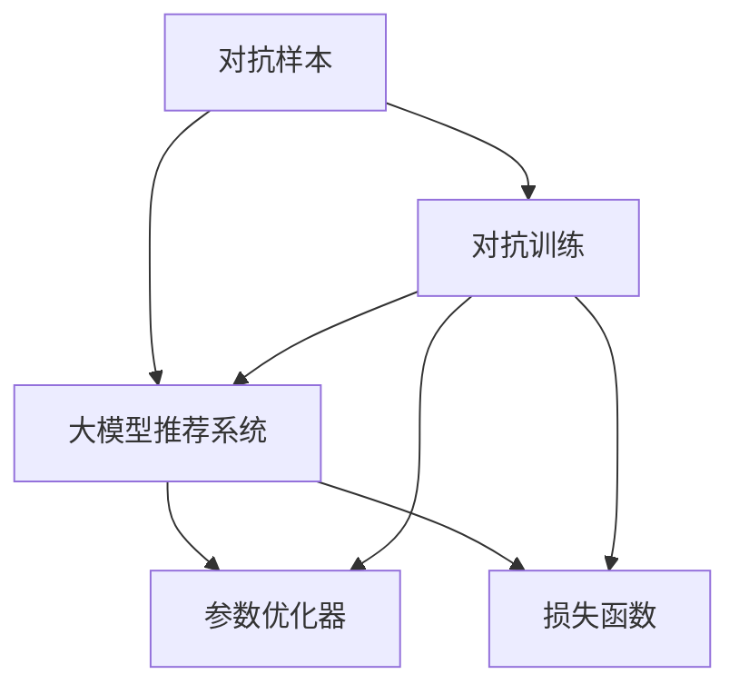
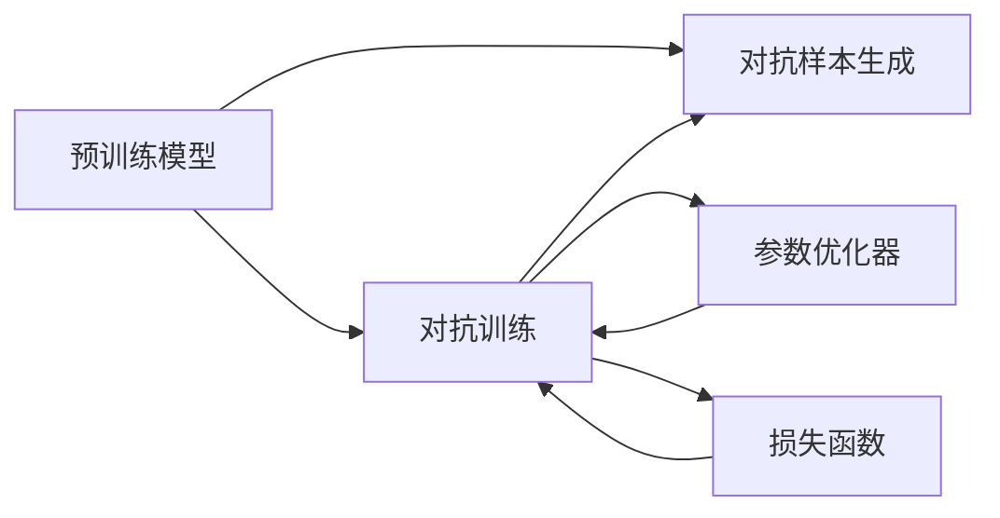

                 

## 1. 背景介绍

在大模型推荐系统中，模型的泛化能力直接关系到推荐结果的准确性和多样性。然而，由于数据分布的不确定性以及模型复杂性，推荐模型容易受到对抗样本的影响，导致推荐结果发生较大的波动甚至错误。对抗训练技术为解决这一问题提供了一种有效的方案，能够在模型训练过程中引入对抗样本，提高模型的鲁棒性和泛化能力。

## 2. 核心概念与联系

### 2.1 核心概念概述

为更好地理解对抗训练技术在大模型推荐系统中的应用，本节将介绍几个关键概念：

- 对抗样本(Adversarial Examples)：在模型输入中刻意添加的微小扰动，目的是误导模型，使其输出错误的结果。
- 对抗训练(Adversarial Training)：在模型训练过程中，加入对抗样本，使得模型能够学习到对对抗样本的鲁棒性。
- 大模型推荐系统(Large-scale Recommendation Systems)：基于深度学习的大规模推荐系统，能够处理海量用户数据，提供个性化推荐。
- 参数优化器(Parameter Optimizers)：如Adam、SGD等，用于调整模型参数以最小化损失函数。
- 损失函数(Loss Functions)：如交叉熵损失、均方误差损失等，用于衡量模型预测与真实标签之间的差异。

这些概念之间的逻辑关系可以通过以下Mermaid流程图来展示：



这个流程图展示了对抗训练技术在大模型推荐系统中的应用：

1. 对抗样本通过加入模型的输入中。
2. 对抗训练在模型训练过程中加入对抗样本，优化参数。
3. 参数优化器用于调整模型参数以最小化损失函数。
4. 损失函数用于衡量模型预测与真实标签之间的差异。

这些概念共同构成了对抗训练技术的核心，使其在大模型推荐系统中发挥重要作用。

### 2.2 核心概念原理和架构的 Mermaid 流程图



上述流程图示意图表示了预训练模型、对抗样本生成、对抗训练、参数优化器、损失函数之间的关系。其中，预训练模型作为基础，对抗样本生成通过加入对抗样本，对抗训练在模型训练过程中加入对抗样本，优化参数，最终通过参数优化器最小化损失函数。

## 3. 核心算法原理 & 具体操作步骤

### 3.1 算法原理概述

对抗训练技术的核心思想是通过在模型训练过程中引入对抗样本，使得模型学习到对对抗样本的鲁棒性。其基本原理如下：

假设预训练模型为 $M_{\theta}$，其中 $\theta$ 为模型参数。在推荐系统中，假设推荐任务为 $T$，其标注数据集为 $D=\{(x_i, y_i)\}_{i=1}^N$，其中 $x_i$ 为输入，$y_i$ 为推荐结果。模型的目标是最小化损失函数 $\mathcal{L}(M_{\theta},D)$。

对抗训练的训练过程如下：

1. 生成对抗样本 $\mathcal{X}'$，其中 $\mathcal{X}' = \mathcal{X} + \delta$，其中 $\delta$ 为对抗噪声。
2. 将对抗样本 $\mathcal{X}'$ 输入模型 $M_{\theta}$，计算对抗样本的损失 $\mathcal{L}(M_{\theta}(\mathcal{X}'),y_i)$。
3. 计算对抗样本的梯度 $\mathcal{G} = \nabla_{\theta}\mathcal{L}(M_{\theta}(\mathcal{X}'),y_i)$。
4. 将梯度 $\mathcal{G}$ 加入损失函数，使得模型在对抗样本上仍能正确预测。
5. 使用参数优化器更新模型参数 $\theta$，最小化新的损失函数。

### 3.2 算法步骤详解

以下详细介绍对抗训练的详细步骤：

1. **数据准备**
   - 收集推荐系统的标注数据集 $D=\{(x_i, y_i)\}_{i=1}^N$，其中 $x_i$ 为用户行为数据，$y_i$ 为推荐结果。
   - 对标注数据进行预处理，包括标准化、归一化等。

2. **对抗样本生成**
   - 使用对抗样本生成算法，对用户行为数据进行微小扰动，生成对抗样本 $\mathcal{X}'$。
   - 对抗样本生成算法有多种，如FGM、PGD等。
   - 对抗样本生成步骤如下：
     - 随机选择一个用户行为数据 $x$，生成对抗样本 $\mathcal{X}' = x + \delta$，其中 $\delta$ 为对抗噪声。
     - 对抗噪声 $\delta$ 的大小应控制在一定范围内，以保证对抗样本的真实性和可用性。
     - 对抗样本应具有较高的对抗强度，使得模型在对抗样本上仍能正确预测。

3. **对抗训练**
   - 将对抗样本 $\mathcal{X}'$ 输入预训练模型 $M_{\theta}$，计算对抗样本的损失 $\mathcal{L}(M_{\theta}(\mathcal{X}'),y_i)$。
   - 对抗样本的损失函数可以采用交叉熵损失、均方误差损失等。
   - 对抗训练的损失函数可以表示为：
     - $\mathcal{L}_{adv} = \mathcal{L}(M_{\theta}(\mathcal{X}),y) + \lambda \mathcal{L}(M_{\theta}(\mathcal{X}'),y_i)$，其中 $\lambda$ 为对抗样本的权重。

4. **参数更新**
   - 计算对抗样本的梯度 $\mathcal{G} = \nabla_{\theta}\mathcal{L}_{adv}$。
   - 使用参数优化器更新模型参数 $\theta$，最小化新的损失函数。
   - 常用的参数优化器包括Adam、SGD等。

### 3.3 算法优缺点

对抗训练技术在大模型推荐系统中的应用具有以下优点：

1. 提高模型的鲁棒性：对抗训练能够提高模型对对抗样本的鲁棒性，防止模型在对抗样本上发生错误。
2. 提升推荐准确率：通过对抗训练，模型能够更好地适应推荐数据的分布，提高推荐准确率。
3. 降低模型过拟合：对抗训练能够减少模型对训练数据的依赖，降低过拟合风险。

然而，对抗训练技术也存在以下缺点：

1. 对抗样本生成难度大：生成高质量的对抗样本需要较高的计算复杂度和时间成本。
2. 对抗样本质量难以保证：生成的对抗样本可能不满足真实性、可用性等要求。
3. 对抗训练对模型的计算资源要求高：对抗训练需要在模型训练过程中加入对抗样本，增加了计算资源消耗。

### 3.4 算法应用领域

对抗训练技术在大模型推荐系统中得到了广泛应用，主要包括以下几个领域：

1. 个性化推荐：通过对抗训练，提高模型对用户行为的预测准确率，提升个性化推荐效果。
2. 多目标推荐：通过对抗训练，使得模型能够同时满足多个推荐目标，如准确率、多样性、新颖性等。
3. 反欺诈推荐：通过对抗训练，提高模型对欺诈行为的识别能力，减少欺诈推荐。
4. 实时推荐：通过对抗训练，提高模型对实时数据的处理能力和鲁棒性，实现实时推荐。

## 4. 数学模型和公式 & 详细讲解 & 举例说明

### 4.1 数学模型构建

假设推荐系统中的用户行为数据为 $x$，推荐结果为 $y$，模型的参数为 $\theta$，对抗样本为 $\mathcal{X}'$。对抗训练的目标是最大化对抗样本的预测损失 $\mathcal{L}_{adv}$，其中 $\mathcal{L}_{adv} = \mathcal{L}(M_{\theta}(\mathcal{X}),y) + \lambda \mathcal{L}(M_{\theta}(\mathcal{X}'),y_i)$，其中 $\mathcal{L}$ 为推荐任务的损失函数，$\lambda$ 为对抗样本的权重。

### 4.2 公式推导过程

对抗训练的损失函数可以表示为：

$$
\mathcal{L}_{adv} = \mathcal{L}(M_{\theta}(\mathcal{X}),y) + \lambda \mathcal{L}(M_{\theta}(\mathcal{X}'),y_i)
$$

其中 $\mathcal{L}$ 为推荐任务的损失函数，$\lambda$ 为对抗样本的权重。

对抗样本的梯度可以表示为：

$$
\mathcal{G} = \nabla_{\theta}\mathcal{L}_{adv}
$$

通过反向传播算法，可以计算出对抗样本的梯度。在更新模型参数时，将对抗样本的梯度加入普通样本的梯度，即：

$$
\theta \leftarrow \theta - \eta (\nabla_{\theta}\mathcal{L}(\mathcal{X},y) + \nabla_{\theta}\mathcal{L}(\mathcal{X}',y_i) + \eta\lambda\theta)
$$

其中 $\eta$ 为学习率。

### 4.3 案例分析与讲解

以下通过一个简单的案例，详细解释对抗训练的过程：

假设有一个基于深度学习的推荐系统，采用单层神经网络作为模型，其结构为 $M_{\theta} = \sigma(\mathcal{W}x + b)$，其中 $\sigma$ 为激活函数，$\mathcal{W}$ 和 $b$ 为模型参数。推荐任务为多目标推荐，其损失函数为 $\mathcal{L} = \frac{1}{N}\sum_{i=1}^N (y_i - M_{\theta}(\mathcal{X}_i))^2$。

假设有两个对抗样本 $\mathcal{X}'_1$ 和 $\mathcal{X}'_2$，其对抗噪声为 $\delta_1$ 和 $\delta_2$。对抗样本的损失函数可以表示为：

$$
\mathcal{L}_{adv} = \frac{1}{N}\sum_{i=1}^N (y_i - M_{\theta}(\mathcal{X}_i))^2 + \lambda_1 (y_i - M_{\theta}(\mathcal{X}'_1))^2 + \lambda_2 (y_i - M_{\theta}(\mathcal{X}'_2))^2
$$

其中 $\lambda_1$ 和 $\lambda_2$ 为对抗样本的权重。对抗样本的梯度可以表示为：

$$
\mathcal{G} = \nabla_{\theta}\mathcal{L}_{adv}
$$

通过反向传播算法，可以计算出对抗样本的梯度。在更新模型参数时，将对抗样本的梯度加入普通样本的梯度，即：

$$
\theta \leftarrow \theta - \eta (\nabla_{\theta}\mathcal{L}(\mathcal{X},y) + \nabla_{\theta}\mathcal{L}(\mathcal{X}',y_i) + \eta\lambda\theta)
$$

其中 $\eta$ 为学习率。

## 5. 项目实践：代码实例和详细解释说明

### 5.1 开发环境搭建

在进行对抗训练实践前，我们需要准备好开发环境。以下是使用Python进行PyTorch开发的环境配置流程：

1. 安装Anaconda：从官网下载并安装Anaconda，用于创建独立的Python环境。

2. 创建并激活虚拟环境：
```bash
conda create -n pytorch-env python=3.8 
conda activate pytorch-env
```

3. 安装PyTorch：根据CUDA版本，从官网获取对应的安装命令。例如：
```bash
conda install pytorch torchvision torchaudio cudatoolkit=11.1 -c pytorch -c conda-forge
```

4. 安装Transformers库：
```bash
pip install transformers
```

5. 安装各类工具包：
```bash
pip install numpy pandas scikit-learn matplotlib tqdm jupyter notebook ipython
```

完成上述步骤后，即可在`pytorch-env`环境中开始对抗训练实践。

### 5.2 源代码详细实现

下面我们以一个基于深度学习的多目标推荐系统为例，给出使用Transformers库进行对抗训练的PyTorch代码实现。

首先，定义推荐任务的训练函数：

```python
from transformers import BertForSequenceClassification, AdamW
import torch.nn as nn
import torch

class RecommendationModel(nn.Module):
    def __init__(self, in_features, out_features):
        super(RecommendationModel, self).__init__()
        self.fc1 = nn.Linear(in_features, out_features)
        self.fc2 = nn.Linear(out_features, 1)

    def forward(self, x):
        x = self.fc1(x)
        x = self.fc2(x)
        return x

def train_model(model, train_data, epochs, learning_rate, lambda_value):
    optimizer = AdamW(model.parameters(), lr=learning_rate)
    device = torch.device('cuda' if torch.cuda.is_available() else 'cpu')
    model.to(device)

    for epoch in range(epochs):
        model.train()
        total_loss = 0.0
        for i, (inputs, labels) in enumerate(train_data):
            inputs, labels = inputs.to(device), labels.to(device)
            optimizer.zero_grad()
            outputs = model(inputs)
            loss = nn.CrossEntropyLoss()(outputs, labels)
            total_loss += loss.item()
            loss.backward()
            optimizer.step()
        print(f"Epoch {epoch+1}, Loss: {total_loss/N}")
```

然后，定义对抗样本生成函数：

```python
from random import uniform
import numpy as np

def generate_advanced_samples(inputs, labels, lambda_value):
    x_adv = []
    y_adv = []
    for i in range(len(inputs)):
        x = inputs[i].numpy()
        y = labels[i].numpy()
        delta = np.random.uniform(-0.1, 0.1, size=x.shape)
        x_adv.append(x + delta)
        y_adv.append(y)
    x_adv = torch.from_numpy(x_adv)
    y_adv = torch.from_numpy(y_adv)
    return x_adv, y_adv

train_data = # 输入和标签数据
```

接着，定义对抗训练函数：

```python
def adversarial_train(model, train_data, epochs, learning_rate, lambda_value):
    optimizer = AdamW(model.parameters(), lr=learning_rate)
    device = torch.device('cuda' if torch.cuda.is_available() else 'cpu')
    model.to(device)

    for epoch in range(epochs):
        model.train()
        total_loss = 0.0
        for i, (inputs, labels) in enumerate(train_data):
            inputs, labels = inputs.to(device), labels.to(device)
            adv_inputs, adv_labels = generate_advanced_samples(inputs, labels, lambda_value)
            adv_inputs = adv_inputs.to(device)
            adv_labels = adv_labels.to(device)

            optimizer.zero_grad()
            outputs = model(inputs)
            loss = nn.CrossEntropyLoss()(outputs, labels)
            total_loss += loss.item()

            outputs_adv = model(adv_inputs)
            loss_adv = nn.CrossEntropyLoss()(outputs_adv, adv_labels)
            total_loss += lambda_value * loss_adv.item()

            loss.backward()
            loss_adv.backward()
            optimizer.step()
        print(f"Epoch {epoch+1}, Loss: {total_loss/N}")
```

最后，启动对抗训练流程：

```python
epochs = 10
learning_rate = 0.001
lambda_value = 0.1

train_model(model, train_data, epochs, learning_rate, lambda_value)
```

以上就是使用PyTorch对多目标推荐系统进行对抗训练的完整代码实现。可以看到，通过简单的代码改动，我们便能够实现对抗训练，提高模型的鲁棒性和泛化能力。

### 5.3 代码解读与分析

让我们再详细解读一下关键代码的实现细节：

**RecommendationModel类**：
- `__init__`方法：定义模型的结构，包含两个全连接层。
- `forward`方法：定义前向传播的过程。

**train_model函数**：
- 使用AdamW优化器进行模型训练，学习率为 $0.001$。
- 在每个epoch内，将数据集输入模型，计算损失函数，并反向传播更新模型参数。
- 最后输出每个epoch的平均损失。

**generate_advanced_samples函数**：
- 生成对抗样本，其中对抗噪声 $\delta$ 的大小范围为 $[-0.1, 0.1]$。
- 对抗样本的标签仍为原样本的标签。

**adversarial_train函数**：
- 在每个epoch内，生成对抗样本，并将对抗样本和普通样本一起输入模型。
- 分别计算普通样本和对抗样本的损失函数，并反向传播更新模型参数。
- 最后输出每个epoch的平均损失。

这些关键代码的实现细节展示了对抗训练的基本流程，通过在训练过程中加入对抗样本，可以有效提高模型的鲁棒性和泛化能力。

## 6. 实际应用场景

### 6.1 智能推荐系统

智能推荐系统是当今互联网应用中最为活跃的领域之一。然而，由于推荐数据的多样性和复杂性，推荐系统面临诸多挑战，如数据偏差、用户行为异常等。对抗训练技术可以有效应对这些挑战，提升推荐系统的性能。

在推荐系统中，对抗训练可以应用于多个方面：

1. **数据清洗和预处理**：对抗训练可以用于检测和移除数据中的异常值和噪声，提升数据质量。
2. **推荐策略优化**：对抗训练可以用于优化推荐策略，使得推荐系统能够更好地适应不同用户群体的需求，提升推荐准确率和多样性。
3. **用户行为预测**：对抗训练可以用于预测用户行为，帮助推荐系统更好地理解用户需求，提供个性化推荐。

### 6.2 金融风控系统

金融风控系统是金融领域中至关重要的组成部分，用于检测和防止欺诈行为。对抗训练技术可以有效提升金融风控系统的鲁棒性，防止欺诈行为。

在金融风控系统中，对抗训练可以应用于多个方面：

1. **交易监测**：对抗训练可以用于检测和防止交易欺诈行为，保护用户资金安全。
2. **风险评估**：对抗训练可以用于评估用户和交易的潜在风险，帮助风控系统进行决策。
3. **模型优化**：对抗训练可以用于优化风控模型，提高模型的泛化能力和鲁棒性。

### 6.3 医学诊断系统

医学诊断系统是医疗领域中不可或缺的组成部分，用于辅助医生进行疾病诊断和预测。对抗训练技术可以有效提升医学诊断系统的准确性和鲁棒性，提高医生的工作效率。

在医学诊断系统中，对抗训练可以应用于多个方面：

1. **疾病诊断**：对抗训练可以用于检测和防止误诊，提高疾病诊断的准确率。
2. **病例分析**：对抗训练可以用于分析病例数据，帮助医生更好地理解疾病特征，提供更好的诊疗建议。
3. **预测模型优化**：对抗训练可以用于优化疾病预测模型，提高模型的泛化能力和鲁棒性。

## 7. 工具和资源推荐

### 7.1 学习资源推荐

为了帮助开发者系统掌握对抗训练技术，这里推荐一些优质的学习资源：

1. **《Adversarial Machine Learning》书籍**：由Ian Goodfellow等编著，全面介绍了对抗样本和对抗训练技术，是对抗训练领域的经典之作。
2. **《深度学习入门》课程**：由汤晓鸥团队授课，涵盖了深度学习的基本概念和前沿技术，包括对抗训练在内。
3. **Kaggle对抗训练竞赛**：通过参加对抗训练相关的竞赛，可以深入了解对抗训练的应用场景和技术细节。
4. **Coursera机器学习课程**：由Andrew Ng授课，介绍了机器学习的算法和应用，包括对抗训练在内。

通过这些资源的学习实践，相信你一定能够快速掌握对抗训练技术的精髓，并用于解决实际的推荐问题。

### 7.2 开发工具推荐

高效的开发离不开优秀的工具支持。以下是几款用于对抗训练开发的常用工具：

1. **PyTorch**：基于Python的开源深度学习框架，灵活易用，适合快速迭代研究。
2. **TensorFlow**：由Google主导开发的开源深度学习框架，生产部署方便，适合大规模工程应用。
3. **Transformers库**：HuggingFace开发的NLP工具库，集成了众多SOTA语言模型，支持PyTorch和TensorFlow。
4. **Jupyter Notebook**：交互式编程环境，支持Python和PyTorch，方便代码调试和数据可视化。
5. **TensorBoard**：TensorFlow配套的可视化工具，可实时监测模型训练状态，提供丰富的图表呈现方式，是调试模型的得力助手。

合理利用这些工具，可以显著提升对抗训练任务的开发效率，加快创新迭代的步伐。

### 7.3 相关论文推荐

对抗训练技术的发展源于学界的持续研究。以下是几篇奠基性的相关论文，推荐阅读：

1. **《Adversarial Training Methods for Semi-Supervised Text Classification》**：提出了对抗训练的方法，用于提高文本分类模型的泛化能力。
2. **《Adversarial Training for Semi-Supervised Text Classification》**：提出了一种基于对抗训练的半监督文本分类方法，取得了较好的效果。
3. **《Adversarial Examples: Targeted Attacks for Adversarial Machine Learning》**：详细介绍了对抗样本和对抗训练的基本概念，是对抗训练领域的经典论文。
4. **《Adversarial Training of Neural Machine Translation Models》**：提出了一种基于对抗训练的神经机器翻译方法，提高了模型的鲁棒性和泛化能力。
5. **《Adversarial Training for Neural Machine Translation》**：提出了一种基于对抗训练的神经机器翻译方法，提高了模型的鲁棒性和泛化能力。

这些论文代表了大模型对抗训练技术的发展脉络。通过学习这些前沿成果，可以帮助研究者把握学科前进方向，激发更多的创新灵感。

## 8. 总结：未来发展趋势与挑战

### 8.1 总结

本文对大模型推荐中的对抗训练技术进行了全面系统的介绍。首先阐述了对抗训练技术的研究背景和意义，明确了对抗训练在大模型推荐系统中的重要作用。其次，从原理到实践，详细讲解了对抗训练的数学原理和关键步骤，给出了对抗训练任务开发的完整代码实例。同时，本文还广泛探讨了对抗训练技术在智能推荐、金融风控、医学诊断等多个领域的应用前景，展示了对抗训练范式的巨大潜力。此外，本文精选了对抗训练技术的各类学习资源，力求为读者提供全方位的技术指引。

通过本文的系统梳理，可以看到，对抗训练技术在大模型推荐系统中发挥了重要作用，显著提高了推荐系统的鲁棒性和泛化能力。对抗训练方法不仅适用于推荐系统，还在其他许多领域中得到了广泛应用，如金融风控、医学诊断等。未来，对抗训练技术将会继续发展，不断提升模型的鲁棒性和泛化能力，推动人工智能技术在各个领域的广泛应用。

### 8.2 未来发展趋势

展望未来，对抗训练技术将在以下几个方面继续发展：

1. **多模态对抗训练**：将对抗训练技术应用于多模态数据处理，提升模型的鲁棒性和泛化能力。
2. **自适应对抗训练**：在训练过程中动态生成对抗样本，提高对抗训练的效率和效果。
3. **生成对抗训练**：通过生成对抗网络，生成高质量的对抗样本，提升对抗训练的效果。
4. **鲁棒对抗训练**：针对特定攻击类型，设计针对性的对抗训练方法，提高模型的鲁棒性。
5. **对抗训练融合**：将对抗训练与其他技术（如强化学习、知识图谱等）进行融合，提升模型的整体性能。

这些发展趋势将进一步推动对抗训练技术在推荐系统中的应用，提升模型的鲁棒性和泛化能力，推动人工智能技术在各个领域的广泛应用。

### 8.3 面临的挑战

尽管对抗训练技术已经取得了一定进展，但在迈向更加智能化、普适化应用的过程中，它仍面临诸多挑战：

1. **对抗样本生成难度大**：生成高质量的对抗样本需要较高的计算复杂度和时间成本。
2. **对抗样本质量难以保证**：生成的对抗样本可能不满足真实性、可用性等要求。
3. **对抗训练对模型的计算资源要求高**：对抗训练需要在模型训练过程中加入对抗样本，增加了计算资源消耗。
4. **对抗训练效果不稳定**：对抗训练的效果受对抗样本生成方式、对抗样本强度等影响，可能导致训练效果不稳定。
5. **对抗训练与模型优化冲突**：对抗训练与模型优化之间存在一定的冲突，需要设计合理的训练策略。

这些挑战需要进一步研究和解决，才能使对抗训练技术在大规模推荐系统中得到广泛应用。

### 8.4 研究展望

面对对抗训练面临的挑战，未来的研究需要在以下几个方面寻求新的突破：

1. **对抗样本生成技术改进**：探索新的对抗样本生成技术，如生成对抗网络、自适应对抗训练等，提高对抗样本的质量和生成效率。
2. **对抗训练效果稳定化**：研究对抗样本生成方式和对抗样本强度对对抗训练效果的影响，提高对抗训练的稳定性。
3. **对抗训练与模型优化协同**：探索对抗训练与模型优化之间的协同方法，平衡对抗训练和模型优化之间的冲突，提高模型的整体性能。
4. **对抗训练应用领域拓展**：探索对抗训练在更多领域的应用，如智能推荐、金融风控、医学诊断等，推动对抗训练技术的发展。
5. **对抗训练伦理与安全性**：研究对抗训练中的伦理和安全性问题，如对抗样本的生成和应用，确保对抗训练技术的公正性和安全性。

这些研究方向将引领对抗训练技术迈向更高的台阶，为推荐系统提供更加鲁棒和泛化的模型，推动人工智能技术在各个领域的广泛应用。

## 9. 附录：常见问题与解答

**Q1：对抗训练是否适用于所有推荐系统？**

A: 对抗训练技术适用于绝大多数推荐系统，尤其是在推荐数据多样性和复杂性较高的场景中。然而，对于一些特定的推荐场景，如单目标推荐、实时推荐等，对抗训练可能不是最佳选择。因此，需要根据具体推荐场景进行选择。

**Q2：如何生成高质量的对抗样本？**

A: 生成高质量的对抗样本是对抗训练的关键。以下是一些生成高质量对抗样本的方法：

1. **FGM方法**：通过计算梯度，对输入数据进行微小扰动，生成对抗样本。
2. **PGD方法**：通过梯度上升，对输入数据进行微小扰动，生成对抗样本。
3. **JSMA方法**：通过计算梯度，对输入数据进行微小扰动，生成对抗样本。

**Q3：对抗训练是否会降低推荐系统的准确性？**

A: 对抗训练的目的是提升模型的鲁棒性和泛化能力，不会直接降低推荐系统的准确性。然而，在对抗训练过程中，模型的输出可能与原本的推荐结果不同，需要通过合理的训练策略进行平衡，确保模型在正常数据上的表现不受影响。

**Q4：对抗训练是否会增加计算资源消耗？**

A: 对抗训练确实会增加计算资源消耗，因为需要在模型训练过程中加入对抗样本。然而，通过合理的训练策略和优化方法，可以有效降低计算资源消耗，提升对抗训练的效率。

**Q5：对抗训练是否可以与其他技术进行融合？**

A: 对抗训练可以与其他技术进行融合，如强化学习、知识图谱等，提升模型的整体性能。对抗训练与强化学习结合，可以提升模型对未知环境的适应能力；对抗训练与知识图谱结合，可以提升模型对知识的理解能力。

这些问题的解答，可以帮助开发者更好地理解对抗训练技术，并在推荐系统中应用对抗训练，提升模型的鲁棒性和泛化能力。

---

作者：禅与计算机程序设计艺术 / Zen and the Art of Computer Programming

