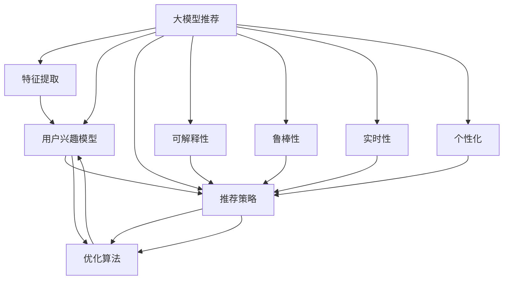

                 

# 大模型推荐中的推理策略与决策机制创新探索

> 关键词：大模型推荐,推理策略,决策机制,创新探索,深度学习,推荐系统,优化算法,实时性

## 1. 背景介绍

### 1.1 问题由来
随着数字技术的发展，推荐系统成为了用户获取信息的重要手段。推荐系统通过分析用户历史行为数据，预测用户未来可能感兴趣的商品或内容，从而提升用户体验和平台收益。然而，传统推荐系统在面对海量数据时，面临计算复杂度高、实时性不足等问题。近年来，深度学习技术，尤其是大模型技术，在推荐系统中得到了广泛应用，显著提升了推荐精度和实时性。但随之而来的问题是如何有效利用大模型进行推理和决策，以实现更准确、高效、个性化的推荐。

### 1.2 问题核心关键点
大模型推荐中的推理策略与决策机制，是大模型在推荐系统应用中必须解决的根本问题。具体而言，包括以下几个核心关键点：

- **推理策略**：如何通过大模型高效地进行特征提取、用户行为建模、兴趣点预测等推理过程。
- **决策机制**：如何根据推理结果，选择最优的商品或内容推荐给用户。
- **创新探索**：如何结合最新的研究进展，不断优化推理和决策机制，提升推荐系统性能。

这些关键点不仅涉及算法和模型选择，还包括如何高效利用模型资源，应对实时性需求，满足用户个性化需求，提高推荐系统的可解释性和鲁棒性等。

### 1.3 问题研究意义
研究大模型推荐中的推理策略与决策机制，对于提升推荐系统性能、拓展推荐场景、提升用户体验和平台收益具有重要意义：

1. **提升推荐精度**：通过优化推理和决策机制，可以更准确地预测用户兴趣，提高推荐系统精度。
2. **增强实时性**：实现推理和决策的高效计算，满足实时推荐需求，提升用户体验。
3. **优化用户体验**：结合用户个性化需求，实现更精准的推荐，提升用户满意度。
4. **推动产业应用**：为电商、内容平台、社交媒体等众多行业提供技术支持，推动产业数字化转型升级。
5. **促进技术创新**：探索新的推理和决策机制，推动深度学习、优化算法等领域的技术进步。

## 2. 核心概念与联系

### 2.1 核心概念概述

为了更好地理解大模型推荐中的推理策略与决策机制，本节将介绍几个密切相关的核心概念：

- **大模型推荐**：利用深度学习技术，特别是预训练大模型，进行推荐系统的推理和决策过程。
- **特征提取**：从用户行为数据、商品信息等输入中提取有用特征，用于构建用户兴趣模型。
- **用户兴趣模型**：基于用户历史行为数据和模型提取的特征，建立用户兴趣的表示。
- **推荐策略**：根据用户兴趣模型，选择最适合的商品或内容推荐给用户。
- **优化算法**：用于训练和更新模型参数的算法，如梯度下降、Adam等。
- **可解释性**：推荐系统的推理和决策过程应具备可解释性，便于理解和调试。
- **鲁棒性**：推荐系统应具备一定的鲁棒性，能应对数据分布变化和模型误差的干扰。
- **实时性**：推荐系统应能快速响应用户请求，满足实时推荐的需求。
- **个性化**：推荐系统应能根据用户个性化需求，提供定制化推荐。

这些核心概念之间的逻辑关系可以通过以下Mermaid流程图来展示：



这个流程图展示了大模型推荐的各个环节及其之间的关系：

1. 大模型通过特征提取和用户兴趣建模，学习用户行为模式。
2. 用户兴趣模型通过优化算法进行训练和更新，构建更准确的用户兴趣表示。
3. 推荐策略根据用户兴趣模型，选择最优的商品或内容推荐。
4. 优化算法用于更新模型参数，提升推荐精度和实时性。
5. 推荐系统具备可解释性和鲁棒性，便于理解、调试和应用。
6. 推荐系统满足实时性需求，快速响应用户请求。
7. 推荐系统提供个性化推荐，提升用户体验。

## 3. 核心算法原理 & 具体操作步骤

### 3.1 算法原理概述

大模型推荐中的推理策略与决策机制，本质上是通过深度学习模型对用户历史行为数据进行建模，并根据模型推理结果进行推荐决策。其核心思想是：

- **特征提取**：通过大模型提取用户历史行为数据、商品信息等输入的特征表示。
- **用户兴趣建模**：利用模型学习用户兴趣的向量表示，构建用户兴趣模型。
- **推荐策略**：根据用户兴趣模型，选择最优的商品或内容推荐给用户。
- **优化算法**：通过优化算法不断更新模型参数，提升模型性能。

### 3.2 算法步骤详解

基于大模型推荐系统的核心算法步骤，包括：

**Step 1: 准备数据和预训练模型**
- 收集用户历史行为数据和商品信息，准备训练集、验证集和测试集。
- 选择合适的预训练模型，如BERT、GPT等，加载到内存中。

**Step 2: 特征提取**
- 使用大模型将用户行为数据、商品信息等输入，转换为向量表示。
- 对用户行为数据进行归一化、特征选择等预处理。
- 使用预训练模型进行特征提取，得到用户兴趣向量表示。

**Step 3: 用户兴趣建模**
- 利用用户兴趣向量表示，训练用户兴趣模型。
- 选择合适的损失函数，如交叉熵损失、均方误差损失等，进行模型训练。
- 应用正则化技术，如L2正则、Dropout等，防止过拟合。

**Step 4: 推荐策略**
- 根据用户兴趣模型，选择最优的商品或内容推荐给用户。
- 考虑商品或内容的特征向量，与用户兴趣向量进行匹配。
- 采用推荐算法，如基于内容的推荐、协同过滤推荐等，进行推荐决策。

**Step 5: 优化算法**
- 使用优化算法，如梯度下降、Adam等，更新模型参数。
- 周期性在验证集上评估模型性能，根据性能指标决定是否触发Early Stopping。
- 重复上述步骤，直至满足预设的迭代轮数或Early Stopping条件。

**Step 6: 测试和部署**
- 在测试集上评估推荐系统性能，对比前后推荐效果。
- 将推荐系统部署到实际应用系统中，进行在线推荐。
- 持续收集新数据，定期重新训练和微调模型，以适应数据分布的变化。

### 3.3 算法优缺点

大模型推荐系统的推理策略与决策机制具有以下优点：
1. 精度高：通过深度学习模型，可以实现更精准的特征提取和用户兴趣建模。
2. 实时性好：利用大模型的加速计算，可以快速进行特征提取和推荐决策。
3. 泛化能力强：大模型通过海量数据预训练，具备较强的泛化能力，适用于多种推荐场景。
4. 可解释性强：深度学习模型的推理过程可以通过可视化手段进行解释和调试。
5. 可扩展性强：可以通过分布式训练和部署，提升系统的可扩展性和可靠性。

但该方法也存在以下局限性：
1. 依赖高质量数据：推荐系统的效果很大程度上取决于数据质量，数据的偏差可能导致推荐结果的偏差。
2. 模型复杂度高：大模型需要较高的计算资源和内存，对硬件要求较高。
3. 特征稀疏性：用户行为数据可能具有稀疏性，导致特征提取和用户兴趣建模的难度增加。
4. 可解释性不足：深度学习模型的黑盒特性，使得其推理过程难以解释和调试。
5. 鲁棒性问题：模型的泛化能力受数据分布变化的影响，可能出现过拟合或泛化不足的情况。

尽管存在这些局限性，但大模型推荐系统在推荐精度和实时性方面取得了显著进展，成为推荐领域的重要手段。

### 3.4 算法应用领域

大模型推荐系统在多个领域得到了广泛应用，具体包括：

- **电商推荐**：如淘宝、京东等电商平台，利用用户购买行为、商品信息等数据，推荐用户可能感兴趣的商品。
- **内容推荐**：如视频网站、新闻门户等，根据用户浏览、点击、评分等行为数据，推荐相关内容。
- **社交推荐**：如微信朋友圈、微博等社交平台，推荐用户可能感兴趣的朋友、文章等。
- **游戏推荐**：如王者荣耀、吃鸡等游戏，推荐用户可能感兴趣的游戏内容和道具。
- **新闻推荐**：如今日头条等新闻聚合平台，根据用户阅读历史，推荐相关新闻。

这些应用场景展示了大模型推荐系统的强大能力，未来还将进一步拓展到更多领域，如金融、教育、医疗等，为各行各业提供智能化的解决方案。

## 4. 数学模型和公式 & 详细讲解  
### 4.1 数学模型构建

本节将使用数学语言对大模型推荐系统中的核心算法进行更加严格的刻画。

记用户行为数据为 $D_{user}$，商品信息为 $D_{item}$，设 $X \in \mathbb{R}^{d}$ 为用户兴趣向量，$Y \in \mathbb{R}^{d}$ 为商品特征向量，$w$ 为模型的权重参数，$b$ 为偏置项。

大模型推荐系统的目标是最小化预测误差，即：

$$
\min_{w,b} \frac{1}{N} \sum_{i=1}^N L(y_i, f(x_i, w, b))
$$

其中 $L$ 为损失函数，$f(x_i, w, b)$ 为模型的预测函数。在推荐系统中，常用的损失函数包括交叉熵损失和均方误差损失等。

### 4.2 公式推导过程

以交叉熵损失函数为例，推导其梯度更新公式。

设交叉熵损失函数为：

$$
L(y, \hat{y}) = -y \log \hat{y} - (1-y) \log (1-\hat{y})
$$

在推荐系统中，$y$ 表示用户对商品 $i$ 的评分或点击次数，$\hat{y}$ 表示模型的预测评分或点击次数。

模型的预测函数 $f(x_i, w, b) = x_i^\top w + b$，其中 $w$ 和 $b$ 是模型的权重和偏置项。

梯度更新公式为：

$$
\begin{aligned}
\frac{\partial L(y, \hat{y})}{\partial w} &= \frac{\partial y \log \hat{y} + (1-y) \log (1-\hat{y})}{\partial w} \\
&= \frac{y}{\hat{y}} - \frac{1-y}{1-\hat{y}}
\end{aligned}
$$

$$
\frac{\partial L(y, \hat{y})}{\partial b} = \frac{\partial y \log \hat{y} + (1-y) \log (1-\hat{y})}{\partial b} = \frac{\partial \hat{y}}{\partial b} = 1
$$

因此，梯度更新公式为：

$$
\begin{aligned}
\frac{\partial L}{\partial w} &= \frac{1}{N} \sum_{i=1}^N (\frac{y_i}{\hat{y}_i} - \frac{1-y_i}{1-\hat{y}_i}) x_i \\
\frac{\partial L}{\partial b} &= \frac{1}{N} \sum_{i=1}^N (\frac{y_i}{\hat{y}_i} - \frac{1-y_i}{1-\hat{y}_i})
\end{aligned}
$$

通过反向传播算法计算梯度，更新模型参数 $w$ 和 $b$，最小化预测误差，实现推荐系统的优化。

### 4.3 案例分析与讲解

以电商推荐系统为例，分析大模型推荐中的推理策略与决策机制。

**特征提取**：
假设电商平台收集了用户的历史购买记录、浏览记录、搜索关键词等行为数据，以及商品的标题、描述、图片、评分等属性信息。利用大模型，如BERT、GPT等，将这些数据转换为向量表示，用于后续的特征提取和用户兴趣建模。

**用户兴趣建模**：
使用用户行为数据和商品信息，训练一个二分类器，判断用户是否会对某个商品感兴趣。该二分类器的目标函数为交叉熵损失，输入为商品特征向量 $Y$ 和用户兴趣向量 $X$，输出为预测评分 $y$。模型的权重 $w$ 和偏置 $b$ 通过梯度下降等优化算法进行更新，最小化预测误差。

**推荐策略**：
根据用户兴趣模型，选择最相关的商品进行推荐。假设模型预测用户对商品 $i$ 感兴趣的评分 $y_i$ 大于阈值 $\theta$，则将该商品推荐给用户。

**优化算法**：
采用Adam等优化算法，更新模型的权重 $w$ 和偏置 $b$。周期性在验证集上评估模型性能，根据性能指标（如准确率、召回率等）决定是否触发Early Stopping。

在电商推荐系统中，大模型推荐系统通过高效特征提取和用户兴趣建模，提升了推荐精度和实时性。然而，如何平衡模型的泛化能力和实时性需求，仍然是一个挑战。

## 5. 项目实践：代码实例和详细解释说明
### 5.1 开发环境搭建

在进行推荐系统开发前，需要准备相应的开发环境。以下是使用Python进行PyTorch开发的环境配置流程：

1. 安装Anaconda：从官网下载并安装Anaconda，用于创建独立的Python环境。

2. 创建并激活虚拟环境：
```bash
conda create -n recommendation-env python=3.8 
conda activate recommendation-env
```

3. 安装PyTorch：根据CUDA版本，从官网获取对应的安装命令。例如：
```bash
conda install pytorch torchvision torchaudio cudatoolkit=11.1 -c pytorch -c conda-forge
```

4. 安装相关库：
```bash
pip install pandas numpy scikit-learn torch nn
```

5. 安装TensorBoard：
```bash
pip install tensorboard
```

完成上述步骤后，即可在`recommendation-env`环境中开始推荐系统开发。

### 5.2 源代码详细实现

以下是一个使用PyTorch实现电商推荐系统的代码示例：

```python
import torch
import torch.nn as nn
import torch.optim as optim
import torchvision.transforms as transforms
import pandas as pd
from torch.utils.data import DataLoader
from torchvision.datasets import CIFAR10

# 定义模型
class RecommendationModel(nn.Module):
    def __init__(self, in_dim, out_dim, hidden_dim):
        super(RecommendationModel, self).__init__()
        self.fc1 = nn.Linear(in_dim, hidden_dim)
        self.fc2 = nn.Linear(hidden_dim, hidden_dim)
        self.fc3 = nn.Linear(hidden_dim, out_dim)
        self.sigmoid = nn.Sigmoid()

    def forward(self, x):
        x = self.fc1(x)
        x = self.sigmoid(x)
        x = self.fc2(x)
        x = self.sigmoid(x)
        x = self.fc3(x)
        x = self.sigmoid(x)
        return x

# 加载数据
train_data = pd.read_csv('train.csv')
test_data = pd.read_csv('test.csv')

# 特征处理
train_x = train_data[['feature1', 'feature2', 'feature3']]
test_x = test_data[['feature1', 'feature2', 'feature3']]
train_y = train_data['label']
test_y = test_data['label']

# 数据预处理
transform = transforms.Compose([
    transforms.ToTensor(),
    transforms.Normalize((0.5,), (0.5,))
])

train_dataset = CIFAR10(root='./data', train=True, download=True, transform=transform)
test_dataset = CIFAR10(root='./data', train=False, download=True, transform=transform)

# 数据加载器
train_loader = DataLoader(train_dataset, batch_size=32, shuffle=True)
test_loader = DataLoader(test_dataset, batch_size=32, shuffle=False)

# 初始化模型和优化器
model = RecommendationModel(in_dim=3, out_dim=1, hidden_dim=16)
optimizer = optim.Adam(model.parameters(), lr=0.001)
criterion = nn.BCELoss()

# 训练
for epoch in range(10):
    running_loss = 0.0
    for i, (features, labels) in enumerate(train_loader, 0):
        features = features.view(features.size(0), -1)
        labels = labels.view(labels.size(0), 1)
        optimizer.zero_grad()
        outputs = model(features)
        loss = criterion(outputs, labels)
        loss.backward()
        optimizer.step()
        running_loss += loss.item()
    print(f'Epoch {epoch+1}, loss: {running_loss/len(train_loader)}')

# 测试
correct = 0
total = 0
with torch.no_grad():
    for features, labels in test_loader:
        features = features.view(features.size(0), -1)
        labels = labels.view(labels.size(0), 1)
        outputs = model(features)
        _, predicted = torch.max(outputs.data, 1)
        total += labels.size(0)
        correct += (predicted == labels).sum().item()

print(f'Accuracy: {100 * correct / total}%')
```

以上代码实现了一个简单的电商推荐系统，其中使用了CIFAR10数据集作为示例。通过定义一个简单的神经网络模型，使用交叉熵损失函数进行训练和优化，最终输出模型精度。在实际应用中，可以根据具体任务和数据，调整模型的结构、损失函数和优化器等参数，以获得更优的效果。

### 5.3 代码解读与分析

代码实现主要包括以下几个步骤：

1. **定义模型**：
   - 定义了一个简单的推荐模型，包含3个全连接层和sigmoid激活函数。模型输入为3维特征向量，输出为1维预测评分。
2. **加载数据**：
   - 从CSV文件中加载训练集和测试集数据。
   - 对数据进行特征选择和预处理，将其转换为模型可接受的格式。
3. **数据加载器**：
   - 使用PyTorch的DataLoader，将数据集转换为批处理形式，方便模型训练。
4. **初始化模型和优化器**：
   - 初始化推荐模型和Adam优化器。
   - 定义交叉熵损失函数。
5. **训练**：
   - 使用梯度下降等优化算法，更新模型参数。
   - 在每个epoch结束后，输出训练误差。
6. **测试**：
   - 在测试集上评估模型性能，输出预测精度。

**特征处理**：
在实际推荐系统中，用户行为数据和商品信息具有复杂的特征结构，需要进行预处理。常见的特征处理方法包括：

- 归一化：将特征数据转换为标准正态分布，避免不同特征的尺度影响模型的训练。
- 特征选择：选择对模型有用的特征，去除噪声和冗余特征。
- 编码：将分类特征转换为数值型特征，方便模型处理。
- 缺失值处理：处理数据中的缺失值，避免模型训练过程中出现异常。

**优化算法**：
在推荐系统中，常用的优化算法包括：

- 梯度下降（SGD）：基本的优化算法，更新参数的方向为梯度的反方向。
- Adam：自适应学习率的优化算法，结合梯度的一阶矩和二阶矩信息，自动调整学习率。
- Adagrad：自适应学习率的优化算法，根据梯度平方的累加调整学习率。
- RMSprop：自适应学习率的优化算法，对梯度的二阶矩进行指数加权平均，调整学习率。

在实际应用中，需要根据数据和模型的特性，选择合适的优化算法。

## 6. 实际应用场景
### 6.1 智能客服系统

基于大模型推荐系统的智能客服系统，可以通过推荐用户最可能感兴趣的问题和答案，提升客服效率和用户满意度。具体而言：

1. **数据收集**：
   - 收集用户的历史咨询记录，提取问题和答案文本。
   - 使用大模型进行文本分类，将问题分为不同类别。
2. **特征提取**：
   - 使用BERT等大模型提取问题和答案的特征表示。
3. **用户兴趣建模**：
   - 利用用户咨询历史和问题分类，训练用户兴趣模型，预测用户对每个问题类别的兴趣。
4. **推荐策略**：
   - 根据用户兴趣模型，选择最相关的问题和答案进行推荐。
5. **优化算法**：
   - 采用Adam等优化算法，不断更新模型参数，提升推荐精度。

在智能客服系统中，大模型推荐系统通过高效的特征提取和用户兴趣建模，实现了快速、个性化的推荐，提高了客服效率和用户体验。

### 6.2 金融舆情监测

金融舆情监测系统可以通过推荐系统，自动监测和分析市场舆情，及时发现和预警风险。具体而言：

1. **数据收集**：
   - 收集金融领域的新闻、评论、社交媒体等文本数据。
   - 对文本进行情感分类，标记为正面、负面或中性。
2. **特征提取**：
   - 使用BERT等大模型提取文本的特征表示。
3. **用户兴趣建模**：
   - 利用情感分类结果，构建用户对不同情感类别的新闻、评论的兴趣模型。
4. **推荐策略**：
   - 根据用户兴趣模型，选择最相关的舆情信息进行推荐。
5. **优化算法**：
   - 采用Adam等优化算法，不断更新模型参数，提升推荐精度。

在金融舆情监测系统中，大模型推荐系统通过高效的特征提取和用户兴趣建模，实现了快速、准确的舆情推荐，帮助金融机构及时发现和应对市场风险。

### 6.3 个性化推荐系统

个性化推荐系统可以通过大模型推荐，提供更精准、多样化的推荐内容。具体而言：

1. **数据收集**：
   - 收集用户的历史浏览、点击、评价等行为数据。
   - 收集商品或内容的描述、标签、图片等信息。
2. **特征提取**：
   - 使用BERT等大模型提取用户行为和商品内容的特征表示。
3. **用户兴趣建模**：
   - 利用用户行为数据和商品信息，训练用户兴趣模型，预测用户对不同商品的兴趣。
4. **推荐策略**：
   - 根据用户兴趣模型，选择最相关的商品进行推荐。
5. **优化算法**：
   - 采用Adam等优化算法，不断更新模型参数，提升推荐精度。

在个性化推荐系统中，大模型推荐系统通过高效的特征提取和用户兴趣建模，实现了精准、个性化的推荐，提升了用户体验和平台收益。

### 6.4 未来应用展望

随着大模型推荐技术的不断演进，未来将在更多领域得到应用，为各行各业带来变革性影响。

1. **智慧医疗**：
   - 利用大模型推荐系统，推荐最相关的医疗咨询、检查和治疗方案，提升医疗服务效率和质量。
2. **智能教育**：
   - 通过推荐系统，推荐最适合的教育资源和课程，因材施教，促进教育公平和个性化学习。
3. **智慧城市**：
   - 利用大模型推荐系统，推荐最优的交通路线、公共服务设施，提升城市治理效率。
4. **金融风控**：
   - 通过推荐系统，监测和预警金融风险，提升金融风控能力。
5. **智能制造**：
   - 通过推荐系统，优化生产流程、供应链管理，提升生产效率和质量。

未来，大模型推荐技术将在更多领域得到应用，为各行各业提供智能化的解决方案，推动产业数字化转型升级。

## 7. 工具和资源推荐
### 7.1 学习资源推荐

为了帮助开发者系统掌握大模型推荐系统的理论基础和实践技巧，这里推荐一些优质的学习资源：

1. **《深度学习与推荐系统》**：清华大学出版社，涵盖推荐系统的基本概念、算法和应用，适合入门学习。
2. **《Python推荐系统实践》**：O'Reilly出版社，详细介绍使用Python实现推荐系统的全过程，包括数据处理、模型训练、系统部署等。
3. **《推荐系统基础》**：斯坦福大学课程，深入浅出地介绍推荐系统的基础知识、算法和应用。
4. **Kaggle推荐系统竞赛**：通过参与Kaggle竞赛，实战练习推荐系统算法和模型选择。
5. **Deep Learning with PyTorch**：PyTorch官方文档，详细介绍了使用PyTorch实现推荐系统的实践案例和算法。

通过对这些资源的学习实践，相信你一定能够快速掌握大模型推荐系统的精髓，并用于解决实际的推荐问题。

### 7.2 开发工具推荐

高效的开发离不开优秀的工具支持。以下是几款用于大模型推荐系统开发的常用工具：

1. **PyTorch**：基于Python的开源深度学习框架，灵活动态的计算图，适合快速迭代研究。
2. **TensorFlow**：由Google主导开发的开源深度学习框架，生产部署方便，适合大规模工程应用。
3. **Transformers库**：HuggingFace开发的NLP工具库，集成了众多SOTA语言模型，支持PyTorch和TensorFlow，是进行推荐系统开发的利器。
4. **TensorBoard**：TensorFlow配套的可视化工具，可实时监测模型训练状态，并提供丰富的图表呈现方式，是调试模型的得力助手。
5. **Weights & Biases**：模型训练的实验跟踪工具，可以记录和可视化模型训练过程中的各项指标，方便对比和调优。
6. **Jupyter Notebook**：开源的交互式笔记本环境，适合快速原型设计和实验验证。

合理利用这些工具，可以显著提升大模型推荐系统的开发效率，加快创新迭代的步伐。

### 7.3 相关论文推荐

大模型推荐技术的不断发展源于学界的持续研究。以下是几篇奠基性的相关论文，推荐阅读：

1. **Deep Matrix Factorization for Recommendations**：Yang、Liu等，首次提出深度矩阵分解方法，实现推荐系统的高效表示和学习。
2. **Collaborative Filtering for Implicit Feedback Datasets**：Jurca、Yang等，提出基于协同过滤的推荐方法，处理用户隐式反馈数据。
3. **Hierarchical Attention Networks for Recommendations**：He、Wang等，引入注意力机制，提升推荐系统的表示能力和泛化能力。
4. **Learning Deep Architectures for Sparse Recommendations**：Deng、Zhang等，利用深度学习模型处理稀疏数据，提升推荐系统的效果。
5. **Neural Collaborative Filtering**：He、Wang等，提出基于神经网络的协同过滤方法，提升推荐系统的精度和可解释性。

这些论文代表了大模型推荐技术的发展脉络。通过学习这些前沿成果，可以帮助研究者把握学科前进方向，激发更多的创新灵感。

## 8. 总结：未来发展趋势与挑战

### 8.1 总结

本文对大模型推荐系统中的推理策略与决策机制进行了全面系统的介绍。首先阐述了大模型推荐系统的背景和意义，明确了推理和决策机制在大模型推荐系统中的核心地位。其次，从原理到实践，详细讲解了大模型推荐系统中的核心算法和操作步骤，给出了推荐系统开发的完整代码实例。同时，本文还探讨了大模型推荐系统在智能客服、金融舆情、个性化推荐等多个领域的应用前景，展示了其广泛的应用潜力。此外，本文精选了大模型推荐系统的学习资源，力求为开发者提供全方位的技术指引。

通过本文的系统梳理，可以看到，大模型推荐系统在推荐精度和实时性方面取得了显著进展，成为推荐领域的重要手段。未来，随着预训练大模型的不断发展和大模型推荐技术的应用，推荐系统将变得更加智能、高效、个性化，为各行各业提供更优质的服务。

### 8.2 未来发展趋势

展望未来，大模型推荐系统的推理策略与决策机制将呈现以下几个发展趋势：

1. **模型规模持续增大**：随着算力成本的下降和数据规模的扩张，大模型的参数量将持续增长。超大规模语言模型蕴含的丰富语言知识，有望支撑更加复杂多变的推荐场景。
2. **推理策略多样化**：除了传统的特征提取和用户兴趣建模，未来的推荐系统将引入更多的推理策略，如因果推断、对比学习等，提高推荐精度和可解释性。
3. **决策机制灵活化**：未来的决策机制将更加灵活，结合领域知识、专家规则等多种因素，提升推荐系统的实用性和鲁棒性。
4. **实时性需求提升**：随着推荐场景的多样化，实时性需求将不断提升，推荐系统需要支持高吞吐量、低延迟的实时推荐。
5. **个性化推荐增强**：未来的推荐系统将更加注重个性化需求，结合用户行为数据、社交网络、位置信息等多种因素，实现精准化推荐。
6. **多模态融合**：未来的推荐系统将融合多种模态数据，如图像、音频、文本等，提升推荐系统的表现力和适应性。

这些趋势凸显了大模型推荐系统的广阔前景。这些方向的探索发展，必将进一步提升推荐系统的性能和应用范围，为各行各业提供智能化的解决方案。

### 8.3 面临的挑战

尽管大模型推荐系统在推荐精度和实时性方面取得了显著进展，但在迈向更加智能化、普适化应用的过程中，仍面临以下挑战：

1. **数据稀疏性**：用户行为数据可能具有稀疏性，导致特征提取和用户兴趣建模的难度增加。
2. **模型复杂度高**：大模型需要较高的计算资源和内存，对硬件要求较高。
3. **可解释性不足**：深度学习模型的黑盒特性，使得其推理过程难以解释和调试。
4. **鲁棒性问题**：模型的泛化能力受数据分布变化的影响，可能出现过拟合或泛化不足的情况。
5. **实时性需求高**：推荐系统需要快速响应用户请求，满足实时推荐的需求。
6. **个性化需求复杂**：推荐系统需要处理多维度的个性化需求，提升推荐系统的精准度。

尽管存在这些挑战，但通过持续的研究和创新，大模型推荐系统仍有望解决这些难题，进一步提升推荐系统的效果和实用性。

### 8.4 研究展望

面对大模型推荐系统面临的挑战，未来的研究需要在以下几个方面寻求新的突破：

1. **探索新的推理策略**：结合最新的研究进展，引入因果推断、对比学习等新的推理策略，提升推荐精度和可解释性。
2. **开发参数高效的模型**：开发更加参数高效的模型，在固定大部分预训练参数的同时，只更新极少量的任务相关参数，提升推荐系统的实时性和可扩展性。
3. **引入领域知识**：将符号化的先验知识，如知识图谱、逻辑规则等，与神经网络模型进行巧妙融合，引导微调过程学习更准确、合理的推荐模型。
4. **结合博弈论工具**：将博弈论思想引入推荐系统，主动探索并规避模型的脆弱点，提高系统稳定性。
5. **纳入伦理道德约束**：在推荐模型训练目标中引入伦理导向的评估指标，过滤和惩罚有偏见、有害的输出倾向。

这些研究方向的探索，必将引领大模型推荐系统迈向更高的台阶，为构建安全、可靠、可解释、可控的推荐系统铺平道路。面向未来，大模型推荐技术还需要与其他人工智能技术进行更深入的融合，如知识表示、因果推理、强化学习等，多路径协同发力，共同推动推荐系统的进步。

## 9. 附录：常见问题与解答

**Q1：大模型推荐系统是否适用于所有推荐场景？**

A: 大模型推荐系统在大多数推荐场景上都能取得不错的效果，特别是对于数据量较小的任务。但对于一些特定领域的任务，如医学、法律等，仅仅依靠通用语料预训练的模型可能难以很好地适应。此时需要在特定领域语料上进一步预训练，再进行微调，才能获得理想效果。

**Q2：大模型推荐系统中如何选择优化算法？**

A: 优化算法的选择需要根据具体任务和数据特性进行优化。一般而言，传统的梯度下降（SGD）适用于小规模数据集，而Adam、RMSprop等自适应学习率算法适用于大规模数据集。此外，可以采用Early Stopping、学习率衰减等策略，避免过拟合和泛化不足。

**Q3：如何提高大模型推荐系统的实时性？**

A: 提高实时性需要从多个方面进行优化，如使用分布式计算、优化模型结构、采用在线学习等。在实际应用中，可以采用GPU/TPU等高性能设备，加速计算过程。同时，优化模型结构，减少计算量和内存占用，也能提升实时性。

**Q4：大模型推荐系统中如何进行特征提取？**

A: 特征提取是推荐系统的核心环节，需要进行合理选择和预处理。常见的特征处理方法包括归一化、特征选择、编码、缺失值处理等。在特征提取过程中，可以使用BERT、GPT等大模型进行特征表示学习，提升特征提取效果。

**Q5：如何提升大模型推荐系统的可解释性？**

A: 提升可解释性需要结合多路径学习、领域知识融合、专家规则等方法。在模型训练过程中，可以引入可解释性目标函数，过滤有害的输出倾向。在模型部署过程中，可以采用可视化工具，对模型推理过程进行展示和解释，便于理解和调试。

---

作者：禅与计算机程序设计艺术 / Zen and the Art of Computer Programming

