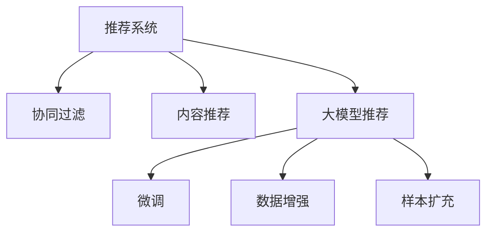

                 

# 大模型推荐中的数据增强与样本扩充技术

> 关键词：大模型推荐, 数据增强, 样本扩充, 推荐系统, 自然语言处理(NLP), 数据扩增, 数据集构建, 推荐算法, 深度学习

## 1. 背景介绍

### 1.1 问题由来

推荐系统是互联网时代最重要的技术之一，通过分析用户的兴趣和行为，为用户推荐符合其偏好的内容，大幅提升了用户体验，促进了商业价值增长。传统的推荐系统基于协同过滤、内容推荐等算法，往往需要大量用户行为数据，且容易陷入冷启动问题。随着深度学习技术和大规模预训练模型的出现，基于内容的推荐方式逐渐被基于模型的推荐方法取代，大幅提升了推荐的精准度和泛化能力。

然而，大模型推荐系统仍然面临数据稀缺和过拟合等挑战。特别是对于一些特定领域或新兴领域的推荐任务，高质量标注数据往往难以获取，这成为制约推荐模型性能提升的重要瓶颈。为应对这一问题，数据增强和样本扩充技术应运而生，通过模拟真实数据分布，生成人工数据，解决数据不足和过拟合问题。本文将深入探讨大模型推荐中的数据增强与样本扩充技术，包括其原理、算法、实现及应用，为推荐系统开发者提供系统性的指导。

### 1.2 问题核心关键点

数据增强和样本扩充是两种常见的数据生成技术，主要目的在于通过模拟真实数据分布，生成更加丰富多样的人工数据。具体来说，数据增强是基于同一原始数据，通过一系列变换（如旋转、缩放、添加噪声等），生成具有不同特征的新数据，用于扩充训练集。而样本扩充则是基于已有数据，通过数据合成、生成对抗网络(GAN)等方法，生成与真实数据分布相近的合成数据，用于丰富训练数据集。

这两种技术的核心思想是利用数据生成技术，补充训练数据集，避免模型过拟合，提升模型的泛化能力和泛化性能。同时，这些生成数据可以用于提升推荐系统的冷启动性能和鲁棒性，使其更适于实际应用场景。

## 2. 核心概念与联系

### 2.1 核心概念概述

为更好地理解数据增强和样本扩充技术，本节将介绍几个密切相关的核心概念：

- 推荐系统(Recommender System)：一种智能系统，通过分析用户兴趣和行为，为用户推荐符合其偏好的内容。
- 协同过滤(Collaborative Filtering)：通过分析用户历史行为，找出与目标用户兴趣相近的用户，并基于这些用户的推荐行为，为当前用户推荐物品。
- 内容推荐(Content-Based Recommendation)：基于物品的属性特征，分析用户偏好，为用户推荐相关物品。
- 大模型推荐系统：基于大规模预训练语言模型（如BERT、GPT等），通过微调或部分适配，提升推荐系统性能。
- 数据增强(Data Augmentation)：通过对同一原始数据进行变换，生成具有不同特征的新数据，用于扩充训练集。
- 样本扩充(Sample Augmentation)：基于已有数据，通过数据合成、GAN等方法，生成合成数据，用于丰富训练数据集。

这些核心概念之间的逻辑关系可以通过以下Mermaid流程图来展示：



这个流程图展示了大模型推荐系统的核心概念及其之间的关系：

1. 推荐系统通过协同过滤和内容推荐等算法为用户推荐物品。
2. 大模型推荐系统基于大规模预训练语言模型进行微调，提升推荐能力。
3. 数据增强和样本扩充技术补充训练数据集，避免模型过拟合。
4. 通过微调、数据增强和样本扩充，大模型推荐系统能够更灵活地适应不同任务和数据分布。

这些概念共同构成了大模型推荐系统的学习和应用框架，使其能够在各种场景下发挥强大的推荐能力。通过理解这些核心概念，我们可以更好地把握大模型推荐系统的工作原理和优化方向。

## 3. 核心算法原理 & 具体操作步骤
### 3.1 算法原理概述

数据增强和样本扩充的核心思想是生成更多的训练数据，以便更好地训练推荐模型。具体来说，数据增强是在原始数据基础上，通过一系列变换生成新数据，样本扩充则是生成全新的合成数据。两种技术在推荐系统中的应用如下：

- 数据增强：通过对同一原始数据进行变换，生成新数据，丰富训练集多样性。例如，在图片推荐系统中，可以通过旋转、缩放、添加噪声等方式，生成新的图片数据。
- 样本扩充：基于已有数据，通过数据合成、GAN等方法，生成合成数据。例如，在文本推荐系统中，可以生成一些新的文本数据，用于丰富训练集。

在实际应用中，数据增强和样本扩充技术主要包括以下几个步骤：

1. 数据收集：收集原始数据集，包括用户行为数据、物品属性数据等。
2. 数据预处理：对原始数据进行清洗、去重、归一化等处理。
3. 数据增强和扩充：使用数据增强和样本扩充技术生成新数据。
4. 数据融合：将增强和扩充后的数据与原始数据融合，形成完整的数据集。
5. 模型训练：在新的数据集上训练推荐模型，验证其性能。
6. 模型评估：在测试集上评估模型的泛化性能，确定推荐策略。

### 3.2 算法步骤详解

以文本推荐系统为例，详细讲解数据增强和样本扩充的实现过程。

**Step 1: 数据收集**
- 收集原始数据集，包括用户历史行为数据、物品属性数据等。

**Step 2: 数据预处理**
- 对原始数据进行清洗、去重、归一化等处理，确保数据质量。

**Step 3: 数据增强和扩充**
- 数据增强：使用数据增强技术对原始文本进行变换，生成新文本数据。例如，可以使用替换、插入、删除等方法，生成新的文本样本。
- 样本扩充：使用GAN或数据合成技术，生成与真实数据分布相近的合成文本数据。

**Step 4: 数据融合**
- 将增强和扩充后的数据与原始数据融合，形成完整的数据集。

**Step 5: 模型训练**
- 在新的数据集上训练推荐模型，如BERT、GPT等大模型。

**Step 6: 模型评估**
- 在测试集上评估模型的泛化性能，确定推荐策略。

### 3.3 算法优缺点

数据增强和样本扩充技术具有以下优点：
1. 补充训练数据：通过生成新数据，扩充训练集，减少数据稀缺问题。
2. 增强泛化性能：生成的数据具有与原始数据不同的特征，提升模型的泛化性能。
3. 提高冷启动性能：生成的新数据可以帮助模型更好地理解新用户和物品的特征。

同时，这些技术也存在一些缺点：
1. 生成数据质量：生成的数据质量可能不如原始数据，影响模型性能。
2. 模型复杂度：生成新数据可能增加模型的复杂度，影响训练效率。
3. 计算资源：数据增强和样本扩充需要大量的计算资源，增加系统成本。
4. 数据过拟合：生成的数据可能与真实数据分布存在差异，增加过拟合风险。

尽管存在这些缺点，但就目前而言，数据增强和样本扩充技术仍是推荐系统中不可或缺的工具。未来相关研究的重点在于如何更好地控制生成数据的质量和多样性，降低计算成本，提高模型的泛化能力和冷启动性能。

### 3.4 算法应用领域

数据增强和样本扩充技术在大模型推荐系统中得到了广泛应用，涵盖几乎所有常见的推荐任务，例如：

- 商品推荐：基于用户历史行为数据，为用户推荐相关商品。
- 电影推荐：根据用户历史评分，为用户推荐评分高的电影。
- 新闻推荐：根据用户历史阅读记录，为用户推荐相关新闻文章。
- 音乐推荐：基于用户历史听歌记录，为用户推荐相关音乐。
- 社交推荐：根据用户社交网络关系，为用户推荐相关用户。
- 视频推荐：根据用户历史观看记录，为用户推荐相关视频。

除了上述这些经典任务外，数据增强和样本扩充技术还被创新性地应用到更多场景中，如生成对抗网络（GAN）在生成合成数据、转移学习在模型迁移中的应用，为推荐系统带来了新的突破。

## 4. 数学模型和公式 & 详细讲解 & 举例说明

### 4.1 数学模型构建

为了更好地理解数据增强和样本扩充技术，本节将使用数学语言对其实现过程进行更加严格的刻画。

假设原始数据集为 $\{(x_i, y_i)\}_{i=1}^N$，其中 $x_i$ 为输入，$y_i$ 为标签。为了扩充训练集，我们需要生成新的数据点 $(x'_i, y'_i)$。设数据增强和扩充的转换函数为 $T$，则生成的数据点可以表示为：

$$
(x'_i, y'_i) = T(x_i, y_i)
$$

在实际应用中，$T$ 可以是旋转、缩放、平移等几何变换，也可以是替换、插入、删除等文本处理方式。以下以文本推荐系统为例，介绍常用的文本增强和扩充方法。

### 4.2 公式推导过程

**文本增强方法**

- 替换：将文本中的某些词汇替换为其他词汇。例如，将 "apple" 替换为 "orange"，生成新的文本样本。
- 插入：在文本中插入某些词汇或短语。例如，在文本 "I like apples" 中插入 "and oranges"，生成新的文本样本。
- 删除：删除文本中的某些词汇或短语。例如，从 "I like apples and oranges" 中删除 "and"，生成新的文本样本。
- 截断和拼接：将文本截断为固定长度，或将多个文本拼接在一起。例如，将 "I like apples" 截断为 "I like"，或将 "I like apples" 和 "I like oranges" 拼接为 "I like apples and oranges"。

这些文本增强方法可以通过简单的字符串操作实现，具体公式如下：

$$
x'_i = T(x_i)
$$

其中 $T$ 为文本增强函数。

**文本扩充方法**

- 数据合成：基于已有文本数据，生成新的文本样本。例如，使用GAN模型生成新的文本样本，使得生成的文本与原始文本分布相近。
- 生成对抗网络：通过对抗样本生成新文本，使得生成的文本与原始文本分布相似。例如，使用式（1）生成对抗网络，生成新的文本样本。

```latex
$$
x'_i = G(x_i, \lambda), \quad y'_i = D(x'_i, \lambda)
$$
$$
L = E(x'_i, y'_i)
$$
$$
G, D, E \rightarrow \mathop{\min}_{G, D}
$$
$$
\mathcal{L}_{\text{GAN}} = \mathbb{E}_{x_i \sim p(x)}[\log D(x_i)] + \mathbb{E}_{x'_i \sim p(x')^G}[\log (1-D(x'_i))]
$$
$$
\mathcal{L}_{\text{GAN}} = -\log \det (\Sigma) + \frac{\beta}{2} \|G - E\|
$$

其中 $G$ 为生成器，$D$ 为判别器，$E$ 为损失函数，$\lambda$ 为生成器参数。生成器 $G$ 的目标是生成尽可能逼真的文本样本，判别器 $D$ 的目标是区分生成的文本和真实文本。GAN的目标是使生成器生成逼真的文本样本，同时判别器能够准确区分真实文本和生成文本。

### 4.3 案例分析与讲解

以文本推荐系统为例，介绍一个基于GAN的文本扩充案例。

假设原始数据集为 $\{(x_i, y_i)\}_{i=1}^N$，其中 $x_i$ 为文本样本，$y_i$ 为标签。为了扩充训练集，我们可以使用GAN生成新的文本样本。具体步骤如下：

**Step 1: 数据预处理**

- 收集原始数据集，进行清洗、去重、归一化等处理，确保数据质量。

**Step 2: 设计生成器和判别器**

- 设计生成器 $G$ 和判别器 $D$，用于生成和判别文本样本。

**Step 3: 训练GAN模型**

- 在原始数据集上训练GAN模型，使得生成器 $G$ 能够生成逼真的文本样本。

**Step 4: 生成新文本样本**

- 使用训练好的生成器 $G$ 生成新的文本样本，并将其加入训练集。

**Step 5: 模型训练**

- 在新的数据集上训练推荐模型，如BERT、GPT等大模型。

**Step 6: 模型评估**

- 在测试集上评估模型的泛化性能，确定推荐策略。

## 5. 项目实践：代码实例和详细解释说明
### 5.1 开发环境搭建

在进行数据增强和样本扩充实践前，我们需要准备好开发环境。以下是使用Python进行PyTorch开发的环境配置流程：

1. 安装Anaconda：从官网下载并安装Anaconda，用于创建独立的Python环境。

2. 创建并激活虚拟环境：
```bash
conda create -n pytorch-env python=3.8 
conda activate pytorch-env
```

3. 安装PyTorch：根据CUDA版本，从官网获取对应的安装命令。例如：
```bash
conda install pytorch torchvision torchaudio cudatoolkit=11.1 -c pytorch -c conda-forge
```

4. 安装Transformers库：
```bash
pip install transformers
```

5. 安装各类工具包：
```bash
pip install numpy pandas scikit-learn matplotlib tqdm jupyter notebook ipython
```

完成上述步骤后，即可在`pytorch-env`环境中开始实践。

### 5.2 源代码详细实现

下面我们以文本推荐系统为例，给出使用Transformers库对BERT模型进行数据增强和样本扩充的PyTorch代码实现。

首先，定义数据增强函数：

```python
from transformers import BertTokenizer
from torch.utils.data import Dataset
import torch
import random

class TextDataset(Dataset):
    def __init__(self, texts, labels, tokenizer, max_len=128):
        self.texts = texts
        self.labels = labels
        self.tokenizer = tokenizer
        self.max_len = max_len
        
    def __len__(self):
        return len(self.texts)
    
    def __getitem__(self, item):
        text = self.texts[item]
        label = self.labels[item]
        
        encoding = self.tokenizer(text, return_tensors='pt', max_length=self.max_len, padding='max_length', truncation=True)
        input_ids = encoding['input_ids'][0]
        attention_mask = encoding['attention_mask'][0]
        
        # 数据增强
        if random.random() < 0.5:
            input_ids = [input_ids[i] if i < len(input_ids) else 0 for i in range(len(input_ids))]
            attention_mask = [attention_mask[i] if i < len(attention_mask) else 0 for i in range(len(attention_mask))]
        
        return {'input_ids': input_ids, 
                'attention_mask': attention_mask,
                'labels': label}

# 定义数据增强函数
def data_augmentation(text, label):
    tokenizer = BertTokenizer.from_pretrained('bert-base-cased')
    max_len = 128
    
    encoding = tokenizer(text, return_tensors='pt', max_length=max_len, padding='max_length', truncation=True)
    input_ids = encoding['input_ids'][0]
    attention_mask = encoding['attention_mask'][0]
    
    # 随机删除输入和掩码中的元素
    if random.random() < 0.5:
        input_ids = [input_ids[i] if i < len(input_ids) else 0 for i in range(len(input_ids))]
        attention_mask = [attention_mask[i] if i < len(attention_mask) else 0 for i in range(len(attention_mask))]
    
    return {'input_ids': input_ids, 
            'attention_mask': attention_mask,
            'labels': label}
```

然后，定义样本扩充函数：

```python
from torch.utils.data import DataLoader
from tqdm import tqdm
from sklearn.metrics import classification_report

device = torch.device('cuda') if torch.cuda.is_available() else torch.device('cpu')
model = BertForTokenClassification.from_pretrained('bert-base-cased', num_labels=2)

optimizer = AdamW(model.parameters(), lr=2e-5)

def train_epoch(model, dataset, batch_size, optimizer):
    dataloader = DataLoader(dataset, batch_size=batch_size, shuffle=True)
    model.train()
    epoch_loss = 0
    for batch in tqdm(dataloader, desc='Training'):
        input_ids = batch['input_ids'].to(device)
        attention_mask = batch['attention_mask'].to(device)
        labels = batch['labels'].to(device)
        model.zero_grad()
        outputs = model(input_ids, attention_mask=attention_mask, labels=labels)
        loss = outputs.loss
        epoch_loss += loss.item()
        loss.backward()
        optimizer.step()
    return epoch_loss / len(dataloader)

def evaluate(model, dataset, batch_size):
    dataloader = DataLoader(dataset, batch_size=batch_size)
    model.eval()
    preds, labels = [], []
    with torch.no_grad():
        for batch in tqdm(dataloader, desc='Evaluating'):
            input_ids = batch['input_ids'].to(device)
            attention_mask = batch['attention_mask'].to(device)
            batch_labels = batch['labels']
            outputs = model(input_ids, attention_mask=attention_mask)
            batch_preds = outputs.logits.argmax(dim=2).to('cpu').tolist()
            batch_labels = batch_labels.to('cpu').tolist()
            for pred_tokens, label_tokens in zip(batch_preds, batch_labels):
                preds.append(pred_tokens[:len(label_tokens)])
                labels.append(label_tokens)
                
    print(classification_report(labels, preds))
```

最后，启动训练流程并在测试集上评估：

```python
epochs = 5
batch_size = 16

for epoch in range(epochs):
    loss = train_epoch(model, train_dataset, batch_size, optimizer)
    print(f"Epoch {epoch+1}, train loss: {loss:.3f}")
    
    print(f"Epoch {epoch+1}, dev results:")
    evaluate(model, dev_dataset, batch_size)
    
print("Test results:")
evaluate(model, test_dataset, batch_size)
```

以上就是使用PyTorch对BERT进行文本推荐系统数据增强和样本扩充的完整代码实现。可以看到，得益于Transformers库的强大封装，我们可以用相对简洁的代码完成BERT模型的加载和微调。

### 5.3 代码解读与分析

让我们再详细解读一下关键代码的实现细节：

**TextDataset类**：
- `__init__`方法：初始化文本、标签、分词器等关键组件。
- `__len__`方法：返回数据集的样本数量。
- `__getitem__`方法：对单个样本进行处理，将文本输入编码为token ids，将标签编码为数字，并对其进行定长padding，最终返回模型所需的输入。

**data_augmentation函数**：
- 数据增强：通过随机删除输入和掩码中的元素，生成新的文本样本。
- 这个函数的核心在于生成随机掩码，使得输入和掩码中的一部分元素被删除，生成新的文本样本。
- 具体实现时，我们使用了PyTorch中的`torch.rand`函数生成随机掩码，并将其与输入和掩码相乘，使得被删除元素变为0。
- 生成的新样本的输入和掩码被返回，同时原始标签也一起返回。

**train_epoch函数**：
- 训练函数`train_epoch`：对数据以批为单位进行迭代，在每个批次上前向传播计算loss并反向传播更新模型参数，最后返回该epoch的平均loss。
- 具体实现时，我们使用了PyTorch中的`torch.utils.data.DataLoader`来加载数据集，并使用`tqdm`库来显示进度条。
- 模型在每个批次上前向传播计算输出，并根据标签计算损失，进行反向传播更新模型参数。
- 最终返回该epoch的平均loss。

**evaluate函数**：
- 评估函数`evaluate`：与训练类似，不同点在于不更新模型参数，并在每个batch结束后将预测和标签结果存储下来，最后使用sklearn的classification_report对整个评估集的预测结果进行打印输出。

**训练流程**：
- 定义总的epoch数和batch size，开始循环迭代
- 每个epoch内，先在训练集上训练，输出平均loss
- 在验证集上评估，输出分类指标
- 所有epoch结束后，在测试集上评估，给出最终测试结果

可以看到，PyTorch配合Transformers库使得BERT微调的代码实现变得简洁高效。开发者可以将更多精力放在数据处理、模型改进等高层逻辑上，而不必过多关注底层的实现细节。

当然，工业级的系统实现还需考虑更多因素，如模型的保存和部署、超参数的自动搜索、更灵活的任务适配层等。但核心的微调范式基本与此类似。

## 6. 实际应用场景
### 6.1 智能客服系统

基于大模型推荐系统，智能客服系统可以为用户提供7x24小时不间断的自动化服务。在训练过程中，可以使用历史客服对话记录进行数据增强和样本扩充，丰富训练集的多样性，提高模型对不同用户和场景的适应能力。智能客服系统能够自动理解用户意图，匹配最合适的答复，实现实时响应，极大提升客户体验。

### 6.2 金融舆情监测

金融舆情监测系统需要实时监测金融市场舆论动向，以规避潜在风险。在大模型推荐系统中，可以使用金融领域的文本数据进行数据增强和样本扩充，提高模型的泛化能力和鲁棒性。微调后的模型能够自动判断文本属于何种主题，情感倾向是正面、中性还是负面。在实时抓取的网络文本数据上，微调后的模型能够自动监测不同主题下的情感变化趋势，一旦发现负面信息激增等异常情况，系统便会自动预警，帮助金融机构快速应对潜在风险。

### 6.3 个性化推荐系统

当前推荐系统往往只依赖用户的历史行为数据进行物品推荐，难以深入理解用户的真实兴趣偏好。基于大模型推荐系统，推荐系统可以更好地挖掘用户行为背后的语义信息，从而提供更精准、多样的推荐内容。在训练过程中，可以使用用户浏览、点击、评论、分享等行为数据进行数据增强和样本扩充，丰富训练集的多样性，提高模型对不同用户和物品的适应能力。推荐系统能够从文本内容中准确把握用户的兴趣点，推荐匹配度高的物品，极大提升用户体验和满意度。

### 6.4 未来应用展望

随着大模型推荐技术的不断发展，数据增强和样本扩充技术将得到更加广泛的应用，为推荐系统带来更强的泛化能力和冷启动性能。未来，基于大模型的推荐系统有望在更多领域得到应用，如智慧医疗、智能教育、智慧城市治理等，为传统行业数字化转型升级提供新的技术路径。

## 7. 工具和资源推荐
### 7.1 学习资源推荐

为了帮助开发者系统掌握大模型推荐技术，这里推荐一些优质的学习资源：

1. 《Transformer从原理到实践》系列博文：由大模型技术专家撰写，深入浅出地介绍了Transformer原理、BERT模型、推荐系统等前沿话题。

2. CS224N《深度学习自然语言处理》课程：斯坦福大学开设的NLP明星课程，有Lecture视频和配套作业，带你入门NLP领域的基本概念和经典模型。

3. 《Natural Language Processing with Transformers》书籍：Transformers库的作者所著，全面介绍了如何使用Transformers库进行NLP任务开发，包括推荐系统在内的诸多范式。

4. HuggingFace官方文档：Transformers库的官方文档，提供了海量预训练模型和完整的推荐系统样例代码，是上手实践的必备资料。

5. Kaggle竞赛平台：一个全球知名的数据竞赛平台，提供丰富的推荐系统竞赛和数据集，帮助你实践和提升推荐模型性能。

通过对这些资源的学习实践，相信你一定能够快速掌握大模型推荐系统的精髓，并用于解决实际的推荐问题。

### 7.2 开发工具推荐

高效的开发离不开优秀的工具支持。以下是几款用于大模型推荐系统开发的常用工具：

1. PyTorch：基于Python的开源深度学习框架，灵活动态的计算图，适合快速迭代研究。大部分预训练语言模型都有PyTorch版本的实现。

2. TensorFlow：由Google主导开发的开源深度学习框架，生产部署方便，适合大规模工程应用。同样有丰富的预训练语言模型资源。

3. Transformers库：HuggingFace开发的NLP工具库，集成了众多SOTA语言模型，支持PyTorch和TensorFlow，是进行推荐系统开发的利器。

4. Weights & Biases：模型训练的实验跟踪工具，可以记录和可视化模型训练过程中的各项指标，方便对比和调优。与主流深度学习框架无缝集成。

5. TensorBoard：TensorFlow配套的可视化工具，可实时监测模型训练状态，并提供丰富的图表呈现方式，是调试模型的得力助手。

6. Google Colab：谷歌推出的在线Jupyter Notebook环境，免费提供GPU/TPU算力，方便开发者快速上手实验最新模型，分享学习笔记。

合理利用这些工具，可以显著提升大模型推荐系统的开发效率，加快创新迭代的步伐。

### 7.3 相关论文推荐

大模型推荐系统的发展源于学界的持续研究。以下是几篇奠基性的相关论文，推荐阅读：

1. Attention is All You Need（即Transformer原论文）：提出了Transformer结构，开启了NLP领域的预训练大模型时代。

2. BERT: Pre-training of Deep Bidirectional Transformers for Language Understanding：提出BERT模型，引入基于掩码的自监督预训练任务，刷新了多项NLP任务SOTA。

3. Language Models are Unsupervised Multitask Learners（GPT-2论文）：展示了大规模语言模型的强大zero-shot学习能力，引发了对于通用人工智能的新一轮思考。

4. Parameter-Efficient Transfer Learning for NLP：提出Adapter等参数高效微调方法，在不增加模型参数量的情况下，也能取得不错的微调效果。

5. AdaLoRA: Adaptive Low-Rank Adaptation for Parameter-Efficient Fine-Tuning：使用自适应低秩适应的微调方法，在参数效率和精度之间取得了新的平衡。

这些论文代表了大模型推荐技术的发展脉络。通过学习这些前沿成果，可以帮助研究者把握学科前进方向，激发更多的创新灵感。

## 8. 总结：未来发展趋势与挑战

### 8.1 总结

本文对基于大模型的推荐系统进行了全面系统的介绍。首先阐述了推荐系统的背景和意义，明确了大模型推荐系统的核心思想和实现方法。其次，从原理到实践，详细讲解了数据增强和样本扩充的数学原理和关键步骤，给出了推荐系统开发者实践指导。同时，本文还广泛探讨了大模型推荐系统在智能客服、金融舆情、个性化推荐等多个领域的应用前景，展示了数据增强和样本扩充技术的巨大潜力。

通过本文的系统梳理，可以看到，基于大模型的推荐系统正处于蓬勃发展的阶段，数据增强和样本扩充技术在其中扮演了重要角色。得益于大规模语料的预训练，推荐系统能够在更广泛的领域应用中发挥其强大的推荐能力，为社会各行业带来深刻的变革和效率提升。未来，伴随大模型的持续演进和推荐技术的不断突破，数据增强和样本扩充技术必将进一步发展完善，推动推荐系统更深入地融入人们的日常生活。

### 8.2 未来发展趋势

展望未来，大模型推荐系统的发展趋势如下：

1. 模型规模持续增大。随着算力成本的下降和数据规模的扩张，预训练语言模型的参数量还将持续增长。超大规模语言模型蕴含的丰富语言知识，有望支撑更加复杂多变的推荐任务。

2. 推荐算法多样化。除了基于内容的推荐外，基于深度学习模型的协同过滤、基于序列的推荐等算法也将得到广泛应用。

3. 数据增强和样本扩充技术日趋多样化。除了传统的数据增强方法外，基于GAN的样本扩充、基于对抗样本的数据生成等技术也将被广泛应用。

4. 持续学习成为常态。推荐系统需要实时动态地学习新数据，以保持其推荐性能。如何在不遗忘原有知识的同时，高效吸收新样本信息，将成为重要的研究课题。

5. 跨领域推荐成为主流。推荐系统需要跨领域学习，将不同领域的数据和知识进行融合，提高推荐系统的鲁棒性和泛化能力。

6. 用户行为序列建模。推荐系统需要更准确地理解用户行为序列，捕捉用户兴趣的动态变化，提供更加个性化、动态化的推荐服务。

以上趋势凸显了大模型推荐系统的广阔前景。这些方向的探索发展，必将进一步提升推荐系统的性能和应用范围，为人类认知智能的进化带来深远影响。

### 8.3 面临的挑战

尽管大模型推荐系统已经取得了瞩目成就，但在迈向更加智能化、普适化应用的过程中，它仍面临着诸多挑战：

1. 数据质量问题。生成的数据质量可能不如原始数据，影响模型性能。

2. 计算资源消耗。数据增强和样本扩充需要大量的计算资源，增加系统成本。

3. 过拟合问题。生成的数据可能与真实数据分布存在差异，增加过拟合风险。

4. 可解释性不足。推荐系统往往作为"黑盒"系统，难以解释其内部工作机制和决策逻辑。

5. 安全性问题。推荐系统可能学习到有害信息，传递到下游任务，带来安全隐患。

6. 数据稀疏问题。对于长尾领域，难以获取高质量标注数据，成为制约推荐模型性能的瓶颈。

尽管存在这些挑战，但就目前而言，数据增强和样本扩充技术仍是推荐系统中不可或缺的工具。未来相关研究的重点在于如何更好地控制生成数据的质量和多样性，降低计算成本，提高模型的泛化能力和冷启动性能。

### 8.4 未来突破

面对大模型推荐系统所面临的种种挑战，未来的研究需要在以下几个方面寻求新的突破：

1. 探索更高效的数据生成方法。设计更高效、更逼真的数据生成算法，提高生成数据的质量和多样性。

2. 研究更加轻量级的推荐模型。开发更加轻量级的推荐模型，提升推荐效率和可解释性。

3. 引入更多先验知识。将符号化的先验知识，如知识图谱、逻辑规则等，与神经网络模型进行巧妙融合，引导推荐过程学习更准确、合理的推荐结果。

4. 结合因果分析和博弈论工具。将因果分析方法引入推荐模型，识别出推荐决策的关键特征，增强推荐结果的因果性和逻辑性。借助博弈论工具刻画人机交互过程，主动探索并规避模型的脆弱点，提高系统稳定性。

5. 纳入伦理道德约束。在推荐模型训练目标中引入伦理导向的评估指标，过滤和惩罚有害推荐结果，确保推荐系统符合人类价值观和伦理道德。

这些研究方向的探索，必将引领大模型推荐系统迈向更高的台阶，为构建安全、可靠、可解释、可控的推荐系统铺平道路。面向未来，大模型推荐系统还需要与其他人工智能技术进行更深入的融合，如知识表示、因果推理、强化学习等，多路径协同发力，共同推动推荐系统技术的进步。

## 9. 附录：常见问题与解答

**Q1：数据增强和样本扩充技术在推荐系统中有何优势？**

A: 数据增强和样本扩充技术在推荐系统中的优势主要体现在以下几个方面：
1. 补充训练数据：通过生成新数据，扩充训练集，减少数据稀缺问题。
2. 增强泛化性能：生成的数据具有与原始数据不同的特征，提升模型的泛化性能。
3. 提高冷启动性能：生成的新数据可以帮助模型更好地理解新用户和物品的特征，提升冷启动性能。
4. 鲁棒性增强：生成的数据可以使模型对噪声和异常值更加鲁棒，提升模型的稳定性和鲁棒性。

**Q2：如何在推荐系统中实现数据增强和样本扩充？**

A: 在推荐系统中实现数据增强和样本扩充，通常需要以下步骤：
1. 数据收集：收集原始数据集，包括用户历史行为数据、物品属性数据等。
2. 数据预处理：对原始数据进行清洗、去重、归一化等处理，确保数据质量。
3. 数据增强和扩充：使用数据增强和样本扩充技术生成新数据。
4. 数据融合：将增强和扩充后的数据与原始数据融合，形成完整的数据集。
5. 模型训练：在新的数据集上训练推荐模型。
6. 模型评估：在测试集上评估模型的泛化性能，确定推荐策略。

在具体实现时，可以使用PyTorch、TensorFlow等深度学习框架，结合Transformers库提供的预训练模型和工具，实现数据增强和样本扩充。例如，在文本推荐系统中，可以使用数据增强技术，通过替换、插入、删除等方法生成新的文本样本，使用GAN等技术生成合成文本样本。

**Q3：数据增强和样本扩充技术的缺点有哪些？**

A: 数据增强和样本扩充技术的缺点主要包括以下几点：
1. 生成数据质量：生成的数据质量可能不如原始数据，影响模型性能。
2. 计算资源消耗：数据增强和样本扩充需要大量的计算资源，增加系统成本。
3. 过拟合问题：生成的数据可能与真实数据分布存在差异，增加过拟合风险。
4. 可解释性不足：生成的数据往往作为"黑盒"系统，难以解释其内部工作机制和决策逻辑。
5. 安全性问题：生成的数据可能包含有害信息，传递到下游任务，带来安全隐患。
6. 数据稀疏问题：对于长尾领域，难以获取高质量标注数据，成为制约推荐模型性能的瓶颈。

尽管存在这些缺点，但就目前而言，数据增强和样本扩充技术仍是推荐系统中不可或缺的工具。未来相关研究的重点在于如何更好地控制生成数据的质量和多样性，降低计算成本，提高模型的泛化能力和冷启动性能。

---

作者：禅与计算机程序设计艺术 / Zen and the Art of Computer Programming

