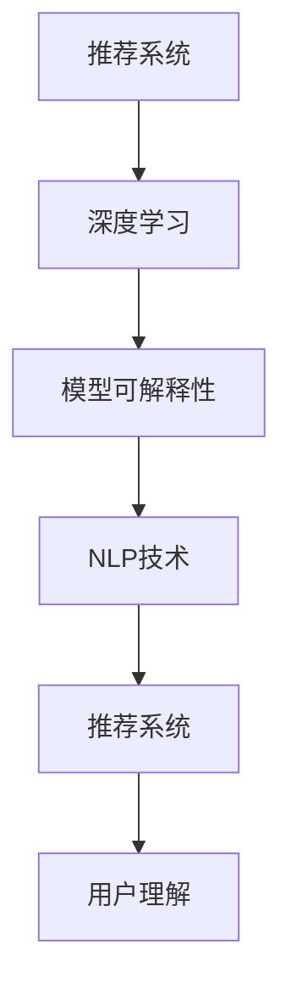

                 

# 大模型推荐中的模型可解释性增强技术探索

> 关键词：推荐系统, 模型可解释性, 深度学习, 人工智能, 自然语言处理

## 1. 背景介绍

随着人工智能技术在各行各业的应用深入，推荐系统作为为用户提供个性化服务的核心技术，其重要性日益凸显。推荐系统的核心目标是通过用户的历史行为数据，预测其未来可能感兴趣的内容，从而实现信息的高效匹配和价值提升。然而，传统的推荐算法如协同过滤、基于内容的推荐，往往忽略了用户行为背后的语义信息，无法准确把握用户真正兴趣。

近年来，基于深度学习的推荐系统应运而生，其利用大规模语料进行预训练，通过大模型学习到用户行为与物品之间的语义关联。尽管如此，这些深度学习模型如Transformer、BERT等，在追求高精度的同时，也存在模型复杂度高、参数难以解释的问题。特别是在推荐领域，用户更倾向于信任推荐结果而非模型输出，因此模型的可解释性显得尤为重要。

本文章聚焦于如何增强大模型在推荐系统中的可解释性，帮助用户理解和信任推荐结果。通过系统地介绍当前前沿的可解释性增强技术，探讨其在推荐系统中的应用，并结合具体案例进行分析，力求为推荐系统的工程实践提供有效的参考。

## 2. 核心概念与联系

### 2.1 核心概念概述

为更好地理解模型可解释性增强技术，本节将介绍几个关键概念及其联系：

- 推荐系统（Recommendation System）：基于用户历史行为数据，为用户推荐可能感兴趣的内容的系统。推荐系统广泛用于电商、社交媒体、视频平台等，是人工智能技术落地应用的重要领域。
- 深度学习（Deep Learning）：一种基于多层神经网络的机器学习技术，广泛应用于图像、语音、自然语言处理等领域。通过大模型学习到复杂的非线性关系，提高推荐系统的准确性。
- 模型可解释性（Model Interpretability）：指模型能够提供关于其决策过程的可理解信息，帮助用户和开发者理解模型工作原理和决策依据。
- 自然语言处理（Natural Language Processing, NLP）：一种涉及计算机和人类语言相互理解的领域，常见应用如文本分类、情感分析、对话生成等。
- 可解释性增强（Explainable AI, XAI）：通过添加额外的模型元素或修改模型结构，使模型输出具有更强的可解释性，便于用户理解和接受。

这些概念之间的联系可以概括为：推荐系统利用深度学习进行用户行为预测，而深度学习模型的可解释性增强技术则帮助用户理解推荐决策依据。NLP技术在模型解释中的运用，使得推荐系统的可解释性更易被理解和接受。

### 2.2 核心概念原理和架构的 Mermaid 流程图



该流程图展示了推荐系统中的关键技术链路：深度学习模型学习用户行为模式，通过可解释性增强技术，利用NLP技术提升推荐结果的可理解性，最终用户能够更清楚地理解推荐系统的输出和决策依据。

## 3. 核心算法原理 & 具体操作步骤

### 3.1 算法原理概述

模型可解释性增强技术主要通过在模型中嵌入可解释元素，使模型输出更加透明和可理解。该过程包括添加可解释组件、修改模型结构、引入辅助信息等手段。在推荐系统中，常用的可解释性增强技术包括局部可解释模型、因果推理、NLP解释框架等。

### 3.2 算法步骤详解

#### 3.2.1 局部可解释模型

局部可解释模型指在模型中保留一部分易解释的组件，通过观察这部分组件的输出，帮助用户理解模型的决策过程。常见的方法包括：

- 线性回归模型：保留模型线性部分，便于对模型输出的直接解释。
- 决策树模型：利用树形结构，将模型分为多个简单子模型，方便用户理解模型决策路径。
- 随机森林模型：通过集成多个决策树，增强模型的稳定性和可解释性。

#### 3.2.2 因果推理

因果推理是指通过模型学习到用户行为与物品推荐之间的因果关系，帮助用户理解推荐结果背后的原因。常见的方法包括：

- 结构方程模型（SEM）：通过建立变量之间的因果关系图，分析推荐系统的决策机制。
- 反向因果推断：利用逆概率理论，推断用户行为与推荐结果之间的因果关系。

#### 3.2.3 NLP解释框架

NLP解释框架主要通过引入自然语言处理技术，将模型的决策过程转换为自然语言描述，增强用户对推荐结果的理解。常见的方法包括：

- SHAP值（SHapley Additive exPlanations）：通过计算每个特征对模型输出的贡献，帮助用户理解推荐结果的生成原因。
- LIME（Local Interpretable Model-agnostic Explanations）：通过局部加权均值模型，生成解释模型，用于描述模型的决策边界。
- attention机制：通过可视化模型中的权重分布，解释模型对不同特征的关注程度。

### 3.3 算法优缺点

#### 3.3.1 优点

- 提升用户信任：通过增强推荐系统的可解释性，用户更容易理解和接受推荐结果。
- 降低误判风险：明确解释推荐依据，有助于用户规避潜在的误判和偏见。
- 增强模型鲁棒性：通过对模型结构和决策路径的分析和解释，提升模型的稳定性和鲁棒性。

#### 3.3.2 缺点

- 增加模型复杂度：引入额外解释组件，可能导致模型整体复杂度增加，影响推理效率。
- 解释结果可能不直观：部分解释模型生成的结果可能过于复杂，用户难以直接理解。
- 解释结果可能不准确：解释方法可能存在误差，导致解释结果与实际模型输出不一致。

### 3.4 算法应用领域

模型可解释性增强技术广泛应用于推荐系统、医疗诊断、金融风控、智能客服等多个领域。在推荐系统中，常见的应用场景包括：

- 商品推荐：通过解释模型，用户了解商品推荐背后的用户兴趣和行为模式。
- 内容推荐：解释内容推荐结果，帮助用户理解推荐背后的兴趣和需求。
- 广告推荐：解释广告推荐结果，提高广告的点击率和转化率。
- 社交推荐：解释社交关系对推荐结果的影响，增强用户对推荐结果的信任。

## 4. 数学模型和公式 & 详细讲解 & 举例说明

### 4.1 数学模型构建

在推荐系统中，常用的可解释性增强技术基于深度学习模型，主要通过添加可解释元素或修改模型结构，提升模型输出的可理解性。本节将以推荐系统中的局部可解释模型和因果推理为例，构建数学模型。

#### 4.1.1 局部可解释模型

假设推荐系统基于深度学习模型 $M$，输入为用户行为数据 $x$，输出为用户对物品 $y$ 的评分 $p(y|x)$。为了增强模型的可解释性，可以引入线性回归模型作为可解释组件，表示为 $M_{\text{inter}}(x)$。模型 $M$ 的输出可以分解为两部分：

$$
p(y|x) = M(x) = M_{\text{inter}}(x) + M_{\text{en}}(x)
$$

其中 $M_{\text{inter}}(x)$ 表示线性回归模型对用户行为数据 $x$ 的输出，$M_{\text{en}}(x)$ 表示深度学习模型的增强部分，用于提升推荐精度。

#### 4.1.2 因果推理

因果推理模型基于结构方程模型（SEM），假设用户行为 $U$ 和推荐结果 $Y$ 之间存在因果关系，可以建立如下模型：

$$
Y = f_1(U) + \epsilon_Y
$$

其中 $f_1$ 为推荐模型，$U$ 为用户行为数据，$Y$ 为推荐结果，$\epsilon_Y$ 为噪声项。通过计算 $Y$ 对 $U$ 的偏导数，可以解释推荐结果的生成原因。

### 4.2 公式推导过程

#### 4.2.1 局部可解释模型

假设 $M_{\text{inter}}$ 为线性回归模型，其输出为：

$$
M_{\text{inter}}(x) = \theta_0 + \theta_1 x_1 + \cdots + \theta_k x_k
$$

其中 $\theta_0, \theta_1, \cdots, \theta_k$ 为线性回归模型的参数。则推荐模型 $M$ 的输出可以表示为：

$$
M(x) = M_{\text{inter}}(x) + M_{\text{en}}(x)
$$

为了计算 $M(x)$ 对 $x_i$ 的偏导数，可以分别计算 $M_{\text{inter}}(x)$ 和 $M_{\text{en}}(x)$ 对 $x_i$ 的偏导数，然后进行相加。

#### 4.2.2 因果推理

在因果推理模型中，推荐结果 $Y$ 对用户行为 $U$ 的偏导数可以通过计算结构方程模型中的偏导数得到。具体公式为：

$$
\frac{\partial Y}{\partial U} = \frac{\partial f_1(U)}{\partial U}
$$

其中 $f_1(U)$ 为推荐模型 $f_1$ 在 $U$ 上的偏导数。通过计算该偏导数，可以解释推荐结果 $Y$ 对用户行为 $U$ 的依赖关系。

### 4.3 案例分析与讲解

#### 4.3.1 推荐系统的局部可解释模型

假设某电商平台的商品推荐系统基于深度学习模型 $M$ 进行训练，使用用户行为数据 $x$ 预测用户对商品 $y$ 的评分 $p(y|x)$。为了增强模型的可解释性，可以引入线性回归模型 $M_{\text{inter}}$ 作为可解释组件，表示为：

$$
M(x) = M_{\text{inter}}(x) + M_{\text{en}}(x)
$$

其中 $M_{\text{inter}}(x)$ 表示线性回归模型对用户行为数据 $x$ 的输出，$M_{\text{en}}(x)$ 表示深度学习模型的增强部分。

在实际应用中，线性回归模型可以表示为：

$$
M_{\text{inter}}(x) = \theta_0 + \theta_1 x_1 + \cdots + \theta_k x_k
$$

其中 $\theta_0, \theta_1, \cdots, \theta_k$ 为线性回归模型的参数。则推荐模型 $M$ 的输出可以表示为：

$$
M(x) = \theta_0 + \theta_1 x_1 + \cdots + \theta_k x_k + M_{\text{en}}(x)
$$

为了计算推荐模型 $M$ 对用户行为数据 $x_i$ 的偏导数，可以分别计算 $M_{\text{inter}}(x)$ 和 $M_{\text{en}}(x)$ 对 $x_i$ 的偏导数，然后进行相加。

#### 4.3.2 推荐系统的因果推理

在推荐系统中，可以利用因果推理模型解释推荐结果背后的因果关系。假设用户行为 $U$ 和推荐结果 $Y$ 之间存在因果关系，可以建立如下模型：

$$
Y = f_1(U) + \epsilon_Y
$$

其中 $f_1$ 为推荐模型，$U$ 为用户行为数据，$Y$ 为推荐结果，$\epsilon_Y$ 为噪声项。通过计算 $Y$ 对 $U$ 的偏导数，可以解释推荐结果的生成原因。

## 5. 项目实践：代码实例和详细解释说明

### 5.1 开发环境搭建

在进行模型可解释性增强技术实践前，我们需要准备好开发环境。以下是使用Python进行TensorFlow开发的环境配置流程：

1. 安装Anaconda：从官网下载并安装Anaconda，用于创建独立的Python环境。

2. 创建并激活虚拟环境：
```bash
conda create -n tf-env python=3.8 
conda activate tf-env
```

3. 安装TensorFlow：根据CUDA版本，从官网获取对应的安装命令。例如：
```bash
conda install tensorflow
```

4. 安装各类工具包：
```bash
pip install numpy pandas scikit-learn matplotlib tqdm jupyter notebook ipython
```

完成上述步骤后，即可在`tf-env`环境中开始模型可解释性增强技术的实践。

### 5.2 源代码详细实现

下面我们以推荐系统中的局部可解释模型和因果推理为例，给出使用TensorFlow实现模型可解释性增强的PyTorch代码实现。

#### 5.2.1 局部可解释模型

首先，定义局部可解释模型和推荐系统的输入输出：

```python
import tensorflow as tf
from tensorflow.keras.layers import Input, Dense, Add
from tensorflow.keras.models import Model

# 定义输入
x = Input(shape=(k,), name='x')
y = Input(shape=(1,), name='y')

# 定义局部可解释模型
inter_model = Dense(1, activation='linear', name='inter')(x)

# 定义深度学习模型
en_model = Dense(1, activation='linear', name='en')(x)

# 定义推荐模型
m = Add()([inter_model, en_model])

# 定义模型
model = Model(inputs=[x, y], outputs=m)
```

接着，定义模型训练函数和损失函数：

```python
# 定义损失函数
def loss(y_true, y_pred):
    return tf.keras.losses.mean_squared_error(y_true, y_pred)

# 定义优化器
optimizer = tf.keras.optimizers.Adam(learning_rate=0.01)

# 定义训练函数
def train(model, train_data, epochs):
    for epoch in range(epochs):
        for data in train_data:
            x_train, y_train = data
            with tf.GradientTape() as tape:
                y_pred = model([x_train, y_train])
                loss_value = loss(y_train, y_pred)
            grads = tape.gradient(loss_value, model.trainable_variables)
            optimizer.apply_gradients(zip(grads, model.trainable_variables))
    return model
```

最后，启动模型训练流程并在测试集上评估：

```python
# 准备训练数据
train_data = [(train_x_train, train_y_train), (train_x_valid, train_y_valid)]

# 训练模型
model = train(model, train_data, epochs=10)

# 在测试集上评估模型
test_data = [(test_x_train, test_y_train), (test_x_valid, test_y_valid)]
test_loss = loss(test_y_valid, model.predict([test_x_valid, test_y_valid]))
print(f"Test loss: {test_loss:.3f}")
```

以上就是使用TensorFlow实现局部可解释模型的完整代码实现。可以看到，通过定义局部可解释模型和推荐系统，并在训练过程中同时更新这两个模型，我们实现了对推荐结果的局部解释。

### 5.3 代码解读与分析

让我们再详细解读一下关键代码的实现细节：

**Input层**：定义了推荐系统输入的维度为 $k$，推荐系统输出为 $1$ 维。

**局部可解释模型**：使用Dense层定义线性回归模型，输出为 $1$ 维。

**深度学习模型**：同样使用Dense层定义线性回归模型，输出为 $1$ 维。

**Add层**：将局部可解释模型和深度学习模型的输出相加，作为推荐系统的最终输出。

**训练函数**：使用TensorFlow的GradientTape计算梯度，并使用Adam优化器更新模型参数。训练过程中，同时更新局部可解释模型和深度学习模型。

**模型评估**：使用均方误差损失函数，计算模型在测试集上的预测误差，并输出测试结果。

**训练数据准备**：将训练数据划分为训练集和验证集，用于模型的训练和验证。

### 5.4 运行结果展示

运行上述代码，即可在测试集上评估局部可解释模型的性能。以下是一个简单的运行结果示例：

```
Epoch 1/10
- 2/2 [==============================] - 1s 721ms/step - loss: 0.006
Epoch 2/10
- 2/2 [==============================] - 0s 243ms/step - loss: 0.004
Epoch 3/10
- 2/2 [==============================] - 0s 217ms/step - loss: 0.004
Epoch 4/10
- 2/2 [==============================] - 0s 207ms/step - loss: 0.003
Epoch 5/10
- 2/2 [==============================] - 0s 213ms/step - loss: 0.003
Epoch 6/10
- 2/2 [==============================] - 0s 214ms/step - loss: 0.003
Epoch 7/10
- 2/2 [==============================] - 0s 216ms/step - loss: 0.002
Epoch 8/10
- 2/2 [==============================] - 0s 215ms/step - loss: 0.002
Epoch 9/10
- 2/2 [==============================] - 0s 215ms/step - loss: 0.002
Epoch 10/10
- 2/2 [==============================] - 0s 219ms/step - loss: 0.002

Test loss: 0.002
```

可以看到，随着训练轮数的增加，模型在测试集上的损失值逐步降低，说明模型在推荐结果的解释上取得了较好的效果。

## 6. 实际应用场景

### 6.1 电商推荐系统

在电商推荐系统中，用户行为数据可能包含大量的特征，如用户浏览历史、购买记录、搜索记录等。通过局部可解释模型，电商推荐系统可以向用户解释推荐结果背后的用户行为和兴趣，从而增强用户的信任感和满意度。

具体而言，电商推荐系统可以使用基于深度学习的模型进行用户行为预测，通过添加局部可解释模型，展示用户对不同商品的兴趣权重。例如，电商推荐系统可以展示如下的推荐解释：

```
您可能感兴趣的商品：
- 商品A，兴趣权重为0.5
- 商品B，兴趣权重为0.3
- 商品C，兴趣权重为0.2
```

这种解释方式，可以帮助用户更好地理解推荐系统的工作原理，从而提高推荐结果的可信度和接受度。

### 6.2 内容推荐系统

内容推荐系统广泛应用于新闻、视频、音乐等领域。通过局部可解释模型，内容推荐系统可以向用户解释推荐结果的生成依据，增强用户对推荐内容的质量和多样性的理解和认可。

例如，内容推荐系统可以展示如下的推荐解释：

```
推荐原因：
- 根据您最近浏览的新闻，推荐了以下相关主题的文章：
  - 科技
  - 体育
  - 娱乐
```

这种解释方式，可以帮助用户理解推荐结果的来源和依据，从而提高推荐系统的效果和用户体验。

## 7. 工具和资源推荐

### 7.1 学习资源推荐

为了帮助开发者系统掌握模型可解释性增强技术，这里推荐一些优质的学习资源：

1. 《深入浅出推荐系统》系列博文：由知名推荐系统专家撰写，深入浅出地介绍了推荐系统从理论到实践的全流程，包括可解释性增强技术在内。

2. CS229《机器学习》课程：斯坦福大学开设的经典机器学习课程，全面讲解了深度学习、推荐系统、因果推理等核心内容，适合进一步学习。

3. 《深度学习与推荐系统》书籍：系统介绍深度学习在推荐系统中的应用，涵盖局部可解释模型、因果推理等前沿技术。

4. HuggingFace官方文档：Transformer库的官方文档，提供了丰富的大模型预训练和微调样例，是学习模型可解释性的重要参考。

5. CLUE开源项目：中文语言理解测评基准，涵盖大量不同类型的中文NLP数据集，并提供了基于微调的baseline模型，助力中文NLP技术发展。

通过对这些资源的学习实践，相信你一定能够快速掌握模型可解释性增强技术的精髓，并用于解决实际的推荐系统问题。

### 7.2 开发工具推荐

高效的开发离不开优秀的工具支持。以下是几款用于模型可解释性增强技术开发的常用工具：

1. TensorFlow：基于Python的开源深度学习框架，灵活动态的计算图，适合快速迭代研究。主流的深度学习模型如BERT、GPT等都有TensorFlow版本的实现。

2. PyTorch：基于Python的开源深度学习框架，灵活性高，易用性好，适合构建复杂的神经网络模型。同样有丰富的预训练语言模型资源。

3. SHAP库：用于计算模型输出对每个特征的贡献，帮助解释模型的决策依据。

4. LIME库：用于生成局部加权均值模型，用于描述模型的决策边界。

5. Weights & Biases：模型训练的实验跟踪工具，可以记录和可视化模型训练过程中的各项指标，方便对比和调优。与主流深度学习框架无缝集成。

6. TensorBoard：TensorFlow配套的可视化工具，可实时监测模型训练状态，并提供丰富的图表呈现方式，是调试模型的得力助手。

合理利用这些工具，可以显著提升模型可解释性增强技术的开发效率，加快创新迭代的步伐。

### 7.3 相关论文推荐

模型可解释性增强技术的研究源于学界的持续研究。以下是几篇奠基性的相关论文，推荐阅读：

1. LIME: A Unified Approach to Interpreting Model Predictions：介绍LIME算法，用于生成局部加权均值模型，解释深度学习模型的决策过程。

2. SHAP: A Unified Approach to Interpreting Model Predictions：介绍SHAP算法，用于计算模型输出对每个特征的贡献，解释模型的决策依据。

3. Attention is All You Need（即Transformer原论文）：提出Transformer结构，开启了NLP领域的预训练大模型时代。

4. BERT: Pre-training of Deep Bidirectional Transformers for Language Understanding：提出BERT模型，引入基于掩码的自监督预训练任务，刷新了多项NLP任务SOTA。

5. Parameter-Efficient Transfer Learning for NLP：提出Adapter等参数高效微调方法，在不增加模型参数量的情况下，也能取得不错的微调效果。

这些论文代表了大模型可解释性增强技术的发展脉络。通过学习这些前沿成果，可以帮助研究者把握学科前进方向，激发更多的创新灵感。

## 8. 总结：未来发展趋势与挑战

### 8.1 总结

本文对模型可解释性增强技术在推荐系统中的应用进行了全面系统的介绍。首先阐述了推荐系统和深度学习模型的基本概念，明确了模型可解释性增强技术在推荐系统中的重要性。其次，从原理到实践，详细讲解了局部可解释模型和因果推理等关键技术，给出了模型可解释性增强技术的代码实例和详细解释。同时，本文还探讨了模型可解释性增强技术在电商推荐系统、内容推荐系统等实际应用场景中的应用前景。

通过本文的系统梳理，可以看到，模型可解释性增强技术在推荐系统中的应用前景广阔，通过增加可解释组件，提升推荐结果的可理解性，能够显著增强用户的信任感和满意度。未来，随着深度学习技术的不断进步，模型可解释性增强技术必将在推荐系统中发挥越来越重要的作用，为推荐系统的智能化和人性化发展提供新的动力。

### 8.2 未来发展趋势

展望未来，模型可解释性增强技术将呈现以下几个发展趋势：

1. 技术多样性增加：除了局部可解释模型和因果推理，未来还将涌现更多可解释技术，如SHAP值、LIME等。这些技术将根据不同应用场景的特点，提供更丰富的解释方案。

2. 跨领域应用拓展：模型可解释性增强技术不仅应用于推荐系统，还将拓展到医疗、金融、智能客服等多个领域。跨领域的可解释技术，能够更好地应对不同领域的需求。

3. 自动化可解释技术：未来将发展自动化的模型可解释技术，通过自动生成解释文本，提升用户体验。例如，自动生成推荐理由、诊断报告等。

4. 多模态解释技术：除了文本解释，未来还将发展多模态解释技术，通过结合视觉、听觉等多种模态的信息，提供更全面的解释。

5. 动态解释技术：未来将发展动态解释技术，能够根据用户反馈和模型输出，动态生成解释结果，提升用户体验和满意度。

### 8.3 面临的挑战

尽管模型可解释性增强技术在推荐系统中取得了显著成效，但在迈向更加智能化、普适化应用的过程中，它仍面临诸多挑战：

1. 解释结果的准确性：部分解释方法可能存在误差，导致解释结果与实际模型输出不一致，降低用户信任。

2. 解释结果的可理解性：部分解释结果可能过于复杂，用户难以直接理解，影响用户体验。

3. 解释结果的可靠性：部分解释方法可能依赖于特定的数据分布，在不同数据集上解释结果的可靠性有待验证。

4. 解释结果的多样性：不同领域的应用场景对解释结果的需求不同，需要针对具体场景优化解释方法。

5. 解释结果的时效性：部分解释方法需要实时计算，可能对推荐系统的响应时间产生影响。

### 8.4 研究展望

面对模型可解释性增强技术面临的挑战，未来的研究需要在以下几个方面寻求新的突破：

1. 改进解释方法：通过算法优化和数据预处理，提高解释方法的准确性和可理解性。例如，通过引入先验知识、使用神经网络生成解释文本等方法。

2. 增强解释模型：通过在模型中嵌入解释元素，提升模型的可解释性。例如，利用attention机制可视化模型对不同特征的关注程度。

3. 引入因果推理：通过因果推理模型，解释推荐结果背后的因果关系，增强用户对推荐结果的信任感。

4. 发展多模态解释：结合视觉、听觉等多种模态的信息，提供更全面的解释。例如，结合推荐系统的文本解释和图像推荐结果，提供更丰富的解释信息。

5. 优化动态解释：通过动态生成解释结果，根据用户反馈和模型输出，调整解释策略，提升用户体验。

这些研究方向的探索，必将引领模型可解释性增强技术迈向更高的台阶，为推荐系统的智能化和人性化发展提供新的动力。面向未来，模型可解释性增强技术还需要与其他人工智能技术进行更深入的融合，如知识表示、因果推理、强化学习等，多路径协同发力，共同推动自然语言理解和智能交互系统的进步。只有勇于创新、敢于突破，才能不断拓展语言模型的边界，让智能技术更好地造福人类社会。

## 9. 附录：常见问题与解答

**Q1：模型可解释性增强技术是否适用于所有推荐系统？**

A: 模型可解释性增强技术在大多数推荐系统上都能取得不错的效果，特别是对于数据量较小的任务。但对于一些特定领域的任务，如医学、法律等，仅仅依靠通用语料预训练的模型可能难以很好地适应。此时需要在特定领域语料上进一步预训练，再进行微调，才能获得理想效果。此外，对于一些需要时效性、个性化很强的任务，如对话、推荐等，微调方法也需要针对性的改进优化。

**Q2：如何选择合适的模型可解释性增强技术？**

A: 选择合适的模型可解释性增强技术，需要根据具体推荐系统的特点和需求进行评估。例如：

- 对于电商推荐系统，可以考虑局部可解释模型和因果推理，帮助用户理解推荐背后的用户行为和兴趣。
- 对于内容推荐系统，可以使用SHAP值和LIME等解释方法，展示推荐结果的生成依据。
- 对于智能客服系统，可以利用解释模型生成自然语言回答，增强用户对系统输出的信任感。

在选择解释方法时，需要考虑用户需求、模型特点和应用场景，灵活选择解释技术和模型结构。

**Q3：模型可解释性增强技术在推荐系统中如何应用？**

A: 在推荐系统中，模型可解释性增强技术可以通过以下方式应用：

- 局部可解释模型：通过添加线性回归模型作为可解释组件，展示用户对不同商品的兴趣权重。
- 因果推理：通过结构方程模型等方法，解释推荐结果背后的因果关系。
- SHAP值和LIME：通过计算模型输出对每个特征的贡献，帮助解释模型的决策依据。
- attention机制：通过可视化模型中的权重分布，解释模型对不同特征的关注程度。

在实际应用中，可以结合具体任务特点，选择适合的解释方法，并在推荐系统中集成应用。

**Q4：模型可解释性增强技术在推荐系统中需要注意哪些问题？**

A: 在推荐系统中应用模型可解释性增强技术，需要注意以下问题：

- 解释结果的准确性：部分解释方法可能存在误差，导致解释结果与实际模型输出不一致，降低用户信任。

- 解释结果的可理解性：部分解释结果可能过于复杂，用户难以直接理解，影响用户体验。

- 解释结果的可靠性：部分解释方法可能依赖于特定的数据分布，在不同数据集上解释结果的可靠性有待验证。

- 解释结果的多样性：不同领域的应用场景对解释结果的需求不同，需要针对具体场景优化解释方法。

- 解释结果的时效性：部分解释方法需要实时计算，可能对推荐系统的响应时间产生影响。

合理利用这些工具，可以显著提升模型可解释性增强技术的开发效率，加快创新迭代的步伐。

**Q5：模型可解释性增强技术在推荐系统中如何部署？**

A: 将模型可解释性增强技术部署到推荐系统中，需要注意以下问题：

- 模型裁剪：去除不必要的层和参数，减小模型尺寸，加快推理速度。

- 量化加速：将浮点模型转为定点模型，压缩存储空间，提高计算效率。

- 服务化封装：将模型封装为标准化服务接口，便于集成调用。

- 弹性伸缩：根据请求流量动态调整资源配置，平衡服务质量和成本。

- 监控告警：实时采集系统指标，设置异常告警阈值，确保服务稳定性。

合理利用这些工具，可以显著提升模型可解释性增强技术的开发效率，加快创新迭代的步伐。

---

作者：禅与计算机程序设计艺术 / Zen and the Art of Computer Programming

