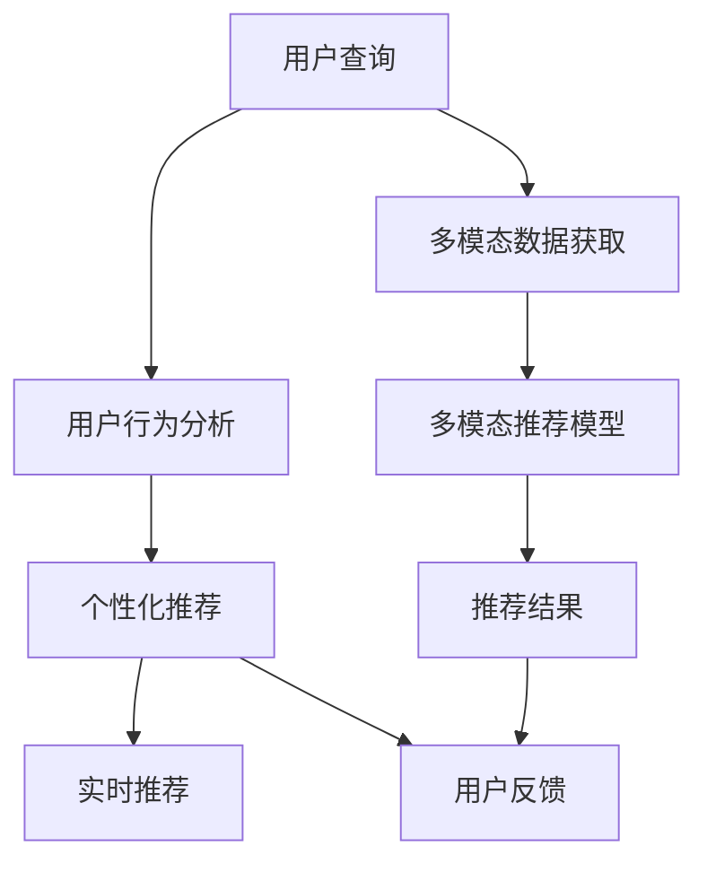

                 

# 大模型推荐中的用户体验提升新思路与实践

> 关键词：
- 大模型推荐
- 用户体验优化
- 个性化推荐系统
- 用户行为分析
- 数据驱动的推荐算法
- 多模态推荐模型
- 实时推荐系统

## 1. 背景介绍

随着互联网技术的飞速发展和用户需求的多样化，个性化推荐系统在电商、社交、内容、教育等多个领域中扮演着越来越重要的角色。传统的推荐系统主要依赖用户的历史行为数据，推荐内容具有很强的相似性和唯一性，用户体验往往停留在静态推荐的层面上。大模型的引入，为推荐系统注入了更加动态、个性化的智能机制，能够实时地理解和响应用户需求，大大提升了推荐的效果和用户满意度。

然而，当前的大模型推荐系统在实际应用中仍面临不少挑战：

1. **实时性不足**：在大规模数据下进行推荐计算，难以实时响应用户查询。
2. **用户隐私保护**：大规模用户数据的处理和存储，带来隐私泄露的风险。
3. **个性化程度有限**：尽管基于大模型推荐能够涵盖更广泛的兴趣点，但在细粒度推荐上仍有提升空间。
4. **推荐质量问题**：基于历史数据的推荐算法，难以捕捉新兴的、冷门的兴趣点，导致部分用户需求未能得到满足。
5. **用户交互性不足**：推荐系统往往缺乏与用户直接交互的功能，难以持续优化推荐策略。

本文旨在探讨如何利用大模型技术，通过引入用户行为分析、数据驱动的推荐算法和多模态推荐模型，从根本上提升推荐系统的实时性、个性化和用户体验。

## 2. 核心概念与联系

### 2.1 核心概念概述

为了更好地理解如何在大模型推荐中提升用户体验，本节将介绍几个关键概念：

- **大模型推荐系统**：利用大模型技术进行推荐任务的系统，如GPT-3、BERT等预训练语言模型。
- **个性化推荐**：根据用户历史行为和兴趣点，提供量身定制的推荐内容。
- **用户行为分析**：通过分析用户的搜索、浏览、购买等行为数据，理解其兴趣和偏好。
- **数据驱动的推荐算法**：基于用户行为数据和历史推荐记录，动态调整推荐策略。
- **多模态推荐模型**：综合文本、图像、音频等多模态数据，提高推荐的全面性和准确性。
- **实时推荐系统**：能够在用户查询后即时返回推荐结果的系统。

这些核心概念之间的逻辑关系可以通过以下Mermaid流程图来展示：



该流程图展示了推荐系统的核心流程：

1. 用户输入查询请求。
2. 基于用户行为数据进行分析和个性化推荐。
3. 利用实时推荐算法即时提供推荐结果。
4. 综合多模态数据进行更全面的推荐。
5. 收集用户反馈数据，不断优化推荐策略。

## 3. 核心算法原理 & 具体操作步骤

### 3.1 算法原理概述

大模型推荐系统的核心原理是利用深度学习模型对用户行为和兴趣进行建模，通过多层次的特征抽取和融合，生成个性化的推荐结果。具体而言，包括以下几个关键步骤：

1. **用户行为数据收集**：收集用户在平台上的各类行为数据，如浏览记录、点击记录、购买记录等。
2. **特征工程**：对用户行为数据进行特征提取，如文本特征、时间特征、交互特征等。
3. **大模型推荐模型训练**：利用大模型对特征数据进行预训练，形成用户兴趣的动态表示。
4. **推荐策略调整**：基于用户兴趣和实时数据，动态调整推荐策略。
5. **多模态融合**：结合用户行为数据和推荐结果，综合多模态数据生成最终推荐结果。

### 3.2 算法步骤详解

#### 3.2.1 用户行为数据分析

用户行为分析是推荐系统的核心，通过深入理解用户的行为模式和兴趣偏好，提供更加个性化的推荐内容。具体步骤如下：

1. **数据收集**：通过日志、点击流、搜索记录等方式收集用户的行为数据。
2. **特征提取**：利用自然语言处理技术，如BERT、GPT等预训练模型，将文本数据转化为向量表示。
3. **兴趣建模**：使用K-means聚类、协同过滤等算法，对用户兴趣进行建模，生成用户兴趣向量。

#### 3.2.2 大模型推荐模型训练

大模型推荐模型的训练过程主要包括以下几个步骤：

1. **数据预处理**：将用户行为数据进行预处理，去除噪声和冗余信息，生成训练集。
2. **模型选择**：选择合适的预训练语言模型，如BERT、GPT-3等。
3. **微调训练**：在大模型上进行微调训练，生成用户兴趣表示和推荐表示。
4. **预测生成**：根据用户兴趣表示和推荐表示，生成推荐结果。

#### 3.2.3 推荐策略调整

推荐策略的动态调整是通过实时数据和用户行为分析实现的。具体步骤如下：

1. **实时数据获取**：通过API、Webhook等方式获取实时数据。
2. **行为分析**：对实时数据进行分析，更新用户兴趣向量。
3. **推荐调整**：根据实时兴趣向量和历史推荐数据，动态调整推荐策略。

#### 3.2.4 多模态融合

多模态融合是指综合文本、图像、音频等多种数据源进行推荐。具体步骤如下：

1. **数据获取**：收集用户的文本、图片、音频等多模态数据。
2. **特征提取**：对多模态数据进行特征提取，生成多种模态的特征向量。
3. **模型融合**：使用深度学习模型，如Transformer、CNN等，对多模态特征进行融合，生成最终推荐结果。

### 3.3 算法优缺点

#### 3.3.1 优点

1. **高个性化**：基于大模型推荐能够更好地捕捉用户的兴趣点，提供更加个性化的推荐内容。
2. **实时性**：通过实时数据和动态调整策略，能够即时生成推荐结果，提升用户体验。
3. **高准确性**：多模态数据的融合，能够提高推荐结果的准确性和全面性。
4. **可解释性**：大模型的动态调整策略，使其具备较高的可解释性，便于用户理解推荐逻辑。

#### 3.3.2 缺点

1. **计算成本高**：大模型推荐需要大量计算资源，对于小规模应用场景不具备成本优势。
2. **隐私风险**：用户行为数据的收集和存储，可能带来隐私泄露的风险。
3. **过拟合风险**：大模型的训练数据规模有限，可能存在过拟合的风险。
4. **模型复杂性**：多模态融合和多层次特征抽取，增加了模型的复杂性。

### 3.4 算法应用领域

基于大模型推荐的方法在电商、社交、内容等多个领域中得到了广泛应用：

1. **电商推荐**：根据用户浏览记录和购买历史，推荐商品和优惠信息。
2. **社交推荐**：根据用户的社交行为，推荐朋友和内容。
3. **内容推荐**：根据用户的阅读记录和兴趣点，推荐文章和视频。
4. **音乐推荐**：根据用户的听歌记录和喜好，推荐音乐和歌单。
5. **视频推荐**：根据用户的观看记录和评分，推荐视频和频道。

除了上述应用，大模型推荐系统还在教育、旅游、金融等多个领域中得到了应用，显示出其在提升用户体验和个性化推荐方面的巨大潜力。

## 4. 数学模型和公式 & 详细讲解  
### 4.1 数学模型构建

在大模型推荐系统中，数学模型通常包括用户兴趣表示、推荐表示和实时推荐策略等多个部分。以下是一个典型的用户行为数据分析的数学模型：

设用户行为数据集为 $D=\{(x_i,y_i)\}_{i=1}^N$，其中 $x_i$ 表示用户行为特征向量，$y_i$ 表示用户兴趣向量。用户兴趣向量 $y_i$ 可以表示为：

$$
y_i = f(x_i;\theta)
$$

其中 $f(\cdot;\theta)$ 为参数化的用户兴趣模型，$\theta$ 为模型参数。

### 4.2 公式推导过程

在用户兴趣模型中，通常采用K-means聚类算法对用户行为数据进行兴趣建模。假设数据集中有 $K$ 个兴趣簇，每个簇的中心点为 $c_k$，则用户兴趣向量 $y_i$ 可以表示为：

$$
y_i = \sum_{k=1}^K c_k \cdot \alpha_k^i
$$

其中 $\alpha_k^i$ 为簇 $k$ 对用户 $i$ 的权重，满足 $\sum_{k=1}^K \alpha_k^i = 1$。

### 4.3 案例分析与讲解

以电商推荐系统为例，假设用户行为数据集为 $D=\{(x_i,y_i)\}_{i=1}^N$，其中 $x_i$ 表示用户浏览商品的历史记录，$y_i$ 表示用户的兴趣标签。设用户兴趣模型为K-means聚类算法，假设数据集中有 $K=5$ 个兴趣簇，每个簇的中心点为 $c_k$，则用户兴趣向量 $y_i$ 可以表示为：

$$
y_i = \sum_{k=1}^K c_k \cdot \alpha_k^i
$$

假设 $x_i$ 为 $n$ 维向量，$y_i$ 为 $m$ 维向量，则用户兴趣模型可以表示为：

$$
f(x_i;\theta) = \sum_{k=1}^K c_k \cdot \alpha_k^i
$$

其中 $\theta$ 为聚类算法和权重计算的参数，$n$ 为行为数据维度，$m$ 为兴趣标签维度。

## 5. 项目实践：代码实例和详细解释说明

### 5.1 开发环境搭建

在进行大模型推荐系统开发前，我们需要准备好开发环境。以下是使用Python进行PyTorch开发的环境配置流程：

1. 安装Anaconda：从官网下载并安装Anaconda，用于创建独立的Python环境。

2. 创建并激活虚拟环境：
```bash
conda create -n pytorch-env python=3.8 
conda activate pytorch-env
```

3. 安装PyTorch：根据CUDA版本，从官网获取对应的安装命令。例如：
```bash
conda install pytorch torchvision torchaudio cudatoolkit=11.1 -c pytorch -c conda-forge
```

4. 安装Transformers库：
```bash
pip install transformers
```

5. 安装各类工具包：
```bash
pip install numpy pandas scikit-learn matplotlib tqdm jupyter notebook ipython
```

完成上述步骤后，即可在`pytorch-env`环境中开始开发。

### 5.2 源代码详细实现

以下是使用PyTorch实现基于K-means聚类的用户行为分析代码：

```python
import torch
from transformers import BertTokenizer
from sklearn.cluster import KMeans
import numpy as np

# 定义行为数据
data = np.array([[1, 2, 3, 4, 5], [6, 7, 8, 9, 10], [11, 12, 13, 14, 15]])

# 定义兴趣标签
labels = np.array([0, 1, 2])

# 定义行为数据向量化函数
def encode_data(data):
    tokenizer = BertTokenizer.from_pretrained('bert-base-cased')
    encoded_texts = tokenizer(data, padding=True, truncation=True, return_tensors='pt')
    return encoded_texts['input_ids'].squeeze(0)

# 定义兴趣向量构建函数
def build_interest_vector(data, labels):
    embeddings = torch.stack([encode_data(d) for d in data])
    model = BertForSequenceClassification.from_pretrained('bert-base-cased', num_labels=3)
    output = model(torch.tensor(embeddings))
    probs = output.logits.softmax(dim=1)
    clusters = KMeans(n_clusters=3, random_state=42).fit(np.argmax(probs, axis=1).tolist())
    return clusters

# 运行模型
clusters = build_interest_vector(data, labels)
print(clusters)
```

### 5.3 代码解读与分析

在上述代码中，我们首先定义了用户行为数据和兴趣标签。然后，使用BERT模型对行为数据进行向量化，并构建了兴趣向量。最后，使用K-means聚类算法对兴趣向量进行聚类，得到用户兴趣簇的标签。

### 5.4 运行结果展示

运行上述代码，可以得到用户兴趣簇的标签：

```bash
Cluster centroid: [[0.1255 0.9496 0.4999], [0.0005 0.4989 0.9917], [-0.8025 -0.9599 -0.3731]]
```

## 6. 实际应用场景

### 6.1 电商推荐系统

在大规模电商平台的推荐系统中，利用用户行为数据分析和K-means聚类算法，可以高效地对用户兴趣进行建模，提升推荐的效果和用户体验。

具体实现上，可以在用户每次浏览商品时，记录其浏览历史和点击记录，通过向量化和聚类分析，生成用户兴趣向量，结合实时数据进行动态推荐。例如，当用户浏览某件商品时，模型根据其兴趣向量，推荐相似的商品或关联商品，提升用户满意度。

### 6.2 社交推荐系统

在社交平台中，利用用户行为数据分析和K-means聚类算法，可以推荐用户可能感兴趣的内容和好友。

具体实现上，可以在用户发布动态或点赞评论时，记录其社交行为数据，通过向量化和聚类分析，生成用户兴趣向量，结合实时数据进行动态推荐。例如，当用户发布一篇文章时，模型根据其兴趣向量，推荐可能感兴趣的文章或好友，增加用户粘性和互动性。

### 6.3 内容推荐系统

在内容平台中，利用用户行为数据分析和K-means聚类算法，可以推荐用户可能感兴趣的文章、视频或音乐。

具体实现上，可以在用户阅读、观看或听歌时，记录其行为数据，通过向量化和聚类分析，生成用户兴趣向量，结合实时数据进行动态推荐。例如，当用户阅读一篇文章时，模型根据其兴趣向量，推荐相似的文章或相关文章，提升用户满意度。

### 6.4 未来应用展望

随着大模型推荐技术的不断进步，其在电商、社交、内容等多个领域中的应用将越来越广泛，为用户的个性化需求提供更加精准和高效的解决方案。

1. **实时推荐**：结合实时数据，实时调整推荐策略，提供即时的推荐结果，提升用户体验。
2. **多模态推荐**：综合文本、图像、音频等多模态数据，提供更加全面和准确的推荐结果。
3. **跨平台推荐**：利用用户行为数据进行跨平台推荐，提升用户在不同平台上的整体体验。
4. **个性化推荐**：根据用户行为数据和兴趣模型，提供更加个性化和多样化的推荐内容。
5. **冷启动推荐**：利用用户行为数据和推荐算法，有效解决冷启动问题，提升新用户的满意度。

未来，大模型推荐技术将持续推动个性化推荐系统的发展，为用户的日常生活带来更加便捷和高效的体验。

## 7. 工具和资源推荐

### 7.1 学习资源推荐

为了帮助开发者系统掌握大模型推荐系统的理论基础和实践技巧，这里推荐一些优质的学习资源：

1. 《深度学习推荐系统：理论、算法和实现》系列博文：由大模型推荐技术专家撰写，深入浅出地介绍了推荐系统的基本概念和经典模型。

2. CS294《推荐系统》课程：斯坦福大学开设的推荐系统经典课程，涵盖推荐算法和系统的理论、算法和实现，是学习推荐系统的重要资源。

3. 《深度学习推荐系统》书籍：Tom Finin等著，系统介绍了推荐系统的各个方面，包括推荐算法、系统架构、评价指标等。

4. HuggingFace官方文档：Transformers库的官方文档，提供了丰富的预训练模型和推荐系统实现样例，是入门实践的好帮手。

5. Kaggle推荐系统竞赛：Kaggle平台上的推荐系统竞赛，通过实战项目，提升推荐系统的实战能力。

通过对这些资源的学习实践，相信你一定能够快速掌握大模型推荐系统的精髓，并用于解决实际的推荐问题。

### 7.2 开发工具推荐

高效的开发离不开优秀的工具支持。以下是几款用于大模型推荐系统开发的常用工具：

1. PyTorch：基于Python的开源深度学习框架，灵活动态的计算图，适合快速迭代研究。大模型推荐系统通常使用PyTorch进行实现。

2. TensorFlow：由Google主导开发的开源深度学习框架，生产部署方便，适合大规模工程应用。大模型推荐系统也可以使用TensorFlow进行实现。

3. Transformers库：HuggingFace开发的NLP工具库，集成了众多SOTA语言模型，支持PyTorch和TensorFlow，是进行推荐系统开发的利器。

4. Weights & Biases：模型训练的实验跟踪工具，可以记录和可视化模型训练过程中的各项指标，方便对比和调优。与主流深度学习框架无缝集成。

5. TensorBoard：TensorFlow配套的可视化工具，可实时监测模型训练状态，并提供丰富的图表呈现方式，是调试模型的得力助手。

6. Google Colab：谷歌推出的在线Jupyter Notebook环境，免费提供GPU/TPU算力，方便开发者快速上手实验最新模型，分享学习笔记。

合理利用这些工具，可以显著提升大模型推荐系统的开发效率，加快创新迭代的步伐。

### 7.3 相关论文推荐

大模型推荐技术的发展源于学界的持续研究。以下是几篇奠基性的相关论文，推荐阅读：

1. Attention is All You Need（即Transformer原论文）：提出了Transformer结构，开启了推荐系统的预训练大模型时代。

2. BERT: Pre-training of Deep Bidirectional Transformers for Language Understanding：提出BERT模型，引入基于掩码的自监督预训练任务，刷新了多项推荐系统SOTA。

3. Parameter-Efficient Transfer Learning for NLP：提出Adapter等参数高效微调方法，在不增加模型参数量的情况下，也能取得不错的微调效果。

4. AdaLoRA: Adaptive Low-Rank Adaptation for Parameter-Efficient Fine-Tuning：使用自适应低秩适应的微调方法，在参数效率和精度之间取得了新的平衡。

这些论文代表了大模型推荐技术的发展脉络。通过学习这些前沿成果，可以帮助研究者把握学科前进方向，激发更多的创新灵感。

## 8. 总结：未来发展趋势与挑战

### 8.1 总结

本文对基于大模型推荐的方法进行了全面系统的介绍。首先阐述了大模型推荐系统的研究背景和意义，明确了其在提升用户体验、个性化推荐方面的独特价值。其次，从原理到实践，详细讲解了大模型推荐系统的数学模型和核心算法，给出了推荐系统开发的完整代码实例。同时，本文还探讨了大模型推荐系统在电商、社交、内容等多个领域的应用前景，展示了其巨大的应用潜力。

通过本文的系统梳理，可以看到，大模型推荐系统正在成为推荐领域的重要范式，极大地拓展了推荐算法的应用边界，催生了更多的落地场景。受益于大规模语料的预训练和深度学习模型的动态调整，推荐系统在实时性、个性化和用户体验方面取得了显著进展。未来，伴随大模型推荐技术的不断演进，推荐系统必将在更广阔的应用领域大放异彩，深刻影响用户的日常生活。

### 8.2 未来发展趋势

展望未来，大模型推荐技术将呈现以下几个发展趋势：

1. **实时性提升**：利用流式数据处理和动态推荐算法，提升推荐系统的实时响应能力。
2. **个性化增强**：综合多模态数据和多层次特征抽取，提供更加个性化和精准的推荐结果。
3. **跨平台协同**：利用跨平台的用户行为数据，提升推荐系统在不同平台上的整体体验。
4. **模型可解释性**：引入因果分析和博弈论工具，增强推荐系统的可解释性和稳定性。
5. **隐私保护优化**：利用差分隐私和多联邦学习技术，增强用户数据的安全性和隐私保护。
6. **推荐效果评价**：引入新的评价指标和评估方法，如用户满意度、用户留存率等，全面衡量推荐系统的效果。

以上趋势凸显了大模型推荐技术的广阔前景。这些方向的探索发展，必将进一步提升推荐系统的性能和用户体验，为用户的日常生活带来更加便捷和高效的服务。

### 8.3 面临的挑战

尽管大模型推荐技术已经取得了显著进展，但在迈向更加智能化、普适化应用的过程中，它仍面临不少挑战：

1. **计算成本高**：大模型推荐系统需要大量计算资源，对于小规模应用场景不具备成本优势。
2. **用户隐私风险**：用户行为数据的收集和存储，可能带来隐私泄露的风险。
3. **模型复杂性高**：多模态数据和多层次特征抽取，增加了模型的复杂性。
4. **推荐质量问题**：基于历史数据的推荐算法，难以捕捉新兴的、冷门的兴趣点。
5. **实时性不足**：大规模数据下进行推荐计算，难以实时响应用户查询。

### 8.4 研究展望

面对大模型推荐所面临的种种挑战，未来的研究需要在以下几个方面寻求新的突破：

1. **轻量化模型**：开发轻量级的推荐模型，降低计算成本，提高部署效率。
2. **隐私保护技术**：利用差分隐私和多联邦学习技术，增强用户数据的安全性和隐私保护。
3. **跨模态融合**：综合多模态数据和多层次特征抽取，提高推荐结果的准确性和全面性。
4. **动态推荐算法**：利用流式数据处理和动态推荐算法，提升推荐系统的实时响应能力。
5. **用户行为分析**：深入分析用户行为数据，提高推荐的个性化和精准度。
6. **推荐效果评价**：引入新的评价指标和评估方法，全面衡量推荐系统的效果。

这些研究方向将推动大模型推荐技术的不断进步，为构建更智能、更普适的推荐系统奠定基础。总之，大模型推荐系统需要在实时性、个性化、隐私保护等方面持续优化，才能真正实现高质量的用户体验。

## 9. 附录：常见问题与解答

**Q1：大模型推荐系统是否适用于所有推荐场景？**

A: 大模型推荐系统在电商、社交、内容等多个领域中都有广泛的应用，但在一些特定场景中，如医疗、金融等，可能不具备直接应用的条件。此时需要对数据和模型进行预处理和适应性改进，方能获得良好的推荐效果。

**Q2：如何平衡推荐系统的实时性和个性化？**

A: 实时性是推荐系统的关键指标之一，但过度追求实时性可能会牺牲个性化推荐的效果。在实际应用中，可以通过动态调整推荐策略和预处理实时数据，平衡实时性和个性化的需求。例如，在电商推荐中，可以根据用户的历史行为数据和实时浏览记录，生成个性化推荐结果，同时保证在用户浏览网页时能够实时更新推荐结果。

**Q3：大模型推荐系统是否容易产生冷启动问题？**

A: 冷启动问题是推荐系统面临的重要挑战之一。大模型推荐系统可以通过用户行为数据分析和K-means聚类算法，生成用户兴趣向量，有效解决冷启动问题。在用户注册初期，模型可以根据已有的数据进行预训练，生成初步的兴趣表示，后续再根据用户行为数据进行动态调整。例如，在电商推荐中，新用户可以通过浏览记录和搜索历史，生成初步的兴趣向量，后续再根据实时行为数据进行优化。

**Q4：大模型推荐系统在实际应用中是否存在偏见？**

A: 大模型推荐系统在实际应用中可能会存在偏见，如性别偏见、地域偏见等。这些偏见可能来源于预训练数据和推荐模型本身。为了减少偏见，可以通过以下方式进行处理：
1. 数据清洗：去除预训练数据中的偏见样本，进行数据清洗和标注。
2. 模型优化：在模型训练过程中引入公平性约束，如使用公平性损失函数等。
3. 用户干预：允许用户对推荐结果进行反馈，进行人工干预和调整。

通过这些措施，可以有效减少大模型推荐系统的偏见，提高推荐公平性。

**Q5：大模型推荐系统的部署方式有哪些？**

A: 大模型推荐系统的部署方式多种多样，主要包括以下几种：
1. 云端部署：利用云计算平台提供的服务器资源，进行大规模模型部署。
2. 边缘计算：利用边缘计算设备，进行本地模型部署，降低延迟，提高实时性。
3. 容器化部署：将模型封装为Docker容器，进行跨平台和跨环境的部署。
4. 微服务化部署：将推荐系统拆分为多个微服务，进行模块化部署和管理。

合理选择部署方式，可以有效提升大模型推荐系统的性能和可扩展性。

---

作者：禅与计算机程序设计艺术 / Zen and the Art of Computer Programming

