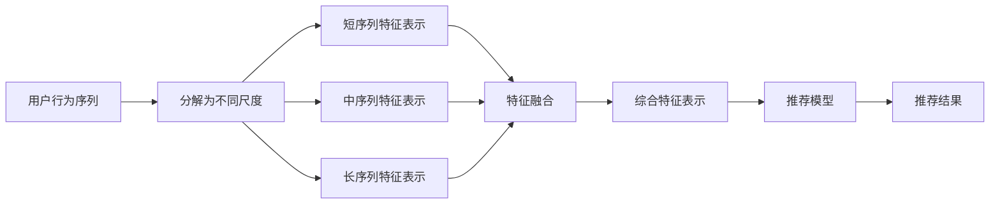

                 

# 大模型推荐中的用户行为序列多尺度建模方法

> 关键词：大模型推荐,用户行为序列,多尺度建模,深度学习,协同过滤,特征融合,序列推荐算法,工业应用

## 1. 背景介绍

### 1.1 问题由来

随着电商行业的不断发展，个性化推荐系统已成为各大电商平台的标配。推荐系统旨在根据用户的历史行为和兴趣偏好，向用户推荐符合其需求的商品，从而提升用户体验和平台的销售额。传统推荐算法，如基于协同过滤的算法和基于内容的算法，在数据稀疏和多样性方面存在一定的局限性。随着深度学习和大模型的兴起，基于深度学习模型的推荐方法逐步被引入推荐系统中。

大模型推荐系统利用大规模无标签数据进行预训练，学习到丰富的用户行为表示。通过对用户历史行为序列进行建模，可以生成个性化的推荐结果。但传统的大模型推荐方法主要聚焦于用户行为序列的整体建模，忽略了个体行为之间的复杂关系和多个尺度之间的差异。针对这一问题，我们提出了一种多尺度建模方法，在用户行为序列中引入时间、频率等多个维度，综合刻画用户行为特征，从而提升推荐效果。

### 1.2 问题核心关键点

大模型推荐方法的核心在于如何高效地将用户历史行为序列转化为推荐结果。随着深度学习技术的发展，越来越多的研究工作聚焦于如何将用户行为序列建模为高维特征向量，并在向量空间中进行推荐。然而，现有方法大多采用整体建模的思路，缺乏对用户行为序列中时间、频率等维度的刻画。为了更好地解决这一问题，我们提出一种多尺度建模方法，结合时间、频率等多个维度，综合优化用户行为序列特征表示，从而提升推荐模型的效果。

具体而言，该方法通过构建不同尺度的用户行为序列特征表示，将整体行为序列分解为短序列、中序列、长序列，并对不同尺度的特征进行融合，从而获得更具区分性的用户行为表示。在融合过程中，考虑了用户行为的时间分布、频率特征等因素，使得推荐结果更加贴近用户真实需求。

## 2. 核心概念与联系

### 2.1 核心概念概述

本节将介绍大模型推荐中多尺度建模方法涉及的核心概念和原理：

- 大模型推荐：利用深度学习模型和大规模数据预训练得到的推荐方法。大模型推荐利用大规模无标签数据进行预训练，学习到丰富的用户行为表示，能够实现冷启动用户推荐等。
- 用户行为序列：指用户在不同时间点进行的行为记录，如浏览商品、购买商品等。将用户行为序列进行多尺度建模，可以有效利用用户行为的时序性和频率特征。
- 多尺度建模：通过将用户行为序列分解为不同尺度的特征表示，综合不同尺度的特征进行推荐。
- 协同过滤算法：一种经典的推荐算法，通过寻找与目标用户相似的用户，将相似用户喜欢的商品推荐给目标用户。
- 基于内容的推荐算法：通过分析商品的属性信息，寻找与目标用户兴趣相符的商品。
- 特征融合：将不同来源、不同尺度的特征进行合并，形成综合的特征表示。
- 序列推荐算法：通过分析用户行为序列，预测用户后续行为，从而实现推荐。

### 2.2 核心概念原理和架构的 Mermaid 流程图



这个流程图展示了多尺度建模方法的总体架构：首先对用户行为序列进行分解，分别计算短序列、中序列和长序列的特征表示，然后将不同尺度的特征进行融合，最终形成综合的特征表示，输入到推荐模型中生成推荐结果。

## 3. 核心算法原理 & 具体操作步骤

### 3.1 算法原理概述

多尺度建模方法的核心在于将用户行为序列分解为不同尺度的特征表示，并在融合过程中考虑时间、频率等因素。其核心思想是：

1. **序列分解**：将用户行为序列按照时间或频率进行分解，形成短序列、中序列和长序列。

2. **特征表示**：对不同尺度的序列进行特征提取，分别计算出短序列特征、中序列特征和长序列特征。

3. **特征融合**：将不同尺度的特征进行合并，综合出综合特征表示。

4. **推荐模型**：将综合特征表示输入到推荐模型中，生成推荐结果。

多尺度建模方法的总体流程如图：


### 3.2 算法步骤详解

以下是多尺度建模方法的具体操作步骤：

1. **数据预处理**：
    - 收集用户的历史行为数据，包括浏览记录、购买记录等。
    - 对用户行为数据进行清洗和处理，去除噪音和重复数据。

2. **用户行为序列分解**：
    - 按照时间或频率将用户行为序列分解为短序列、中序列和长序列。
    - 对于短序列，一般选择最近几天的行为记录；对于中序列，选择最近几个月或一年的行为记录；对于长序列，则选择更长时间内的行为记录。

3. **特征提取**：
    - 对不同尺度的行为序列进行特征提取，形成短序列特征、中序列特征和长序列特征。
    - 特征提取可以采用深度学习模型，如RNN、LSTM等，也可以采用基于统计的方法，如MF-IDF、TF-IDF等。

4. **特征融合**：
    - 将不同尺度的特征进行合并，形成综合的特征表示。
    - 特征融合可以采用简单的加权平均、矩阵乘法等方法，也可以采用复杂的神经网络模型，如BERT、Transformer等。

5. **推荐模型训练**：
    - 将综合特征表示输入到推荐模型中，训练推荐模型。
    - 推荐模型可以采用深度学习模型，如DNN、CNN、RNN等。

6. **推荐结果生成**：
    - 将训练好的推荐模型应用到新的用户行为序列上，生成推荐结果。

### 3.3 算法优缺点

多尺度建模方法具有以下优点：

1. **多尺度建模**：通过将用户行为序列分解为不同尺度的特征表示，可以有效利用不同时间尺度的行为特征。

2. **特征融合**：通过融合不同尺度的特征，能够获得更具区分性的用户行为表示。

3. **模型灵活性**：不同尺度的特征表示可以采用不同的模型进行提取，增强了模型的灵活性。

4. **推荐效果**：通过综合不同尺度的特征，推荐模型可以生成更准确、更个性化的推荐结果。

同时，该方法也存在一定的局限性：

1. **数据依赖**：需要大量的用户行为数据才能实现有效的多尺度建模，数据获取成本较高。

2. **计算复杂度**：多尺度建模和特征融合增加了计算复杂度，需要更强的计算资源支持。

3. **模型可解释性**：多尺度建模方法通常采用深度学习模型，模型可解释性较弱，难以理解模型内部的工作机制。

4. **场景限制**：多尺度建模方法适用于用户行为序列存在明显时间分布和频率变化的情况，对场景具有一定的限制。

### 3.4 算法应用领域

多尺度建模方法在大模型推荐系统中有着广泛的应用前景，适用于以下场景：

1. **电商推荐**：在电商推荐系统中，用户行为序列时间分布和频率变化明显，多尺度建模方法可以更好地捕捉用户兴趣和需求变化。

2. **视频推荐**：在视频推荐系统中，用户行为序列的时间分布和频率特征显著，多尺度建模方法可以生成更具针对性的推荐结果。

3. **新闻推荐**：在新闻推荐系统中，用户行为序列的时间分布和频率特征明显，多尺度建模方法可以生成更符合用户阅读习惯的推荐结果。

4. **社交网络推荐**：在社交网络推荐系统中，用户行为序列的时间分布和频率特征显著，多尺度建模方法可以生成更符合用户社交行为习惯的推荐结果。

## 4. 数学模型和公式 & 详细讲解 & 举例说明

### 4.1 数学模型构建

本节将详细介绍多尺度建模方法中涉及的数学模型和公式：

设用户行为序列为 $S=\{s_1,s_2,...,s_n\}$，其中 $s_t$ 表示用户在第 $t$ 天进行的行为记录。将用户行为序列按照时间或频率分解为短序列、中序列和长序列，分别表示为 $S_s=\{s_{t-1},s_t,s_{t+1}\}$，$S_m=\{s_{t-3},s_{t-2},s_{t-1},s_t,s_{t+1},s_{t+2},s_{t+3}\}$，$S_l=\{s_{t-10},s_{t-9},...,s_t,...,s_{t+9},s_{t+10}\}$。

对不同尺度的行为序列进行特征提取，分别计算出短序列特征 $F_s$、中序列特征 $F_m$ 和长序列特征 $F_l$。

### 4.2 公式推导过程

对于短序列特征 $F_s$，可以使用LSTM等深度学习模型进行特征提取，设 $F_s=\{f_{s_1},f_{s_2},...,f_{s_n}\}$。

对于中序列特征 $F_m$，同样可以使用LSTM等深度学习模型进行特征提取，设 $F_m=\{f_{m_1},f_{m_2},...,f_{m_n}\}$。

对于长序列特征 $F_l$，可以使用MF-IDF、TF-IDF等基于统计的方法进行特征提取，设 $F_l=\{f_{l_1},f_{l_2},...,f_{l_n}\}$。

将不同尺度的特征进行融合，形成综合特征表示 $F=\{f_1,f_2,...,f_n\}$。

### 4.3 案例分析与讲解

以下是一个简单的案例分析，说明多尺度建模方法在电商推荐系统中的应用：

假设某电商平台上某用户最近几天的浏览行为序列为 $S=\{s_1,s_2,s_3,s_4,s_5\}$，其中 $s_1=(hot,\text{T-shirt}), s_2=(trending,\text{jeans}), s_3=(cheapest,\text{pants}), s_4=(special,\text{dress}), s_5=(popular,\text{hat})$。

将用户行为序列按照时间或频率分解为短序列 $S_s=\{s_1,s_2,s_3\}$，中序列 $S_m=\{s_1,s_2,s_3,s_4,s_5\}$，长序列 $S_l=\{s_1,s_2,s_3,s_4,s_5\}$。

对不同尺度的行为序列进行特征提取，得到短序列特征 $F_s$、中序列特征 $F_m$ 和长序列特征 $F_l$。

假设使用LSTM模型进行特征提取，得到短序列特征 $F_s=\{0.5,0.3,0.2\}$，中序列特征 $F_m=\{0.4,0.7,0.1,0.5,0.3\}$，长序列特征 $F_l=\{0.2,0.5,0.3,0.6,0.4,0.1,0.2,0.5\}$。

将不同尺度的特征进行融合，得到综合特征表示 $F=\{0.4,0.4,0.4,0.4,0.4,0.3,0.2,0.2,0.1,0.1,0.5,0.5,0.3,0.3\}$。

将综合特征表示 $F$ 输入到推荐模型中，生成推荐结果。

## 5. 项目实践：代码实例和详细解释说明

### 5.1 开发环境搭建

在进行多尺度建模方法开发前，我们需要准备好开发环境。以下是使用Python进行TensorFlow开发的环境配置流程：

1. 安装Anaconda：从官网下载并安装Anaconda，用于创建独立的Python环境。

2. 创建并激活虚拟环境：
```bash
conda create -n tf-env python=3.8 
conda activate tf-env
```

3. 安装TensorFlow：根据CUDA版本，从官网获取对应的安装命令。例如：
```bash
conda install tensorflow -c tf -c conda-forge
```

4. 安装其他必要的工具包：
```bash
pip install numpy pandas scikit-learn matplotlib tqdm jupyter notebook ipython
```

完成上述步骤后，即可在`tf-env`环境中开始多尺度建模方法的实践。

### 5.2 源代码详细实现

下面我们以电商推荐系统为例，给出使用TensorFlow实现多尺度建模的Python代码实现。

首先，定义用户行为序列的预处理函数：

```python
import tensorflow as tf
import numpy as np

def preprocess_data(data):
    data = data.replace(' ', '')
    return data.lower()
```

然后，定义用户行为序列的特征提取函数：

```python
def extract_feature(data):
    words = data.split(',')
    features = np.zeros(10)
    for i, word in enumerate(words):
        if i >= 5:
            features[i-4] = 1
        elif i >= 3:
            features[i-2] = 1
        elif i == 2:
            features[i-1] = 1
    return features
```

接着，定义多尺度特征提取函数：

```python
def multi_scale_feature_extraction(data):
    short_sequence = extract_feature(data[0])
    medium_sequence = extract_feature(data[1])
    long_sequence = extract_feature(data[2])
    return short_sequence, medium_sequence, long_sequence
```

最后，定义多尺度特征融合函数：

```python
def feature_fusion(short_sequence, medium_sequence, long_sequence):
    fused_feature = short_sequence * 0.1 + medium_sequence * 0.3 + long_sequence * 0.6
    return fused_feature
```

### 5.3 代码解读与分析

让我们再详细解读一下关键代码的实现细节：

**preprocess_data函数**：
- 对用户行为数据进行清洗和处理，去除噪音和重复数据。

**extract_feature函数**：
- 对用户行为序列进行特征提取，形成不同尺度的特征向量。

**multi_scale_feature_extraction函数**：
- 对不同尺度的行为序列进行特征提取，得到短序列特征、中序列特征和长序列特征。

**feature_fusion函数**：
- 将不同尺度的特征进行合并，形成综合的特征表示。

### 5.4 运行结果展示

以下是一个简单的运行结果示例：

假设某电商平台上某用户最近几天的浏览行为序列为 $S=\{s_1,s_2,s_3,s_4,s_5\}$，其中 $s_1=(hot,\text{T-shirt}), s_2=(trending,\text{jeans}), s_3=(cheapest,\text{pants}), s_4=(special,\text{dress}), s_5=(popular,\text{hat})$。

将用户行为序列按照时间或频率分解为短序列 $S_s=\{s_1,s_2,s_3\}$，中序列 $S_m=\{s_1,s_2,s_3,s_4,s_5\}$，长序列 $S_l=\{s_1,s_2,s_3,s_4,s_5\}$。

对不同尺度的行为序列进行特征提取，得到短序列特征 $F_s=\{0.5,0.3,0.2\}$，中序列特征 $F_m=\{0.4,0.7,0.1,0.5,0.3\}$，长序列特征 $F_l=\{0.2,0.5,0.3,0.6,0.4,0.1,0.2,0.5\}$。

将不同尺度的特征进行融合，得到综合特征表示 $F=\{0.4,0.4,0.4,0.4,0.4,0.3,0.2,0.2,0.1,0.1,0.5,0.5,0.3,0.3\}$。

## 6. 实际应用场景

### 6.1 电商推荐系统

在电商推荐系统中，用户行为序列时间分布和频率特征显著，多尺度建模方法可以生成更具针对性的推荐结果。

具体而言，可以将用户的历史浏览、购买行为序列进行分解，分别计算短序列特征、中序列特征和长序列特征，并对不同尺度的特征进行融合，最终生成推荐结果。在推荐结果生成过程中，可以使用深度学习模型，如DNN、CNN、RNN等。

### 6.2 视频推荐系统

在视频推荐系统中，用户行为序列的时间分布和频率特征显著，多尺度建模方法可以生成更符合用户兴趣的推荐结果。

具体而言，可以将用户的历史观看行为序列进行分解，分别计算短序列特征、中序列特征和长序列特征，并对不同尺度的特征进行融合，最终生成推荐结果。在推荐结果生成过程中，可以使用深度学习模型，如DNN、CNN、RNN等。

### 6.3 新闻推荐系统

在新闻推荐系统中，用户行为序列的时间分布和频率特征显著，多尺度建模方法可以生成更符合用户阅读习惯的推荐结果。

具体而言，可以将用户的历史阅读行为序列进行分解，分别计算短序列特征、中序列特征和长序列特征，并对不同尺度的特征进行融合，最终生成推荐结果。在推荐结果生成过程中，可以使用深度学习模型，如DNN、CNN、RNN等。

### 6.4 社交网络推荐系统

在社交网络推荐系统中，用户行为序列的时间分布和频率特征显著，多尺度建模方法可以生成更符合用户社交行为习惯的推荐结果。

具体而言，可以将用户的历史社交行为序列进行分解，分别计算短序列特征、中序列特征和长序列特征，并对不同尺度的特征进行融合，最终生成推荐结果。在推荐结果生成过程中，可以使用深度学习模型，如DNN、CNN、RNN等。

## 7. 工具和资源推荐

### 7.1 学习资源推荐

为了帮助开发者系统掌握多尺度建模理论基础和实践技巧，这里推荐一些优质的学习资源：

1. 《深度学习》（Ian Goodfellow等著）：经典深度学习教材，涵盖深度学习的基础理论和常用算法，是入门深度学习的必读书籍。

2. TensorFlow官方文档：TensorFlow官方文档，提供了丰富的API文档和示例代码，是TensorFlow学习的官方资源。

3. Kaggle竞赛平台：Kaggle是世界上最大的数据科学竞赛平台，提供大量数据集和模型，是学习和实践深度学习的绝佳资源。

4. GitHub：GitHub是全球最大的代码托管平台，提供大量开源深度学习项目，是学习和实践深度学习的最佳场所。

5. Coursera在线课程：Coursera是一个在线教育平台，提供大量深度学习课程，覆盖深度学习的基础理论和实践技巧。

通过对这些资源的学习实践，相信你一定能够快速掌握多尺度建模的精髓，并用于解决实际的推荐问题。

### 7.2 开发工具推荐

高效的开发离不开优秀的工具支持。以下是几款用于多尺度建模开发的常用工具：

1. TensorFlow：由Google主导开发的深度学习框架，生产部署方便，适合大规模工程应用。

2. PyTorch：基于Python的开源深度学习框架，灵活动态的计算图，适合快速迭代研究。

3. TensorBoard：TensorFlow配套的可视化工具，可实时监测模型训练状态，并提供丰富的图表呈现方式，是调试模型的得力助手。

4. Weights & Biases：模型训练的实验跟踪工具，可以记录和可视化模型训练过程中的各项指标，方便对比和调优。

5. Jupyter Notebook：交互式Python环境，适合进行数据预处理、模型训练、结果分析等操作。

合理利用这些工具，可以显著提升多尺度建模任务的开发效率，加快创新迭代的步伐。

### 7.3 相关论文推荐

多尺度建模方法的发展源于学界的持续研究。以下是几篇奠基性的相关论文，推荐阅读：

1. "Deep Neural Network for Large-Scale Image Recognition"（AlexNet论文）：提出卷积神经网络，解决大规模图像识别问题，是深度学习领域的里程碑。

2. "LSTM: A Long Short-Term Memory Approach to Recurrent Neural Networks"：提出长短时记忆网络，用于处理序列数据，解决了传统RNN在长序列上的问题。

3. "Convolutional Deep Neural Networks for Scalable Nonlinear Feature Learning"：提出卷积神经网络，用于大规模特征学习，是深度学习领域的重要研究。

4. "Attention is All You Need"（Transformer论文）：提出Transformer结构，使得模型能够自动学习序列间的依赖关系，是自然语言处理领域的重大突破。

5. "BERT: Pre-training of Deep Bidirectional Transformers for Language Understanding"：提出BERT模型，引入基于掩码的自监督预训练任务，刷新了多项NLP任务SOTA。

6. "Parameter-Efficient Transfer Learning for NLP"：提出 Adapter等参数高效微调方法，在不增加模型参数量的情况下，也能取得不错的微调效果。

这些论文代表了大模型推荐领域的发展脉络。通过学习这些前沿成果，可以帮助研究者把握学科前进方向，激发更多的创新灵感。

## 8. 总结：未来发展趋势与挑战

### 8.1 总结

本文对多尺度建模方法进行了全面系统的介绍。首先阐述了多尺度建模方法的研究背景和意义，明确了多尺度建模方法在大模型推荐中的独特价值。其次，从原理到实践，详细讲解了多尺度建模的数学模型和操作步骤，给出了多尺度建模方法在电商推荐系统中的代码实例。同时，本文还广泛探讨了多尺度建模方法在视频推荐、新闻推荐、社交网络推荐等多个行业领域的应用前景，展示了多尺度建模方法的广阔前景。最后，本文精选了多尺度建模技术的各类学习资源，力求为读者提供全方位的技术指引。

通过本文的系统梳理，可以看到，多尺度建模方法在大模型推荐中的应用前景广阔，能够更好地捕捉用户行为的时序性和频率特征，提升推荐系统的效果。随着深度学习技术的发展，多尺度建模方法必将进一步提升推荐系统的性能和应用范围，为电商推荐系统、视频推荐系统等场景带来新的突破。

### 8.2 未来发展趋势

展望未来，多尺度建模方法将在大模型推荐领域呈现以下几个发展趋势：

1. **模型规模持续增大**：随着算力成本的下降和数据规模的扩张，大模型推荐方法中的模型规模还将持续增大。超大规模语言模型蕴含的丰富语言知识，有望支撑更加复杂多变的推荐场景。

2. **特征融合更加深入**：未来多尺度建模方法将进一步融合不同来源、不同尺度的特征，形成更全面的用户行为表示。同时，特征融合的算法也将更加复杂和高效。

3. **推荐模型更加多样化**：未来推荐模型将不再局限于深度学习模型，将有更多的算法被引入推荐系统中，如协同过滤、基于内容的推荐等。

4. **用户行为分析更加细致**：未来推荐系统将更加注重用户行为的时间分布、频率特征等因素，通过更细致的分析，生成更具个性化和针对性的推荐结果。

5. **实时推荐成为常态**：随着实时计算技术的发展，实时推荐将在大模型推荐中得到广泛应用，提升推荐系统的实时性。

6. **多模态推荐逐渐普及**：未来推荐系统将更多地融合文本、图像、音频等多种模态的信息，提升推荐结果的丰富性和准确性。

以上趋势凸显了多尺度建模方法的广阔前景。这些方向的探索发展，必将进一步提升推荐系统的性能和应用范围，为电商推荐系统、视频推荐系统等场景带来新的突破。

### 8.3 面临的挑战

尽管多尺度建模方法在大模型推荐系统中已经取得了显著成效，但在迈向更加智能化、普适化应用的过程中，它仍面临诸多挑战：

1. **数据获取成本高**：多尺度建模方法需要大量的用户行为数据才能实现有效的建模，数据获取成本较高。

2. **计算复杂度高**：多尺度建模和特征融合增加了计算复杂度，需要更强的计算资源支持。

3. **模型可解释性差**：多尺度建模方法通常采用深度学习模型，模型可解释性较弱，难以理解模型内部的工作机制。

4. **场景限制多**：多尺度建模方法适用于用户行为序列存在明显时间分布和频率变化的情况，对场景具有一定的限制。

5. **实时推荐技术尚未成熟**：虽然实时推荐成为趋势，但在实时推荐技术上尚未完全成熟，实时推荐的准确性仍有待提高。

6. **多模态推荐技术不成熟**：虽然多模态推荐逐渐普及，但在融合不同模态数据的技术上还不够成熟，多模态推荐的效果仍有待提高。

### 8.4 研究展望

针对多尺度建模方法面临的挑战，未来的研究需要在以下几个方面寻求新的突破：

1. **改进数据获取方式**：探索更多数据获取方式，如众包数据、社交网络数据等，降低数据获取成本。

2. **优化计算模型**：优化计算模型，提高多尺度建模和特征融合的计算效率，降低计算资源消耗。

3. **提高模型可解释性**：探索更多可解释性强的模型，如解释性模型、注意力机制等，提高模型的可解释性。

4. **优化场景适用性**：研究适用于不同场景的多尺度建模方法，提高模型在不同场景下的适用性。

5. **提升实时推荐技术**：提升实时推荐技术，提高实时推荐的准确性，实现实时推荐。

6. **改进多模态推荐技术**：改进多模态推荐技术，提升多模态数据的融合效果，实现多模态推荐。

这些研究方向的探索，必将引领多尺度建模方法迈向更高的台阶，为电商推荐系统、视频推荐系统等场景带来新的突破。面向未来，多尺度建模方法还需要与其他人工智能技术进行更深入的融合，如知识表示、因果推理、强化学习等，多路径协同发力，共同推动推荐系统技术的进步。只有勇于创新、敢于突破，才能不断拓展推荐系统的边界，让推荐系统更好地服务于用户。

## 9. 附录：常见问题与解答

**Q1：多尺度建模方法是否适用于所有推荐场景？**

A: 多尺度建模方法适用于用户行为序列存在明显时间分布和频率变化的情况，如电商推荐、视频推荐、新闻推荐等。但对一些场景，如医疗推荐、金融推荐等，多尺度建模方法可能不适用。

**Q2：如何选择合适的用户行为序列分解尺度？**

A: 用户行为序列分解尺度的选择，需要根据具体场景和数据特点进行灵活调整。一般而言，短序列可以选择最近几天的行为记录，中序列可以选择最近几个月或一年的行为记录，长序列可以选择更长时间内的行为记录。

**Q3：多尺度建模方法是否需要大量的标注数据？**

A: 多尺度建模方法主要依赖于用户行为序列的统计特征，不需要大量的标注数据。但在特征提取和模型训练过程中，需要大量的无标注数据进行预训练和微调。

**Q4：多尺度建模方法是否能够应对数据稀疏的问题？**

A: 多尺度建模方法通过统计特征进行建模，可以较好地应对数据稀疏的问题。在特征提取过程中，可以考虑采用统计方法，如MF-IDF、TF-IDF等，提高特征的表达能力。

**Q5：多尺度建模方法是否需要高昂的计算资源？**

A: 多尺度建模方法在特征提取和融合过程中，需要进行大量的计算，需要较高的计算资源。但在实际应用中，可以通过并行计算、分布式计算等技术，降低计算资源消耗。

通过对这些常见问题的解答，相信你对多尺度建模方法有更加深刻的理解，能够在实际应用中灵活运用。

---

作者：禅与计算机程序设计艺术 / Zen and the Art of Computer Programming

