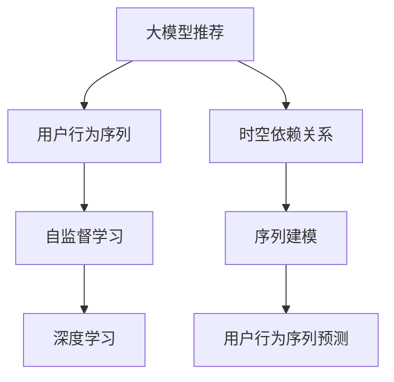

                 

# 大模型推荐中的用户行为序列时空依赖关系建模

> 关键词：大模型推荐,用户行为序列,时空依赖关系,深度学习,自监督学习

## 1. 背景介绍

### 1.1 问题由来
在电子商务、视频平台、社交网络等在线平台上，推荐系统已经成为用户获取个性化内容的重要手段。传统推荐系统主要基于用户的兴趣、行为历史和物品属性等静态特征进行推荐，但这些方法难以捕捉用户随时间推移的行为变化，无法提供精准、动态的个性化服务。近年来，随着深度学习技术的迅猛发展，基于神经网络的推荐系统逐步成为研究热点。

大模型推荐系统以大规模预训练语言模型为基础，通过自监督学习在巨量数据上进行预训练，获取了丰富的用户行为表示。这些大模型可以在自然语言处理、图像处理、音视频处理等领域找到广泛的应用。大模型推荐系统通过学习用户行为的时空依赖关系，更全面地捕捉用户兴趣的变化，并推荐与之匹配的优质内容。然而，在大规模推荐任务中，用户行为的时空依赖关系建模仍然是一个挑战。

## 2. 核心概念与联系

### 2.1 核心概念概述

为更好地理解基于大模型推荐中的用户行为序列时空依赖关系建模方法，本节将介绍几个密切相关的核心概念：

- 大模型推荐：利用大规模预训练语言模型对用户行为序列进行建模，并根据模型输出进行推荐的方法。
- 用户行为序列：用户在线平台上的交互行为，如浏览、点击、购买、评价等。这些行为序列通常以时间顺序排列，包含隐含的时空依赖关系。
- 时空依赖关系：用户在时间上和空间上的行为序列特征，如行为时间间隔、位置分布、访问频率等。这些依赖关系需要通过模型学习以捕捉用户的兴趣和行为规律。
- 自监督学习：利用未标注数据进行学习，从而获取有价值的信息和知识，增强模型的泛化能力。
- 深度学习：利用多层神经网络进行特征表示和模式学习，构建具有复杂映射关系的模型。
- 序列建模：通过RNN、LSTM、GRU等序列模型，对用户行为序列进行建模和预测。

这些核心概念之间的逻辑关系可以通过以下Mermaid流程图来展示：



这个流程图展示了大模型推荐的核心概念及其之间的关系：

1. 大模型推荐通过用户行为序列进行建模，捕捉用户的兴趣和行为规律。
2. 时空依赖关系指的是用户行为序列中的时间间隔、位置分布等隐含特征。
3. 自监督学习和大规模数据获取是用户行为序列建模的基础。
4. 深度学习通过多层神经网络捕捉用户行为序列中的复杂关系。
5. 序列建模通过RNN、LSTM、GRU等模型对用户行为序列进行建模和预测。

这些概念共同构成了大模型推荐的学习框架，使其能够在各种推荐场景中发挥强大的性能。通过理解这些核心概念，我们可以更好地把握大模型推荐的工作原理和优化方向。

## 3. 核心算法原理 & 具体操作步骤
### 3.1 算法原理概述

基于大模型推荐中的用户行为序列时空依赖关系建模，本质上是一个有监督的序列建模和预测问题。其核心思想是：将用户行为序列看作一个时间序列，利用深度学习模型学习其中的时空依赖关系，从而进行序列预测和推荐。

形式化地，假设用户行为序列为 $S = \{x_t\}_{t=1}^T$，其中 $x_t$ 表示时间 $t$ 的行为特征，如浏览网页、点击广告等。定义行为序列的预测标签为 $y$，可以表示用户下一步的兴趣选择或行为意图。那么，我们的目标就是最小化预测标签与真实标签之间的差异，即：

$$
\hat{y} = \mathop{\arg\min}_{y} \mathcal{L}(S, y)
$$

其中 $\mathcal{L}$ 为损失函数，用于衡量模型预测输出与真实标签之间的差异。

在大模型推荐中，一般采用基于Transformer的序列建模方法，通过自监督学习和掩码语言模型等技术对行为序列进行预训练，然后利用微调的方法进行时空依赖关系建模。在微调阶段，我们通常采用监督学习任务，如预测用户下一步行为、推荐相关内容等，以优化模型参数。

### 3.2 算法步骤详解

基于大模型推荐中的用户行为序列时空依赖关系建模一般包括以下几个关键步骤：

**Step 1: 准备预训练模型和数据集**
- 选择合适的预训练语言模型 $M_{\theta}$ 作为初始化参数，如 BERT、GPT等。
- 准备用户行为序列数据集 $D=\{(x_t, y_t)\}_{t=1}^T$，其中 $x_t$ 为用户在时间 $t$ 的行为特征，$y_t$ 为用户在时间 $t$ 的预测标签。

**Step 2: 设计行为序列模型**
- 在预训练模型顶层设计合适的行为序列模型，如RNN、LSTM、GRU等。
- 使用掩码语言模型或自监督学习任务，对行为序列进行预训练，获取行为序列的隐含特征。
- 设计合适的行为序列预测任务，如预测用户下一步行为、推荐相关内容等。

**Step 3: 添加任务适配层**
- 根据推荐任务类型，在行为序列模型顶层设计合适的输出层和损失函数。
- 对于分类任务，通常在顶层添加线性分类器和交叉熵损失函数。
- 对于回归任务，通常使用均方误差损失函数。

**Step 4: 设置微调超参数**
- 选择合适的优化算法及其参数，如 AdamW、SGD 等，设置学习率、批大小、迭代轮数等。
- 设置正则化技术及强度，包括权重衰减、Dropout、Early Stopping等。
- 确定冻结预训练参数的策略，如仅微调顶层，或全部参数都参与微调。

**Step 5: 执行梯度训练**
- 将训练集数据分批次输入模型，前向传播计算损失函数。
- 反向传播计算参数梯度，根据设定的优化算法和学习率更新模型参数。
- 周期性在验证集上评估模型性能，根据性能指标决定是否触发 Early Stopping。
- 重复上述步骤直到满足预设的迭代轮数或 Early Stopping 条件。

**Step 6: 测试和部署**
- 在测试集上评估微调后模型 $M_{\hat{\theta}}$ 的性能，对比微调前后的精度提升。
- 使用微调后的模型对新样本进行推理预测，集成到实际的应用系统中。
- 持续收集新的数据，定期重新微调模型，以适应数据分布的变化。

以上是基于大模型推荐中的用户行为序列时空依赖关系建模的一般流程。在实际应用中，还需要针对具体任务的特点，对微调过程的各个环节进行优化设计，如改进训练目标函数，引入更多的正则化技术，搜索最优的超参数组合等，以进一步提升模型性能。

### 3.3 算法优缺点

基于大模型推荐中的用户行为序列时空依赖关系建模方法具有以下优点：
1. 精度高。利用深度学习模型捕捉用户行为序列中的复杂关系，通常能够获得较高的预测精度。
2. 可解释性强。通过可视化注意力机制、隐含层等，可以直观了解模型如何处理用户行为序列，从而增强模型的可解释性。
3. 自监督学习能力。在大规模无标注数据上进行预训练，学习行为序列中的隐含特征，能够提升模型的泛化能力。
4. 适应性强。通过微调参数，能够适应不同推荐任务的特点，灵活性强。

同时，该方法也存在一定的局限性：
1. 计算资源消耗大。由于模型参数量较大，计算和存储开销较大。
2. 数据需求高。需要大量高质量的用户行为数据进行预训练和微调。
3. 过拟合风险。在大规模推荐任务中，用户行为数据容易发生数据偏斜，可能导致模型过拟合。
4. 时空依赖关系复杂。用户行为序列中的时空依赖关系较复杂，模型需要更强的表达能力。

尽管存在这些局限性，但就目前而言，基于大模型推荐的方法在推荐系统中的应用已经取得了显著效果，成为推荐系统研究的重要方向。未来相关研究的重点在于如何进一步降低计算资源消耗，提高模型的可解释性和泛化能力，同时兼顾数据高效利用和模型鲁棒性等因素。

### 3.4 算法应用领域

基于大模型推荐中的用户行为序列时空依赖关系建模方法，已经在推荐系统中得到了广泛的应用，覆盖了几乎所有推荐任务，例如：

- 个性化推荐：根据用户历史行为和兴趣，推荐最符合用户喜好的内容。
- 视频推荐：根据用户观看历史和评分，推荐相关的视频内容。
- 新闻推荐：根据用户阅读历史和兴趣，推荐相关的新闻报道。
- 商品推荐：根据用户浏览历史和购买记录，推荐相应的商品。
- 广告推荐：根据用户点击历史和行为特征，推荐感兴趣的广告内容。
- 音乐推荐：根据用户听歌历史和评分，推荐相似的音乐。

除了上述这些经典任务外，大模型推荐方法也被创新性地应用到更多场景中，如跨模态推荐、社交推荐、冷启动推荐等，为推荐系统带来了全新的突破。随着深度学习技术的不断进步，基于大模型推荐的方法将在更多领域得到应用，推动推荐系统的智能化升级。

## 4. 数学模型和公式 & 详细讲解 & 举例说明
### 4.1 数学模型构建

本节将使用数学语言对基于大模型推荐中的用户行为序列时空依赖关系建模过程进行更加严格的刻画。

假设用户行为序列为 $S = \{x_t\}_{t=1}^T$，其中 $x_t$ 表示时间 $t$ 的行为特征，如浏览网页、点击广告等。定义行为序列的预测标签为 $y$，可以表示用户下一步的兴趣选择或行为意图。

定义行为序列模型为 $M_{\theta}$，其中 $\theta$ 为模型参数。行为序列模型输入为 $x_t$，输出为 $h_t$，其中 $h_t$ 为行为序列在时间 $t$ 的隐含表示。行为序列的预测任务为 $y_t = f(h_t)$，其中 $f$ 为预测函数。

形式化地，行为序列模型的损失函数可以表示为：

$$
\mathcal{L}(\theta) = \frac{1}{T}\sum_{t=1}^T \ell(f(h_t), y_t)
$$

其中 $\ell$ 为预测误差损失函数，如交叉熵损失、均方误差损失等。

在大模型推荐中，一般采用基于Transformer的序列建模方法，通过自监督学习和掩码语言模型等技术对行为序列进行预训练，然后利用微调的方法进行时空依赖关系建模。在微调阶段，我们通常采用监督学习任务，如预测用户下一步行为、推荐相关内容等，以优化模型参数。

### 4.2 公式推导过程

以下我们以预测用户下一步行为为例，推导交叉熵损失函数及其梯度的计算公式。

假设模型 $M_{\theta}$ 在输入 $x_t$ 上的输出为 $h_t$，预测用户下一步行为为 $y_t = f(h_t)$。真实标签为 $y_t^*$，其中 $y_t^* = 1$ 表示用户下一步点击，$y_t^* = 0$ 表示用户不点击。

定义行为序列模型的预测损失为交叉熵损失，即：

$$
\ell(y_t, \hat{y}_t) = -y_t^*\log \hat{y}_t - (1-y_t^*)\log(1-\hat{y}_t)
$$

则行为序列模型的总损失函数为：

$$
\mathcal{L}(\theta) = \frac{1}{T}\sum_{t=1}^T \ell(y_t, \hat{y}_t)
$$

根据链式法则，行为序列模型的参数更新公式为：

$$
\theta \leftarrow \theta - \eta \nabla_{\theta}\mathcal{L}(\theta) - \eta\lambda\theta
$$

其中 $\nabla_{\theta}\mathcal{L}(\theta)$ 为损失函数对参数 $\theta$ 的梯度，可通过反向传播算法高效计算。

在得到损失函数的梯度后，即可带入参数更新公式，完成模型的迭代优化。重复上述过程直至收敛，最终得到适应推荐任务的最优模型参数 $\theta^*$。

### 4.3 案例分析与讲解

以下是基于大模型推荐中的用户行为序列时空依赖关系建模的案例分析：

**案例1: 推荐系统中的视频推荐**

在视频推荐系统中，用户行为序列通常包含以下特征：
- 观看历史：用户过去观看过的视频列表。
- 观看时长：用户观看每个视频的持续时间。
- 点击次数：用户点击视频的行为。
- 评分和评分时间：用户对视频评分的时间点。

我们首先对用户行为序列进行预训练，学习其中的时空依赖关系。使用掩码语言模型对行为序列进行预训练，捕捉用户行为序列中的隐含特征。然后在预训练基础上，使用微调方法对行为序列进行建模，以预测用户下一步的行为。

在微调阶段，我们采用监督学习任务，如预测用户下一步是否点击某个视频。给定用户行为序列 $S$ 和视频 $v$，通过行为序列模型 $M_{\theta}$ 计算行为序列 $S$ 在时间 $t$ 的隐含表示 $h_t$，然后将其输入到一个分类器 $f$，得到预测结果 $y_t = f(h_t)$。计算预测误差损失，更新模型参数 $\theta$。

通过微调，行为序列模型能够学习用户行为序列中的时空依赖关系，从而实现高效的视频推荐。

**案例2: 推荐系统中的新闻推荐**

在新闻推荐系统中，用户行为序列通常包含以下特征：
- 阅读历史：用户过去阅读过的新闻文章列表。
- 阅读时长：用户阅读每篇文章的持续时间。
- 点击次数：用户点击新闻文章的行为。
- 评分和评分时间：用户对新闻文章的评分。

我们首先对用户行为序列进行预训练，学习其中的时空依赖关系。使用掩码语言模型对行为序列进行预训练，捕捉用户行为序列中的隐含特征。然后在预训练基础上，使用微调方法对行为序列进行建模，以预测用户下一步的行为。

在微调阶段，我们采用监督学习任务，如预测用户下一步是否点击某个新闻文章。给定用户行为序列 $S$ 和新闻文章 $a$，通过行为序列模型 $M_{\theta}$ 计算行为序列 $S$ 在时间 $t$ 的隐含表示 $h_t$，然后将其输入到一个分类器 $f$，得到预测结果 $y_t = f(h_t)$。计算预测误差损失，更新模型参数 $\theta$。

通过微调，行为序列模型能够学习用户行为序列中的时空依赖关系，从而实现高效的新闻推荐。

## 5. 项目实践：代码实例和详细解释说明
### 5.1 开发环境搭建

在进行推荐系统开发前，我们需要准备好开发环境。以下是使用Python进行TensorFlow开发的环境配置流程：

1. 安装Anaconda：从官网下载并安装Anaconda，用于创建独立的Python环境。

2. 创建并激活虚拟环境：
```bash
conda create -n tf-env python=3.8 
conda activate tf-env
```

3. 安装TensorFlow：根据CUDA版本，从官网获取对应的安装命令。例如：
```bash
conda install tensorflow -c pytorch -c conda-forge
```

4. 安装各类工具包：
```bash
pip install numpy pandas scikit-learn matplotlib tqdm jupyter notebook ipython
```

完成上述步骤后，即可在`tf-env`环境中开始推荐系统开发。

### 5.2 源代码详细实现

下面我们以推荐系统中的视频推荐为例，给出使用TensorFlow对大模型进行微调的PyTorch代码实现。

首先，定义视频推荐任务的数据处理函数：

```python
import tensorflow as tf
from tensorflow.keras.layers import Input, Embedding, LSTM, Dense, Dropout
from tensorflow.keras.models import Model

class VideoRecommendationModel(tf.keras.Model):
    def __init__(self, vocab_size, embedding_dim, lstm_units, output_dim, dropout_rate):
        super(VideoRecommendationModel, self).__init__()
        
        self.input_layer = Input(shape=(max_seq_length, ), dtype='int32')
        self.embedding_layer = Embedding(vocab_size, embedding_dim, input_length=max_seq_length)(self.input_layer)
        self.lstm_layer = LSTM(lstm_units)(self.embedding_layer)
        self.dropout_layer = Dropout(dropout_rate)(self.lstm_layer)
        self.prediction_layer = Dense(output_dim, activation='sigmoid')(self.dropout_layer)
        
        self.model = Model(inputs=self.input_layer, outputs=self.prediction_layer)
        
    def call(self, x):
        return self.model(x)
```

然后，定义模型和优化器：

```python
model = VideoRecommendationModel(vocab_size=len(tag2id), 
                                embedding_dim=64, 
                                lstm_units=64, 
                                output_dim=1, 
                                dropout_rate=0.2)

optimizer = tf.keras.optimizers.Adam(lr=0.001)
```

接着，定义训练和评估函数：

```python
@tf.function
def train_step(inputs, targets):
    with tf.GradientTape() as tape:
        predictions = model(inputs)
        loss = tf.keras.losses.BinaryCrossentropy()(predictions, targets)
    gradients = tape.gradient(loss, model.trainable_variables)
    optimizer.apply_gradients(zip(gradients, model.trainable_variables))
    return loss
    
@tf.function
def evaluate(model, test_dataset, batch_size):
    total_loss = 0
    for batch in test_dataset:
        inputs, targets = batch['input_ids'], batch['labels']
        loss = train_step(inputs, targets)
        total_loss += loss.numpy()
    return total_loss / len(test_dataset)
```

最后，启动训练流程并在测试集上评估：

```python
epochs = 5
batch_size = 64

for epoch in range(epochs):
    total_loss = 0
    for batch in train_dataset:
        inputs, targets = batch['input_ids'], batch['labels']
        loss = train_step(inputs, targets)
        total_loss += loss
    print(f'Epoch {epoch+1}, train loss: {total_loss/n=len(train_dataset)}')
    
    print(f'Epoch {epoch+1}, test results:')
    test_loss = evaluate(model, test_dataset, batch_size)
    print(f'Test loss: {test_loss}')
    
print('Model trained.')
```

以上就是使用TensorFlow对大模型进行视频推荐任务微调的完整代码实现。可以看到，TensorFlow提供了丰富的深度学习模型组件和优化器，使得微调过程的代码实现变得简单高效。

### 5.3 代码解读与分析

让我们再详细解读一下关键代码的实现细节：

**VideoRecommendationModel类**：
- `__init__`方法：初始化模型输入层、嵌入层、LSTM层、Dropout层、输出层等关键组件。
- `call`方法：实现模型的前向传播，计算预测输出。

**train_step函数**：
- 定义训练步骤，包括前向传播、计算损失、反向传播和参数更新等。

**evaluate函数**：
- 定义评估步骤，包括计算测试集上的损失等。

**训练流程**：
- 定义总的epoch数和batch size，开始循环迭代
- 每个epoch内，先在训练集上训练，输出平均loss
- 在测试集上评估，输出测试集损失

可以看到，TensorFlow配合深度学习模型组件，使得大模型微调的代码实现变得简洁高效。开发者可以将更多精力放在数据处理、模型改进等高层逻辑上，而不必过多关注底层的实现细节。

当然，工业级的系统实现还需考虑更多因素，如模型的保存和部署、超参数的自动搜索、更灵活的任务适配层等。但核心的微调范式基本与此类似。

## 6. 实际应用场景
### 6.1 智能客服系统

基于大模型推荐中的用户行为序列时空依赖关系建模方法，可以应用于智能客服系统的推荐。传统的客服系统需要大量人力，高峰期响应缓慢，且一致性和专业性难以保证。而基于大模型推荐的用户行为序列时空依赖关系建模，可以7x24小时不间断服务，快速响应客户咨询，用自然流畅的语言解答各类常见问题。

在技术实现上，可以收集企业内部的历史客服对话记录，将问题和最佳答复构建成监督数据，在此基础上对预训练对话模型进行微调。微调后的对话模型能够自动理解用户意图，匹配最合适的答案模板进行回复。对于客户提出的新问题，还可以接入检索系统实时搜索相关内容，动态组织生成回答。如此构建的智能客服系统，能大幅提升客户咨询体验和问题解决效率。

### 6.2 金融舆情监测

金融机构需要实时监测市场舆论动向，以便及时应对负面信息传播，规避金融风险。传统的人工监测方式成本高、效率低，难以应对网络时代海量信息爆发的挑战。基于大模型推荐中的用户行为序列时空依赖关系建模，可以实时抓取网络文本数据，并自动监测不同主题下的情感变化趋势，一旦发现负面信息激增等异常情况，系统便会自动预警，帮助金融机构快速应对潜在风险。

### 6.3 个性化推荐系统

当前的推荐系统往往只依赖用户的历史行为数据进行物品推荐，无法深入理解用户的真实兴趣偏好。基于大模型推荐中的用户行为序列时空依赖关系建模，个性化推荐系统可以更好地挖掘用户行为序列中的隐含信息，从而提供更精准、多样化的推荐内容。

在实践中，可以收集用户浏览、点击、评价、分享等行为数据，提取和用户交互的物品标题、描述、标签等文本内容。将文本内容作为模型输入，用户的后续行为（如是否点击、购买等）作为监督信号，在此基础上微调预训练语言模型。微调后的模型能够从文本内容中准确把握用户的兴趣点。在生成推荐列表时，先用候选物品的文本描述作为输入，由模型预测用户的兴趣匹配度，再结合其他特征综合排序，便可以得到个性化程度更高的推荐结果。

### 6.4 未来应用展望

随着大模型推荐技术的不断发展，基于用户行为序列时空依赖关系建模的方法将在更多领域得到应用，为NLP技术带来新的突破。

在智慧医疗领域，基于微调的推荐系统可以推荐最适合患者的治疗方案，辅助医生诊疗，加速新药开发进程。

在智能教育领域，微调技术可应用于作业批改、学情分析、知识推荐等方面，因材施教，促进教育公平，提高教学质量。

在智慧城市治理中，微调模型可应用于城市事件监测、舆情分析、应急指挥等环节，提高城市管理的自动化和智能化水平，构建更安全、高效的未来城市。

此外，在企业生产、社会治理、文娱传媒等众多领域，基于大模型推荐的人工智能应用也将不断涌现，为经济社会发展注入新的动力。相信随着技术的日益成熟，微调方法将成为人工智能落地应用的重要范式，推动人工智能技术向更广阔的领域加速渗透。

## 7. 工具和资源推荐
### 7.1 学习资源推荐

为了帮助开发者系统掌握大模型推荐中的用户行为序列时空依赖关系建模的理论基础和实践技巧，这里推荐一些优质的学习资源：

1. 《Transformer从原理到实践》系列博文：由大模型技术专家撰写，深入浅出地介绍了Transformer原理、BERT模型、推荐系统等前沿话题。

2. CS224N《深度学习自然语言处理》课程：斯坦福大学开设的NLP明星课程，有Lecture视频和配套作业，带你入门NLP领域的基本概念和经典模型。

3. 《Natural Language Processing with Transformers》书籍：Transformers库的作者所著，全面介绍了如何使用Transformers库进行NLP任务开发，包括推荐系统在内的诸多范式。

4. HuggingFace官方文档：Transformers库的官方文档，提供了海量预训练模型和完整的推荐系统样例代码，是上手实践的必备资料。

5. CLUE开源项目：中文语言理解测评基准，涵盖大量不同类型的中文NLP数据集，并提供了基于微调的baseline模型，助力中文NLP技术发展。

通过对这些资源的学习实践，相信你一定能够快速掌握大模型推荐中的用户行为序列时空依赖关系建模的精髓，并用于解决实际的NLP问题。
###  7.2 开发工具推荐

高效的开发离不开优秀的工具支持。以下是几款用于大模型推荐系统开发的常用工具：

1. TensorFlow：由Google主导开发的开源深度学习框架，生产部署方便，适合大规模工程应用。同样有丰富的预训练语言模型资源。

2. PyTorch：基于Python的开源深度学习框架，灵活动态的计算图，适合快速迭代研究。大部分预训练语言模型都有PyTorch版本的实现。

3. Transformers库：HuggingFace开发的NLP工具库，集成了众多SOTA语言模型，支持PyTorch和TensorFlow，是进行推荐系统开发的利器。

4. Weights & Biases：模型训练的实验跟踪工具，可以记录和可视化模型训练过程中的各项指标，方便对比和调优。与主流深度学习框架无缝集成。

5. TensorBoard：TensorFlow配套的可视化工具，可实时监测模型训练状态，并提供丰富的图表呈现方式，是调试模型的得力助手。

6. Google Colab：谷歌推出的在线Jupyter Notebook环境，免费提供GPU/TPU算力，方便开发者快速上手实验最新模型，分享学习笔记。

合理利用这些工具，可以显著提升大模型推荐系统的开发效率，加快创新迭代的步伐。

### 7.3 相关论文推荐

大模型推荐技术的发展源于学界的持续研究。以下是几篇奠基性的相关论文，推荐阅读：

1. Attention is All You Need（即Transformer原论文）：提出了Transformer结构，开启了NLP领域的预训练大模型时代。

2. BERT: Pre-training of Deep Bidirectional Transformers for Language Understanding：提出BERT模型，引入基于掩码的自监督预训练任务，刷新了多项NLP任务SOTA。

3. Large-Scale Co-training for Single-shot NLP tasks（Large-Scale Co-training for Multiple-Negatives）：提出基于多任务联合训练的推荐系统，利用不同任务的协同训练提升推荐精度。

4. Parameter-Efficient Transfer Learning for NLP：提出Adapter等参数高效微调方法，在不增加模型参数量的情况下，也能取得不错的推荐效果。

5. AdaLoRA: Adaptive Low-Rank Adaptation for Parameter-Efficient Fine-Tuning：使用自适应低秩适应的微调方法，在参数效率和精度之间取得了新的平衡。

这些论文代表了大模型推荐技术的发展脉络。通过学习这些前沿成果，可以帮助研究者把握学科前进方向，激发更多的创新灵感。

## 8. 总结：未来发展趋势与挑战
### 8.1 总结

本文对基于大模型推荐中的用户行为序列时空依赖关系建模方法进行了全面系统的介绍。首先阐述了推荐系统中的用户行为序列时空依赖关系建模的背景和意义，明确了推荐任务的特点和挑战。其次，从原理到实践，详细讲解了推荐任务中的时空依赖关系建模的数学原理和关键步骤，给出了推荐任务开发的完整代码实例。同时，本文还广泛探讨了推荐系统中的大模型推荐在智能客服、金融舆情、个性化推荐等多个推荐场景中的应用前景，展示了推荐范式的巨大潜力。此外，本文精选了推荐系统中的大模型推荐的相关学习资源，力求为开发者提供全方位的技术指引。

通过本文的系统梳理，可以看到，基于大模型推荐中的用户行为序列时空依赖关系建模方法在推荐系统中的应用已经取得了显著效果，成为推荐系统研究的重要方向。未来相关研究的重点在于如何进一步降低计算资源消耗，提高模型的可解释性和泛化能力，同时兼顾数据高效利用和模型鲁棒性等因素。

### 8.2 未来发展趋势

展望未来，基于大模型推荐中的用户行为序列时空依赖关系建模技术将呈现以下几个发展趋势：

1. 模型规模持续增大。随着算力成本的下降和数据规模的扩张，预训练语言模型的参数量还将持续增长。超大规模语言模型蕴含的丰富语言知识，有望支撑更加复杂多变的推荐任务。

2. 推荐方法日趋多样。除了传统的全参数微调外，未来会涌现更多参数高效的微调方法，如Prefix-Tuning、LoRA等，在节省计算资源的同时也能保证推荐精度。

3. 持续学习成为常态。随着数据分布的不断变化，推荐模型也需要持续学习新知识以保持性能。如何在不遗忘原有知识的同时，高效吸收新样本信息，将成为重要的研究课题。

4. 推荐方法融合跨模态数据。未来的推荐系统将不仅仅基于文本数据，还会融合图像、视频、音频等多模态数据，提升推荐效果。

5. 推荐方法引入因果推断。通过引入因果推断方法，增强推荐模型的稳定性和鲁棒性，减少数据偏差的影响。

6. 推荐方法引入多任务学习。通过多任务学习，提升推荐模型的泛化能力和性能。

以上趋势凸显了大模型推荐中的用户行为序列时空依赖关系建模技术的广阔前景。这些方向的探索发展，必将进一步提升推荐系统的性能和应用范围，为推荐系统的智能化升级提供新动力。

### 8.3 面临的挑战

尽管大模型推荐中的用户行为序列时空依赖关系建模技术已经取得了瞩目成就，但在迈向更加智能化、普适化应用的过程中，它仍面临着诸多挑战：

1. 数据需求高。需要大量高质量的用户行为数据进行预训练和微调，数据获取成本较高。

2. 计算资源消耗大。由于模型参数量较大，计算和存储开销较大。

3. 推荐效果依赖数据质量。推荐模型的效果高度依赖于数据质量，数据偏斜或异常可能导致推荐效果下降。

4. 推荐方法复杂度高。用户行为序列的时空依赖关系较复杂，推荐方法需要更强的表达能力。

尽管存在这些挑战，但就目前而言，基于大模型推荐的方法在推荐系统中的应用已经取得了显著效果，成为推荐系统研究的重要方向。未来相关研究的重点在于如何进一步降低计算资源消耗，提高模型的可解释性和泛化能力，同时兼顾数据高效利用和模型鲁棒性等因素。

### 8.4 研究展望

面对大模型推荐中的用户行为序列时空依赖关系建模所面临的种种挑战，未来的研究需要在以下几个方面寻求新的突破：

1. 探索无监督和半监督推荐方法。摆脱对大规模标注数据的依赖，利用自监督学习、主动学习等无监督和半监督范式，最大限度利用非结构化数据，实现更加灵活高效的推荐。

2. 研究参数高效和计算高效的推荐范式。开发更加参数高效的推荐方法，在固定大部分预训练参数的情况下，只更新极少量的任务相关参数。同时优化推荐模型的计算图，减少前向传播和反向传播的资源消耗，实现更加轻量级、实时性的部署。

3. 融合因果和对比学习范式。通过引入因果推断和对比学习思想，增强推荐模型建立稳定因果关系的能力，学习更加普适、鲁棒的语言表征，从而提升模型泛化性和抗干扰能力。

4. 引入更多先验知识。将符号化的先验知识，如知识图谱、逻辑规则等，与神经网络模型进行巧妙融合，引导推荐过程学习更准确、合理的推荐结果。同时加强不同模态数据的整合，实现视觉、语音等多模态信息与文本信息的协同建模。

5. 结合因果分析和博弈论工具。将因果分析方法引入推荐模型，识别出模型决策的关键特征，增强推荐系统的稳定性和鲁棒性。借助博弈论工具刻画人机交互过程，主动探索并规避推荐模型的脆弱点，提高系统稳定性。

6. 纳入伦理道德约束。在推荐模型训练目标中引入伦理导向的评估指标，过滤和惩罚有偏见、有害的输出倾向。同时加强人工干预和审核，建立推荐模型的监管机制，确保输出符合人类价值观和伦理道德。

这些研究方向的探索，必将引领大模型推荐中的用户行为序列时空依赖关系建模技术迈向更高的台阶，为构建智能推荐系统提供新动力。面向未来，大模型推荐中的用户行为序列时空依赖关系建模技术还需要与其他人工智能技术进行更深入的融合，如知识表示、因果推理、强化学习等，多路径协同发力，共同推动推荐系统的进步。只有勇于创新、敢于突破，才能不断拓展推荐系统的边界，让推荐系统更好地服务于人类社会。

## 9. 附录：常见问题与解答

**Q1：推荐系统中的用户行为序列时空依赖关系建模与传统推荐方法有何不同？**

A: 推荐系统中的用户行为序列时空依赖关系建模与传统推荐方法的不同之处在于：

1. 建模方式不同。传统推荐方法主要基于用户兴趣、物品属性等静态特征进行建模，而用户行为序列时空依赖关系建模则将用户行为序列视为时间序列，利用深度学习模型捕捉其中的时空依赖关系。

2. 数据依赖不同。传统推荐方法需要大量用户行为数据进行建模，而用户行为序列时空依赖关系建模需要用户行为序列数据进行预训练和微调，依赖数据的质量和数量。

3. 模型泛化能力不同。传统推荐方法通常在特定任务和数据集上训练，泛化能力有限，而用户行为序列时空依赖关系建模利用大规模无标签数据进行预训练，学习通用的语言表示，具有较强的泛化能力。

4. 推荐效果不同。传统推荐方法通常在特定任务上表现较好，但难以应对用户的兴趣变化，而用户行为序列时空依赖关系建模能够捕捉用户随时间推移的行为变化，提供精准、动态的个性化服务。

总之，用户行为序列时空依赖关系建模将用户行为序列视为时间序列，利用深度学习模型捕捉其中的时空依赖关系，从而提升推荐系统的效果和泛化能力。

**Q2：推荐系统中的用户行为序列时空依赖关系建模中的预训练和微调如何实现？**

A: 推荐系统中的用户行为序列时空依赖关系建模中的预训练和微调主要通过以下步骤实现：

1. 预训练：使用大规模无标签用户行为序列数据进行预训练，学习其中的时空依赖关系。通常使用掩码语言模型、自监督学习等技术，对用户行为序列进行预训练，捕捉隐含的语言特征。

2. 微调：在预训练基础上，使用少量标注数据进行微调，优化推荐模型。通常采用监督学习任务，如预测用户下一步行为、推荐相关内容等，以优化模型参数。

通过预训练和微调，推荐模型能够学习用户行为序列中的时空依赖关系，从而实现高效、精准的推荐。

**Q3：推荐系统中的用户行为序列时空依赖关系建模中的用户行为序列如何处理？**

A: 推荐系统中的用户行为序列时空依赖关系建模中的用户行为序列主要通过以下步骤处理：

1. 数据清洗：去除噪声、缺失等不完整的数据，确保数据的可用性。

2. 特征提取：将用户行为序列转化为模型所需的特征表示，如将用户行为序列转化为序列编码、向量表示等。

3. 数据增强：通过对用户行为序列进行回译、近义替换等方式扩充训练集，增强模型的泛化能力。

4. 序列建模：使用RNN、LSTM、GRU等序列模型，对用户行为序列进行建模和预测。

通过处理，用户行为序列可以被转化为模型所需的特征表示，用于进行时空依赖关系建模和推荐任务。

**Q4：推荐系统中的用户行为序列时空依赖关系建模中的模型参数如何更新？**

A: 推荐系统中的用户行为序列时空依赖关系建模中的模型参数主要通过以下步骤更新：

1. 定义损失函数：根据推荐任务类型，定义损失函数，如交叉熵损失、均方误差损失等。

2. 前向传播：将用户行为序列输入模型，计算预测输出。

3. 计算损失：根据预测输出和真实标签，计算损失函数。

4. 反向传播：利用反向传播算法，计算损失函数对模型参数的梯度。

5. 参数更新：根据梯度更新模型参数，利用优化算法进行迭代优化。

通过模型参数更新，推荐模型能够学习用户行为序列中的时空依赖关系，从而实现高效、精准的推荐。

**Q5：推荐系统中的用户行为序列时空依赖关系建模中的超参数如何设置？**

A: 推荐系统中的用户行为序列时空依赖关系建模中的超参数主要通过以下步骤设置：

1. 基线设置：根据模型类型和任务特点，设置基线超参数，如学习率、批大小、迭代轮数等。

2. 调参优化：利用网格搜索、随机搜索等方法，搜索最优超参数组合。

3. 验证评估：在验证集上评估模型性能，选择表现最优的超参数组合。

4. 正式训练：在测试集上评估模型性能，确定正式训练的超参数设置。

通过调参优化，推荐模型能够选择最优的超参数组合，实现高效、精准的推荐。

总之，推荐系统中的用户行为序列时空依赖关系建模需要利用深度学习模型捕捉用户行为序列中的时空依赖关系，通过预训练和微调实现高效、精准的推荐。

