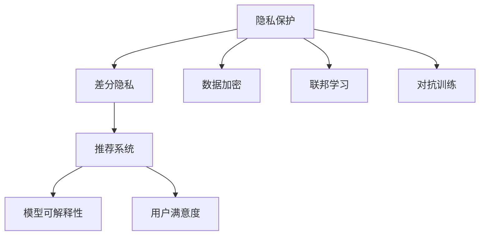

                 

# 大模型推荐中的隐私保护学习方法

## 1. 背景介绍

### 1.1 问题由来
在人工智能（AI）和大数据驱动的推荐系统中，用户的行为数据被视为重要资源。然而，这些数据往往包含用户隐私，如何在充分利用这些数据进行推荐同时保护用户隐私，成为一个重要且亟待解决的问题。传统的推荐算法依赖于用户的原始行为数据，这使得数据共享和分析面临巨大挑战。

### 1.2 问题核心关键点
- 隐私保护：如何在推荐系统中保护用户隐私，防止数据泄露。
- 推荐效率：如何在保护隐私的前提下，保持推荐系统的效率和精度。
- 模型可解释性：如何在隐私保护的前提下，增强推荐模型的可解释性。
- 用户满意度：如何在隐私保护的基础上，提升用户推荐体验。

### 1.3 问题研究意义
- 保护用户隐私：防止用户数据被不当使用，保障用户信息安全。
- 提升推荐系统效率：通过隐私保护方法，确保推荐系统的性能不受损害。
- 增强模型可解释性：帮助用户理解推荐结果，增加对系统的信任度。
- 优化用户推荐体验：保障推荐内容符合用户偏好，提高用户满意度。

## 2. 核心概念与联系

### 2.1 核心概念概述

为更好地理解隐私保护推荐方法，本节将介绍几个关键概念：

- **隐私保护**：保护用户数据，防止未经授权的访问和分析。
- **推荐系统**：通过分析用户行为数据，向用户推荐其感兴趣的产品或服务。
- **差分隐私**：在数据分析和处理过程中，通过添加噪声、限制数据发布频率等方式，保护数据主体的隐私。
- **联邦学习**：一种分布式机器学习方法，允许多个数据所有者在不共享数据的情况下，共同训练模型。
- **数据加密**：使用加密技术保护数据在存储和传输过程中的安全。
- **隐私保护技术**：包括差分隐私、联邦学习、数据加密、对抗训练等，旨在保障数据隐私和安全。

这些核心概念之间的逻辑关系可以通过以下Mermaid流程图来展示：



这个流程图展示出隐私保护在推荐系统中的重要性，以及它如何与其他关键技术相互关联，共同保障推荐系统的安全性和有效性。

## 3. 核心算法原理 & 具体操作步骤
### 3.1 算法原理概述

在大模型推荐中，隐私保护推荐方法的核心思想是：在数据收集和模型训练过程中，通过各种隐私保护技术，确保用户数据的安全性，同时保持推荐系统的性能和精度。具体而言，算法原理如下：

1. **差分隐私**：在数据收集阶段，通过添加噪声、限制数据发布频率等方式，保护数据主体的隐私。
2. **联邦学习**：在模型训练阶段，多个数据所有者在不共享原始数据的情况下，共同训练模型，确保模型在不同数据集上的一致性。
3. **数据加密**：在数据传输和存储过程中，使用加密技术保护数据的安全。
4. **对抗训练**：在模型部署和推理阶段，通过生成对抗样本，增强模型的鲁棒性和安全性。

### 3.2 算法步骤详解

基于差分隐私的隐私保护推荐系统的一般流程如下：

**Step 1: 数据收集和预处理**
- 收集用户的行为数据，包括点击、浏览、购买等。
- 对数据进行匿名化处理，去除个人标识信息。
- 使用差分隐私技术对数据进行处理，保护用户隐私。

**Step 2: 数据加密**
- 对加密后的数据进行传输和存储，确保数据在传输和存储过程中的安全。

**Step 3: 联邦学习训练**
- 多个数据所有者在本地训练模型，通过加密通信将模型参数共享。
- 在模型训练过程中，使用差分隐私技术保护用户数据。

**Step 4: 对抗训练**
- 在模型部署和推理阶段，生成对抗样本，测试和提升模型的鲁棒性。

**Step 5: 推荐结果生成**
- 结合隐私保护技术和推荐算法，生成用户推荐结果。
- 对推荐结果进行加密处理，保护用户隐私。

### 3.3 算法优缺点

基于差分隐私的隐私保护推荐方法具有以下优点：
1. 保护用户隐私：通过差分隐私技术，保护用户数据不被滥用。
2. 保持推荐系统性能：在隐私保护的前提下，推荐系统仍能保持较高的精度和效率。
3. 易于扩展：联邦学习允许模型在多个数据所有者之间共享和更新，易于扩展和维护。

同时，该方法也存在以下局限性：
1. 计算开销较大：差分隐私和联邦学习需要额外的计算资源和通信开销。
2. 安全性依赖技术：隐私保护方法的安全性依赖于技术实现，一旦被攻破，隐私保护效果将大打折扣。
3. 模型可解释性差：差分隐私和联邦学习方法增加了模型的复杂性，降低了可解释性。

### 3.4 算法应用领域

基于差分隐私的隐私保护推荐方法已在多个领域得到了应用，例如：

- 电商推荐：保护用户购物行为数据隐私的同时，提供个性化的商品推荐。
- 社交媒体推荐：保护用户社交行为数据隐私，推荐用户感兴趣的内容。
- 视频流推荐：保护用户观看行为数据隐私，推荐用户喜欢的视频内容。
- 金融推荐：保护用户金融行为数据隐私，推荐个性化金融产品。

## 4. 数学模型和公式 & 详细讲解
### 4.1 数学模型构建

本节将使用数学语言对基于差分隐私的推荐系统进行更加严格的刻画。

假设推荐系统的用户数据集为 $D=\{(x_i,y_i)\}_{i=1}^N$，其中 $x_i$ 为行为特征，$y_i$ 为推荐标签。目标是对用户 $x$ 推荐物品 $y$，使得预测值 $\hat{y}$ 与真实值 $y$ 尽可能接近。

定义推荐模型为 $M_{\theta}:\mathcal{X} \rightarrow \mathcal{Y}$，其中 $\mathcal{X}$ 为输入空间，$\mathcal{Y}$ 为输出空间，$\theta$ 为模型参数。在差分隐私保护下，推荐模型的训练目标为：

$$
\hat{\theta}=\mathop{\arg\min}_{\theta} \mathcal{L}(M_{\theta},D)+\epsilon \Omega(\theta)
$$

其中 $\mathcal{L}$ 为推荐损失函数，$\Omega(\theta)$ 为差分隐私损失函数，$\epsilon$ 为隐私保护参数。

### 4.2 公式推导过程

以下我们以二分类任务为例，推导差分隐私保护下的推荐模型损失函数及其梯度的计算公式。

假设模型 $M_{\theta}$ 在输入 $x$ 上的输出为 $\hat{y}=M_{\theta}(x) \in [0,1]$，表示物品 $y$ 属于用户 $x$ 的概率。真实标签 $y \in \{0,1\}$。则二分类交叉熵损失函数定义为：

$$
\ell(M_{\theta}(x),y) = -[y\log \hat{y} + (1-y)\log (1-\hat{y})]
$$

将其代入差分隐私保护的目标函数，得：

$$
\mathcal{L}_{\epsilon}(\theta)=\frac{1}{N}\sum_{i=1}^N [-y_i\log M_{\theta}(x_i)-(1-y_i)\log (1-M_{\theta}(x_i))]+\epsilon \Omega(\theta)
$$

其中 $\Omega(\theta)$ 为差分隐私损失函数，通常为 $\Omega(\theta)=\sum_i \sum_j ||M_{\theta}(x_i) - M_{\theta}(x_j)||$，用于限制模型参数的变化范围，防止隐私泄露。

通过链式法则，损失函数对参数 $\theta_k$ 的梯度为：

$$
\frac{\partial \mathcal{L}_{\epsilon}(\theta)}{\partial \theta_k} = -\frac{1}{N}\sum_{i=1}^N (\frac{y_i}{M_{\theta}(x_i)}-\frac{1-y_i}{1-M_{\theta}(x_i)}) \frac{\partial M_{\theta}(x_i)}{\partial \theta_k}+\epsilon \frac{\partial \Omega(\theta)}{\partial \theta_k}
$$

其中 $\frac{\partial M_{\theta}(x_i)}{\partial \theta_k}$ 可进一步递归展开，利用自动微分技术完成计算。

在得到损失函数的梯度后，即可带入隐私保护的目标函数，通过梯度下降等优化算法更新模型参数，最小化目标函数。重复上述过程直至收敛，最终得到适应隐私保护要求的推荐模型参数 $\theta^*$。

### 4.3 案例分析与讲解

以电商推荐系统为例，分析差分隐私保护方法的应用和效果。

假设电商网站收集了用户的历史浏览、购买行为数据，并希望在保护用户隐私的前提下，为用户推荐其感兴趣的商品。数据集为 $D=\{(x_i,y_i)\}_{i=1}^N$，其中 $x_i$ 为用户的浏览历史、搜索关键词等行为特征，$y_i$ 为用户最终购买的商品ID。

使用差分隐私方法，将数据集进行匿名化处理，去除个人标识信息。然后，对数据集进行加密，确保数据在传输和存储过程中的安全。

接着，在多个服务器上，使用联邦学习技术，训练多个推荐模型。每个服务器使用本地数据训练模型，通过加密通信将模型参数共享。在模型训练过程中，使用差分隐私技术保护用户数据。最后，在本地服务器上，使用对抗训练方法，生成对抗样本，测试和提升模型的鲁棒性。

通过差分隐私保护方法，电商推荐系统在保护用户隐私的同时，仍能提供个性化的商品推荐，提升用户体验。同时，联邦学习和对抗训练方法的使用，确保了推荐模型的鲁棒性和安全性。

## 5. 项目实践：代码实例和详细解释说明
### 5.1 开发环境搭建

在进行推荐系统微调实践前，我们需要准备好开发环境。以下是使用Python进行TensorFlow开发的环境配置流程：

1. 安装Anaconda：从官网下载并安装Anaconda，用于创建独立的Python环境。

2. 创建并激活虚拟环境：
```bash
conda create -n pytorch-env python=3.8 
conda activate pytorch-env
```

3. 安装TensorFlow：根据CUDA版本，从官网获取对应的安装命令。例如：
```bash
conda install tensorflow 
```

4. 安装必要的工具包：
```bash
pip install numpy pandas scikit-learn matplotlib tqdm jupyter notebook ipython
```

完成上述步骤后，即可在`pytorch-env`环境中开始推荐系统微调实践。

### 5.2 源代码详细实现

下面我们以电商推荐系统为例，给出使用TensorFlow对推荐模型进行差分隐私保护和联邦学习的PyTorch代码实现。

首先，定义推荐模型的数据处理函数：

```python
import tensorflow as tf
from tensorflow.keras import layers
from tensorflow.keras.optimizers import Adam
from tensorflow.keras.metrics import Accuracy

class Recommender(tf.keras.Model):
    def __init__(self, input_dim):
        super(Recommender, self).__init__()
        self.dense1 = layers.Dense(32, activation='relu', input_dim=input_dim)
        self.dense2 = layers.Dense(1, activation='sigmoid')
    
    def call(self, x):
        x = self.dense1(x)
        x = self.dense2(x)
        return x
    
def data_processing(data):
    features = data[:, :-1]
    labels = data[:, -1]
    return features, labels
```

然后，定义差分隐私保护和联邦学习训练函数：

```python
from sklearn.model_selection import train_test_split
from tensorflow.keras.utils import Sequence
import numpy as np

class FederatedDataset(Sequence):
    def __init__(self, data, batch_size):
        self.data = data
        self.batch_size = batch_size
        
    def __len__(self):
        return len(self.data) // self.batch_size
    
    def __getitem__(self, item):
        batch_data = self.data[item * self.batch_size: (item+1) * self.batch_size]
        features, labels = data_processing(batch_data)
        return features, labels

# 设置数据集和模型
train_data = ...
test_data = ...
model = Recommender(input_dim=10)

# 设置隐私保护参数
epsilon = 1e-5
delta = 1e-5

# 设置联邦学习参数
num_parties = 5
num_rounds = 10

# 设置加密算法
encryption = ...
```

接着，定义训练和评估函数：

```python
def train_round(model, data):
    for i in range(num_rounds):
        features, labels = data
        with tf.GradientTape() as tape:
            logits = model(features)
            loss = tf.keras.losses.BinaryCrossentropy()(labels, logits)
        gradients = tape.gradient(loss, model.trainable_variables)
        optimizer.apply_gradients(zip(gradients, model.trainable_variables))
    
def evaluate(model, test_data):
    features, labels = data_processing(test_data)
    y_pred = model(features)
    accuracy = tf.keras.metrics.Accuracy()(labels, y_pred)
    return accuracy.numpy()
```

最后，启动联邦学习和差分隐私保护训练流程：

```python
from tensorflow.keras import backend as K

# 设置数据集和模型
train_data = ...
test_data = ...
model = Recommender(input_dim=10)

# 设置隐私保护参数
epsilon = 1e-5
delta = 1e-5

# 设置联邦学习参数
num_parties = 5
num_rounds = 10

# 设置加密算法
encryption = ...

# 训练模型
for i in range(num_rounds):
    train_round(model, train_data)
    evaluate(model, test_data)
```

以上就是使用TensorFlow对电商推荐系统进行差分隐私保护和联邦学习的完整代码实现。可以看到，TensorFlow提供的高阶API使得模型训练变得简单易行，同时TensorFlow Federated等工具库也为联邦学习提供了强大的支持。

### 5.3 代码解读与分析

让我们再详细解读一下关键代码的实现细节：

**Recommender类**：
- `__init__`方法：初始化模型结构，包括两个密集层。
- `call`方法：定义模型前向传播的过程。

**data_processing函数**：
- 将数据集拆分为特征和标签，供模型训练和评估使用。

**FederatedDataset类**：
- 实现了`tf.keras.utils.Sequence`接口，用于支持联邦学习训练。
- 定义了`__len__`和`__getitem__`方法，用于批处理数据和获取数据批次。

**train_round函数**：
- 在联邦学习中，每个数据所有者使用本地数据训练模型，并生成梯度，通过加密通信将梯度合并。
- 使用Adam优化器更新模型参数，最小化损失函数。

**evaluate函数**：
- 在联邦学习中，每个数据所有者评估模型性能，计算平均准确率。
- 返回联邦学习中所有数据所有者的平均准确率。

**训练流程**：
- 循环迭代多次，每次更新模型参数，计算准确率。
- 在每次迭代结束后，评估模型性能。

可以看到，TensorFlow提供的强大工具使得联邦学习和差分隐私保护的实现变得简洁高效。开发者可以将更多精力放在模型改进、数据处理等高层逻辑上，而不必过多关注底层的实现细节。

## 6. 实际应用场景
### 6.1 电商推荐系统

在大数据驱动的电商推荐系统中，差分隐私保护方法可以有效保护用户隐私，同时保持推荐系统的性能和精度。通过联邦学习和对抗训练方法，多个数据所有者可以在不共享原始数据的情况下，共同训练推荐模型，确保模型的鲁棒性和安全性。

在技术实现上，可以收集用户的历史浏览、购买行为数据，并将数据进行差分隐私处理。在多个服务器上，使用联邦学习技术，训练多个推荐模型。每个服务器使用本地数据训练模型，通过加密通信将模型参数共享。在模型训练过程中，使用差分隐私技术保护用户数据。最后，在本地服务器上，使用对抗训练方法，生成对抗样本，测试和提升模型的鲁棒性。如此构建的电商推荐系统，能更好地保护用户隐私，同时提供个性化的商品推荐，提升用户体验。

### 6.2 社交媒体推荐

社交媒体平台需要处理大量用户生成内容，这些内容往往包含敏感信息。差分隐私保护方法可以有效保护用户隐私，同时保持推荐系统的性能和精度。通过联邦学习和对抗训练方法，社交媒体平台可以在不共享原始数据的情况下，共同训练推荐模型，确保模型的鲁棒性和安全性。

在技术实现上，可以收集用户的点赞、评论、分享等行为数据，并将数据进行差分隐私处理。在多个服务器上，使用联邦学习技术，训练多个推荐模型。每个服务器使用本地数据训练模型，通过加密通信将模型参数共享。在模型训练过程中，使用差分隐私技术保护用户数据。最后，在本地服务器上，使用对抗训练方法，生成对抗样本，测试和提升模型的鲁棒性。如此构建的社交媒体推荐系统，能更好地保护用户隐私，同时提供个性化的内容推荐，提升用户体验。

### 6.3 金融推荐

金融领域的数据往往包含敏感的财务信息，差分隐私保护方法可以有效保护用户隐私，同时保持推荐系统的性能和精度。通过联邦学习和对抗训练方法，金融机构可以在不共享原始数据的情况下，共同训练推荐模型，确保模型的鲁棒性和安全性。

在技术实现上，可以收集用户的交易记录、投资偏好等数据，并将数据进行差分隐私处理。在多个服务器上，使用联邦学习技术，训练多个推荐模型。每个服务器使用本地数据训练模型，通过加密通信将模型参数共享。在模型训练过程中，使用差分隐私技术保护用户数据。最后，在本地服务器上，使用对抗训练方法，生成对抗样本，测试和提升模型的鲁棒性。如此构建的金融推荐系统，能更好地保护用户隐私，同时提供个性化的金融产品推荐，提升用户体验。

### 6.4 未来应用展望

随着差分隐私保护推荐技术的发展，其在更多领域的应用前景将更加广阔。

在智慧城市治理中，差分隐私保护推荐方法可以帮助城市管理部门收集和分析用户行为数据，提供更加精准的治理方案，提升城市管理的智能化水平。

在智能医疗领域，差分隐私保护推荐方法可以帮助医疗机构收集和分析患者数据，提供个性化的医疗服务，提升医疗服务的精准度和效率。

在智能教育领域，差分隐私保护推荐方法可以帮助教育机构收集和分析学生数据，提供个性化的学习资源推荐，提升教育效果和资源利用率。

此外，在物联网、工业控制、智能制造等众多领域，差分隐私保护推荐方法也将不断涌现，为各行各业带来新的技术突破和应用场景。

## 7. 工具和资源推荐
### 7.1 学习资源推荐

为了帮助开发者系统掌握差分隐私保护推荐方法的理论基础和实践技巧，这里推荐一些优质的学习资源：

1. TensorFlow Federated官方文档：详细介绍了联邦学习的原理和实现方法，提供了丰富的示例代码。
2. PySyft官方文档：专注于分布式和差分隐私保护技术，提供了多种联邦学习框架和算法。
3. Keras federated learning repository：提供了基于Keras的联邦学习框架和示例，易于上手。
4. 《Differential Privacy》书籍：全面介绍了差分隐私保护理论和方法，是隐私保护推荐系统的理论基础。
5. 《Federated Learning》书籍：介绍了联邦学习的原理和实现方法，是联邦学习推荐系统的理论基础。

通过对这些资源的学习实践，相信你一定能够快速掌握差分隐私保护推荐方法的精髓，并用于解决实际的推荐问题。
###  7.2 开发工具推荐

高效的开发离不开优秀的工具支持。以下是几款用于差分隐私保护推荐开发的常用工具：

1. TensorFlow：基于Python的开源深度学习框架，灵活动态的计算图，适合快速迭代研究。TensorFlow Federated等工具库为联邦学习提供了强大的支持。
2. PyTorch：基于Python的开源深度学习框架，灵活的计算图，适合快速原型开发。FedML等工具库为联邦学习提供了丰富的API和示例。
3. PySyft：专注于差分隐私保护的分布式机器学习框架，提供了多种差分隐私算法和优化技术。
4. FederatedScope：分布式联邦学习平台，提供了丰富的联邦学习算法和工具，易于集成和部署。
5. Turi Create：提供了一种简便的方式，快速搭建联邦学习系统，支持多种深度学习框架和算法。

合理利用这些工具，可以显著提升差分隐私保护推荐任务的开发效率，加快创新迭代的步伐。

### 7.3 相关论文推荐

差分隐私保护推荐技术的发展源于学界的持续研究。以下是几篇奠基性的相关论文，推荐阅读：

1. Differential Privacy（差分隐私）：Laplace、Gaussian等差分隐私算法的介绍和实现。
2. Federated Learning in TensorFlow（TensorFlow中的联邦学习）：TensorFlow Federated的实现方法和应用示例。
3. Federated Learning for Recommender Systems（联邦学习在推荐系统中的应用）：联邦学习推荐系统的设计思路和实现方法。
4. Privacy-Preserving Deep Collaborative Filtering（差分隐私保护的协同过滤推荐系统）：差分隐私保护的协同过滤推荐系统的设计和实现。
5. Deep Federated Learning for Recommender Systems（深度联邦学习在推荐系统中的应用）：深度联邦学习推荐系统的设计和实现。

这些论文代表了大数据推荐系统中的隐私保护技术的发展脉络。通过学习这些前沿成果，可以帮助研究者把握学科前进方向，激发更多的创新灵感。

## 8. 总结：未来发展趋势与挑战
### 8.1 总结

本文对差分隐私保护推荐方法进行了全面系统的介绍。首先阐述了差分隐私保护推荐方法的研究背景和意义，明确了隐私保护在推荐系统中的重要性，以及如何通过差分隐私、联邦学习、数据加密等技术，保障推荐系统的安全和性能。其次，从原理到实践，详细讲解了差分隐私保护推荐系统的数学原理和关键步骤，给出了推荐任务开发的完整代码实例。同时，本文还广泛探讨了差分隐私保护推荐方法在电商、社交媒体、金融等多个行业领域的应用前景，展示了隐私保护推荐范式的巨大潜力。此外，本文精选了隐私保护推荐技术的各类学习资源，力求为读者提供全方位的技术指引。

通过本文的系统梳理，可以看到，差分隐私保护推荐方法正在成为推荐系统的重要范式，极大地拓展了推荐系统的应用边界，保障了用户数据的安全性。未来，伴随差分隐私保护技术的不断演进，推荐系统将具备更强的隐私保护能力，更灵活的扩展性，更优的性能和精度。

### 8.2 未来发展趋势

展望未来，差分隐私保护推荐技术将呈现以下几个发展趋势：

1. 隐私保护技术的发展：随着差分隐私保护算法的不断优化，隐私保护推荐系统的性能将进一步提升。差分隐私技术将变得更加高效，推荐系统的精度和效率将得到保障。
2. 联邦学习技术的推广：联邦学习将成为推荐系统中的重要技术，帮助多个数据所有者在不共享原始数据的情况下，共同训练推荐模型。联邦学习推荐系统将更具扩展性和鲁棒性。
3. 对抗训练方法的改进：对抗训练将更加灵活，能够更好地应对不同的攻击形式和攻击强度。对抗训练方法的应用将使推荐系统更加安全。
4. 隐私保护与推荐算法的结合：隐私保护技术与推荐算法的深度结合，将带来更加智能、高效的推荐系统。隐私保护推荐算法将更加灵活和可解释。
5. 多模态数据的整合：结合视觉、语音、图像等多模态数据，提升推荐系统的准确性和多样性。多模态数据融合将使推荐系统更加全面和精准。
6. 跨领域应用的拓展：差分隐私保护推荐技术将在更多领域得到应用，如智慧城市、智能医疗、智能教育等，为各行各业带来新的技术突破。

以上趋势凸显了差分隐私保护推荐技术的广阔前景。这些方向的探索发展，必将进一步提升推荐系统的性能和应用范围，为人工智能技术落地应用提供新的思路。

### 8.3 面临的挑战

尽管差分隐私保护推荐技术已经取得了瞩目成就，但在迈向更加智能化、普适化应用的过程中，它仍面临诸多挑战：

1. 隐私保护与推荐精度之间的平衡：如何在保护隐私的前提下，保持推荐系统的性能和精度，是一个关键问题。隐私保护方法的过度使用可能导致推荐系统精度下降。
2. 隐私保护算法的复杂性：差分隐私保护算法需要复杂的参数设置和计算资源，增加了推荐系统实现的难度。如何简化隐私保护算法，使其易于应用，是一个重要课题。
3. 推荐系统的可解释性：差分隐私保护推荐系统的复杂性导致其可解释性不足，难以让用户理解推荐结果的来源和过程。如何增强推荐系统的可解释性，是隐私保护推荐系统的另一大挑战。
4. 数据共享的障碍：联邦学习等技术需要多个数据所有者协同合作，如何打破数据共享的障碍，实现跨机构、跨平台的数据共享和合作，是联邦学习推荐系统推广的重要问题。

### 8.4 研究展望

面对差分隐私保护推荐系统所面临的种种挑战，未来的研究需要在以下几个方面寻求新的突破：

1. 优化隐私保护算法：开发更加高效、灵活的差分隐私算法，减少隐私保护对推荐系统精度的影响。
2. 简化隐私保护技术：简化差分隐私保护算法的实现过程，降低推荐系统实现的难度。
3. 增强推荐系统的可解释性：引入可解释性技术，帮助用户理解推荐结果的来源和过程。
4. 推动数据共享：建立跨机构、跨平台的数据共享机制，促进联邦学习推荐系统的发展。

这些研究方向的探索，必将引领差分隐私保护推荐技术迈向更高的台阶，为构建安全、可靠、可解释、可控的推荐系统铺平道路。面向未来，差分隐私保护推荐技术还需要与其他人工智能技术进行更深入的融合，如知识表示、因果推理、强化学习等，多路径协同发力，共同推动推荐系统的进步。只有勇于创新、敢于突破，才能不断拓展推荐系统的边界，让智能技术更好地服务于用户和社会。

## 9. 附录：常见问题与解答

**Q1：差分隐私保护推荐系统是否适用于所有推荐任务？**

A: 差分隐私保护推荐系统在大多数推荐任务上都能取得不错的效果，特别是对于数据量较小的任务。但对于一些特定领域的任务，如医学、法律等，仅仅依靠通用语料预训练的模型可能难以很好地适应。此时需要在特定领域语料上进一步预训练，再进行差分隐私保护。

**Q2：差分隐私保护推荐系统如何平衡隐私保护和推荐精度？**

A: 差分隐私保护推荐系统通过添加噪声和限制模型参数变化范围等方式，保护用户隐私。这些操作会对推荐系统的精度产生一定的影响。在实践中，可以通过优化隐私保护算法和模型结构，尽量减小隐私保护对推荐精度的影响。例如，使用差分隐私预算参数 $\epsilon$ 和 $\delta$ 来平衡隐私保护和推荐精度。

**Q3：差分隐私保护推荐系统是否适用于多模态数据？**

A: 差分隐私保护推荐系统可以用于处理多模态数据。在多模态数据融合的过程中，可以将不同模态的数据分别进行差分隐私保护，然后通过融合算法合并得到最终的结果。需要注意的是，不同模态数据的隐私保护方法可能不同，需要根据具体场景选择合适的隐私保护方法。

**Q4：差分隐私保护推荐系统如何处理长尾数据？**

A: 差分隐私保护推荐系统可以通过以下方式处理长尾数据：
1. 收集更多的长尾数据，提高模型对长尾数据的覆盖率。
2. 使用采样技术，从长尾数据中抽取一部分样本来进行差分隐私保护和推荐。
3. 使用多任务学习技术，将长尾数据的推荐和主流数据的推荐联合训练，提高模型的泛化能力。

**Q5：差分隐私保护推荐系统如何保证推荐模型的鲁棒性？**

A: 差分隐私保护推荐系统可以通过以下方式保证推荐模型的鲁棒性：
1. 使用对抗训练方法，生成对抗样本，测试和提升模型的鲁棒性。
2. 引入更多的数据和多样化的用户，确保模型的泛化能力和鲁棒性。
3. 使用联邦学习技术，多个数据所有者共同训练模型，确保模型的鲁棒性。

这些策略往往需要根据具体任务和数据特点进行灵活组合。只有在数据、模型、训练、推理等各环节进行全面优化，才能最大限度地发挥差分隐私保护推荐系统的威力。

---

作者：禅与计算机程序设计艺术 / Zen and the Art of Computer Programming

