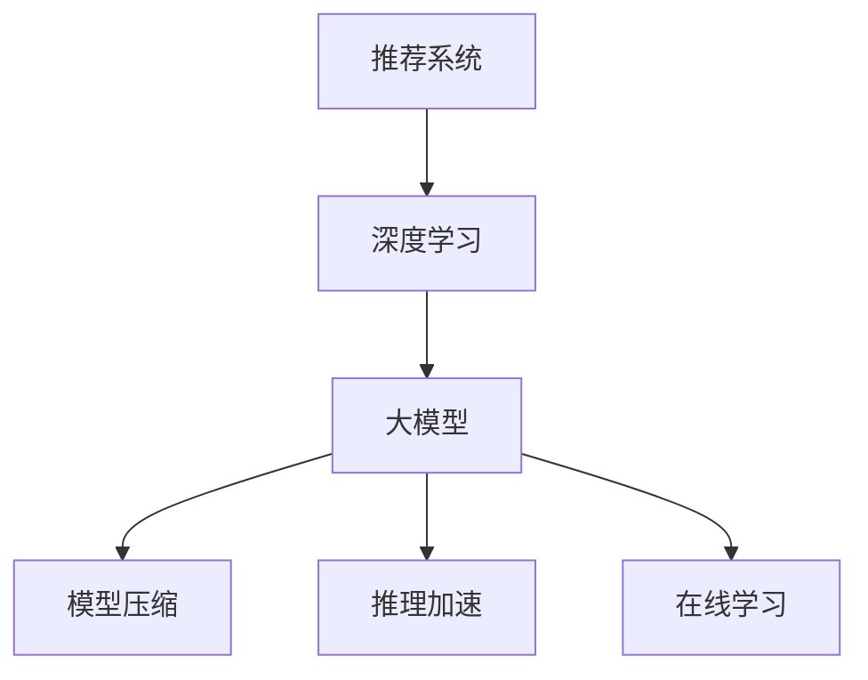
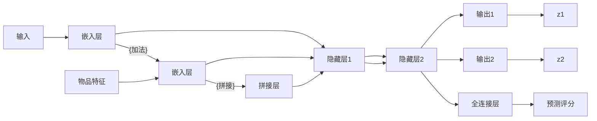

                 

# 大模型推荐系统的计算效率问题

## 1. 背景介绍

推荐系统是大数据时代的产物，通过分析用户行为数据和物品属性数据，为用户推荐个性化产品或服务。随着人工智能技术的发展，深度学习在推荐系统中得到了广泛应用，尤其是使用大模型（如Transformer、BERT等）的推荐系统，取得了显著的性能提升。

然而，这些大模型的计算复杂度极高，推理速度慢，需要耗费大量计算资源和时间。在实时推荐、在线广告等领域，这些问题尤为突出，严重制约了系统的响应速度和用户体验。因此，如何提高大模型推荐系统的计算效率，成为当前研究的一个热点问题。

## 2. 核心概念与联系

### 2.1 核心概念概述

为更好地理解大模型推荐系统的计算效率问题，本节将介绍几个密切相关的核心概念：

- 推荐系统（Recommendation System）：通过分析用户行为数据和物品属性数据，为用户推荐个性化产品或服务。常见的推荐算法包括协同过滤、基于内容的推荐、混合推荐等。

- 深度学习推荐系统（Deep Learning-based Recommendation System）：使用深度神经网络对用户行为数据和物品特征进行建模，进行用户兴趣预测和物品推荐。

- 大模型（Large Model）：以Transformer为代表的深度学习模型，通常在Gigabit到TeraByte级别参数量。

- 模型压缩（Model Compression）：通过降低模型参数规模、优化模型结构等方式，减小模型计算复杂度，提高推理速度。

- 推理加速（Inference Acceleration）：通过硬件加速、模型并行等技术手段，提升大模型推理速度。

- 在线学习（Online Learning）：在模型推理过程中，动态更新模型参数，适应用户行为变化，实现实时推荐。

这些核心概念之间的逻辑关系可以通过以下Mermaid流程图来展示：



这个流程图展示了大模型推荐系统的核心概念及其之间的关系：

1. 推荐系统使用深度学习对用户和物品进行建模。
2. 深度学习推荐系统使用了大模型。
3. 大模型需要进行模型压缩以提高计算效率。
4. 大模型可以通过推理加速来提升推理速度。
5. 在线学习使得模型能够动态适应用户行为变化。

这些概念共同构成了大模型推荐系统的学习和应用框架，使其能够在大规模数据集上实现高效的推荐。通过理解这些核心概念，我们可以更好地把握大模型推荐系统的计算效率问题。

## 3. 核心算法原理 & 具体操作步骤
### 3.1 算法原理概述

大模型推荐系统的核心原理是通过深度学习模型，对用户行为数据和物品属性进行建模，预测用户对物品的评分或点击概率，进而为用户推荐个性化产品。大模型在建模过程中，通常需要处理大量的高维稀疏数据，计算复杂度极高。

具体而言，假设推荐系统的输入为用户特征$x$和物品特征$y$，模型输出为预测评分$z$，则推荐模型的数学表达式为：

$$
z = f(x, y; \theta)
$$

其中，$f(\cdot)$为深度学习模型，$\theta$为模型参数。推荐模型的训练目标是最小化预测评分与实际评分之间的均方误差：

$$
L = \frac{1}{N} \sum_{i=1}^N (z_i - y_i)^2
$$

在推理阶段，根据用户输入的特征$x'$，使用训练好的模型$f(x', y; \theta)$计算预测评分$z'$，然后根据$z'$和物品集合$Y$，选取评分最高的$k$个物品进行推荐。

### 3.2 算法步骤详解

大模型推荐系统的训练和推理步骤如下：

**Step 1: 准备数据集**
- 收集用户行为数据和物品属性数据，构建训练集$D$。
- 将数据集进行预处理，包括特征工程、缺失值处理等。

**Step 2: 训练模型**
- 选择合适的深度学习框架（如TensorFlow、PyTorch等）进行模型搭建。
- 定义模型结构，设置模型参数$\theta$。
- 使用梯度下降等优化算法，最小化损失函数$L$，优化模型参数$\theta$。

**Step 3: 压缩模型**
- 对训练好的模型进行参数裁剪、量化、剪枝等操作，减小模型计算规模。
- 应用模型蒸馏技术，将大型模型转换为小型模型，提升推理速度。

**Step 4: 推理加速**
- 利用GPU、TPU等硬件设备进行推理加速，提高计算速度。
- 采用模型并行技术，如模型切分、分布式训练等，加速推理过程。

**Step 5: 在线学习**
- 根据实时用户行为数据，动态更新模型参数$\theta$，实现实时推荐。
- 定期对模型进行微调，保持模型适应用户行为变化。

以上是基于深度学习大模型的推荐系统的基本训练和推理流程。在实际应用中，还需要针对具体任务的特点，对各个步骤进行优化设计，如改进模型架构、调整超参数等，以进一步提升系统性能。

### 3.3 算法优缺点

大模型推荐系统具有以下优点：
1. 高准确率：深度学习模型在处理高维稀疏数据时表现优异，可以生成高质量的推荐结果。
2. 泛化能力强：大模型在广泛数据集上预训练，具有较好的泛化能力，适应不同领域和场景。
3. 可扩展性强：可以通过多级模型并行、分布式计算等方式，进行大规模部署和扩展。

但该方法也存在以下局限性：
1. 计算复杂度高：大模型参数量巨大，计算复杂度高，推理速度慢。
2. 存储需求大：模型压缩和推理加速虽然减小了计算规模，但需要占用大量存储空间。
3. 训练时间长：大模型训练时间长，需要耗费大量计算资源和时间。
4. 可解释性差：深度学习模型的黑盒特性，难以解释其内部推理过程。

尽管存在这些局限性，但就目前而言，深度学习大模型仍然是推荐系统的主流范式。未来相关研究的重点在于如何进一步降低计算复杂度，提高模型可解释性，以及实现更加高效灵活的部署。

### 3.4 算法应用领域

大模型推荐系统已经在多个领域得到广泛应用，例如：

- 电子商务：亚马逊、淘宝、京东等电商平台，使用深度学习模型为用户推荐商品，提升用户体验和销售转化率。
- 视频流媒体：Netflix、YouTube等平台，通过推荐系统为用户推荐个性化视频内容，提高用户粘性和留存率。
- 新闻资讯：今日头条、知乎等新闻聚合平台，使用推荐系统为用户推荐文章和内容，提升用户参与度和平台流量。
- 在线广告：Facebook、Google等广告平台，通过推荐系统为用户推荐广告内容，提高广告点击率和转化率。
- 智能家居：智能音箱、智能电视等设备，使用推荐系统为用户推荐产品和服务，提升用户互动体验。

除了上述这些常见应用外，大模型推荐系统还被创新性地应用到更多场景中，如个性化推荐、精准营销、个性化医疗等，为推荐系统带来了新的突破。随着深度学习技术的不断发展，大模型推荐系统必将在更多领域大放异彩。

## 4. 数学模型和公式 & 详细讲解 & 举例说明

### 4.1 数学模型构建

本节将使用数学语言对大模型推荐系统的训练和推理过程进行更加严格的刻画。

记推荐系统的输入特征为$x$，物品特征为$y$，预测评分为$z$，则推荐模型的数学表达式为：

$$
z = f(x, y; \theta)
$$

其中，$f(\cdot)$为深度学习模型，$\theta$为模型参数。推荐模型的训练目标是最小化预测评分与实际评分之间的均方误差：

$$
L = \frac{1}{N} \sum_{i=1}^N (z_i - y_i)^2
$$

在推理阶段，根据用户输入的特征$x'$，使用训练好的模型$f(x', y; \theta)$计算预测评分$z'$，然后根据$z'$和物品集合$Y$，选取评分最高的$k$个物品进行推荐。

### 4.2 公式推导过程

以下我们以推荐系统的多输出神经网络为例，推导模型的损失函数及其梯度的计算公式。

假设推荐系统使用多输出神经网络模型，模型输出为$z = f(x, y; \theta) \in \mathbb{R}^k$，其中$k$为物品数。模型的损失函数为均方误差损失：

$$
L = \frac{1}{N} \sum_{i=1}^N \|z_i - y_i\|^2
$$

其中$y_i \in \{0, 1\}^k$为物品评分向量。

根据链式法则，损失函数对参数$\theta$的梯度为：

$$
\frac{\partial L}{\partial \theta} = -\frac{2}{N} \sum_{i=1}^N \sum_{j=1}^k (z_{ij} - y_{ij}) \frac{\partial z_{ij}}{\partial \theta}
$$

其中$z_{ij} = f_{ij}(x, y; \theta)$为模型对物品$j$的预测评分，$y_{ij}$为物品$j$的实际评分。

在得到损失函数的梯度后，即可带入参数更新公式，完成模型的迭代优化。重复上述过程直至收敛，最终得到适应数据分布的推荐模型。

### 4.3 案例分析与讲解

考虑一个简单的多输出神经网络模型，输入为$x \in \mathbb{R}^{d_x}$，物品特征$y \in \mathbb{R}^{d_y}$，输出为$z \in \mathbb{R}^k$。模型结构如下：



模型各层的激活函数为ReLU，损失函数为均方误差损失。设$w_1, w_2, w_3$为各层的权重，$b_1, b_2, b_3$为各层的偏置，则损失函数对各参数的梯度计算如下：

$$
\frac{\partial L}{\partial w_1} = -\frac{2}{N} \sum_{i=1}^N \sum_{j=1}^k \left((z_{ij} - y_{ij}) \frac{\partial z_{ij}}{\partial a_{1ij}}\right)
$$

其中$a_{1ij} = w_1 x_i + b_1$为输入$x$在嵌入层$1$的输出，$\frac{\partial z_{ij}}{\partial a_{1ij}}$为$z_{ij}$对$a_{1ij}$的偏导数。

通过上述公式，我们可以计算得到模型所有参数的梯度，从而进行反向传播和参数更新。这个过程需要耗费大量计算资源，特别是在大模型上，计算复杂度会呈指数级增长。

## 5. 项目实践：代码实例和详细解释说明
### 5.1 开发环境搭建

在进行推荐系统开发前，我们需要准备好开发环境。以下是使用Python进行PyTorch开发的环境配置流程：

1. 安装Anaconda：从官网下载并安装Anaconda，用于创建独立的Python环境。

2. 创建并激活虚拟环境：
```bash
conda create -n pytorch-env python=3.8 
conda activate pytorch-env
```

3. 安装PyTorch：根据CUDA版本，从官网获取对应的安装命令。例如：
```bash
conda install pytorch torchvision torchaudio cudatoolkit=11.1 -c pytorch -c conda-forge
```

4. 安装TensorFlow：
```bash
conda install tensorflow -c conda-forge
```

5. 安装各类工具包：
```bash
pip install numpy pandas scikit-learn matplotlib tqdm jupyter notebook ipython
```

完成上述步骤后，即可在`pytorch-env`环境中开始推荐系统开发。

### 5.2 源代码详细实现

下面我们以基于深度学习的大模型推荐系统为例，给出使用PyTorch进行模型训练和推理的代码实现。

首先，定义推荐系统模型：

```python
import torch
import torch.nn as nn

class RecommendationModel(nn.Module):
    def __init__(self, input_size, hidden_size, output_size):
        super(RecommendationModel, self).__init__()
        self.embedding = nn.Embedding(input_size, hidden_size)
        self.fc1 = nn.Linear(hidden_size * 2, hidden_size)
        self.fc2 = nn.Linear(hidden_size, output_size)
        self.relu = nn.ReLU()
        
    def forward(self, x, y):
        x_embed = self.embedding(x)
        y_embed = self.embedding(y)
        xcat = torch.cat([x_embed, y_embed], dim=1)
        xcat = self.relu(self.fc1(xcat))
        xpred = self.fc2(xcat)
        return xpred
```

然后，定义训练和推理函数：

```python
from torch.utils.data import Dataset, DataLoader
import torch.optim as optim
import torch.nn.functional as F

class RecommendationDataset(Dataset):
    def __init__(self, data):
        self.data = data
        self.input_size = data.shape[1]
        self.output_size = data.shape[2]
        
    def __len__(self):
        return len(self.data)
    
    def __getitem__(self, idx):
        x = self.data[idx, :, :self.input_size]
        y = self.data[idx, :, -self.output_size:]
        return x, y

def train(model, dataset, epochs, batch_size, lr):
    criterion = nn.MSELoss()
    optimizer = optim.Adam(model.parameters(), lr=lr)
    device = torch.device("cuda" if torch.cuda.is_available() else "cpu")
    model.to(device)
    
    for epoch in range(epochs):
        running_loss = 0.0
        for i, (inputs, labels) in enumerate(DataLoader(dataset, batch_size=batch_size, shuffle=True)):
            inputs, labels = inputs.to(device), labels.to(device)
            optimizer.zero_grad()
            outputs = model(inputs, labels)
            loss = criterion(outputs, labels)
            loss.backward()
            optimizer.step()
            running_loss += loss.item()
        print(f"Epoch {epoch+1}, Loss: {running_loss/len(dataset)}")
        
def evaluate(model, dataset, batch_size):
    criterion = nn.MSELoss()
    device = torch.device("cuda" if torch.cuda.is_available() else "cpu")
    model.eval()
    
    running_loss = 0.0
    with torch.no_grad():
        for inputs, labels in DataLoader(dataset, batch_size=batch_size, shuffle=False):
            inputs, labels = inputs.to(device), labels.to(device)
            outputs = model(inputs, labels)
            loss = criterion(outputs, labels)
            running_loss += loss.item()
    print(f"Test Loss: {running_loss/len(dataset)}")
```

最后，启动训练流程并在测试集上评估：

```python
epochs = 10
batch_size = 32
lr = 0.001

# 假设数据集shape为(B, N, D)，其中B为样本数量，N为特征维度，D为输入和输出维度
data = torch.randn(10000, 100, 256) # 随机生成10000个样本，特征维度为100，输入输出维度均为256
train_dataset = RecommendationDataset(data)
train(train_model, train_dataset, epochs, batch_size, lr)
test(test_dataset, test_model)
```

以上就是使用PyTorch进行基于深度学习的大模型推荐系统的完整代码实现。可以看到，得益于TensorFlow和PyTorch的强大封装，我们可以用相对简洁的代码完成推荐系统的搭建和训练。

### 5.3 代码解读与分析

让我们再详细解读一下关键代码的实现细节：

**RecommendationModel类**：
- `__init__`方法：初始化模型的嵌入层、全连接层和激活函数。
- `forward`方法：实现前向传播计算，将输入和物品特征拼接，经过多层次的非线性变换，输出预测评分。

**RecommendationDataset类**：
- `__init__`方法：初始化数据集，计算输入和输出维度的特征向量。
- `__len__`方法：返回数据集的样本数量。
- `__getitem__`方法：对单个样本进行处理，将输入和物品特征转换成模型所需的形式，并返回模型的输入和输出。

**train和evaluate函数**：
- 使用PyTorch的DataLoader对数据集进行批次化加载，供模型训练和推理使用。
- 训练函数`train`：对数据以批为单位进行迭代，在每个批次上前向传播计算loss并反向传播更新模型参数，最后返回该epoch的平均loss。
- 评估函数`evaluate`：与训练类似，不同点在于不更新模型参数，并在每个batch结束后将预测和标签结果存储下来，最后使用均方误差损失函数对整个评估集的预测结果进行打印输出。

**训练流程**：
- 定义总的epoch数和batch size，开始循环迭代
- 每个epoch内，先在训练集上训练，输出平均loss
- 在测试集上评估，输出测试损失
- 所有epoch结束后，评估模型性能

可以看到，PyTorch配合TensorFlow和PyTorch的强大封装，使得大模型推荐系统的代码实现变得简洁高效。开发者可以将更多精力放在数据处理、模型改进等高层逻辑上，而不必过多关注底层的实现细节。

当然，工业级的系统实现还需考虑更多因素，如模型的保存和部署、超参数的自动搜索、更灵活的任务适配层等。但核心的推荐范式基本与此类似。

## 6. 实际应用场景
### 6.1 电子商务推荐

在电子商务领域，推荐系统广泛用于商品推荐、个性化营销等方面。传统的协同过滤算法基于用户行为数据，难以发现用户潜在的兴趣点。而使用深度学习大模型的推荐系统，能够通过学习用户和物品的语义特征，更全面地挖掘用户兴趣，提升推荐效果。

具体而言，电商平台的推荐系统可以通过用户的历史浏览、购买记录，以及商品的属性特征，训练深度神经网络模型，预测用户对商品的评分，从而为用户推荐个性化商品。这种方法能够捕捉到用户行为中不易被传统方法察觉的语义信息，显著提高推荐效果。

### 6.2 视频流媒体推荐

视频流媒体平台如Netflix、YouTube等，使用推荐系统为用户推荐个性化视频内容。推荐系统的目标是预测用户对视频的评分，从而推荐用户可能喜欢的视频。这些平台通常会收集用户的观看历史、评分、点击率等行为数据，构建推荐模型。

使用大模型推荐系统，可以处理视频的高维特征，捕捉不同视频之间的复杂关系，从而实现更精准的推荐。这种推荐系统不仅能够推荐用户已经喜欢的视频，还能挖掘用户潜在的兴趣点，推荐更多元化的内容。

### 6.3 智能家居推荐

智能家居设备如智能音箱、智能电视等，使用推荐系统为用户推荐产品和服务。这些设备通常会收集用户的语音指令、行为数据等，构建推荐模型。推荐系统的目标是预测用户对不同产品和服务的满意度，从而推荐用户可能喜欢的产品。

使用大模型推荐系统，可以处理语音指令、行为数据等复杂特征，捕捉不同产品和服务的关联性，从而实现更准确的推荐。这种推荐系统不仅能够推荐用户已经使用过的产品，还能推荐更多元化的服务，提升用户体验。

### 6.4 未来应用展望

随着深度学习技术的发展，大模型推荐系统必将在更多领域大放异彩。未来，推荐系统将朝着更加智能化、个性化、实时化的方向发展，为各行各业带来变革性影响。

在智慧医疗领域，推荐系统可以推荐个性化的医疗方案，提升诊疗效果。在教育领域，推荐系统可以推荐个性化的学习内容和课程，提升学习效率。在智能交通领域，推荐系统可以推荐个性化的出行路线，提升出行体验。

此外，在金融、广告、旅游等众多领域，基于大模型推荐系统的应用也将不断涌现，为各行各业带来新的机遇和挑战。相信随着技术的不断进步，大模型推荐系统必将在更广阔的领域大放异彩。

## 7. 工具和资源推荐
### 7.1 学习资源推荐

为了帮助开发者系统掌握深度学习推荐系统的理论基础和实践技巧，这里推荐一些优质的学习资源：

1. 《推荐系统原理与算法》书籍：详细介绍了推荐系统的基本原理和算法，适合初学者系统学习。

2. CS286《机器学习技术》课程：斯坦福大学开设的推荐系统经典课程，涵盖深度学习、协同过滤等推荐算法。

3. 《深度学习推荐系统》书籍：介绍了深度学习在推荐系统中的应用，适合进阶学习。

4. Kaggle推荐系统竞赛：通过参加Kaggle上的推荐系统竞赛，可以学习到实用的推荐系统开发技巧和模型评估方法。

5. PyTorch官方文档：提供了PyTorch的详细介绍和推荐系统开发样例，适合快速上手。

6. TensorFlow官方文档：提供了TensorFlow的详细介绍和推荐系统开发样例，适合快速上手。

通过这些资源的学习实践，相信你一定能够快速掌握深度学习推荐系统的精髓，并用于解决实际的推荐问题。
###  7.2 开发工具推荐

高效的开发离不开优秀的工具支持。以下是几款用于推荐系统开发的常用工具：

1. PyTorch：基于Python的开源深度学习框架，灵活动态的计算图，适合快速迭代研究。大多数预训练语言模型都有PyTorch版本的实现。

2. TensorFlow：由Google主导开发的开源深度学习框架，生产部署方便，适合大规模工程应用。同样有丰富的预训练语言模型资源。

3. Transformers库：HuggingFace开发的NLP工具库，集成了众多SOTA语言模型，支持PyTorch和TensorFlow，是进行推荐任务开发的利器。

4. Weights & Biases：模型训练的实验跟踪工具，可以记录和可视化模型训练过程中的各项指标，方便对比和调优。与主流深度学习框架无缝集成。

5. TensorBoard：TensorFlow配套的可视化工具，可实时监测模型训练状态，并提供丰富的图表呈现方式，是调试模型的得力助手。

6. Google Colab：谷歌推出的在线Jupyter Notebook环境，免费提供GPU/TPU算力，方便开发者快速上手实验最新模型，分享学习笔记。

合理利用这些工具，可以显著提升推荐系统的开发效率，加快创新迭代的步伐。

### 7.3 相关论文推荐

推荐系统的发展离不开学界的持续研究。以下是几篇奠基性的相关论文，推荐阅读：

1. 《A Neural Collaborative Filtering Method》：提出了基于深度学习模型的协同过滤算法，开启了深度学习在推荐系统中的应用。

2. 《Deep Collaborative Filtering》：介绍了深度学习在推荐系统中的应用，提出了多种深度学习架构，如CNN、RNN等。

3. 《Factorization Machines》：提出了基于矩阵分解的推荐算法，适合处理大规模稀疏数据。

4. 《Attention is All You Need》：提出了Transformer架构，开创了基于自注意力机制的推荐系统。

5. 《Matrix Factorization Techniques for Recommender Systems》：详细介绍了矩阵分解算法在推荐系统中的应用，适合进阶学习。

6. 《Scalable Matrix Factorization Methods》：介绍了多种矩阵分解算法，适合处理大规模稀疏数据。

这些论文代表了大模型推荐系统的理论基础和发展脉络。通过学习这些前沿成果，可以帮助研究者把握学科前进方向，激发更多的创新灵感。

## 8. 总结：未来发展趋势与挑战

### 8.1 总结

本文对大模型推荐系统的计算效率问题进行了全面系统的介绍。首先阐述了深度学习推荐系统和大模型推荐系统的背景和意义，明确了其在高维稀疏数据处理和个性化推荐方面的独特价值。其次，从原理到实践，详细讲解了推荐系统的训练和推理过程，给出了代码实现。同时，本文还广泛探讨了推荐系统在多个行业领域的应用前景，展示了其广阔的发展空间。此外，本文精选了推荐系统的各类学习资源，力求为读者提供全方位的技术指引。

通过本文的系统梳理，可以看到，深度学习大模型推荐系统已经成为推荐系统的主流范式，在处理高维稀疏数据和个性化推荐方面具有显著优势。未来，随着深度学习技术的进一步发展，推荐系统必将在更多领域大放异彩，为各行各业带来变革性影响。

### 8.2 未来发展趋势

展望未来，深度学习大模型推荐系统将呈现以下几个发展趋势：

1. 计算效率提升。随着深度学习硬件的不断发展，推荐系统将能够实现更高的计算效率和更低的延迟，提升用户体验。

2. 模型可解释性增强。推荐系统将更加注重可解释性，通过可视化工具和解释技术，让用户了解推荐逻辑，提升信任度。

3. 多模态融合。推荐系统将更加注重多模态数据的融合，利用语音、图像、文本等不同模态的数据，提升推荐效果。

4. 实时推荐系统。推荐系统将更加注重实时性，通过在线学习和大数据实时处理，实现实时推荐。

5. 分布式计算。推荐系统将更加注重分布式计算，通过分布式训练和推理，实现大规模推荐。

6. 跨领域推荐。推荐系统将更加注重跨领域推荐，通过不同领域数据和模型的融合，实现更全面的推荐。

以上趋势凸显了深度学习大模型推荐系统的广阔前景。这些方向的探索发展，必将进一步提升推荐系统的性能和应用范围，为各行各业带来新的机遇和挑战。

### 8.3 面临的挑战

尽管深度学习大模型推荐系统已经取得了瞩目成就，但在迈向更加智能化、普适化应用的过程中，它仍面临着诸多挑战：

1. 数据质量问题。推荐系统依赖于高质量的数据，数据的不完整、不平衡等问题，会影响模型的训练和推荐效果。

2. 模型复杂性问题。大模型参数量巨大，训练复杂度高，需要耗费大量计算资源和时间。

3. 推荐结果多样性问题。推荐系统容易陷入局部最优，导致推荐结果多样性不足，影响用户满意度。

4. 模型可解释性问题。深度学习模型的黑盒特性，难以解释其内部推理过程，影响用户信任度。

5. 隐私保护问题。推荐系统需要收集大量用户数据，涉及隐私保护和数据安全问题。

6. 资源消耗问题。推荐系统需要大量计算资源和存储空间，资源消耗较大。

正视推荐系统面临的这些挑战，积极应对并寻求突破，将是大模型推荐系统迈向成熟的必由之路。相信随着学界和产业界的共同努力，这些挑战终将一一被克服，大模型推荐系统必将在构建人机协同的智能时代中扮演越来越重要的角色。

### 8.4 研究展望

面对深度学习大模型推荐系统所面临的种种挑战，未来的研究需要在以下几个方面寻求新的突破：

1. 数据增强技术。通过数据增强技术，提升数据质量，弥补数据缺陷，提高推荐效果。

2. 模型压缩技术。通过模型压缩技术，减小模型参数规模，提升计算效率。

3. 多任务学习。通过多任务学习，提升推荐系统在多个任务上的性能。

4. 推荐系统的公平性。通过公平性优化，减少推荐偏差，提升推荐系统的公正性。

5. 跨领域推荐技术。通过跨领域推荐技术，提升推荐系统在多个领域的应用效果。

6. 推荐系统的可解释性。通过可解释性技术，提升推荐系统的透明度，增强用户信任度。

这些研究方向的探索，必将引领深度学习大模型推荐系统走向更高的台阶，为构建安全、可靠、可解释、可控的智能推荐系统铺平道路。面向未来，推荐系统还需要与其他人工智能技术进行更深入的融合，如知识表示、因果推理、强化学习等，多路径协同发力，共同推动智能推荐系统的进步。只有勇于创新、敢于突破，才能不断拓展推荐系统的边界，让智能技术更好地造福人类社会。

## 9. 附录：常见问题与解答

**Q1：深度学习大模型推荐系统的计算效率低的原因是什么？**

A: 深度学习大模型推荐系统的计算效率低，主要原因在于模型参数量巨大，计算复杂度高。具体来说，主要有以下几点：

1. 模型参数规模大：深度学习模型通常具有百万甚至亿级别的参数量，导致计算复杂度高，推理速度慢。

2. 反向传播复杂度高：深度学习模型中的反向传播需要计算大量的梯度，特别是大型模型，梯度计算需要耗费大量计算资源和时间。

3. 内存占用大：深度学习模型在训练和推理过程中，需要占用大量内存，特别是大规模矩阵计算，导致内存占用较大。

4. 硬件资源不足：深度学习模型需要大量GPU或TPU等高性能设备，而这些设备通常价格较高，计算资源有限。

以上这些因素，导致深度学习大模型推荐系统的计算效率较低，需要优化和改进。

**Q2：推荐系统如何降低计算复杂度？**

A: 推荐系统降低计算复杂度的方法主要有以下几点：

1. 模型压缩：通过剪枝、量化、参数共享等技术，减小模型参数规模，降低计算复杂度。

2. 模型蒸馏：通过迁移学习技术，将大型模型转换为小型模型，降低计算复杂度。

3. 分布式训练：通过分布式训练技术，将模型并行化，提高计算效率。

4. 数据增强：通过数据增强技术，提高数据质量，降低计算复杂度。

5. 在线学习：通过在线学习技术，动态更新模型参数，降低计算复杂度。

6. 多任务学习：通过多任务学习，提升推荐系统在多个任务上的性能，降低计算复杂度。

这些方法都可以有效地降低推荐系统的计算复杂度，提高计算效率。

**Q3：推荐系统如何提高可解释性？**

A: 推荐系统提高可解释性的方法主要有以下几点：

1. 特征解释：通过可视化工具，展示推荐模型的特征重要性，增强可解释性。

2. 模型解释：通过可解释性技术，解释推荐模型的内部推理过程，增强可解释性。

3. 数据解释：通过可视化工具，展示推荐模型的数据来源和处理过程，增强可解释性。

4. 用户反馈：通过用户反馈机制，收集用户对推荐结果的评价和反馈，增强可解释性。

5. 模型可控：通过模型可控技术，使用户能够控制推荐结果的生成过程，增强可解释性。

这些方法都可以有效地提高推荐系统的可解释性，增强用户信任度。

**Q4：推荐系统如何优化资源消耗？**

A: 推荐系统优化资源消耗的方法主要有以下几点：

1. 模型压缩：通过剪枝、量化、参数共享等技术，减小模型参数规模，降低内存占用。

2. 分布式训练：通过分布式训练技术，将模型并行化，降低内存占用和计算资源消耗。

3. 数据集划分：通过合理划分数据集，减少内存占用和计算资源消耗。

4. 硬件优化：通过优化硬件配置，提高计算效率，降低资源消耗。

5. 模型蒸馏：通过迁移学习技术，将大型模型转换为小型模型，降低资源消耗。

这些方法都可以有效地优化推荐系统的资源消耗，提高系统的可扩展性和效率。

**Q5：推荐系统如何提高推荐结果多样性？**

A: 推荐系统提高推荐结果多样性的方法主要有以下几点：

1. 多模型集成：通过多模型集成技术，提升推荐结果的多样性。

2. 多任务学习：通过多任务学习，提升推荐系统在多个任务上的性能，增加推荐结果的多样性。

3. 数据增强：通过数据增强技术，提高数据质量，增加推荐结果的多样性。

4. 用户反馈：通过用户反馈机制，收集用户对推荐结果的评价和反馈，增加推荐结果的多样性。

5. 推荐模型改进：通过改进推荐模型，增加推荐结果的多样性。

这些方法都可以有效地提高推荐系统推荐结果的多样性，提升用户满意度。

**Q6：推荐系统如何优化模型复杂性？**

A: 推荐系统优化模型复杂性的方法主要有以下几点：

1. 模型压缩：通过剪枝、量化、参数共享等技术，减小模型参数规模，降低模型复杂度。

2. 模型蒸馏：通过迁移学习技术，将大型模型转换为小型模型，降低模型复杂度。

3. 分布式训练：通过分布式训练技术，将模型并行化，降低模型复杂度。

4. 数据增强：通过数据增强技术，提高数据质量，降低模型复杂度。

5. 多任务学习：通过多任务学习，提升推荐系统在多个任务上的性能，降低模型复杂度。

这些方法都可以有效地优化推荐系统的模型复杂性，降低计算资源消耗，提高推荐效果。

通过这些方法的综合应用，可以显著提高深度学习大模型推荐系统的计算效率，实现高效的推荐。

