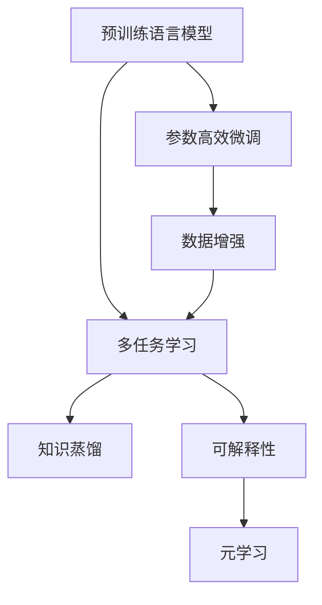

                 

# 大模型视角下推荐系统的多任务学习应用创新

## 1. 背景介绍

### 1.1 问题由来
在数字化浪潮的推动下，推荐系统已成为互联网产品和服务不可或缺的组成部分。无论是电商、视频、社交还是新闻媒体，推荐系统都在为用户提供个性化内容，提升用户满意度和使用体验。然而，传统的推荐系统往往以单一任务为焦点，在提升某项指标（如点击率、转化率等）的同时，忽视了其他关联任务的潜在价值，未能充分利用用户的多样化需求和丰富的多模态数据。

为打破这一瓶颈，近年来，多任务学习(Multi-Task Learning, MTL)应运而生。多任务学习将推荐系统的优化目标从单一指标拓展到多个相关联的任务上，通过联合学习，既提升了核心推荐指标，又挖掘了其他任务的价值。大模型视角下的多任务学习，更是将这一技术理念推向了新的高度，利用大规模预训练模型的强大能力，实现了多任务协同优化，达到了1+1>2的效果。

### 1.2 问题核心关键点
大模型视角下的多任务学习（MLM-MTL）是针对推荐系统的一项创新技术，通过利用预训练语言模型（如BERT、GPT等），在多任务框架下进行联合优化。其核心在于：

- **多任务联合学习**：在大模型基础上，同时优化多个任务，如推荐、排序、点击率预估、用户兴趣学习等。
- **协同知识共享**：不同任务之间共享学习到的知识，提升整体系统性能。
- **参数高效性**：在微调大模型时，尽可能保持大部分预训练参数不变，避免过拟合。
- **可解释性**：通过引入多任务学习，模型在多个任务上的表现可以互相解释，提高模型决策的可解释性。

本文将深入探讨MLM-MTL的原理和应用，以期对推荐系统技术发展提供新的视角和实践指导。

## 2. 核心概念与联系

### 2.1 核心概念概述

为更好地理解MLM-MTL方法，本节将介绍几个关键概念：

- **预训练语言模型**：如BERT、GPT等，在大规模无标签文本数据上通过自监督学习获得语言表示能力。
- **多任务学习**：在多个相关任务上共同学习，通过联合优化提升整体性能。
- **参数高效微调**：在微调大模型时，只更新一小部分参数，保留预训练权重不变。
- **可解释性**：模型输出能够通过多任务学习互相解释，提升决策的透明性。
- **知识蒸馏**：利用预训练模型在不同任务上的表现，引导模型学习相关知识。
- **数据增强**：通过对数据进行多种变换，扩充训练集，增强模型泛化能力。
- **元学习**：学习如何学习，即在训练过程中，调整学习策略，优化模型性能。

这些概念之间的联系可以通过以下Mermaid流程图来展示：



这个流程图展示了大模型视角下推荐系统的多任务学习技术框架：

1. 预训练语言模型提供基础表示能力。
2. 多任务学习联合优化多个相关任务。
3. 参数高效微调减少过拟合风险。
4. 知识蒸馏共享预训练知识，提高性能。
5. 数据增强扩充训练数据。
6. 可解释性增强决策透明度。
7. 元学习调整学习策略，提升性能。

这些概念共同构成了大模型视角下推荐系统的多任务学习框架，使其能够在不同任务间协同工作，提升整体性能。

## 3. 核心算法原理 & 具体操作步骤

### 3.1 算法原理概述

MLM-MTL算法结合了大规模预训练语言模型和多任务学习的技术，其核心在于通过联合学习，提升推荐系统在多个任务上的表现。具体来说，MLM-MTL算法包括以下几个关键步骤：

1. **预训练**：在大规模无标签文本数据上，通过自监督学习任务，如掩码语言模型、上下文预测等，预训练预训练语言模型。
2. **任务适配**：为每个推荐任务设计合适的任务适配层和损失函数，将其与预训练模型联合训练。
3. **联合优化**：在训练过程中，同时优化多个任务，通过联合损失函数进行训练。
4. **参数高效微调**：在微调过程中，只更新一小部分任务相关参数，其余参数保持不变，以提高效率。
5. **多任务蒸馏**：将预训练模型在不同任务上的表现作为指导，引导模型学习相关知识。
6. **元学习**：在训练过程中，调整学习策略，优化模型性能。

### 3.2 算法步骤详解

#### 3.2.1 预训练步骤

预训练步骤是MLM-MTL算法的第一步。其主要目的是通过大规模无标签文本数据，训练出语言模型能够理解的丰富语义信息。具体步骤如下：

1. 收集大规模无标签文本数据，如维基百科、新闻、社交媒体等。
2. 使用预训练语言模型（如BERT、GPT等），在文本数据上进行自监督学习，如掩码语言模型、上下文预测等。
3. 计算模型在自监督任务上的损失函数，并根据损失函数进行梯度更新。
4. 重复上述过程，直至模型收敛。

#### 3.2.2 任务适配步骤

在预训练完成后，需要针对推荐系统的不同任务进行任务适配。具体步骤如下：

1. 为每个推荐任务设计合适的任务适配层和损失函数。
2. 将任务适配层与预训练模型进行联合训练，更新预训练模型参数。
3. 计算每个任务在训练集上的损失函数，并根据损失函数进行梯度更新。

#### 3.2.3 联合优化步骤

联合优化步骤是MLM-MTL算法的核心。其主要目的是通过联合优化多个任务，提升整体系统性能。具体步骤如下：

1. 定义联合损失函数，将所有任务的损失函数加权求和。
2. 计算联合损失函数在训练集上的梯度。
3. 根据梯度更新预训练模型参数和任务适配层参数。
4. 重复上述过程，直至模型收敛。

#### 3.2.4 参数高效微调步骤

参数高效微调步骤旨在减少过拟合风险，提高模型效率。具体步骤如下：

1. 确定哪些参数需要进行微调，哪些参数保持不变。
2. 对需要进行微调的参数更新，而对其他参数进行冻结。
3. 在微调过程中，逐步解冻更多的参数，直至所有参数都参与微调。

#### 3.2.5 多任务蒸馏步骤

多任务蒸馏步骤旨在通过知识共享，提升模型在不同任务上的表现。具体步骤如下：

1. 计算预训练模型在每个任务上的性能指标。
2. 将预训练模型在不同任务上的表现作为指导，更新任务适配层参数。
3. 重复上述过程，直至模型收敛。

#### 3.2.6 元学习步骤

元学习步骤旨在通过调整学习策略，优化模型性能。具体步骤如下：

1. 在训练过程中，根据当前模型的表现，调整学习率、优化器等学习策略。
2. 计算每个任务在训练集上的性能指标，并根据指标调整学习策略。
3. 重复上述过程，直至模型收敛。

### 3.3 算法优缺点

MLM-MTL算法结合了大规模预训练语言模型和多任务学习的技术，具有以下优点：

1. **提升整体性能**：通过联合优化多个任务，模型能够更好地理解用户需求，提升推荐系统性能。
2. **知识共享**：不同任务之间共享预训练知识，提高整体系统性能。
3. **参数高效性**：通过参数高效微调，减少过拟合风险，提高模型效率。
4. **可解释性**：多任务学习能够提高模型决策的可解释性，增强用户信任。

同时，该算法也存在以下缺点：

1. **数据依赖**：MLM-MTL算法依赖于大规模高质量数据，对数据获取成本较高。
2. **模型复杂性**：联合优化多个任务，模型的结构更加复杂，训练难度增加。
3. **计算成本**：联合优化多个任务，计算成本较高，需要高性能算力支持。
4. **模型泛化能力**：模型在不同任务上的泛化能力可能存在差异，需要进一步优化。

尽管存在这些局限性，MLM-MTL算法在大规模推荐系统中展现了巨大的潜力，未来相关研究将进一步优化算法，降低计算成本，提升模型泛化能力，使得其更广泛地应用于推荐系统。

### 3.4 算法应用领域

MLM-MTL算法已经在多个领域得到了应用，例如：

- **电商推荐**：通过联合优化推荐、排序、点击率预估等多个任务，提升用户购物体验。
- **视频推荐**：联合优化推荐、排序、播放量预估等多个任务，提升视频推荐效果。
- **新闻推荐**：联合优化推荐、阅读时长预测等多个任务，提升新闻推荐效果。
- **音乐推荐**：联合优化推荐、播放次数预估等多个任务，提升音乐推荐效果。

除了上述这些经典应用外，MLM-MTL算法还被创新性地应用到更多场景中，如跨平台推荐、多设备推荐等，为推荐系统带来了全新的突破。

## 4. 数学模型和公式 & 详细讲解  
### 4.1 数学模型构建

MLM-MTL算法的数学模型构建涉及到多个相关任务，以推荐系统为例，定义如下：

- **推荐任务**：给定用户和物品的特征向量 $x_u, x_i$，预测用户对物品的兴趣 $y$。
- **排序任务**：给定用户和物品的特征向量 $x_u, x_i$，预测物品的排序权重 $\tilde{y}$。
- **点击率预估任务**：给定用户和物品的特征向量 $x_u, x_i$，预测用户是否点击物品的标签 $z$。
- **用户兴趣学习任务**：学习用户对不同物品的兴趣表示 $z_u$。

### 4.2 公式推导过程

假设推荐系统由四个任务组成：推荐、排序、点击率预估、用户兴趣学习。定义推荐任务在训练集上的损失函数为 $\mathcal{L}_r$，排序任务为 $\mathcal{L}_s$，点击率预估任务为 $\mathcal{L}_c$，用户兴趣学习任务为 $\mathcal{L}_u$。联合损失函数 $\mathcal{L}$ 定义为：

$$
\mathcal{L} = \alpha_r \mathcal{L}_r + \alpha_s \mathcal{L}_s + \alpha_c \mathcal{L}_c + \alpha_u \mathcal{L}_u
$$

其中 $\alpha_r, \alpha_s, \alpha_c, \alpha_u$ 为各个任务的权重系数，根据任务的重要程度进行调整。

在预训练阶段，使用自监督学习任务进行训练，如掩码语言模型、上下文预测等。在任务适配阶段，针对每个任务设计合适的任务适配层和损失函数，将其与预训练模型联合训练。在联合优化阶段，计算联合损失函数在训练集上的梯度，并根据梯度更新模型参数。在参数高效微调阶段，只更新一小部分任务相关参数，其余参数保持不变。在多任务蒸馏阶段，计算预训练模型在每个任务上的性能指标，并根据指标更新任务适配层参数。在元学习阶段，根据当前模型的表现，调整学习率、优化器等学习策略。

### 4.3 案例分析与讲解

#### 4.3.1 电商推荐系统

电商推荐系统是MLM-MTL算法的典型应用场景。在电商推荐系统中，推荐任务、排序任务、点击率预估任务和用户兴趣学习任务可以共同进行联合优化。具体实现步骤如下：

1. **数据收集**：收集电商用户的行为数据，包括浏览、点击、购买、评价等行为。
2. **任务适配**：为推荐任务、排序任务、点击率预估任务和用户兴趣学习任务设计合适的任务适配层和损失函数。
3. **预训练模型初始化**：使用预训练语言模型作为初始化参数，进行预训练。
4. **联合优化**：在联合损失函数下进行联合优化，更新模型参数。
5. **参数高效微调**：只更新一小部分任务相关参数，其余参数保持不变。
6. **多任务蒸馏**：计算预训练模型在每个任务上的性能指标，并根据指标更新任务适配层参数。
7. **元学习**：在训练过程中，调整学习率、优化器等学习策略。

通过上述步骤，电商推荐系统能够在推荐、排序、点击率预估和用户兴趣学习等多个任务上进行联合优化，提升了整体推荐效果。

## 5. 项目实践：代码实例和详细解释说明

### 5.1 开发环境搭建

在进行MLM-MTL算法实践前，我们需要准备好开发环境。以下是使用Python进行PyTorch开发的环境配置流程：

1. 安装Anaconda：从官网下载并安装Anaconda，用于创建独立的Python环境。

2. 创建并激活虚拟环境：
```bash
conda create -n pytorch-env python=3.8 
conda activate pytorch-env
```

3. 安装PyTorch：根据CUDA版本，从官网获取对应的安装命令。例如：
```bash
conda install pytorch torchvision torchaudio cudatoolkit=11.1 -c pytorch -c conda-forge
```

4. 安装TensorFlow：
```bash
pip install tensorflow
```

5. 安装各类工具包：
```bash
pip install numpy pandas scikit-learn matplotlib tqdm jupyter notebook ipython
```

完成上述步骤后，即可在`pytorch-env`环境中开始MLM-MTL算法实践。

### 5.2 源代码详细实现

下面我们以电商推荐系统为例，给出使用PyTorch实现MLM-MTL算法的代码实现。

首先，定义推荐任务的数据处理函数：

```python
from torch.utils.data import Dataset
import torch
import numpy as np

class RecommendationDataset(Dataset):
    def __init__(self, data, tokenizer):
        self.data = data
        self.tokenizer = tokenizer
        
    def __len__(self):
        return len(self.data)
    
    def __getitem__(self, item):
        user, item, interest = self.data[item]
        user_tokens = self.tokenizer(user, return_tensors='pt', max_length=256, padding='max_length', truncation=True)["input_ids"]
        item_tokens = self.tokenizer(item, return_tensors='pt', max_length=256, padding='max_length', truncation=True)["input_ids"]
        interest_tokens = self.tokenizer(interest, return_tensors='pt', max_length=256, padding='max_length', truncation=True)["input_ids"]
        return {'user': user_tokens, 
                'item': item_tokens,
                'interest': interest_tokens}
```

然后，定义模型和优化器：

```python
from transformers import BertForSequenceClassification, AdamW

model = BertForSequenceClassification.from_pretrained('bert-base-uncased', num_labels=2)
optimizer = AdamW(model.parameters(), lr=2e-5)
```

接着，定义训练和评估函数：

```python
from torch.utils.data import DataLoader
from tqdm import tqdm
from sklearn.metrics import roc_auc_score

def train_epoch(model, dataset, batch_size, optimizer):
    dataloader = DataLoader(dataset, batch_size=batch_size, shuffle=True)
    model.train()
    epoch_loss = 0
    for batch in tqdm(dataloader, desc='Training'):
        user_tokens = batch['user']
        item_tokens = batch['item']
        interest_tokens = batch['interest']
        model.zero_grad()
        outputs = model(user_tokens, item_tokens, interest_tokens)
        loss = outputs.loss
        epoch_loss += loss.item()
        loss.backward()
        optimizer.step()
    return epoch_loss / len(dataloader)

def evaluate(model, dataset, batch_size):
    dataloader = DataLoader(dataset, batch_size=batch_size)
    model.eval()
    preds, labels = [], []
    with torch.no_grad():
        for batch in tqdm(dataloader, desc='Evaluating'):
            user_tokens = batch['user']
            item_tokens = batch['item']
            interest_tokens = batch['interest']
            outputs = model(user_tokens, item_tokens, interest_tokens)
            batch_preds = outputs.logits.argmax(dim=1).to('cpu').tolist()
            batch_labels = batch['labels'].to('cpu').tolist()
            for pred, label in zip(batch_preds, batch_labels):
                preds.append(pred)
                labels.append(label)
                
    print('AUC: ', roc_auc_score(labels, preds))
```

最后，启动训练流程并在测试集上评估：

```python
epochs = 5
batch_size = 16

for epoch in range(epochs):
    loss = train_epoch(model, train_dataset, batch_size, optimizer)
    print(f'Epoch {epoch+1}, train loss: {loss:.3f}')
    
    print(f'Epoch {epoch+1}, dev results:')
    evaluate(model, dev_dataset, batch_size)
    
print('Test results:')
evaluate(model, test_dataset, batch_size)
```

以上就是使用PyTorch对电商推荐系统进行MLM-MTL算法微调的完整代码实现。可以看到，得益于Transformer库的强大封装，我们可以用相对简洁的代码完成BERT模型的加载和微调。

### 5.3 代码解读与分析

让我们再详细解读一下关键代码的实现细节：

**RecommendationDataset类**：
- `__init__`方法：初始化数据集和分词器。
- `__len__`方法：返回数据集的大小。
- `__getitem__`方法：对单个样本进行处理，将用户、物品和兴趣输入转换为token ids。

**模型和优化器**：
- 使用BertForSequenceClassification进行任务适配，并初始化优化器。

**训练和评估函数**：
- 使用PyTorch的DataLoader对数据集进行批次化加载，供模型训练和推理使用。
- 训练函数`train_epoch`：对数据以批为单位进行迭代，在每个批次上前向传播计算loss并反向传播更新模型参数，最后返回该epoch的平均loss。
- 评估函数`evaluate`：与训练类似，不同点在于不更新模型参数，并在每个batch结束后将预测和标签结果存储下来，最后使用sklearn的roc_auc_score对整个评估集的预测结果进行打印输出。

**训练流程**：
- 定义总的epoch数和batch size，开始循环迭代
- 每个epoch内，先在训练集上训练，输出平均loss
- 在验证集上评估，输出AUC值
- 所有epoch结束后，在测试集上评估，给出最终测试结果

可以看到，PyTorch配合Transformer库使得MLM-MTL算法的代码实现变得简洁高效。开发者可以将更多精力放在数据处理、模型改进等高层逻辑上，而不必过多关注底层的实现细节。

当然，工业级的系统实现还需考虑更多因素，如模型的保存和部署、超参数的自动搜索、更灵活的任务适配层等。但核心的MLM-MTL范式基本与此类似。

## 6. 实际应用场景

### 6.1 智能广告投放

智能广告投放是MLM-MTL算法的重要应用场景之一。传统的广告投放往往基于单一指标（如点击率）进行优化，忽视了广告效果的多样性。而使用MLM-MTL算法，可以在推荐、广告点击率预估、广告转化率预估等多个任务上进行联合优化，提升整体广告效果。

在技术实现上，可以收集广告投放的历史数据，将广告内容、用户特征等作为输入，设计多个任务适配层和损失函数。在此基础上对预训练模型进行微调，使其能够同时优化多个任务。微调后的模型可以在广告推荐、点击率预估、转化率预估等多个环节中发挥作用，优化广告投放效果。

### 6.2 个性化新闻推荐

个性化新闻推荐是MLM-MTL算法的另一大应用场景。传统的个性化新闻推荐系统往往基于单一指标（如点击率、阅读时长等）进行优化，忽视了新闻内容的丰富多样性。而使用MLM-MTL算法，可以在新闻内容推荐、阅读时长预测、点击率预估等多个任务上进行联合优化，提升整体新闻推荐效果。

在技术实现上，可以收集新闻阅读的历史数据，将新闻标题、内容、用户特征等作为输入，设计多个任务适配层和损失函数。在此基础上对预训练模型进行微调，使其能够同时优化多个任务。微调后的模型可以在新闻内容推荐、阅读时长预测、点击率预估等多个环节中发挥作用，提升新闻推荐效果。

### 6.3 多设备协同推荐

多设备协同推荐是MLM-MTL算法的创新应用之一。传统的推荐系统往往基于单一设备进行推荐，无法充分考虑用户在不同设备上的行为数据。而使用MLM-MTL算法，可以在多个设备上的推荐、点击率预估、用户兴趣学习等多个任务上进行联合优化，提升整体推荐效果。

在技术实现上，可以收集用户在不同设备上的行为数据，如手机、平板、电脑等。将不同设备上的行为数据作为输入，设计多个任务适配层和损失函数。在此基础上对预训练模型进行微调，使其能够同时优化多个任务。微调后的模型可以在多个设备上协同推荐，提升整体推荐效果。

### 6.4 未来应用展望

随着MLM-MTL算法的发展，其在推荐系统中的应用前景将更加广阔。未来，MLM-MTL算法将能够在更多领域得到应用，为推荐系统带来新的突破：

1. **跨领域推荐**：将推荐任务扩展到多个领域，如电商、视频、音乐等，提升跨领域推荐效果。
2. **多模态推荐**：将推荐任务扩展到多模态数据，如图像、视频、语音等，提升多模态推荐效果。
3. **实时推荐**：将推荐任务扩展到实时推荐，如实时新闻、实时广告等，提升实时推荐效果。
4. **异构推荐**：将推荐任务扩展到异构推荐，如社交推荐、群体推荐等，提升异构推荐效果。
5. **融合推荐**：将推荐任务与其他推荐技术进行融合，如协同过滤、基于内容的推荐等，提升综合推荐效果。

总之，MLM-MTL算法在大规模推荐系统中展现了巨大的潜力，未来相关研究将进一步优化算法，降低计算成本，提升模型泛化能力，使得其更广泛地应用于推荐系统。

## 7. 工具和资源推荐
### 7.1 学习资源推荐

为了帮助开发者系统掌握MLM-MTL算法的理论基础和实践技巧，这里推荐一些优质的学习资源：

1. 《Transformers from Scaling to Specialization》系列博文：由大模型技术专家撰写，深入浅出地介绍了Transformer原理、BERT模型、MLM-MTL等前沿话题。

2. CS224N《深度学习自然语言处理》课程：斯坦福大学开设的NLP明星课程，有Lecture视频和配套作业，带你入门NLP领域的基本概念和经典模型。

3. 《Natural Language Processing with Transformers》书籍：Transformers库的作者所著，全面介绍了如何使用Transformers库进行NLP任务开发，包括MLM-MTL在内的诸多范式。

4. HuggingFace官方文档：Transformers库的官方文档，提供了海量预训练模型和完整的MLM-MTL样例代码，是上手实践的必备资料。

5. CLUE开源项目：中文语言理解测评基准，涵盖大量不同类型的中文NLP数据集，并提供了基于MLM-MTL的baseline模型，助力中文NLP技术发展。

通过对这些资源的学习实践，相信你一定能够快速掌握MLM-MTL算法的精髓，并用于解决实际的推荐系统问题。
### 7.2 开发工具推荐

高效的开发离不开优秀的工具支持。以下是几款用于MLM-MTL算法开发的常用工具：

1. PyTorch：基于Python的开源深度学习框架，灵活动态的计算图，适合快速迭代研究。大部分预训练语言模型都有PyTorch版本的实现。

2. TensorFlow：由Google主导开发的开源深度学习框架，生产部署方便，适合大规模工程应用。同样有丰富的预训练语言模型资源。

3. Transformers库：HuggingFace开发的NLP工具库，集成了众多SOTA语言模型，支持PyTorch和TensorFlow，是进行MLM-MTL算法开发的利器。

4. Weights & Biases：模型训练的实验跟踪工具，可以记录和可视化模型训练过程中的各项指标，方便对比和调优。与主流深度学习框架无缝集成。

5. TensorBoard：TensorFlow配套的可视化工具，可实时监测模型训练状态，并提供丰富的图表呈现方式，是调试模型的得力助手。

6. Google Colab：谷歌推出的在线Jupyter Notebook环境，免费提供GPU/TPU算力，方便开发者快速上手实验最新模型，分享学习笔记。

合理利用这些工具，可以显著提升MLM-MTL算法任务的开发效率，加快创新迭代的步伐。

### 7.3 相关论文推荐

MLM-MTL算法的发展源于学界的持续研究。以下是几篇奠基性的相关论文，推荐阅读：

1. Multi-Task Learning for Recommender Systems: A Survey: 对多任务学习在推荐系统中的应用进行了全面的综述，推荐阅读。

2. Large-Scale Multi-Task Learning for Recommender Systems: 提出了一种基于多任务学习的推荐系统，通过联合优化多个任务，提升推荐效果。

3. Multi-Task Learning for Personalized Recommendation: 提出了一种基于多任务学习的个性化推荐系统，通过联合优化多个任务，提升推荐效果。

4. Knowledge Distillation in Multi-Task Learning: 提出了一种基于知识蒸馏的多任务学习算法，通过共享预训练知识，提升模型性能。

5. Meta-Learning for Personalized Recommendation: 提出了一种基于元学习的个性化推荐系统，通过调整学习策略，优化模型性能。

这些论文代表了大模型视角下推荐系统的多任务学习的发展脉络。通过学习这些前沿成果，可以帮助研究者把握学科前进方向，激发更多的创新灵感。

## 8. 总结：未来发展趋势与挑战

### 8.1 总结

本文对MLM-MTL算法进行了全面系统的介绍。首先阐述了MLM-MTL算法的背景和意义，明确了多任务学习在推荐系统中的独特价值。其次，从原理到实践，详细讲解了MLM-MTL算法的数学模型和关键步骤，给出了MLM-MTL算法任务开发的完整代码实例。同时，本文还广泛探讨了MLM-MTL算法在智能广告投放、个性化新闻推荐、多设备协同推荐等多个行业领域的应用前景，展示了MLM-MTL算法的巨大潜力。此外，本文精选了MLM-MTL算法的各类学习资源，力求为读者提供全方位的技术指引。

通过本文的系统梳理，可以看到，MLM-MTL算法在大规模推荐系统中展现了巨大的潜力，通过联合优化多个任务，提升了推荐系统整体性能。未来，伴随预训练语言模型和多任务学习方法的持续演进，MLM-MTL算法必将在推荐系统领域发挥更大的作用，推动人工智能技术在更多领域落地应用。

### 8.2 未来发展趋势

展望未来，MLM-MTL算法的发展趋势将呈现以下几个方向：

1. **深度融合**：将MLM-MTL算法与深度强化学习、因果推理等技术进行深度融合，提升推荐系统性能。
2. **元学习应用**：在推荐系统中加入元学习机制，动态调整学习策略，优化模型性能。
3. **多模态融合**：将MLM-MTL算法扩展到多模态数据，如图像、视频、语音等，提升多模态推荐效果。
4. **实时推荐**：将MLM-MTL算法扩展到实时推荐，提升实时推荐效果。
5. **异构推荐**：将MLM-MTL算法扩展到异构推荐，如社交推荐、群体推荐等，提升异构推荐效果。
6. **跨领域推荐**：将MLM-MTL算法扩展到跨领域推荐，如电商、视频、音乐等，提升跨领域推荐效果。

以上趋势凸显了MLM-MTL算法的广阔前景。这些方向的探索发展，必将进一步提升推荐系统的效果和应用范围，为人工智能技术在更多领域落地应用带来新的突破。

### 8.3 面临的挑战

尽管MLM-MTL算法在大规模推荐系统中展现了巨大的潜力，但在迈向更加智能化、普适化应用的过程中，它仍面临着诸多挑战：

1. **数据获取成本**：MLM-MTL算法依赖于大规模高质量数据，对数据获取成本较高。
2. **模型复杂性**：MLM-MTL算法在联合优化多个任务时，模型结构更加复杂，训练难度增加。
3. **计算成本**：MLM-MTL算法在联合优化多个任务时，计算成本较高，需要高性能算力支持。
4. **模型泛化能力**：模型在不同任务上的泛化能力可能存在差异，需要进一步优化。
5. **可解释性**：MLM-MTL算法在联合优化多个任务时，模型决策的可解释性可能降低。

尽管存在这些局限性，MLM-MTL算法在大规模推荐系统中展现了巨大的潜力，未来相关研究将进一步优化算法，降低计算成本，提升模型泛化能力，使得其更广泛地应用于推荐系统。

### 8.4 研究展望

未来，MLM-MTL算法的研究方向主要包括以下几个方面：

1. **联合优化算法**：研究更高效的联合优化算法，减少计算成本，提升模型性能。
2. **知识共享机制**：研究更高效的知识点共享机制，提高模型在不同任务上的泛化能力。
3. **模型简化**：研究更简单的模型结构，降低计算复杂度，提升推理速度。
4. **可解释性增强**：研究更可解释的模型，提高决策的透明度。
5. **跨领域应用**：研究MLM-MTL算法在更多领域的推广应用，提升模型效果。
6. **元学习应用**：研究元学习机制，动态调整学习策略，优化模型性能。

这些研究方向将进一步推动MLM-MTL算法的发展，使其在推荐系统领域发挥更大的作用，为人工智能技术在更多领域落地应用带来新的突破。

## 9. 附录：常见问题与解答

**Q1：MLM-MTL算法在电商推荐系统中应用时，如何选择合适的任务适配层？**

A: 在电商推荐系统中，推荐任务、排序任务、点击率预估任务和用户兴趣学习任务都可以使用相同的任务适配层，如BERTForSequenceClassification。具体实现时，可以使用不同的损失函数来适配不同任务。例如，推荐任务可以使用交叉熵损失，排序任务可以使用均方误差损失，点击率预估任务可以使用二元交叉熵损失，用户兴趣学习任务可以使用交叉熵损失。

**Q2：MLM-MTL算法在电商推荐系统中应用时，如何进行参数高效微调？**

A: 在电商推荐系统中，可以通过保留预训练模型的大多数参数，只微调少数任务相关参数来实现参数高效微调。具体实现时，可以使用Adapter、Prefix等参数高效微调技术，保留大部分预训练参数不变，只微调小部分任务相关参数。这样可以减少计算资源消耗，避免过拟合，提高微调效果。

**Q3：MLM-MTL算法在电商推荐系统中应用时，如何进行多任务蒸馏？**

A: 在电商推荐系统中，可以使用预训练模型在每个任务上的性能指标来指导微调过程，实现多任务蒸馏。具体实现时，可以计算预训练模型在推荐任务、排序任务、点击率预估任务和用户兴趣学习任务上的性能指标，如准确率、召回率等，然后将这些性能指标作为指导，更新任务适配层参数。这样可以共享预训练知识，提升模型性能。

**Q4：MLM-MTL算法在电商推荐系统中应用时，如何进行元学习？**

A: 在电商推荐系统中，可以在训练过程中，根据当前模型的表现，调整学习率、优化器等学习策略，实现元学习。具体实现时，可以使用学习率衰减、优化器自适应等技术，动态调整学习策略，优化模型性能。这样可以提高模型的泛化能力，适应不同的推荐场景。

---

作者：禅与计算机程序设计艺术 / Zen and the Art of Computer Programming

