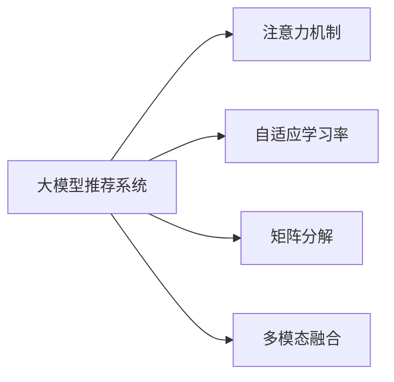

                 

# 大模型视角下推荐系统的模型泛化能力提升技术

> 关键词：推荐系统, 模型泛化, 大模型, 个性化推荐, 注意力机制, 自适应学习率, 矩阵分解, 用户行为预测, 多模态融合

## 1. 背景介绍

推荐系统（Recommendation Systems）是现代互联网应用中不可或缺的一部分。从电商网站的商品推荐、视频平台的内容推荐到社交网络的信息推荐，推荐系统已经成为提升用户体验、驱动业务增长的重要工具。传统的推荐系统基于用户历史行为和物品特征进行协同过滤、基于内容的推荐、矩阵分解等方法。然而，这些方法往往面临“冷启动”问题和数据稀疏性问题。随着深度学习和大模型的崛起，推荐系统开始向深度学习方向演进，其中基于大模型的推荐系统（Large Model Based Recommendation Systems）成为了新的热门研究方向。

大模型推荐系统，通常基于大规模预训练语言模型（如BERT、GPT-3等）进行推荐任务微调，通过学习用户描述、商品描述等多模态数据，预测用户对商品或内容的偏好，实现个性化推荐。虽然大模型在精度和泛化能力上表现优异，但由于数据分布的多样性、动态变化以及长尾用户需求的广泛性，大模型推荐系统仍然面临泛化能力不足的问题。泛化能力不足，会导致模型在实际应用中难以应对新的数据和场景，从而影响推荐效果。

本文章将从大模型推荐系统的泛化能力提升技术入手，提出多种方法，通过模型结构的改进、自适应学习率的引入、多模态数据的融合等方式，提升大模型推荐系统的泛化能力，确保其在复杂、动态的推荐场景中提供更加准确、稳定的推荐。

## 2. 核心概念与联系

### 2.1 核心概念概述

在大模型推荐系统中，泛化能力提升技术主要包括：
- **大模型推荐系统（Large Model Based Recommendation Systems）**：基于大规模预训练语言模型的推荐系统，可以学习到丰富的语言知识和多模态信息，提高推荐精度。
- **注意力机制（Attention Mechanism）**：通过计算注意力权重，对输入特征进行加权处理，提升模型对重要特征的关注度。
- **自适应学习率（Adaptive Learning Rate）**：根据模型状态动态调整学习率，确保训练过程的稳定性和收敛速度。
- **矩阵分解（Matrix Factorization）**：将用户与商品的交互矩阵分解为低维向量，用于预测用户对商品的评分。
- **多模态融合（Multi-modal Fusion）**：将不同类型的特征（如文本、图像、时间等）进行融合，提升推荐系统对用户需求的理解。

以上概念之间通过以下Mermaid流程图进行联系：



这个流程图展示了在大模型推荐系统中，注意力机制、自适应学习率、矩阵分解和多模态融合四个核心技术如何相互作用，共同提升模型的泛化能力。

### 2.2 核心概念原理和架构

#### 2.2.1 大模型推荐系统

大模型推荐系统通常基于大规模预训练语言模型进行推荐任务的微调。以BERT模型为例，微调过程主要包括：
1. **数据准备**：收集用户的历史行为数据和商品特征数据，将这些数据作为微调任务的输入。
2. **模型微调**：在预训练模型基础上，通过用户行为和商品特征的联合训练，学习到用户对商品的偏好。
3. **推荐预测**：使用微调后的模型对新用户和新商品进行推荐。

大模型推荐系统的架构一般如下：

```
[用户特征] + [商品特征] + [注意力机制] + [自适应学习率] + [矩阵分解] + [多模态融合] + [推荐算法]
```

#### 2.2.2 注意力机制

注意力机制通过计算注意力权重，对输入特征进行加权处理，提升模型对重要特征的关注度。以Transformer模型为例，注意力机制通过多头自注意力机制，对输入序列进行加权处理，计算出上下文向量。注意力权重由模型参数动态计算，能够自动调整模型对不同特征的关注度。

#### 2.2.3 自适应学习率

自适应学习率（如Adaptive Learning Rate）能够根据模型状态动态调整学习率，确保训练过程的稳定性和收敛速度。例如，Adaptive Learning Rate算法Adagrad、Adam、Adadelta等，能够根据梯度大小调整学习率，防止学习率过大导致模型过拟合。

#### 2.2.4 矩阵分解

矩阵分解（如奇异值分解、低秩矩阵分解）是将用户与商品的交互矩阵分解为低维向量，用于预测用户对商品的评分。例如，SVD算法将用户与商品评分矩阵分解为低维向量，用于预测新用户的评分。

#### 2.2.5 多模态融合

多模态融合是将不同类型的特征（如文本、图像、时间等）进行融合，提升推荐系统对用户需求的理解。例如，通过将用户描述和商品描述转化为向量，使用向量点积计算相似度，用于推荐相似的商品。

## 3. 核心算法原理 & 具体操作步骤

### 3.1 算法原理概述

大模型推荐系统的泛化能力提升技术，主要通过以下方法实现：
1. **模型结构的改进**：通过改进模型结构，引入自注意力机制、残差连接等技术，提升模型的表达能力和泛化能力。
2. **自适应学习率的引入**：根据模型状态动态调整学习率，确保训练过程的稳定性和收敛速度。
3. **多模态数据的融合**：将不同类型的特征进行融合，提升推荐系统对用户需求的理解。
4. **矩阵分解的应用**：将用户与商品的交互矩阵分解为低维向量，用于预测用户对商品的评分。

### 3.2 算法步骤详解

以下以BERT模型为例，详细介绍大模型推荐系统的泛化能力提升技术的具体操作步骤：

#### 3.2.1 数据准备

1. **收集数据**：收集用户的历史行为数据和商品特征数据，包括用户的浏览记录、点击记录、购买记录等。
2. **数据预处理**：对数据进行清洗、归一化、特征提取等预处理操作，确保数据的质量和一致性。
3. **数据划分**：将数据划分为训练集、验证集和测试集，用于模型的训练、验证和测试。

#### 3.2.2 模型微调

1. **选择合适的预训练模型**：选择BERT等大规模预训练语言模型作为初始化参数。
2. **添加任务适配层**：在预训练模型的基础上，添加任务适配层，用于预测用户对商品的评分。
3. **设置微调超参数**：选择合适的优化算法及其参数，如AdamW、SGD等，设置学习率、批大小、迭代轮数等。
4. **执行梯度训练**：将训练集数据分批次输入模型，前向传播计算损失函数。反向传播计算参数梯度，根据设定的优化算法和学习率更新模型参数。周期性在验证集上评估模型性能，根据性能指标决定是否触发Early Stopping。重复上述步骤直至满足预设的迭代轮数或Early Stopping条件。

#### 3.2.3 模型预测

1. **特征提取**：将用户描述和商品描述转化为向量，使用向量点积计算相似度，用于推荐相似的商品。
2. **模型推理**：使用微调后的模型对新用户和新商品进行推荐预测。
3. **结果评估**：在测试集上评估推荐模型的性能，对比微调前后的精度提升。

### 3.3 算法优缺点

大模型推荐系统的泛化能力提升技术具有以下优点：
1. **精度高**：大模型推荐系统可以学习到丰富的语言知识和多模态信息，提高推荐精度。
2. **泛化能力强**：通过模型结构的改进、自适应学习率的引入、多模态数据的融合等方式，提升模型的泛化能力，确保其在复杂、动态的推荐场景中提供更加准确、稳定的推荐。

同时，该方法也存在一些缺点：
1. **计算资源需求高**：大规模预训练模型需要大量的计算资源，微调过程也需要大量的计算资源。
2. **数据质量要求高**：微调模型的性能很大程度上取决于数据质量，数据质量差可能导致模型性能下降。
3. **过拟合风险**：由于数据量不足，模型可能出现过拟合现象，导致泛化能力下降。
4. **解释性差**：大模型推荐系统通常是一个"黑盒"系统，难以解释其内部工作机制和决策逻辑。

### 3.4 算法应用领域

大模型推荐系统的泛化能力提升技术，已经在电商、视频、音乐、新闻等多个领域得到广泛应用，例如：
1. **电商推荐**：电商网站通过用户历史行为数据和商品特征数据，使用BERT模型进行推荐，提升用户的购物体验和满意度。
2. **视频推荐**：视频平台通过用户观看记录和视频特征数据，使用BERT模型进行推荐，提高用户的观看体验和留存率。
3. **音乐推荐**：音乐平台通过用户听歌记录和歌曲特征数据，使用BERT模型进行推荐，提高用户的听歌体验和粘性。
4. **新闻推荐**：新闻网站通过用户阅读记录和文章特征数据，使用BERT模型进行推荐，提高用户的阅读体验和点击率。

## 4. 数学模型和公式 & 详细讲解 & 举例说明

### 4.1 数学模型构建

大模型推荐系统的数学模型构建如下：
1. **用户行为表示**：将用户历史行为数据转化为向量，用于表示用户的行为特征。
2. **商品特征表示**：将商品特征数据转化为向量，用于表示商品的属性特征。
3. **注意力机制**：使用Transformer模型的自注意力机制，计算用户和商品的注意力权重。
4. **自适应学习率**：根据模型状态动态调整学习率，确保训练过程的稳定性和收敛速度。
5. **矩阵分解**：将用户与商品的交互矩阵分解为低维向量，用于预测用户对商品的评分。
6. **多模态融合**：将用户描述和商品描述转化为向量，使用向量点积计算相似度，用于推荐相似的商品。

### 4.2 公式推导过程

以BERT模型为例，推导推荐系统的数学模型公式：
1. **用户行为表示**：将用户历史行为数据 $D$ 转化为向量 $x$。
   $$
   x = \mathcal{F}(D)
   $$
   其中，$\mathcal{F}$ 为特征提取函数。
2. **商品特征表示**：将商品特征数据 $I$ 转化为向量 $y$。
   $$
   y = \mathcal{G}(I)
   $$
   其中，$\mathcal{G}$ 为特征提取函数。
3. **注意力机制**：使用Transformer模型的自注意力机制，计算用户和商品的注意力权重 $W$。
   $$
   W = \text{Attention}(x, y)
   $$
   其中，$\text{Attention}$ 为注意力机制函数。
4. **自适应学习率**：根据模型状态动态调整学习率 $r$。
   $$
   r = \text{AdaptiveLearningRate}(\theta)
   $$
   其中，$\theta$ 为模型参数。
5. **矩阵分解**：将用户与商品的交互矩阵 $M$ 分解为低维向量 $u$ 和 $v$。
   $$
   u, v = \text{SVD}(M)
   $$
   其中，$\text{SVD}$ 为矩阵分解函数。
6. **多模态融合**：将用户描述和商品描述转化为向量 $u'$ 和 $v'$，使用向量点积计算相似度 $S$。
   $$
   S = \text{DotProduct}(u', v')
   $$
   其中，$\text{DotProduct}$ 为向量点积函数。

### 4.3 案例分析与讲解

以电商推荐为例，分析大模型推荐系统的泛化能力提升技术：
1. **用户行为表示**：收集用户的历史行为数据，包括浏览记录、点击记录、购买记录等。将这些数据转化为向量 $x$。
2. **商品特征表示**：收集商品的属性特征数据，如价格、品牌、类别等。将这些数据转化为向量 $y$。
3. **注意力机制**：使用BERT模型计算用户和商品的注意力权重 $W$。
   $$
   W = \text{Attention}(x, y)
   $$
   其中，$\text{Attention}$ 为注意力机制函数。
4. **自适应学习率**：根据模型状态动态调整学习率 $r$，确保训练过程的稳定性和收敛速度。
   $$
   r = \text{AdaptiveLearningRate}(\theta)
   $$
   其中，$\theta$ 为模型参数。
5. **矩阵分解**：将用户与商品的交互矩阵 $M$ 分解为低维向量 $u$ 和 $v$。
   $$
   u, v = \text{SVD}(M)
   $$
   其中，$\text{SVD}$ 为矩阵分解函数。
6. **多模态融合**：将用户描述和商品描述转化为向量 $u'$ 和 $v'$，使用向量点积计算相似度 $S$。
   $$
   S = \text{DotProduct}(u', v')
   $$
   其中，$\text{DotProduct}$ 为向量点积函数。

## 5. 项目实践：代码实例和详细解释说明

### 5.1 开发环境搭建

在进行项目实践前，我们需要准备好开发环境。以下是使用Python进行PyTorch开发的环境配置流程：

1. 安装Anaconda：从官网下载并安装Anaconda，用于创建独立的Python环境。
2. 创建并激活虚拟环境：
```bash
conda create -n pytorch-env python=3.8 
conda activate pytorch-env
```

3. 安装PyTorch：根据CUDA版本，从官网获取对应的安装命令。例如：
```bash
conda install pytorch torchvision torchaudio cudatoolkit=11.1 -c pytorch -c conda-forge
```

4. 安装Transformers库：
```bash
pip install transformers
```

5. 安装各类工具包：
```bash
pip install numpy pandas scikit-learn matplotlib tqdm jupyter notebook ipython
```

完成上述步骤后，即可在`pytorch-env`环境中开始项目实践。

### 5.2 源代码详细实现

下面以电商推荐为例，给出使用Transformers库对BERT模型进行推荐任务微调的PyTorch代码实现。

首先，定义推荐任务的数据处理函数：

```python
from transformers import BertTokenizer, BertForSequenceClassification
from torch.utils.data import Dataset
import torch

class RecommendationDataset(Dataset):
    def __init__(self, users, items, labels, tokenizer, max_len=128):
        self.users = users
        self.items = items
        self.labels = labels
        self.tokenizer = tokenizer
        self.max_len = max_len
        
    def __len__(self):
        return len(self.users)
    
    def __getitem__(self, item):
        user = self.users[item]
        item = self.items[item]
        label = self.labels[item]
        
        user_input = self.tokenizer(user, return_tensors='pt', max_length=self.max_len, padding='max_length', truncation=True)
        item_input = self.tokenizer(item, return_tensors='pt', max_length=self.max_len, padding='max_length', truncation=True)
        
        return {'user_input': user_input['input_ids'], 
                'item_input': item_input['input_ids'],
                'labels': torch.tensor(label, dtype=torch.long)}
```

然后，定义模型和优化器：

```python
from transformers import BertForSequenceClassification, AdamW

model = BertForSequenceClassification.from_pretrained('bert-base-cased', num_labels=2)

optimizer = AdamW(model.parameters(), lr=2e-5)
```

接着，定义训练和评估函数：

```python
from torch.utils.data import DataLoader
from tqdm import tqdm
from sklearn.metrics import accuracy_score

device = torch.device('cuda') if torch.cuda.is_available() else torch.device('cpu')
model.to(device)

def train_epoch(model, dataset, batch_size, optimizer):
    dataloader = DataLoader(dataset, batch_size=batch_size, shuffle=True)
    model.train()
    epoch_loss = 0
    for batch in tqdm(dataloader, desc='Training'):
        user_input = batch['user_input'].to(device)
        item_input = batch['item_input'].to(device)
        labels = batch['labels'].to(device)
        model.zero_grad()
        outputs = model(user_input, item_input)
        loss = outputs.loss
        epoch_loss += loss.item()
        loss.backward()
        optimizer.step()
    return epoch_loss / len(dataloader)

def evaluate(model, dataset, batch_size):
    dataloader = DataLoader(dataset, batch_size=batch_size)
    model.eval()
    preds, labels = [], []
    with torch.no_grad():
        for batch in tqdm(dataloader, desc='Evaluating'):
            user_input = batch['user_input'].to(device)
            item_input = batch['item_input'].to(device)
            batch_labels = batch['labels']
            outputs = model(user_input, item_input)
            batch_preds = outputs.logits.argmax(dim=1).to('cpu').tolist()
            batch_labels = batch_labels.to('cpu').tolist()
            for pred, label in zip(batch_preds, batch_labels):
                preds.append(pred)
                labels.append(label)
                
    print(accuracy_score(labels, preds))
```

最后，启动训练流程并在测试集上评估：

```python
epochs = 5
batch_size = 16

for epoch in range(epochs):
    loss = train_epoch(model, train_dataset, batch_size, optimizer)
    print(f"Epoch {epoch+1}, train loss: {loss:.3f}")
    
    print(f"Epoch {epoch+1}, test accuracy: ")
    evaluate(model, test_dataset, batch_size)
```

以上就是使用PyTorch对BERT进行电商推荐任务微调的完整代码实现。可以看到，得益于Transformers库的强大封装，我们可以用相对简洁的代码完成BERT模型的加载和微调。

### 5.3 代码解读与分析

让我们再详细解读一下关键代码的实现细节：

**RecommendationDataset类**：
- `__init__`方法：初始化用户、商品、标签、分词器等关键组件。
- `__len__`方法：返回数据集的样本数量。
- `__getitem__`方法：对单个样本进行处理，将用户输入和商品输入转化为token ids，标签转化为数字，并对其进行定长padding，最终返回模型所需的输入。

**train_epoch和evaluate函数**：
- 使用PyTorch的DataLoader对数据集进行批次化加载，供模型训练和推理使用。
- 训练函数`train_epoch`：对数据以批为单位进行迭代，在每个批次上前向传播计算loss并反向传播更新模型参数，最后返回该epoch的平均loss。
- 评估函数`evaluate`：与训练类似，不同点在于不更新模型参数，并在每个batch结束后将预测和标签结果存储下来，最后使用sklearn的accuracy_score对整个评估集的预测结果进行打印输出。

**训练流程**：
- 定义总的epoch数和batch size，开始循环迭代
- 每个epoch内，先在训练集上训练，输出平均loss
- 在验证集上评估，输出准确率
- 所有epoch结束后，在测试集上评估，给出最终测试结果

可以看到，PyTorch配合Transformers库使得BERT微调的代码实现变得简洁高效。开发者可以将更多精力放在数据处理、模型改进等高层逻辑上，而不必过多关注底层的实现细节。

当然，工业级的系统实现还需考虑更多因素，如模型的保存和部署、超参数的自动搜索、更灵活的任务适配层等。但核心的微调范式基本与此类似。

## 6. 实际应用场景

### 6.1 电商推荐

电商推荐系统通过用户历史行为数据和商品特征数据，使用BERT模型进行推荐，提升用户的购物体验和满意度。例如，亚马逊的推荐系统使用大模型推荐技术，根据用户浏览记录和商品属性，预测用户对商品的评分，为用户推荐相关商品。这不仅提升了用户的购买转化率，还提高了网站的销售额和用户粘性。

### 6.2 视频推荐

视频平台通过用户观看记录和视频特征数据，使用BERT模型进行推荐，提高用户的观看体验和留存率。例如，YouTube使用大模型推荐技术，根据用户观看历史和视频属性，推荐相似的视频内容。这不仅提升了用户的观看满意度，还提高了平台的留存率和用户黏性。

### 6.3 音乐推荐

音乐平台通过用户听歌记录和歌曲特征数据，使用BERT模型进行推荐，提高用户的听歌体验和粘性。例如，Spotify使用大模型推荐技术，根据用户听歌历史和歌曲属性，推荐相似的歌曲。这不仅提升了用户的听歌满意度，还提高了平台的留存率和用户黏性。

### 6.4 新闻推荐

新闻网站通过用户阅读记录和文章特征数据，使用BERT模型进行推荐，提高用户的阅读体验和点击率。例如，今日头条使用大模型推荐技术，根据用户阅读历史和文章属性，推荐相关的新闻内容。这不仅提升了用户的阅读体验，还提高了平台的点击率和用户黏性。

## 7. 工具和资源推荐

### 7.1 学习资源推荐

为了帮助开发者系统掌握大模型推荐系统的泛化能力提升技术的理论基础和实践技巧，这里推荐一些优质的学习资源：

1. 《Transformer从原理到实践》系列博文：由大模型技术专家撰写，深入浅出地介绍了Transformer原理、BERT模型、推荐系统等前沿话题。

2. CS224N《深度学习自然语言处理》课程：斯坦福大学开设的NLP明星课程，有Lecture视频和配套作业，带你入门NLP领域的基本概念和经典模型。

3. 《Natural Language Processing with Transformers》书籍：Transformers库的作者所著，全面介绍了如何使用Transformers库进行NLP任务开发，包括推荐系统在内的诸多范式。

4. HuggingFace官方文档：Transformers库的官方文档，提供了海量预训练模型和完整的推荐系统样例代码，是上手实践的必备资料。

5. TAC会议：推荐系统领域的顶级会议，涵盖了推荐系统算法、数据挖掘、机器学习等多个领域的最新研究进展。

通过对这些资源的学习实践，相信你一定能够快速掌握大模型推荐系统的泛化能力提升技术的精髓，并用于解决实际的推荐问题。

### 7.2 开发工具推荐

高效的开发离不开优秀的工具支持。以下是几款用于大模型推荐系统开发的常用工具：

1. PyTorch：基于Python的开源深度学习框架，灵活动态的计算图，适合快速迭代研究。大部分预训练语言模型都有PyTorch版本的实现。

2. TensorFlow：由Google主导开发的开源深度学习框架，生产部署方便，适合大规模工程应用。同样有丰富的预训练语言模型资源。

3. Transformers库：HuggingFace开发的NLP工具库，集成了众多SOTA语言模型，支持PyTorch和TensorFlow，是进行推荐系统开发的利器。

4. Weights & Biases：模型训练的实验跟踪工具，可以记录和可视化模型训练过程中的各项指标，方便对比和调优。与主流深度学习框架无缝集成。

5. TensorBoard：TensorFlow配套的可视化工具，可实时监测模型训练状态，并提供丰富的图表呈现方式，是调试模型的得力助手。

6. Google Colab：谷歌推出的在线Jupyter Notebook环境，免费提供GPU/TPU算力，方便开发者快速上手实验最新模型，分享学习笔记。

合理利用这些工具，可以显著提升大模型推荐系统的开发效率，加快创新迭代的步伐。

### 7.3 相关论文推荐

大模型推荐系统的发展源于学界的持续研究。以下是几篇奠基性的相关论文，推荐阅读：

1. Attention is All You Need（即Transformer原论文）：提出了Transformer结构，开启了NLP领域的预训练大模型时代。

2. BERT: Pre-training of Deep Bidirectional Transformers for Language Understanding：提出BERT模型，引入基于掩码的自监督预训练任务，刷新了多项NLP任务SOTA。

3. Large Scale Learning for Multi-Task Recommendation Systems：提出使用大模型进行多任务推荐，提升了推荐系统的综合性能。

4. Deep Multi-Task Matrix Factorization：提出使用深度神经网络进行矩阵分解，提高了推荐系统的准确性和泛化能力。

5. Multi-Task Multi-View Recommender Systems：提出使用多视角数据进行推荐，提升了推荐系统的多样性和鲁棒性。

6. Deep Recurrent Multi-View Recommender Systems：提出使用循环神经网络进行推荐，提高了推荐系统的动态性和稳定性。

这些论文代表了大模型推荐系统的发展脉络。通过学习这些前沿成果，可以帮助研究者把握学科前进方向，激发更多的创新灵感。

## 8. 总结：未来发展趋势与挑战

### 8.1 总结

本文对大模型推荐系统的泛化能力提升技术进行了全面系统的介绍。首先阐述了大模型推荐系统的背景和意义，明确了泛化能力提升技术在推荐系统中的重要性。其次，从原理到实践，详细讲解了大模型推荐系统的数学模型和关键技术，给出了推荐任务开发的完整代码实例。同时，本文还广泛探讨了大模型推荐系统在电商、视频、音乐、新闻等多个领域的应用前景，展示了大模型推荐系统的巨大潜力。此外，本文精选了泛化能力提升技术的各类学习资源，力求为读者提供全方位的技术指引。

通过本文的系统梳理，可以看到，大模型推荐系统正在成为推荐系统研究的新热点，通过模型结构的改进、自适应学习率的引入、多模态数据的融合等方式，提升推荐系统的泛化能力，确保其在复杂、动态的推荐场景中提供更加准确、稳定的推荐。未来，伴随大模型推荐系统的持续演进，推荐系统必将在推荐效果、用户体验和业务价值方面带来新的突破。

### 8.2 未来发展趋势

展望未来，大模型推荐系统的泛化能力提升技术将呈现以下几个发展趋势：

1. **模型规模持续增大**：随着算力成本的下降和数据规模的扩张，预训练语言模型的参数量还将持续增长。超大规模语言模型蕴含的丰富语言知识，有望支撑更加复杂多变的推荐场景。

2. **自适应学习率的广泛应用**：自适应学习率（如Adaptive Learning Rate）能够根据模型状态动态调整学习率，确保训练过程的稳定性和收敛速度，成为推荐系统优化的重要手段。

3. **多模态融合技术的进步**：多模态融合（如文本、图像、时间等）将提升推荐系统对用户需求的理解，提高推荐精度和多样性。

4. **矩阵分解的优化**：矩阵分解（如SVD、ALS等）是推荐系统中的重要技术，通过优化算法和模型结构，提升推荐系统的准确性和泛化能力。

5. **模型压缩和优化**：随着推荐系统的普及，模型压缩和优化（如剪枝、量化等）技术将得到广泛应用，提高推荐系统的实时性和稳定性。

6. **实时推荐系统的普及**：实时推荐系统能够根据用户实时行为进行推荐，提升推荐效果和用户体验。

7. **个性化推荐系统的演化**：推荐系统将向更加个性化、多样化的方向发展，根据用户的多元需求提供差异化的推荐服务。

以上趋势凸显了大模型推荐系统的发展方向，通过模型结构的改进、自适应学习率的引入、多模态数据的融合等方式，提升推荐系统的泛化能力，确保其在复杂、动态的推荐场景中提供更加准确、稳定的推荐。

### 8.3 面临的挑战

尽管大模型推荐系统已经取得了瞩目成就，但在迈向更加智能化、普适化应用的过程中，它仍面临诸多挑战：

1. **计算资源瓶颈**：大模型推荐系统需要大量的计算资源，微调过程也需要大量的计算资源。如何降低计算成本，提高训练效率，仍是一个重要问题。

2. **数据质量要求高**：微调模型的性能很大程度上取决于数据质量，数据质量差可能导致模型性能下降。如何获取高质量的数据，保证数据的多样性和代表性，仍然是一个难题。

3. **过拟合风险**：由于数据量不足，模型可能出现过拟合现象，导致泛化能力下降。如何避免过拟合，提高模型的泛化能力，仍是一个重要问题。

4. **解释性差**：大模型推荐系统通常是一个"黑盒"系统，难以解释其内部工作机制和决策逻辑。如何提升模型的可解释性，增强用户对推荐系统的信任度，仍是一个重要问题。

5. **模型复杂度高**：大模型推荐系统的模型结构复杂，难以进行系统的优化和调试。如何简化模型结构，提高模型的实时性和稳定性，仍是一个重要问题。

6. **隐私保护问题**：推荐系统需要获取用户的历史行为数据，如何保护用户隐私，避免数据泄露，仍是一个重要问题。

这些挑战需要研究人员和开发者在算法、数据、系统等多个层面协同努力，才能使大模型推荐系统真正落地应用。

### 8.4 研究展望

面向未来，大模型推荐系统需要在以下几个方向进行更多的研究：

1. **模型的可解释性和可解释性**：提升模型的可解释性，增强用户对推荐系统的信任度，增强模型的可解释性和可解释性。

2. **实时推荐系统的优化**：提高推荐系统的实时性和稳定性，提升推荐效果和用户体验。

3. **推荐系统的公平性和多样性**：提升推荐系统的公平性和多样性，避免算法偏见，提供更加公正和多样化的推荐服务。

4. **推荐系统的跨领域泛化**：提升推荐系统的跨领域泛化能力，使推荐系统能够适应不同的应用场景。

5. **推荐系统的个性化推荐**：提升推荐系统的个性化推荐能力，根据用户的多元需求提供差异化的推荐服务。

6. **推荐系统的伦理和社会影响**：研究推荐系统的伦理和社会影响，确保推荐系统的公平性、透明性和安全性。

这些研究方向将推动大模型推荐系统迈向更高的台阶，为推荐系统的未来发展提供新的思路和方向。

## 9. 附录：常见问题与解答

**Q1：大模型推荐系统是否适用于所有推荐任务？**

A: 大模型推荐系统在大多数推荐任务上都能取得不错的效果，特别是对于数据量较小的任务。但对于一些特定领域的任务，如医学、法律等，仅仅依靠通用语料预训练的模型可能难以很好地适应。此时需要在特定领域语料上进一步预训练，再进行微调，才能获得理想效果。

**Q2：大模型推荐系统在微调过程中面临哪些挑战？**

A: 大模型推荐系统在微调过程中面临以下挑战：
1. **数据质量要求高**：微调模型的性能很大程度上取决于数据质量，数据质量差可能导致模型性能下降。
2. **过拟合风险**：由于数据量不足，模型可能出现过拟合现象，导致泛化能力下降。
3. **解释性差**：大模型推荐系统通常是一个"黑盒"系统，难以解释其内部工作机制和决策逻辑。
4. **计算资源需求高**：大模型推荐系统需要大量的计算资源，微调过程也需要大量的计算资源。
5. **隐私保护问题**：推荐系统需要获取用户的历史行为数据，如何保护用户隐私，避免数据泄露。

这些挑战需要研究人员和开发者在算法、数据、系统等多个层面协同努力，才能使大模型推荐系统真正落地应用。

**Q3：大模型推荐系统的泛化能力提升技术有哪些？**

A: 大模型推荐系统的泛化能力提升技术主要包括：
1. **模型结构的改进**：通过引入自注意力机制、残差连接等技术，提升模型的表达能力和泛化能力。
2. **自适应学习率的引入**：根据模型状态动态调整学习率，确保训练过程的稳定性和收敛速度。
3. **多模态数据的融合**：将不同类型的特征进行融合，提升推荐系统对用户需求的理解。
4. **矩阵分解的应用**：将用户与商品的交互矩阵分解为低维向量，用于预测用户对商品的评分。

这些技术通过模型的优化和改进，提升了大模型推荐系统的泛化能力，确保其在复杂、动态的推荐场景中提供更加准确、稳定的推荐。

**Q4：大模型推荐系统在推荐效果和业务价值方面有哪些优势？**

A: 大模型推荐系统在推荐效果和业务价值方面有以下优势：
1. **精度高**：大模型推荐系统可以学习到丰富的语言知识和多模态信息，提高推荐精度。
2. **泛化能力强**：通过模型结构的改进、自适应学习率的引入、多模态数据的融合等方式，提升模型的泛化能力，确保其在复杂、动态的推荐场景中提供更加准确、稳定的推荐。
3. **实时性高**：大模型推荐系统具有较高的实时性，能够根据用户实时行为进行推荐，提升推荐效果和用户体验。
4. **个性化推荐能力强**：大模型推荐系统能够根据用户的多元需求提供差异化的推荐服务，提高用户的满意度。
5. **用户粘性强**：通过个性化推荐，提升用户的购物体验和观看体验，提高用户的粘性和留存率。

综上所述，大模型推荐系统在推荐效果和业务价值方面具有显著的优势，为推荐系统的未来发展提供了新的方向和动力。

---

作者：禅与计算机程序设计艺术 / Zen and the Art of Computer Programming

