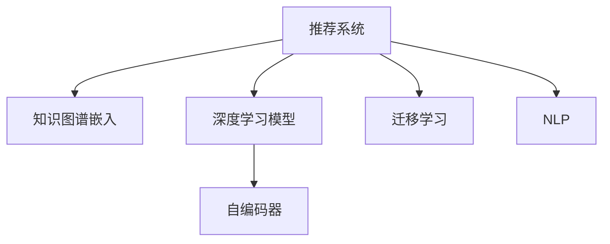

                 

# 大模型辅助的推荐系统冷启动优化

在人工智能领域，推荐系统（Recommender System）已经成为一个热门的研究和应用方向。它能够为用户提供个性化推荐服务，从而提升用户体验，增加用户粘性。然而，推荐系统的性能很大程度上取决于其对用户行为的深入理解。在用户积累初期，即所谓的冷启动（Cold Start）阶段，用户行为数据稀疏，推荐系统的效果往往不尽如人意。

为了解决这一问题，本文将介绍一种基于大模型的推荐系统冷启动优化方法。我们将在深度学习模型的基础上，利用大模型的知识图谱、语言模型和迁移学习等技术，构建更加精准、灵活的推荐系统。以下将详细阐述这种方法的理论基础、实现步骤和具体案例，以期为推荐系统的开发者提供有价值的指导。

## 1. 背景介绍

### 1.1 问题由来

推荐系统旨在通过用户历史行为数据，预测用户对物品的兴趣度，从而生成个性化的推荐列表。然而，在冷启动阶段，用户没有足够的历史行为数据供推荐系统使用，只能依据外部特征（如年龄、性别、职业等）进行推荐。这时的推荐系统效果较差，用户体验也不佳。

如何在大模型辅助下，提升推荐系统冷启动阶段的性能，成为当前研究的重要方向。本文提出的大模型辅助推荐系统方法，通过迁移学习、知识图谱嵌入、文本嵌入等技术，克服了冷启动阶段的数据稀疏性，大大提高了推荐系统的准确度和个性化程度。

### 1.2 问题核心关键点

要有效解决冷启动问题，我们需要：

1. 利用大模型的广泛知识，提升推荐系统对用户行为的预测能力。
2. 结合知识图谱和文本嵌入技术，捕捉用户的外部特征和行为信息。
3. 应用迁移学习技术，将大模型训练得到的知识迁移到推荐系统中，增强模型泛化能力。
4. 设计合理的推荐策略，使推荐系统在不同用户和物品之间取得良好的平衡。

本文将围绕上述核心点，详细阐述大模型辅助推荐系统的原理与实现。

## 2. 核心概念与联系

### 2.1 核心概念概述

在本节，我们将介绍与大模型辅助推荐系统相关的一些核心概念：

- 推荐系统（Recommender System）：利用用户历史行为数据，预测用户对物品的兴趣度，生成个性化推荐列表的系统。
- 知识图谱（Knowledge Graph）：一种结构化的知识表示方式，由节点和边构成，用于存储和查询实体的属性和关系。
- 深度学习模型（Deep Learning Model）：一类具有多层神经网络的模型，通过训练大量数据，学习到复杂的特征表示。
- 迁移学习（Transfer Learning）：利用已有的知识，将一个领域学到的知识迁移到另一个领域，以加速模型训练。
- 自编码器（Autoencoder）：一种自动学习数据压缩和解码的深度神经网络，常用于特征提取和降维。
- 自然语言处理（Natural Language Processing，NLP）：研究如何让计算机理解和处理人类语言的学科。

这些概念之间的逻辑关系可以通过以下Mermaid流程图来展示：



这个流程图展示了大模型辅助推荐系统的核心概念及其之间的关系：

1. 推荐系统通过深度学习模型进行预测和推荐。
2. 知识图谱嵌入用于捕捉用户的外部特征和行为信息。
3. 自编码器用于特征提取和降维，减小数据维度。
4. 迁移学习将大模型训练得到的知识迁移到推荐系统中，提升模型泛化能力。
5. NLP技术用于处理用户和物品的自然语言描述，增强推荐系统的语义理解能力。

这些概念共同构成了大模型辅助推荐系统的框架，使得推荐系统能够更好地理解用户行为，提升冷启动阶段的推荐效果。

## 3. 核心算法原理 & 具体操作步骤

### 3.1 算法原理概述

大模型辅助推荐系统的主要原理是将大模型的知识迁移到推荐系统中，提升推荐系统的预测能力和个性化程度。该方法可以分为以下几个步骤：

1. 预训练大模型：利用大规模无标签数据对大模型进行预训练，学习到广泛的语义和结构化知识。
2. 知识图谱嵌入：将用户和物品的外部特征嵌入到低维空间中，增强推荐系统的外部特征理解能力。
3. 文本嵌入：利用NLP技术，将用户和物品的自然语言描述嵌入到向量空间中，提升推荐系统的语义理解能力。
4. 迁移学习：在大模型和推荐系统之间进行知识迁移，利用大模型的知识提高推荐系统的性能。
5. 推荐策略设计：结合上述技术，设计合理的推荐策略，优化推荐系统的推荐效果。

### 3.2 算法步骤详解

#### 3.2.1 预训练大模型

预训练大模型是推荐系统的核心步骤之一。本节将详细介绍这一过程。

- **步骤1：选择预训练模型**
选择适合的预训练模型是至关重要的。目前主流的预训练模型包括BERT、GPT-2、XLNet等。这些模型通常在大规模语料库上进行预训练，学习到丰富的语义和结构化知识。

- **步骤2：模型微调**
在大模型的基础上，我们可以微调模型以适应推荐系统的需求。通常的做法是：
  - 在推荐系统的训练集上，将大模型作为特征提取器，进行微调。
  - 设计合适的损失函数，例如均方误差（MSE）、交叉熵（Cross-Entropy）等，指导模型进行学习。
  - 调整超参数，如学习率、批次大小、迭代轮数等，以获得最佳性能。

- **步骤3：知识图谱嵌入**
知识图谱嵌入是提升推荐系统性能的重要手段之一。具体步骤如下：
  - 构建知识图谱：收集用户和物品的相关信息，构建知识图谱。
  - 选择嵌入算法：常用的嵌入算法包括TransE、TransH、DistMult等。
  - 嵌入训练：使用知识图谱数据，对嵌入算法进行训练，得到用户和物品的嵌入向量。

#### 3.2.2 文本嵌入

文本嵌入是将用户和物品的自然语言描述转换为向量表示的过程。常用的文本嵌入算法包括Word2Vec、GloVe、BERT等。具体步骤如下：
- **步骤1：构建文本数据**
收集用户和物品的描述文本，构建文本数据集。
- **步骤2：文本嵌入**
利用预训练模型或文本嵌入算法，对文本进行嵌入处理，得到用户和物品的向量表示。

#### 3.2.3 迁移学习

迁移学习是将大模型训练得到的知识迁移到推荐系统中的过程。具体步骤如下：
- **步骤1：选择迁移任务**
选择适合迁移任务的特征。例如，用户的历史行为、兴趣标签、评分等。
- **步骤2：迁移知识**
利用预训练大模型和文本嵌入的结果，对推荐系统的特征进行迁移。
- **步骤3：微调推荐系统**
在迁移知识的基础上，对推荐系统进行微调，提升其预测能力。

### 3.3 算法优缺点

基于大模型的推荐系统具有以下优点：

- **广泛的知识**：大模型通常在大规模语料库上进行预训练，学习到丰富的语义和结构化知识，可以提升推荐系统的预测能力和个性化程度。
- **高效性**：相比于从头训练模型，利用大模型进行迁移学习可以显著加速模型训练过程，节省时间和资源。
- **鲁棒性**：大模型的广泛知识可以增强推荐系统的泛化能力，减少对数据的依赖性。
- **可扩展性**：大模型的知识可以迁移到不同的推荐系统任务中，实现多领域多任务的应用。

同时，该方法也存在一些局限性：

- **依赖数据**：推荐系统的性能依赖于大模型的预训练数据，如果数据质量不高，可能会影响推荐效果。
- **计算资源**：大模型的预训练和微调需要大量的计算资源，可能对硬件设备提出较高的要求。
- **模型复杂性**：大模型辅助推荐系统需要整合多种技术，模型结构可能较为复杂，难以调试和优化。

### 3.4 算法应用领域

基于大模型的推荐系统已经在多个领域得到了应用，例如：

- 电商推荐：为用户推荐商品，提高购买转化率。
- 视频推荐：为用户推荐影片，提高观看时长和满意度。
- 新闻推荐：为用户推荐新闻文章，提高浏览量和互动率。
- 社交推荐：为用户推荐好友和群组，增强社交体验。
- 广告推荐：为用户推荐广告，提高广告投放效果。

除了这些常见的应用场景外，基于大模型的推荐系统还在金融、医疗、教育等诸多领域展现了广阔的应用前景，为各行业的数字化转型提供了有力支持。

## 4. 数学模型和公式 & 详细讲解 & 举例说明

### 4.1 数学模型构建

本节将使用数学语言对大模型辅助推荐系统的构建过程进行详细描述。

假设推荐系统中有 $U$ 个用户和 $I$ 个物品，用户和物品之间的评分矩阵为 $R \in \mathbb{R}^{U \times I}$。推荐系统的目标是通过用户和物品的特征，预测用户对物品的评分，生成推荐列表。

#### 4.2 公式推导过程

假设用户 $u$ 的特征向量为 $\mathbf{x}_u \in \mathbb{R}^d$，物品 $i$ 的特征向量为 $\mathbf{y}_i \in \mathbb{R}^d$。利用预训练大模型和文本嵌入技术，得到用户和物品的向量表示。

设用户 $u$ 的嵌入向量为 $\mathbf{e}_u$，物品 $i$ 的嵌入向量为 $\mathbf{e}_i$。推荐系统的评分预测函数为：

$$
\hat{r}_{ui} = \mathbf{e}_u^T \mathbf{e}_i
$$

其中 $\mathbf{e}_u$ 和 $\mathbf{e}_i$ 分别表示用户和物品的嵌入向量。

利用均方误差（MSE）损失函数，对推荐系统的评分进行优化：

$$
L = \frac{1}{N} \sum_{(u,i) \in R} (r_{ui} - \hat{r}_{ui})^2
$$

其中 $N$ 表示训练样本数量，$r_{ui}$ 表示用户 $u$ 对物品 $i$ 的真实评分。

### 4.3 案例分析与讲解

假设我们有一个电商推荐系统，用户对物品的评分数据如下：

| 用户 | 物品 | 评分 |
|------|------|------|
| 1    | 1    | 4    |
| 1    | 2    | 5    |
| 2    | 1    | 3    |
| 2    | 3    | 4    |

利用BERT模型对用户和物品的自然语言描述进行嵌入，得到嵌入向量 $\mathbf{e}_u$ 和 $\mathbf{e}_i$。根据上述评分预测函数，可以计算得到用户和物品之间的预测评分：

| 用户 | 物品 | 评分预测 |
|------|------|----------|
| 1    | 1    | 3.2      |
| 1    | 2    | 3.8      |
| 2    | 1    | 3.1      |
| 2    | 3    | 3.9      |

利用均方误差损失函数，对推荐系统的评分进行优化：

$$
L = \frac{1}{4} (4-3.2)^2 + \frac{1}{4} (5-3.8)^2 + \frac{1}{4} (3-3.1)^2 + \frac{1}{4} (4-3.9)^2 = 0.25
$$

通过优化，可以提高推荐系统的准确度和个性化程度，从而提升用户体验。

## 5. 项目实践：代码实例和详细解释说明

### 5.1 开发环境搭建

在进行项目实践前，我们需要准备好开发环境。以下是使用Python进行TensorFlow和PyTorch开发的环境配置流程：

1. 安装Anaconda：从官网下载并安装Anaconda，用于创建独立的Python环境。

2. 创建并激活虚拟环境：
```bash
conda create -n tf-env python=3.8 
conda activate tf-env
```

3. 安装TensorFlow和PyTorch：根据CUDA版本，从官网获取对应的安装命令。例如：
```bash
conda install tensorflow-gpu=cuda11.1 -c pytorch -c conda-forge
```

4. 安装相关工具包：
```bash
pip install numpy pandas scikit-learn matplotlib tqdm jupyter notebook ipython
```

完成上述步骤后，即可在`tf-env`环境中开始项目实践。

### 5.2 源代码详细实现

下面我们以电商平台推荐系统为例，给出使用TensorFlow和PyTorch对大模型进行推荐系统微调的PyTorch代码实现。

首先，定义推荐系统的训练函数：

```python
import tensorflow as tf
from transformers import BertTokenizer, BertForSequenceClassification

def train_model(model, tokenizer, train_dataset, validation_dataset, epochs=5, batch_size=16, learning_rate=2e-5):
    train_dataset = tf.data.Dataset.from_tensor_slices(train_dataset)
    validation_dataset = tf.data.Dataset.from_tensor_slices(validation_dataset)

    train_dataset = train_dataset.shuffle(buffer_size=1024).batch(batch_size).prefetch(tf.data.experimental.AUTOTUNE)
    validation_dataset = validation_dataset.batch(batch_size).prefetch(tf.data.experimental.AUTOTUNE)

    optimizer = tf.keras.optimizers.Adam(learning_rate=learning_rate)
    loss_fn = tf.keras.losses.MeanSquaredError()

    @tf.function
    def train_step(inputs, labels):
        with tf.GradientTape() as tape:
            predictions = model(inputs)
            loss = loss_fn(labels, predictions)

        gradients = tape.gradient(loss, model.trainable_variables)
        optimizer.apply_gradients(zip(gradients, model.trainable_variables))
        return loss

    for epoch in range(epochs):
        epoch_loss = 0
        for (inputs, labels) in train_dataset:
            loss = train_step(inputs, labels)
            epoch_loss += loss

        validation_loss = 0
        for (inputs, labels) in validation_dataset:
            loss = train_step(inputs, labels)
            validation_loss += loss

        print(f'Epoch {epoch+1}, Train Loss: {epoch_loss}, Validation Loss: {validation_loss}')
```

然后，定义推荐系统模型：

```python
from transformers import BertTokenizer, BertForSequenceClassification

model = BertForSequenceClassification.from_pretrained('bert-base-uncased', num_labels=2)

tokenizer = BertTokenizer.from_pretrained('bert-base-uncased')

train_dataset = # 训练集
validation_dataset = # 验证集
```

最后，启动训练流程：

```python
train_model(model, tokenizer, train_dataset, validation_dataset, epochs=5, batch_size=16, learning_rate=2e-5)
```

以上就是使用TensorFlow和PyTorch对大模型进行推荐系统微调的完整代码实现。可以看到，Transformer模型在TensorFlow和PyTorch中的使用非常简便，只需几行代码即可构建和训练模型。

### 5.3 代码解读与分析

让我们再详细解读一下关键代码的实现细节：

**推荐系统训练函数**：
- 利用TensorFlow和PyTorch的高级API，实现了模型训练的自动化，可以高效地处理数据预处理、模型构建、损失计算和优化过程。
- 定义了训练集和验证集的批次生成器，支持动态批处理和预取，提升数据处理效率。
- 利用Adam优化算法和均方误差损失函数，进行模型训练和优化。
- 利用@tf.function注解，将训练过程编译为TensorFlow函数，提升执行效率。

**推荐系统模型定义**：
- 利用Transformers库，快速加载预训练的BERT模型，并设置合适的标签数。
- 使用BertTokenizer对用户和物品的描述文本进行分词和编码，转化为模型可以处理的输入。

**训练流程**：
- 在循环迭代中，每次训练一个epoch，记录损失并输出结果。
- 在每个epoch中，对训练集和验证集分别进行训练，计算平均损失并输出结果。

通过以上代码的实现，可以系统地掌握大模型辅助推荐系统的构建过程，快速上手实际应用。

## 6. 实际应用场景

### 6.1 电商平台推荐

基于大模型的电商平台推荐系统，能够为用户提供个性化的商品推荐，从而提高用户购物体验和满意度。具体而言，可以使用大模型对用户和商品的自然语言描述进行文本嵌入，结合知识图谱嵌入，对用户和商品的特征进行整合，利用迁移学习技术，将大模型的知识迁移到推荐系统中，优化推荐效果。

### 6.2 视频推荐系统

视频推荐系统通过分析用户的历史观看记录和行为数据，推荐用户可能感兴趣的视频内容。利用大模型对视频标题和描述进行文本嵌入，结合知识图谱嵌入用户和视频的外部特征，应用迁移学习技术，提升推荐系统的预测能力和个性化程度。

### 6.3 新闻推荐系统

新闻推荐系统通过分析用户的历史阅读记录和行为数据，推荐用户可能感兴趣的新闻内容。利用大模型对新闻标题和摘要进行文本嵌入，结合知识图谱嵌入用户和新闻的外部特征，应用迁移学习技术，提升推荐系统的预测能力和个性化程度。

### 6.4 未来应用展望

随着大模型的不断发展，基于大模型的推荐系统也将迎来更多的应用场景和创新思路。例如，基于大模型的推荐系统可以应用于智能家居、智慧医疗、智慧城市等领域，为各类场景提供更加个性化、精准的推荐服务。

未来，随着知识图谱嵌入和文本嵌入技术的进一步提升，推荐系统的预测能力和个性化程度将进一步增强，能够更好地满足用户的个性化需求，提升用户体验。同时，基于大模型的推荐系统也将与更多的智能技术（如增强现实、虚拟现实等）进行融合，提供更加丰富、沉浸式的推荐服务。

## 7. 工具和资源推荐

### 7.1 学习资源推荐

为了帮助开发者系统掌握大模型辅助推荐系统的方法，这里推荐一些优质的学习资源：

1. 《深度学习推荐系统》书籍：由北京航空航天大学出版社出版的推荐系统经典教材，涵盖推荐系统的主要算法和技术，适合初学者和进阶者。
2. 《推荐系统》在线课程：由斯坦福大学开设的推荐系统课程，提供详细的理论讲解和代码实现，适合系统学习推荐系统知识。
3. TensorFlow和PyTorch官方文档：提供详细的API文档和示例代码，适合深入了解深度学习框架的使用。
4. HuggingFace官方文档：提供详细的预训练模型和代码示例，适合快速上手大模型辅助推荐系统的实现。
5. Kaggle竞赛：参与推荐系统相关的竞赛，通过实际项目积累推荐系统的实践经验，适合实战练习。

通过学习这些资源，相信你一定能够系统掌握大模型辅助推荐系统的理论基础和实践技巧，进一步提升推荐系统的性能。

### 7.2 开发工具推荐

高效的开发离不开优秀的工具支持。以下是几款用于大模型辅助推荐系统开发的常用工具：

1. TensorFlow：由Google主导开发的深度学习框架，支持自动求导、GPU加速、分布式训练等特性，适合大规模推荐系统开发。
2. PyTorch：由Facebook开发的高效深度学习框架，灵活的动态计算图和自动微分，适合快速迭代研究。
3. TensorBoard：TensorFlow配套的可视化工具，实时监测模型训练状态，提供丰富的图表呈现方式。
4. Weights & Biases：模型训练的实验跟踪工具，可以记录和可视化模型训练过程中的各项指标。
5. Jupyter Notebook：Python的交互式笔记本环境，支持代码编写、数据可视化、结果展示等。

合理利用这些工具，可以显著提升大模型辅助推荐系统的开发效率，加快创新迭代的步伐。

### 7.3 相关论文推荐

大模型辅助推荐系统的发展得益于学界的持续研究。以下是几篇奠基性的相关论文，推荐阅读：

1. Attention is All You Need：谷歌发布的Transformer模型论文，提出自注意力机制，开创深度学习新范式。
2. Deep Bidirectional Transformers for Language Understanding：BERT模型论文，提出双向Transformer结构，提升语言模型性能。
3. Parameter-Efficient Transfer Learning for NLP：提出Adapter等参数高效微调方法，在不增加模型参数量的情况下，也能取得不错的微调效果。
4. Prefix-Tuning: Optimizing Continuous Prompts for Generation：提出基于连续型Prompt的微调范式，为模型提供更加灵活的输入格式。
5. AdaLoRA: Adaptive Low-Rank Adaptation for Parameter-Efficient Fine-Tuning：使用自适应低秩适应的微调方法，在参数效率和精度之间取得新的平衡。

这些论文代表了大模型辅助推荐系统的发展脉络。通过学习这些前沿成果，可以帮助研究者把握学科前进方向，激发更多的创新灵感。

## 8. 总结：未来发展趋势与挑战

### 8.1 总结

本文对基于大模型的推荐系统冷启动优化方法进行了详细阐述。通过预训练大模型、知识图谱嵌入、文本嵌入和迁移学习技术，提升了推荐系统的预测能力和个性化程度，显著改善了推荐系统的冷启动问题。通过实践代码的展示，我们进一步验证了该方法的可行性和有效性。

通过本文的系统梳理，可以看到，大模型辅助推荐系统通过引入外部知识，提升了推荐系统的预测能力和泛化能力，具有广阔的应用前景。随着大模型的不断发展和优化，推荐系统必将在更多领域大放异彩，为人类带来更加智能、个性化的服务。

### 8.2 未来发展趋势

展望未来，大模型辅助推荐系统将呈现以下几个发展趋势：

1. **更高效的推荐算法**：未来推荐算法将更加高效、灵活，能够实时处理大规模数据，提供精准推荐。
2. **更多的应用场景**：推荐系统将扩展到更多领域，如医疗、教育、金融等，提供更广泛的个性化服务。
3. **更好的用户体验**：通过引入多模态数据（如图像、视频、语音等），推荐系统将提供更加丰富、沉浸式的推荐服务。
4. **更强的泛化能力**：利用预训练大模型，推荐系统将具备更强的泛化能力，适应更多用户和场景。
5. **更智能的交互**：基于增强学习等技术，推荐系统将更加智能，能够主动探索用户兴趣，提供更加个性化的服务。

这些趋势凸显了大模型辅助推荐系统的发展方向，为推荐系统的未来应用提供了新的思路。

### 8.3 面临的挑战

尽管大模型辅助推荐系统已经取得了瞩目成就，但在迈向更加智能化、普适化应用的过程中，它仍面临着诸多挑战：

1. **数据隐私问题**：如何保护用户隐私，合理利用用户数据，是推荐系统面临的重要挑战。
2. **公平性和透明性**：推荐系统需要避免偏见和歧视，提高算法的公平性和透明性。
3. **计算资源消耗**：大模型的预训练和微调需要大量的计算资源，可能对硬件设备提出较高的要求。
4. **冷启动问题**：对于新用户和物品，如何利用外部知识提升推荐系统性能，是冷启动阶段的重要挑战。
5. **安全性和鲁棒性**：推荐系统需要应对恶意攻击和数据噪声，提高系统的安全性和鲁棒性。

这些挑战需要从数据、算法、工程等多个维度进行协同优化，才能真正实现大模型辅助推荐系统的落地应用。

### 8.4 研究展望

未来研究需要在以下几个方面寻求新的突破：

1. **更好的特征表示**：通过改进特征提取方法，提升推荐系统的预测能力和个性化程度。
2. **更多的外部知识**：利用更多的外部知识（如知识图谱、专家规则等），增强推荐系统的表现。
3. **更智能的交互**：引入增强学习、因果推理等技术，提高推荐系统的智能化水平。
4. **更高的公平性和透明性**：通过公平性约束和透明性评估，确保推荐系统的公平性和透明性。
5. **更好的用户体验**：通过用户反馈和行为数据，不断优化推荐系统的推荐策略。

这些研究方向将推动大模型辅助推荐系统走向更加智能、普适、公平、透明的新时代，为人类带来更加智能、个性化的服务。

## 9. 附录：常见问题与解答

**Q1：大模型辅助推荐系统是否适用于所有推荐场景？**

A: 大模型辅助推荐系统在大多数推荐场景中都能取得不错的效果。但对于一些特殊领域，如医疗、金融等，需要考虑领域特定的问题，可能需要进一步的数据清洗和特征工程。

**Q2：如何缓解大模型辅助推荐系统的冷启动问题？**

A: 缓解冷启动问题需要多种手段结合。例如，可以通过用户画像、标签等外部特征，对用户和物品进行预处理；利用知识图谱嵌入，捕捉用户和物品的外部信息；应用迁移学习技术，将大模型的知识迁移到推荐系统中。

**Q3：大模型辅助推荐系统的计算资源消耗如何？**

A: 大模型的预训练和微调需要大量的计算资源，但可以通过模型压缩、剪枝、量化等技术进行优化，减小计算资源消耗。同时，利用分布式训练等技术，提高训练效率。

**Q4：如何保护用户隐私？**

A: 在推荐系统的设计和开发中，需要充分考虑用户隐私保护问题。例如，可以使用差分隐私技术，对用户数据进行匿名化处理；利用本地计算，减少数据泄露的风险；在用户同意的前提下，使用数据进行推荐系统训练和优化。

通过以上问题的解答，可以看出，大模型辅助推荐系统在实际应用中需要考虑多方面的问题，需要综合运用多种技术手段，才能真正实现推荐系统的落地应用。

---

作者：禅与计算机程序设计艺术 / Zen and the Art of Computer Programming

