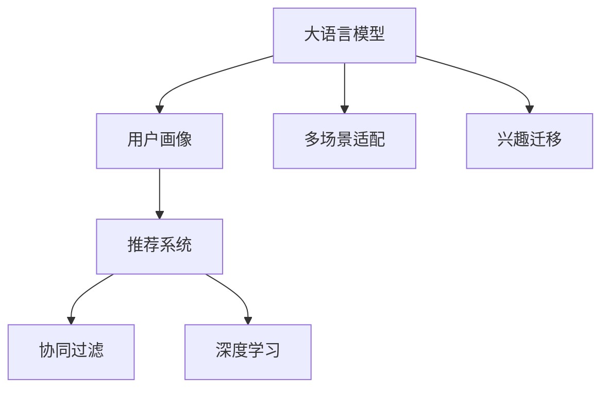

                 

# 大模型辅助的推荐系统多场景兴趣迁移

> 关键词：大语言模型,推荐系统,兴趣迁移,多场景适配,用户画像,协同过滤,深度学习

## 1. 背景介绍

### 1.1 问题由来
推荐系统是互联网时代的重要应用，通过分析用户历史行为和兴趣，为用户推荐个性化的内容或商品，极大地提升了用户体验和平台价值。随着用户数量的激增和内容的多样化，推荐系统的复杂度和个性化需求也日益增加，传统的协同过滤、基于内容的推荐等算法逐渐难以满足现实需求。

面对这些挑战，大语言模型提供了一种新的思路。大模型具备强大的语义理解能力和知识获取能力，能够通过自然语言理解用户需求和偏好，辅助推荐系统构建更全面、个性化的用户画像。通过利用大语言模型的多场景适配能力和丰富的语义信息，推荐系统可以在不同业务场景中实现跨领域迁移，提升推荐效果。

### 1.2 问题核心关键点
大语言模型辅助推荐系统，其核心在于利用模型的多场景适配能力，将通用知识与领域知识相结合，生成与用户兴趣高度相关的推荐结果。具体而言，关键点包括：

- 用户画像构建：利用大模型对用户历史行为和文本描述进行分析，生成多维度的用户画像，涵盖兴趣、行为、情感等多个方面。
- 多场景兴趣迁移：根据不同的业务场景和用户行为，动态调整推荐模型，实现多场景适配，提升推荐效果。
- 协同过滤与深度学习融合：结合传统协同过滤算法和深度学习技术，构建更加强大的推荐模型，提升推荐精度和覆盖率。

### 1.3 问题研究意义
大语言模型辅助的推荐系统，对于推动推荐技术的发展和应用具有重要意义：

1. 提高推荐精度：通过引入大模型，推荐系统可以更全面地理解用户需求，生成更精确的推荐结果。
2. 扩大推荐范围：利用大模型的多场景适配能力，推荐系统可以在不同的业务场景中实现跨领域迁移，提升推荐覆盖率。
3. 提升个性化水平：大模型具备强大的语义理解能力，能够更好地捕捉用户兴趣和情感，实现更高层次的个性化推荐。
4. 促进业务创新：通过引入先进的人工智能技术，推荐系统可以拓展应用边界，推动业务模式创新。
5. 优化用户体验：个性化推荐能够满足用户多样化的需求，提升用户的粘性和满意度。

## 2. 核心概念与联系

### 2.1 核心概念概述

为了更好地理解大语言模型在推荐系统中的应用，本节将介绍几个关键概念：

- 大语言模型(Large Language Model, LLM)：以Transformer为代表的预训练语言模型，通过在大规模文本数据上进行自监督学习，学习到丰富的语言知识和常识。
- 推荐系统(Recommender System)：通过分析用户历史行为和兴趣，为用户推荐个性化内容或商品的系统，旨在提升用户体验和平台价值。
- 用户画像(User Profile)：对用户兴趣、行为、情感等多个维度的综合描述，用于生成个性化的推荐结果。
- 协同过滤(Collaborative Filtering)：通过用户和物品的相似性匹配，生成推荐结果的算法。
- 深度学习(Deep Learning)：利用多层神经网络对数据进行深度抽象和分析，提升推荐系统的精度和效果。
- 多场景适配(Multi-scene Adaptation)：根据不同业务场景和用户需求，动态调整推荐模型，提升推荐效果。

这些核心概念之间的逻辑关系可以通过以下Mermaid流程图来展示：



这个流程图展示了不同概念之间的联系：

1. 大语言模型通过分析用户文本数据，生成用户画像，用于推荐系统的个性化推荐。
2. 推荐系统结合协同过滤和深度学习算法，生成推荐结果。
3. 大模型通过多场景适配和兴趣迁移技术，提升推荐系统在不同场景下的适应性。

## 3. 核心算法原理 & 具体操作步骤
### 3.1 算法原理概述

基于大语言模型的推荐系统，其核心思想是利用大模型的语义理解能力，构建多维度的用户画像，同时结合传统的协同过滤算法和深度学习技术，生成与用户兴趣高度相关的推荐结果。具体而言，主要包括以下几个步骤：

1. 构建用户画像：利用大模型对用户文本数据进行语义分析，提取用户兴趣、行为、情感等关键特征，构建多维度的用户画像。
2. 多场景适配：根据不同的业务场景和用户行为，动态调整推荐模型，实现多场景适配，提升推荐效果。
3. 兴趣迁移：通过大模型的多场景适配能力，将通用知识与领域知识相结合，生成与用户兴趣高度相关的推荐结果。

### 3.2 算法步骤详解

基于大语言模型的推荐系统一般包括以下几个关键步骤：

**Step 1: 构建用户画像**

- 收集用户的历史行为数据，如浏览记录、购买记录等，生成行为向量。
- 收集用户的文本描述，如评论、社交媒体帖子等，通过大模型提取语义特征，生成兴趣向量。
- 将行为向量和兴趣向量结合，生成多维度的用户画像。

**Step 2: 多场景适配**

- 根据业务场景，选择合适的推荐算法，如基于内容的推荐、协同过滤、深度学习等。
- 在多场景中，根据不同场景的特点，动态调整推荐算法和模型参数。

**Step 3: 兴趣迁移**

- 利用大模型的多场景适配能力，将通用知识与领域知识相结合，生成与用户兴趣高度相关的推荐结果。
- 引入的提示模板或参数微调方法，进一步提升推荐系统的泛化能力和鲁棒性。

### 3.3 算法优缺点

基于大语言模型的推荐系统，具有以下优点：

1. 提高推荐精度：大模型具备强大的语义理解能力，能够更好地捕捉用户兴趣和情感，提升推荐效果。
2. 扩大推荐范围：利用大模型的多场景适配能力，推荐系统可以在不同的业务场景中实现跨领域迁移，提升推荐覆盖率。
3. 提升个性化水平：大模型能够生成多维度的用户画像，实现更高层次的个性化推荐。
4. 促进业务创新：引入先进的人工智能技术，推动业务模式创新，拓展应用边界。
5. 优化用户体验：个性化推荐能够满足用户多样化的需求，提升用户的粘性和满意度。

同时，该方法也存在一定的局限性：

1. 依赖高质量数据：构建用户画像需要高质量的用户行为和文本数据，数据获取和处理成本较高。
2. 计算资源消耗大：大语言模型的计算开销较大，对硬件设备要求较高，需要较高的计算资源。
3. 过拟合风险：大模型的参数量较大，容易在局部最优解中过拟合。
4. 模型解释性不足：大模型作为"黑盒"系统，难以解释其内部工作机制和决策逻辑，可能影响用户信任。
5. 公平性和隐私问题：大模型的决策过程可能存在偏见，需要确保推荐系统的公平性和用户隐私保护。

尽管存在这些局限性，但就目前而言，基于大语言模型的推荐方法仍是大数据时代的重要范式。未来相关研究的重点在于如何进一步降低计算资源消耗，提高模型的可解释性和公平性，同时兼顾用户体验和用户隐私。

### 3.4 算法应用领域

基于大语言模型的推荐系统，在电子商务、在线媒体、社交网络等多个领域都得到了广泛应用，具体包括：

- 电子商务：个性化商品推荐、购物助手、智能客服等。利用大模型分析用户行为和文本数据，生成个性化推荐结果，提升用户购物体验。
- 在线媒体：个性化视频推荐、智能编辑等。通过分析用户历史观看记录和评论，生成个性化视频推荐，提升用户体验。
- 社交网络：个性化内容推荐、智能推荐系统等。利用大模型分析用户行为和文本数据，生成个性化内容推荐，提升用户粘性。

除了上述这些经典领域，大语言模型推荐系统还被创新性地应用于更多场景中，如智能家居、智慧城市、智能医疗等，为不同行业带来了新的商业机会和用户体验。

## 4. 数学模型和公式 & 详细讲解 & 举例说明

### 4.1 数学模型构建

为了更好地理解大语言模型在推荐系统中的应用，本节将通过数学语言对推荐系统构建过程进行更加严格的刻画。

记大语言模型为 $M_{\theta}$，其中 $\theta$ 为模型的参数。设用户 $u$ 的历史行为序列为 $I_u=\{x_1, x_2, ..., x_n\}$，文本描述序列为 $T_u=\{t_1, t_2, ..., t_m\}$。用户画像 $P_u$ 由行为特征 $I_u$ 和兴趣特征 $T_u$ 组成。推荐系统 $S$ 结合协同过滤算法和深度学习模型，生成推荐结果。

定义推荐系统 $S$ 在用户 $u$ 上生成物品 $i$ 的推荐概率为 $p_i(u)$，则推荐系统整体的推荐效果可以表示为：

$$
R = \sum_{u \in U} \sum_{i \in I} p_i(u) \times c_i
$$

其中 $U$ 为用户集合，$I$ 为物品集合，$c_i$ 为物品 $i$ 的点击率或评分。

### 4.2 公式推导过程

以下我们以协同过滤算法为例，推导推荐概率的计算公式。

假设协同过滤算法采用用户-物品的余弦相似度作为相似性度量，则用户 $u$ 对物品 $i$ 的推荐概率 $p_i(u)$ 可以表示为：

$$
p_i(u) = \frac{u \cdot i}{||u|| \cdot ||i||}
$$

其中 $u$ 为用户向量，$i$ 为物品向量。$u \cdot i$ 表示用户向量与物品向量的点积，$||u||$ 和 $||i||$ 分别为用户向量和物品向量的模长。

在协同过滤算法中，用户向量 $u$ 和物品向量 $i$ 可以通过用户的交互历史或文本特征进行训练和计算。利用大模型提取用户文本特征 $T_u$，可以生成兴趣向量 $t_u$，并将其与行为向量 $i_u$ 结合，生成用户画像 $P_u$：

$$
P_u = (i_u, t_u)
$$

其中 $i_u$ 为用户行为向量，$t_u$ 为用户兴趣向量。利用大模型提取用户文本特征 $T_u$，可以生成兴趣向量 $t_u$，并将其与行为向量 $i_u$ 结合，生成用户画像 $P_u$：

$$
P_u = (i_u, t_u)
$$

在实际应用中，为了提升推荐效果，可以结合深度学习技术，构建更加复杂的推荐模型。假设推荐系统 $S$ 采用深度学习模型 $F$ 进行推荐，则推荐概率 $p_i(u)$ 可以表示为：

$$
p_i(u) = F(P_u, i)
$$

其中 $F$ 为推荐模型，$P_u$ 为用户画像，$i$ 为物品。

### 4.3 案例分析与讲解

下面以电商推荐系统为例，展示如何使用大语言模型构建多场景适配的推荐系统。

假设电商推荐系统需要实现对商品、活动、广告等多个场景的适配。利用大模型提取用户行为和文本特征，生成用户画像 $P_u$。根据不同场景，动态调整推荐模型 $F$ 的参数和算法，实现多场景适配。

具体而言，在商品推荐场景中，可以使用基于内容的推荐算法，结合深度学习模型 $F$ 进行推荐：

$$
p_i(u) = F(P_u, i)
$$

其中 $P_u$ 为用户画像，$i$ 为商品。在商品推荐场景中，可以利用大模型的多场景适配能力，结合用户行为和文本特征，生成个性化的商品推荐结果。

在活动推荐场景中，可以使用协同过滤算法，结合深度学习模型 $F$ 进行推荐：

$$
p_i(u) = F(P_u, i)
$$

其中 $P_u$ 为用户画像，$i$ 为活动。在活动推荐场景中，可以利用大模型的多场景适配能力，结合用户行为和文本特征，生成个性化的活动推荐结果。

在广告推荐场景中，可以使用深度学习模型 $F$ 进行推荐：

$$
p_i(u) = F(P_u, i)
$$

其中 $P_u$ 为用户画像，$i$ 为广告。在广告推荐场景中，可以利用大模型的多场景适配能力，结合用户行为和文本特征，生成个性化的广告推荐结果。

通过结合大语言模型的多场景适配能力和深度学习技术，电商推荐系统可以在不同场景中实现跨领域迁移，提升推荐效果。

## 5. 项目实践：代码实例和详细解释说明
### 5.1 开发环境搭建

在进行推荐系统项目实践前，我们需要准备好开发环境。以下是使用Python进行TensorFlow开发的环境配置流程：

1. 安装Anaconda：从官网下载并安装Anaconda，用于创建独立的Python环境。

2. 创建并激活虚拟环境：
```bash
conda create -n tf-env python=3.8 
conda activate tf-env
```

3. 安装TensorFlow：根据CUDA版本，从官网获取对应的安装命令。例如：
```bash
conda install tensorflow -c conda-forge
```

4. 安装各类工具包：
```bash
pip install numpy pandas scikit-learn matplotlib tqdm jupyter notebook ipython
```

完成上述步骤后，即可在`tf-env`环境中开始推荐系统实践。

### 5.2 源代码详细实现

这里我们以协同过滤算法为例，展示使用TensorFlow构建基于大语言模型的推荐系统的代码实现。

首先，定义协同过滤算法中用户和物品的相似性度量：

```python
import tensorflow as tf

def cosine_similarity(u, i):
    return tf.reduce_sum(tf.multiply(u, i)) / (tf.sqrt(tf.reduce_sum(tf.square(u))) * tf.sqrt(tf.reduce_sum(tf.square(i))))
```

然后，定义推荐概率的计算函数：

```python
def predict_probability(user, item):
    user_vector = tf.constant(user)
    item_vector = tf.constant(item)
    similarity = cosine_similarity(user_vector, item_vector)
    return similarity
```

接着，定义模型训练函数：

```python
def train_model(data, epochs=10, batch_size=32):
    dataset = tf.data.Dataset.from_tensor_slices(data)
    dataset = dataset.shuffle(buffer_size=1000).batch(batch_size)
    
    optimizer = tf.keras.optimizers.Adam(learning_rate=0.001)
    model.compile(optimizer=optimizer, loss='mse')
    
    for epoch in range(epochs):
        for batch in dataset:
            with tf.GradientTape() as tape:
                predictions = model.predict(batch)
                loss = tf.keras.losses.mean_squared_error(batch, predictions)
            gradients = tape.gradient(loss, model.trainable_variables)
            optimizer.apply_gradients(zip(gradients, model.trainable_variables))
```

最后，启动模型训练和评估：

```python
train_data = ...
test_data = ...
train_model(train_data, epochs=10, batch_size=32)
evaluate_model(test_data)
```

以上就是使用TensorFlow构建基于大语言模型的协同过滤推荐系统的完整代码实现。可以看到，TensorFlow提供了强大的深度学习模型训练框架，可以方便地构建和优化推荐系统。

### 5.3 代码解读与分析

让我们再详细解读一下关键代码的实现细节：

**cosine_similarity函数**：
- 计算两个向量之间的余弦相似度，用于衡量用户和物品之间的相似性。

**predict_probability函数**：
- 利用余弦相似度计算用户和物品之间的相似度，生成推荐概率。

**train_model函数**：
- 利用TensorFlow的Keras API进行模型训练，设置Adam优化器和学习率。
- 通过循环迭代，在数据集上训练模型，更新模型参数。

**train_data和test_data**：
- 推荐系统的训练数据和测试数据，包含用户画像和物品特征。

在实际应用中，还需要结合大语言模型，动态调整推荐模型，实现多场景适配。具体而言，可以利用大模型提取用户文本特征，生成兴趣向量，与行为向量结合，生成多维度的用户画像。然后，根据不同场景，选择适合的推荐算法，动态调整推荐模型的参数，实现多场景适配。

## 6. 实际应用场景
### 6.1 智能家居推荐

基于大语言模型的推荐系统，可以应用于智能家居的个性化推荐。智能家居系统通过物联网设备收集用户的行为数据和文本数据，如智能音箱的使用记录、智能灯光的开关状态等，利用大模型分析用户行为和文本数据，生成多维度的用户画像。结合深度学习技术，推荐系统可以实现个性化的智能家居推荐，如推荐智能灯光的颜色、窗帘的开合时间等。

### 6.2 智慧城市治理

在智慧城市治理中，推荐系统可以帮助城市管理者进行公共服务资源的分配和管理。通过收集用户行为数据和文本数据，利用大模型分析用户需求和偏好，生成个性化的公共服务推荐，如推荐公园、图书馆、博物馆等。结合深度学习技术，推荐系统可以动态调整推荐策略，提升公共服务的匹配度和满意度。

### 6.3 智能医疗推荐

在智能医疗推荐中，推荐系统可以帮助医生和患者进行医疗资源的推荐。通过收集医生的历史诊疗记录和患者的症状描述，利用大模型分析医疗数据，生成个性化的诊疗推荐，如推荐最佳治疗方案、推荐相关医院等。结合深度学习技术，推荐系统可以动态调整推荐策略，提升医疗服务的匹配度和满意度。

### 6.4 未来应用展望

随着大语言模型和推荐系统技术的不断发展，基于大语言模型的推荐系统将呈现以下几个发展趋势：

1. 多模态推荐：结合视觉、语音、文本等多种模态的数据，提升推荐系统的覆盖率和效果。
2. 跨领域推荐：利用大模型的多场景适配能力，实现跨领域推荐，提升推荐系统的泛化能力和鲁棒性。
3. 个性化推荐：利用大模型的多维用户画像，实现更高层次的个性化推荐，提升用户体验。
4. 推荐算法融合：结合协同过滤、基于内容的推荐、深度学习等算法，构建更加复杂的推荐模型，提升推荐精度和效果。
5. 实时推荐：结合实时数据和流式计算技术，实现动态调整推荐策略，提升推荐系统的时效性。

## 7. 工具和资源推荐
### 7.1 学习资源推荐

为了帮助开发者系统掌握大语言模型在推荐系统中的应用，这里推荐一些优质的学习资源：

1. 《深度学习与推荐系统》课程：由清华大学的张铖等教授主讲，系统介绍了深度学习在推荐系统中的应用，涵盖协同过滤、基于内容的推荐、深度学习等多个方面。

2. 《自然语言处理入门与实践》书籍：介绍了自然语言处理的基本概念和常用技术，涵盖文本挖掘、情感分析、文本分类等多个方向。

3. 《TensorFlow官方文档》：TensorFlow官方提供的详细文档，涵盖TensorFlow的安装、使用、优化等各个方面，是TensorFlow学习的重要参考资料。

4. 《自然语言处理中的深度学习》书籍：由斯坦福大学的Christopher Manning等教授编写，系统介绍了深度学习在自然语言处理中的应用，涵盖文本生成、序列建模等多个方向。

5. 《推荐系统算法》书籍：由新加坡国立大学的Gansheertham等教授编写，系统介绍了推荐系统算法的设计和实现，涵盖协同过滤、基于内容的推荐、深度学习等多个方向。

通过学习这些资源，相信你一定能够系统掌握大语言模型在推荐系统中的应用，并用于解决实际的推荐问题。

### 7.2 开发工具推荐

高效的开发离不开优秀的工具支持。以下是几款用于推荐系统开发的常用工具：

1. TensorFlow：由Google主导开发的深度学习框架，生产部署方便，适合大规模工程应用。

2. PyTorch：基于Python的开源深度学习框架，灵活动态的计算图，适合快速迭代研究。

3. Jupyter Notebook：交互式编程环境，支持多种编程语言，适合进行实验开发和数据处理。

4. Google Colab：谷歌提供的免费在线Jupyter Notebook环境，免费提供GPU/TPU算力，方便开发者快速上手实验最新模型，分享学习笔记。

合理利用这些工具，可以显著提升推荐系统开发的效率，加快创新迭代的步伐。

### 7.3 相关论文推荐

大语言模型和推荐系统的研究源于学界的持续研究。以下是几篇奠基性的相关论文，推荐阅读：

1. Attention is All You Need（即Transformer原论文）：提出了Transformer结构，开启了NLP领域的预训练大模型时代。

2. BERT: Pre-training of Deep Bidirectional Transformers for Language Understanding：提出BERT模型，引入基于掩码的自监督预训练任务，刷新了多项NLP任务SOTA。

3. Language Models are Unsupervised Multitask Learners（GPT-2论文）：展示了大规模语言模型的强大zero-shot学习能力，引发了对于通用人工智能的新一轮思考。

4. Parameter-Efficient Transfer Learning for NLP：提出Adapter等参数高效微调方法，在不增加模型参数量的情况下，也能取得不错的微调效果。

5. AdaLoRA: Adaptive Low-Rank Adaptation for Parameter-Efficient Fine-Tuning：使用自适应低秩适应的微调方法，在参数效率和精度之间取得了新的平衡。

这些论文代表了大语言模型和推荐系统的发展脉络。通过学习这些前沿成果，可以帮助研究者把握学科前进方向，激发更多的创新灵感。

## 8. 总结：未来发展趋势与挑战

### 8.1 总结

本文对大语言模型在推荐系统中的应用进行了全面系统的介绍。首先阐述了大语言模型和推荐系统的研究背景和意义，明确了基于大语言模型的推荐系统在提高推荐精度、扩大推荐范围、提升个性化水平等方面的优势。其次，从原理到实践，详细讲解了推荐系统构建过程，给出了推荐系统开发的完整代码实例。同时，本文还广泛探讨了推荐系统在智能家居、智慧城市、智能医疗等多个领域的应用前景，展示了基于大语言模型的推荐系统的前景。此外，本文精选了推荐系统的学习资源和开发工具，力求为开发者提供全方位的技术指引。

通过本文的系统梳理，可以看到，基于大语言模型的推荐系统正在成为推荐技术的重要范式，极大地拓展了推荐系统的应用边界，为推荐系统的产业化进程提供了新的动力。未来，伴随预训练语言模型和推荐系统技术的不断发展，基于大语言模型的推荐系统必将在更多领域大放异彩。

### 8.2 未来发展趋势

展望未来，大语言模型辅助的推荐系统将呈现以下几个发展趋势：

1. 多模态推荐：结合视觉、语音、文本等多种模态的数据，提升推荐系统的覆盖率和效果。
2. 跨领域推荐：利用大模型的多场景适配能力，实现跨领域推荐，提升推荐系统的泛化能力和鲁棒性。
3. 个性化推荐：利用大模型的多维用户画像，实现更高层次的个性化推荐，提升用户体验。
4. 推荐算法融合：结合协同过滤、基于内容的推荐、深度学习等算法，构建更加复杂的推荐模型，提升推荐精度和效果。
5. 实时推荐：结合实时数据和流式计算技术，实现动态调整推荐策略，提升推荐系统的时效性。

以上趋势凸显了大语言模型辅助的推荐系统的发展潜力。这些方向的探索发展，必将进一步提升推荐系统的性能和应用范围，为推荐技术的智能化转型提供新的动力。

### 8.3 面临的挑战

尽管基于大语言模型的推荐系统已经取得了瞩目成就，但在迈向更加智能化、普适化应用的过程中，它仍面临诸多挑战：

1. 高质量数据获取：构建用户画像需要高质量的用户行为和文本数据，数据获取和处理成本较高。
2. 计算资源消耗大：大语言模型的计算开销较大，对硬件设备要求较高，需要较高的计算资源。
3. 模型复杂度高：大语言模型参数量较大，容易在局部最优解中过拟合。
4. 模型解释性不足：大模型作为"黑盒"系统，难以解释其内部工作机制和决策逻辑，可能影响用户信任。
5. 公平性和隐私问题：大模型的决策过程可能存在偏见，需要确保推荐系统的公平性和用户隐私保护。

尽管存在这些挑战，但就目前而言，基于大语言模型的推荐方法仍是大数据时代的重要范式。未来相关研究的重点在于如何进一步降低计算资源消耗，提高模型的可解释性和公平性，同时兼顾用户体验和用户隐私。

### 8.4 研究展望

面对大语言模型辅助的推荐系统所面临的种种挑战，未来的研究需要在以下几个方面寻求新的突破：

1. 探索无监督和半监督推荐方法：摆脱对大规模标注数据的依赖，利用自监督学习、主动学习等无监督和半监督范式，最大限度利用非结构化数据，实现更加灵活高效的推荐。

2. 研究参数高效和计算高效的推荐范式：开发更加参数高效的推荐方法，在固定大部分预训练参数的同时，只更新极少量的任务相关参数。同时优化推荐模型的计算图，减少前向传播和反向传播的资源消耗，实现更加轻量级、实时性的部署。

3. 引入因果分析和博弈论工具：将因果分析方法引入推荐模型，识别出模型决策的关键特征，增强推荐结果的因果性和逻辑性。借助博弈论工具刻画人机交互过程，主动探索并规避推荐模型的脆弱点，提高系统稳定性。

4. 纳入伦理道德约束：在推荐模型训练目标中引入伦理导向的评估指标，过滤和惩罚有偏见、有害的输出倾向。同时加强人工干预和审核，建立推荐系统的监管机制，确保推荐结果符合人类价值观和伦理道德。

这些研究方向的探索，必将引领推荐系统迈向更高的台阶，为构建安全、可靠、可解释、可控的智能推荐系统铺平道路。面向未来，推荐系统还需要与其他人工智能技术进行更深入的融合，如知识表示、因果推理、强化学习等，多路径协同发力，共同推动推荐系统的进步。

## 9. 附录：常见问题与解答

**Q1：如何衡量推荐系统的性能？**

A: 推荐系统的性能衡量通常包括以下几个指标：

1. 准确率(Precision)：推荐系统中正确预测的样本数与预测总样本数的比率。
2. 召回率(Recall)：推荐系统中正确预测的样本数与实际正样本数的比率。
3. F1值：精确率和召回率的调和平均数，用于衡量推荐系统的整体性能。
4. 平均绝对误差(MAE)：推荐系统中预测值与真实值之间的平均绝对误差。
5. 均方误差(MSE)：推荐系统中预测值与真实值之间的均方误差。
6. 覆盖率(Coverage)：推荐系统中不同物品被推荐的比例，用于衡量推荐系统的多样性。

推荐系统的性能评估需要综合考虑以上多个指标，根据具体业务场景进行选择。

**Q2：大语言模型在推荐系统中的优势是什么？**

A: 大语言模型在推荐系统中的优势主要包括：

1. 强大的语义理解能力：大语言模型能够更好地理解用户文本数据，提取用户的兴趣、情感等关键特征，生成多维度的用户画像。
2. 丰富的知识库：大语言模型具备丰富的语义知识和常识，能够更好地捕捉用户需求和偏好，提升推荐系统的泛化能力和鲁棒性。
3. 跨领域适配能力：大语言模型具备多场景适配能力，能够在不同的业务场景中实现跨领域迁移，提升推荐效果。
4. 高效的推荐算法融合：大语言模型能够结合多种推荐算法，构建更加复杂的推荐模型，提升推荐精度和效果。

这些优势使得基于大语言模型的推荐系统在个性化推荐、跨领域推荐等方面具有显著优势。

**Q3：推荐系统中的协同过滤算法有哪些？**

A: 推荐系统中的协同过滤算法主要包括以下两种：

1. 基于用户的协同过滤：通过分析用户之间的相似性，推荐用户可能感兴趣的物品。
2. 基于物品的协同过滤：通过分析物品之间的相似性，推荐用户可能感兴趣的用户。

协同过滤算法需要大量的用户行为数据和物品相似度数据，数据获取和处理成本较高，且容易在局部最优解中过拟合。因此，协同过滤算法通常需要与深度学习技术结合，构建更加复杂的推荐模型。

**Q4：推荐系统中的深度学习技术有哪些？**

A: 推荐系统中的深度学习技术主要包括以下几种：

1. 基于内容的推荐：通过分析物品的特征向量，生成推荐结果。
2. 矩阵分解：将用户行为数据和物品特征数据表示为矩阵，通过矩阵分解生成推荐结果。
3 神经协同过滤：通过深度神经网络模型，结合协同过滤算法生成推荐结果。

深度学习技术可以提升推荐系统的精度和效果，但需要大量的标注数据和计算资源。因此，深度学习技术通常需要与协同过滤算法结合，构建更加复杂的推荐模型。

**Q5：推荐系统中的参数高效微调技术有哪些？**

A: 推荐系统中的参数高效微调技术主要包括以下几种：

1. Adapter：在微调过程中，只更新少部分模型参数，固定大部分预训练权重不变，以提高微调效率，避免过拟合。
2. Premier Tuning：通过在输入文本中添加提示模板(Prompt)，引导模型按期望方式输出，减少微调参数。
3. Continuous Prompt Tuning：通过连续型Prompt的学习，实现零样本或少样本学习，减少微调参数。

这些技术能够在不增加大量模型参数的情况下，实现高效的微调，提高推荐系统的泛化能力和鲁棒性。

通过学习这些知识，相信你一定能够系统掌握大语言模型在推荐系统中的应用，并用于解决实际的推荐问题。

---

作者：禅与计算机程序设计艺术 / Zen and the Art of Computer Programming

