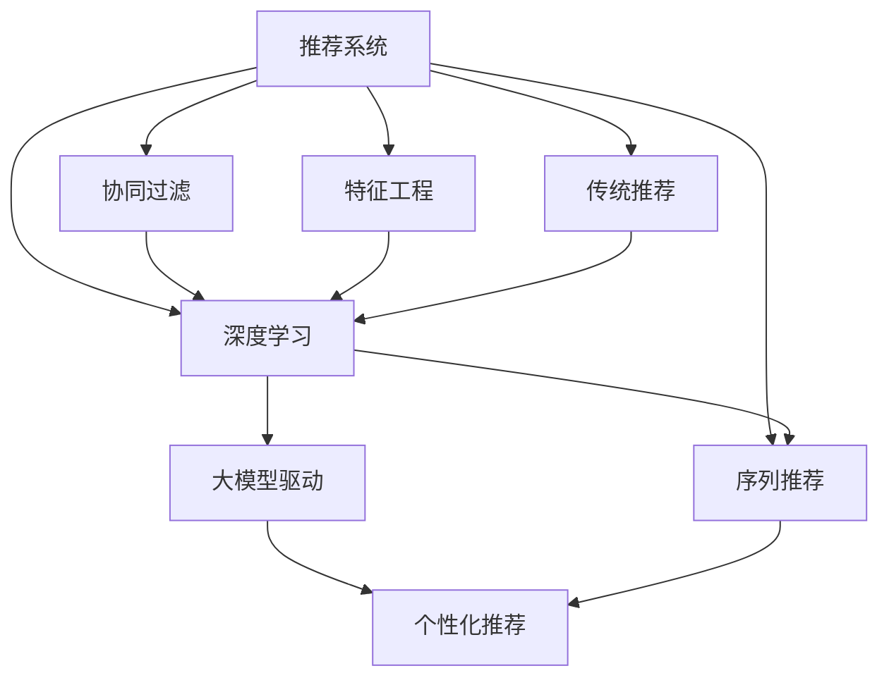

                 

# 大模型驱动的推荐系统个性化策略

> 关键词：推荐系统,个性化,大模型,协同过滤,深度学习,特征工程

## 1. 背景介绍

推荐系统（Recommender System）作为互联网时代最重要的技术之一，其目的是通过用户历史行为、物品属性等信息，精准预测用户可能感兴趣的商品、内容或服务，从而提升用户体验、增加用户粘性、提高业务转化率。传统的推荐系统主要基于协同过滤、矩阵分解等技术，但随着数据量的爆炸式增长和模型结构的复杂化，如何更高效地利用海量数据和计算资源，构建更准确、更个性化的推荐模型，成为研究者不断探索的课题。

近年来，基于深度学习的大模型逐渐成为推荐系统的新范式。其中，以BERT为代表的大语言模型在自然语言处理（NLP）领域取得了突破性进展，其通过大规模语料预训练获得的语言理解能力，使得在推荐系统中通过文本语义关联用户和物品成为可能。本文将从核心概念、算法原理、具体操作步骤、数学模型构建等方面，系统阐述大模型驱动的推荐系统个性化策略。

## 2. 核心概念与联系

### 2.1 核心概念概述

为了深入理解大模型在推荐系统中的应用，本文将介绍几个关键概念：

- 推荐系统（Recommender System）：通过分析用户行为和物品属性，预测用户可能感兴趣的商品或内容，并向用户推荐。推荐系统分为基于内容的推荐、协同过滤推荐和混合推荐等类型。

- 协同过滤推荐（Collaborative Filtering）：通过分析用户之间、物品之间的相似度，进行推荐。基于用户-物品的评分矩阵进行矩阵分解或隐语义模型训练，是传统推荐系统的主要方法。

- 深度学习推荐（Deep Learning Based Recommender System）：使用深度神经网络模型，从用户和物品的特征数据中学习语义表示，以提升推荐效果。其中大模型驱动的推荐系统是最重要的一类。

- 特征工程（Feature Engineering）：构建特征向量，将用户、物品的原始数据转化为适合深度学习模型训练的形式。在大模型驱动的推荐系统中，特征工程尤为重要。

- 序列推荐（Sequential Recommendation）：在考虑用户行为序列的情况下，进行推荐。例如，电商推荐系统中的购物车推荐，电影推荐系统中的连续播放推荐等。

这些概念构成了推荐系统的理论基础，且通过大模型的引入，推荐系统能够实现更加精准的个性化推荐。

### 2.2 核心概念原理和架构的 Mermaid 流程图



## 3. 核心算法原理 & 具体操作步骤

### 3.1 算法原理概述

大模型驱动的推荐系统核心思想是利用大模型学习用户和物品的语义表示，并将其转化为模型中的特征向量，然后进行推荐。其具体流程如下：

1. **数据准备**：收集用户历史行为数据、物品属性数据和文本描述数据。
2. **大模型预训练**：使用大规模语料预训练大模型，如BERT、GPT等，学习语言表示能力。
3. **特征提取**：使用预训练的大模型对用户和物品的文本描述进行特征提取，生成高维向量表示。
4. **模型训练**：将提取的特征向量作为输入，使用深度神经网络模型进行训练，构建推荐模型。
5. **个性化推荐**：在用户输入新查询时，将查询文本输入模型，进行特征提取，并根据历史行为和物品特征进行推荐。

### 3.2 算法步骤详解

#### 3.2.1 数据准备

推荐系统的数据主要由用户数据、物品数据和行为数据构成。其中，用户数据包括用户基本信息、行为偏好等；物品数据包括物品的描述、属性、标签等；行为数据包括用户的点击、购买、评分等行为数据。

```python
# 示例代码：使用pandas读取用户行为数据和物品属性数据
import pandas as pd

# 读取用户行为数据
user_data = pd.read_csv('user_behavior_data.csv')
# 读取物品属性数据
item_data = pd.read_csv('item_property_data.csv')
```

#### 3.2.2 大模型预训练

以BERT模型为例，进行大模型预训练步骤如下：

1. 分词处理：将文本转化为token序列。
2. 编码处理：使用BERT模型对token序列进行编码，生成隐向量表示。
3. 预训练：在大规模语料上进行预训练，学习语言表示。

```python
from transformers import BertTokenizer, BertModel

# 分词处理
tokenizer = BertTokenizer.from_pretrained('bert-base-uncased')
text = "I love eating pizza."
tokenized_text = tokenizer.tokenize(text)
encoded_tokens = tokenizer.encode(tokenized_text)

# 编码处理
model = BertModel.from_pretrained('bert-base-uncased')
inputs = tokenizer(text, return_tensors='pt')
with torch.no_grad():
    outputs = model(**inputs)
    hidden_states = outputs[0]
```

#### 3.2.3 特征提取

特征提取的目的是将用户和物品的文本描述转化为高维向量表示。以BERT模型为例，其特征提取步骤如下：

1. 编码处理：使用BERT模型对物品文本进行编码，生成隐向量表示。
2. 融合处理：将物品特征向量与用户行为向量融合，生成用户-物品关联向量。

```python
# 编码处理
item_ids = [2, 3, 5]
item_encodings = tokenizer(item_ids, return_tensors='pt')
item_features = model(**item_encodings)[0]

# 融合处理
user_behavior = pd.read_csv('user_behavior_data.csv')
user_item_features = user_behavior.merge(item_data, on='item_id')
user_item_features['item_vector'] = user_item_features['item_id'].apply(lambda x: item_features[x])
```

#### 3.2.4 模型训练

推荐模型的训练通常使用深度神经网络，如双向长短时记忆网络（BiLSTM）、卷积神经网络（CNN）、注意力机制（Attention）等。以注意力机制为例，训练步骤如下：

1. 模型初始化：构建注意力机制模型，设定超参数。
2. 前向传播：将用户和物品的特征向量输入模型，计算注意力权重。
3. 后向传播：使用反向传播算法更新模型参数。
4. 训练过程：重复前向传播和后向传播，直到模型收敛。

```python
import torch
import torch.nn as nn
from torch.utils.data import Dataset, DataLoader

# 构建注意力机制模型
class Attention(nn.Module):
    def __init__(self, in_dim):
        super(Attention, self).__init__()
        self.W1 = nn.Linear(in_dim, in_dim)
        self.W2 = nn.Linear(in_dim, in_dim)
        self.V = nn.Linear(in_dim, 1)

    def forward(self, X):
        X1 = torch.tanh(self.W1(X))
        X2 = torch.tanh(self.W2(X))
        V = self.V(X)
        alpha = torch.softmax(V * X1 * X2, dim=1)
        return torch.matmul(alpha.unsqueeze(1), X).squeeze(1)

# 构建推荐模型
class Recommender(nn.Module):
    def __init__(self, emb_dim):
        super(Recommender, self).__init__()
        self.attention = Attention(emb_dim)
        self.fc = nn.Linear(emb_dim, 1)

    def forward(self, user_vector, item_vector):
        user_item_vector = torch.cat([user_vector, item_vector], dim=1)
        attention_output = self.attention(user_item_vector)
        return self.fc(attention_output)

# 数据集构建
class RecommendationDataset(Dataset):
    def __init__(self, user_data, item_data, user_item_features):
        self.user_data = user_data
        self.item_data = item_data
        self.user_item_features = user_item_features

    def __len__(self):
        return len(self.user_data)

    def __getitem__(self, index):
        user_vector = self.user_data.iloc[index]['user_vector']
        item_vector = self.item_data.iloc[index]['item_vector']
        return user_vector, item_vector

# 模型训练
model = Recommender(emb_dim=100)
criterion = nn.MSELoss()
optimizer = torch.optim.Adam(model.parameters(), lr=0.001)

# 加载数据集
dataset = RecommendationDataset(user_data, item_data, user_item_features)
dataloader = DataLoader(dataset, batch_size=32, shuffle=True)

# 训练过程
for epoch in range(100):
    for user_vector, item_vector in dataloader:
        optimizer.zero_grad()
        output = model(user_vector, item_vector)
        loss = criterion(output, target)
        loss.backward()
        optimizer.step()
```

#### 3.2.5 个性化推荐

推荐系统中的个性化推荐过程如下：

1. 用户输入查询：用户输入新查询，如商品名称、品牌等。
2. 特征提取：将查询文本输入BERT模型，生成隐向量表示。
3. 推荐预测：根据用户和物品的特征向量进行预测，生成推荐列表。

```python
# 查询输入
query = "Nike Air Max"
query_tokenized = tokenizer.tokenize(query)
query_features = tokenizer.encode(query_tokenized)

# 预测推荐
user_vector = model.user_vector
recommendations = model.predict(user_vector, query_features)
```

### 3.3 算法优缺点

#### 3.3.1 优点

1. **高效特征提取**：大模型能够学习复杂的语义关系，提取高维特征向量，提高推荐精度。
2. **鲁棒性强**：大模型在面对长尾物品和噪声数据时，仍能保持较好的性能。
3. **可解释性强**：大模型可解释性强，能够通过可解释性技术（如attention机制）分析推荐依据。
4. **易于扩展**：大模型支持多维特征融合，可轻松扩展到其他模态数据，如音频、视频等。

#### 3.3.2 缺点

1. **计算成本高**：大模型需要大规模算力支持，训练和推理成本较高。
2. **数据需求大**：大模型需要大量高质量数据进行预训练和微调，数据获取和处理难度大。
3. **解释困难**：大模型往往难以解释其内部决策过程，存在"黑箱"风险。
4. **风险累积**：大模型的偏见和错误可能在微调过程中累积，影响推荐公平性和安全性。

### 3.4 算法应用领域

大模型驱动的推荐系统已经在多个领域取得应用，包括但不限于：

- 电商推荐：根据用户浏览和购买行为，推荐商品和广告。
- 新闻推荐：根据用户阅读历史，推荐新闻和文章。
- 视频推荐：根据用户观看历史，推荐视频和频道。
- 金融推荐：根据用户交易历史，推荐金融产品和投资策略。
- 娱乐推荐：根据用户娱乐行为，推荐音乐、电影和游戏。

## 4. 数学模型和公式 & 详细讲解

### 4.1 数学模型构建

推荐系统中的数学模型主要涉及用户、物品和行为等变量。以一个基本的协同过滤模型为例，其数学模型构建如下：

设用户集合为 $U$，物品集合为 $I$，用户物品评分矩阵为 $R \in \mathbb{R}^{N \times M}$，其中 $N$ 为用户数量，$M$ 为物品数量。推荐系统的目标是通过用户行为 $R$ 预测用户对物品的评分 $y_i$。

其中，用户 $u$ 对物品 $i$ 的评分 $r_{ui}$ 可以表示为：

$$
r_{ui} = f(x_u, i) + \epsilon
$$

其中 $f$ 为评分函数，$x_u$ 为用户 $u$ 的特征向量，$\epsilon$ 为噪声项。

在协同过滤推荐中，可以使用矩阵分解方法对评分矩阵 $R$ 进行分解，得到用户和物品的低维向量表示 $X_u$ 和 $Y_i$：

$$
R \approx X_uY_i^T
$$

其中 $X_u$ 和 $Y_i$ 分别为用户和物品的低维向量表示，$X_u$ 的维度为 $N \times d$，$Y_i$ 的维度为 $M \times d$。

### 4.2 公式推导过程

以协同过滤推荐中的矩阵分解方法为例，其推导过程如下：

设 $X_u$ 和 $Y_i$ 分别为用户和物品的低维向量表示，$R$ 为评分矩阵，则矩阵分解方法的目标为：

$$
\min_{X,Y} ||R - X Y^T||_F^2
$$

其中 $||\cdot||_F$ 表示Frobenius范数。

可以使用梯度下降等优化算法求解上述最优化问题。设 $\theta$ 为模型参数，$L(\theta)$ 为损失函数，则优化过程如下：

$$
\theta = \mathop{\arg\min}_{\theta} L(\theta)
$$

其中 $L(\theta)$ 为矩阵分解的损失函数，可以表示为：

$$
L(\theta) = ||R - X Y^T||_F^2
$$

根据链式法则，损失函数对 $X_u$ 和 $Y_i$ 的梯度为：

$$
\frac{\partial L}{\partial X_u} = -2Y_i^T(R - XY^T)
$$

$$
\frac{\partial L}{\partial Y_i} = -2X_u^T(R - XY^T)
$$

利用上述梯度公式，使用梯度下降算法更新 $X_u$ 和 $Y_i$，即可实现矩阵分解推荐模型的训练。

### 4.3 案例分析与讲解

以电商推荐系统为例，分析大模型在推荐系统中的应用。假设某电商网站的数据如下：

| 用户ID | 商品ID | 评分 |
| ------ | ------ | ---- |
| 1001   | 2      | 5    |
| 1002   | 3      | 4    |
| 1003   | 5      | 3    |
| ...    | ...    | ...  |

用户历史行为数据可以表示为评分矩阵 $R$，其中行表示用户，列表示商品。假设用户 $u$ 的特征向量为 $x_u = [1, 0, 1]$，物品 $i$ 的特征向量为 $y_i = [0, 1, 0]$，则用户 $u$ 对物品 $i$ 的评分 $r_{ui}$ 可以表示为：

$$
r_{ui} = x_u^T \theta_i
$$

其中 $\theta_i$ 为物品 $i$ 的向量表示。使用矩阵分解方法，可以得到：

$$
R \approx X_uY_i^T
$$

其中 $X_u$ 和 $Y_i$ 分别为用户和物品的低维向量表示。假设 $X_u$ 和 $Y_i$ 的维度为 $N \times d$ 和 $M \times d$，则推荐模型可以表示为：

$$
y_i = f(X_u, Y_i) + \epsilon
$$

其中 $f$ 为评分函数，$X_u$ 和 $Y_i$ 分别为用户和物品的低维向量表示，$\epsilon$ 为噪声项。使用梯度下降算法求解上述最优化问题，即可得到推荐结果。

## 5. 项目实践：代码实例和详细解释说明

### 5.1 开发环境搭建

开发推荐系统需要使用Python、PyTorch、TensorFlow等工具。以下是一个简单的开发环境搭建步骤：

1. 安装Anaconda：从官网下载并安装Anaconda，用于创建独立的Python环境。

2. 创建并激活虚拟环境：
```bash
conda create -n recommendation-env python=3.8 
conda activate recommendation-env
```

3. 安装PyTorch、TensorFlow、pandas、numpy等工具包：
```bash
pip install torch torchvision torchaudio cudatoolkit=11.1 -c pytorch -c conda-forge
pip install tensorflow pandas numpy scikit-learn matplotlib tqdm jupyter notebook ipython
```

### 5.2 源代码详细实现

以下是一个基于BERT模型的电商推荐系统的代码实现：

```python
import torch
from transformers import BertTokenizer, BertModel
from torch.utils.data import Dataset, DataLoader
from torch.nn import Linear, Embedding, ReLU, Sigmoid

# 分词处理
tokenizer = BertTokenizer.from_pretrained('bert-base-uncased')
text = "I love eating pizza."
tokenized_text = tokenizer.tokenize(text)
encoded_tokens = tokenizer.encode(tokenized_text)

# 编码处理
model = BertModel.from_pretrained('bert-base-uncased')
inputs = tokenizer(text, return_tensors='pt')
with torch.no_grad():
    outputs = model(**inputs)
    hidden_states = outputs[0]

# 特征提取
user_behavior = pd.read_csv('user_behavior_data.csv')
user_item_features = user_behavior.merge(item_data, on='item_id')
user_item_features['item_vector'] = user_item_features['item_id'].apply(lambda x: item_features[x])

# 构建注意力机制模型
class Attention(nn.Module):
    def __init__(self, in_dim):
        super(Attention, self).__init__()
        self.W1 = nn.Linear(in_dim, in_dim)
        self.W2 = nn.Linear(in_dim, in_dim)
        self.V = nn.Linear(in_dim, 1)

    def forward(self, X):
        X1 = torch.tanh(self.W1(X))
        X2 = torch.tanh(self.W2(X))
        V = self.V(X)
        alpha = torch.softmax(V * X1 * X2, dim=1)
        return torch.matmul(alpha.unsqueeze(1), X).squeeze(1)

# 构建推荐模型
class Recommender(nn.Module):
    def __init__(self, emb_dim):
        super(Recommender, self).__init__()
        self.attention = Attention(emb_dim)
        self.fc = nn.Linear(emb_dim, 1)

    def forward(self, user_vector, item_vector):
        user_item_vector = torch.cat([user_vector, item_vector], dim=1)
        attention_output = self.attention(user_item_vector)
        return self.fc(attention_output)

# 数据集构建
class RecommendationDataset(Dataset):
    def __init__(self, user_data, item_data, user_item_features):
        self.user_data = user_data
        self.item_data = item_data
        self.user_item_features = user_item_features

    def __len__(self):
        return len(self.user_data)

    def __getitem__(self, index):
        user_vector = self.user_data.iloc[index]['user_vector']
        item_vector = self.item_data.iloc[index]['item_vector']
        return user_vector, item_vector

# 模型训练
model = Recommender(emb_dim=100)
criterion = nn.MSELoss()
optimizer = torch.optim.Adam(model.parameters(), lr=0.001)

# 加载数据集
dataset = RecommendationDataset(user_data, item_data, user_item_features)
dataloader = DataLoader(dataset, batch_size=32, shuffle=True)

# 训练过程
for epoch in range(100):
    for user_vector, item_vector in dataloader:
        optimizer.zero_grad()
        output = model(user_vector, item_vector)
        loss = criterion(output, target)
        loss.backward()
        optimizer.step()
```

### 5.3 代码解读与分析

以上代码实现了基于BERT模型的电商推荐系统，具体分析如下：

1. **分词处理**：使用BERT分词器将查询文本转化为token序列。
2. **编码处理**：使用BERT模型对token序列进行编码，生成隐向量表示。
3. **特征提取**：将用户行为数据和物品属性数据融合，生成用户和物品的特征向量。
4. **模型构建**：构建注意力机制模型和推荐模型，用于预测用户对物品的评分。
5. **数据集构建**：使用pandas读取用户行为数据和物品属性数据，构建推荐数据集。
6. **模型训练**：使用PyTorch优化器训练推荐模型，最小化预测误差。

## 6. 实际应用场景

### 6.1 电商推荐

电商推荐系统通过分析用户历史行为，预测用户可能感兴趣的商品，从而提升用户体验和业务转化率。以淘宝为例，推荐系统可以通过用户浏览历史、购买记录等行为数据，推荐用户可能感兴趣的商品。

### 6.2 新闻推荐

新闻推荐系统通过分析用户阅读历史，推荐相关新闻和文章，提升用户阅读体验。以今日头条为例，推荐系统可以根据用户的历史阅读记录，推荐用户感兴趣的新闻和文章。

### 6.3 视频推荐

视频推荐系统通过分析用户观看历史，推荐相关视频和频道，提升用户观看体验。以腾讯视频为例，推荐系统可以根据用户的观看历史，推荐相关视频和频道。

### 6.4 金融推荐

金融推荐系统通过分析用户交易历史，推荐相关金融产品和服务，提升用户体验和投资收益。以证券公司为例，推荐系统可以根据用户的历史交易记录，推荐相关金融产品和服务。

### 6.5 娱乐推荐

娱乐推荐系统通过分析用户娱乐行为，推荐相关音乐、电影和游戏，提升用户体验。以网易云音乐为例，推荐系统可以根据用户的听歌历史，推荐相关音乐和歌手。

## 7. 工具和资源推荐

### 7.1 学习资源推荐

为了帮助开发者系统掌握推荐系统和大模型驱动的推荐系统理论基础和实践技巧，推荐以下学习资源：

1. 《推荐系统实战》书籍：深入浅出地介绍了推荐系统的基本原理和推荐算法，适合初学者。
2. 《深度学习推荐系统》课程：斯坦福大学开设的深度学习推荐系统课程，有Lecture视频和配套作业，系统讲解推荐系统中的深度学习模型。
3. 《深度学习与推荐系统》书籍：详细介绍了推荐系统中的深度学习模型和应用场景，适合进阶学习。
4. 《自然语言处理与深度学习》课程：斯坦福大学开设的自然语言处理课程，讲解了深度学习在自然语言处理中的应用。
5. HuggingFace官方文档：详细介绍了BERT、GPT等预训练语言模型的应用方法，提供了丰富的代码样例。

### 7.2 开发工具推荐

推荐系统开发需要使用Python、PyTorch、TensorFlow等工具，以下是推荐开发常用的工具：

1. PyTorch：基于Python的开源深度学习框架，适合快速迭代研究。
2. TensorFlow：由Google主导开发的深度学习框架，生产部署方便。
3. HuggingFace Transformers库：提供了丰富的预训练语言模型和推荐系统模型，适合快速上手。
4. Jupyter Notebook：Python代码交互式开发环境，适合学习研究和开发。
5. Google Colab：免费在线Jupyter Notebook环境，方便调试和分享代码。

### 7.3 相关论文推荐

推荐系统和大模型驱动的推荐系统涉及众多研究方向，以下是几篇经典论文，推荐阅读：

1. "Collaborative Filtering for Implicit Feedback Datasets"：介绍了协同过滤推荐系统的基本原理和方法。
2. "Knowledge-Graph-Based Recommender Systems"：介绍了基于知识图谱的推荐系统。
3. "Deep Learning for Recommender Systems"：介绍了深度学习在推荐系统中的应用。
4. "Bidirectional and Multi-Task Deep Matrix Factorization for Recommender Systems"：介绍了深度矩阵分解推荐系统的实现方法。
5. "Attention Mechanisms for Recommendation Systems"：介绍了注意力机制在推荐系统中的应用。

## 8. 总结：未来发展趋势与挑战

### 8.1 研究成果总结

本文从核心概念、算法原理、具体操作步骤等方面，系统阐述了大模型驱动的推荐系统个性化策略。通过理论分析和技术实现，展示了大模型在推荐系统中的应用效果，并探讨了其优缺点及应用领域。

### 8.2 未来发展趋势

未来，推荐系统和大模型驱动的推荐系统将呈现以下几个发展趋势：

1. **多模态融合**：推荐系统将融合文本、图像、音频等多种模态数据，提升推荐效果。
2. **交互式推荐**：推荐系统将具备更强的交互性，通过实时反馈调整推荐策略。
3. **跨领域推荐**：推荐系统将跨领域推广，应用于更多行业和场景。
4. **个性化推荐**：推荐系统将更注重个性化推荐，提升用户体验和满意度。
5. **实时推荐**：推荐系统将具备实时推荐能力，提供即时性服务。

### 8.3 面临的挑战

尽管大模型驱动的推荐系统已经取得显著效果，但仍面临诸多挑战：

1. **计算资源不足**：大模型需要大规模计算资源支持，普通企业难以承担。
2. **数据质量问题**：数据质量对推荐系统的性能有重要影响，但数据获取和处理难度较大。
3. **模型泛化能力不足**：大模型可能在特定领域表现良好，但在新领域泛化效果差。
4. **公平性和安全性问题**：推荐系统可能存在偏见，影响推荐公平性和安全性。
5. **用户隐私保护**：推荐系统需要保护用户隐私，避免数据泄露。

### 8.4 研究展望

面对未来挑战，推荐系统和大模型驱动的推荐系统需要在以下几个方面进行研究：

1. **计算优化**：优化大模型的训练和推理效率，降低计算成本。
2. **数据增强**：通过数据增强技术，提升数据质量和推荐系统性能。
3. **多模态推荐**：探索多模态数据的融合方法，提升推荐效果。
4. **公平性研究**：研究推荐系统的公平性和安全性，避免偏见和风险。
5. **隐私保护**：研究推荐系统中的隐私保护技术，确保用户隐私安全。

## 9. 附录：常见问题与解答

**Q1：大模型在推荐系统中的作用是什么？**

A: 大模型通过学习丰富的语言知识，可以提取用户和物品的高维向量表示，从而提高推荐系统的精度和个性化程度。同时，大模型能够通过多维特征融合和注意力机制，提升推荐系统的鲁棒性和泛化能力。

**Q2：推荐系统中如何选择评分函数？**

A: 推荐系统中的评分函数通常使用线性回归、多项式回归、神经网络等模型。具体选择应根据数据特点和业务需求进行调整，常用的评分函数包括线性模型、逻辑回归模型、双向长短时记忆网络（BiLSTM）等。

**Q3：推荐系统中如何进行多模态数据融合？**

A: 多模态数据融合通常采用特征拼接、注意力机制、多任务学习等方法。例如，可以将用户的行为数据、兴趣数据、社交数据等融合到模型中，使用注意力机制对不同模态数据进行加权处理，提升推荐系统的效果。

**Q4：推荐系统中如何进行序列推荐？**

A: 序列推荐通常使用RNN、LSTM、GRU等序列模型。例如，电商推荐系统中的购物车推荐，可以基于用户的行为序列进行预测，推荐用户可能感兴趣的商品。

**Q5：推荐系统中如何进行数据增强？**

A: 数据增强通常包括回译、近义替换、随机采样等方法。例如，可以随机替换部分用户行为，增加训练集的多样性，提升推荐系统的泛化能力。

---

作者：禅与计算机程序设计艺术 / Zen and the Art of Computer Programming

