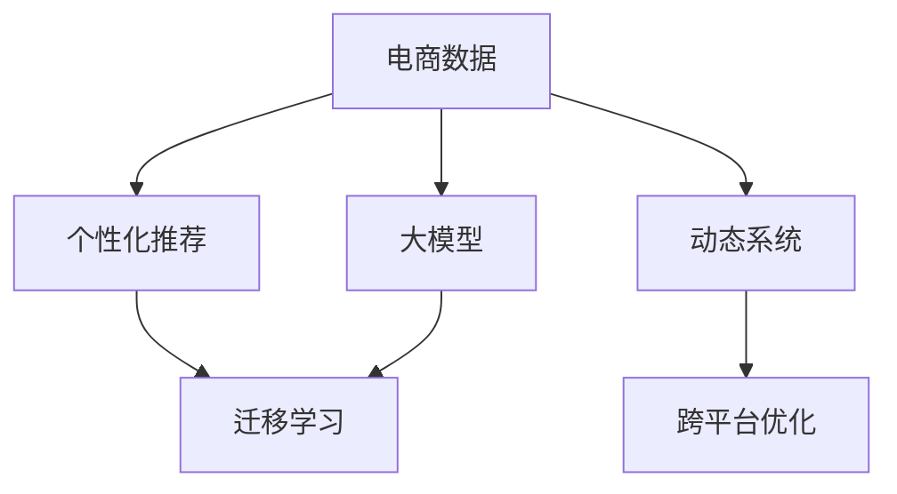

                 

# 大模型驱动的电商个性化促销策略

## 1. 背景介绍

### 1.1 问题由来

随着电子商务的迅猛发展，在线零售商面临着日益激烈的竞争和不断变化的消费者需求。传统的一刀切促销策略不再适用，个性化推荐和精准营销成为零售商提升用户体验和转化率的关键。然而，构建一个全面且高效的个性化促销策略系统是一项极具挑战的任务，它不仅需要分析消费者行为数据，还需要预测未来需求并动态调整策略。

### 1.2 问题核心关键点

本研究旨在探索使用大模型来驱动电商个性化促销策略的构建，重点关注以下几个关键点：

- **数据驱动**：使用消费者的历史行为数据来训练大模型，预测其未来购买行为。
- **个性化推荐**：根据消费者的历史数据和实时行为，推荐个性化的促销策略。
- **动态调整**：根据实时数据和用户反馈，动态调整促销策略以优化效果。
- **跨平台优化**：确保促销策略在不同平台上的兼容性和一致性。

### 1.3 问题研究意义

通过使用大模型，电商企业可以大幅提升个性化推荐和促销策略的效率和准确性，从而提高用户满意度和业务收益。具体而言：

- **提高转化率**：精准的个性化推荐能够显著提高用户的购买意愿和转化率。
- **优化库存管理**：通过预测未来需求，电商企业可以更好地管理库存，减少库存积压和缺货现象。
- **增强用户体验**：个性化的促销策略能够提升用户的购物体验，增加用户粘性。
- **数据驱动决策**：大模型能够提供更科学的数据驱动决策支持，帮助企业优化营销策略。

## 2. 核心概念与联系

### 2.1 核心概念概述

为更好地理解大模型在电商个性化促销策略中的应用，本节将介绍几个密切相关的核心概念：

- **电商数据**：包括用户的浏览记录、购买记录、搜索行为等，是构建个性化推荐系统的数据基础。
- **个性化推荐**：通过分析用户历史行为和兴趣偏好，推荐符合用户需求的产品或促销信息。
- **大模型**：如BERT、GPT等，利用大规模无标签数据进行预训练，能够在复杂的文本数据上取得优越的性能。
- **迁移学习**：在大模型基础上，通过微调或提示学习等技术，适应特定任务或领域。
- **动态系统**：能够根据实时数据和用户反馈动态调整策略的系统。
- **跨平台优化**：在多平台环境下，确保个性化促销策略的兼容性和一致性。

这些核心概念之间的逻辑关系可以通过以下Mermaid流程图来展示：



这个流程图展示了大模型在电商个性化促销策略中的应用框架：

1. 电商数据是构建个性化推荐的基础。
2. 大模型通过预训练获得通用语言表示，能够进行复杂的文本处理。
3. 通过迁移学习或提示学习，大模型可以适应特定任务或领域，提高个性化推荐效果。
4. 动态系统能够根据实时数据和用户反馈调整策略，实现策略的持续优化。
5. 跨平台优化确保策略在不同平台上的兼容性和一致性。

这些概念共同构成了大模型驱动的电商个性化促销策略的构建基础，使得大模型能够在电商场景中发挥其强大的数据分析和文本处理能力，推动营销策略的智能化和自动化。

## 3. 核心算法原理 & 具体操作步骤

### 3.1 算法原理概述

基于大模型的电商个性化促销策略，本质上是一个数据驱动的机器学习过程。其核心思想是：利用大模型处理电商数据，生成个性化的推荐和促销策略。具体流程如下：

1. **数据预处理**：清洗、归一化、特征工程等，准备电商数据用于模型训练。
2. **大模型预训练**：使用大规模无标签电商数据进行预训练，获得通用的语言表示能力。
3. **策略微调**：在大模型基础上，通过迁移学习或提示学习，微调生成特定任务或领域的个性化推荐和促销策略。
4. **策略评估**：根据历史和实时数据，评估促销策略的效果，并进行优化调整。
5. **策略部署**：将优化后的策略部署到电商平台上，实施个性化促销活动。

### 3.2 算法步骤详解

本节将详细介绍大模型驱动的电商个性化促销策略的实现步骤：

#### 步骤1: 数据预处理

- **数据清洗**：去除噪音数据、重复数据等，确保数据质量。
- **特征工程**：提取有意义的特征，如用户的浏览时间、点击次数、购买历史等。
- **数据归一化**：对不同特征进行归一化处理，如标准化、归一化等，避免特征尺度差异影响模型训练。
- **特征选择**：选择对促销策略预测效果有较大影响的特征，减少维度。

#### 步骤2: 大模型预训练

- **选择预训练模型**：如BERT、GPT等，使用预训练模型获取通用语言表示。
- **数据准备**：将电商数据转换为模型所需的文本形式，如将用户浏览历史转换为文本描述。
- **模型训练**：使用电商数据对预训练模型进行微调，获得针对电商数据的表示。
- **模型评估**：在验证集上评估模型性能，如交叉熵损失、准确率等指标。

#### 步骤3: 策略微调

- **任务适配**：根据促销策略任务的特点，设计适合的输出层和损失函数。
- **微调训练**：在电商数据上微调大模型，生成个性化的促销策略。
- **策略评估**：在测试集上评估微调后模型的效果，如点击率、转化率等指标。

#### 步骤4: 策略部署

- **策略生成**：使用微调后的大模型生成具体的促销策略。
- **策略实施**：将策略部署到电商平台上，实施个性化促销活动。
- **实时调整**：根据实时数据和用户反馈，动态调整促销策略。

#### 步骤5: 策略优化

- **反馈收集**：收集用户对促销策略的反馈，评估效果。
- **模型优化**：根据反馈优化模型参数，提升策略效果。
- **重复训练**：定期重新训练模型，确保策略持续优化。

### 3.3 算法优缺点

大模型驱动的电商个性化促销策略具有以下优点：

- **高效准确**：大模型能够处理复杂的文本数据，提高个性化推荐的准确性和效果。
- **数据驱动**：使用电商数据训练大模型，提升策略的科学性和可靠性。
- **动态优化**：能够根据实时数据和用户反馈动态调整策略，提升用户体验。
- **跨平台兼容**：确保策略在不同平台上的兼容性和一致性。

同时，该方法也存在一定的局限性：

- **数据依赖**：策略的效果高度依赖于电商数据的数量和质量。
- **计算资源**：大模型的训练和推理需要大量的计算资源，增加了成本。
- **模型复杂性**：大模型和策略微调过程较为复杂，实施难度较高。
- **策略可解释性**：生成的促销策略缺乏可解释性，难以进行详细的策略分析。

尽管存在这些局限性，但就目前而言，大模型驱动的电商个性化促销策略在提升用户体验和业务收益方面，仍然是一种有效且高效的方法。未来相关研究的重点在于如何进一步优化数据处理和模型训练过程，降低计算资源消耗，同时兼顾策略的可解释性。

### 3.4 算法应用领域

基于大模型的电商个性化促销策略已经在多个领域得到了应用，例如：

- **在线零售**：电商平台根据用户行为数据生成个性化推荐和促销策略，提升用户购买意愿和转化率。
- **移动电商**：在移动端应用中，使用个性化推荐和促销策略，优化用户体验。
- **社交电商**：在社交平台上，利用用户行为数据生成个性化的社交推广和促销活动。
- **智慧物流**：利用用户行为数据优化物流配送策略，提高配送效率和用户体验。

除了上述这些经典应用外，大模型驱动的电商个性化促销策略还在新零售、跨界营销等多个领域展现了其强大的应用潜力。随着电商行业的持续发展和大模型技术的不断进步，该方法必将在更多场景中发挥更大的作用，成为电商营销的利器。

## 4. 数学模型和公式 & 详细讲解  
### 4.1 数学模型构建

本节将使用数学语言对大模型驱动的电商个性化促销策略进行更加严格的刻画。

记电商数据集为 $D=\{(x_i,y_i)\}_{i=1}^N, x_i \in \mathcal{X}, y_i \in \mathcal{Y}$，其中 $x_i$ 为用户行为数据， $y_i$ 为促销策略标签。假设大模型为 $M_{\theta}$，其中 $\theta$ 为模型参数。

定义模型 $M_{\theta}$ 在输入 $x_i$ 上的损失函数为 $\ell(M_{\theta}(x_i),y_i)$，则在数据集 $D$ 上的经验风险为：

$$
\mathcal{L}(\theta) = \frac{1}{N} \sum_{i=1}^N \ell(M_{\theta}(x_i),y_i)
$$

微调的优化目标是最小化经验风险，即找到最优参数：

$$
\theta^* = \mathop{\arg\min}_{\theta} \mathcal{L}(\theta)
$$

在实践中，我们通常使用基于梯度的优化算法（如SGD、Adam等）来近似求解上述最优化问题。设 $\eta$ 为学习率，$\lambda$ 为正则化系数，则参数的更新公式为：

$$
\theta \leftarrow \theta - \eta \nabla_{\theta}\mathcal{L}(\theta) - \eta\lambda\theta
$$

其中 $\nabla_{\theta}\mathcal{L}(\theta)$ 为损失函数对参数 $\theta$ 的梯度，可通过反向传播算法高效计算。

### 4.2 公式推导过程

以下我们以电商数据分类为例，推导交叉熵损失函数及其梯度的计算公式。

假设模型 $M_{\theta}$ 在输入 $x_i$ 上的输出为 $\hat{y}=M_{\theta}(x_i) \in [0,1]$，表示用户行为属于促销策略 $y_i$ 的概率。真实标签 $y_i \in \{0,1\}$。则二分类交叉熵损失函数定义为：

$$
\ell(M_{\theta}(x_i),y_i) = -[y_i\log \hat{y} + (1-y_i)\log (1-\hat{y})]
$$

将其代入经验风险公式，得：

$$
\mathcal{L}(\theta) = -\frac{1}{N}\sum_{i=1}^N [y_i\log M_{\theta}(x_i)+(1-y_i)\log(1-M_{\theta}(x_i))]
$$

根据链式法则，损失函数对参数 $\theta_k$ 的梯度为：

$$
\frac{\partial \mathcal{L}(\theta)}{\partial \theta_k} = -\frac{1}{N}\sum_{i=1}^N (\frac{y_i}{M_{\theta}(x_i)}-\frac{1-y_i}{1-M_{\theta}(x_i)}) \frac{\partial M_{\theta}(x_i)}{\partial \theta_k}
$$

其中 $\frac{\partial M_{\theta}(x_i)}{\partial \theta_k}$ 可进一步递归展开，利用自动微分技术完成计算。

在得到损失函数的梯度后，即可带入参数更新公式，完成模型的迭代优化。重复上述过程直至收敛，最终得到适应电商促销策略的最优模型参数 $\theta^*$。

## 5. 项目实践：代码实例和详细解释说明
### 5.1 开发环境搭建

在进行电商个性化促销策略的微调实践前，我们需要准备好开发环境。以下是使用Python进行PyTorch开发的环境配置流程：

1. 安装Anaconda：从官网下载并安装Anaconda，用于创建独立的Python环境。

2. 创建并激活虚拟环境：
```bash
conda create -n pytorch-env python=3.8 
conda activate pytorch-env
```

3. 安装PyTorch：根据CUDA版本，从官网获取对应的安装命令。例如：
```bash
conda install pytorch torchvision torchaudio cudatoolkit=11.1 -c pytorch -c conda-forge
```

4. 安装Transformers库：
```bash
pip install transformers
```

5. 安装各类工具包：
```bash
pip install numpy pandas scikit-learn matplotlib tqdm jupyter notebook ipython
```

完成上述步骤后，即可在`pytorch-env`环境中开始微调实践。

### 5.2 源代码详细实现

下面我以电商数据分类任务为例，给出使用Transformers库对BERT模型进行微调的PyTorch代码实现。

首先，定义电商数据分类任务的数据处理函数：

```python
from transformers import BertTokenizer
from torch.utils.data import Dataset
import torch

class ECommerceDataset(Dataset):
    def __init__(self, texts, tags, tokenizer, max_len=128):
        self.texts = texts
        self.tags = tags
        self.tokenizer = tokenizer
        self.max_len = max_len
        
    def __len__(self):
        return len(self.texts)
    
    def __getitem__(self, item):
        text = self.texts[item]
        tags = self.tags[item]
        
        encoding = self.tokenizer(text, return_tensors='pt', max_length=self.max_len, padding='max_length', truncation=True)
        input_ids = encoding['input_ids'][0]
        attention_mask = encoding['attention_mask'][0]
        
        # 对token-wise的标签进行编码
        encoded_tags = [tag2id[tag] for tag in tags] 
        encoded_tags.extend([tag2id['O']] * (self.max_len - len(encoded_tags)))
        labels = torch.tensor(encoded_tags, dtype=torch.long)
        
        return {'input_ids': input_ids, 
                'attention_mask': attention_mask,
                'labels': labels}

# 标签与id的映射
tag2id = {'O': 0, 'C1': 1, 'C2': 2, 'C3': 3, 'C4': 4, 'C5': 5}
id2tag = {v: k for k, v in tag2id.items()}

# 创建dataset
tokenizer = BertTokenizer.from_pretrained('bert-base-cased')

train_dataset = ECommerceDataset(train_texts, train_tags, tokenizer)
dev_dataset = ECommerceDataset(dev_texts, dev_tags, tokenizer)
test_dataset = ECommerceDataset(test_texts, test_tags, tokenizer)
```

然后，定义模型和优化器：

```python
from transformers import BertForTokenClassification, AdamW

model = BertForTokenClassification.from_pretrained('bert-base-cased', num_labels=len(tag2id))

optimizer = AdamW(model.parameters(), lr=2e-5)
```

接着，定义训练和评估函数：

```python
from torch.utils.data import DataLoader
from tqdm import tqdm
from sklearn.metrics import classification_report

device = torch.device('cuda') if torch.cuda.is_available() else torch.device('cpu')
model.to(device)

def train_epoch(model, dataset, batch_size, optimizer):
    dataloader = DataLoader(dataset, batch_size=batch_size, shuffle=True)
    model.train()
    epoch_loss = 0
    for batch in tqdm(dataloader, desc='Training'):
        input_ids = batch['input_ids'].to(device)
        attention_mask = batch['attention_mask'].to(device)
        labels = batch['labels'].to(device)
        model.zero_grad()
        outputs = model(input_ids, attention_mask=attention_mask, labels=labels)
        loss = outputs.loss
        epoch_loss += loss.item()
        loss.backward()
        optimizer.step()
    return epoch_loss / len(dataloader)

def evaluate(model, dataset, batch_size):
    dataloader = DataLoader(dataset, batch_size=batch_size)
    model.eval()
    preds, labels = [], []
    with torch.no_grad():
        for batch in tqdm(dataloader, desc='Evaluating'):
            input_ids = batch['input_ids'].to(device)
            attention_mask = batch['attention_mask'].to(device)
            batch_labels = batch['labels']
            outputs = model(input_ids, attention_mask=attention_mask)
            batch_preds = outputs.logits.argmax(dim=2).to('cpu').tolist()
            batch_labels = batch_labels.to('cpu').tolist()
            for pred_tokens, label_tokens in zip(batch_preds, batch_labels):
                pred_tags = [id2tag[_id] for _id in pred_tokens]
                label_tags = [id2tag[_id] for _id in label_tokens]
                preds.append(pred_tags[:len(label_tokens)])
                labels.append(label_tags)
                
    print(classification_report(labels, preds))
```

最后，启动训练流程并在测试集上评估：

```python
epochs = 5
batch_size = 16

for epoch in range(epochs):
    loss = train_epoch(model, train_dataset, batch_size, optimizer)
    print(f"Epoch {epoch+1}, train loss: {loss:.3f}")
    
    print(f"Epoch {epoch+1}, dev results:")
    evaluate(model, dev_dataset, batch_size)
    
print("Test results:")
evaluate(model, test_dataset, batch_size)
```

以上就是使用PyTorch对BERT进行电商数据分类任务微调的完整代码实现。可以看到，得益于Transformers库的强大封装，我们可以用相对简洁的代码完成BERT模型的加载和微调。

### 5.3 代码解读与分析

让我们再详细解读一下关键代码的实现细节：

**ECommerceDataset类**：
- `__init__`方法：初始化电商数据和标签，分词器等关键组件。
- `__len__`方法：返回数据集的样本数量。
- `__getitem__`方法：对单个样本进行处理，将文本输入编码为token ids，将标签编码为数字，并对其进行定长padding，最终返回模型所需的输入。

**tag2id和id2tag字典**：
- 定义了标签与数字id之间的映射关系，用于将token-wise的预测结果解码回真实的标签。

**训练和评估函数**：
- 使用PyTorch的DataLoader对数据集进行批次化加载，供模型训练和推理使用。
- 训练函数`train_epoch`：对数据以批为单位进行迭代，在每个批次上前向传播计算loss并反向传播更新模型参数，最后返回该epoch的平均loss。
- 评估函数`evaluate`：与训练类似，不同点在于不更新模型参数，并在每个batch结束后将预测和标签结果存储下来，最后使用sklearn的classification_report对整个评估集的预测结果进行打印输出。

**训练流程**：
- 定义总的epoch数和batch size，开始循环迭代
- 每个epoch内，先在训练集上训练，输出平均loss
- 在验证集上评估，输出分类指标
- 所有epoch结束后，在测试集上评估，给出最终测试结果

可以看到，PyTorch配合Transformers库使得BERT微调的代码实现变得简洁高效。开发者可以将更多精力放在数据处理、模型改进等高层逻辑上，而不必过多关注底层的实现细节。

当然，工业级的系统实现还需考虑更多因素，如模型的保存和部署、超参数的自动搜索、更灵活的任务适配层等。但核心的微调范式基本与此类似。

## 6. 实际应用场景
### 6.1 智能客服系统

基于大语言模型微调的对话技术，可以广泛应用于智能客服系统的构建。传统客服往往需要配备大量人力，高峰期响应缓慢，且一致性和专业性难以保证。而使用微调后的对话模型，可以7x24小时不间断服务，快速响应客户咨询，用自然流畅的语言解答各类常见问题。

在技术实现上，可以收集企业内部的历史客服对话记录，将问题和最佳答复构建成监督数据，在此基础上对预训练对话模型进行微调。微调后的对话模型能够自动理解用户意图，匹配最合适的答案模板进行回复。对于客户提出的新问题，还可以接入检索系统实时搜索相关内容，动态组织生成回答。如此构建的智能客服系统，能大幅提升客户咨询体验和问题解决效率。

### 6.2 金融舆情监测

金融机构需要实时监测市场舆论动向，以便及时应对负面信息传播，规避金融风险。传统的人工监测方式成本高、效率低，难以应对网络时代海量信息爆发的挑战。基于大语言模型微调的文本分类和情感分析技术，为金融舆情监测提供了新的解决方案。

具体而言，可以收集金融领域相关的新闻、报道、评论等文本数据，并对其进行主题标注和情感标注。在此基础上对预训练语言模型进行微调，使其能够自动判断文本属于何种主题，情感倾向是正面、中性还是负面。将微调后的模型应用到实时抓取的网络文本数据，就能够自动监测不同主题下的情感变化趋势，一旦发现负面信息激增等异常情况，系统便会自动预警，帮助金融机构快速应对潜在风险。

### 6.3 个性化推荐系统

当前的推荐系统往往只依赖用户的历史行为数据进行物品推荐，无法深入理解用户的真实兴趣偏好。基于大语言模型微调技术，个性化推荐系统可以更好地挖掘用户行为背后的语义信息，从而提供更精准、多样的推荐内容。

在实践中，可以收集用户浏览、点击、评论、分享等行为数据，提取和用户交互的物品标题、描述、标签等文本内容。将文本内容作为模型输入，用户的后续行为（如是否点击、购买等）作为监督信号，在此基础上微调预训练语言模型。微调后的模型能够从文本内容中准确把握用户的兴趣点。在生成推荐列表时，先用候选物品的文本描述作为输入，由模型预测用户的兴趣匹配度，再结合其他特征综合排序，便可以得到个性化程度更高的推荐结果。

### 6.4 未来应用展望

随着大语言模型微调技术的不断发展，基于微调范式将在更多领域得到应用，为传统行业带来变革性影响。

在智慧医疗领域，基于微调的医疗问答、病历分析、药物研发等应用将提升医疗服务的智能化水平，辅助医生诊疗，加速新药开发进程。

在智能教育领域，微调技术可应用于作业批改、学情分析、知识推荐等方面，因材施教，促进教育公平，提高教学质量。

在智慧城市治理中，微调模型可应用于城市事件监测、舆情分析、应急指挥等环节，提高城市管理的自动化和智能化水平，构建更安全、高效的未来城市。

此外，在企业生产、社会治理、文娱传媒等众多领域，基于大模型微调的人工智能应用也将不断涌现，为经济社会发展注入新的动力。相信随着技术的日益成熟，微调方法将成为人工智能落地应用的重要范式，推动人工智能技术在垂直行业的规模化落地。

## 7. 工具和资源推荐
### 7.1 学习资源推荐

为了帮助开发者系统掌握大模型微调的理论基础和实践技巧，这里推荐一些优质的学习资源：

1. 《Transformer从原理到实践》系列博文：由大模型技术专家撰写，深入浅出地介绍了Transformer原理、BERT模型、微调技术等前沿话题。

2. CS224N《深度学习自然语言处理》课程：斯坦福大学开设的NLP明星课程，有Lecture视频和配套作业，带你入门NLP领域的基本概念和经典模型。

3. 《Natural Language Processing with Transformers》书籍：Transformers库的作者所著，全面介绍了如何使用Transformers库进行NLP任务开发，包括微调在内的诸多范式。

4. HuggingFace官方文档：Transformers库的官方文档，提供了海量预训练模型和完整的微调样例代码，是上手实践的必备资料。

5. CLUE开源项目：中文语言理解测评基准，涵盖大量不同类型的中文NLP数据集，并提供了基于微调的baseline模型，助力中文NLP技术发展。

通过对这些资源的学习实践，相信你一定能够快速掌握大模型微调的精髓，并用于解决实际的NLP问题。
###  7.2 开发工具推荐

高效的开发离不开优秀的工具支持。以下是几款用于大模型微调开发的常用工具：

1. PyTorch：基于Python的开源深度学习框架，灵活动态的计算图，适合快速迭代研究。大部分预训练语言模型都有PyTorch版本的实现。

2. TensorFlow：由Google主导开发的开源深度学习框架，生产部署方便，适合大规模工程应用。同样有丰富的预训练语言模型资源。

3. Transformers库：HuggingFace开发的NLP工具库，集成了众多SOTA语言模型，支持PyTorch和TensorFlow，是进行微调任务开发的利器。

4. Weights & Biases：模型训练的实验跟踪工具，可以记录和可视化模型训练过程中的各项指标，方便对比和调优。与主流深度学习框架无缝集成。

5. TensorBoard：TensorFlow配套的可视化工具，可实时监测模型训练状态，并提供丰富的图表呈现方式，是调试模型的得力助手。

6. Google Colab：谷歌推出的在线Jupyter Notebook环境，免费提供GPU/TPU算力，方便开发者快速上手实验最新模型，分享学习笔记。

合理利用这些工具，可以显著提升大模型微调任务的开发效率，加快创新迭代的步伐。

### 7.3 相关论文推荐

大语言模型和微调技术的发展源于学界的持续研究。以下是几篇奠基性的相关论文，推荐阅读：

1. Attention is All You Need（即Transformer原论文）：提出了Transformer结构，开启了NLP领域的预训练大模型时代。

2. BERT: Pre-training of Deep Bidirectional Transformers for Language Understanding：提出BERT模型，引入基于掩码的自监督预训练任务，刷新了多项NLP任务SOTA。

3. Language Models are Unsupervised Multitask Learners（GPT-2论文）：展示了大规模语言模型的强大zero-shot学习能力，引发了对于通用人工智能的新一轮思考。

4. Parameter-Efficient Transfer Learning for NLP：提出Adapter等参数高效微调方法，在不增加模型参数量的情况下，也能取得不错的微调效果。

5. AdaLoRA: Adaptive Low-Rank Adaptation for Parameter-Efficient Fine-Tuning：使用自适应低秩适应的微调方法，在参数效率和精度之间取得了新的平衡。

这些论文代表了大模型微调技术的发展脉络。通过学习这些前沿成果，可以帮助研究者把握学科前进方向，激发更多的创新灵感。

## 8. 总结：未来发展趋势与挑战

### 8.1 总结

本文对基于大模型的电商个性化促销策略进行了全面系统的介绍。首先阐述了电商数据和大模型的核心概念，明确了它们之间的联系与互动。其次，从原理到实践，详细讲解了基于大模型的电商个性化促销策略的构建过程，包括数据预处理、大模型预训练、策略微调和策略部署等关键步骤。同时，本文还探讨了该方法在多个实际应用场景中的应用，展示了其广泛的应用前景。

通过本文的系统梳理，可以看到，基于大模型的电商个性化促销策略在大规模电商企业的应用中具有显著的效果提升和巨大的市场潜力。未来，随着大模型技术的进一步成熟和优化，该方法将得到更广泛的认可和应用，推动电商行业的智能化转型。

### 8.2 未来发展趋势

展望未来，基于大模型的电商个性化促销策略将呈现以下几个发展趋势：

1. **算力增强**：随着硬件技术的发展，算力成本将大幅降低，使得大规模模型的训练和推理更加高效。

2. **数据质量提升**：通过更加先进的数据清洗和特征工程技术，电商数据的质量将进一步提升，提升策略的准确性和鲁棒性。

3. **跨领域应用**：随着模型的预训练和微调，该方法将能更好地适应不同领域和场景的需求，拓展应用范围。

4. **多模态融合**：将文本、图像、音频等多模态数据融合，提升个性化推荐和促销策略的效果。

5. **模型泛化能力增强**：大模型将具备更强的跨领域泛化能力，适应更多类型的电商数据和促销策略。

6. **策略自动化优化**：通过自动化调参和超参数优化技术，提升策略的构建效率和效果。

这些趋势凸显了大模型驱动的电商个性化促销策略的广泛应用前景和持续优化的潜力。

### 8.3 面临的挑战

尽管基于大模型的电商个性化促销策略在提升用户体验和业务收益方面已取得显著成效，但在迈向更加智能化、普适化应用的过程中，它仍面临诸多挑战：

1. **数据隐私和安全**：电商数据的隐私和安全问题需要得到充分重视，确保用户数据的安全性。

2. **计算资源消耗**：大模型的训练和推理需要大量的计算资源，成本较高。如何优化资源消耗，提高计算效率，是未来需要解决的问题。

3. **模型复杂性**：大模型和微调过程较为复杂，实施难度较高，需要更高效的工具和流程。

4. **策略可解释性**：生成的促销策略缺乏可解释性，难以进行详细的策略分析。

5. **用户满意度**：过度个性化的促销策略可能会引起用户的不适，如何平衡个性化和用户体验，仍需深入研究。

6. **市场竞争**：电商市场的竞争激烈，如何构建更具竞争力的个性化促销策略，需要深入的策略分析和优化。

这些挑战需要在未来的研究中不断探索和克服，才能实现基于大模型的电商个性化促销策略的更大规模应用。

### 8.4 研究展望

面向未来，基于大模型的电商个性化促销策略需要在以下几个方面进行深入研究：

1. **增强数据隐私保护**：研究如何保护用户数据隐私，确保数据的安全性和用户的知情权。

2. **优化计算资源利用**：研究高效的数据处理和模型训练方法，降低计算资源消耗，提高算力利用效率。

3. **提升策略可解释性**：研究如何提高促销策略的可解释性，增加用户信任度。

4. **多模态数据融合**：研究如何将文本、图像、音频等多模态数据融合，提升个性化推荐和促销策略的效果。

5. **跨平台兼容性**：研究如何在不同平台和环境下实现策略的兼容性，提升策略的普适性。

6. **自动化策略优化**：研究自动化调参和超参数优化技术，提升策略的构建效率和效果。

通过在这些方向的持续探索和优化，基于大模型的电商个性化促销策略将能够更好地适应电商市场的变化和发展，为电商企业提供更智能、更高效、更个性化的营销解决方案。

## 9. 附录：常见问题与解答

**Q1：如何选择合适的电商数据集？**

A: 电商数据集的选择应考虑数据的代表性、多样性和覆盖范围。具体选择时，可以从以下几个方面入手：
- 数据来源：选择权威、可靠的电商平台，如亚马逊、京东、淘宝等。
- 数据类型：包含用户的浏览记录、购买记录、搜索行为等，确保数据全面。
- 数据时间跨度：选择历史数据覆盖较长时间跨度的数据集，确保数据的稳定性和代表性。
- 数据质量：选择数据质量较高、格式标准的数据集，确保数据处理和分析的准确性。

**Q2：电商数据预处理时需要注意哪些方面？**

A: 电商数据预处理需要注意以下几个方面：
- 数据清洗：去除噪音数据、重复数据等，确保数据质量。
- 数据归一化：对不同特征进行归一化处理，如标准化、归一化等，避免特征尺度差异影响模型训练。
- 特征选择：选择对促销策略预测效果有较大影响的特征，减少维度。
- 文本处理：将电商数据转换为模型所需的文本形式，如将用户浏览历史转换为文本描述。

**Q3：大模型的微调过程中需要注意哪些问题？**

A: 大模型的微调过程中需要注意以下几个问题：
- 学习率的选择：选择合适学习率，避免过拟合。
- 正则化技术：使用L2正则、Dropout、Early Stopping等，防止模型过拟合。
- 动态调整策略：根据实时数据和用户反馈动态调整策略，提升用户体验。
- 多模型集成：训练多个微调模型，取平均输出，抑制过拟合。

**Q4：如何评估电商促销策略的效果？**

A: 电商促销策略的评估可以从以下几个方面进行：
- 点击率：评估用户对促销策略的响应率。
- 转化率：评估用户通过促销策略的实际购买率。
- 用户满意度：通过用户反馈和评分，评估促销策略的满意度和效果。
- 销售增长：评估促销策略对销售额的提升效果。

**Q5：如何优化电商促销策略？**

A: 电商促销策略的优化可以从以下几个方面进行：
- 数据驱动：通过分析用户行为数据，优化促销策略。
- 多模态融合：将文本、图像、音频等多模态数据融合，提升个性化推荐和促销策略的效果。
- 跨平台优化：在不同平台和环境下实现策略的兼容性，提升策略的普适性。
- 自动化优化：通过自动化调参和超参数优化技术，提升策略的构建效率和效果。

通过不断优化电商促销策略，可以提升用户的购买意愿和转化率，提高电商企业的业务收益。

---

作者：禅与计算机程序设计艺术 / Zen and the Art of Computer Programming

