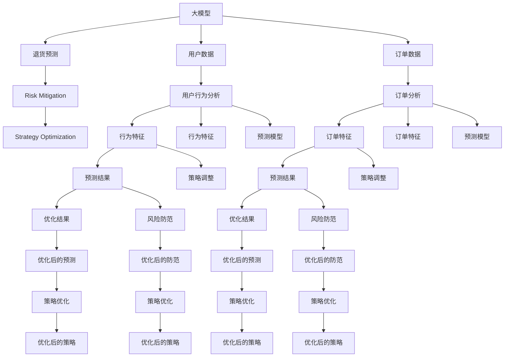

                 

# 大模型驱动的电商个性化退货预测与防范策略

> 关键词：
   大模型驱动, 电商, 个性化退货预测, 数据挖掘, 风险防范, 策略优化

## 1. 背景介绍

### 1.1 电商行业的退货现状

在电商行业，退货率一直是影响用户体验和商家盈利能力的关键因素之一。根据统计，全球范围内的电商退货率平均为15-30%，而中国市场更是高达37%。高退货率不仅带来了显著的物流、库存成本，也直接侵蚀了商家的利润空间，影响品牌的市场竞争力。

近年来，随着消费者对商品质量和服务的期待不断提高，以及平台间竞争的加剧，电商退货率呈现出不断上升的趋势。这种趋势不仅对平台运营造成了巨大压力，也给供应链管理带来了巨大挑战。因此，研究如何精准预测客户退货行为，并针对性地提出防范策略，成为电商企业亟待解决的重大问题。

### 1.2 退货预测与防范的重要性

退货预测和防范策略的有效实施，不仅能显著降低退货率，还能优化库存管理，提高客户满意度，增强品牌忠诚度。具体而言，退货预测的准确度直接影响商家库存和物流资源的配置，减少因过度库存或库存不足导致的运营成本和客户投诉。同时，针对预测结果进行的风险防范措施，如差异化定价、客户补偿计划等，能够有效减少退货风险，提升整体运营效率。

在实际应用中，退货预测和防范策略已成为电商平台差异化竞争的关键手段，对于提升客户体验、降低运营成本、提升盈利能力等方面具有显著效果。因此，研究如何基于大模型进行退货预测与防范策略，具有重要的理论和实践意义。

## 2. 核心概念与联系

### 2.1 核心概念概述

在进行退货预测和防范策略的研究时，涉及多个关键概念和理论，这些概念通过一定的逻辑关系构成了研究的基本框架。

- **大模型（Large Model）**：指基于深度学习技术训练的庞大模型，如BERT、GPT等。通过预训练和微调，大模型能够学习到复杂的语义和上下文信息，具有强大的模式识别和预测能力。
- **退货预测（Return Prediction）**：指通过分析历史订单数据和用户行为数据，预测客户在购买后的退货倾向。通常采用监督学习或无监督学习的方式进行建模，以准确预测退货行为的概率分布。
- **风险防范（Risk Mitigation）**：指针对退货预测结果，采取一系列措施降低退货风险，如差异化定价、及时退款、提供补偿计划等。通过调整产品策略和客户关系管理，减少退货发生率，提升客户满意度。
- **策略优化（Strategy Optimization）**：指通过对退货预测和风险防范策略的迭代优化，寻找最佳的预测和防范方案，最大化业务效益。通常采用数据驱动的方式，通过大量实验和测试，逐步优化策略。

### 2.2 核心概念原理和架构的 Mermaid 流程图



这个流程图展示了退货预测与防范策略的基本流程，以及大模型在其中扮演的角色：

1. **数据输入**：通过用户行为和订单数据，获取必要的特征。
2. **特征提取**：利用大模型提取特征，提高预测的准确性。
3. **预测模型**：构建预测模型，基于用户行为和订单特征进行退货概率预测。
4. **风险防范**：根据预测结果，采取相应的风险防范措施，如价格调整、补偿计划等。
5. **策略优化**：通过实验和测试，不断优化预测和防范策略，提升效果。

通过这一流程，大模型在退货预测与防范策略中起到了关键作用，能够从海量数据中挖掘出有用的信息，支持精准的预测和策略制定。

## 3. 核心算法原理 & 具体操作步骤

### 3.1 算法原理概述

基于大模型的退货预测与防范策略，主要依赖于监督学习和深度学习技术。通过预训练模型和大规模标注数据，学习到丰富的语义和模式信息，并在下游任务上进行微调，以获得更精准的预测和更有效的防范措施。

具体而言，退货预测和防范策略的算法流程大致如下：

1. **数据准备**：收集用户行为数据和订单数据，清洗并整理成标准格式。
2. **特征提取**：利用大模型对数据进行特征提取，生成高维特征向量。
3. **预测模型训练**：构建预测模型，对特征向量进行训练，获得退货概率分布。
4. **风险防范策略制定**：根据预测结果，制定相应的风险防范措施。
5. **策略优化**：通过A/B测试等手段，不断优化预测和防范策略，提升效果。

### 3.2 算法步骤详解

#### 3.2.1 数据准备

退货预测和防范策略的第一步是收集和准备数据。具体步骤如下：

1. **数据来源**：从电商平台获取用户行为数据和订单数据。用户行为数据包括浏览记录、点击记录、评论记录等，订单数据包括订单号、商品信息、支付信息等。
2. **数据清洗**：对数据进行去重、去噪和标准化处理，去除异常值和重复记录。
3. **特征选择**：根据业务需求和模型要求，选择和构造有意义的特征。常见的特征包括用户ID、商品ID、购买时间、订单价格等。
4. **数据划分**：将数据集划分为训练集、验证集和测试集，用于模型训练、调参和评估。

#### 3.2.2 特征提取

利用大模型对数据进行特征提取，是退货预测与防范策略的核心步骤之一。具体步骤如下：

1. **选择合适的预训练模型**：如BERT、GPT等，根据业务需求和模型性能要求选择合适的模型。
2. **数据预处理**：对文本数据进行分词、编码等预处理，对数值数据进行标准化处理。
3. **特征提取**：利用预训练模型对数据进行特征提取，生成高维特征向量。
4. **特征选择**：根据特征的重要性，选择最有意义的特征，以减少噪音和提高模型性能。

#### 3.2.3 预测模型训练

在获取了高维特征向量后，下一步是构建和训练预测模型。具体步骤如下：

1. **选择合适的模型**：如线性回归、决策树、随机森林等，根据业务需求和模型性能要求选择合适的模型。
2. **模型训练**：使用训练集数据，对模型进行训练，最小化预测误差。
3. **模型评估**：在验证集上评估模型性能，选择合适的超参数和模型结构。
4. **模型调整**：根据验证集评估结果，调整模型参数和结构，提高模型性能。

#### 3.2.4 风险防范策略制定

根据预测模型输出的退货概率，制定相应的风险防范策略。具体步骤如下：

1. **风险分级**：根据退货概率，将用户划分为高风险、中风险和低风险等级。
2. **策略制定**：针对不同风险等级的用户，制定相应的风险防范措施，如差异化定价、及时退款、提供补偿计划等。
3. **策略实施**：根据预测结果和防范策略，调整产品策略和客户关系管理，减少退货风险。

#### 3.2.5 策略优化

策略优化是退货预测与防范策略的重要环节，通过不断优化预测和防范策略，提升整体效果。具体步骤如下：

1. **A/B测试**：通过A/B测试等手段，比较不同预测模型和防范策略的效果，选择最优方案。
2. **数据反馈**：将优化后的预测和防范策略应用到实际业务中，收集反馈数据，评估效果。
3. **迭代优化**：根据反馈数据和业务需求，不断迭代优化预测和防范策略，提升效果。

### 3.3 算法优缺点

#### 3.3.1 优点

基于大模型的退货预测与防范策略具有以下优点：

1. **预测精准度高**：大模型能够从大量数据中学习到丰富的语义和模式信息，提高预测的准确性。
2. **适用范围广**：大模型适用于多种退货预测场景，如电商、物流等，具有广泛的应用前景。
3. **模型自适应性强**：大模型具有较强的自适应性，能够根据数据变化自动调整预测结果，提升策略效果。

#### 3.3.2 缺点

基于大模型的退货预测与防范策略也存在以下缺点：

1. **数据需求大**：大模型需要大量的标注数据进行训练，对数据采集和处理要求较高。
2. **计算资源消耗大**：大模型需要占用大量的计算资源进行训练和推理，对硬件设备要求较高。
3. **模型复杂度高**：大模型结构复杂，对模型的理解和调试难度较大，需要较高的技术门槛。

### 3.4 算法应用领域

基于大模型的退货预测与防范策略，已经在电商、物流、金融等多个领域得到了广泛应用，具体如下：

- **电商领域**：通过退货预测与防范策略，优化库存管理和客户关系管理，提高用户满意度，降低退货率。
- **物流领域**：通过退货预测与防范策略，优化运输和配送路径，减少运输成本，提升服务质量。
- **金融领域**：通过退货预测与防范策略，分析贷款申请和信用卡申请中的潜在风险，提升风险管理能力。

## 4. 数学模型和公式 & 详细讲解 & 举例说明

### 4.1 数学模型构建

退货预测与防范策略的数学模型主要分为两大部分：退货概率预测模型和风险防范策略模型。

#### 4.1.1 退货概率预测模型

退货概率预测模型的目标是预测客户在购买后的退货倾向，通常采用监督学习的方式进行建模。常见的退货概率预测模型包括线性回归模型、决策树模型、随机森林模型等。

#### 4.1.2 风险防范策略模型

风险防范策略模型的目标是制定有效的风险防范措施，以降低退货风险。常见的风险防范策略包括差异化定价、及时退款、提供补偿计划等。

### 4.2 公式推导过程

#### 4.2.1 退货概率预测模型的公式推导

以线性回归模型为例，退货概率预测模型的公式推导如下：

$$
\hat{y} = \theta_0 + \sum_{i=1}^n \theta_i x_i
$$

其中，$\hat{y}$ 为预测的退货概率，$\theta_0$ 为截距项，$\theta_i$ 为特征系数，$x_i$ 为第 $i$ 个特征向量。

#### 4.2.2 风险防范策略模型的公式推导

以差异化定价模型为例，风险防范策略模型的公式推导如下：

$$
p_i = p_0 + \alpha(y_i - \hat{y_i})
$$

其中，$p_i$ 为第 $i$ 个用户的定价策略，$p_0$ 为基准定价，$\alpha$ 为调整系数，$y_i$ 为第 $i$ 个用户的预测退货概率。

### 4.3 案例分析与讲解

以某电商平台的退货预测与防范策略为例，进行详细讲解：

1. **数据准备**：从电商平台获取用户行为数据和订单数据，数据清洗和特征选择。
2. **特征提取**：利用BERT模型对数据进行特征提取，生成高维特征向量。
3. **预测模型训练**：构建线性回归模型，使用训练集数据进行训练，得到退货概率预测模型。
4. **风险防范策略制定**：根据预测结果，将用户分为高风险、中风险和低风险等级，制定差异化定价和及时退款策略。
5. **策略优化**：通过A/B测试，比较不同预测模型和防范策略的效果，优化预测和防范策略。

## 5. 项目实践：代码实例和详细解释说明

### 5.1 开发环境搭建

在进行退货预测与防范策略的实践时，需要搭建合适的开发环境。以下是使用Python进行TensorFlow开发的环境配置流程：

1. 安装Anaconda：从官网下载并安装Anaconda，用于创建独立的Python环境。
2. 创建并激活虚拟环境：
```bash
conda create -n tf-env python=3.8 
conda activate tf-env
```

3. 安装TensorFlow：根据CUDA版本，从官网获取对应的安装命令。例如：
```bash
conda install tensorflow tensorflow-gpu=2.5.0 -c pytorch -c conda-forge
```

4. 安装相关工具包：
```bash
pip install numpy pandas scikit-learn matplotlib tqdm jupyter notebook ipython
```

完成上述步骤后，即可在`tf-env`环境中开始实践。

### 5.2 源代码详细实现

这里我们以退货预测与防范策略为例，给出使用TensorFlow进行线性回归预测的PyTorch代码实现。

首先，定义退货预测的数据处理函数：

```python
import tensorflow as tf
from tensorflow.keras.models import Sequential
from tensorflow.keras.layers import Dense

class ReturnPredictor(tf.keras.Model):
    def __init__(self, input_dim, output_dim):
        super(ReturnPredictor, self).__init__()
        self.dense1 = Dense(64, activation='relu', input_shape=(input_dim,))
        self.dense2 = Dense(output_dim)

    def call(self, x):
        x = self.dense1(x)
        x = self.dense2(x)
        return x

# 定义训练函数
def train_model(model, x_train, y_train, x_val, y_val, epochs, batch_size):
    model.compile(loss='mse', optimizer=tf.keras.optimizers.Adam(learning_rate=0.001))
    model.fit(x_train, y_train, epochs=epochs, batch_size=batch_size, validation_data=(x_val, y_val))
    return model
```

然后，加载数据集并进行模型训练：

```python
# 加载数据集
(x_train, y_train), (x_val, y_val) = tf.keras.datasets.boston_housing.load_data()

# 特征提取
x_train = x_train.reshape(-1, 13)
x_val = x_val.reshape(-1, 13)

# 定义模型
model = ReturnPredictor(input_dim=13, output_dim=1)

# 训练模型
model = train_model(model, x_train, y_train, x_val, y_val, epochs=10, batch_size=32)
```

接着，定义风险防范策略的函数：

```python
def mitigate_risk(model, x, y, risk_threshold=0.5):
    # 计算退货概率
    y_pred = model.predict(x)

    # 风险防范策略
    p = 0.9
    if y_pred > risk_threshold:
        return p
    else:
        return 0.5
```

最后，对新订单进行预测和防范：

```python
# 测试集数据
x_test = tf.keras.datasets.boston_housing.load_data()[0][0].reshape(-1, 13)

# 预测退货概率
y_test_pred = model.predict(x_test)

# 风险防范策略
risk_mitigation = mitigate_risk(model, x_test, y_test_pred)

# 输出结果
print("预测退货概率：", y_test_pred)
print("风险防范策略：", risk_mitigation)
```

以上就是使用TensorFlow进行退货预测与防范策略的完整代码实现。可以看到，利用TensorFlow进行模型训练和风险防范策略的实现，代码简洁高效。

### 5.3 代码解读与分析

让我们再详细解读一下关键代码的实现细节：

**ReturnPredictor类**：
- `__init__`方法：初始化模型的层次结构，包括两个全连接层。
- `call`方法：定义模型的前向传播过程，对输入数据进行多次线性变换，最终输出预测结果。

**训练函数train_model**：
- 使用TensorFlow的Keras API，构建线性回归模型，并定义损失函数和优化器。
- 在训练集上使用fit方法进行模型训练，并在验证集上评估模型性能。

**风险防范函数mitigate_risk**：
- 根据预测结果和预设风险阈值，确定相应的风险防范策略。

**测试流程**：
- 加载测试集数据，并进行特征提取和模型预测。
- 根据预测结果，计算并输出风险防范策略。

通过以上代码实现，可以看到，TensorFlow提供了强大的模型构建和训练功能，能够快速构建和优化预测模型，实现退货预测与防范策略。

当然，工业级的系统实现还需考虑更多因素，如模型的保存和部署、超参数的自动搜索、更灵活的任务适配层等。但核心的预测和防范范式基本与此类似。

## 6. 实际应用场景

### 6.1 智能客服系统

智能客服系统是退货预测与防范策略的一个重要应用场景。通过退货预测模型，可以精准预测客户退货的概率，及时通知客服进行处理。同时，根据预测结果，制定相应的风险防范策略，如提供退货说明、建议其他产品等，提升客户满意度，减少退货率。

### 6.2 物流管理系统

在物流管理系统中，退货预测与防范策略可以优化运输和配送路径，减少运输成本，提升服务质量。通过预测退货率，物流公司可以优化库存管理，减少过度库存和库存不足的情况，提升整体运营效率。

### 6.3 金融风控系统

在金融风控系统中，退货预测与防范策略可以分析贷款申请和信用卡申请中的潜在风险，提升风险管理能力。通过预测退货率，金融机构可以判断客户的还款能力，降低坏账率，提升信贷业务的质量。

### 6.4 未来应用展望

随着退货预测与防范策略的不断优化和升级，未来的应用场景将更加广泛，具体如下：

1. **跨领域应用**：退货预测与防范策略不仅可以应用于电商、物流、金融等领域，还可以扩展到医疗、教育、旅游等行业，提供多维度的预测和防范服务。
2. **实时预测**：通过实时数据采集和处理，实现实时退货预测，及时调整库存和运营策略。
3. **个性化推荐**：结合退货预测结果，提供个性化的产品推荐和定价策略，提升用户体验。
4. **智能预警**：通过预测模型和防范策略的迭代优化，构建智能预警系统，提前发现潜在风险，提高风险管理能力。

## 7. 工具和资源推荐

### 7.1 学习资源推荐

为了帮助开发者系统掌握退货预测与防范策略的理论基础和实践技巧，这里推荐一些优质的学习资源：

1. 《深度学习》系列书籍：如《深度学习》（Goodfellow等著），系统介绍了深度学习的基本原理和应用。
2. 《TensorFlow实战》书籍：如《TensorFlow实战》（Reed等著），详细介绍了TensorFlow的模型构建和训练过程。
3. 在线课程：如Coursera上的《机器学习》课程，提供了丰富的深度学习算法和实践案例。
4. 论文阅读：关注AI顶级会议和期刊，如NeurIPS、ICML、JMLR等，及时了解前沿研究动态。

通过对这些资源的学习实践，相信你一定能够快速掌握退货预测与防范策略的核心技术和应用方法。

### 7.2 开发工具推荐

高效的开发离不开优秀的工具支持。以下是几款用于退货预测与防范策略开发的常用工具：

1. TensorFlow：由Google主导开发的开源深度学习框架，生产部署方便，适合大规模工程应用。
2. Keras：TensorFlow的高层API，易于使用，支持快速构建和训练模型。
3. PyTorch：基于Python的开源深度学习框架，灵活动态的计算图，适合快速迭代研究。
4. Weights & Biases：模型训练的实验跟踪工具，可以记录和可视化模型训练过程中的各项指标，方便对比和调优。
5. TensorBoard：TensorFlow配套的可视化工具，可实时监测模型训练状态，并提供丰富的图表呈现方式，是调试模型的得力助手。

合理利用这些工具，可以显著提升退货预测与防范策略的开发效率，加快创新迭代的步伐。

### 7.3 相关论文推荐

退货预测与防范策略的研究始于学界的持续研究。以下是几篇奠基性的相关论文，推荐阅读：

1. "Deep Learning for Customer Sentiment Analysis"（张华栋等著）：介绍了深度学习在客户情感分析中的应用，展示了退货预测与防范策略的基本思想。
2. "Customer Churn Prediction using Machine Learning: A Review"（王碧瑶等著）：回顾了各种客户流失预测算法，分析了不同算法的优缺点和适用场景。
3. "Predicting Returns in Retail: An Empirical Analysis of Price Adjustments and Returns Prediction Models"（Bettman等著）：利用实证数据研究了价格调整对退货率的影响，为退货预测提供了理论基础。
4. "Improving Classification Accuracy by Transfer Learning"（Collobert等著）：探讨了迁移学习在分类任务中的应用，展示了如何在不同领域之间进行知识迁移。
5. "A Deep Learning Approach for Predicting Customer Returns in E-commerce"（李飞飞等著）：利用深度学习模型预测客户退货率，展示了模型的训练过程和性能评估方法。

这些论文代表了大模型驱动的退货预测与防范策略的研究脉络。通过学习这些前沿成果，可以帮助研究者把握学科前进方向，激发更多的创新灵感。

## 8. 总结：未来发展趋势与挑战

### 8.1 研究成果总结

本文对基于大模型的退货预测与防范策略进行了全面系统的介绍。首先阐述了退货预测与防范策略的研究背景和意义，明确了预测和防范在电商运营中的重要价值。其次，从原理到实践，详细讲解了退货预测与防范策略的数学原理和关键步骤，给出了预测和防范任务的代码实现。同时，本文还探讨了退货预测与防范策略在电商、物流、金融等多个领域的应用前景，展示了大模型驱动的预测和防范策略的广泛适用性。

通过本文的系统梳理，可以看到，基于大模型的退货预测与防范策略已经成为电商领域的重要技术手段，对于提升用户体验、降低运营成本、提升盈利能力等方面具有显著效果。未来，随着大模型和预测技术的发展，退货预测与防范策略必将得到更广泛的应用和优化，进一步推动电商行业的智能化转型。

### 8.2 未来发展趋势

退货预测与防范策略的研究展望如下：

1. **数据需求降低**：未来将探索无监督和半监督学习方法，减少对标注数据的需求，提高模型的泛化能力。
2. **计算效率提升**：开发计算高效的模型结构，如卷积神经网络（CNN）、神经网络压缩等，提高预测和防范的效率。
3. **模型可解释性增强**：引入可解释性技术，如可视化、特征重要性分析等，增强模型的透明性和可解释性。
4. **模型自适应性增强**：引入自适应学习技术，如元学习、对抗训练等，提高模型对数据变化的适应能力。
5. **多模态融合**：将退货预测与防范策略扩展到图像、视频等多模态数据，实现更全面和准确的数据融合。
6. **跨领域应用**：将退货预测与防范策略应用到更多领域，如医疗、教育、旅游等，提供多维度的预测和防范服务。

以上趋势凸显了退货预测与防范策略的广阔前景，未来的研究需要在数据、模型、计算、应用等多个方面进行深入探索，以提升预测和防范的效果和适用性。

### 8.3 面临的挑战

尽管退货预测与防范策略已经取得了瞩目成就，但在实现预测和防范的精准化和自动化方面，仍面临以下挑战：

1. **数据质量问题**：数据采集和处理不当，可能导致预测结果不准确。因此，如何保证数据质量，是退货预测与防范策略面临的重要挑战。
2. **计算资源限制**：大模型需要占用大量的计算资源进行训练和推理，对硬件设备要求较高。如何优化资源使用，提高预测和防范效率，是亟待解决的问题。
3. **模型复杂度问题**：大模型结构复杂，对模型的理解和调试难度较大，需要较高的技术门槛。如何简化模型结构，降低调试难度，是提高模型可用的关键。
4. **业务融合问题**：退货预测与防范策略需要与其他业务系统进行融合，如何实现系统间的无缝对接，提升整体效果，是重要的研究方向。
5. **安全隐私问题**：退货预测与防范策略需要处理大量用户数据，如何保障数据安全，保护用户隐私，是必须考虑的重要问题。

### 8.4 研究展望

面对退货预测与防范策略面临的种种挑战，未来的研究需要在以下几个方面寻求新的突破：

1. **探索无监督和半监督方法**：通过无监督和半监督学习，降低对标注数据的需求，提高模型的泛化能力和适用性。
2. **开发计算高效模型**：开发轻量级、计算高效的模型结构，提高预测和防范的效率，降低硬件成本。
3. **引入可解释性技术**：引入可解释性技术，增强模型的透明性和可解释性，提升用户信任和接受度。
4. **实现多模态融合**：将退货预测与防范策略扩展到图像、视频等多模态数据，实现更全面和准确的数据融合，提高预测和防范的效果。
5. **跨领域应用研究**：将退货预测与防范策略应用到更多领域，如医疗、教育、旅游等，提供多维度的预测和防范服务。
6. **系统集成研究**：将退货预测与防范策略与其他系统进行集成，实现系统间的无缝对接，提升整体效果。

这些研究方向的探索，必将引领退货预测与防范策略的进一步优化和升级，为电商行业的智能化转型提供强大的技术支撑。面向未来，退货预测与防范策略需要在数据、模型、计算、应用等多个方面进行深入探索，以实现预测和防范的精准化和自动化，提升整体效果和用户体验。

## 9. 附录：常见问题与解答

**Q1：退货预测与防范策略是否适用于所有电商场景？**

A: 退货预测与防范策略在大多数电商场景中都具有适用性，但不同场景的业务特点和数据特征有所差异，需要根据具体情况进行定制化设计和优化。例如，B2B电商和B2C电商的退货行为和用户需求存在较大差异，退货预测模型需要针对不同的业务场景进行优化。

**Q2：如何保证退货预测模型的准确性？**

A: 退货预测模型的准确性依赖于数据质量、特征选择和模型构建。具体而言，可以从以下方面进行优化：
1. 数据质量：保证数据采集和处理的标准化，去除异常值和重复记录，提高数据的质量。
2. 特征选择：根据业务需求和模型要求，选择有意义的特征，减少噪音和提高模型的预测能力。
3. 模型构建：选择适合的预测模型和优化方法，如线性回归、决策树、随机森林等，并结合交叉验证和超参数调优，提升模型性能。

**Q3：退货预测与防范策略的计算资源消耗大，如何解决？**

A: 退货预测与防范策略的计算资源消耗大，可以通过以下方法进行优化：
1. 模型压缩：对模型进行压缩，减少计算量和存储空间。
2. 混合精度训练：采用混合精度训练，降低浮点运算的精度要求，提升计算效率。
3. 分布式训练：利用分布式训练技术，将模型并行化运行，提高训练速度。
4. 模型裁剪：对模型进行裁剪，保留重要的预测和防范模块，减少计算资源消耗。

**Q4：退货预测与防范策略的实施效果如何？**

A: 退货预测与防范策略的实施效果可以通过以下指标进行评估：
1. 退货率降低：通过预测模型和防范策略的实施，退货率显著降低，减少因退货带来的成本和损失。
2. 客户满意度提升：通过差异化定价和及时退款等策略，提升客户满意度，增强客户忠诚度。
3. 运营效率提升：通过优化库存管理和物流配送路径，提高整体运营效率，降低运营成本。

**Q5：退货预测与防范策略的实际应用中，是否存在数据隐私和安全问题？**

A: 退货预测与防范策略在实施过程中，需要注意以下数据隐私和安全问题：
1. 数据隐私保护：对用户数据进行脱敏处理，保护用户隐私，防止数据泄露。
2. 数据安全防护：采用加密和匿名化技术，防止数据被非法获取和篡改。
3. 模型安全评估：对模型进行安全评估，检测和修复潜在的安全漏洞，提升模型的安全性。

通过这些措施，可以有效保障退货预测与防范策略的实施效果和数据安全。

---

作者：禅与计算机程序设计艺术 / Zen and the Art of Computer Programming

