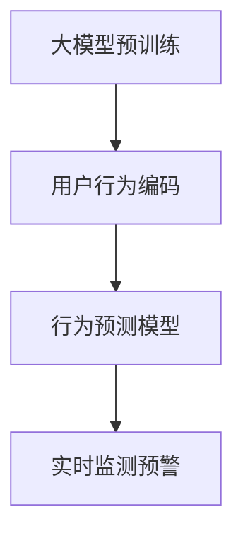
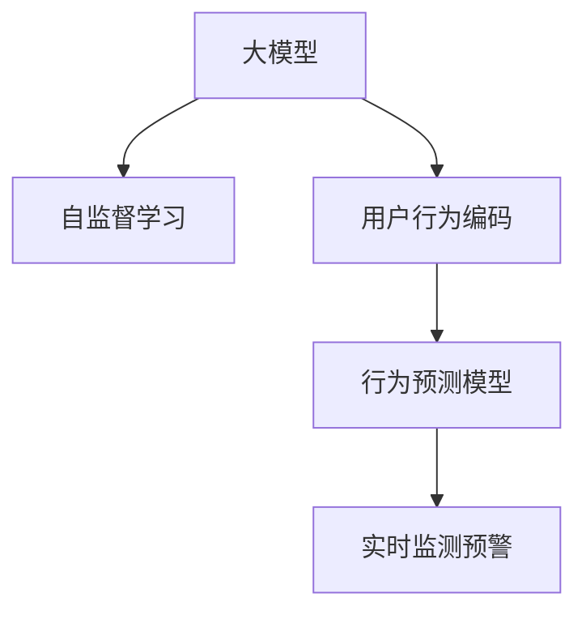

                 

# 大模型驱动的电商平台智能客户流失预警

在当今竞争激烈的电商行业中，客户流失率是衡量公司运营质量和客户满意度的关键指标。为了及时发现和预警潜在流失客户，各大电商平台纷纷投入大量资源开发智能客户流失预警系统。然而，传统的客户流失预测模型往往依赖于用户历史行为数据，难以适应多变的市场环境。本文提出了一种基于大模型驱动的智能客户流失预警方法，借助Transformer大模型对用户行为数据进行高效处理和深度学习，实现对用户流失风险的实时监测和预警。

## 1. 背景介绍

### 1.1 问题由来

随着互联网的普及和电子商务的发展，消费者拥有了更多的购物选择和信息获取渠道。如何把握顾客的需求，留住宝贵的客户，成为各大电商平台面临的共同挑战。传统的客户流失预测方法主要基于用户历史行为数据，通过统计模型、机器学习等技术进行预测。然而，这些方法往往存在以下局限：

- **数据依赖性高**：需要大量历史数据来训练模型，难以适应新市场环境和突发事件。
- **动态性不足**：模型无法实时捕捉用户行为变化，无法及时应对市场动态调整。
- **泛化能力差**：基于特定数据集训练的模型，在面对新用户和新场景时，预测效果下降。

为解决这些问题，各大电商平台纷纷转向基于大模型的客户流失预警系统。大模型如BERT、GPT等，具备强大的自适应能力和泛化能力，能够有效应对动态变化的市场环境，从而提升客户流失预警的准确性和实时性。

### 1.2 问题核心关键点

大模型驱动的智能客户流失预警系统主要由以下核心组件构成：

- **大模型预训练**：使用大规模无标签数据进行自监督预训练，学习通用的用户行为模式。
- **用户行为编码**：将用户行为数据编码成大模型可处理的形式，如文本、图像等。
- **行为预测模型**：在大模型基础上进行微调，构建用户流失预测模型。
- **实时监测预警**：实时采集用户行为数据，输入预测模型进行风险评估，及时预警流失客户。

这些组件之间的逻辑关系可以通过以下Mermaid流程图来展示：



这个流程图展示了大模型驱动的客户流失预警系统的核心组件及其相互关系。

## 2. 核心概念与联系

### 2.1 核心概念概述

为更好地理解大模型驱动的智能客户流失预警方法，本节将介绍几个关键概念：

- **大模型**：以Transformer为基础的大规模语言模型，如BERT、GPT等，通过预训练学习到通用的语言表示和行为模式。
- **自监督学习**：在大规模无标签数据上进行训练，通过任务设计的预训练目标，学习模型对数据的理解能力。
- **用户行为编码**：将用户的点击、浏览、购买等行为数据编码为文本、图像、序列等形式，输入到大模型中进行处理。
- **行为预测模型**：在大模型基础上，通过微调构建用户流失预测模型，预测用户未来流失的概率。
- **实时监测预警**：通过不断采集用户行为数据，输入到预测模型中，实时监测用户流失风险，并及时预警。

这些核心概念之间的逻辑关系可以通过以下Mermaid流程图来展示：



这个流程图展示了大模型驱动的客户流失预警系统的核心概念及其相互关系。

## 3. 核心算法原理 & 具体操作步骤
### 3.1 算法原理概述

基于大模型的智能客户流失预警系统，主要利用自监督学习和微调技术，对用户行为数据进行深度学习和预测。其核心思想是：

1. **自监督预训练**：使用大规模无标签用户行为数据进行预训练，学习通用的行为表示。
2. **行为编码**：将用户行为数据编码为文本、图像、序列等形式，输入到大模型中进行处理。
3. **行为预测模型**：在大模型基础上，通过微调构建用户流失预测模型，预测用户未来流失的概率。
4. **实时监测预警**：通过不断采集用户行为数据，输入到预测模型中，实时监测用户流失风险，并及时预警。

### 3.2 算法步骤详解

基于大模型的智能客户流失预警系统，一般包括以下几个关键步骤：

**Step 1: 数据准备**

- **收集用户行为数据**：从电商平台后台收集用户的历史行为数据，包括点击、浏览、购买、评论等行为数据。
- **数据预处理**：对数据进行清洗、归一化等预处理，保证数据质量。
- **数据划分**：将数据划分为训练集、验证集和测试集，一般采用时间序列划分。

**Step 2: 自监督预训练**

- **模型选择**：选择大模型BERT、GPT等，作为自监督预训练的基础模型。
- **预训练目标**：设计自监督学习任务，如掩码语言模型、next-sentence预测等。
- **预训练数据**：准备大规模无标签用户行为数据，作为预训练数据集。
- **预训练流程**：在大规模无标签数据上进行自监督预训练，学习模型对数据的理解能力。

**Step 3: 行为编码**

- **编码方式**：根据用户行为数据的类型，选择相应的编码方式。如将文本数据编码为序列，将图像数据编码为嵌入向量。
- **编码工具**：使用工具库如TensorFlow、PyTorch等，将用户行为数据编码为模型可处理的格式。
- **数据增强**：通过数据增强技术，如回译、复现等方式，扩充训练集，提高模型的泛化能力。

**Step 4: 行为预测模型微调**

- **模型选择**：选择微调的基础模型，如在大模型上微调添加分类器等。
- **任务定义**：定义微调任务，如二分类任务、多分类任务等。
- **微调目标**：设置微调的优化目标和损失函数，如交叉熵损失、二分类对数损失等。
- **微调过程**：在大模型上微调模型参数，不断优化模型在特定任务上的性能。
- **正则化技术**：应用正则化技术如Dropout、L2正则等，防止过拟合。

**Step 5: 实时监测预警**

- **数据采集**：实时采集用户行为数据，如点击、浏览、购买等行为数据。
- **行为编码**：将实时采集的用户行为数据编码为模型可处理的格式。
- **风险评估**：输入到预测模型中，计算用户流失风险概率。
- **预警机制**：根据风险评估结果，设定预警阈值，及时通知相关人员。

### 3.3 算法优缺点

基于大模型的智能客户流失预警系统，具有以下优点：

- **自适应能力强**：大模型具备强大的自适应能力，能够有效应对市场变化和新用户行为。
- **泛化能力好**：在大规模数据上进行预训练，模型具备良好的泛化能力，对新场景和新用户有较好的预测效果。
- **实时性高**：通过实时监测预警，能够及时捕捉用户行为变化，进行实时预警。

然而，该方法也存在一些缺点：

- **计算资源消耗大**：大模型的计算资源消耗较大，对硬件设备要求较高。
- **模型复杂度较高**：大模型结构复杂，模型参数较多，可能难以解释其内部工作机制。
- **数据隐私问题**：用户行为数据可能涉及隐私信息，需要严格控制数据的获取和使用。

### 3.4 算法应用领域

基于大模型的智能客户流失预警系统，已经在电商、金融、医疗等多个领域得到应用。具体而言：

- **电商**：通过实时监测用户行为数据，及时预警流失客户，提升客户留存率。
- **金融**：对用户交易数据进行监测，预测高风险用户，进行风险防控。
- **医疗**：监测病人出院行为，预警病情复发风险，提升医疗服务质量。

此外，在广告投放、社交网络、在线教育等多个领域，基于大模型的客户流失预警系统也具有广泛的应用前景。

## 4. 数学模型和公式 & 详细讲解  
### 4.1 数学模型构建

本节将使用数学语言对基于大模型的智能客户流失预警方法进行更加严格的刻画。

记用户行为数据为 $X = \{(x_i, y_i)\}_{i=1}^N$，其中 $x_i$ 为行为数据，$y_i$ 为行为标签，标记用户是否流失。

定义大模型为 $M_{\theta}:\mathcal{X} \rightarrow \mathcal{Y}$，其中 $\theta$ 为模型参数。通过自监督预训练，学习到大模型 $M_{\theta}$ 对数据的理解能力。在微调过程中，通过行为编码器 $E(x_i)$，将行为数据 $x_i$ 转换为模型可处理的输入 $E(x_i) \in \mathcal{X'}$。在微调任务中，设计行为预测模型 $P(y_i|E(x_i))$，对用户流失风险进行预测，其预测概率为 $P(y_i|E(x_i)) = \sigma(M_{\theta}(E(x_i)))$，其中 $\sigma$ 为激活函数，如Sigmoid函数。

### 4.2 公式推导过程

以下我们以二分类任务为例，推导行为预测模型的预测概率及其梯度计算公式。

假设用户行为数据 $x_i$ 经过编码后，输入到大模型 $M_{\theta}$ 中，得到输出 $\hat{y}_i = M_{\theta}(E(x_i))$。定义用户流失的概率为 $P(y_i|E(x_i)) = \sigma(\hat{y}_i)$，其中 $\sigma$ 为Sigmoid函数。则二分类任务的损失函数为：

$$
\ell(P(y_i|E(x_i)), y_i) = -[y_i\log P(y_i|E(x_i)) + (1-y_i)\log(1-P(y_i|E(x_i)))
$$

将其代入经验风险公式，得：

$$
\mathcal{L}(\theta) = -\frac{1}{N}\sum_{i=1}^N [y_i\log P(y_i|E(x_i)) + (1-y_i)\log(1-P(y_i|E(x_i)))]
$$

根据链式法则，损失函数对参数 $\theta$ 的梯度为：

$$
\frac{\partial \mathcal{L}(\theta)}{\partial \theta} = -\frac{1}{N}\sum_{i=1}^N (\frac{y_i}{P(y_i|E(x_i))}-\frac{1-y_i}{1-P(y_i|E(x_i))}) \frac{\partial M_{\theta}(E(x_i))}{\partial \theta}
$$

其中 $\frac{\partial M_{\theta}(E(x_i))}{\partial \theta}$ 可进一步递归展开，利用自动微分技术完成计算。

### 4.3 案例分析与讲解

以电商平台流失预警系统为例，假设用户 $i$ 的点击、浏览、购买等行为数据为 $x_i$，预测其流失概率为 $P(y_i|E(x_i))$。假设模型已经在大规模用户行为数据上进行自监督预训练，模型参数为 $\theta$。则通过微调，模型能够学习到用户行为与流失之间的关系。在预测时，先对用户行为数据 $x_i$ 进行编码，输入到模型 $M_{\theta}$ 中，得到输出 $\hat{y}_i = M_{\theta}(E(x_i))$。然后通过Sigmoid函数计算预测概率 $P(y_i|E(x_i)) = \sigma(\hat{y}_i)$。最后根据预测概率和真实标签，计算损失函数 $\ell(P(y_i|E(x_i)), y_i)$，并反向传播更新模型参数 $\theta$。

## 5. 项目实践：代码实例和详细解释说明
### 5.1 开发环境搭建

在进行智能客户流失预警系统开发前，我们需要准备好开发环境。以下是使用Python进行PyTorch开发的环境配置流程：

1. 安装Anaconda：从官网下载并安装Anaconda，用于创建独立的Python环境。

2. 创建并激活虚拟环境：
```bash
conda create -n pytorch-env python=3.8 
conda activate pytorch-env
```

3. 安装PyTorch：根据CUDA版本，从官网获取对应的安装命令。例如：
```bash
conda install pytorch torchvision torchaudio cudatoolkit=11.1 -c pytorch -c conda-forge
```

4. 安装Transformers库：
```bash
pip install transformers
```

5. 安装各类工具包：
```bash
pip install numpy pandas scikit-learn matplotlib tqdm jupyter notebook ipython
```

完成上述步骤后，即可在`pytorch-env`环境中开始智能客户流失预警系统的开发。

### 5.2 源代码详细实现

下面我们以电商平台流失预警系统为例，给出使用Transformers库对BERT模型进行微调的PyTorch代码实现。

首先，定义模型和优化器：

```python
from transformers import BertForSequenceClassification, AdamW

model = BertForSequenceClassification.from_pretrained('bert-base-cased', num_labels=2)

optimizer = AdamW(model.parameters(), lr=2e-5)
```

接着，定义数据处理函数：

```python
from transformers import BertTokenizer
from torch.utils.data import Dataset, DataLoader
import torch

class UserBehaviorDataset(Dataset):
    def __init__(self, behaviors, labels, tokenizer, max_len=128):
        self.behaviors = behaviors
        self.labels = labels
        self.tokenizer = tokenizer
        self.max_len = max_len
        
    def __len__(self):
        return len(self.behaviors)
    
    def __getitem__(self, item):
        behavior = self.behaviors[item]
        label = self.labels[item]
        
        encoding = self.tokenizer(behavior, return_tensors='pt', max_length=self.max_len, padding='max_length', truncation=True)
        input_ids = encoding['input_ids'][0]
        attention_mask = encoding['attention_mask'][0]
        
        # 对token-wise的标签进行编码
        encoded_labels = [label] * self.max_len
        labels = torch.tensor(encoded_labels, dtype=torch.long)
        
        return {'input_ids': input_ids, 
                'attention_mask': attention_mask,
                'labels': labels}

# 标签与id的映射
label2id = {0: '流失', 1: '未流失'}
id2label = {v: k for k, v in label2id.items()}

# 创建dataset
tokenizer = BertTokenizer.from_pretrained('bert-base-cased')

train_dataset = UserBehaviorDataset(train_behaviors, train_labels, tokenizer)
dev_dataset = UserBehaviorDataset(dev_behaviors, dev_labels, tokenizer)
test_dataset = UserBehaviorDataset(test_behaviors, test_labels, tokenizer)
```

然后，定义训练和评估函数：

```python
from tqdm import tqdm

device = torch.device('cuda') if torch.cuda.is_available() else torch.device('cpu')
model.to(device)

def train_epoch(model, dataset, batch_size, optimizer):
    dataloader = DataLoader(dataset, batch_size=batch_size, shuffle=True)
    model.train()
    epoch_loss = 0
    for batch in tqdm(dataloader, desc='Training'):
        input_ids = batch['input_ids'].to(device)
        attention_mask = batch['attention_mask'].to(device)
        labels = batch['labels'].to(device)
        model.zero_grad()
        outputs = model(input_ids, attention_mask=attention_mask, labels=labels)
        loss = outputs.loss
        epoch_loss += loss.item()
        loss.backward()
        optimizer.step()
    return epoch_loss / len(dataloader)

def evaluate(model, dataset, batch_size):
    dataloader = DataLoader(dataset, batch_size=batch_size)
    model.eval()
    preds, labels = [], []
    with torch.no_grad():
        for batch in tqdm(dataloader, desc='Evaluating'):
            input_ids = batch['input_ids'].to(device)
            attention_mask = batch['attention_mask'].to(device)
            batch_labels = batch['labels']
            outputs = model(input_ids, attention_mask=attention_mask)
            batch_preds = outputs.logits.argmax(dim=2).to('cpu').tolist()
            batch_labels = batch_labels.to('cpu').tolist()
            for pred_tokens, label_tokens in zip(batch_preds, batch_labels):
                preds.append(pred_tokens[:len(label_tokens)])
                labels.append(label_tokens)
                
    print(classification_report(labels, preds))
```

最后，启动训练流程并在测试集上评估：

```python
epochs = 5
batch_size = 16

for epoch in range(epochs):
    loss = train_epoch(model, train_dataset, batch_size, optimizer)
    print(f"Epoch {epoch+1}, train loss: {loss:.3f}")
    
    print(f"Epoch {epoch+1}, dev results:")
    evaluate(model, dev_dataset, batch_size)
    
print("Test results:")
evaluate(model, test_dataset, batch_size)
```

以上就是使用PyTorch对BERT进行智能客户流失预警系统微调的完整代码实现。可以看到，得益于Transformers库的强大封装，我们可以用相对简洁的代码完成BERT模型的加载和微调。

### 5.3 代码解读与分析

让我们再详细解读一下关键代码的实现细节：

**UserBehaviorDataset类**：
- `__init__`方法：初始化行为数据、标签、分词器等关键组件。
- `__len__`方法：返回数据集的样本数量。
- `__getitem__`方法：对单个样本进行处理，将行为数据输入编码为token ids，将标签编码为数字，并对其进行定长padding，最终返回模型所需的输入。

**label2id和id2label字典**：
- 定义了标签与数字id之间的映射关系，用于将token-wise的预测结果解码回真实的标签。

**训练和评估函数**：
- 使用PyTorch的DataLoader对数据集进行批次化加载，供模型训练和推理使用。
- 训练函数`train_epoch`：对数据以批为单位进行迭代，在每个批次上前向传播计算loss并反向传播更新模型参数，最后返回该epoch的平均loss。
- 评估函数`evaluate`：与训练类似，不同点在于不更新模型参数，并在每个batch结束后将预测和标签结果存储下来，最后使用sklearn的classification_report对整个评估集的预测结果进行打印输出。

**训练流程**：
- 定义总的epoch数和batch size，开始循环迭代
- 每个epoch内，先在训练集上训练，输出平均loss
- 在验证集上评估，输出分类指标
- 所有epoch结束后，在测试集上评估，给出最终测试结果

可以看到，PyTorch配合Transformers库使得BERT微调的代码实现变得简洁高效。开发者可以将更多精力放在数据处理、模型改进等高层逻辑上，而不必过多关注底层的实现细节。

当然，工业级的系统实现还需考虑更多因素，如模型的保存和部署、超参数的自动搜索、更灵活的任务适配层等。但核心的微调范式基本与此类似。

## 6. 实际应用场景
### 6.1 智能客服系统

基于大模型驱动的智能客户流失预警系统，可以广泛应用于智能客服系统的构建。传统客服往往需要配备大量人力，高峰期响应缓慢，且一致性和专业性难以保证。而使用智能流失预警系统，可以实时监测客户行为，预测流失风险，及时采取措施，提升客户满意度和留存率。

在技术实现上，可以收集企业内部的客服对话记录，将问题-答案对作为监督数据，训练模型学习匹配答案。微调后的模型能够自动理解客户意图，预测流失概率，并在客户有流失倾向时，自动推荐解决方案。通过智能客服系统，企业可以大幅提升客户服务质量，降低运营成本。

### 6.2 金融舆情监测

金融机构需要实时监测市场舆论动向，以便及时应对负面信息传播，规避金融风险。传统的人工监测方式成本高、效率低，难以应对网络时代海量信息爆发的挑战。基于大模型驱动的智能客户流失预警系统，可以对用户行为数据进行实时监测，预测流失风险，及时预警高风险客户。

在技术实现上，可以收集金融领域相关的新闻、报道、评论等文本数据，并对其进行主题标注和情感标注。在此基础上对预训练语言模型进行微调，使其能够自动判断文本属于何种主题，情感倾向是正面、中性还是负面。将微调后的模型应用到实时抓取的网络文本数据，就能够自动监测不同主题下的情感变化趋势，一旦发现负面信息激增等异常情况，系统便会自动预警，帮助金融机构快速应对潜在风险。

### 6.3 个性化推荐系统

当前的推荐系统往往只依赖用户的历史行为数据进行物品推荐，无法深入理解用户的真实兴趣偏好。基于大模型驱动的智能客户流失预警系统，可以更好地挖掘用户行为背后的语义信息，从而提供更精准、多样的推荐内容。

在技术实现上，可以收集用户浏览、点击、评论、分享等行为数据，提取和用户交互的物品标题、描述、标签等文本内容。将文本内容作为模型输入，用户的后续行为（如是否点击、购买等）作为监督信号，在此基础上微调预训练语言模型。微调后的模型能够从文本内容中准确把握用户的兴趣点。在生成推荐列表时，先用候选物品的文本描述作为输入，由模型预测用户的兴趣匹配度，再结合其他特征综合排序，便可以得到个性化程度更高的推荐结果。

### 6.4 未来应用展望

随着大模型和微调方法的不断发展，基于大模型的智能客户流失预警系统将在更多领域得到应用，为各行各业带来变革性影响。

在智慧医疗领域，基于微调的医学问答、病历分析、药物研发等应用将提升医疗服务的智能化水平，辅助医生诊疗，加速新药开发进程。

在智能教育领域，微调技术可应用于作业批改、学情分析、知识推荐等方面，因材施教，促进教育公平，提高教学质量。

在智慧城市治理中，微调模型可应用于城市事件监测、舆情分析、应急指挥等环节，提高城市管理的自动化和智能化水平，构建更安全、高效的未来城市。

此外，在企业生产、社会治理、文娱传媒等众多领域，基于大模型的智能客户流失预警系统也具有广泛的应用前景。

## 7. 工具和资源推荐
### 7.1 学习资源推荐

为了帮助开发者系统掌握大模型驱动的智能客户流失预警理论基础和实践技巧，这里推荐一些优质的学习资源：

1. 《Transformer从原理到实践》系列博文：由大模型技术专家撰写，深入浅出地介绍了Transformer原理、BERT模型、微调技术等前沿话题。

2. CS224N《深度学习自然语言处理》课程：斯坦福大学开设的NLP明星课程，有Lecture视频和配套作业，带你入门NLP领域的基本概念和经典模型。

3. 《Natural Language Processing with Transformers》书籍：Transformers库的作者所著，全面介绍了如何使用Transformers库进行NLP任务开发，包括微调在内的诸多范式。

4. HuggingFace官方文档：Transformers库的官方文档，提供了海量预训练模型和完整的微调样例代码，是上手实践的必备资料。

5. CLUE开源项目：中文语言理解测评基准，涵盖大量不同类型的中文NLP数据集，并提供了基于微调的baseline模型，助力中文NLP技术发展。

通过对这些资源的学习实践，相信你一定能够快速掌握大模型驱动的智能客户流失预警方法的精髓，并用于解决实际的客户流失预测问题。
###  7.2 开发工具推荐

高效的开发离不开优秀的工具支持。以下是几款用于大模型驱动的智能客户流失预警系统开发的常用工具：

1. PyTorch：基于Python的开源深度学习框架，灵活动态的计算图，适合快速迭代研究。大部分预训练语言模型都有PyTorch版本的实现。

2. TensorFlow：由Google主导开发的开源深度学习框架，生产部署方便，适合大规模工程应用。同样有丰富的预训练语言模型资源。

3. Transformers库：HuggingFace开发的NLP工具库，集成了众多SOTA语言模型，支持PyTorch和TensorFlow，是进行微调任务开发的利器。

4. Weights & Biases：模型训练的实验跟踪工具，可以记录和可视化模型训练过程中的各项指标，方便对比和调优。与主流深度学习框架无缝集成。

5. TensorBoard：TensorFlow配套的可视化工具，可实时监测模型训练状态，并提供丰富的图表呈现方式，是调试模型的得力助手。

6. Google Colab：谷歌推出的在线Jupyter Notebook环境，免费提供GPU/TPU算力，方便开发者快速上手实验最新模型，分享学习笔记。

合理利用这些工具，可以显著提升大模型驱动的智能客户流失预警系统的开发效率，加快创新迭代的步伐。

### 7.3 相关论文推荐

大模型驱动的智能客户流失预警系统的发展源于学界的持续研究。以下是几篇奠基性的相关论文，推荐阅读：

1. Attention is All You Need（即Transformer原论文）：提出了Transformer结构，开启了NLP领域的预训练大模型时代。

2. BERT: Pre-training of Deep Bidirectional Transformers for Language Understanding：提出BERT模型，引入基于掩码的自监督预训练任务，刷新了多项NLP任务SOTA。

3. Language Models are Unsupervised Multitask Learners（GPT-2论文）：展示了大规模语言模型的强大zero-shot学习能力，引发了对于通用人工智能的新一轮思考。

4. Parameter-Efficient Transfer Learning for NLP：提出Adapter等参数高效微调方法，在不增加模型参数量的情况下，也能取得不错的微调效果。

5. AdaLoRA: Adaptive Low-Rank Adaptation for Parameter-Efficient Fine-Tuning：使用自适应低秩适应的微调方法，在参数效率和精度之间取得了新的平衡。

这些论文代表了大模型驱动的智能客户流失预警系统的发展脉络。通过学习这些前沿成果，可以帮助研究者把握学科前进方向，激发更多的创新灵感。

## 8. 总结：未来发展趋势与挑战
### 8.1 总结

本文对基于大模型的智能客户流失预警方法进行了全面系统的介绍。首先阐述了智能客户流失预警系统的背景和重要性，明确了智能预警系统在提升客户留存率、优化客户服务等方面的关键作用。其次，从原理到实践，详细讲解了基于大模型的智能客户流失预警方法的理论基础和关键步骤，给出了智能预警系统的完整代码实例。同时，本文还广泛探讨了智能预警系统在智能客服、金融舆情、个性化推荐等多个领域的应用前景，展示了智能预警系统的巨大潜力。此外，本文精选了智能预警系统的各类学习资源，力求为读者提供全方位的技术指引。

通过本文的系统梳理，可以看到，基于大模型的智能客户流失预警系统正在成为智能客户服务的重要组成部分，极大地提升了客户服务的智能化水平，为电商平台带来了可观的经济收益。未来，伴随大模型和微调方法的不断演进，基于智能预警系统的客户流失预测能力将不断提升，为智能客服、智能营销等领域带来更深刻的变革。

### 8.2 未来发展趋势

展望未来，智能客户流失预警系统的发展将呈现以下几个趋势：

1. **自适应能力增强**：通过不断的自监督预训练和微调，智能流失预警系统将具备更强的自适应能力，能够更好地应对新市场环境和用户行为变化。
2. **实时性提升**：通过引入流式数据处理技术，智能流失预警系统将具备实时监测和预警的能力，能够及时捕捉用户行为变化，进行实时预警。
3. **个性化推荐融合**：将智能流失预警系统与个性化推荐系统结合，能够更全面地把握用户需求，提供精准的个性化推荐和流失预警，提升用户体验和留存率。
4. **多模态融合**：将智能流失预警系统扩展到多模态数据，如文本、图像、音频等，能够更好地理解用户行为，提供更全面、更准确的流失预警。
5. **模型压缩与优化**：通过模型压缩和优化技术，智能流失预警系统将具备更小的模型尺寸和更低的计算资源消耗，更好地适应移动设备和嵌入式系统。

以上趋势凸显了智能客户流失预警系统的广阔前景。这些方向的探索发展，必将进一步提升智能预警系统的性能和应用范围，为电商、金融、医疗等各行各业带来更高效的客户服务和管理解决方案。

### 8.3 面临的挑战

尽管基于大模型的智能客户流失预警系统已经取得了一定的进展，但在迈向更加智能化、普适化应用的过程中，它仍面临诸多挑战：

1. **数据隐私问题**：智能流失预警系统涉及用户行为数据的获取和使用，需要严格控制数据的获取和使用，避免数据泄露和滥用。
2. **计算资源消耗**：大规模语言模型和流式数据处理的计算资源消耗较大，对硬件设备要求较高。
3. **模型复杂度**：大模型的结构复杂，模型参数较多，可能难以解释其内部工作机制，影响模型的可解释性和可信度。
4. **实时性保证**：智能流失预警系统需要具备实时监测和预警的能力，如何保证数据采集、处理和模型推理的实时性，是一个重要的技术难题。
5. **用户接受度**：智能流失预警系统的应用可能会对用户隐私和行为产生影响，如何提高用户对系统的接受度和信任度，需要更多的用户研究和市场验证。

### 8.4 研究展望

面向未来，智能客户流失预警系统需要在以下几个方面进行深入研究：

1. **隐私保护技术**：开发隐私保护技术，如差分隐私、联邦学习等，保护用户数据隐私，提高数据使用的安全性。
2. **计算优化技术**：探索模型压缩、量化加速、流式计算等技术，提高智能流失预警系统的计算效率和实时性。
3. **模型解释性**：引入模型解释技术，如可解释性AI、因果推断等，提高模型的可解释性和可信度。
4. **跨模态融合**：研究多模态数据融合技术，将智能流失预警系统扩展到多模态数据，提升系统的感知能力和决策能力。
5. **用户行为理解**：探索用户行为理解的深度学习模型，如生成对抗网络、序列建模等，提高系统对用户行为的理解和预测能力。

这些研究方向将有助于解决智能流失预警系统面临的挑战，进一步提升系统的性能和应用效果，为电商、金融、医疗等领域带来更智能、更可靠的客户流失预警解决方案。

## 9. 附录：常见问题与解答

**Q1：大模型驱动的智能客户流失预警系统是否适用于所有电商平台？**

A: 大模型驱动的智能客户流失预警系统对电商平台的适用性取决于平台的规模、业务复杂度和数据量。对于用户行为数据量较大的平台，如亚马逊、淘宝等，基于大模型的智能预警系统可以取得较好的效果。但对于用户行为数据量较小的平台，可能难以发挥大模型的优势，需要结合平台特性进行优化。

**Q2：在微调过程中如何选择学习率？**

A: 微调学习率的选择需要考虑预训练模型的规模和微调任务的复杂度。一般建议从1e-5开始调参，逐步减小学习率，直至收敛。较大的学习率可能导致模型过拟合，较小的学习率可能导致模型收敛缓慢。可以使用warmup策略，在开始阶段使用较小的学习率，再逐渐过渡到预设值。

**Q3：如何降低智能流失预警系统的计算资源消耗？**

A: 降低智能流失预警系统的计算资源消耗需要从模型和数据处理两方面进行优化。具体措施包括：
1. 模型压缩和优化，如剪枝、量化等技术，减小模型尺寸和计算量。
2. 数据增量和异步处理，如将数据存储在内存中，采用异步I/O等技术，提高数据处理效率。
3. 模型并行和分布式训练，如使用GPU/TPU等设备进行并行计算，提高训练速度和模型性能。

**Q4：智能流失预警系统的实时性如何保证？**

A: 智能流失预警系统的实时性需要从数据采集、处理和模型推理三个方面进行优化。具体措施包括：
1. 实时数据采集，通过流式数据处理技术，如Kafka、Flink等，实现数据的实时采集和处理。
2. 数据缓存和异步处理，将数据缓存到内存中，采用异步处理技术，减少数据处理的延迟。
3. 模型优化和推理加速，通过模型压缩和优化技术，提高模型推理速度和资源利用效率。

**Q5：如何提高智能流失预警系统的可解释性？**

A: 提高智能流失预警系统的可解释性需要引入模型解释技术，如可解释性AI、因果推断等。具体措施包括：
1. 引入可解释性指标，如SHAP值、LIME等，解释模型对每个特征的贡献度。
2. 使用因果推断技术，如SURF等，理解模型的因果关系和决策逻辑。
3. 结合领域知识和专家判断，对模型的输出进行解释和验证，确保模型的可信度。

这些措施将有助于提高智能流失预警系统的可解释性和可信度，增强用户对系统的接受度和信任度。

---

作者：禅与计算机程序设计艺术 / Zen and the Art of Computer Programming

