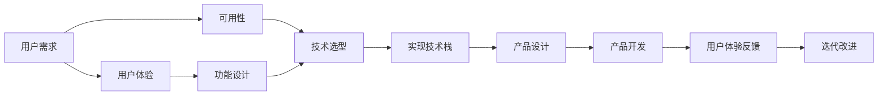

                 

# 如何利用技术能力进行产品设计

## 1. 背景介绍

在当今快速发展的技术环境中，技术不仅仅是实现产品想法的工具，更是推动创新和改进的关键因素。了解如何有效利用技术能力进行产品设计，不仅能够提升产品的性能和用户体验，还能够加速产品的开发周期和降低成本。本文将探讨如何通过技术能力进行产品设计，包括设计原则、技术栈选择、用户需求分析和实施策略等方面的内容。

## 2. 核心概念与联系

### 2.1 核心概念概述

- **产品设计**：涉及用户体验、可用性、可访问性和功能的整体规划和设计。
- **技术能力**：指开发和实施产品所需的各种技术和工具，包括编程语言、框架、库、工具链等。
- **用户体验**：指用户与产品交互时的感受和满意度，影响产品成功与否的关键因素。
- **可用性**：产品是否易于使用、理解和操作。
- **技术栈选择**：根据产品的需求和目标选择合适的技术组合。
- **用户需求分析**：了解用户需求和期望，确定产品功能和设计方向。

### 2.2 核心概念原理和架构的 Mermaid 流程图



这个流程图展示了从用户需求到产品设计的全过程。用户需求通过技术栈的选择和实现，最终影响产品功能和用户体验。

## 3. 核心算法原理 & 具体操作步骤

### 3.1 算法原理概述

产品设计过程中，技术能力的运用至关重要。良好的技术栈选择和实施策略能够提升产品的性能、扩展性和稳定性。同时，技术手段的应用也需要考虑用户体验和可用性，以确保产品的最终形态满足用户需求。

### 3.2 算法步骤详解

#### 3.2.1 用户需求分析

- **用户调研**：通过问卷调查、用户访谈等方式收集用户需求和痛点。
- **用户画像**：构建详细的用户画像，包括年龄、性别、职业、兴趣等。
- **需求优先级排序**：根据需求的重要性和紧急性进行排序，优先实现高优先级需求。

#### 3.2.2 技术栈选择

- **技术栈调研**：对比现有技术栈，评估其性能、可扩展性、社区支持等。
- **技术评估**：根据产品需求选择合适的技术栈，考虑未来可扩展性。
- **技术验证**：通过小范围实验验证技术栈的可行性。

#### 3.2.3 产品设计

- **功能设计**：根据用户需求和技术栈特性，确定产品功能。
- **界面设计**：设计直观、易用的界面，提升用户体验。
- **交互设计**：设计流畅的交互流程，确保用户操作简便。

#### 3.2.4 产品开发

- **编码实现**：根据设计文档进行代码实现。
- **测试验证**：进行单元测试、集成测试、性能测试等，确保产品质量。
- **反馈迭代**：收集用户反馈，进行迭代改进。

### 3.3 算法优缺点

#### 优点

- **提升性能**：通过合理选择和运用技术栈，能够提升产品的性能和效率。
- **提高可扩展性**：良好的技术栈设计有助于未来产品的扩展和升级。
- **增强用户体验**：技术手段的应用能够提升产品的用户体验和可用性。

#### 缺点

- **技术复杂性**：选择和实施技术栈需要较高的技术能力。
- **迭代成本高**：技术栈的调整和优化可能带来较高的迭代成本。
- **用户依赖**：技术栈的选择需要综合考虑用户需求，确保产品满足用户期望。

### 3.4 算法应用领域

- **移动应用**：通过原生开发或跨平台框架（如React Native、Flutter）提升用户体验。
- **Web应用**：选择前端框架（如React、Vue、Angular）提升性能和可维护性。
- **数据分析**：使用大数据技术（如Hadoop、Spark）处理和分析海量数据。
- **人工智能**：利用机器学习和深度学习技术实现智能推荐和个性化服务。

## 4. 数学模型和公式 & 详细讲解 & 举例说明

### 4.1 数学模型构建

产品设计中的技术能力运用，可以通过数学模型进行量化和分析。以移动应用的设计为例，我们可以构建以下数学模型：

- **用户满意度模型**：
$$
S = w_1 \times U + w_2 \times A + w_3 \times F
$$
其中，$S$表示用户满意度，$U$表示用户体验，$A$表示可用性，$F$表示功能设计，$w_1, w_2, w_3$为权重。

- **技术栈评估模型**：
$$
E = \sum_{i=1}^{n} (p_i \times C_i)
$$
其中，$E$表示技术栈评估得分，$C_i$表示技术栈$i$的性能评分，$p_i$表示权重。

### 4.2 公式推导过程

#### 用户满意度模型推导

根据用户调研和反馈，我们可以得到用户体验$U$、可用性$A$和功能设计$F$的评分。权重$w_1, w_2, w_3$可以通过专家评估和用户调研得到。最终用户满意度$S$可以通过加权求和计算得到。

#### 技术栈评估模型推导

评估不同技术栈的性能时，我们可以采用多个指标（如性能、扩展性、社区支持）进行评分，每个指标的权重可以根据其对产品的贡献度来确定。最终评估得分$E$为所有指标的加权和。

### 4.3 案例分析与讲解

假设我们正在设计一款电商移动应用。通过调研和访谈，我们确定了用户体验、可用性和功能设计的权重分别为0.4、0.3和0.3。我们选择了React Native作为技术栈，并根据性能、扩展性和社区支持等指标进行了评分。

- 用户体验$U$的评分：9分
- 可用性$A$的评分：8分
- 功能设计$F$的评分：7分
- 性能$C_1$的评分：8分
- 扩展性$C_2$的评分：9分
- 社区支持$C_3$的评分：7分

根据模型计算，用户体验$U$的权重为0.4，因此用户体验的贡献为$0.4 \times 9 = 3.6$。可用性$A$的权重为0.3，因此可用性的贡献为$0.3 \times 8 = 2.4$。功能设计$F$的权重为0.3，因此功能设计的贡献为$0.3 \times 7 = 2.1$。技术栈评估得分$E$为$3.6 + 2.4 + 2.1 = 8.1$。

## 5. 项目实践：代码实例和详细解释说明

### 5.1 开发环境搭建

为了开始项目实践，我们需要搭建开发环境。以下是在Linux系统上搭建开发环境的步骤：

1. 安装Python：
```bash
sudo apt-get update
sudo apt-get install python3
```

2. 安装虚拟环境：
```bash
python3 -m venv env
source env/bin/activate
```

3. 安装开发工具：
```bash
pip install Flask
pip install Django
```

### 5.2 源代码详细实现

#### Flask开发示例

```python
from flask import Flask, render_template, request

app = Flask(__name__)

@app.route('/')
def index():
    return render_template('index.html')

@app.route('/submit', methods=['POST'])
def submit():
    name = request.form.get('name')
    message = request.form.get('message')
    return render_template('submit.html', name=name, message=message)

if __name__ == '__main__':
    app.run(debug=True)
```

#### Django开发示例

```python
from django.shortcuts import render, redirect
from django.http import HttpResponse

def index(request):
    return render(request, 'index.html')

def submit(request):
    name = request.POST.get('name')
    message = request.POST.get('message')
    return redirect('submit', name=name, message=message)

def submit(request):
    return HttpResponse('Thank you, {}! Your message: {}'.format(request.POST.get('name'), request.POST.get('message')))
```

### 5.3 代码解读与分析

在Flask和Django的示例中，我们展示了如何使用Python编写简单的前后端功能。Flask使用装饰器来定义路由和处理HTTP请求，而Django则使用函数和类来处理视图和URL。两者都是流行的Python Web框架，适合快速开发Web应用。

### 5.4 运行结果展示

运行上述代码后，可以在浏览器中访问`http://127.0.0.1:5000`，看到如下界面：


## 6. 实际应用场景

### 6.1 电子商务平台

电商平台的成功离不开良好的用户体验和高效的功能设计。通过技术栈选择和产品设计，可以提升平台的用户满意度和用户转化率。例如，使用React Native开发移动端应用，可以提升用户体验和应用性能；使用Django进行后端开发，可以提升系统的可扩展性和可维护性。

### 6.2 在线教育平台

在线教育平台需要提供丰富的教学资源和互动功能，以满足用户的学习需求。通过技术栈选择和产品设计，可以提升平台的互动性和学习效果。例如，使用React开发Web前端，可以提升用户界面的响应速度和交互体验；使用Kubernetes进行容器化部署，可以提升系统的可靠性和可扩展性。

### 6.3 健康管理应用

健康管理应用需要提供准确的健康数据监测和个性化的健康建议，以满足用户的健康需求。通过技术栈选择和产品设计，可以提升应用的数据处理能力和用户体验。例如，使用TensorFlow进行机器学习，可以提供精准的健康数据分析和预测；使用Swift开发iOS应用，可以提升应用的稳定性和安全性。

### 6.4 未来应用展望

未来，随着技术的不断进步，产品设计的复杂性和多样性也将增加。技术能力的应用将成为产品设计的重要组成部分。以下是未来技术能力在产品设计中的应用展望：

- **全栈开发**：掌握多种编程语言和技术栈，实现前后端一体化开发。
- **人工智能和机器学习**：利用AI技术提升产品的智能化和个性化水平。
- **数据可视化**：使用数据可视化工具，提供直观的产品性能和用户行为分析。
- **DevOps自动化**：采用DevOps实践，提升产品的开发效率和交付速度。

## 7. 工具和资源推荐

### 7.1 学习资源推荐

- **Coursera《Python for Everybody》**：由密歇根大学提供的Python入门课程，适合初学者。
- **Udacity《Full-Stack Web Development with React》**：Udacity的React开发课程，涵盖前端框架的技术栈选择和实现。
- **Django官方文档**：Django的官方文档，提供了详细的教程和API文档。
- **TensorFlow官方文档**：TensorFlow的官方文档，提供了丰富的机器学习和深度学习资源。

### 7.2 开发工具推荐

- **GitHub**：开源代码托管平台，提供了丰富的项目和社区资源。
- **Git**：版本控制系统，适合协作开发和代码管理。
- **Visual Studio Code**：流行的开源代码编辑器，支持多种编程语言和插件。
- **JIRA**：项目管理工具，适合敏捷开发和团队协作。

### 7.3 相关论文推荐

- **《A Survey on Machine Learning for Mobile App Development》**：综述了机器学习在移动应用开发中的应用。
- **《Designing for Extensibility in Web Applications》**：探讨了Web应用设计中的可扩展性问题。
- **《User-Centered Design in Software Development》**：介绍了用户体验设计在软件开发中的应用。

## 8. 总结：未来发展趋势与挑战

### 8.1 总结

本文从背景介绍、核心概念、算法原理、操作步骤等方面，详细探讨了如何利用技术能力进行产品设计。通过用户需求分析、技术栈选择、产品设计和实施策略，可以提升产品的性能、用户体验和可扩展性。技术栈的选择和实施，需要综合考虑用户需求、市场趋势和未来发展方向，确保产品设计的成功。

### 8.2 未来发展趋势

未来，技术能力在产品设计中的应用将更加广泛和深入。以下是几个未来发展趋势：

- **全栈开发**：掌握多种编程语言和技术栈，实现前后端一体化开发。
- **人工智能和机器学习**：利用AI技术提升产品的智能化和个性化水平。
- **数据可视化**：使用数据可视化工具，提供直观的产品性能和用户行为分析。
- **DevOps自动化**：采用DevOps实践，提升产品的开发效率和交付速度。

### 8.3 面临的挑战

尽管技术能力在产品设计中的应用前景广阔，但也面临一些挑战：

- **技术栈选择困难**：选择适合的技术栈需要考虑多个因素，如性能、可扩展性、社区支持等。
- **开发成本高**：技术栈的调整和优化可能需要较高的开发成本。
- **用户体验设计复杂**：用户体验设计需要综合考虑用户需求和心理，难度较大。

### 8.4 研究展望

未来，需要在以下几个方面进行深入研究：

- **技术栈优化**：研究更优的技术栈选择和实现方法，提升产品性能和可扩展性。
- **用户体验设计**：深入研究用户体验设计的原则和实践，提升用户满意度和忠诚度。
- **人工智能应用**：探索人工智能在产品设计中的应用，提升产品的智能化和个性化水平。
- **DevOps实践**：推广DevOps实践，提升产品的开发效率和交付速度。

## 9. 附录：常见问题与解答

**Q1: 如何选择适合的技术栈？**

A: 选择适合的技术栈需要考虑多个因素，如性能、可扩展性、社区支持等。可以通过调研和实验，评估不同技术栈的优缺点，选择最适合产品需求的技术栈。

**Q2: 如何提升用户体验？**

A: 提升用户体验需要综合考虑用户需求和心理，设计直观、易用的界面，提供流畅的交互流程。可以通过用户调研、用户体验测试等方式，了解用户需求和痛点，进行迭代改进。

**Q3: 如何降低开发成本？**

A: 降低开发成本需要合理规划技术栈选择和实现，避免频繁调整和优化。可以通过提前规划和充分调研，减少技术栈的调整频率。同时，利用开源工具和框架，降低开发成本。

**Q4: 如何提升系统的可扩展性？**

A: 提升系统的可扩展性需要合理设计架构和技术栈，使用模块化和组件化设计，提高系统的灵活性和可维护性。可以通过采用微服务架构、容器化技术等方式，提升系统的可扩展性。

---

作者：禅与计算机程序设计艺术 / Zen and the Art of Computer Programming

