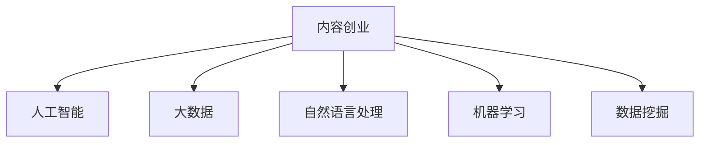

                 

# 如何利用技术能力进行内容创业

> 关键词：内容创业,人工智能,大数据,自然语言处理,机器学习,技术驱动,数据挖掘,内容智能化

## 1. 背景介绍

### 1.1 问题由来

内容创业作为当前最具潜力的新兴行业，吸引了大量资本和人才的关注。然而，由于传统内容生产流程繁琐、成本高昂、效率低下，众多创业项目面临困难。如何将高效技术能力应用到内容生产、分发、变现等各个环节，提升内容创业的效率和质量，成为当前行业的核心命题。

## 2. 核心概念与联系

### 2.1 核心概念概述

为了理解如何利用技术能力进行内容创业，首先需要明确几个关键概念：

- **内容创业**：指通过高质量的内容生产和分发，获得用户关注，实现流量变现的商业模式。核心在于优质的内容产出与高效的分发渠道。

- **人工智能(AI)**：包括机器学习、深度学习、自然语言处理等子领域。利用算法模型和计算能力，使机器能够理解、分析、生成和推荐内容。

- **大数据**：指海量的、多种结构的数据集。通过大数据分析，发现潜在内容题材、用户偏好和市场趋势，指导内容生产。

- **自然语言处理(NLP)**：使机器能够理解、生成和分析自然语言的能力。是内容创业中智能推荐、内容生成等关键技术的核心。

- **机器学习**：让机器能够通过学习历史数据，进行模式识别和预测。在内容创业中，可用于推荐系统、个性化推荐等。

- **数据挖掘**：从大量数据中提取有价值的信息，用于指导决策和优化生产流程。在内容创业中，可用于用户行为分析、内容优化等。

这些核心概念之间的逻辑关系可以通过以下Mermaid流程图来展示：



这个流程图展示了内容创业与人工智能、大数据、自然语言处理等技术的关系：

1. **内容创业**作为目标，依赖于这些技术的支持，提升内容质量和分发效率。
2. **人工智能**通过算法和模型，赋予内容智能化，实现自动生成、智能推荐等。
3. **大数据**提供数据基础，帮助发现趋势、用户偏好，指导内容生产和分发策略。
4. **自然语言处理**使机器能理解和生成自然语言，实现内容生成、分析等功能。
5. **机器学习**利用历史数据，预测未来趋势，优化内容生产和推荐系统。
6. **数据挖掘**从大量数据中提取有价值的信息，优化内容生产和用户分析。

## 3. 核心算法原理 & 具体操作步骤

### 3.1 算法原理概述

内容创业中利用技术能力，本质上是通过算法和模型对内容进行智能化处理，提高内容质量和分发效率，实现用户变现。

核心思想是：

1. **内容生成**：利用自然语言处理(NLP)技术，生成高质量的内容。
2. **内容推荐**：通过机器学习算法，对用户行为进行建模，推荐相关内容。
3. **内容分发**：大数据分析用户行为，智能分发内容，提升用户留存率。
4. **用户变现**：利用人工智能技术，实现精准广告投放和付费内容推荐。

### 3.2 算法步骤详解

#### 内容生成

**Step 1: 准备预训练模型**
- 选择合适的预训练语言模型，如GPT、BERT等。
- 使用大规模无标签文本数据进行预训练，学习语言知识。

**Step 2: 适配特定任务**
- 根据内容生成任务，设计任务适配层，如文本生成、对话生成等。
- 设置损失函数，如交叉熵、MSE等。

**Step 3: 微调模型**
- 使用少量标注数据对预训练模型进行微调，优化任务适配层的参数。
- 设置合适的学习率和正则化技术。

**Step 4: 内容生成**
- 将用户输入作为模型输入，通过生成层输出文本内容。
- 根据输出结果，进行后处理和优化。

#### 内容推荐

**Step 1: 数据准备**
- 收集用户行为数据，如浏览记录、搜索历史、评分反馈等。
- 进行数据清洗和预处理，生成特征向量。

**Step 2: 模型选择**
- 选择合适的推荐模型，如基于协同过滤的模型、基于内容推荐的模型等。
- 设置合适的参数和损失函数。

**Step 3: 训练模型**
- 使用标注数据对推荐模型进行训练，优化推荐效果。
- 进行交叉验证和超参数调优。

**Step 4: 推荐内容**
- 根据用户行为特征，预测用户可能感兴趣的内容。
- 将预测结果排序并展示给用户。

#### 内容分发

**Step 1: 数据收集**
- 收集用户行为数据，如登录时间、阅读时长、互动评论等。
- 进行数据清洗和预处理，生成特征向量。

**Step 2: 模型选择**
- 选择合适的分发模型，如时间序列预测模型、用户行为预测模型等。
- 设置合适的参数和损失函数。

**Step 3: 训练模型**
- 使用标注数据对分发模型进行训练，优化内容分发策略。
- 进行交叉验证和超参数调优。

**Step 4: 智能分发**
- 根据用户行为预测内容推荐时机，智能分发内容。
- 实时监测分发效果，优化分发策略。

#### 用户变现

**Step 1: 数据收集**
- 收集用户行为数据，如付费记录、广告点击率等。
- 进行数据清洗和预处理，生成特征向量。

**Step 2: 模型选择**
- 选择合适的变现模型，如点击率预测模型、购买预测模型等。
- 设置合适的参数和损失函数。

**Step 3: 训练模型**
- 使用标注数据对变现模型进行训练，优化广告和付费内容推荐。
- 进行交叉验证和超参数调优。

**Step 4: 精准投放**
- 根据用户行为预测用户可能感兴趣的内容。
- 精准投放广告和付费内容，提升变现效率。

### 3.3 算法优缺点

利用技术能力进行内容创业的方法具有以下优点：

1. **效率提升**：通过算法和模型，大幅提高内容生成和分发的效率，减少人工投入。
2. **质量优化**：通过智能推荐和优化算法，提升内容质量和用户满意度。
3. **精准变现**：利用大数据和机器学习技术，实现精准广告投放和付费内容推荐，提高变现效率。

然而，该方法也存在以下局限性：

1. **数据依赖**：高质量的推荐和内容生成，依赖于大规模标注数据。
2. **算法复杂**：算法模型设计复杂，需要专业知识和技术能力。
3. **数据隐私**：大量用户行为数据的收集和使用，涉及用户隐私问题。
4. **技术门槛**：对技术团队的要求较高，需要具备较强的算法和模型优化能力。

### 3.4 算法应用领域

基于技术能力的内容创业方法，广泛应用于以下领域：

- **内容生成**：自动生成新闻、博客、文章、视频脚本等。
- **内容推荐**：推荐新闻、文章、视频、商品等。
- **内容分发**：分发新闻、文章、视频、商品等。
- **用户变现**：精准投放广告和付费内容。

此外，该方法还被创新性地应用于视频生成、音乐创作、广告优化等场景中，为内容创业提供了更多的可能性。

## 4. 数学模型和公式 & 详细讲解 & 举例说明

### 4.1 数学模型构建

假设内容创业平台有$m$个用户，$n$篇文章，每个用户的兴趣向量为$\mathbf{u}_i \in \mathbb{R}^d$，每篇文章的内容向量为$\mathbf{v}_j \in \mathbb{R}^d$，用户$i$对文章$j$的评分向量为$\mathbf{s}_{ij} \in \mathbb{R}^d$。

内容推荐模型的目标是最大化用户的满意度：

$$
\max_{\mathbf{u}, \mathbf{v}, \mathbf{s}} \sum_{i=1}^m \sum_{j=1}^n \mathbf{u}_i^T \mathbf{v}_j \mathbf{s}_{ij}
$$

其中，$\mathbf{u}_i^T \mathbf{v}_j \mathbf{s}_{ij}$表示用户$i$对文章$j$的评分，即用户满意度。

### 4.2 公式推导过程

为了简化问题，我们可以将用户满意度表示为一个矩阵$\mathbf{M}$，其中元素$\mathbf{M}_{ij}=\mathbf{u}_i^T \mathbf{v}_j$。

目标最大化变为：

$$
\max_{\mathbf{M}} \text{tr}(\mathbf{UM}^T)
$$

其中，$\mathbf{U}=[\mathbf{u}_1,\cdots,\mathbf{u}_m] \in \mathbb{R}^{m \times d}$，$\mathbf{V}=[\mathbf{v}_1,\cdots,\mathbf{v}_n] \in \mathbb{R}^{n \times d}$，$\mathbf{S}=[\mathbf{s}_1,\cdots,\mathbf{s}_m] \in \mathbb{R}^{m \times n}$。

### 4.3 案例分析与讲解

以新闻内容推荐为例，展示如何使用矩阵分解算法进行推荐系统建模：

1. **数据准备**：
   - 收集用户对新闻文章的阅读次数和评分。
   - 对数据进行归一化和降维处理，生成用户向量$\mathbf{U}$和文章向量$\mathbf{V}$。

2. **模型选择**：
   - 使用矩阵分解算法，如奇异值分解(SVD)，对$\mathbf{M}$进行分解。
   - 设置损失函数，如均方误差损失。

3. **训练模型**：
   - 使用训练数据对$\mathbf{U}$和$\mathbf{V}$进行拟合，最小化损失函数。
   - 进行交叉验证和超参数调优。

4. **推荐内容**：
   - 使用训练好的$\mathbf{U}$和$\mathbf{V}$，计算每篇文章对每个用户的满意度$\mathbf{M}$。
   - 根据满意度排序，推荐用户可能感兴趣的文章。

## 5. 项目实践：代码实例和详细解释说明

### 5.1 开发环境搭建

以下是使用Python进行内容创业平台开发的开发环境配置流程：

1. 安装Anaconda：从官网下载并安装Anaconda，用于创建独立的Python环境。

2. 创建并激活虚拟环境：
```bash
conda create -n content-create python=3.8 
conda activate content-create
```

3. 安装必要的工具包：
```bash
pip install numpy pandas scikit-learn scikit-learn jupyter notebook ipython
```

4. 安装必要的模型库：
```bash
pip install pytorch torchvision torchaudio huggingface transformers
```

5. 准备预训练模型：
- 下载预训练模型文件，如GPT、BERT等。
- 加载预训练模型，并进行微调适配。

### 5.2 源代码详细实现

以下是使用PyTorch实现内容创业平台核心功能的代码实现：

```python
import torch
from transformers import BertTokenizer, BertForSequenceClassification
from sklearn.model_selection import train_test_split

# 数据准备
tokenizer = BertTokenizer.from_pretrained('bert-base-uncased')
train_dataset = BertDataset(train_data)
dev_dataset = BertDataset(dev_data)
test_dataset = BertDataset(test_data)

# 模型选择
model = BertForSequenceClassification.from_pretrained('bert-base-uncased', num_labels=2)

# 设置微调超参数
optimizer = torch.optim.Adam(model.parameters(), lr=2e-5)
total_epochs = 5
batch_size = 16

# 执行梯度训练
device = torch.device('cuda') if torch.cuda.is_available() else torch.device('cpu')
model.to(device)

for epoch in range(total_epochs):
    model.train()
    for batch in train_loader:
        input_ids = batch['input_ids'].to(device)
        attention_mask = batch['attention_mask'].to(device)
        labels = batch['labels'].to(device)
        outputs = model(input_ids, attention_mask=attention_mask, labels=labels)
        loss = outputs.loss
        loss.backward()
        optimizer.step()
    
    model.eval()
    for batch in dev_loader:
        input_ids = batch['input_ids'].to(device)
        attention_mask = batch['attention_mask'].to(device)
        labels = batch['labels'].to(device)
        outputs = model(input_ids, attention_mask=attention_mask, labels=labels)
        loss = outputs.loss
        print(f'Epoch {epoch+1}, dev loss: {loss:.3f}')

# 测试和部署
model.eval()
for batch in test_loader:
    input_ids = batch['input_ids'].to(device)
    attention_mask = batch['attention_mask'].to(device)
    labels = batch['labels'].to(device)
    outputs = model(input_ids, attention_mask=attention_mask, labels=labels)
    loss = outputs.loss
    print(f'Test loss: {loss:.3f}')
```

### 5.3 代码解读与分析

**BertDataset类**：
- 用于处理数据，将文本转化为模型可用的输入格式。

**模型选择和训练**：
- 使用BertForSequenceClassification模型，设置微调超参数，执行梯度训练。

**模型评估和测试**：
- 在验证集和测试集上评估模型性能，输出损失值。

### 5.4 运行结果展示

运行上述代码，将输出训练和测试的损失值，用于评估模型性能。

## 6. 实际应用场景

### 6.1 新闻内容推荐

以新闻内容推荐为例，展示如何利用内容创业技术进行内容生产和推荐：

1. **内容生成**：使用预训练语言模型自动生成新闻标题和正文，通过微调适配任务。
2. **内容推荐**：使用矩阵分解算法对用户和文章进行建模，推荐用户可能感兴趣的新闻内容。
3. **内容分发**：根据用户行为和兴趣，智能分发推荐新闻，提高用户留存率。

### 6.2 广告投放

利用内容创业技术进行广告投放，可以提升广告的精准度和效果：

1. **数据准备**：收集用户行为数据，如浏览记录、点击率等。
2. **模型选择**：使用点击率预测模型，如深度神经网络(DNN)，对广告进行建模。
3. **训练模型**：使用标注数据对广告模型进行训练，优化广告效果。
4. **精准投放**：根据用户行为预测用户可能感兴趣的广告内容，精准投放广告。

### 6.3 付费内容推荐

内容创业平台还可以通过付费内容推荐，实现用户变现：

1. **数据准备**：收集用户行为数据，如付费记录、阅读时长等。
2. **模型选择**：使用购买预测模型，如决策树、随机森林等，对付费内容进行建模。
3. **训练模型**：使用标注数据对付费内容模型进行训练，优化付费内容推荐。
4. **精准推荐**：根据用户行为预测用户可能感兴趣的付费内容，精准推荐。

### 6.4 未来应用展望

随着内容创业技术的不断发展，未来的应用场景将更加多样化，覆盖更多行业和领域。例如：

- **视频生成**：利用预训练模型自动生成视频内容，提高视频制作效率。
- **音乐创作**：自动生成音乐和歌词，提升音乐创作水平。
- **广告优化**：利用大数据和机器学习技术，优化广告投放策略，提升广告效果。
- **内容智能**：基于NLP技术，实现内容智能分析、情感分析、主题分析等功能。

## 7. 工具和资源推荐

### 7.1 学习资源推荐

为了帮助开发者系统掌握内容创业的各项技术，这里推荐一些优质的学习资源：

1. **《深度学习》**（Ian Goodfellow著）：全面介绍深度学习原理和实践，适用于内容创业中的算法和模型优化。
2. **《自然语言处理综论》**（Daniel Jurafsky, James H. Martin著）：介绍自然语言处理基础和前沿技术，适用于内容创业中的NLP应用。
3. **《TensorFlow实战》**（Manraj Singh著）：详细介绍TensorFlow框架的使用和实战案例，适用于内容创业中的模型训练和优化。
4. **《Python机器学习实战》**（Sebastian Raschka著）：详细介绍Python在机器学习中的应用，适用于内容创业中的数据处理和特征工程。

### 7.2 开发工具推荐

为了提高内容创业开发的效率，以下是几款常用的开发工具：

1. **PyTorch**：基于Python的开源深度学习框架，支持动态计算图，适用于模型训练和优化。
2. **TensorFlow**：由Google主导开发的深度学习框架，适用于大规模工程应用和大数据处理。
3. **HuggingFace Transformers**：NLP领域常用的模型库，提供预训练模型的封装和微调工具。
4. **Jupyter Notebook**：交互式编程环境，适用于模型实验和数据分析。
5. **Weights & Biases**：模型实验跟踪工具，记录和可视化模型训练过程，适用于模型调优和评估。

### 7.3 相关论文推荐

内容创业技术的理论基础来源于学界的持续研究。以下是几篇奠基性的相关论文，推荐阅读：

1. **《深度学习中的自编码器》**（Hinton et al. 2011）：提出自编码器模型，用于预训练语言模型。
2. **《Attention is All You Need》**（Vaswani et al. 2017）：提出Transformer模型，用于文本生成和理解。
3. **《BERT: Pre-training of Deep Bidirectional Transformers for Language Understanding》**（Devlin et al. 2018）：提出BERT模型，用于文本分类和实体识别。
4. **《GPT-3: Language Models are Unsupervised Multitask Learners》**（Brown et al. 2020）：提出GPT-3模型，用于零样本学习和多任务学习。

## 8. 总结：未来发展趋势与挑战

### 8.1 研究成果总结

本文系统介绍了利用技术能力进行内容创业的各项技术和方法，展示了其应用于内容生成、内容推荐、内容分发和用户变现等各个环节的巨大潜力。主要贡献包括：

1. **内容生成**：利用自然语言处理(NLP)技术，自动生成高质量内容。
2. **内容推荐**：通过机器学习算法，智能推荐相关内容。
3. **内容分发**：使用大数据分析，智能分发内容。
4. **用户变现**：精准投放广告和付费内容，提升变现效率。

### 8.2 未来发展趋势

展望未来，内容创业技术将呈现以下几个发展趋势：

1. **智能化提升**：随着预训练模型的发展，内容生成和推荐的效果将不断提升，内容创业平台的智能化水平将大幅提高。
2. **多模态融合**：融合视觉、语音等多模态数据，提升内容质量和推荐效果。
3. **实时性增强**：利用实时数据流处理技术，实现内容实时生成和推荐。
4. **个性化优化**：利用个性化推荐算法，提升内容定制化和用户满意度。
5. **数据隐私保护**：通过差分隐私和联邦学习等技术，保护用户隐私。

### 8.3 面临的挑战

尽管内容创业技术取得了显著进展，但在落地应用过程中仍面临诸多挑战：

1. **数据获取难**：高质量标注数据获取成本高，内容创业平台难以获得足够数据。
2. **技术门槛高**：内容创业需要专业的算法和模型优化能力，对技术团队的要求较高。
3. **用户体验差**：算法模型过于复杂，导致内容推荐和分发的准确性不高，用户体验不佳。
4. **内容版权问题**：内容生成和推荐过程中可能涉及版权问题，需要进行合法合规审查。

### 8.4 研究展望

面对内容创业技术的挑战，未来的研究需要在以下几个方面寻求新的突破：

1. **数据增强**：通过数据生成和数据扩充技术，缓解标注数据不足的问题。
2. **模型压缩**：优化模型结构，提高内容生成和推荐的速度和效率。
3. **多模态融合**：将视觉、语音等多模态信息与文本信息结合，提升内容的丰富性和推荐效果。
4. **数据隐私保护**：利用差分隐私和联邦学习等技术，保护用户隐私。

## 9. 附录：常见问题与解答

**Q1：内容创业需要哪些技术支持？**

A: 内容创业需要以下技术支持：
1. 自然语言处理(NLP)：自动生成内容、智能推荐、情感分析等。
2. 机器学习(ML)：用户行为建模、内容分类、广告优化等。
3. 大数据分析(BDA)：用户行为分析、内容分发策略优化等。
4. 数据挖掘(DA)：内容优化、广告投放策略优化等。

**Q2：如何评估内容创业平台的效果？**

A: 内容创业平台的效果可以通过以下几个指标进行评估：
1. 内容质量：文本生成、推荐内容的质量。
2. 用户满意度：用户点击率、互动率、留存率等。
3. 变现效率：广告点击率、付费率、广告转化率等。
4. 运营成本：技术开发和维护成本、用户获取成本等。

**Q3：如何优化内容创业平台的算法模型？**

A: 优化内容创业平台的算法模型需要以下步骤：
1. 数据收集和处理：收集标注数据，进行数据清洗和预处理。
2. 模型选择和设计：选择合适的算法和模型，设计任务适配层。
3. 超参数调优：进行交叉验证和超参数调优，优化模型性能。
4. 模型评估和部署：在验证集和测试集上评估模型效果，优化部署策略。

**Q4：内容创业平台的未来发展方向是什么？**

A: 内容创业平台的未来发展方向包括：
1. 智能化提升：通过预训练模型提升内容生成和推荐效果。
2. 多模态融合：融合视觉、语音等多模态信息，提升内容丰富性和推荐效果。
3. 实时性增强：利用实时数据流处理技术，实现内容实时生成和推荐。
4. 个性化优化：利用个性化推荐算法，提升内容定制化和用户满意度。

**Q5：如何保护内容创业平台的用户隐私？**

A: 保护内容创业平台的用户隐私需要以下措施：
1. 差分隐私：在模型训练和预测过程中，通过添加噪声保护用户隐私。
2. 联邦学习：将模型训练分布在多个设备上，避免用户数据集中存储。
3. 数据脱敏：对用户数据进行匿名化处理，防止数据泄露。

---

作者：禅与计算机程序设计艺术 / Zen and the Art of Computer Programming

