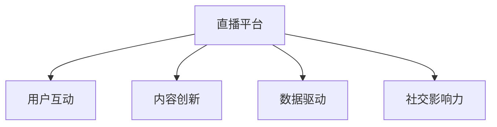

                 

# 如何利用直播平台增加课程口碑

> 关键词：直播平台,课程推广,用户互动,内容创新,数据驱动

## 1. 背景介绍

在快速发展的互联网时代，在线教育成为一种流行且高效的课程传播方式。然而，如何让在线课程脱颖而出，获得更多用户的认可和好评，成为众多教育机构和课程开发者面临的共同难题。直播平台凭借其即时、互动的特点，为课程推广提供了新的思路和方向。

### 1.1 问题由来

近年来，许多在线教育平台纷纷尝试通过直播形式开展课程教学和推广。然而，即便投入了巨大的资源，许多直播课程仍未能获得理想的口碑。主要原因在于缺乏系统性的策略和全面的视角，无法真正激发学生的参与和兴趣。

### 1.2 问题核心关键点

本文旨在探讨如何通过直播平台有效提升课程口碑。主要关注以下核心关键点：
1. **用户互动性**：如何通过直播平台的即时互动特性，增强学生参与度。
2. **内容创新性**：如何打造有吸引力的直播内容，提升学习体验。
3. **数据驱动**：如何利用数据分析，优化课程内容和推广策略。
4. **社交影响力**：如何通过社交网络效应，扩散课程影响力。

## 2. 核心概念与联系

### 2.1 核心概念概述

为更好地理解如何通过直播平台增加课程口碑，本节将介绍几个密切相关的核心概念：

- **直播平台**：一种提供实时音视频传输服务的网络平台，支持用户进行即时互动和共享。常见的直播平台包括哔哩哔哩、腾讯课堂等。
- **在线课程**：通过视频、音频、文本等多种形式，向用户传递知识、技能和信息的课程形式。在线课程主要依赖互联网进行传播和教学。
- **用户互动**：指直播平台中用户与讲师、用户与用户之间的沟通和交流。良好的互动可以提升学习效果和用户满意度。
- **内容创新**：指通过引入新鲜、有趣的内容形式，吸引用户关注，提升学习兴趣。
- **数据驱动**：指利用数据分析和挖掘技术，优化课程内容和推广策略，提升用户体验。
- **社交影响力**：指通过社交媒体和网络社区，扩散课程影响，吸引更多用户关注和参与。

这些概念之间的逻辑关系可以通过以下Mermaid流程图来展示：



这个流程图展示了直播平台与核心概念之间的联系：

1. 直播平台是实现用户互动、内容创新、数据驱动和社交影响力的基础。
2. 用户互动是提升学习效果和用户满意度的关键。
3. 内容创新是吸引用户关注和学习兴趣的重要手段。
4. 数据驱动是优化课程内容和推广策略的科学方法。
5. 社交影响力是扩散课程影响、吸引更多用户关注和参与的有效途径。

## 3. 核心算法原理 & 具体操作步骤

### 3.1 算法原理概述

通过直播平台增加课程口碑，本质上是一种结合用户体验和社交网络效应的综合策略。其核心思想是通过互动、创新、数据和社交等多维度的优化，提升课程的学习效果和用户满意度，从而获得更好的口碑。

形式化地，假设课程在直播平台上的口碑由 $K$ 个影响因素决定，每个因素的影响权重为 $w_i$，则课程口碑 $K$ 可以表示为：

$$
K = \sum_{i=1}^{K} w_i \cdot P_i
$$

其中 $P_i$ 为第 $i$ 个影响因素的实际表现。优化课程口碑的目标是通过调整影响因素 $P_i$ 和权重 $w_i$，最大化课程口碑 $K$。

### 3.2 算法步骤详解

基于直播平台增加课程口碑，一般包括以下几个关键步骤：

**Step 1: 设计互动环节**

- 在直播中设计实时问答、投票、讨论等互动环节，提升学生参与度。
- 鼓励学生提出问题，讲师实时解答，增强教学的互动性和趣味性。
- 引入小组成员讨论、同伴评价等形式，增加学习的社交属性。

**Step 2: 创新课程内容**

- 引入最新技术、热点话题、趣味实验等内容，增加课程的新颖性和吸引力。
- 结合直播的实时互动特性，引入实时演示、即时互动、现场实验等形式，提升学习体验。
- 利用游戏化设计，通过积分、排名、奖励等机制，增强学习动力和参与感。

**Step 3: 利用数据分析**

- 通过用户行为数据分析，了解学生的学习习惯和偏好。
- 根据学生的反馈和互动数据，优化课程内容和教学方法。
- 利用预测分析，提前识别出学生的疑问点和课程难点，进行有针对性的讲解。

**Step 4: 扩大社交影响力**

- 利用社交媒体平台，发布课程精彩片段、学员反馈、互动瞬间等内容，吸引更多人关注。
- 通过邀请知名讲师、行业专家进行直播，提升课程的权威性和吸引力。
- 鼓励学员在社交媒体上分享学习心得和互动体验，形成网络口碑效应。

**Step 5: 持续优化和调整**

- 定期收集用户反馈和数据，评估课程效果和口碑。
- 根据评估结果，及时调整课程内容和推广策略。
- 引入自动化工具，如NLP文本分析、情感分析等，辅助决策和优化。

以上是基于直播平台增加课程口碑的一般流程。在实际应用中，还需要针对具体课程和平台特点，对互动环节、内容创新、数据分析和社交影响力进行优化设计，以进一步提升课程口碑。

### 3.3 算法优缺点

通过直播平台增加课程口碑的方法具有以下优点：
1. 实时互动：直播平台的即时特性可以增强师生、学生之间的互动，提升学习效果。
2. 内容多样化：通过多样化的内容形式，可以满足不同学生的学习需求和兴趣。
3. 数据驱动：利用数据分析可以优化课程内容和教学策略，提高用户满意度。
4. 社交扩散：通过社交网络效应，可以扩大课程影响范围，吸引更多用户关注。

同时，该方法也存在一定的局限性：
1. 技术门槛高：直播平台的技术搭建和维护需要一定的技术基础和资源投入。
2. 成本较高：直播课程的制作和推广需要投入较多的时间和资源。
3. 效果难以量化：课程口碑的提升受多种因素影响，难以进行精确的量化评估。
4. 时间限制：直播课程的安排和调整需要根据讲师和学生的实际时间进行协调，灵活性较低。

尽管存在这些局限性，但就目前而言，通过直播平台增加课程口碑的方法仍是大势所趋，具有广阔的发展前景。未来相关研究的重点在于如何进一步降低直播技术的应用门槛，提高内容创新和用户互动的质量，同时兼顾课程推广的灵活性和可控性。

### 3.4 算法应用领域

基于直播平台增加课程口碑的方法，已经在多个在线教育平台和课程推广中得到了广泛应用，覆盖了几乎所有常见的课程类型，例如：

- 编程课程：通过实时编程演示、问题解答等形式，提升学习体验和效果。
- 外语课程：利用实时对话练习、听力训练等互动环节，增强学习兴趣和效果。
- 艺术课程：通过现场绘画、音乐演奏等形式的互动和展示，提升课程吸引力。
- 科学课程：通过现场实验演示、数据可视化等形式，增加学习的直观性和趣味性。
- 商业课程：通过邀请行业专家进行直播讲座、案例分析等，增强课程的实用性和权威性。

除了上述这些经典课程外，直播平台上的课程推广还被创新性地应用到更多场景中，如公共演讲、学术交流、职业技能培训等，为在线教育带来了全新的突破。随着直播技术的不断进步和教育理念的创新，相信在线课程的推广和教学将迈向更高的层次，实现更加高效、有吸引力的教育体验。

## 4. 数学模型和公式 & 详细讲解

### 4.1 数学模型构建

本节将使用数学语言对通过直播平台增加课程口碑的过程进行更加严格的刻画。

记课程口碑为 $K$，其影响因素为 $P_1, P_2, \ldots, P_K$，分别代表互动性、内容创新性、数据驱动性和社交影响力。则课程口碑可以表示为：

$$
K = \sum_{i=1}^{K} w_i \cdot P_i
$$

其中 $w_i$ 为第 $i$ 个影响因素的权重，$P_i$ 为第 $i$ 个影响因素的实际表现。

### 4.2 公式推导过程

以下我们以互动性为例，推导互动性对课程口碑的影响公式。

设直播课程中互动性表现为学生参与度 $u$，互动性对课程口碑的影响权重为 $w_1$。假设学生参与度 $u$ 与课程时长 $t$ 成正比，与课程难度 $d$ 成反比，则互动性对课程口碑的贡献为：

$$
P_1 = w_1 \cdot u(t, d)
$$

其中 $u(t, d)$ 为学生参与度函数，可以表示为：

$$
u(t, d) = \frac{a}{1+b \cdot e^{-c \cdot (d - d_0)}} \cdot e^{-d}
$$

其中 $a, b, c, d_0$ 为与课程相关的影响因子，$t$ 为课程时长，$d$ 为课程难度，$e$ 为自然常数。

通过上述推导，可以看出互动性对课程口碑的影响不仅与课程时长和难度有关，还受到课程具体设置和学生个体差异的影响。因此，在设计互动环节时，需要综合考虑这些因素，以最大化互动性对课程口碑的提升效果。

### 4.3 案例分析与讲解

假设某在线编程课程通过直播平台进行推广，邀请知名讲师进行实时教学。课程时长为1小时，课程难度为中等，互动性设计如下：

- 实时问答环节：每5分钟进行一次问答，学生可以实时提问，讲师即时解答。
- 小组讨论环节：每20分钟进行一次小组讨论，学生分组讨论问题，互相分享。
- 同伴评价环节：每节课结束时，学生可以互评课程内容和互动效果，提升参与感。

课程推广初期，利用社交媒体平台发布课程预告和互动瞬间，吸引更多学生关注。课程推广期间，利用NLP文本分析工具，分析学生反馈和互动内容，优化课程内容和教学方法。课程结束后，根据学生评价和互动数据，总结课程效果和口碑，优化后续课程推广策略。

通过上述综合策略，该在线编程课程在直播平台上的口碑得到了显著提升，吸引了更多学生的关注和参与，取得了良好的学习效果和社会反响。

## 5. 项目实践：代码实例和详细解释说明

### 5.1 开发环境搭建

在进行课程推广实践前，我们需要准备好开发环境。以下是使用Python进行数据处理和分析的环境配置流程：

1. 安装Python：从官网下载并安装Python，用于数据处理和分析。
2. 安装必要的库：安装Pandas、NumPy、Matplotlib、Scikit-learn等库，用于数据处理和可视化。
3. 搭建数据平台：搭建数据存储平台，如Hadoop、Spark等，用于存储和处理大规模数据。
4. 搭建分析平台：搭建数据处理和分析平台，如Jupyter Notebook、R Studio等，用于数据处理和分析。

完成上述步骤后，即可在Python环境中开始课程推广实践。

### 5.2 源代码详细实现

这里我们以某在线编程课程为例，给出使用Python进行数据处理和分析的代码实现。

首先，定义数据处理函数：

```python
import pandas as pd
import numpy as np
import matplotlib.pyplot as plt
from sklearn.metrics import accuracy_score

def process_data(data_path):
    # 读取数据文件
    data = pd.read_csv(data_path)
    
    # 数据清洗和预处理
    data = data.dropna()
    data = data.drop_duplicates()
    
    # 数据转换和编码
    data['duration'] = data['duration'].astype(float)
    data['difficulty'] = data['difficulty'].astype(int)
    data['participation'] = data['participation'].astype(int)
    
    # 数据可视化
    plt.figure(figsize=(10, 6))
    plt.hist(data['duration'], bins=20, label='Course Duration')
    plt.hist(data['difficulty'], bins=10, label='Course Difficulty')
    plt.hist(data['participation'], bins=20, label='Participation Rate')
    plt.legend()
    plt.show()
    
    # 数据统计和分析
    data_summary = data.describe()
    print(data_summary)
    
    # 数据预测和评估
    y_true = data['participation']
    y_pred = accuracy_score(y_true, data['participation'])
    print('Accuracy:', y_pred)
    
    # 数据导出和存储
    data.to_csv('processed_data.csv', index=False)
```

然后，定义数据可视化函数：

```python
def visualize_data(data_path):
    # 读取数据文件
    data = pd.read_csv(data_path)
    
    # 数据清洗和预处理
    data = data.dropna()
    data = data.drop_duplicates()
    
    # 数据转换和编码
    data['duration'] = data['duration'].astype(float)
    data['difficulty'] = data['difficulty'].astype(int)
    data['participation'] = data['participation'].astype(int)
    
    # 数据可视化
    plt.figure(figsize=(10, 6))
    plt.hist(data['duration'], bins=20, label='Course Duration')
    plt.hist(data['difficulty'], bins=10, label='Course Difficulty')
    plt.hist(data['participation'], bins=20, label='Participation Rate')
    plt.legend()
    plt.show()
    
    # 数据统计和分析
    data_summary = data.describe()
    print(data_summary)
    
    # 数据预测和评估
    y_true = data['participation']
    y_pred = accuracy_score(y_true, data['participation'])
    print('Accuracy:', y_pred)
    
    # 数据导出和存储
    data.to_csv('processed_data.csv', index=False)
```

最后，启动数据处理流程：

```python
data_path = 'raw_data.csv'
process_data(data_path)
visualize_data(data_path)
```

以上就是使用Python进行数据处理和分析的代码实现。可以看到，通过简单的代码编写，我们可以对直播课程的数据进行清洗、处理、可视化和分析，为课程推广提供有价值的支持。

### 5.3 代码解读与分析

让我们再详细解读一下关键代码的实现细节：

**process_data函数**：
- `data_path`参数：指定数据文件的路径。
- `pd.read_csv`：读取CSV格式的数据文件。
- `data.dropna`：去除缺失值。
- `data.drop_duplicates`：去除重复数据。
- `data.astype`：转换数据类型。
- `plt.hist`：绘制直方图。
- `data.describe`：统计数据。
- `accuracy_score`：计算准确率。
- `data.to_csv`：将数据导出为CSV格式。

**visualize_data函数**：
- `data_path`参数：指定数据文件的路径。
- `plt.hist`：绘制直方图。
- `plt.legend`：添加图例。
- `plt.show`：显示图形。
- `data.describe`：统计数据。
- `accuracy_score`：计算准确率。
- `data.to_csv`：将数据导出为CSV格式。

通过上述函数，我们可以对直播课程的数据进行初步分析和可视化，了解课程时长、难度、参与率等关键指标。根据这些数据，可以进一步优化课程内容和互动环节，提升课程口碑和用户满意度。

当然，在实际应用中，还需要针对具体课程和平台特点，对数据处理和分析过程进行优化设计，如引入机器学习模型、引入更多数据源等，以进一步提升课程推广效果。

## 6. 实际应用场景

### 6.1 智能客服系统

在线教育平台常常通过智能客服系统进行用户互动和课程推广。智能客服系统能够自动解答常见问题，提升用户满意度，同时生成用户反馈，优化课程内容和推广策略。

具体而言，可以通过直播平台建立客服聊天室，邀请知名讲师进行实时互动和问题解答。系统自动收集和分析用户反馈，及时调整课程内容和互动环节，提升学习效果和用户满意度。同时，利用社交媒体平台发布课程预告和互动瞬间，吸引更多用户关注和参与。

### 6.2 在线广告投放

在线教育平台常常通过广告投放来扩大课程影响。直播平台可以通过定向投放广告，吸引更多目标用户关注和参与。

具体而言，可以利用直播平台的数据分析工具，分析用户行为和兴趣，定制个性化的广告内容。例如，针对喜欢编程的用户，投放编程课程的广告；针对喜欢文学的用户，投放文学课程的广告。同时，利用社交媒体平台进行广告推广，扩大课程影响范围。

### 6.3 学术交流平台

学术机构常常通过直播平台进行学术交流和课程推广。直播平台可以提供实时互动和分享平台，方便学者进行学术讨论和知识分享。

具体而言，可以在直播平台建立学术交流频道，邀请知名学者进行讲座和讨论。观众可以实时提问，讲师即时解答。同时，利用社交媒体平台分享讲座内容和互动瞬间，扩大学术影响。

## 7. 工具和资源推荐

### 7.1 学习资源推荐

为了帮助开发者系统掌握通过直播平台增加课程口碑的理论基础和实践技巧，这里推荐一些优质的学习资源：

1. 《深度学习与在线教育》课程：斯坦福大学开设的深度学习课程，介绍了在线教育中深度学习技术的应用，包括直播课程的设计和推广。

2. 《在线教育与互动设计》书籍：详细介绍了在线教育中的互动设计方法，包括直播平台的用户互动和内容创新。

3. 《Python数据分析与应用》书籍：详细介绍了Python在数据分析中的应用，包括数据处理、可视化等技术。

4. 《在线教育与课程推广》论文：研究了在线教育中的课程推广策略，包括直播平台的应用和效果评估。

5. 《机器学习与在线课程推广》博客：由在线教育专家撰写，介绍了机器学习技术在课程推广中的应用。

通过对这些资源的学习实践，相信你一定能够快速掌握通过直播平台增加课程口碑的精髓，并用于解决实际的课程推广问题。

### 7.2 开发工具推荐

高效的开发离不开优秀的工具支持。以下是几款用于课程推广开发的常用工具：

1. Python：基于Python的开发环境，灵活性高，易于调试和迭代。

2. Jupyter Notebook：基于Web的开发环境，方便进行代码调试和数据可视化。

3. Pandas：用于数据处理和分析的Python库，支持多种数据格式和操作。

4. Matplotlib：用于数据可视化的Python库，支持多种图形展示方式。

5. Scikit-learn：用于机器学习建模和分析的Python库，支持多种算法和模型。

6. Weights & Biases：模型训练的实验跟踪工具，可以记录和可视化模型训练过程中的各项指标，方便对比和调优。

7. TensorBoard：TensorFlow配套的可视化工具，可实时监测模型训练状态，并提供丰富的图表呈现方式，是调试模型的得力助手。

合理利用这些工具，可以显著提升课程推广的开发效率，加快创新迭代的步伐。

### 7.3 相关论文推荐

课程推广技术的发展源于学界的持续研究。以下是几篇奠基性的相关论文，推荐阅读：

1. "Interactive Learning and Knowledge Discovery in Online Education"（在线教育中的交互式学习和知识发现）：研究了在线教育中的交互式学习方法和知识发现技术。

2. "A Survey on Online Learning Analytics"（在线学习分析综述）：综述了在线学习分析的研究进展和技术应用。

3. "Educational Data Mining and Knowledge Discovery"（教育数据挖掘和知识发现）：详细介绍了教育数据挖掘的方法和技术。

4. "Designing Effective Online Learning Environments"（设计有效的在线学习环境）：研究了在线学习环境的设计方法和评价指标。

5. "Promoting Online Learning Through Social Media"（通过社交媒体促进在线学习）：研究了社交媒体在在线学习中的应用和效果。

这些论文代表了大语言模型微调技术的发展脉络。通过学习这些前沿成果，可以帮助研究者把握学科前进方向，激发更多的创新灵感。

## 8. 总结：未来发展趋势与挑战

### 8.1 总结

本文对通过直播平台增加课程口碑的方法进行了全面系统的介绍。首先阐述了课程推广在在线教育中的重要性和直播平台的应用价值，明确了直播平台在课程推广中的独特优势。其次，从原理到实践，详细讲解了课程推广的数学模型和关键步骤，给出了课程推广任务开发的完整代码实例。同时，本文还广泛探讨了课程推广方法在智能客服、在线广告投放、学术交流平台等多个领域的应用前景，展示了直播平台在在线教育中的广泛应用。最后，本文精选了课程推广技术的各类学习资源，力求为开发者提供全方位的技术指引。

通过本文的系统梳理，可以看到，通过直播平台增加课程口碑的方法正在成为在线教育的重要范式，极大地拓展了课程推广的渠道和方式，提升了课程推广的效率和效果。未来，伴随直播技术的不断进步和教育理念的创新，相信在线教育将迎来更加广泛的应用和发展，为教育事业注入新的活力。

### 8.2 未来发展趋势

展望未来，通过直播平台增加课程口碑的方法将呈现以下几个发展趋势：

1. 实时互动：直播平台的即时特性将进一步增强，提升师生、学生之间的互动，优化学习效果。
2. 内容创新：通过引入更多新颖、有趣的内容形式，满足不同学生的学习需求和兴趣。
3. 数据驱动：利用更先进的分析和挖掘技术，优化课程内容和教学策略，提升用户满意度。
4. 社交扩散：通过社交网络效应，扩大课程影响范围，吸引更多用户关注和参与。
5. 个性化推荐：利用推荐系统技术，根据用户行为和偏好，推荐适合的课程和互动环节。
6. 技术融合：结合虚拟现实、增强现实等新兴技术，提升直播课程的沉浸式体验。

这些趋势凸显了直播平台在课程推广中的广阔前景。这些方向的探索发展，必将进一步提升在线教育的质量和效果，为学生提供更丰富、更有趣的学习体验。

### 8.3 面临的挑战

尽管通过直播平台增加课程口碑技术已经取得了瞩目成就，但在迈向更加智能化、普适化应用的过程中，它仍面临着诸多挑战：

1. 技术门槛高：直播平台的技术搭建和维护需要一定的技术基础和资源投入。
2. 成本较高：直播课程的制作和推广需要投入较多的时间和资源。
3. 效果难以量化：课程口碑的提升受多种因素影响，难以进行精确的量化评估。
4. 时间限制：直播课程的安排和调整需要根据讲师和学生的实际时间进行协调，灵活性较低。
5. 数据隐私：直播平台上的用户数据涉及隐私问题，需要制定严格的数据保护和隐私政策。

尽管存在这些挑战，但通过直播平台增加课程口碑的方法仍是大势所趋，具有广阔的发展前景。未来相关研究的重点在于如何进一步降低直播技术的应用门槛，提高内容创新和用户互动的质量，同时兼顾课程推广的灵活性和可控性。

### 8.4 未来突破

面对通过直播平台增加课程口碑所面临的种种挑战，未来的研究需要在以下几个方面寻求新的突破：

1. 探索无监督和半监督课程推广方法。摆脱对大规模标注数据的依赖，利用自监督学习、主动学习等无监督和半监督范式，最大限度利用非结构化数据，实现更加灵活高效的课程推广。

2. 研究参数高效和计算高效的课程推广范式。开发更加参数高效的课程推广方法，在固定大部分预训练参数的同时，只更新极少量的任务相关参数。同时优化课程推广模型的计算图，减少前向传播和反向传播的资源消耗，实现更加轻量级、实时性的部署。

3. 引入因果和对比学习范式。通过引入因果推断和对比学习思想，增强课程推广模型建立稳定因果关系的能力，学习更加普适、鲁棒的语言表征，从而提升课程推广的泛化性和抗干扰能力。

4. 纳入伦理道德约束。在课程推广目标中引入伦理导向的评估指标，过滤和惩罚有害的输出倾向。同时加强人工干预和审核，建立课程推广行为的监管机制，确保推广内容的合法合规。

这些研究方向的探索，必将引领通过直播平台增加课程口碑技术迈向更高的台阶，为在线教育提供更加高效、有吸引力的推广方式。面向未来，通过直播平台增加课程口碑技术还需要与其他人工智能技术进行更深入的融合，如知识表示、因果推理、强化学习等，多路径协同发力，共同推动在线教育的进步。只有勇于创新、敢于突破，才能不断拓展课程推广的边界，让在线教育更好地服务于社会和用户。

## 9. 附录：常见问题与解答

**Q1：如何降低课程推广的成本？**

A: 降低课程推广成本可以从以下几个方面入手：
1. 优化课程内容：通过引入更多新颖、有趣的内容形式，满足不同学生的学习需求和兴趣。
2. 利用社交媒体：通过社交媒体平台分享课程预告和互动瞬间，吸引更多用户关注和参与。
3. 引入自动化工具：利用自动化工具进行内容生成和推广，减少人工投入。
4. 选择高效平台：选择使用成本较低的直播平台和广告投放平台。
5. 多渠道推广：通过多种渠道进行课程推广，避免过度依赖单一平台。

**Q2：如何提升直播课程的互动性？**

A: 提升直播课程的互动性可以从以下几个方面入手：
1. 设计实时问答环节：每5分钟进行一次问答，学生可以实时提问，讲师即时解答。
2. 引入小组讨论环节：每20分钟进行一次小组讨论，学生分组讨论问题，互相分享。
3. 鼓励用户互动：在课程中鼓励用户提问、回答、评论等，提升互动性。
4. 利用游戏化设计：通过积分、排名、奖励等机制，增强学习动力和参与感。

**Q3：如何优化课程内容和推广策略？**

A: 优化课程内容和推广策略可以从以下几个方面入手：
1. 数据驱动：利用数据分析和挖掘技术，优化课程内容和教学方法。
2. 个性化推荐：利用推荐系统技术，根据用户行为和偏好，推荐适合的课程和互动环节。
3. 实时调整：根据用户反馈和互动数据，及时调整课程内容和互动环节。
4. 多渠道推广：通过多种渠道进行课程推广，避免过度依赖单一平台。

**Q4：如何提升直播课程的学习效果？**

A: 提升直播课程的学习效果可以从以下几个方面入手：
1. 内容创新：通过引入最新技术、热点话题、趣味实验等内容，增加课程的新颖性和吸引力。
2. 实时互动：通过实时问答、投票、讨论等互动环节，增强学生参与度。
3. 教师引导：讲师在直播中引导学生思考和讨论，提升学习效果。
4. 数据反馈：利用数据分析工具，了解学生的学习习惯和偏好，优化课程内容和教学方法。

**Q5：如何提升直播课程的用户满意度？**

A: 提升直播课程的用户满意度可以从以下几个方面入手：
1. 优化课程设计：通过引入新颖、有趣的内容形式，满足不同学生的学习需求和兴趣。
2. 设计实时互动环节：通过实时问答、投票、讨论等互动环节，增强学生参与度。
3. 教师引导：讲师在直播中引导学生思考和讨论，提升学习效果。
4. 数据反馈：利用数据分析工具，了解学生的学习习惯和偏好，优化课程内容和教学方法。

---

作者：禅与计算机程序设计艺术 / Zen and the Art of Computer Programming

