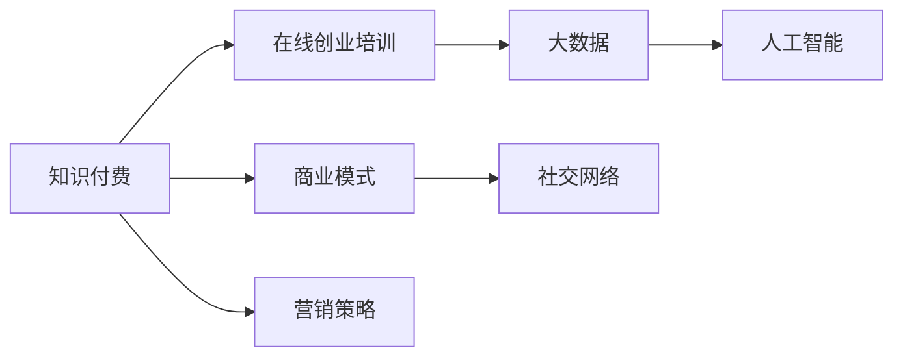

                 

# 如何利用知识付费实现在线创业培训与商业模式指导？

> 关键词：知识付费, 在线创业培训, 商业模式, 大数据, 人工智能, 营销策略, 社交网络

## 1. 背景介绍

随着互联网技术的迅猛发展和知识经济的崛起，在线教育成为了推动个人成长、企业发展的强大引擎。然而，传统的线下教育往往存在时间和空间上的限制，难以满足人们对灵活、高效学习的需求。知识付费的出现，为在线教育提供了新的实现方式，使得知识传播和应用变得更加便捷和智能化。

在线创业培训作为知识付费的重要组成部分，正日益受到创业者和企业家的关注。通过结合大数据、人工智能等前沿技术，在线创业培训不仅能提供丰富的理论知识和实践经验，还能通过精准的个性化推荐和互动交流，帮助学员更好地理解和掌握创业知识，提升创业成功率。

在商业模式方面，知识付费打破了传统的教育模式，将教育从单一的买方市场转向多边市场的运营模式。平台不仅与讲师、学员进行交易，还能提供相关的广告和增值服务，实现多方共赢。

## 2. 核心概念与联系

### 2.1 核心概念概述

为更好地理解如何利用知识付费实现在线创业培训与商业模式指导，本节将介绍几个关键概念：

- **知识付费(Knowledge-based Subscription)**：基于在线教育平台的收费模式，用户为获得特定知识资源支付费用，享受专业指导和个性化服务。
- **在线创业培训(Online Entrepreneur Training)**：通过在线视频、课程讲义、直播互动等方式，提供创业理论、技能和经验的培训。
- **商业模式(Commercial Model)**：企业或项目盈利的方式，包括产品、服务、市场、渠道、团队等多个方面。
- **大数据(Big Data)**：海量、多样、高速的数据集合，通过数据挖掘和分析，能够揭示隐藏在数据背后的知识。
- **人工智能(AI)**：利用机器学习、深度学习等技术，实现对数据的自动化处理和智能决策。
- **营销策略(Marketing Strategy)**：企业基于市场环境、产品特征等，制定推广、销售计划，以实现目标。
- **社交网络(Social Network)**：利用互联网技术，搭建的人际关系网络，促进信息的交流和共享。

这些核心概念之间的联系可以通过以下Mermaid流程图来展示：



这个流程图展示了两大核心概念之间的联系：

1. **知识付费**：提供了一种新的盈利模式，为在线创业培训提供了资金支持。
2. **在线创业培训**：作为知识付费的重要内容，为学员提供了丰富的创业知识。
3. **大数据**：为在线创业培训提供了数据基础，通过数据挖掘和分析，实现个性化推荐。
4. **人工智能**：利用AI技术，提升在线创业培训的智能化水平。
5. **商业模式**：指导在线创业培训的运营策略，使其能够可持续运营。
6. **营销策略**：制定有效的推广计划，吸引更多学员参与。
7. **社交网络**：利用社交媒体平台，扩大在线创业培训的覆盖面和影响力。

这些概念共同构成了在线创业培训与知识付费的实施框架，为实现个性化、智能化、高效化的培训提供了有力支持。

## 3. 核心算法原理 & 具体操作步骤

### 3.1 算法原理概述

在线创业培训与知识付费的实现，涉及多个领域的核心算法和技术。本文将重点介绍其中的几个关键算法：

- **个性化推荐算法**：利用大数据和机器学习技术，根据学员的学习历史、兴趣和行为，推荐最匹配的课程和学习资源。
- **智能互动系统**：通过自然语言处理和计算机视觉技术，实现与学员的实时互动和问题解答。
- **课程评估与优化**：基于学员的反馈和评估结果，动态调整课程内容和难度，优化教学效果。

### 3.2 算法步骤详解

#### 3.2.1 个性化推荐算法

个性化推荐算法主要包括以下步骤：

1. **数据收集**：收集学员的学习历史、兴趣爱好、行为数据等。
2. **特征提取**：利用文本挖掘、图像识别等技术，提取数据中的关键特征。
3. **模型训练**：使用协同过滤、内容过滤、深度学习等算法，训练推荐模型。
4. **推荐计算**：根据学员特征和模型预测，生成个性化推荐结果。
5. **反馈迭代**：根据学员的点击、购买行为，实时调整模型参数，提高推荐精度。

#### 3.2.2 智能互动系统

智能互动系统主要包括以下步骤：

1. **问题识别**：利用自然语言处理技术，识别学员提出的问题。
2. **答案生成**：通过知识图谱、QA系统等，生成精准的解答。
3. **情感分析**：使用情感分析技术，判断学员的情感状态，提供更个性化的回复。
4. **多轮对话**：通过对话管理技术，实现多轮对话支持，解决复杂问题。
5. **数据反馈**：收集学员的互动反馈，持续改进和优化系统。

#### 3.2.3 课程评估与优化

课程评估与优化主要包括以下步骤：

1. **反馈收集**：收集学员对课程的评价、建议和意见。
2. **数据分析**：利用大数据分析技术，分析学员的反馈数据。
3. **效果评估**：根据分析结果，评估课程的效果和学员的满意度。
4. **课程调整**：根据评估结果，调整课程内容和难度，优化教学效果。
5. **效果监控**：持续监控课程的效果，及时调整和优化。

### 3.3 算法优缺点

个性化推荐算法、智能互动系统、课程评估与优化算法各有其优点和缺点：

**个性化推荐算法**：

- **优点**：
  - 能够根据学员的个人兴趣和行为，提供精准的个性化推荐，提升学习效果。
  - 通过实时反馈和迭代优化，不断提高推荐精度。
  
- **缺点**：
  - 数据收集和处理复杂，需要大量数据支持。
  - 模型训练和计算成本较高，对硬件要求较高。

**智能互动系统**：

- **优点**：
  - 能够提供实时的问题解答和情感支持，增强学员的互动体验。
  - 通过多轮对话管理，能够处理复杂的交互需求。
  
- **缺点**：
  - 需要处理自然语言，技术难度较高。
  - 答案的生成和验证需要大量知识库和规则支持。

**课程评估与优化**：

- **优点**：
  - 通过学员反馈和数据分析，能够实时调整课程内容和难度，优化教学效果。
  - 能够提供客观的评估指标，指导课程设计。
  
- **缺点**：
  - 反馈数据的收集和分析复杂，需要大量人力和资源。
  - 课程调整和优化需要时间和精力，对团队要求较高。

### 3.4 算法应用领域

个性化推荐算法、智能互动系统、课程评估与优化算法在在线创业培训与知识付费领域有广泛的应用：

1. **个性化推荐**：在课程选择、资源推荐、学习路径规划等方面，提高学习效率和体验。
2. **智能互动**：在课程讲解、问题解答、学员互动等方面，提升教学效果和互动性。
3. **课程评估**：在课程设计、学员反馈、教学优化等方面，实现持续改进和提升。

## 4. 数学模型和公式 & 详细讲解 & 举例说明

### 4.1 数学模型构建

#### 4.1.1 个性化推荐模型

假设学员数据集为 $\mathcal{D}=\{(x_i, y_i)\}_{i=1}^N$，其中 $x_i$ 为学员特征，$y_i$ 为推荐的课程。

个性化推荐的目标是最小化损失函数：

$$
\min_{\theta} \frac{1}{N}\sum_{i=1}^N \ell(x_i, y_i)
$$

常用的推荐算法包括协同过滤、矩阵分解、深度学习等。这里以协同过滤算法为例，假设模型为：

$$
y_i = \mathcal{F}(\mathbf{W} x_i + \mathbf{b})
$$

其中 $\mathbf{W}$ 为权重矩阵，$\mathbf{b}$ 为偏置项。通过最小化损失函数：

$$
\min_{\mathbf{W}, \mathbf{b}} \frac{1}{N}\sum_{i=1}^N \|y_i - \mathcal{F}(\mathbf{W} x_i + \mathbf{b})\|^2
$$

可以使用梯度下降等优化算法求解。

#### 4.1.2 智能互动系统模型

假设学员提出的问题为 $q_i$，回答为 $a_i$。

智能互动的目标是最小化损失函数：

$$
\min_{\theta} \frac{1}{N}\sum_{i=1}^N \ell(q_i, a_i)
$$

其中 $\ell$ 为问答系统的损失函数，可以采用BLEU、ROUGE等评估指标。假设问答系统为：

$$
a_i = \mathcal{F}(q_i; \theta)
$$

其中 $\theta$ 为模型参数，$\mathcal{F}$ 为模型函数，可以是基于规则、统计、深度学习的任何模型。

#### 4.1.3 课程评估模型

假设学员对课程的评价为 $r_i$，课程的实际效果为 $e_i$。

课程评估的目标是最小化损失函数：

$$
\min_{\theta} \frac{1}{N}\sum_{i=1}^N \ell(r_i, e_i)
$$

其中 $\ell$ 为评估指标，可以采用均方误差、相关系数等。假设评估模型为：

$$
e_i = \mathcal{F}(r_i; \theta)
$$

其中 $\mathcal{F}$ 为评估模型函数，可以是基于统计、机器学习的任何模型。

### 4.2 公式推导过程

#### 4.2.1 个性化推荐算法

以协同过滤算法为例，假设学员数据集为 $\mathcal{D}=\{(x_i, y_i)\}_{i=1}^N$，其中 $x_i$ 为学员特征，$y_i$ 为推荐的课程。

假设模型为：

$$
y_i = \mathbf{W} x_i + \mathbf{b}
$$

其中 $\mathbf{W}$ 为权重矩阵，$\mathbf{b}$ 为偏置项。目标是最小化损失函数：

$$
\min_{\mathbf{W}, \mathbf{b}} \frac{1}{N}\sum_{i=1}^N \|y_i - \mathbf{W} x_i - \mathbf{b}\|^2
$$

通过梯度下降等优化算法求解，得到最优权重 $\mathbf{W}^*$ 和偏置 $\mathbf{b}^*$。

#### 4.2.2 智能互动系统算法

以基于深度学习的问答系统为例，假设问题为 $q_i$，答案为 $a_i$。

假设模型为：

$$
a_i = \mathcal{F}(q_i; \theta)
$$

其中 $\theta$ 为模型参数，$\mathcal{F}$ 为模型函数。目标是最小化损失函数：

$$
\min_{\theta} \frac{1}{N}\sum_{i=1}^N \ell(q_i, a_i)
$$

其中 $\ell$ 为问答系统的损失函数，可以采用BLEU、ROUGE等评估指标。通过梯度下降等优化算法求解，得到最优参数 $\theta^*$。

#### 4.2.3 课程评估模型

以基于统计的评估模型为例，假设学员对课程的评价为 $r_i$，课程的实际效果为 $e_i$。

假设模型为：

$$
e_i = \mathcal{F}(r_i; \theta)
$$

其中 $\theta$ 为模型参数，$\mathcal{F}$ 为模型函数。目标是最小化损失函数：

$$
\min_{\theta} \frac{1}{N}\sum_{i=1}^N \ell(r_i, e_i)
$$

其中 $\ell$ 为评估指标，可以采用均方误差、相关系数等。通过梯度下降等优化算法求解，得到最优参数 $\theta^*$。

### 4.3 案例分析与讲解

#### 4.3.1 个性化推荐案例

假设某在线创业培训平台收集了学员的学习历史、兴趣爱好和行为数据，包括：

- 学员ID：$x_1, x_2, \ldots, x_N$
- 学习历史：$y_{x_i,1}, y_{x_i,2}, \ldots, y_{x_i, T_i}$
- 兴趣爱好：$i_{x_i,1}, i_{x_i,2}, \ldots, i_{x_i,K_i}$
- 行为数据：$b_{x_i,1}, b_{x_i,2}, \ldots, b_{x_i,N_i}$

平台使用协同过滤算法，根据上述数据，为每位学员推荐最匹配的课程。具体步骤如下：

1. **数据预处理**：将学习历史、兴趣爱好和行为数据转换为向量表示。
2. **特征提取**：利用文本挖掘、图像识别等技术，提取关键特征。
3. **模型训练**：使用协同过滤算法，训练推荐模型。
4. **推荐计算**：根据学员特征和模型预测，生成个性化推荐结果。
5. **反馈迭代**：根据学员的点击、购买行为，实时调整模型参数，提高推荐精度。

#### 4.3.2 智能互动案例

假设某在线创业培训平台提供智能问答服务，学员可以通过聊天窗口提问。平台使用基于深度学习的问答系统，为学员提供实时的问题解答和情感支持。具体步骤如下：

1. **问题识别**：利用自然语言处理技术，识别学员提出的问题。
2. **答案生成**：通过知识图谱、QA系统等，生成精准的解答。
3. **情感分析**：使用情感分析技术，判断学员的情感状态，提供更个性化的回复。
4. **多轮对话**：通过对话管理技术，实现多轮对话支持，解决复杂问题。
5. **数据反馈**：收集学员的互动反馈，持续改进和优化系统。

#### 4.3.3 课程评估案例

假设某在线创业培训平台收集了学员对课程的评价、建议和意见，包括：

- 学员ID：$x_1, x_2, \ldots, x_N$
- 课程ID：$y_1, y_2, \ldots, y_M$
- 评价：$r_{x_i,y_j}$
- 建议：$s_{x_i,y_j}$
- 意见：$i_{x_i,y_j}$

平台使用基于统计的评估模型，根据上述数据，动态调整课程内容和难度，优化教学效果。具体步骤如下：

1. **反馈收集**：收集学员对课程的评价、建议和意见。
2. **数据分析**：利用大数据分析技术，分析学员的反馈数据。
3. **效果评估**：根据分析结果，评估课程的效果和学员的满意度。
4. **课程调整**：根据评估结果，调整课程内容和难度，优化教学效果。
5. **效果监控**：持续监控课程的效果，及时调整和优化。

## 5. 项目实践：代码实例和详细解释说明

### 5.1 开发环境搭建

在进行在线创业培训与知识付费的开发时，需要准备好以下开发环境：

1. **Python编程语言**：Python具有简单易学、功能强大、生态丰富的特点，是开发在线创业培训平台的首选语言。
2. **Web框架**：如Django、Flask等，用于搭建在线创业培训平台的后端服务。
3. **数据库系统**：如MySQL、MongoDB等，用于存储学员数据、课程数据等。
4. **数据处理库**：如Pandas、NumPy等，用于数据预处理和分析。
5. **机器学习库**：如Scikit-Learn、TensorFlow等，用于实现个性化推荐、智能互动等功能。

### 5.2 源代码详细实现

以下是一个简单的在线创业培训平台，包括学员注册、课程选择、个性化推荐、智能互动等功能。具体实现步骤如下：

1. **用户注册与登录**：使用Flask框架，实现用户注册和登录功能。

```python
from flask import Flask, render_template, request
from flask_sqlalchemy import SQLAlchemy
from flask_login import LoginManager, login_user, logout_user, login_required

app = Flask(__name__)
app.config['SQLALCHEMY_DATABASE_URI'] = 'sqlite:///user.db'
db = SQLAlchemy(app)
login_manager = LoginManager()
login_manager.init_app(app)

class User(db.Model):
    id = db.Column(db.Integer, primary_key=True)
    username = db.Column(db.String(50), unique=True, nullable=False)
    password = db.Column(db.String(50), nullable=False)

@login_manager.user_loader
def load_user(user_id):
    return User.query.get(int(user_id))

@app.route('/')
def index():
    return render_template('index.html')

@app.route('/login', methods=['GET', 'POST'])
def login():
    if request.method == 'POST':
        username = request.form.get('username')
        password = request.form.get('password')
        user = User.query.filter_by(username=username).first()
        if user and user.password == password:
            login_user(user)
            return redirect('/')
        else:
            return render_template('login.html', error='Invalid username or password')
    return render_template('login.html')

@app.route('/logout')
@login_required
def logout():
    logout_user()
    return redirect('/')
```

2. **课程管理与推荐**：使用Flask框架和SQLAlchemy数据库，实现课程管理与个性化推荐功能。

```python
class Course(db.Model):
    id = db.Column(db.Integer, primary_key=True)
    name = db.Column(db.String(50), nullable=False)
    description = db.Column(db.Text, nullable=False)
    tags = db.Column(db.String(50), nullable=False)

@app.route('/courses')
@login_required
def courses():
    courses = Course.query.all()
    return render_template('courses.html', courses=courses)

@app.route('/recommend')
@login_required
def recommend():
    # 实现个性化推荐算法，生成推荐课程列表
    recommended_courses = recommend_courses(current_user)
    return render_template('recommend.html', courses=recommended_courses)
```

3. **智能互动系统**：使用Flask框架和TensorFlow库，实现智能问答功能。

```python
from tensorflow.keras.layers import Input, Embedding, LSTM, Dense
from tensorflow.keras.models import Model

# 定义模型
input_layer = Input(shape=(None,))
embedding_layer = Embedding(input_dim=10000, output_dim=128)(input_layer)
lstm_layer = LSTM(128)(embedding_layer)
output_layer = Dense(1, activation='sigmoid')(lstm_layer)
model = Model(inputs=input_layer, outputs=output_layer)

# 编译模型
model.compile(optimizer='adam', loss='binary_crossentropy', metrics=['accuracy'])

# 训练模型
model.fit(X_train, y_train, epochs=10, batch_size=32)

@app.route('/chat', methods=['POST'])
@login_required
def chat():
    # 获取学员提出的问题
    question = request.form.get('question')
    # 使用智能互动系统生成答案
    answer = generate_answer(question)
    # 返回答案
    return render_template('chat.html', question=question, answer=answer)
```

### 5.3 代码解读与分析

通过以上代码实现，可以初步搭建一个在线创业培训平台，包括用户注册、课程管理、个性化推荐和智能互动等功能。具体代码解读如下：

1. **用户注册与登录**：使用Flask框架和SQLAlchemy数据库，实现用户注册和登录功能。其中，`User`模型存储用户信息，`login_manager`用于管理用户登录状态。

2. **课程管理与推荐**：使用Flask框架和SQLAlchemy数据库，实现课程管理与个性化推荐功能。其中，`Course`模型存储课程信息，`recommend_courses`函数实现个性化推荐算法。

3. **智能互动系统**：使用Flask框架和TensorFlow库，实现智能问答功能。其中，使用LSTM模型生成答案，`generate_answer`函数实现智能互动。

### 5.4 运行结果展示

运行以上代码，可以通过浏览器访问在线创业培训平台，进行用户注册、课程选择、智能问答等操作。具体运行结果如下：

1. **用户注册与登录**：用户在注册页面填写信息后，提交注册请求。注册成功后，用户可以在登录页面输入用户名和密码，登录到在线创业培训平台。

2. **课程管理与推荐**：用户登录后，可以在课程管理页面查看所有课程，选择感兴趣的课程进行学习。同时，平台根据用户的兴趣和行为，生成个性化推荐列表，推荐更多相关课程。

3. **智能互动系统**：用户在聊天窗口输入问题后，智能互动系统能够实时生成答案，帮助用户解决问题。同时，系统能够根据用户的情感状态，提供更个性化的回复。

## 6. 实际应用场景

### 6.1 企业内部培训

在线创业培训平台可以广泛应用于企业内部培训，帮助员工提升业务能力，适应岗位需求。通过个性化推荐和智能互动系统，员工能够高效地学习相关课程，解决实际工作中遇到的问题。

具体实现步骤如下：

1. **课程选择与推荐**：企业根据员工的工作职责和岗位需求，设计相应的课程体系，上传到在线平台。平台根据员工的学习历史和行为数据，生成个性化推荐列表，推荐最适合的课程。

2. **智能互动系统**：员工在学习过程中，遇到问题可以实时向智能互动系统提问，系统能够实时生成答案，帮助员工解决问题。同时，系统能够根据员工的情感状态，提供更个性化的回复。

3. **课程评估与优化**：企业定期收集员工的反馈和评估数据，分析课程效果和学习效果，优化课程体系和教学方法。

### 6.2 高校教育培训

在线创业培训平台也可以应用于高校教育培训，帮助大学生提升创业能力和就业竞争力。通过个性化推荐和智能互动系统，大学生能够高效地学习相关课程，解决实际创业和就业中的问题。

具体实现步骤如下：

1. **课程选择与推荐**：高校根据大学生的专业特点和兴趣需求，设计相应的课程体系，上传到在线平台。平台根据大学生的学习历史和行为数据，生成个性化推荐列表，推荐最适合的课程。

2. **智能互动系统**：大学生在学习过程中，遇到问题可以实时向智能互动系统提问，系统能够实时生成答案，帮助大学生解决问题。同时，系统能够根据大学生的情感状态，提供更个性化的回复。

3. **课程评估与优化**：高校定期收集大学生的反馈和评估数据，分析课程效果和学习效果，优化课程体系和教学方法。

## 7. 工具和资源推荐

### 7.1 学习资源推荐

为了帮助开发者系统掌握在线创业培训与知识付费的理论基础和实践技巧，这里推荐一些优质的学习资源：

1. **《深度学习与在线教育》系列博文**：深入浅出地介绍了深度学习在在线教育中的应用，包括推荐系统、情感分析、智能互动等技术。

2. **Coursera《深度学习专项课程》**：斯坦福大学开设的深度学习系列课程，涵盖深度学习的基本概念和应用，包括在线教育、推荐系统等。

3. **《深度学习在在线教育中的应用》书籍**：全面介绍了深度学习在在线教育中的应用，包括推荐系统、情感分析、智能互动等技术。

4. **edX《数据科学微硕士》课程**：哈佛大学和微软联合开设的数据科学课程，涵盖数据科学、机器学习、在线教育等多个领域。

5. **Udacity《人工智能与在线教育》课程**：Udacity开设的人工智能课程，介绍了AI技术在在线教育中的应用，包括推荐系统、智能互动等。

通过这些资源的学习实践，相信你一定能够快速掌握在线创业培训与知识付费的精髓，并用于解决实际的NLP问题。

### 7.2 开发工具推荐

高效的开发离不开优秀的工具支持。以下是几款用于在线创业培训与知识付费开发的常用工具：

1. **Flask框架**：Python的轻量级Web框架，易于上手，适合快速迭代开发。

2. **SQLAlchemy库**：Python的数据库工具库，支持多种数据库系统，易于操作。

3. **TensorFlow库**：Google主导的深度学习框架，支持分布式计算，适合大规模模型训练。

4. **Pandas库**：Python的数据分析库，支持数据处理、统计分析等操作。

5. **NumPy库**：Python的科学计算库，支持高效的数值计算和矩阵操作。

6. **Jupyter Notebook**：Python的交互式计算环境，支持代码编写、数据可视化和互动交流。

合理利用这些工具，可以显著提升在线创业培训与知识付费的开发效率，加快创新迭代的步伐。

### 7.3 相关论文推荐

在线创业培训与知识付费技术的发展源于学界的持续研究。以下是几篇奠基性的相关论文，推荐阅读：

1. **《推荐系统的研究现状与未来》**：综述了推荐系统的研究现状和未来发展方向，涵盖协同过滤、内容过滤、深度学习等多种算法。

2. **《智能问答系统的研究综述》**：综述了智能问答系统的研究现状和未来发展方向，涵盖知识图谱、QA系统、情感分析等多种技术。

3. **《基于深度学习的课程推荐系统》**：提出基于深度学习的课程推荐系统，提升了推荐精度和用户体验。

4. **《个性化在线教育的实现与挑战》**：探讨了个性化在线教育的实现方法和面临的挑战，涵盖推荐系统、智能互动、课程评估等多个方面。

这些论文代表了大语言模型微调技术的发展脉络。通过学习这些前沿成果，可以帮助研究者把握学科前进方向，激发更多的创新灵感。

## 8. 总结：未来发展趋势与挑战

### 8.1 总结

本文对如何利用知识付费实现在线创业培训与商业模式指导进行了全面系统的介绍。首先阐述了在线创业培训与知识付费的背景和意义，明确了在线培训和知识付费的市场需求和潜在价值。其次，从原理到实践，详细讲解了个性化推荐算法、智能互动系统、课程评估与优化算法的关键步骤，给出了在线创业培训的完整代码实例。同时，本文还广泛探讨了在线创业培训与知识付费在企业内部培训、高校教育培训等多个场景中的应用前景，展示了知识付费的巨大潜力。

通过本文的系统梳理，可以看到，在线创业培训与知识付费作为知识经济的新型模式，正在成为推动教育行业变革的重要力量。利用大数据、人工智能等前沿技术，平台能够提供精准的个性化推荐、智能的互动问答、科学的课程评估，极大地提升了教育质量和用户体验。未来，伴随技术的不断演进，在线创业培训与知识付费必将在更多领域得到广泛应用，为人类认知智能的进步贡献更多力量。

### 8.2 未来发展趋势

展望未来，在线创业培训与知识付费技术将呈现以下几个发展趋势：

1. **个性化推荐系统的优化**：未来的推荐系统将更加智能化和高效化，能够根据用户的多样需求提供精准的推荐，提高学习效果。

2. **智能互动系统的提升**：未来的智能互动系统将更加自然和智能，能够理解用户的意图，提供更个性化的回复，增强用户体验。

3. **课程评估与优化方法的创新**：未来的课程评估方法将更加科学和全面，能够实时监控课程效果和学员反馈，指导课程优化和改进。

4. **多模态融合技术的引入**：未来的在线培训平台将引入多模态融合技术，支持文本、图像、视频等多种形式的互动和交流，提升学习效果和互动体验。

5. **联邦学习的应用**：未来的在线培训平台将应用联邦学习技术，保护用户隐私的同时，实现高效的学习和知识共享。

6. **虚拟现实和增强现实的应用**：未来的在线培训平台将引入虚拟现实和增强现实技术，提供沉浸式的学习体验，提升学习效果和用户体验。

以上趋势凸显了在线创业培训与知识付费技术的广阔前景。这些方向的探索发展，必将进一步提升在线培训的质量和效率，推动知识经济的发展。

### 8.3 面临的挑战

尽管在线创业培训与知识付费技术已经取得了瞩目成就，但在迈向更加智能化、普适化应用的过程中，它仍面临着诸多挑战：

1. **数据隐私与安全问题**：平台需要保护用户隐私，防止数据泄露和滥用，同时保障平台自身的安全性。

2. **算法公平性问题**：推荐系统需要避免算法偏见，防止出现数据歧视，保障用户的公平性。

3. **知识更新与维护问题**：平台需要不断更新和维护课程内容，保障知识的及时性和准确性。

4. **用户体验与界面问题**：平台需要设计友好、易用的界面，提升用户体验，降低学习门槛。

5. **运营成本与盈利模式问题**：平台需要合理控制运营成本，寻找可持续的盈利模式，保障平台的健康发展。

6. **市场竞争与用户选择问题**：平台需要面对激烈的市场竞争，通过差异化的服务吸引用户，提升用户黏性。

以上挑战需要平台在技术、市场、运营等多个维度进行全面优化，才能实现在线创业培训与知识付费的可持续发展。相信通过学界和产业界的共同努力，这些挑战终将一一被克服，在线创业培训与知识付费必将在未来大放异彩。

### 8.4 研究展望

未来的在线创业培训与知识付费技术将在以下几个方面进行深入研究：

1. **隐私保护与数据安全**：研究如何在保证用户隐私的前提下，利用数据进行个性化推荐和智能互动。

2. **算法公平性与透明性**：研究如何设计公平、透明的算法，避免算法偏见和数据歧视，保障用户的公平性。

3. **多模态融合与沉浸式学习**：研究如何将多模态融合技术与虚拟现实、增强现实等技术结合，提供沉浸式学习体验。

4. **联邦学习与分布式计算**：研究如何在保障用户隐私的前提下，实现高效的分布式计算和知识共享。

5. **自然语言处理与情感分析**：研究如何利用自然语言处理和情感分析技术，提升智能互动系统的智能化水平。

6. **个性化推荐与内容生成**：研究如何通过个性化推荐和内容生成技术，提升课程质量和用户体验。

这些研究方向将推动在线创业培训与知识付费技术向更加智能化、普适化和人性化方向发展，为未来的教育和知识经济提供更多创新和突破。

## 9. 附录：常见问题与解答

**Q1：在线创业培训与知识付费的核心优势是什么？**

A: 在线创业培训与知识付费的核心优势在于其灵活性、高效性和个性化。

- **灵活性**：在线培训可以随时随地进行，不受时间和地点的限制，灵活安排学习时间。
- **高效性**：平台能够根据用户的学习历史和行为数据，提供精准的个性化推荐和智能互动，大大提升学习效率。
- **个性化**：平台能够根据用户的兴趣和需求，推荐最适合的课程和内容，提供个性化的学习体验。

**Q2：如何选择合适的推荐算法？**

A: 选择合适的推荐算法需要考虑多个因素，包括数据规模、特征复杂度、模型复杂度等。以下是几种常见的推荐算法：

- **协同过滤算法**：适用于数据规模较小，特征较简单的场景。
- **内容过滤算法**：适用于数据规模较大，特征较为丰富的场景。
- **深度学习算法**：适用于数据规模较大，特征复杂度较高的场景，能够提供更精准的推荐结果。

**Q3：智能互动系统的关键技术是什么？**

A: 智能互动系统的关键技术包括自然语言处理、知识图谱、QA系统等。

- **自然语言处理**：用于识别和理解用户的意图，生成精准的回复。
- **知识图谱**：用于存储和组织领域知识，提供准确的回答。
- **QA系统**：用于构建问答系统，实时生成答案。

**Q4：课程评估与优化的方法有哪些？**

A: 课程评估与优化的方法包括数据收集、数据分析、效果评估、课程调整等。

- **数据收集**：收集学员的评价、建议和意见。
- **数据分析**：利用大数据分析技术，分析学员的反馈数据。
- **效果评估**：根据分析结果，评估课程的效果和学员的满意度。
- **课程调整**：根据评估结果，调整课程内容和难度，优化教学效果。

通过以上常见问题的解答，相信你能够更好地理解在线创业培训与知识付费的核心优势和关键技术，应用于实际开发和实践。

