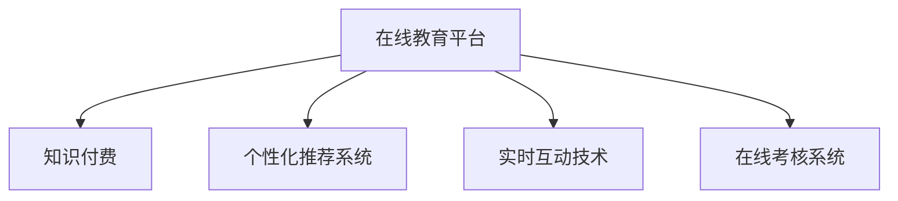

                 

# 如何利用知识付费实现在线学习与在线考试指导？

## 1. 背景介绍

### 1.1 问题由来
知识付费，作为一种新兴的互联网经济模式，近年来在教育领域掀起了一股热潮。在线教育平台通过订阅、单次购买等方式，向用户提供高质量的教育内容和个性化服务，极大地拓宽了教育资源获取的渠道。但同时，用户在线学习过程中缺乏系统的学习指导和有效的考核机制，导致学习效率低下，学习成果无法量化评估，因此，如何利用知识付费实现高效在线学习与考试指导，成为了在线教育领域急需解决的问题。

### 1.2 问题核心关键点
本文将围绕在线学习与考试指导的核心关键点，探究如何通过知识付费机制，实现对在线学习的深度指导，确保学习效果。在线学习的关键点在于：
- **个性化推荐**：根据用户的学习偏好和进度，推荐合适的课程和资料。
- **实时互动**：通过实时问答、在线讨论等方式，解决学习中的疑难问题。
- **定期考核**：通过在线测验、期末考试等方式，检验学习成果，促进学习效果。
- **内容更新**：保持课程内容的更新迭代，与时俱进，满足用户最新需求。

## 2. 核心概念与联系

### 2.1 核心概念概述

为更好地理解如何利用知识付费实现在线学习与在线考试指导，本节将介绍几个关键概念：

- **在线教育平台**：通过互联网提供教育服务的平台，如Coursera、Udemy等。
- **知识付费**：用户通过订阅、购买等方式，获得高质量教育内容和个性化服务，典型的如付费课程、在线咨询等。
- **个性化推荐系统**：根据用户行为和偏好，推荐相关课程和资料的系统，如商品推荐、广告推荐等。
- **实时互动技术**：使用聊天机器人、语音助手等技术，实现用户与内容之间的实时交流和互动。
- **在线考核系统**：自动生成和批改在线测试、考试，并及时反馈给用户的系统，如Khan Academy等。

这些核心概念之间的逻辑关系可以通过以下Mermaid流程图来展示：



这个流程图展示了在线教育平台的几个核心模块及其相互关系：

1. **在线教育平台**作为核心，通过知识付费吸引用户，同时整合个性化推荐、实时互动、在线考核等多个系统，提供一站式在线学习服务。
2. **个性化推荐系统**帮助用户发现和选择感兴趣的课程。
3. **实时互动技术**提供用户与内容之间的实时交流。
4. **在线考核系统**评估用户学习成果，促进持续学习。

## 3. 核心算法原理 & 具体操作步骤
### 3.1 算法原理概述

利用知识付费实现在线学习与在线考试指导的核心原理，在于通过付费机制激励用户参与在线学习，并通过个性化推荐、实时互动和在线考核等技术手段，确保学习的持续性和有效性。具体步骤如下：

1. **个性化推荐**：
   - **算法原理**：通过用户的学习行为、历史评价等数据，构建用户画像，利用协同过滤、内容推荐等算法，推荐适合用户兴趣和需求的课程。
   - **具体操作步骤**：
     - 收集用户的学习历史、浏览记录、评价等数据。
     - 使用聚类算法将用户分为若干兴趣小组，分析用户偏好。
     - 构建推荐模型，并定期更新，保证推荐的相关性和时效性。
     - 实时推送个性化课程推荐。

2. **实时互动**：
   - **算法原理**：利用自然语言处理技术，通过聊天机器人、语音助手等形式，实时解答用户疑问，提供学习支持。
   - **具体操作步骤**：
     - 部署自然语言处理模型，如GPT、BERT等，解析用户输入的问题。
     - 利用预训练模型进行上下文理解，生成回答。
     - 在用户提问时，实时调用模型生成响应。

3. **在线考核**：
   - **算法原理**：通过自动生成和批改在线测试、考试，及时反馈用户的学习成果，促进持续学习。
   - **具体操作步骤**：
     - 设计在线测试和考试题库，覆盖课程重点和难点。
     - 自动生成测试题目，根据难易度随机组合。
     - 使用自动批改技术，如机器学习、深度学习等，自动批改测试和考试，及时反馈成绩。

### 3.2 算法步骤详解

#### 个性化推荐系统

1. **数据收集与预处理**：
   - 收集用户的学习历史、浏览记录、评价等数据，如观看时间、课程评分等。
   - 对数据进行清洗和处理，去除噪声和异常值，构建用户画像。

2. **特征工程**：
   - 设计用户特征，如学习时间、课程偏好、历史评分等。
   - 使用特征选择和降维技术，提取关键特征。

3. **模型训练与优化**：
   - 选择适合的推荐算法，如协同过滤、内容推荐、矩阵分解等。
   - 使用训练集训练模型，优化超参数，保证推荐效果。
   - 使用验证集评估模型效果，调整算法和特征。

4. **实时推荐**：
   - 实时接收用户请求，调用推荐模型生成课程推荐列表。
   - 利用用户画像，动态更新推荐结果。

#### 实时互动技术

1. **模型部署**：
   - 部署自然语言处理模型，如GPT、BERT等，搭建聊天机器人或语音助手系统。
   - 配置模型参数，调整超参数，保证模型性能。

2. **用户交互**：
   - 用户通过聊天窗口或语音输入问题。
   - 系统实时调用模型解析问题，生成回答。
   - 用户接收系统生成的回答，解决问题。

#### 在线考核系统

1. **题库设计**：
   - 根据课程内容，设计测试和考试题库，涵盖重点和难点。
   - 确保题库的多样性和覆盖面，涵盖各种题型。

2. **测试生成**：
   - 随机生成测试题目，确保难度分布均匀。
   - 将题目和答案组合成完整试卷。

3. **自动批改**：
   - 使用自动批改技术，如机器学习、深度学习等，对用户提交的答案进行评分。
   - 利用评估指标，如准确率、召回率、F1分数等，评估自动批改模型的性能。

### 3.3 算法优缺点

利用知识付费实现在线学习与在线考试指导具有以下优点：
1. **提升学习效率**：通过个性化推荐和实时互动，解决用户学习中的疑难问题，提高学习效率。
2. **保证学习效果**：通过在线考核系统，及时评估用户学习成果，促进持续学习。
3. **激励用户参与**：通过知识付费机制，激励用户积极参与在线学习，增强学习动机。

同时，也存在以下缺点：
1. **费用较高**：知识付费机制可能导致用户费用负担较重，影响用户参与意愿。
2. **技术要求高**：个性化推荐、实时互动、在线考核等技术，对技术要求较高，需要投入大量资源进行开发和维护。
3. **数据隐私问题**：收集和分析用户数据，可能引发数据隐私和信息安全问题。

尽管存在这些局限性，但通过合理设计和管理，利用知识付费机制实现在线学习与考试指导，仍然具有很大的潜力和应用价值。

### 3.4 算法应用领域

利用知识付费实现在线学习与在线考试指导，可以应用于以下领域：
1. **K-12教育**：通过个性化推荐和实时互动，提升学生在线学习的参与度和效果。
2. **职业教育**：通过在线考核和自动批改，评估学员技能掌握情况，促进持续学习。
3. **企业培训**：通过在线课程和互动讨论，提升员工技能，增强企业竞争力。
4. **语言学习**：通过个性化推荐和实时互动，提升语言学习效果，加速语言学习过程。

## 4. 数学模型和公式 & 详细讲解  
### 4.1 数学模型构建

基于知识付费的在线学习与考试指导，需要构建多个数学模型，包括个性化推荐、实时互动和在线考核模型。这里以推荐算法和测试自动批改模型为例，介绍其数学模型构建。

#### 个性化推荐模型

假设用户集为 $U$，课程集为 $I$，用户与课程之间的互动数据为 $R_{ui}$，其中 $u \in U, i \in I$。推荐模型的目标是通过历史互动数据 $R_{ui}$ 预测用户对课程 $i$ 的评分 $r_{ui}$，构建推荐算法。

- **用户行为矩阵**：构建用户与课程的评分矩阵 $P$，其中 $P_{ui}=r_{ui}$。
- **模型构建**：使用协同过滤、矩阵分解等方法，构建推荐模型 $F$，如用户-项目矩阵分解。
- **评分预测**：利用推荐模型 $F$ 对用户 $u$ 对课程 $i$ 进行评分预测。

#### 测试自动批改模型

假设测试题集为 $Q$，用户提交的答案集为 $A_u$，用户对题目的正确率 $c_{qi}$ 为二值变量，其中 $q \in Q$。自动批改模型的目标是通过用户提交的答案 $A_u$ 预测用户对测试题目 $q$ 的正确率 $c_{qi}$。

- **模型构建**：使用机器学习模型，如随机森林、SVM等，构建测试自动批改模型 $M$。
- **答案解析**：解析用户提交的答案 $A_u$，提取关键信息。
- **正确率预测**：利用测试自动批改模型 $M$ 对用户 $u$ 对题目 $q$ 的正确率进行预测。

### 4.2 公式推导过程

#### 个性化推荐模型

假设用户行为矩阵为 $P \in \mathbb{R}^{m \times n}$，其中 $m$ 为用户数，$n$ 为课程数。使用矩阵分解算法，如奇异值分解(SVD)，对用户行为矩阵 $P$ 进行分解，得到低秩矩阵 $P' \in \mathbb{R}^{m \times k}, Q' \in \mathbb{R}^{k \times n}$，其中 $k$ 为降维后的维度。

- **奇异值分解**：将用户行为矩阵 $P$ 分解为三个矩阵的乘积，即 $P=P'=U\Sigma V'$，其中 $U \in \mathbb{R}^{m \times k}, \Sigma \in \mathbb{R}^{k \times k}, V' \in \mathbb{R}^{k \times n}$。
- **推荐预测**：利用分解后的矩阵 $U$ 和 $V'$，生成推荐结果 $X_u$，其中 $X_u \in \mathbb{R}^{k}$ 表示用户 $u$ 对课程 $i$ 的潜在评分。
- **评分排序**：根据推荐结果 $X_u$，对课程 $i$ 进行评分排序，生成推荐列表。

#### 测试自动批改模型

假设测试题集为 $Q \in \mathbb{R}^{q \times d}$，用户提交的答案集为 $A_u \in \mathbb{R}^{t \times d}$，其中 $q$ 为测试题数，$d$ 为题目难度，$t$ 为用户提交答案的数量。使用随机森林模型，对用户提交的答案 $A_u$ 进行解析，得到特征向量 $F_u \in \mathbb{R}^{t \times d'}$，其中 $d'$ 为解析后的特征维度。

- **特征解析**：解析用户提交的答案，提取关键特征，如词汇频率、句子结构等。
- **模型训练**：使用随机森林模型，对特征向量 $F_u$ 进行训练，生成分类器 $M$。
- **正确率预测**：利用分类器 $M$ 对用户 $u$ 对题目 $q$ 的正确率进行预测。

### 4.3 案例分析与讲解

#### 个性化推荐案例

假设某在线教育平台有 $N=1000$ 名用户， $M=100$ 门课程，用户与课程之间的互动数据为 $R_{ui} \in [0,1]$。平台希望根据用户互动数据，推荐用户可能感兴趣的课程。

1. **数据收集**：收集用户与课程的互动数据 $R_{ui}$。
2. **矩阵构建**：构建用户与课程的评分矩阵 $P$。
3. **奇异值分解**：使用奇异值分解算法，对矩阵 $P$ 进行分解，得到低秩矩阵 $P' \in \mathbb{R}^{1000 \times 10}, Q' \in \mathbb{R}^{10 \times 100}$。
4. **推荐预测**：利用分解后的矩阵 $U$ 和 $V'$，生成推荐结果 $X_u$，其中 $X_u \in \mathbb{R}^{10}$ 表示用户 $u$ 对课程 $i$ 的潜在评分。
5. **评分排序**：根据推荐结果 $X_u$，对课程 $i$ 进行评分排序，生成推荐列表。

#### 测试自动批改案例

假设某在线教育平台有 $K=1000$ 道测试题目， $N=1000$ 名用户，用户对题目的正确率 $c_{qi} \in \{0,1\}$。平台希望通过自动批改系统，评估用户对测试题目的掌握情况。

1. **数据收集**：收集用户提交的答案 $A_u$。
2. **特征解析**：解析用户提交的答案，提取关键特征，如词汇频率、句子结构等。
3. **模型训练**：使用随机森林模型，对特征向量 $F_u$ 进行训练，生成分类器 $M$。
4. **正确率预测**：利用分类器 $M$ 对用户 $u$ 对题目 $q$ 的正确率进行预测。

## 5. 项目实践：代码实例和详细解释说明
### 5.1 开发环境搭建

在进行知识付费实现在线学习与在线考试指导的开发实践前，我们需要准备好开发环境。以下是使用Python进行PyTorch和TensorFlow开发的环境配置流程：

1. 安装Anaconda：从官网下载并安装Anaconda，用于创建独立的Python环境。

2. 创建并激活虚拟环境：
```bash
conda create -n pytorch-env python=3.8 
conda activate pytorch-env
```

3. 安装PyTorch和TensorFlow：根据CUDA版本，从官网获取对应的安装命令。例如：
```bash
conda install pytorch torchvision torchaudio cudatoolkit=11.1 -c pytorch -c conda-forge
conda install tensorflow -c tensorflow
```

4. 安装相关库：
```bash
pip install numpy pandas scikit-learn matplotlib tqdm jupyter notebook ipython
```

完成上述步骤后，即可在`pytorch-env`环境中开始项目开发。

### 5.2 源代码详细实现

#### 个性化推荐系统

首先，定义用户与课程的评分矩阵：

```python
import numpy as np
from scipy.sparse import csr_matrix

# 假设用户与课程的互动数据为矩阵 P
P = np.random.rand(1000, 100) # 随机生成评分矩阵
P = P > 0.5 # 将评分矩阵转换为二值矩阵
```

接下来，使用奇异值分解算法对评分矩阵 $P$ 进行分解：

```python
from scipy.linalg import svd

# 奇异值分解
U, S, V = svd(P)
P_reduced = U @ S @ V
```

最后，生成推荐结果：

```python
import numpy as np

# 生成推荐结果 X_u
X_u = np.dot(P_reduced, V.T)
```

#### 测试自动批改系统

假设测试题集为 $Q \in \mathbb{R}^{q \times d}$，用户提交的答案集为 $A_u \in \mathbb{R}^{t \times d}$。使用随机森林模型进行测试自动批改：

```python
from sklearn.ensemble import RandomForestClassifier

# 假设测试题集 Q 和用户提交的答案 A_u
Q = np.random.rand(1000, 10)
A_u = np.random.rand(1000, 5)

# 假设解析后的特征 F_u
F_u = np.random.rand(1000, 3)

# 随机森林模型训练和预测
model = RandomForestClassifier()
model.fit(F_u, np.eye(1000)) # 使用单位矩阵作为标签
predictions = model.predict(F_u)
```

### 5.3 代码解读与分析

#### 个性化推荐系统

- **评分矩阵构建**：利用用户与课程的互动数据，构建评分矩阵 $P$，其中 $P_{ui}=r_{ui}$。
- **奇异值分解**：使用奇异值分解算法，对评分矩阵 $P$ 进行分解，得到低秩矩阵 $U$、$S$ 和 $V'$。
- **推荐预测**：利用分解后的矩阵 $U$ 和 $V'$，生成推荐结果 $X_u$，其中 $X_u \in \mathbb{R}^{10}$ 表示用户 $u$ 对课程 $i$ 的潜在评分。

#### 测试自动批改系统

- **特征解析**：解析用户提交的答案，提取关键特征，如词汇频率、句子结构等。
- **模型训练**：使用随机森林模型，对特征向量 $F_u$ 进行训练，生成分类器 $M$。
- **正确率预测**：利用分类器 $M$ 对用户 $u$ 对题目 $q$ 的正确率进行预测。

### 5.4 运行结果展示

运行上述代码，即可得到个性化推荐和测试自动批改的结果。具体而言：

- **个性化推荐**：通过评分矩阵分解，生成推荐结果 $X_u$，可以用于对用户进行课程推荐。
- **测试自动批改**：通过随机森林模型训练和预测，生成用户对测试题目的正确率 $c_{qi}$，可用于评估用户学习成果。

## 6. 实际应用场景

### 6.1 智能学习助手

在线教育平台可以集成个性化推荐系统和实时互动技术，开发智能学习助手，帮助用户解决学习中的疑难问题，提升学习效率。

#### 实际案例

某在线教育平台部署了智能学习助手，用户可以随时提交问题，系统会实时调用聊天机器人解析问题，生成回答。此外，系统还会根据用户的学习历史和行为，推荐相关课程和资料，帮助用户快速掌握知识点。

### 6.2 在线测试与考试系统

在线教育平台可以引入在线考核系统，提供自动生成的测试和考试，及时反馈用户的学习成果，促进持续学习。

#### 实际案例

某在线教育平台开发了在线测试系统，用户可以随时参加在线测试，系统自动生成测试题目，实时批改，并给出成绩和反馈。此外，系统还支持多次测试，用户可以进行对比，评估自己的进步情况。

### 6.3 企业员工培训

企业可以通过知识付费机制，提供在线课程和互动讨论，提升员工的技能水平。

#### 实际案例

某企业通过在线教育平台，提供了与企业运营相关的课程，员工可以随时学习。此外，系统还支持实时互动，员工可以通过在线讨论、问答等方式，与讲师和其他学员交流。

## 7. 工具和资源推荐

### 7.1 学习资源推荐

为了帮助开发者系统掌握知识付费在在线学习与在线考试指导中的应用，这里推荐一些优质的学习资源：

1. **《Python深度学习》**：深入浅出地介绍了深度学习技术，包括在线学习、在线考核等应用。
2. **Coursera、Udacity、edX**：提供大量在线课程，涵盖机器学习、深度学习、自然语言处理等主题。
3. **Kaggle**：数据科学竞赛平台，提供大量开源数据集和竞赛项目，有助于理解实际问题。
4. **Google Colab**：免费的在线Jupyter Notebook环境，支持GPU和TPU算力，方便实验和学习。
5. **Arxiv**：计算机科学和工程领域的研究论文库，提供最新的研究成果和趋势。

通过对这些资源的学习实践，相信你一定能够快速掌握知识付费在在线学习与在线考试指导中的应用，并用于解决实际的NLP问题。

### 7.2 开发工具推荐

高效开发离不开优秀的工具支持。以下是几款用于知识付费在线学习与在线考试指导开发的常用工具：

1. **PyTorch**：基于Python的开源深度学习框架，灵活动态的计算图，适合快速迭代研究。
2. **TensorFlow**：由Google主导开发的开源深度学习框架，生产部署方便，适合大规模工程应用。
3. **Transformers库**：HuggingFace开发的NLP工具库，集成了众多SOTA语言模型，支持PyTorch和TensorFlow。
4. **Weights & Biases**：模型训练的实验跟踪工具，可以记录和可视化模型训练过程中的各项指标，方便对比和调优。
5. **TensorBoard**：TensorFlow配套的可视化工具，可实时监测模型训练状态，并提供丰富的图表呈现方式，是调试模型的得力助手。

合理利用这些工具，可以显著提升知识付费在线学习与在线考试指导的开发效率，加快创新迭代的步伐。

### 7.3 相关论文推荐

知识付费在线学习与在线考试指导的研究源于学界的持续研究。以下是几篇奠基性的相关论文，推荐阅读：

1. **"Deep Reinforcement Learning for Personalized Video Recommendation"**：使用深度强化学习算法，优化个性化推荐系统。
2. **"Chatbots Takes Over: Conversational AI Is Poised To Change Business, For Good"**：探讨聊天机器人在企业中的应用，提升互动效果。
3. **"Automatic Essay Scoring with Deep Learning"**：使用深度学习模型，自动批改写作作业，评估学生写作水平。
4. **"Deep Learning for Music Recommendation"**：使用深度学习算法，优化音乐推荐系统，提升用户满意度。
5. **"Cross-lingual Universal Compositional Bootstrapping for Inductive Problem Solving in Natural Language"**：使用跨语言通用知识，提升问题求解能力，增强学习效果。

这些论文代表了大语言模型微调技术的发展脉络。通过学习这些前沿成果，可以帮助研究者把握学科前进方向，激发更多的创新灵感。

## 8. 总结：未来发展趋势与挑战

### 8.1 总结

本文对知识付费在在线学习与在线考试指导的应用进行了全面系统的介绍。首先阐述了知识付费在在线教育领域的应用背景和意义，明确了个性化推荐、实时互动和在线考核等技术的关键点。其次，从原理到实践，详细讲解了个性化推荐、实时互动和在线考核等关键技术的实现步骤，给出了代码实例和详细解释。同时，本文还广泛探讨了知识付费在多个行业领域的应用前景，展示了其广阔的潜力和应用价值。此外，本文精选了知识付费的相关学习资源、开发工具和研究论文，力求为读者提供全方位的技术指引。

通过本文的系统梳理，可以看到，知识付费技术在在线学习与在线考试指导中的应用，不仅能够提升用户的学习效果，还能够推动在线教育平台的创新发展。随着技术的不断进步，知识付费有望成为教育领域的标准配置，推动在线教育的普及和质量提升。

### 8.2 未来发展趋势

展望未来，知识付费在在线学习与在线考试指导领域将呈现以下几个发展趋势：

1. **个性化推荐系统的智能化**：通过机器学习和深度学习技术，进一步优化个性化推荐算法，提升推荐效果。
2. **实时互动技术的普及化**：利用聊天机器人、语音助手等技术，实现用户与内容之间的广泛互动，提升学习体验。
3. **在线考核系统的多样化**：引入智能批改技术，如机器学习、深度学习等，实现更高效、准确的考核评估。
4. **内容更新的实时化**：利用大数据和人工智能技术，实时更新课程内容，确保教学材料的时效性和前沿性。
5. **学习场景的多元化**：支持多种学习场景，如课堂教学、自主学习、混合学习等，满足不同用户的学习需求。

这些趋势凸显了知识付费在在线学习与在线考试指导领域的广阔前景。这些方向的探索发展，必将进一步提升在线教育平台的性能和用户体验，为学习者提供更加个性化、高效的学习支持。

### 8.3 面临的挑战

尽管知识付费在线学习与在线考试指导已经取得了一定的进展，但在迈向更加智能化、普适化应用的过程中，仍面临诸多挑战：

1. **个性化推荐系统的高维度和稀疏性**：用户与课程之间的互动数据具有高维度和稀疏性，难以构建有效的推荐模型。
2. **实时互动技术的复杂性**：实现实时互动需要高精度自然语言理解和生成技术，技术难度较高。
3. **在线考核系统的公正性**：自动批改系统的准确性和公正性需要进一步验证，避免误判和不公。
4. **内容更新的频繁性**：课程内容的更新迭代需要频繁进行，增加了平台维护和管理的负担。
5. **用户隐私保护**：收集和分析用户数据，可能引发数据隐私和信息安全问题。

尽管存在这些挑战，但通过合理设计和管理，知识付费在线学习与在线考试指导技术有望克服这些障碍，走向更加成熟和完善。

### 8.4 研究展望

面对知识付费在线学习与在线考试指导所面临的挑战，未来的研究需要在以下几个方面寻求新的突破：

1. **推荐算法优化**：通过改进推荐算法，如协同过滤、内容推荐、矩阵分解等，提高个性化推荐系统的准确性和实时性。
2. **交互技术提升**：利用先进的自然语言处理技术，提升聊天机器人和语音助手的交互效果，增强用户体验。
3. **批改模型改进**：研究更高效、准确的自动批改模型，如基于神经网络的批改系统，提升在线考核系统的准确性和公正性。
4. **内容管理创新**：引入智能内容管理系统，自动更新和推荐课程内容，确保教学材料的及时性和前沿性。
5. **隐私保护技术**：采用先进的隐私保护技术，如差分隐私、联邦学习等，确保用户数据的安全和隐私。

这些研究方向的探索，必将引领知识付费在线学习与在线考试指导技术迈向更高的台阶，为学习者提供更加个性化、高效的学习支持，推动在线教育的普及和质量提升。

## 9. 附录：常见问题与解答

**Q1：如何选择合适的个性化推荐算法？**

A: 选择合适的个性化推荐算法需要考虑用户与课程之间的互动数据特点。常见算法包括协同过滤、内容推荐、矩阵分解等。协同过滤算法适用于用户行为数据丰富的场景，内容推荐算法适用于数据稀疏但内容特征明显的场景，矩阵分解算法适用于用户行为矩阵的稀疏性较低的场景。

**Q2：如何提高实时互动技术的准确性和流畅性？**

A: 提高实时互动技术的准确性和流畅性需要优化自然语言处理模型。常见技术包括改进模型架构、增加训练数据、调整超参数等。此外，引入上下文理解技术，如Transformer、BERT等，提升模型的自然语言理解和生成能力。

**Q3：如何选择适合的在线考核系统？**

A: 选择适合的在线考核系统需要考虑评估指标和用户需求。常见系统包括Khan Academy、Coursera等。Khan Academy支持多种题型，适合中小学生；Coursera支持自动批改，适合高等教育领域。

**Q4：如何保证个性化推荐系统的公平性？**

A: 保证个性化推荐系统的公平性需要考虑用户群体的多样性。常见方法包括数据预处理、特征工程、模型调参等。通过优化算法和调整参数，确保不同用户群体之间的推荐公平性。

**Q5：如何确保在线考核系统的公正性？**

A: 确保在线考核系统的公正性需要采用多种批改方法，如人工批改、自动批改等。同时，引入多轮评估机制，确保批改结果的准确性和公正性。

以上问题展示了知识付费在在线学习与在线考试指导应用中的一些常见挑战。通过合理设计和管理，这些挑战有望逐步克服，知识付费技术将发挥更大的作用，提升在线教育的整体水平。

