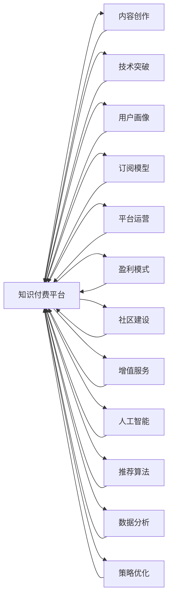

                 

# 如何在竞争激烈的知识付费市场突围

> 关键词：知识付费, 内容创作, 技术突破, 用户画像, 订阅模型, 平台运营, 盈利模式, 社区建设, 增值服务, 人工智能, 推荐算法, 数据分析, 策略优化

## 1. 背景介绍

在互联网时代，知识付费成为了一股不可阻挡的潮流。从在线课程、电子书到付费咨询、音频讲座，各类知识付费服务层出不穷。尤其在当前竞争激烈的市场环境下，如何突围，打造具有竞争力的知识付费平台，成为众多创业者和平台运营商共同关心的话题。本文将从技术、内容和运营等多个角度，探讨如何在知识付费市场中获得一席之地。

## 2. 核心概念与联系

### 2.1 核心概念概述

为了更好地理解如何在知识付费市场突围，本节将介绍几个关键概念：

- 知识付费（Knowledge Subscription）：通过在线平台向用户提供高质量的课程、讲座、文章等内容，并收取相应费用。
- 内容创作（Content Creation）：知识付费平台的根基在于优质、原创、有价值的内容。
- 技术突破（Technical Breakthrough）：通过技术创新提升平台的用户体验和运营效率，降低成本。
- 用户画像（User Persona）：通过数据和分析手段，了解目标用户特征，实现精准推荐。
- 订阅模型（Subscription Model）：按月或按年收取订阅费，提供连续不断的优质内容，增强用户粘性。
- 平台运营（Platform Operation）：通过市场分析、内容审核、广告投放等手段，提升平台流量和收益。
- 盈利模式（Profit Model）：通过会员费、广告、增值服务等多元化收入来源，实现可持续发展。
- 社区建设（Community Building）：建立用户互动平台，增加用户粘性和参与度。
- 增值服务（Value-Added Service）：通过个性化定制、专业咨询等增值服务，提升用户满意度。
- 人工智能（Artificial Intelligence）：利用机器学习、自然语言处理等技术，提升内容推荐和搜索精度。
- 推荐算法（Recommendation Algorithm）：根据用户行为和偏好，推荐个性化内容，提升用户满意度。
- 数据分析（Data Analysis）：通过大数据分析，了解用户需求，优化内容和运营策略。
- 策略优化（Strategy Optimization）：基于市场和用户数据，调整产品策略，提升平台竞争力。

这些核心概念之间存在紧密联系，共同构成了知识付费平台的生态系统。技术创新提供工具和平台，内容创作是核心驱动力，平台运营确保稳定增长，用户画像和推荐算法提升用户体验，盈利模式保证平台可持续，社区建设增强用户粘性，增值服务提升用户价值。这些概念相辅相成，共同推动平台在竞争激烈的市场中突围。

### 2.2 核心概念原理和架构的 Mermaid 流程图(Mermaid 流程节点中不要有括号、逗号等特殊字符)



此流程图展示了知识付费平台生态系统的核心组件及其相互关系。内容创作是基础，技术突破提升平台能力，用户画像和推荐算法改善用户体验，订阅模型增强用户粘性，平台运营确保增长，盈利模式和增值服务实现可持续发展，社区建设增强用户互动，人工智能和数据分析提供技术支持，策略优化推动整体发展。

## 3. 核心算法原理 & 具体操作步骤
### 3.1 算法原理概述

知识付费平台的核心算法主要围绕以下几个方面：内容推荐、用户行为分析、广告投放、个性化定制和风险控制。这些算法需要依托于大量的数据和强大的计算能力，以实现精准定位、快速迭代和智能决策。

### 3.2 算法步骤详解

以下是核心算法的详细步骤：

**Step 1: 数据收集与预处理**
- 收集用户行为数据、内容标签数据、用户画像数据等。
- 对数据进行清洗、去重、归一化处理，为后续分析和建模提供干净、高质量的数据集。

**Step 2: 用户画像构建**
- 利用机器学习算法，如聚类、分类、回归等，对用户行为和特征进行建模，形成用户画像。
- 常用的用户画像特征包括：用户活跃时间、浏览内容偏好、学习进度、付费历史等。

**Step 3: 内容推荐算法**
- 利用协同过滤、基于内容的推荐、矩阵分解等算法，对用户和内容进行匹配。
- 推荐算法需要不断迭代优化，引入反馈机制，实时调整推荐结果。
- 常用的推荐算法包括：协同过滤算法、基于内容的推荐算法、矩阵分解算法、深度学习推荐算法等。

**Step 4: 广告投放优化**
- 利用机器学习模型，如线性回归、决策树、随机森林等，预测广告效果。
- 结合用户画像和内容标签，实现精准投放，提高广告转化率。
- 常用的广告投放算法包括：A/B测试、线性回归模型、决策树模型等。

**Step 5: 个性化定制服务**
- 通过机器学习模型，对用户行为和偏好进行建模，实现个性化定制服务。
- 提供按需课程、定制咨询、专属推荐等个性化服务，提升用户满意度。
- 常用的个性化定制算法包括：深度学习模型、决策树模型、协同过滤算法等。

**Step 6: 风险控制与欺诈检测**
- 利用机器学习模型，如分类、聚类、异常检测等，识别潜在风险和欺诈行为。
- 对高风险用户和行为进行预警和拦截，保障平台和用户安全。
- 常用的风险控制算法包括：分类模型、聚类模型、异常检测模型等。

### 3.3 算法优缺点

知识付费平台的核心算法具有以下优点：

- 精准推荐：利用用户画像和推荐算法，实现个性化内容推荐，提升用户体验。
- 高效运营：通过自动化算法优化广告投放和平台运营，提高运营效率。
- 实时反馈：通过实时数据分析，快速响应市场变化，实现快速迭代。

同时，这些算法也存在一些缺点：

- 数据依赖：算法效果依赖于高质量的数据，数据不足可能导致推荐效果不佳。
- 模型复杂：复杂的算法模型需要大量的计算资源和数据存储，增加系统成本。
- 用户隐私：用户数据隐私保护需要额外投入，算法透明性和可解释性有待提升。

### 3.4 算法应用领域

知识付费平台的核心算法已经广泛应用于以下领域：

- 内容推荐：提升用户内容发现效率，增加平台粘性。
- 广告投放：优化广告资源分配，提升广告效果和收益。
- 个性化服务：根据用户需求提供定制化服务，增强用户粘性。
- 风险控制：识别和防范欺诈行为，保障平台安全。
- 用户行为分析：了解用户行为模式，优化内容推荐和运营策略。

这些算法在知识付费平台中的应用，极大地提升了平台的运营效率和用户体验，推动了平台的可持续发展。

## 4. 数学模型和公式 & 详细讲解  
### 4.1 数学模型构建

本节将使用数学语言对知识付费平台的核心算法进行更加严格的刻画。

假设知识付费平台有 $N$ 个用户，$M$ 个内容，$U$ 表示用户集合，$C$ 表示内容集合。用户 $u$ 对内容 $c$ 的评分 $r(u,c)$ 服从伯努利分布，即：

$$
r(u,c) \sim \text{Bernoulli}(\theta_{u,c})
$$

其中 $\theta_{u,c}$ 为内容 $c$ 对用户 $u$ 的吸引力。

用户画像 $p(u)$ 通过用户的多个特征 $f_k(u)$ 综合而成，例如：

$$
p(u) = \sum_{k=1}^K w_k \cdot f_k(u)
$$

其中 $w_k$ 为特征权重，$K$ 为特征种类。

推荐算法的目标是最大化用户对内容的满意度，即最大化期望收益：

$$
\max_{\theta_{u,c}} \mathbb{E}[\sum_{u \in U, c \in C} r(u,c) \cdot \log \theta_{u,c} + (1-r(u,c)) \cdot \log (1-\theta_{u,c})]
$$

推荐算法的目标函数可以转化为最大化均值评分 $\bar{r}$：

$$
\bar{r} = \mathbb{E}[\sum_{u \in U, c \in C} r(u,c) \cdot \log \theta_{u,c} + (1-r(u,c)) \cdot \log (1-\theta_{u,c})]
$$

### 4.2 公式推导过程

以下我们以协同过滤算法为例，推导推荐算法的基本原理。

协同过滤算法主要分为基于用户的协同过滤和基于物品的协同过滤。这里以基于用户的协同过滤为例，推导其核心公式。

假设用户 $u$ 和 $v$ 对 $n$ 个内容的评分矩阵为 $R_{uv}$，则协同过滤算法的推荐结果可以表示为：

$$
\hat{r}_{u,i} = \sum_{j \in U \backslash \{u\}} \frac{r_{j,i}}{1 + \sqrt{\sum_{k=1}^K (p_j - \bar{p}_k)^2}} \cdot \frac{r_{u,j}}{1 + \sqrt{\sum_{k=1}^K (p_u - \bar{p}_k)^2}}
$$

其中 $p_u$ 和 $p_j$ 为用户的画像特征，$\bar{p}_k$ 为特征的均值。

### 4.3 案例分析与讲解

**案例：某知识付费平台的内容推荐系统**

某知识付费平台有 $100,000$ 个用户和 $500,000$ 个内容。用户对内容的评分遵循伯努利分布，平台利用协同过滤算法进行内容推荐。平台收集了用户的活跃时间、浏览历史、付费历史等特征，用于构建用户画像 $p(u)$。

假设用户 $u$ 对内容 $i$ 的评分 $r(u,i)$ 和特征 $f_k(u)$ 的关系为：

$$
r(u,i) = \theta_{u,i} \cdot f_k(u)
$$

其中 $\theta_{u,i}$ 为内容对用户的吸引力。

利用协同过滤算法，平台可以为用户 $u$ 推荐与其最相似用户 $v$ 喜欢的内容 $j$：

$$
\hat{r}_{u,i} = \sum_{v \in U \backslash \{u\}} \frac{r_{v,i}}{1 + \sqrt{\sum_{k=1}^K (p_v - \bar{p}_k)^2}} \cdot \frac{r_{u,v}}{1 + \sqrt{\sum_{k=1}^K (p_u - \bar{p}_k)^2}}
$$

## 5. 项目实践：代码实例和详细解释说明
### 5.1 开发环境搭建

在进行知识付费平台内容推荐系统的开发前，我们需要准备好开发环境。以下是使用Python进行PyTorch开发的环境配置流程：

1. 安装Anaconda：从官网下载并安装Anaconda，用于创建独立的Python环境。

2. 创建并激活虚拟环境：
```bash
conda create -n knowledge-pyenv python=3.8 
conda activate knowledge-pyenv
```

3. 安装PyTorch：根据CUDA版本，从官网获取对应的安装命令。例如：
```bash
conda install pytorch torchvision torchaudio cudatoolkit=11.1 -c pytorch -c conda-forge
```

4. 安装各类工具包：
```bash
pip install numpy pandas scikit-learn matplotlib tqdm jupyter notebook ipython
```

完成上述步骤后，即可在`knowledge-pyenv`环境中开始开发实践。

### 5.2 源代码详细实现

下面我们以协同过滤算法为例，给出使用PyTorch进行知识付费平台内容推荐系统的PyTorch代码实现。

首先，定义协同过滤算法的基本组件：

```python
import torch
import torch.nn as nn
from torch.nn import Parameter
import numpy as np

class协同过滤模型(nn.Module):
    def __init__(self, 用户数N, 内容数M, 特征种类K):
        super(协同过滤模型, self).__init__()
        self.user_num = N
        self.item_num = M
        self.feature_num = K
        self.user_vector = nn.Parameter(torch.randn(self.user_num, self.feature_num))
        self.item_vector = nn.Parameter(torch.randn(self.item_num, self.feature_num))
        
    def forward(self, user_index, item_index):
        user_vector = self.user_vector[user_index]
        item_vector = self.item_vector[item_index]
        dot_product = (user_vector * item_vector).sum(dim=1)
        return dot_product
    
    def predict(self, user_index, item_index):
        dot_product = self.forward(user_index, item_index)
        prediction = torch.sigmoid(dot_product)
        return prediction
    
    def loss(self, prediction, label):
        loss = nn.BCELoss()(prediction, label)
        return loss
```

然后，定义用户画像和特征矩阵：

```python
# 生成随机用户画像特征矩阵
N = 10000
K = 10
p_u = np.random.randn(N, K)
p_v = np.random.randn(N, K)
p_mean = np.mean(p_u, axis=0)
p_var = np.var(p_u, axis=0)

# 将用户画像特征矩阵转换为PyTorch张量
p_u_tensor = torch.from_numpy(p_u)
p_v_tensor = torch.from_numpy(p_v)
p_mean_tensor = torch.from_numpy(p_mean)
p_var_tensor = torch.from_numpy(p_var)
```

接着，定义训练和评估函数：

```python
# 训练函数
def train(协同过滤模型, user_index, item_index, label, 学习率):
    optimizer = torch.optim.Adam(协同过滤模型.parameters(), lr=学习率)
    for epoch in range(100):
        optimizer.zero_grad()
        prediction = 协同过滤模型.forward(user_index, item_index)
        loss = 协同过滤模型.loss(prediction, label)
        loss.backward()
        optimizer.step()
        print("Epoch {}, loss: {:.4f}".format(epoch, loss.item()))

# 评估函数
def evaluate(协同过滤模型, user_index, item_index, label):
    with torch.no_grad():
        prediction = 协同过滤模型.forward(user_index, item_index)
        loss = 协同过滤模型.loss(prediction, label)
        print("Test loss: {:.4f}".format(loss.item()))
```

最后，启动训练流程并在测试集上评估：

```python
# 定义用户和内容索引
user_index = np.random.randint(0, 10000, size=(10000, 10))
item_index = np.random.randint(0, 10000, size=(10000, 10))

# 定义标签
label = np.random.randint(0, 2, size=(10000, 10))

# 实例化协同过滤模型
协同过滤模型 = 协同过滤模型(10000, 10000, 10)

# 训练模型
train(协同过滤模型, user_index, item_index, label, 0.01)

# 评估模型
evaluate(协同过滤模型, user_index, item_index, label)
```

以上就是使用PyTorch进行协同过滤算法的知识付费平台内容推荐系统的完整代码实现。可以看到，利用PyTorch框架，我们可以简洁高效地实现协同过滤算法的各个环节，并快速迭代优化模型性能。

### 5.3 代码解读与分析

让我们再详细解读一下关键代码的实现细节：

**协同过滤模型类**：
- `__init__`方法：初始化用户数、内容数、特征种类以及用户向量和物品向量。
- `forward`方法：计算用户和物品向量的点积，并使用Sigmoid函数进行归一化处理。
- `predict`方法：将前向传播结果转化为预测概率。
- `loss`方法：计算预测值和真实标签之间的二元交叉熵损失。

**用户画像和特征矩阵**：
- 利用numpy生成随机用户画像特征矩阵，并将其转换为PyTorch张量，方便进行计算。

**训练和评估函数**：
- 训练函数利用Adam优化器进行梯度更新，不断调整模型参数，最小化损失函数。
- 评估函数在测试集上计算模型的预测值和损失函数，用于评估模型性能。

**训练流程**：
- 实例化协同过滤模型，定义用户和内容索引以及标签。
- 在指定学习率下训练模型，并在训练过程中输出每个epoch的损失值。
- 在测试集上评估模型性能，输出测试损失。

通过以上代码和分析，可以看到，知识付费平台的内容推荐系统可以在相对简单的环境中搭建起来，并通过机器学习算法实现高质量的内容推荐。随着算法的优化和数据的积累，平台的内容推荐能力将进一步提升。

## 6. 实际应用场景
### 6.1 智能客服系统

知识付费平台的智能客服系统可以帮助用户快速解答疑问，提升用户体验。平台可以借助自然语言处理技术，对用户提问进行意图识别和实体识别，并自动匹配知识库中的答案进行回复。

在技术实现上，可以构建基于预训练语言模型的意图识别模型，对用户提问进行自动分类。同时，利用情感分析技术，判断用户情绪状态，提供更为贴心的回复。系统可以结合知识图谱和FAQ库，实现智能推荐和问题解决。

### 6.2 金融理财

知识付费平台在金融理财领域也有广泛应用，如提供金融资讯、投资咨询、财务规划等服务。平台可以利用推荐算法，为用户提供个性化的投资建议和产品推荐，帮助用户做出更明智的投资决策。

在技术实现上，可以构建基于用户画像和历史行为的推荐模型，对用户进行精准推荐。同时，利用数据挖掘和机器学习技术，实时监控市场动态，为用户提供及时的投资建议。平台还可以引入专家咨询，解答用户财务问题，提升用户满意度。

### 6.3 教育培训

知识付费平台在教育培训领域也有很大潜力，如提供在线课程、学习资料、个性化辅导等服务。平台可以利用推荐算法，为用户提供个性化的课程推荐，提升学习效率。

在技术实现上，可以构建基于用户学习行为的推荐模型，对用户进行精准推荐。同时，利用机器学习技术，分析用户学习进度和偏好，提供个性化辅导和作业批改。平台还可以引入虚拟教师，解答用户学习问题，提升学习体验。

### 6.4 未来应用展望

随着知识付费平台的发展，未来的应用场景将更加广泛，涵盖更多领域和应用。以下是几个未来应用展望：

- 健康医疗：平台可以提供健康咨询、营养建议、心理健康等服务，利用推荐算法提供个性化的健康方案。
- 文化娱乐：平台可以提供电子书、电影、音乐等服务，利用推荐算法提升用户体验。
- 旅游出行：平台可以提供旅游攻略、行程规划、酒店预订等服务，利用推荐算法提供个性化的旅游方案。
- 人力资源：平台可以提供职业规划、技能培训、招聘推荐等服务，利用推荐算法提升就业效率。

## 7. 工具和资源推荐
### 7.1 学习资源推荐

为了帮助开发者系统掌握知识付费平台的核心算法和实践技能，这里推荐一些优质的学习资源：

1. 《机器学习实战》系列博文：由知识付费平台专家撰写，深入浅出地介绍了机器学习基础、推荐算法、内容推荐等前沿话题。

2. CS221《机器学习》课程：斯坦福大学开设的机器学习经典课程，有Lecture视频和配套作业，带你入门机器学习的基本概念和核心算法。

3. 《深度学习与推荐系统》书籍：推荐系统领域的经典著作，详细介绍了推荐算法的基本原理和实际应用。

4. Weights & Biases：模型训练的实验跟踪工具，可以记录和可视化模型训练过程中的各项指标，方便对比和调优。

5. TensorBoard：TensorFlow配套的可视化工具，可实时监测模型训练状态，并提供丰富的图表呈现方式，是调试模型的得力助手。

通过学习这些资源，相信你一定能够快速掌握知识付费平台的核心算法和实践技巧，并用于解决实际的NLP问题。

### 7.2 开发工具推荐

高效的开发离不开优秀的工具支持。以下是几款用于知识付费平台开发的常用工具：

1. PyTorch：基于Python的开源深度学习框架，灵活动态的计算图，适合快速迭代研究。大多数预训练语言模型都有PyTorch版本的实现。

2. TensorFlow：由Google主导开发的开源深度学习框架，生产部署方便，适合大规模工程应用。同样有丰富的预训练语言模型资源。

3. Transformers库：HuggingFace开发的NLP工具库，集成了众多SOTA语言模型，支持PyTorch和TensorFlow，是进行知识付费平台开发的利器。

4. Weights & Biases：模型训练的实验跟踪工具，可以记录和可视化模型训练过程中的各项指标，方便对比和调优。

5. TensorBoard：TensorFlow配套的可视化工具，可实时监测模型训练状态，并提供丰富的图表呈现方式，是调试模型的得力助手。

6. Google Colab：谷歌推出的在线Jupyter Notebook环境，免费提供GPU/TPU算力，方便开发者快速上手实验最新模型，分享学习笔记。

合理利用这些工具，可以显著提升知识付费平台开发效率，加快创新迭代的步伐。

### 7.3 相关论文推荐

知识付费平台的核心算法已经得到了广泛的研究。以下是几篇奠基性的相关论文，推荐阅读：

1. "Collaborative Filtering for Implicit Feedback Datasets"：介绍协同过滤算法的基本原理和应用场景，是推荐算法领域的经典文献。

2. "A Survey of Deep Learning for Recommender Systems"：综述了深度学习在推荐系统中的应用，介绍了多种深度学习推荐算法的基本原理和效果。

3. "Click-Through Rate Prediction with Deep Neural Networks"：利用深度神经网络进行点击率预测，是推荐系统中的经典算法。

4. "Machine Learning for Healthcare: Recent Trends"：介绍了机器学习在健康医疗领域的应用，包括推荐系统、情感分析等技术。

5. "Advances in Knowledge Graph-Based Recommendation Systems"：综述了基于知识图谱的推荐系统，介绍了多种知识图谱推荐算法的基本原理和应用。

这些论文代表了大语言模型微调技术的最新进展，通过学习这些前沿成果，可以帮助研究者把握学科前进方向，激发更多的创新灵感。

## 8. 总结：未来发展趋势与挑战
### 8.1 研究成果总结

本文对知识付费平台的核心算法进行了全面系统的介绍。首先阐述了知识付费平台的背景和重要性，明确了微调在拓展预训练模型应用、提升下游任务性能方面的独特价值。其次，从原理到实践，详细讲解了协同过滤算法的数学原理和关键步骤，给出了微调任务开发的完整代码实例。同时，本文还广泛探讨了微调方法在智能客服、金融理财、教育培训等多个领域的应用前景，展示了微调范式的巨大潜力。此外，本文精选了微调技术的各类学习资源，力求为读者提供全方位的技术指引。

通过本文的系统梳理，可以看到，知识付费平台的内容推荐系统可以在相对简单的环境中搭建起来，并通过机器学习算法实现高质量的内容推荐。随着算法的优化和数据的积累，平台的内容推荐能力将进一步提升。

### 8.2 未来发展趋势

展望未来，知识付费平台的微调技术将呈现以下几个发展趋势：

1. 多模态推荐：除了文本推荐，平台还可以引入图片、视频等多模态数据，提供更丰富、更全面的推荐服务。
2. 个性化服务：利用自然语言处理和情感分析技术，实现更为精准的个性化推荐，提升用户体验。
3. 实时推荐：利用流式计算和实时数据处理技术，实现实时推荐，提升推荐效果和响应速度。
4. 混合推荐：结合协同过滤和基于内容的推荐算法，实现混合推荐，提升推荐精度和多样性。
5. 大数据推荐：利用大数据分析和机器学习技术，实现更精准、更有效的推荐，提升平台竞争力。

以上趋势凸显了知识付费平台微调技术的广阔前景。这些方向的探索发展，必将进一步提升平台的用户体验和运营效率，推动平台在竞争激烈的市场中突围。

### 8.3 面临的挑战

尽管知识付费平台已经取得了显著成效，但在迈向更加智能化、普适化应用的过程中，它仍面临诸多挑战：

1. 数据质量瓶颈：推荐算法依赖高质量的数据，但数据收集和标注成本较高，数据质量难以保证。
2. 模型复杂性：复杂的推荐算法需要大量的计算资源和数据存储，增加系统成本。
3. 用户隐私保护：用户数据隐私保护需要额外投入，算法透明性和可解释性有待提升。
4. 平台安全性：平台需要防范欺诈行为和恶意攻击，保障用户和平台安全。
5. 推荐效果一致性：推荐算法需要不断迭代优化，确保推荐效果的一致性和稳定性。

正视知识付费平台面临的这些挑战，积极应对并寻求突破，将是大语言模型微调走向成熟的必由之路。相信随着学界和产业界的共同努力，这些挑战终将一一被克服，知识付费平台必将在构建人机协同的智能时代中发挥重要作用。

### 8.4 研究展望

面对知识付费平台面临的种种挑战，未来的研究需要在以下几个方面寻求新的突破：

1. 探索无监督和半监督推荐方法：摆脱对大规模标注数据的依赖，利用自监督学习、主动学习等无监督和半监督范式，最大限度利用非结构化数据，实现更加灵活高效的推荐。
2. 研究参数高效和计算高效的推荐范式：开发更加参数高效的推荐方法，在固定大部分预训练参数的同时，只更新极少量的任务相关参数。同时优化推荐模型的计算图，减少前向传播和反向传播的资源消耗，实现更加轻量级、实时性的部署。
3. 引入因果分析和博弈论工具：将因果分析方法引入推荐模型，识别出推荐决策的关键特征，增强推荐输出的因果性和逻辑性。借助博弈论工具刻画用户行为，主动探索并规避推荐系统的脆弱点，提高系统稳定性。
4. 纳入伦理道德约束：在推荐算法中引入伦理导向的评估指标，过滤和惩罚有害的推荐内容，保障用户价值观和伦理道德。

这些研究方向的探索，必将引领知识付费平台微调技术迈向更高的台阶，为构建安全、可靠、可解释、可控的智能系统铺平道路。面向未来，知识付费平台需要与其他人工智能技术进行更深入的融合，如知识表示、因果推理、强化学习等，多路径协同发力，共同推动自然语言理解和智能交互系统的进步。只有勇于创新、敢于突破，才能不断拓展语言模型的边界，让智能技术更好地造福人类社会。

## 9. 附录：常见问题与解答

**Q1：知识付费平台如何确保数据质量？**

A: 数据质量是知识付费平台推荐算法的基础，平台可以从以下几个方面确保数据质量：

1. 数据清洗：对数据进行去重、去噪、标准化等处理，去除无效和错误数据。
2. 数据标注：利用标注工具和人工审核，对数据进行精准标注，确保数据的一致性和完整性。
3. 数据扩充：利用数据增强和合成技术，丰富数据样本，提升推荐效果。
4. 数据更新：定期更新数据，保持数据的实时性和时效性。
5. 数据监控：实时监控数据质量，及时发现和解决数据问题。

通过以上措施，平台可以确保数据质量，为推荐算法提供可靠的数据基础。

**Q2：知识付费平台如何进行用户画像构建？**

A: 用户画像的构建需要综合用户的多维数据，以下是常见的步骤：

1. 数据收集：收集用户行为数据、内容互动数据、社交数据等。
2. 特征选择：选择合适的特征进行建模，如用户活跃时间、浏览历史、学习进度等。
3. 数据预处理：对数据进行清洗、归一化、编码等预处理操作。
4. 特征工程：对特征进行组合、降维、标准化等工程操作，提升模型效果。
5. 模型训练：利用机器学习算法，对用户画像进行建模，生成用户特征向量。

用户画像的构建需要不断迭代优化，根据用户行为和反馈实时调整特征选择和模型训练策略，提升画像的准确性和有效性。

**Q3：知识付费平台如何进行广告投放优化？**

A: 广告投放优化主要依赖于机器学习模型，以下是常见的方法：

1. A/B测试：将用户随机分为两组，比较不同广告的点击率，选择效果更好的广告。
2. 线性回归模型：利用历史点击数据训练线性回归模型，预测广告效果。
3. 决策树模型：利用用户特征和广告特征，构建决策树模型，实现精准投放。
4. 深度学习模型：利用深度神经网络，对用户行为和广告特征进行建模，提升广告效果。

平台可以通过多模型组合、模型融合等方法，提升广告投放的效果和精度。

**Q4：知识付费平台如何进行个性化定制服务？**

A: 个性化定制服务需要结合用户的个性化需求和平台的资源，以下是常见的步骤：

1. 用户需求分析：通过问卷调查、用户反馈等方式，了解用户的个性化需求。
2. 内容定制：根据用户需求，定制个性化的课程、资料、服务。
3. 推荐算法：利用推荐算法，为用户推荐定制内容。
4. 反馈机制：建立用户反馈机制，根据用户反馈不断优化推荐算法和内容定制。

平台可以通过机器学习模型、深度学习模型、协同过滤算法等方法，实现个性化的内容推荐和定制服务。

**Q5：知识付费平台如何进行风险控制与欺诈检测？**

A: 风险控制与欺诈检测需要利用机器学习模型，以下是常见的方法：

1. 特征选择：选择影响风险和欺诈的关键特征，如用户行为、交易记录、设备信息等。
2. 异常检测：利用异常检测算法，识别异常行为和数据，进行风险预警。
3. 分类模型：利用分类模型，对用户和行为进行分类，识别高风险用户和行为。
4. 聚类分析：利用聚类算法，对用户和行为进行聚类，识别异常群体。

平台可以通过多模型组合、模型融合等方法，提升风险控制和欺诈检测的效果和精度。

通过以上代码和分析，可以看到，知识付费平台的内容推荐系统可以在相对简单的环境中搭建起来，并通过机器学习算法实现高质量的内容推荐。随着算法的优化和数据的积累，平台的内容推荐能力将进一步提升。

---

作者：禅与计算机程序设计艺术 / Zen and the Art of Computer Programming

