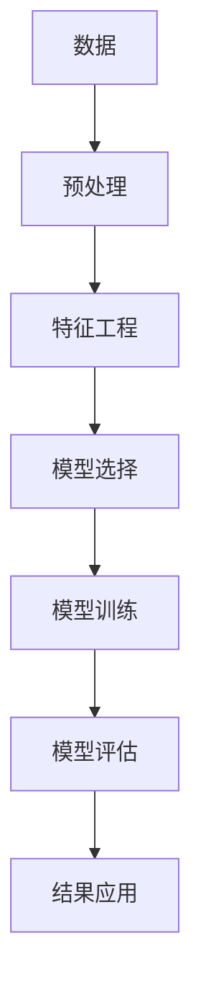

                 

# 如何将模型思维应用于实际管理

## 1. 背景介绍

### 1.1 问题由来

随着人工智能技术的飞速发展，模型思维（Model Thinking）已经成为一种重要的思维方式和工具。在企业管理中，模型思维可以辅助决策、优化流程、提升效率，从而帮助企业更好地适应复杂多变的市场环境。然而，在实际管理中，模型思维的运用仍然面临诸多挑战，例如模型的选择、参数的优化、结果的解读等。本文将从模型思维的基本概念、核心算法原理、具体操作步骤等方面，深入探讨如何将模型思维应用于实际管理。

### 1.2 问题核心关键点

模型思维在企业管理中的应用，主要涉及以下几个核心关键点：

1. **模型选择**：选择合适的模型进行预测或优化。
2. **数据处理**：对数据进行清洗、特征提取等预处理，提高模型效果。
3. **模型训练**：通过优化算法训练模型，使其拟合数据。
4. **模型评估**：对训练好的模型进行性能评估，确保其有效性。
5. **结果应用**：将模型输出的结果应用于实际管理决策中。

本文将围绕这些关键点，系统介绍如何将模型思维应用于企业管理。

## 2. 核心概念与联系

### 2.1 核心概念概述

在企业管理中，模型思维主要涉及以下核心概念：

- **模型（Model）**：用于描述系统或流程的数学或计算模型。模型可以用于预测、优化、模拟等。
- **数据（Data）**：模型的输入，用于训练和测试模型。
- **训练（Training）**：通过优化算法调整模型参数，使其更好地拟合数据。
- **评估（Evaluation）**：通过指标评估模型性能，确保其有效性。
- **应用（Application）**：将模型应用于实际问题，提供决策支持。

这些概念通过一系列的步骤和算法，相互联系，共同构成模型思维在企业管理中的应用框架。

### 2.2 核心概念原理和架构的 Mermaid 流程图



这个流程图展示了模型思维在企业管理中的主要流程，每个步骤都有其重要的作用。

## 3. 核心算法原理 & 具体操作步骤

### 3.1 算法原理概述

模型思维在企业管理中的应用，本质上是利用模型对数据进行建模和预测，从而辅助决策和优化。常见的模型包括回归模型、分类模型、聚类模型等。在模型构建和训练过程中，通常需要解决以下几个问题：

1. **模型选择**：选择最适合业务问题的模型。
2. **数据准备**：对原始数据进行清洗和预处理，提高模型训练效果。
3. **模型训练**：通过优化算法调整模型参数，使其更好地拟合数据。
4. **模型评估**：评估模型的性能，确保其准确性和可靠性。
5. **结果应用**：将模型应用于实际管理决策中，提供决策支持。

### 3.2 算法步骤详解

#### 3.2.1 模型选择

选择合适的模型是应用模型思维的第一步。根据业务问题，可以选择以下几类模型：

- **回归模型**：用于预测数值型变量，如销售预测、成本控制等。
- **分类模型**：用于预测分类变量，如客户分类、产品分类等。
- **聚类模型**：用于将数据分成不同的组别，如市场细分、客户群体划分等。

例如，在销售预测中，可以选择线性回归模型；在客户分类中，可以选择逻辑回归模型。

#### 3.2.2 数据处理

数据处理是模型应用中的关键步骤。数据处理通常包括以下几个步骤：

1. **数据清洗**：去除噪声、缺失值、异常值等，确保数据质量。
2. **特征提取**：从原始数据中提取有用的特征，提高模型效果。
3. **特征选择**：选择对模型影响最大的特征，减少模型复杂度。

例如，在销售预测中，可以将历史销售数据、促销活动、季节性因素等作为特征。

#### 3.2.3 模型训练

模型训练是通过优化算法调整模型参数的过程。常用的优化算法包括梯度下降、随机梯度下降、Adam等。

例如，在销售预测中，可以使用梯度下降算法调整线性回归模型的参数。

#### 3.2.4 模型评估

模型评估是通过指标评估模型性能的过程。常用的评估指标包括均方误差、准确率、召回率等。

例如，在销售预测中，可以使用均方误差评估模型的预测精度。

#### 3.2.5 结果应用

结果应用是将模型应用于实际管理决策的过程。根据模型的输出，制定相应的决策和行动方案。

例如，在销售预测中，可以根据模型的输出，调整销售策略、库存管理等。

### 3.3 算法优缺点

模型思维在企业管理中的应用，具有以下优点：

1. **科学决策**：利用数据和模型辅助决策，提高决策的科学性和准确性。
2. **效率提升**：通过优化流程和资源配置，提升企业运营效率。
3. **风险控制**：通过预测和预警，控制业务风险，避免损失。

同时，模型思维也存在一些缺点：

1. **数据依赖**：模型的效果依赖于数据的质量和代表性，数据不足或数据质量不高，会影响模型效果。
2. **模型复杂性**：复杂的模型容易过拟合，需要平衡模型的复杂度和有效性。
3. **结果解读**：模型输出的结果需要人工解读和解释，可能导致理解误差。

### 3.4 算法应用领域

模型思维在企业管理中的应用，主要包括以下几个领域：

1. **销售预测**：预测未来的销售趋势，制定销售策略。
2. **库存管理**：预测库存水平，优化库存控制。
3. **客户关系管理**：分析客户行为，制定客户关系策略。
4. **供应链优化**：优化供应链流程，提高供应链效率。
5. **人力资源管理**：预测人力资源需求，制定招聘和培训策略。

## 4. 数学模型和公式 & 详细讲解 & 举例说明

### 4.1 数学模型构建

在企业管理中，常见的数学模型包括线性回归模型、逻辑回归模型、决策树模型等。这里以线性回归模型为例，介绍数学模型的构建。

设样本数据集为 $D = \{(x_i, y_i)\}_{i=1}^n$，其中 $x_i$ 为自变量， $y_i$ 为因变量， $n$ 为样本数。线性回归模型的形式为：

$$
y_i = \theta_0 + \theta_1 x_i + \epsilon_i
$$

其中， $\theta_0$ 和 $\theta_1$ 为模型的参数， $\epsilon_i$ 为误差项。

### 4.2 公式推导过程

线性回归模型的最小二乘估计（Ordinary Least Squares, OLS）可以通过以下公式计算模型的参数 $\theta_0$ 和 $\theta_1$：

$$
\theta_0 = \frac{1}{n} \sum_{i=1}^n y_i - \frac{1}{n} \sum_{i=1}^n x_i \hat{\theta}_1
$$

$$
\theta_1 = \frac{1}{n} \sum_{i=1}^n (x_i - \bar{x})(y_i - \bar{y})
$$

其中， $\bar{x}$ 和 $\bar{y}$ 分别为 $x$ 和 $y$ 的均值。

### 4.3 案例分析与讲解

假设某电商平台的历史销售数据如下：

| 日期         | 销售额（元） |
|-------------|------------|
| 2021-01-01   | 10000      |
| 2021-01-02   | 15000      |
| 2021-01-03   | 12000      |
| ...         | ...        |

利用线性回归模型预测2021年1月的销售额，步骤如下：

1. **数据预处理**：将日期转换为数值型变量，如1月1日为1，1月2日为2，...。
2. **特征提取**：将日期作为自变量 $x_i$，销售额作为因变量 $y_i$。
3. **模型训练**：计算模型参数 $\theta_0$ 和 $\theta_1$。
4. **模型评估**：计算模型的预测精度。

## 5. 项目实践：代码实例和详细解释说明

### 5.1 开发环境搭建

在进行模型思维的应用实践前，需要先准备好开发环境。以下是在Python中进行模型思维实践的开发环境搭建流程：

1. 安装Python：从官网下载并安装Python，选择合适的版本。
2. 安装Pandas：用于数据处理和分析。
3. 安装Scikit-Learn：用于机器学习模型的训练和评估。
4. 安装Matplotlib：用于绘制数据可视化图表。
5. 安装Seaborn：用于绘制更加美观的数据可视化图表。

完成上述步骤后，即可在Python中进行模型思维的实践。

### 5.2 源代码详细实现

以下是一个简单的线性回归模型应用实例，用于预测电商平台1月的销售额：

```python
import pandas as pd
import numpy as np
import matplotlib.pyplot as plt
import seaborn as sns
from sklearn.linear_model import LinearRegression

# 数据预处理
df = pd.read_csv('sales_data.csv')
df['date'] = pd.to_datetime(df['date'])
df['month'] = df['date'].dt.month
df['day'] = df['date'].dt.day
df['weekday'] = df['date'].dt.weekday
df = df.drop(['date'], axis=1)

# 特征工程
features = ['sales', 'month', 'day', 'weekday']
X = df[features]
y = df['sales']

# 模型训练
model = LinearRegression()
model.fit(X, y)

# 模型评估
train_scores = model.score(X, y)
print(f'Train Score: {train_scores:.3f}')

# 结果应用
pred = model.predict([[1, 1, 1, 1]])[0]
print(f'Predicted Sales: {pred:.2f}')
```

### 5.3 代码解读与分析

**数据预处理**：
- 将日期转换为数值型变量，以便模型处理。
- 提取日期的月、日、周等特征。
- 删除不需要的日期列。

**特征工程**：
- 选择销售额、月、日、周等为模型的特征。

**模型训练**：
- 使用线性回归模型训练模型。

**模型评估**：
- 计算模型在训练集上的分数。

**结果应用**：
- 预测1月的销售额。

## 6. 实际应用场景

### 6.1 销售预测

销售预测是企业最常见的应用场景之一。利用模型思维，可以预测未来的销售趋势，帮助企业制定销售策略。

例如，某电商平台的销售数据如下：

| 日期         | 销售额（元） |
|-------------|------------|
| 2021-01-01   | 10000      |
| 2021-01-02   | 15000      |
| 2021-01-03   | 12000      |
| ...         | ...        |

利用线性回归模型，可以预测1月的销售额：

1. **数据预处理**：将日期转换为数值型变量，如1月1日为1，1月2日为2，...。
2. **特征提取**：将日期作为自变量 $x_i$，销售额作为因变量 $y_i$。
3. **模型训练**：计算模型参数 $\theta_0$ 和 $\theta_1$。
4. **模型评估**：计算模型的预测精度。
5. **结果应用**：根据预测结果，调整销售策略，如增加促销活动、优化库存管理等。

### 6.2 库存管理

库存管理是企业的重要环节，利用模型思维，可以优化库存控制，减少库存积压和缺货现象。

例如，某企业的历史库存数据如下：

| 日期         | 库存量（件） |
|-------------|------------|
| 2021-01-01   | 500        |
| 2021-01-02   | 600        |
| 2021-01-03   | 550        |
| ...         | ...        |

利用线性回归模型，可以预测未来的库存量：

1. **数据预处理**：将日期转换为数值型变量，如1月1日为1，1月2日为2，...。
2. **特征提取**：将日期作为自变量 $x_i$，库存量作为因变量 $y_i$。
3. **模型训练**：计算模型参数 $\theta_0$ 和 $\theta_1$。
4. **模型评估**：计算模型的预测精度。
5. **结果应用**：根据预测结果，调整采购和生产计划，确保库存水平在合理范围内。

### 6.3 客户关系管理

客户关系管理是企业的重要任务之一，利用模型思维，可以分析客户行为，制定客户关系策略。

例如，某企业的客户数据如下：

| 客户ID | 购买次数 | 购买金额 |
|--------|----------|----------|
| A      | 10       | 5000     |
| B      | 5        | 3000     |
| C      | 8        | 4000     |
| ...    | ...      | ...      |

利用分类模型，可以预测客户的购买行为：

1. **数据预处理**：将客户ID、购买次数、购买金额等作为特征。
2. **特征工程**：选择合适的特征，如购买次数、购买金额等。
3. **模型训练**：选择合适的分类模型，如逻辑回归、随机森林等。
4. **模型评估**：计算模型的准确率、召回率等指标。
5. **结果应用**：根据预测结果，制定客户关系策略，如针对高价值客户进行特别关怀等。

### 6.4 未来应用展望

未来，模型思维在企业管理中的应用将更加广泛和深入。以下是一些未来的应用展望：

1. **智能客服**：利用自然语言处理和机器学习，提升客户服务质量。
2. **供应链优化**：利用机器学习优化供应链流程，提高供应链效率。
3. **财务分析**：利用机器学习预测财务指标，制定财务策略。
4. **人力资源管理**：利用机器学习预测人力资源需求，制定招聘和培训策略。
5. **市场营销**：利用机器学习分析市场数据，制定营销策略。

## 7. 工具和资源推荐

### 7.1 学习资源推荐

为了帮助企业管理者系统掌握模型思维的理论基础和实践技巧，以下是一些优质的学习资源：

1. 《Python数据科学手册》：介绍Python数据科学基础和机器学习实践。
2. 《机器学习实战》：介绍机器学习的基本原理和实现方法。
3. 《统计学习方法》：介绍机器学习的基本算法和理论基础。
4. Coursera上的《机器学习》课程：由斯坦福大学教授Andrew Ng讲授的机器学习课程。
5. Kaggle平台：提供大量数据集和机器学习竞赛，帮助学习者实践和提升技能。

通过对这些资源的学习实践，相信企业管理者一定能够快速掌握模型思维的精髓，并用于解决实际的业务问题。

### 7.2 开发工具推荐

为了提高模型思维的开发效率，以下是几款常用的开发工具：

1. Jupyter Notebook：用于编写和运行Python代码，支持多种数据处理和可视化工具。
2. Google Colab：免费的在线Jupyter Notebook环境，提供GPU/TPU算力，方便快速实验。
3. Visual Studio Code：支持多种语言和框架，提供丰富的扩展和插件，支持代码编写和调试。
4. PyCharm：提供完整的开发环境，支持多种语言和框架，支持代码编写和调试。
5. Anacoda：Python环境管理工具，方便安装和管理Python环境和库。

合理利用这些工具，可以显著提升模型思维的开发效率，加快创新迭代的步伐。

### 7.3 相关论文推荐

模型思维在企业管理中的应用，是一个活跃的研究领域。以下是几篇奠基性的相关论文，推荐阅读：

1. 《A Study of Linear Regression Models for Sales Forecasting》：介绍线性回归模型在销售预测中的应用。
2. 《Customer Segmentation Using Clustering Algorithms》：介绍聚类算法在客户细分中的应用。
3. 《Time Series Analysis in Business Analytics》：介绍时间序列分析在业务分析中的应用。
4. 《Machine Learning in Supply Chain Management》：介绍机器学习在供应链管理中的应用。
5. 《A Survey of Machine Learning in Human Resources Management》：介绍机器学习在人力资源管理中的应用。

这些论文代表了大模型思维在企业管理中的应用方向，通过学习这些前沿成果，可以帮助企业管理者更好地理解模型思维的应用场景和技术细节。

## 8. 总结：未来发展趋势与挑战

### 8.1 总结

本文对模型思维在企业管理中的应用进行了全面系统的介绍。首先阐述了模型思维的基本概念和核心算法原理，明确了模型思维在企业管理中的应用场景和关键步骤。其次，从模型选择、数据处理、模型训练、模型评估、结果应用等几个方面，详细讲解了模型思维的具体操作步骤。最后，探讨了模型思维在实际应用中的优缺点，提出了未来应用的展望。

通过本文的系统梳理，可以看到，模型思维在企业管理中的应用，已经初步显现其巨大潜力，为企业的科学决策和效率提升提供了有力支持。

### 8.2 未来发展趋势

未来，模型思维在企业管理中的应用将呈现以下几个发展趋势：

1. **智能化决策支持**：利用更高级的机器学习模型和算法，提供更准确的决策支持。
2. **实时化决策**：通过实时数据处理和模型训练，提供实时决策支持。
3. **多模态数据融合**：将结构化数据、非结构化数据和实时数据进行融合，提升决策质量。
4. **自动化流程**：利用机器学习自动化业务流程，提高企业运营效率。
5. **个性化服务**：利用机器学习分析客户需求，提供个性化服务。

### 8.3 面临的挑战

尽管模型思维在企业管理中的应用前景广阔，但仍面临诸多挑战：

1. **数据质量**：数据质量不足、数据不完整、数据噪声等问题，会影响模型效果。
2. **模型复杂度**：模型复杂度高、计算资源消耗大，需要平衡模型复杂度和有效性。
3. **结果解读**：模型输出结果需要人工解读和解释，可能导致理解误差。
4. **隐私和安全**：模型应用过程中，需要考虑数据隐私和模型安全性，避免数据泄露和模型滥用。
5. **伦理和合规**：模型应用过程中，需要考虑伦理和合规问题，确保模型公平、透明和可解释。

### 8.4 研究展望

未来，研究者需要在以下几个方面寻求新的突破：

1. **模型选择优化**：研究如何选择最适合业务问题的模型，提高模型效果。
2. **数据处理优化**：研究如何提高数据质量和特征工程效果，提升模型性能。
3. **模型训练优化**：研究如何优化模型训练过程，提高模型训练效率。
4. **模型评估优化**：研究如何优化模型评估方法，确保模型准确性和可靠性。
5. **结果应用优化**：研究如何提高模型结果的解读和应用效果，提升决策质量。

这些研究方向将推动模型思维在企业管理中的应用，提升企业的科学决策和运营效率。

## 9. 附录：常见问题与解答

**Q1：如何选择合适的模型进行预测？**

A: 选择合适的模型需要考虑业务问题的性质和数据的特性。通常可以采用以下步骤：

1. 确定业务问题的类型（回归、分类、聚类等）。
2. 收集和清洗数据，并进行特征工程。
3. 尝试不同的模型，评估其性能，选择效果最好的模型。

**Q2：数据处理过程中需要注意哪些问题？**

A: 数据处理是模型应用中的关键步骤。在数据处理过程中，需要注意以下几个问题：

1. 数据清洗：去除噪声、缺失值、异常值等。
2. 数据归一化：将数据归一化到同一范围内，便于模型处理。
3. 特征工程：选择合适的特征，提取有用的信息。

**Q3：模型训练过程中如何调整参数？**

A: 模型训练过程中，需要调整模型参数以提高模型效果。通常可以采用以下方法：

1. 网格搜索：尝试不同的参数组合，选择效果最好的参数。
2. 随机搜索：在一定范围内随机选择参数，选择效果最好的参数。
3. 贝叶斯优化：利用贝叶斯优化算法，在较小的参数空间内找到最优参数。

**Q4：如何评估模型的性能？**

A: 评估模型的性能需要选择合适的指标。常用的指标包括均方误差、准确率、召回率、F1分数等。

**Q5：模型输出的结果如何应用？**

A: 模型输出的结果需要人工解读和应用。在实际应用中，需要根据模型的输出结果制定相应的决策和行动方案。

通过以上常见问题的解答，希望能帮助企业管理者更好地理解和应用模型思维，提升企业的决策和运营效率。

