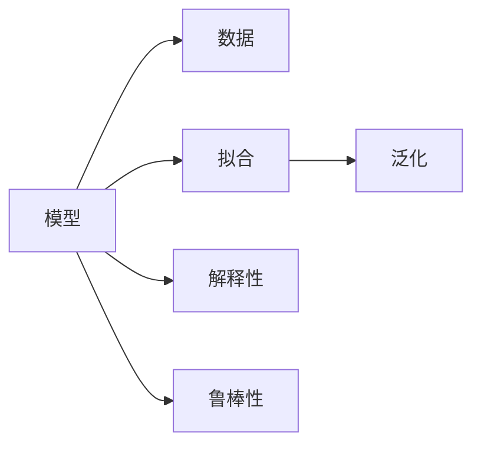

                 

# 如何将模型思维应用于实际管理

在当今快速变化和数据驱动的商业环境中，管理者需要采用新的思维模式和工具来应对日益复杂的挑战。模型思维，即通过构建数学模型来分析和预测未来趋势，已广泛应用于金融、供应链、市场营销等多个领域，并取得了显著的成果。然而，将模型思维应用于实际管理仍然面临诸多挑战。本文将系统探讨如何将模型思维应用于实际管理，通过核心概念、算法原理、具体操作和实际应用场景等方面，全面解析模型思维的核心要素和应用策略，并提供技术实现上的详细指导。

## 1. 背景介绍

### 1.1 问题由来

在现代商业环境中，管理者需要处理的信息量巨大且复杂多变，传统的经验判断和直觉决策已无法满足要求。模型的出现为这一问题提供了新的解决方案。模型思维指的是通过数学模型来描述和预测现实世界中的复杂现象，通过数据驱动的定量分析来辅助决策。模型思维的应用不仅提升了决策的准确性和效率，还在风险评估、资源配置、市场营销等领域产生了重大影响。

然而，模型思维在实际管理中的应用仍存在诸多困难。首先，模型的构建需要专业的数学和统计学知识，这对大部分管理者而言是个难题。其次，模型的应用需要大量的数据，而数据的获取和处理往往耗时耗力。最后，模型的复杂性也可能导致理解和使用上的困难。

### 1.2 问题核心关键点

为了更好地解决这些问题，本文将深入探讨模型思维的核心要素，包括：
- 模型的定义与构建
- 模型的评估与优化
- 模型的应用与解释

这些要素将帮助管理者更好地理解和应用模型思维，从而提升管理效率和决策质量。

## 2. 核心概念与联系

### 2.1 核心概念概述

为了深入理解模型思维的原理和应用，本节将介绍几个关键概念：

- **模型（Model）**：描述现实世界现象的数学表达式。模型可以是线性回归模型、逻辑回归模型、神经网络等，具有不同的结构和参数。

- **数据（Data）**：用于训练和测试模型的输入，可以是实验数据、调查数据、市场数据等。

- **拟合（Fit）**：通过训练数据对模型参数进行优化，使其能够更好地拟合数据，预测未知数据。

- **泛化（Generalization）**：模型在新数据上的表现能力。泛化能力强的模型能够更好地适应新的数据和场景。

- **解释性（Interpretability）**：模型的可解释程度，即管理者能否理解模型的工作机制和输出结果。

- **鲁棒性（Robustness）**：模型面对异常值和噪声数据的鲁棒性，即模型在不同数据分布下的表现稳定性。

这些概念之间的联系可以通过以下Mermaid流程图来展示：



这个流程图展示了几大核心概念之间的逻辑关系：模型通过对数据进行拟合，预测新数据，同时具备泛化能力和解释性，以应对不同场景和噪声数据。

## 3. 核心算法原理 & 具体操作步骤

### 3.1 算法原理概述

模型思维的核心在于通过数学模型来描述和预测现实世界中的复杂现象。模型构建一般包括以下几个步骤：

1. **模型选择**：根据问题性质选择合适的数学模型，如线性回归、逻辑回归、神经网络等。
2. **数据准备**：收集和处理用于训练和测试模型的数据，确保数据质量和代表性。
3. **模型训练**：使用训练数据对模型参数进行优化，使得模型能够更好地拟合数据。
4. **模型评估**：通过测试数据评估模型性能，选择最优模型。
5. **模型应用**：将训练好的模型应用于实际场景，进行预测和决策。

### 3.2 算法步骤详解

#### 3.2.1 模型选择

模型选择是模型构建的第一步。选择错误的模型将导致错误的预测结果。以下是几种常见的模型及其适用场景：

- **线性回归**：适用于预测连续变量，如销售量、收入等。
- **逻辑回归**：适用于分类问题，如是否购买、是否流失等。
- **决策树**：适用于复杂分类和回归问题，可提供可解释的决策路径。
- **随机森林**：提升决策树的泛化能力和鲁棒性。
- **神经网络**：适用于大规模、高维数据的复杂问题，如图像识别、语音识别等。

#### 3.2.2 数据准备

数据准备是模型构建的重要步骤。以下是数据准备的基本步骤：

1. **数据收集**：收集相关数据，确保数据的完整性和准确性。
2. **数据清洗**：处理缺失值、异常值和噪声数据，确保数据质量。
3. **特征工程**：从原始数据中提取有意义的特征，提升模型性能。

#### 3.2.3 模型训练

模型训练是模型构建的核心步骤。以下是模型训练的基本流程：

1. **分割数据集**：将数据集分为训练集和测试集，确保模型评估的公平性。
2. **选择算法**：选择适当的优化算法，如梯度下降、随机梯度下降等。
3. **设置参数**：设置模型的超参数，如学习率、正则化系数等。
4. **模型拟合**：使用训练数据对模型参数进行优化，使得模型能够更好地拟合数据。

#### 3.2.4 模型评估

模型评估是模型构建的关键步骤。以下是模型评估的基本流程：

1. **选择指标**：根据问题性质选择适当的评估指标，如均方误差、准确率、召回率等。
2. **计算指标**：使用测试数据计算评估指标，评估模型性能。
3. **模型优化**：根据评估结果优化模型参数，提升模型性能。

#### 3.2.5 模型应用

模型应用是模型构建的最终目标。以下是模型应用的基本流程：

1. **模型部署**：将训练好的模型部署到实际应用场景中。
2. **数据输入**：将实际数据输入模型，进行预测和决策。
3. **结果输出**：根据模型预测结果进行决策，优化管理流程。

### 3.3 算法优缺点

模型思维在实际管理中的应用具有以下优点：

1. **科学性**：通过数据驱动的定量分析，提升决策的科学性和准确性。
2. **效率性**：模型能够处理大量数据，快速提供预测结果，提升决策效率。
3. **可重复性**：模型构建和应用过程可重复，便于进行优化和改进。

同时，模型思维也存在以下缺点：

1. **复杂性**：模型的构建和应用需要专业知识，对管理者而言有一定的门槛。
2. **数据依赖**：模型的效果依赖于数据的质量和代表性，数据获取和处理可能耗时耗力。
3. **解释性不足**：部分模型（如神经网络）的内部工作机制难以解释，管理者难以理解模型输出。

### 3.4 算法应用领域

模型思维在实际管理中的应用已经广泛涉及多个领域，如金融、供应链、市场营销等。以下是几个典型应用场景：

#### 3.4.1 金融风险管理

金融风险管理是模型思维的重要应用之一。通过构建信用评分模型、风险评估模型等，金融机构可以更好地评估客户信用风险，提升风险管理能力。

#### 3.4.2 供应链优化

供应链优化是模型思维的另一重要应用。通过构建需求预测模型、库存管理模型等，企业可以更好地预测市场需求，优化库存和物流，提升供应链效率。

#### 3.4.3 市场营销分析

市场营销分析是模型思维的典型应用。通过构建客户细分模型、市场分析模型等，企业可以更好地理解市场需求，制定精准的营销策略，提升市场竞争力。

## 4. 数学模型和公式 & 详细讲解 & 举例说明

### 4.1 数学模型构建

模型的构建通常包括以下几个步骤：

1. **模型定义**：定义模型的输入、输出和参数。
2. **目标函数**：定义模型的优化目标，如均方误差、交叉熵等。
3. **约束条件**：定义模型的约束条件，如正则化条件、非负约束等。

#### 4.1.1 线性回归模型

线性回归模型是最常见的模型之一，用于预测连续变量。其数学表达式如下：

$$
y = \beta_0 + \beta_1 x_1 + \beta_2 x_2 + \ldots + \beta_n x_n + \epsilon
$$

其中，$y$ 为预测变量，$x_i$ 为输入变量，$\beta_i$ 为模型参数，$\epsilon$ 为误差项。

#### 4.1.2 逻辑回归模型

逻辑回归模型用于分类问题，其数学表达式如下：

$$
P(y=1|x) = \frac{1}{1+e^{-\beta_0 - \beta_1 x_1 - \beta_2 x_2 - \ldots - \beta_n x_n}}
$$

其中，$P(y=1|x)$ 为输入 $x$ 下 $y=1$ 的概率。

### 4.2 公式推导过程

#### 4.2.1 线性回归模型的梯度下降

线性回归模型的梯度下降算法如下：

$$
\theta_j = \theta_j - \alpha \frac{1}{m} \sum_{i=1}^m (y^{(i)} - \hat{y}^{(i)}) x_j^{(i)}
$$

其中，$\theta_j$ 为模型参数，$\alpha$ 为学习率，$y^{(i)}$ 为真实值，$\hat{y}^{(i)}$ 为预测值，$x_j^{(i)}$ 为输入变量。

#### 4.2.2 逻辑回归模型的梯度下降

逻辑回归模型的梯度下降算法如下：

$$
\theta_j = \theta_j - \alpha \frac{1}{m} \sum_{i=1}^m (y^{(i)} - \hat{y}^{(i)}) x_j^{(i)}
$$

其中，$\theta_j$ 为模型参数，$\alpha$ 为学习率，$y^{(i)}$ 为真实值，$\hat{y}^{(i)}$ 为预测值，$x_j^{(i)}$ 为输入变量。

### 4.3 案例分析与讲解

#### 4.3.1 信用评分模型

信用评分模型是金融风险管理的典型应用。通过构建信用评分模型，银行可以更好地评估客户信用风险，制定贷款策略。以下是信用评分模型的构建过程：

1. **数据准备**：收集客户的信用数据，包括收入、负债、历史支付记录等。
2. **特征工程**：提取有意义的特征，如收入比、负债比、逾期记录等。
3. **模型选择**：选择逻辑回归模型。
4. **模型训练**：使用历史数据训练模型，优化模型参数。
5. **模型评估**：使用测试数据评估模型性能，选择最优模型。
6. **模型应用**：将训练好的模型应用于新客户的信用评估。

#### 4.3.2 需求预测模型

需求预测模型是供应链优化的典型应用。通过构建需求预测模型，企业可以更好地预测市场需求，优化库存和物流。以下是需求预测模型的构建过程：

1. **数据准备**：收集历史销售数据，包括季节性因素、促销活动等。
2. **特征工程**：提取有意义的特征，如季节性因素、促销活动、节假日等。
3. **模型选择**：选择ARIMA模型。
4. **模型训练**：使用历史数据训练模型，优化模型参数。
5. **模型评估**：使用测试数据评估模型性能，选择最优模型。
6. **模型应用**：将训练好的模型应用于新产品的需求预测。

## 5. 项目实践：代码实例和详细解释说明

### 5.1 开发环境搭建

在进行模型构建和应用实践前，我们需要准备好开发环境。以下是使用Python进行模型构建和应用的环境配置流程：

1. 安装Anaconda：从官网下载并安装Anaconda，用于创建独立的Python环境。

2. 创建并激活虚拟环境：
```bash
conda create -n model-env python=3.8 
conda activate model-env
```

3. 安装Scikit-learn、Pandas、NumPy等必要库：
```bash
pip install scikit-learn pandas numpy
```

4. 安装可视化工具：
```bash
pip install matplotlib seaborn
```

5. 安装TensorFlow或PyTorch等深度学习框架：
```bash
pip install tensorflow==2.8
# 或
pip install torch
```

完成上述步骤后，即可在`model-env`环境中开始模型构建和应用实践。

### 5.2 源代码详细实现

下面我们以信用评分模型为例，给出使用Scikit-learn进行模型构建的PyTorch代码实现。

首先，定义数据处理函数：

```python
import pandas as pd
from sklearn.model_selection import train_test_split

def load_data(path):
    data = pd.read_csv(path)
    X = data.drop('y', axis=1)
    y = data['y']
    return X, y

def split_data(X, y, test_size=0.2, random_state=42):
    X_train, X_test, y_train, y_test = train_test_split(X, y, test_size=test_size, random_state=random_state)
    return X_train, X_test, y_train, y_test

X, y = load_data('credit_data.csv')
X_train, X_test, y_train, y_test = split_data(X, y)
```

然后，定义模型和评估函数：

```python
from sklearn.linear_model import LogisticRegression
from sklearn.metrics import accuracy_score, precision_score, recall_score, f1_score

model = LogisticRegression()
model.fit(X_train, y_train)

y_pred = model.predict(X_test)
print('Accuracy:', accuracy_score(y_test, y_pred))
print('Precision:', precision_score(y_test, y_pred))
print('Recall:', recall_score(y_test, y_pred))
print('F1 Score:', f1_score(y_test, y_pred))
```

最后，启动训练流程并在测试集上评估：

```python
from sklearn.model_selection import cross_val_score

score = cross_val_score(model, X, y, cv=5)
print('Cross-validation Score:', score.mean())
```

以上就是使用Scikit-learn对信用评分模型进行构建的完整代码实现。可以看到，通过Scikit-learn，模型构建过程变得简洁高效。

### 5.3 代码解读与分析

让我们再详细解读一下关键代码的实现细节：

**load_data函数**：
- 定义了数据加载函数，从指定路径读取数据，并返回特征矩阵和标签向量。

**split_data函数**：
- 定义了数据分割函数，将数据集分为训练集和测试集。

**模型定义和训练**：
- 选择Logistic回归模型，使用训练集数据进行训练。

**评估函数**：
- 使用测试集数据进行模型评估，计算准确率、精确度、召回率和F1分数。

**交叉验证**：
- 使用交叉验证技术，评估模型在不同数据集上的表现，取平均值作为最终评估结果。

可以看到，Scikit-learn提供的API使得模型构建和评估过程变得非常简单，开发者可以专注于模型设计和优化。

## 6. 实际应用场景

### 6.1 金融风险管理

金融风险管理是模型思维的重要应用之一。通过构建信用评分模型、风险评估模型等，金融机构可以更好地评估客户信用风险，提升风险管理能力。

在技术实现上，可以收集客户的信用数据，包括收入、负债、历史支付记录等，并构建线性回归或逻辑回归模型进行预测和风险评估。对于新客户，将输入数据输入模型进行评分，根据评分结果进行风险管理决策。

### 6.2 供应链优化

供应链优化是模型思维的另一重要应用。通过构建需求预测模型、库存管理模型等，企业可以更好地预测市场需求，优化库存和物流，提升供应链效率。

在技术实现上，可以收集历史销售数据，包括季节性因素、促销活动等，并构建ARIMA或神经网络模型进行需求预测。将预测结果应用于库存和物流的优化，提升供应链整体效率。

### 6.3 市场营销分析

市场营销分析是模型思维的典型应用。通过构建客户细分模型、市场分析模型等，企业可以更好地理解市场需求，制定精准的营销策略，提升市场竞争力。

在技术实现上，可以收集客户历史行为数据，包括浏览记录、购买记录等，并构建聚类模型或关联规则模型进行客户细分。将细分结果应用于市场细分和营销策略的制定，提升市场竞争力。

### 6.4 未来应用展望

随着模型思维的不断发展，其在实际管理中的应用将更加广泛和深入。未来，模型思维将与更多新兴技术相结合，形成更强大的解决方案：

1. **大数据分析**：结合大数据技术，提升数据的收集和处理能力，提供更全面的数据分析支持。
2. **机器学习**：结合机器学习技术，提升模型的预测能力和泛化能力，提供更准确的预测结果。
3. **深度学习**：结合深度学习技术，提升模型的复杂度和表达能力，提供更精细的预测和分析。
4. **自然语言处理**：结合自然语言处理技术，提升模型的理解能力和互动性，提供更智能的用户交互。
5. **物联网**：结合物联网技术，提升数据的收集和传输能力，提供更全面的数据分析支持。

这些技术的融合将进一步提升模型思维的预测能力和应用范围，为实际管理提供更加科学和智能的解决方案。

## 7. 工具和资源推荐

### 7.1 学习资源推荐

为了帮助开发者系统掌握模型思维的理论基础和实践技巧，这里推荐一些优质的学习资源：

1. 《机器学习实战》系列书籍：由著名机器学习专家撰写，详细介绍了机器学习的基本概念和实践方法。
2. Coursera《机器学习》课程：由斯坦福大学开设，提供系统的机器学习理论和实践课程。
3. 《深度学习》书籍：由深度学习领域知名专家撰写，全面介绍了深度学习的基本概念和实践方法。
4. PyTorch官方文档：提供全面的深度学习框架PyTorch的使用指南和API文档。
5. TensorFlow官方文档：提供全面的深度学习框架TensorFlow的使用指南和API文档。

通过对这些资源的学习实践，相信你一定能够快速掌握模型思维的核心要素和应用策略，并用于解决实际的业务问题。

### 7.2 开发工具推荐

高效的开发离不开优秀的工具支持。以下是几款用于模型构建和应用开发的常用工具：

1. PyTorch：基于Python的开源深度学习框架，灵活动态的计算图，适合快速迭代研究。

2. TensorFlow：由Google主导开发的开源深度学习框架，生产部署方便，适合大规模工程应用。

3. Scikit-learn：基于Python的开源机器学习库，提供丰富的算法和工具支持，适合快速原型开发。

4. Jupyter Notebook：交互式的编程环境，支持Python、R等多种语言，适合数据科学研究和模型开发。

5. Tableau：数据可视化工具，支持多种数据源，适合数据探索和报告制作。

合理利用这些工具，可以显著提升模型构建和应用开发效率，加快创新迭代的步伐。

### 7.3 相关论文推荐

模型思维的研究源于学界的持续研究。以下是几篇奠基性的相关论文，推荐阅读：

1. KDD 2010最佳论文：《A New Method for Classifying Short Texts in E-Commerce Web Services Using Ensemble Models》。
2. JMLR 2015论文：《Deep Learning for Healthcare and Medicine》。
3. PNAS 2016论文：《The Google AI Lab Workflow》。
4. NeurIPS 2019论文：《Graph Neural Networks》。
5. ICLR 2020论文：《Deformable Transformer》。

这些论文代表了大数据和深度学习技术的发展脉络。通过学习这些前沿成果，可以帮助研究者把握学科前进方向，激发更多的创新灵感。

## 8. 总结：未来发展趋势与挑战

### 8.1 总结

本文对模型思维在实际管理中的应用进行了全面系统的介绍。首先阐述了模型思维的研究背景和意义，明确了模型思维在提升决策科学性和效率方面的独特价值。其次，从原理到实践，详细讲解了模型构建、评估和应用的全过程，提供了模型构建和应用开发的完整代码实例。同时，本文还广泛探讨了模型思维在金融风险管理、供应链优化、市场营销分析等多个行业领域的应用前景，展示了模型思维的广泛应用潜力。此外，本文精选了模型思维学习的各类资源，力求为读者提供全方位的技术指引。

通过本文的系统梳理，可以看到，模型思维在现代管理中的应用已经深入到多个领域，为管理者提供了强大的决策支持。然而，模型的构建和应用仍然面临诸多挑战，需要从数据、算法、工程、业务等多个维度协同发力，才能真正实现人工智能技术在实际管理中的落地。

### 8.2 未来发展趋势

展望未来，模型思维在实际管理中的应用将呈现以下几个发展趋势：

1. **数据驱动**：随着大数据技术的发展，模型思维将更加依赖于数据驱动，提供更全面、更准确的预测和分析。
2. **自动化**：随着自动化技术的发展，模型构建和应用过程将更加自动化，提升模型开发效率。
3. **可解释性**：随着解释性技术的发展，模型输出将更加可解释，便于管理者理解和使用。
4. **跨领域融合**：模型思维将与其他新兴技术相结合，形成更强大的解决方案，提升应用效果。
5. **人工智能**：随着人工智能技术的发展，模型思维将更加智能化，提升决策效率和精度。

这些趋势凸显了模型思维在实际管理中的广阔前景。这些方向的探索发展，必将进一步提升模型思维的预测能力和应用范围，为管理者提供更加科学、智能的决策支持。

### 8.3 面临的挑战

尽管模型思维在实际管理中的应用已经取得了显著成效，但在迈向更加智能化、普适化应用的过程中，仍面临诸多挑战：

1. **数据获取**：模型的效果依赖于数据的质量和代表性，获取高质量数据仍是一个挑战。
2. **模型复杂性**：部分模型（如深度神经网络）的复杂性难以解释，管理者难以理解模型输出。
3. **技术门槛**：模型的构建和应用需要专业知识和技能，对管理者而言有一定的门槛。
4. **实际应用**：模型在实际应用中的表现往往不如预期，需要进行优化和改进。
5. **技术发展**：模型思维需要不断跟踪最新的技术发展，保持技术的先进性。

这些挑战需要管理者不断学习和优化，以适应模型思维在实际管理中的应用。

### 8.4 研究展望

面对模型思维面临的诸多挑战，未来的研究需要在以下几个方面寻求新的突破：

1. **数据质量提升**：通过数据清洗和特征工程，提升数据质量，提供更准确的数据支持。
2. **模型可解释性**：通过模型解释性技术，提升模型的可解释性，便于管理者理解和使用。
3. **自动化技术**：通过自动化技术，提升模型构建和应用的自动化程度，提升开发效率。
4. **跨领域融合**：通过跨领域融合，提升模型的泛化能力和应用范围，提供更全面、更精准的预测和分析。
5. **人工智能发展**：通过人工智能技术，提升模型的智能化水平，提供更科学、更智能的决策支持。

这些研究方向的探索，必将引领模型思维在实际管理中的应用迈向更高的台阶，为管理者提供更加科学、智能的决策支持。

## 9. 附录：常见问题与解答

**Q1: 模型思维在实际管理中有哪些应用场景？**

A: 模型思维在实际管理中的应用非常广泛，以下是几个典型应用场景：

1. **金融风险管理**：通过构建信用评分模型、风险评估模型等，金融机构可以更好地评估客户信用风险，提升风险管理能力。
2. **供应链优化**：通过构建需求预测模型、库存管理模型等，企业可以更好地预测市场需求，优化库存和物流，提升供应链效率。
3. **市场营销分析**：通过构建客户细分模型、市场分析模型等，企业可以更好地理解市场需求，制定精准的营销策略，提升市场竞争力。
4. **运营管理**：通过构建运营预测模型、生产调度模型等，企业可以更好地预测运营需求，优化生产调度，提升运营效率。

**Q2: 模型思维在实际应用中需要注意哪些问题？**

A: 模型思维在实际应用中需要注意以下几个问题：

1. **数据质量**：模型的效果依赖于数据的质量和代表性，获取高质量数据是关键。
2. **模型解释性**：部分模型（如深度神经网络）的复杂性难以解释，管理者需要理解模型的内部机制。
3. **技术门槛**：模型的构建和应用需要专业知识和技能，管理者需要不断学习和提升。
4. **实际应用**：模型在实际应用中的表现往往不如预期，需要进行优化和改进。
5. **技术发展**：模型思维需要不断跟踪最新的技术发展，保持技术的先进性。

**Q3: 如何提升模型的解释性？**

A: 提升模型的解释性可以从以下几个方面入手：

1. **简化模型**：选择更简单的模型（如逻辑回归），便于理解和解释。
2. **可视化技术**：使用可视化技术（如决策树、LIME等），将模型的决策过程可视化，便于理解。
3. **特征工程**：通过特征工程，选择有意义的特征，提升模型的可解释性。
4. **模型解释性工具**：使用模型解释性工具（如SHAP、LIME等），提供模型的特征贡献度和可解释性。

这些措施可以有效提升模型的可解释性，帮助管理者更好地理解模型输出。

**Q4: 如何在模型构建过程中进行数据清洗和特征工程？**

A: 数据清洗和特征工程是模型构建的重要步骤，以下是几个关键步骤：

1. **数据清洗**：处理缺失值、异常值和噪声数据，确保数据质量。可以使用Pandas库进行数据清洗。
2. **特征选择**：选择有意义的特征，提升模型性能。可以使用Scikit-learn库进行特征选择。
3. **特征工程**：从原始数据中提取有意义的特征，提升模型性能。可以使用特征工程库（如Feature工程 Toolkit）进行特征工程。

通过数据清洗和特征工程，可以提升数据质量和模型性能，为模型构建和应用提供良好的数据基础。

**Q5: 如何评估模型的性能？**

A: 模型性能的评估是模型构建的重要步骤，以下是几个关键指标：

1. **均方误差（MSE）**：用于回归问题的评估指标，表示预测值与真实值之间的平均差异。
2. **均方根误差（RMSE）**：MSE的平方根，用于回归问题的评估指标，表示预测值与真实值之间的平均差异。
3. **准确率（Accuracy）**：用于分类问题的评估指标，表示模型预测正确的样本数占总样本数的比例。
4. **精确度（Precision）**：用于分类问题的评估指标，表示预测为正类的样本中实际为正类的比例。
5. **召回率（Recall）**：用于分类问题的评估指标，表示实际为正类的样本中被预测为正类的比例。
6. **F1分数（F1 Score）**：精确度和召回率的调和平均值，用于分类问题的评估指标。

通过选择合适的评估指标，可以全面评估模型的性能，提升模型效果。

**Q6: 如何提升模型的泛化能力？**

A: 模型的泛化能力是模型性能的关键，以下是几个提升泛化能力的方法：

1. **增加数据量**：通过增加数据量，提升模型的泛化能力。
2. **正则化**：通过L2正则、Dropout等正则化技术，防止模型过拟合。
3. **模型集成**：通过模型集成（如Bagging、Boosting等），提升模型的泛化能力。
4. **交叉验证**：通过交叉验证技术，评估模型在新数据上的表现，提升模型的泛化能力。

通过这些方法，可以提升模型的泛化能力，提升模型在实际应用中的表现。

---

作者：禅与计算机程序设计艺术 / Zen and the Art of Computer Programming

